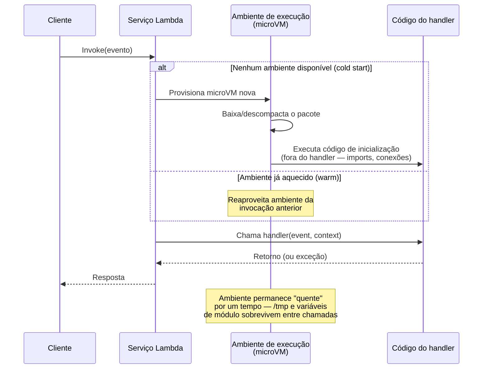
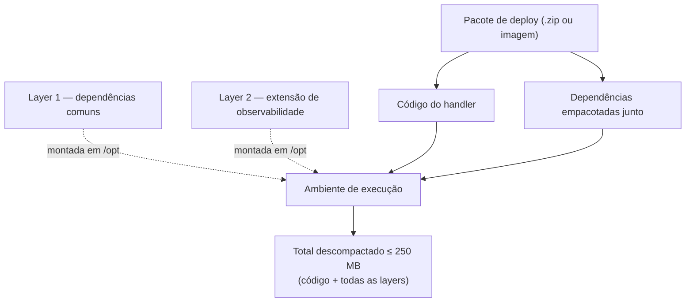

# Anatomia de uma função Lambda

> [!abstract] TL;DR
> Uma função Lambda não é um servidor disfarçado — é um pacote de código (.zip ou imagem de contêiner) associado a três coisas: um **handler** (a função que o runtime chama a cada evento), um **execution role** (a identidade que ela assume para falar com o resto da AWS) e um punhado de **limites de configuração** (memória, tempo, disco temporário) que juntos decidem quanto ela pode fazer antes de ser encerrada. O runtime gerenciado sobe um ambiente de execução, carrega o código uma única vez, e reaproveita esse ambiente para invocações seguintes — o que explica por que `/tmp` às vezes "lembra" do que ficou lá da chamada anterior, e por que isso nunca deveria ser tratado como garantia. Memória e CPU são a mesma variável disfarçada de duas: subir memória sobe CPU proporcionalmente, então uma função lenta às vezes só precisa de mais RAM. E o dial de menor granularidade de todos — o timeout — vem por padrão em míseros 3 segundos, curto demais para quase qualquer coisa real.

## O que é uma função por dentro

Na nota anterior desta trilha, Lambda apareceu pela lente do modelo de execução: pague por invocação, não por servidor ligado. Esta nota abre a caixa. Uma função Lambda, vista de dentro, tem exatamente quatro componentes que precisam existir juntos para ela rodar:

1. **O código** — empacotado como arquivo `.zip` ou como imagem de contêiner, hospedado no próprio Lambda ou no Amazon ECR.
2. **O handler** — o ponto de entrada específico dentro desse código que o runtime chama a cada evento.
3. **O execution role** — a identidade IAM que a função assume para poder chamar outros serviços da AWS.
4. **A configuração de execução** — memória, timeout, variáveis de ambiente, `/tmp`, VPC (se houver) — tudo que molda *como* aquele código roda, sem tocar no código em si.

Nenhum desses quatro é opcional. Faltando qualquer um, `aws lambda create-function` simplesmente recusa o pedido. O resto desta nota percorre cada peça, na ordem em que normalmente se decide sobre elas ao criar uma função nova.

## O handler: o ponto de entrada que o runtime chama

O **handler** é uma convenção de nomeação, não um conceito exclusivo da AWS — toda plataforma FaaS séria tem o equivalente. No Lambda, é a string `arquivo.funcao` que você declara na criação da função, e que diz ao runtime exatamente qual função dentro de qual módulo invocar a cada evento.

Em Python, um handler mínimo tem essa forma — dois parâmetros posicionais, sempre nessa ordem:

```python
# app.py
def handler(event, context):
    nome = event.get("nome", "mundo")
    return {
        "statusCode": 200,
        "body": f"Olá, {nome}!"
    }
```

Registrado como `--handler app.handler`: o nome do arquivo (sem `.py`) seguido de ponto e o nome da função.

Em Node.js, a forma equivalente usa `exports` (ou `export` em módulos ES) e aceita tanto o padrão de retorno direto quanto `async/await`:

```javascript
// app.mjs
export const handler = async (event, context) => {
  const nome = event.nome ?? "mundo";
  return {
    statusCode: 200,
    body: `Olá, ${nome}!`
  };
};
```

Registrado como `--handler app.handler`. A diferença central entre as duas linguagens não é a assinatura — é que o runtime Node.js espera uma `Promise` (implícita em `async`) quando a operação é assíncrona, enquanto o runtime Python aceita retorno síncrono direto ou o uso de bibliotecas assíncronas dentro do próprio código.

```bash
$ aws lambda create-function \
    --function-name saudacao \
    --runtime python3.13 \
    --handler app.handler \
    --role arn:aws:iam::123456789012:role/saudacao-execution-role \
    --zip-file fileb://function.zip
```

> [!info] Fronteira
> O `--role` acima é o **execution role** — a identidade que a função assume para acessar outros serviços da AWS. A mecânica de papéis assumíveis (trust policy, STS, credencial temporária) já foi coberta em profundidade em [[03-Dominios/Tecnologia/Cloud/04 - Identidade e acesso (IAM)/04 - Roles e credenciais temporárias|Roles e credenciais temporárias]], que descreve exatamente este caso — o execution role do Lambda — como exemplo central de "papel de serviço". Esta nota assume esse conhecimento e trata só do que é específico da anatomia da função.

## O objeto `event` e o objeto `context`

Os dois parâmetros do handler carregam informação de natureza completamente diferente, e misturar os dois é um erro comum de quem está começando.

**`event`** é o payload — os dados do que disparou a invocação. O formato exato depende de qual serviço chamou a função: um evento do S3 traz o nome do bucket e da chave do objeto; um evento do API Gateway traz método HTTP, cabeçalhos e corpo da requisição; um evento programado do EventBridge traz um payload quase vazio. `event` é sempre um dicionário/objeto JSON — nunca uma stream, nunca um tipo binário puro.

**`context`** é sempre o mesmo formato, não importa o que disparou a função — é metadado sobre a própria execução, fornecido pelo runtime:

```python
def handler(event, context):
    print(f"Request ID: {context.aws_request_id}")
    print(f"Função: {context.function_name}, versão: {context.function_version}")
    print(f"Memória alocada: {context.memory_limit_in_mb} MB")
    print(f"Tempo restante: {context.get_remaining_time_in_millis()} ms")
    print(f"Log group: {context.log_group_name}, log stream: {context.log_stream_name}")
```

| Campo do `context` | O que carrega |
|---|---|
| `aws_request_id` | Identificador único desta invocação — a chave para correlacionar logs |
| `function_name` / `function_version` | Nome e versão (`$LATEST` ou um número publicado) da função em execução |
| `memory_limit_in_mb` | Memória configurada para a função (não a memória em uso) |
| `get_remaining_time_in_millis()` | Quanto tempo falta antes do timeout cortar a execução — essencial para encerrar trabalho com folga |
| `log_group_name` / `log_stream_name` | Onde o CloudWatch Logs está gravando a saída desta execução |
| `invoked_function_arn` | ARN completo, incluindo alias ou versão, usado na chamada |

`context.get_remaining_time_in_millis()` é o campo mais subutilizado da lista — é o jeito correto de uma função que processa um lote de itens saber, no meio do trabalho, que está ficando sem tempo e deveria parar de pegar itens novos em vez de ser interrompida no meio de uma operação.

> [!tip] Assista: AWS Lambda explicado: O que é e como funciona
> **Canal:** AWS Developers LATAM | **Duração:** ~10min | **Idioma:** PT-BR
>
> A mesma dupla `event`/`context` explicada com outra analogia: o vídeo nomeia o handler como "o ponto de entrada" e reforça a distinção — `event` carrega o que disparou a chamada, `context` carrega informação sobre a própria execução (nome da função, id, tempo até timeout). Trecho de destaque [01:34]: *"O event traz a informação do evento que chamou a função. Já o context contém informações gerais sobre execução, como nome da função, ID da execução e tempo até timeout."*
>
> 🎬 [Assistir no YouTube](https://www.youtube.com/watch?v=n31cF3iFCUs)

## O ciclo de uma invocação

O runtime do Lambda não recria o ambiente de execução do zero a cada chamada — ele distingue duas fases com custos bem diferentes: **init** (fria, cara) e **invoke** (quente, barata).



O código escrito **fora** do handler — imports, criação de clientes de SDK, leitura de configuração — roda uma vez por ambiente novo, não uma vez por invocação. É por isso que a prática recomendada é inicializar um cliente do DynamoDB ou do S3 fora do handler: ele é reaproveitado enquanto o ambiente estiver quente, evitando o custo de recriá-lo a cada evento.

## Runtimes: gerenciados e customizados

A AWS mantém **runtimes gerenciados** para as linguagens mais usadas — a própria AWS atualiza a imagem base, aplica patches de segurança no sistema operacional subjacente, e expõe as versões suportadas como strings específicas na criação da função: `python3.13`, `nodejs22.x`, `java21`, `go` (via `provided.al2023`, já que Go compilado não precisa de runtime interpretado próprio desde 2023), `ruby3.4`, `dotnet8`. Cada runtime gerenciado já sabe, nativamente, chamar o handler com a assinatura `(event, context)` correta para sua linguagem.

Quando nenhum runtime gerenciado serve — uma linguagem não suportada, ou controle total sobre o binário — existe o **custom runtime**, construído sobre a imagem base `provided.al2023` e a **Runtime API** do Lambda: um loop HTTP simples, rodando dentro do próprio ambiente de execução, que busca o próximo evento, entrega ao processo do runtime customizado, e recebe de volta a resposta:

```bash
# bootstrap — o executável que o Lambda invoca como "runtime"
#!/bin/sh
set -euo pipefail
while true; do
  # Busca o próximo evento da Runtime API local
  EVENT_DATA=$(curl -sS -LD headers "http://${AWS_LAMBDA_RUNTIME_API}/2018-06-01/runtime/invocation/next")
  REQUEST_ID=$(grep -Fi Lambda-Runtime-Aws-Request-Id headers | tr -d '[:space:]' | cut -d: -f2)

  # Processa e devolve a resposta
  RESPONSE="{\"statusCode\": 200, \"body\": \"processado\"}"
  curl -sS -X POST "http://${AWS_LAMBDA_RUNTIME_API}/2018-06-01/runtime/invocation/${REQUEST_ID}/response" \
    -d "${RESPONSE}"
done
```

Isso é o mecanismo por trás de todo runtime gerenciado também — Python e Node.js só escondem esse loop atrás de uma biblioteca interna que você nunca precisa ver. Quem constrói um custom runtime está reimplementando essa mesma engrenagem para uma linguagem que a AWS não empacotou.

## Deployment package: .zip ou imagem de contêiner

Existem exatamente dois formatos de empacotamento aceitos, e a escolha entre eles é estrutural — não é só preferência de fluxo de trabalho.

**Pacote `.zip`** — o formato clássico, código e dependências compactados juntos:

```bash
$ pip install requests -t ./package
$ cp app.py ./package/
$ cd package && zip -r ../function.zip . && cd ..

$ aws lambda create-function \
    --function-name processa-pedido \
    --runtime python3.13 \
    --handler app.handler \
    --role arn:aws:iam::123456789012:role/processa-pedido-role \
    --zip-file fileb://function.zip
```

**Imagem de contêiner** — o pacote é uma imagem OCI, construída a partir de uma imagem base do Lambda ou de uma imagem própria compatível com a Runtime API, publicada no Amazon ECR:

```dockerfile
FROM public.ecr.aws/lambda/python:3.13

COPY requirements.txt ./
RUN pip install -r requirements.txt --target "${LAMBDA_TASK_ROOT}"
COPY app.py ${LAMBDA_TASK_ROOT}

CMD [ "app.handler" ]
```

```bash
$ docker build -t processa-pedido .
$ docker tag processa-pedido:latest 123456789012.dkr.ecr.us-east-1.amazonaws.com/processa-pedido:latest
$ docker push 123456789012.dkr.ecr.us-east-1.amazonaws.com/processa-pedido:latest

$ aws lambda create-function \
    --function-name processa-pedido \
    --package-type Image \
    --code ImageUri=123456789012.dkr.ecr.us-east-1.amazonaws.com/processa-pedido:latest \
    --role arn:aws:iam::123456789012:role/processa-pedido-role
```

A vantagem da imagem de contêiner não é só o teto de tamanho maior — é reaproveitar ferramental de build já existente (Docker, scanners de vulnerabilidade de imagem, registries privados) em vez de inventar um pipeline específico só para Lambda. A desvantagem é um cold start tipicamente maior, porque a imagem de contêiner tende a ser mais pesada que um `.zip` enxuto.

### Layers: dependências compartilhadas entre funções

Uma **layer** é um `.zip` separado — bibliotecas, um runtime customizado, ou binários — que é anexado à função no momento da invocação, sem fazer parte do pacote de deploy principal. Até **5 layers** podem ser anexadas a uma mesma função, e o conteúdo delas fica disponível no filesystem do ambiente de execução, tipicamente em `/opt`.

```bash
$ zip -r layer.zip python/  # convenção: dependências Python dentro de python/

$ aws lambda publish-layer-version \
    --layer-name dependencias-comuns \
    --zip-file fileb://layer.zip \
    --compatible-runtimes python3.13

$ aws lambda update-function-configuration \
    --function-name processa-pedido \
    --layers arn:aws:lambda:us-east-1:123456789012:layer:dependencias-comuns:1
```

Layers resolvem dois problemas reais: dependências pesadas (uma biblioteca de processamento de imagem, por exemplo) compartilhadas por dezenas de funções sem duplicar o pacote de cada uma, e **extensões** — processos auxiliares que rodam ao lado do handler para observabilidade, segurança ou enriquecimento de telemetria, empacotados exatamente como uma layer normal mas registrados junto à Extensions API do Lambda.



> [!tip] Assista: Lambda Layers | Theory and Demo with Code
> **Canal:** Cloud With Raj | **Duração:** ~11min | **Idioma:** EN
>
> Complementa a teoria com uma demo ao vivo: cria uma layer, publica uma versão, anexa a uma função e mostra o conteúdo aparecendo em `/opt` — útil pra quem quer ver o ciclo completo antes de tentar na própria conta. Trecho de destaque [02:03]: *"lambda layers so what is lambda layer, layer can be code libraries custom [runtimes] or other dependencies you can upload"*
>
> 🎬 [Assistir no YouTube](https://www.youtube.com/watch?v=stovPJCVXcw)

## Execution role: a identidade que a função assume

Toda função Lambda tem, obrigatoriamente, um **execution role** — o papel IAM que ela assume automaticamente a cada invocação, sem que nenhuma linha do código chame `AssumeRole` manualmente. É a AWS internamente fazendo essa troca por você.

```json
{
  "Version": "2012-10-17",
  "Statement": [
    {
      "Effect": "Allow",
      "Principal": { "Service": "lambda.amazonaws.com" },
      "Action": "sts:AssumeRole"
    }
  ]
}
```

Essa é a **trust policy** — quem pode assumir o papel. A **permissions policy** anexada a ele é que define o que a função pode de fato fazer uma vez assumida a identidade:

```json
{
  "Version": "2012-10-17",
  "Statement": [
    {
      "Effect": "Allow",
      "Action": ["dynamodb:PutItem", "dynamodb:GetItem"],
      "Resource": "arn:aws:dynamodb:us-east-1:123456789012:table/Pedidos"
    },
    {
      "Effect": "Allow",
      "Action": "logs:CreateLogGroup",
      "Resource": "*"
    }
  ]
}
```

A prática séria de arquitetura serverless é dar a **cada função seu próprio execution role**, restrito aos recursos exatos que aquela função precisa — nunca um papel único e amplo compartilhado por dezenas de funções de sistemas diferentes.

> [!info] Fronteira
> A mecânica completa de papéis — trust policy, STS, `AssumeRole`, credencial temporária, e o execution role do Lambda especificamente como exemplo canônico de "papel de serviço" — já foi coberta em [[03-Dominios/Tecnologia/Cloud/04 - Identidade e acesso (IAM)/index|Identidade e acesso (IAM)]]. Esta nota assume esse conhecimento e não reexplica a mecânica de STS.

## Limites e configuração

Aqui estão os números que decidem, na prática, o que uma função pode e não pode fazer — verificados na documentação oficial da AWS em julho de 2026.

```bash
$ aws lambda update-function-configuration \
    --function-name processa-pedido \
    --timeout 30 \
    --memory-size 512 \
    --ephemeral-storage Size=1024 \
    --environment "Variables={NIVEL_LOG=info,TABELA=Pedidos}"
```

| Recurso | Valor |
|---|---|
| Timeout — padrão | 3 segundos |
| Timeout — máximo | 900 segundos (15 minutos) |
| Memória — faixa | 128 MB a 10.240 MB, em incrementos de 1 MB |
| CPU | Alocada em proporção à memória — em 1.769 MB a função já tem o equivalente a 1 vCPU inteiro |
| `/tmp` (ephemeral storage) | 512 MB a 10.240 MB, em incrementos de 1 MB (512 MB é o piso, não pode ser desligado) |
| Payload síncrono (request/response) | 6 MB cada |
| Payload assíncrono | 1 MB |
| Payload de resposta em streaming | 200 MB |
| Pacote `.zip` — upload direto (API/console) | 50 MB compactado |
| Pacote `.zip` — conteúdo descompactado (código + layers) | 250 MB |
| Imagem de contêiner | 10 GB (tamanho máximo descompactado, todas as camadas) |
| Variáveis de ambiente | 4 KB no total, somando todas |
| Layers por função | 5 |
| Armazenamento total de `.zip` + layers por conta/região | 300 GB descompactado |

A relação **memória → CPU** é o detalhe que mais gente ignora: não existe um campo separado de "vCPUs" na configuração de uma função Lambda. Dobrar a memória de 512 MB para 1.024 MB não é só "mais RAM disponível" — é, na prática, dobrar a capacidade de processamento também. Uma função que passa 8 segundos fazendo cálculo pesado com 512 MB de memória alocada frequentemente termina em metade do tempo com 1.769 MB — e, dependendo do preço por GB-segundo cobrado, pode até sair **mais barata** apesar de "gastar mais memória", porque o tempo de execução cai proporcionalmente mais que o custo por unidade sobe.

```bash
# Medindo o efeito da memória no tempo de execução
$ aws lambda update-function-configuration \
    --function-name processa-imagem --memory-size 3008
$ aws lambda invoke --function-name processa-imagem --log-type Tail out.json \
    --query 'LogResult' --output text | base64 -d
```

Sobre `/tmp`: ele não é um disco persistente entre invocações diferentes — é efêmero **por ambiente de execução**, não por chamada. Enquanto o mesmo ambiente ficar quente (reaproveitado entre invocações sucessivas), o conteúdo escrito em `/tmp` numa chamada pode aparecer intacto na próxima. Isso parece útil como cache improvisado, mas é uma armadilha — ver adiante.

```python
import os

def handler(event, context):
    caminho = "/tmp/cache-modelo.bin"
    if not os.path.exists(caminho):
        baixar_modelo_pesado(caminho)  # só roda de novo se o ambiente for reciclado
    return processar_com_modelo(caminho, event)
```

## Lente dupla: Lambda e DigitalOcean Functions

A DigitalOcean Functions (construída sobre Apache OpenWhisk) segue a mesma anatomia conceitual — handler, runtime, limites — mas com números bem mais modestos e um handler ligeiramente diferente na forma.

Em Node.js na DigitalOcean, o handler também recebe `(event, context)`, mas devolve um objeto com `body` obrigatório em vez do formato livre do Lambda:

```javascript
// packages/meu-pacote/minha-funcao/index.js
export function main(event, context) {
  return { body: `Olá, ${event.nome ?? "mundo"}!` };
}
```

Deploy via `doctl`, a CLI da DigitalOcean, aponta para um arquivo `project.yml` que descreve os pacotes e funções — não existe um comando único equivalente a `create-function` com todas as flags inline:

```yaml
# project.yml
packages:
  - name: meu-pacote
    functions:
      - name: minha-funcao
        binary: false
        main: main
        runtime: 'nodejs:22'
        limits:
          timeout: 30000
          memory: 256
```

```bash
$ doctl serverless deploy . --remote-build
$ doctl serverless functions get meu-pacote/minha-funcao --url
```

| Recurso | AWS Lambda | DigitalOcean Functions |
|---|---|---|
| Timeout — máximo | 900 s (15 min) | 900 s (15 min) — mesmo teto nominal |
| Memória — faixa | 128 MB – 10.240 MB | 128 MB – 1.024 MB (bem mais estreita) |
| Memória — padrão | Definido por quem cria a função | 256 MB |
| Payload síncrono | 6 MB | 1 MB (entrada e saída) |
| Pacote de deploy | 50 MB zip / 10 GB imagem | 48 MB (build final) |
| Concorrência | Milhares (ajustável) | 120 execuções concorrentes por namespace |
| Runtimes suportados | Python, Node.js, Java, Go, Ruby, .NET, custom runtime | Node.js, Python, Go, PHP |

A diferença mais consequente para arquitetura é a memória: um teto de 1 GB na DigitalOcean elimina de saída certas cargas de trabalho — processamento de imagem pesado, modelos de machine learning carregados em memória — que cabem confortavelmente nos 10 GB do Lambda. Quem escolhe DigitalOcean Functions está aceitando essa faixa mais estreita em troca de uma plataforma mais simples de operar.

> [!info] Caducidade
> Limites verificados em docs.aws.amazon.com e docs.digitalocean.com em 2026-07-24. Quotas de serviço são das áreas que a AWS mais ajusta silenciosamente — o payload assíncrono, por exemplo, aparece em algumas fontes mais antigas como 256 KB; a documentação oficial consultada nesta data lista 1 MB. Confira a página de quotas atual antes de dimensionar algo crítico.

## Tabela de tradução: Azure Functions e GCP Cloud Functions

| Conceito | AWS Lambda | Azure Functions | GCP Cloud Functions (2ª geração) |
|---|---|---|---|
| Handler | `arquivo.funcao(event, context)` | Classe/função com trigger binding, `[FunctionName]` | `functions.http`/`.cloudEvent` registrando um handler `(req, res)` ou `(cloudEvent)` |
| Runtimes gerenciados | Python, Node.js, Java, Go (provided), Ruby, .NET | .NET, Node.js, Python, Java, PowerShell | Node.js, Python, Go, Java, .NET, Ruby, PHP |
| Timeout máximo | 900 s | Depende do plano — Consumption 5–10 min (config.), Premium/Dedicated sem teto rígido | 60 min (2ª geração, HTTP) |
| Memória — faixa | 128 MB – 10.240 MB | Atrelada ao plano de hospedagem, não configurável função a função no Consumption | 128 MiB – 32 GiB (2ª geração) |
| Empacotamento | `.zip` ou imagem de contêiner (10 GB) | `.zip` (deployment package) ou contêiner (Premium/Dedicated) | Código-fonte (build gerenciado) ou imagem de contêiner |
| Identidade de execução | Execution role (IAM) | Managed Identity | Service Account de runtime |

## Armadilhas comuns

> [!warning] O timeout padrão de 3 segundos é curto demais para quase tudo
> Uma função recém-criada sem `--timeout` explícito herda 3 segundos — tempo insuficiente para a maioria das chamadas de rede reais (uma consulta a banco de dados, uma chamada a outra API, um cold start de conexão). O sintoma comum é uma função que funciona nos testes locais (sem essa restrição) e falha silenciosamente em produção com `Task timed out after 3.00 seconds` nos logs. Ajuste o timeout deliberadamente para um valor coerente com o que a função de fato faz — nunca deixe o padrão implícito decidir isso por você.

> [!warning] `/tmp` não é armazenamento persistente — é sorte de ambiente reaproveitado
> Escrever em `/tmp` e assumir que aquele arquivo estará lá na próxima invocação é apostar num detalhe de implementação, não numa garantia contratual. O Lambda pode reciclar o ambiente de execução a qualquer momento — por escalonamento, por atualização de código, por rotina interna da AWS — e a próxima invocação simplesmente recebe um `/tmp` vazio. Trate qualquer coisa escrita ali como cache best-effort, nunca como fonte de verdade; o dado que precisa sobreviver vai para S3, DynamoDB, ou outro armazenamento externo de fato persistente.

> [!warning] Empacotar dependências de desenvolvimento ou da arquitetura errada
> Um erro comum ao gerar o `.zip`: incluir bibliotecas de teste, arquivos de cache do compilador, ou — mais sutil — compilar dependências nativas (extensões C, por exemplo) na arquitetura da máquina de desenvolvimento (frequentemente ARM64 num laptop Apple Silicon) quando a função vai rodar em `x86_64` na AWS, ou vice-versa. O sintoma é um erro de import que só aparece em produção, nunca localmente. Sempre construa o pacote de dependências nativas dentro de um ambiente com a mesma arquitetura da função (`--architectures` no `create-function`), ou use a imagem de contêiner oficial da AWS como base de build.

> [!warning] Memória subdimensionada não é só "mais barato" — pode ser CPU lenta demais
> Como CPU é proporcional à memória, configurar uma função em 128 MB para "economizar" pode transformar um processamento de 1 segundo num processamento de 8 segundos — e, com timeout também apertado, a função simplesmente falha por estourar o tempo antes de terminar um trabalho que teria cabido tranquilamente com mais memória. Antes de assumir que baixar a memória economiza dinheiro, meça o tempo de execução em pelo menos duas ou três configurações diferentes — o ponto de menor custo total muitas vezes está numa memória *maior*, não menor, porque o tempo cai mais rápido que o preço por GB-segundo sobe.

## O que vem a seguir

Esta nota abriu a caixa de uma função isolada — handler, runtime, pacote, papel, limites. Mas uma função sozinha não faz nada até algo a disparar: um upload no S3, uma requisição HTTP, uma mensagem numa fila, um horário agendado. Entender **o que pode invocar uma função e como cada tipo de gatilho muda a forma do `event`, a semântica de retry, e o modelo de concorrência** é o assunto denso da próxima nota desta trilha, sobre o modelo de eventos e triggers do Lambda.

## Fontes

- [AWS Lambda — Lambda quotas (documentação oficial)](https://docs.aws.amazon.com/lambda/latest/dg/gettingstarted-limits.html) — timeout (padrão 3s, máx. 900s), memória (128 MB–10.240 MB, 1.769 MB = 1 vCPU), `/tmp` (512 MB–10.240 MB), payload síncrono (6 MB)/assíncrono (1 MB)/streaming (200 MB), tamanho de pacote `.zip` (50 MB upload / 250 MB descompactado) e imagem de contêiner (10 GB), variáveis de ambiente (4 KB), layers (5), armazenamento total (300 GB); acessado em 2026-07-24.
- [AWS Lambda — Configuring Lambda function memory](https://docs.aws.amazon.com/lambda/latest/dg/configuration-memory.html) — relação entre memória configurada e CPU alocada; acessado em 2026-07-24.
- [AWS Lambda — Lambda execution role](https://docs.aws.amazon.com/lambda/latest/dg/lambda-intro-execution-role.html) — trust policy com o service principal `lambda.amazonaws.com`, Lambda assume o papel automaticamente a cada invocação; acessado em 2026-07-24.
- [AWS Lambda — Building Lambda functions with Python](https://docs.aws.amazon.com/lambda/latest/dg/python-handler.html) — assinatura do handler `(event, context)`, objeto `context` e seus atributos; acessado em 2026-07-24.
- [AWS Lambda — Building Lambda functions with Node.js](https://docs.aws.amazon.com/lambda/latest/dg/nodejs-handler.html) — assinatura do handler em Node.js, suporte a `async`; acessado em 2026-07-24.
- [AWS Lambda — Deploy Node.js Lambda functions with .zip file archives](https://docs.aws.amazon.com/lambda/latest/dg/nodejs-package.html) e [Deploy Python Lambda functions with .zip file archives](https://docs.aws.amazon.com/lambda/latest/dg/python-package.html) — estrutura do pacote `.zip`; acessado em 2026-07-24.
- [AWS Lambda — Deploy Lambda functions as container images](https://docs.aws.amazon.com/lambda/latest/dg/images-create.html) — imagem base, `CMD`/handler, publicação no ECR; acessado em 2026-07-24.
- [AWS Lambda — Lambda layers](https://docs.aws.amazon.com/lambda/latest/dg/chapter-layers.html) — limite de 5 layers, montagem em `/opt`, `publish-layer-version`; acessado em 2026-07-24.
- [AWS Lambda — Building custom Lambda runtimes](https://docs.aws.amazon.com/lambda/latest/dg/runtimes-custom.html) — Runtime API, `bootstrap`, `provided.al2023`; acessado em 2026-07-24.
- [DigitalOcean — Functions Limits (documentação oficial)](https://docs.digitalocean.com/products/functions/details/limits/) — timeout máximo (15 min), memória (128 MB–1 GB, padrão 256 MB), payload (1 MB entrada/saída), pacote final (48 MB), concorrência (120 por namespace, 600 invocações/min); acessado em 2026-07-24.
- [DigitalOcean — Functions Runtimes](https://docs.digitalocean.com/products/functions/reference/runtimes/) — linguagens suportadas (Go, Node.js, PHP, Python) e versões; acessado em 2026-07-24.
- [DigitalOcean — Node.js Runtime Reference](https://docs.digitalocean.com/products/functions/reference/runtimes/node-js/) — assinatura do handler `main(event, context)`, formato de retorno `{ body, statusCode, headers }`; acessado em 2026-07-24.
