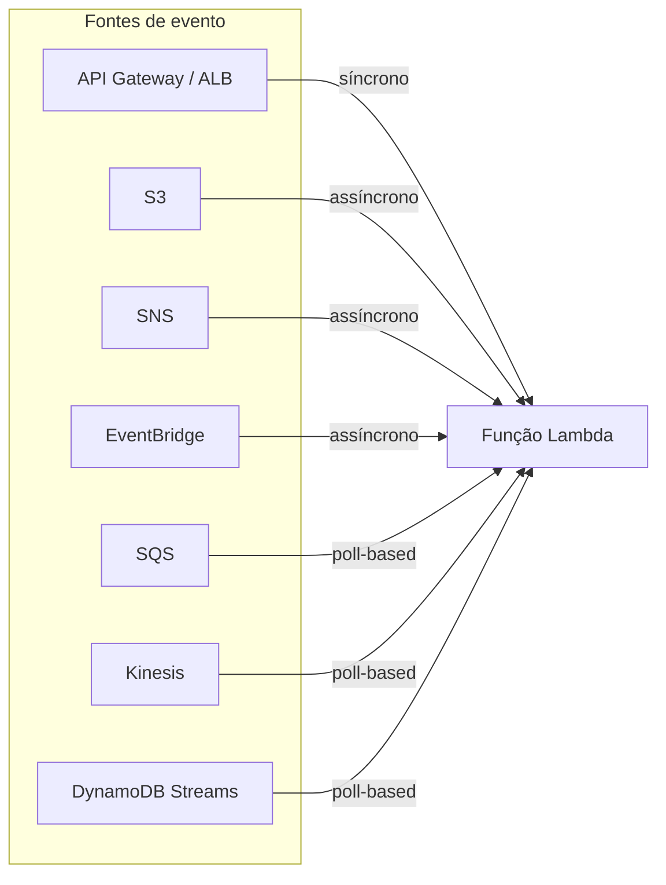
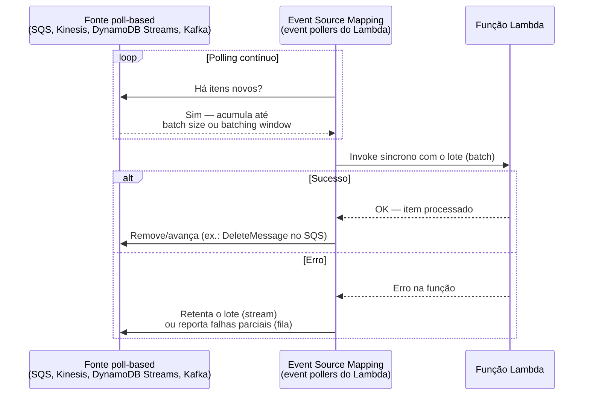

# O modelo de eventos: triggers e integrações

> [!abstract] TL;DR
> Uma função Lambda nunca acorda sozinha — ela é sempre uma reação a um evento, e a AWS reconhece três formas fundamentalmente diferentes de entregar esse evento: **síncrona** (o chamador espera a resposta, como o API Gateway), **assíncrona** (o evento é enfileirado, o chamador recebe um 202 na hora e a execução acontece depois, com retry automático embutido, como S3 ou SNS) e **poll-based via event source mapping** (o próprio serviço Lambda fica de olho numa fila ou stream — SQS, Kinesis, DynamoDB Streams — e invoca a função em lotes). Cada modelo trata erro de um jeito diferente, e confundir os três é a origem da maioria dos bugs sutis em sistemas serverless: esperar resposta de uma invocação assíncrona, ignorar que um erro numa stream pode travar o processamento inteiro daquele pedaço da fila, ou duplicar efeitos porque o retry automático reenviou um evento que já tinha sido processado.

## A função que reage

Pare por um segundo e repare no que uma função Lambda *não* tem: não tem um `while True` esperando trabalho, não tem uma porta aberta ouvindo conexões, não tem um processo em pé consumindo memória enquanto nada acontece. O código de uma função existe como definição — runtime, handler, variáveis de ambiente, papel de execução — mas só ganha um processo real no instante em que algo dispara uma invocação. Depois que a função termina de responder (ou de processar, no caso assíncrono), esse processo pode continuar vivo por um tempo aguardando a próxima invocação — é o que a próxima nota desta trilha vai chamar de *warm start* — mas a ideia central não muda: **nada acontece por iniciativa da função. Tudo começa em outro lugar.**

Isso é uma inversão real de modelo mental para quem vem de um serviço tradicional. Numa aplicação Spring Boot rodando numa EC2, o processo está de pé o tempo todo, e é ele quem decide quando ler da fila, quando fazer polling, quando aceitar uma conexão. No serverless, essa responsabilidade de "ficar de olho" muda de dono: alguém — ou algum serviço gerenciado — precisa **entregar** o evento à função. Esse "alguém" é o **trigger**, e a forma como ele entrega o evento — nem sempre óbvia à primeira vista — determina praticamente todo o comportamento observável do sistema: quem vê o erro, se há retry, se a ordem é preservada, se dois eventos podem ser processados em paralelo.

É por isso que, numa arquitetura serverless madura, o trigger recebe tanta atenção de design quanto o código da função em si. Escolher "S3 dispara a função" é uma decisão de arquitetura tão importante quanto escolher a linguagem do handler — porque essa escolha já embute um modelo de invocação inteiro, com suas próprias garantias e armadilhas.



## Os três modelos de invocação

A documentação oficial da AWS é explícita: existem três formas distintas de invocar uma função Lambda, e cada uma tem seu próprio contrato de erro, sua própria semântica de retry e sua própria relação entre chamador e função.

### Síncrono (request-response)

No modelo síncrono, quem invoca a função **espera** a resposta. A chamada `Invoke` da API do Lambda, com `InvocationType=RequestResponse` (o padrão), roda a função e devolve o resultado — ou o erro — diretamente para quem chamou. Se a função lançar uma exceção, quem invocou recebe status `200` da própria API Lambda (a chamada em si funcionou), mas com um campo indicando erro na função; o corpo da resposta carrega o erro, não um resultado de negócio.

```bash
aws lambda invoke --function-name minha-funcao \
    --cli-binary-format raw-in-base64-out \
    --payload '{ "key": "value" }' response.json
```

```json
{
    "ExecutedVersion": "$LATEST",
    "StatusCode": 200
}
```

Serviços que invocam Lambda de forma síncrona incluem o **API Gateway** e o **Application Load Balancer (ALB)** — nos dois casos, existe um cliente HTTP real do outro lado esperando uma resposta, então não faria sentido enfileirar o pedido e responder "processando" sem mais. Nesse modelo, é o serviço que fez a chamada quem decide o que fazer com um erro: o API Gateway, por exemplo, sempre repassa o erro de volta ao cliente que fez a requisição HTTP — ele não retenta silenciosamente. É o modelo mais familiar de quem vem de APIs tradicionais, e por isso o mais fácil de entender errado nos outros dois casos: a intuição de "chamei, esperei, recebi resposta" simplesmente não existe nos modelos seguintes.

### Assíncrono (event)

No modelo assíncrono, Lambda **enfileira** o evento internamente e devolve, na hora, uma confirmação de que o evento foi aceito — não o resultado do processamento, que ainda nem começou. Invocar de forma assíncrona pela CLI significa trocar `InvocationType` para `Event`:

```bash
aws lambda invoke \
  --function-name minha-funcao \
  --invocation-type Event \
  --cli-binary-format raw-in-base64-out \
  --payload '{ "key": "value" }' response.json
```

```json
{
    "StatusCode": 202
}
```

O `202` é a assinatura visual do modelo assíncrono: "aceitei, vou processar, não pergunte agora." Serviços como **S3** (mudança em bucket) e **SNS** (mensagem publicada num tópico) invocam Lambda assim por padrão — eles não esperam, nem poderiam esperar de forma prática, o processamento de um evento antes de seguir em frente. O **EventBridge**, tratado adiante nesta nota, também dispara Lambda de forma assíncrona quando o alvo de uma regra é uma função.

A parte que separa o modelo assíncrono do síncrono de verdade é o que acontece **depois** do 202: se a função falhar, é a própria Lambda — não quem chamou — quem decide se e quantas vezes tenta de novo, porque quem chamou já foi embora satisfeito com o 202. Isso é tratado em detalhe na seção de tratamento de erro, adiante.

### Poll-based / stream (event source mapping)

O terceiro modelo é o mais diferente dos outros dois, porque nele **não é o serviço de origem quem invoca a Lambda** — é a própria Lambda quem vai atrás do trabalho. Um recurso chamado **event source mapping**, gerenciado internamente pelo serviço Lambda, faz *polling* ativo numa fonte — uma fila SQS, um stream Kinesis, DynamoDB Streams, um tópico Kafka — junta os itens disponíveis em um **lote (batch)**, e só então invoca a função de forma síncrona, passando o lote inteiro como payload.



A documentação oficial descreve os *event pollers* como recursos internos que "ativamente fazem polling de novas mensagens e invocam funções" — por padrão o Lambda escala esses pollers automaticamente conforme o volume, e para algumas fontes existe um **modo provisionado**, com número mínimo e máximo de pollers dedicados, para cargas que exigem latência mais consistente.

Vale a distinção que a própria AWS traça explicitamente entre **trigger** e **event source mapping**: com S3 ou SNS, o serviço de origem *empurra* o evento (é um trigger de verdade, configurado e armazenado no serviço de origem); com SQS, Kinesis, DynamoDB Streams e Kafka, é o Lambda quem *puxa* — o event source mapping é um recurso que vive dentro do próprio serviço Lambda, criado com `CreateEventSourceMapping`.

## Event sources principais, um a um

Cada fonte de evento formata o payload de um jeito próprio e carrega semânticas diferentes — vale conhecer, ao menos por cima, o formato de cada uma antes de escrever o handler.

**API Gateway (síncrono).** O evento carrega o método HTTP, path, headers, query string params e corpo da requisição; a função devolve um objeto com `statusCode`, `headers` e `body`, que o API Gateway traduz de volta em resposta HTTP. É o padrão de toda API REST/HTTP serverless.

**S3 (assíncrono).** Dispara em eventos como `ObjectCreated:Put`, `ObjectRemoved:Delete` e outros — configurado como notificação de bucket, apontando para o ARN da função. O evento traz o nome do bucket e a chave do objeto:

```json
{
  "Records": [
    {
      "eventVersion": "2.0",
      "eventSource": "aws:s3",
      "awsRegion": "us-east-1",
      "eventTime": "2026-07-24T00:00:00.000Z",
      "eventName": "ObjectCreated:Put",
      "s3": {
        "bucket": { "name": "meu-bucket", "arn": "arn:aws:s3:::meu-bucket" },
        "object": { "key": "uploads/foto.jpg", "size": 204800, "eTag": "abc123" }
      }
    }
  ]
}
```

O padrão de uso clássico é pipeline de processamento de arquivo: upload dispara a função, a função lê o objeto, processa (redimensiona, converte, valida) e grava o resultado — muitas vezes num segundo bucket, para evitar disparar a mesma função de novo em loop.

**SQS (poll-based).** Fila de mensagens ponto-a-ponto; cada mensagem é entregue a exatamente um consumidor por vez, dentro do período de *visibility timeout*. O evento chega como lote:

```json
{
  "Records": [
    {
      "messageId": "059f36b4-87a3-44ab-83d2-661975830a7d",
      "body": "Pedido #4821 pronto para faturar",
      "attributes": { "ApproximateReceiveCount": "1" },
      "eventSource": "aws:sqs",
      "eventSourceARN": "arn:aws:sqs:us-east-2:123456789012:fila-pedidos"
    }
  ]
}
```

**SNS (assíncrono, pub/sub).** Um tópico SNS publica para múltiplos assinantes — Lambda é um deles entre vários possíveis (e-mail, SQS, HTTP). Cada mensagem publicada no tópico vira uma invocação assíncrona independente da função inscrita.

**EventBridge (event bus / regras / schedule).** É o barramento de eventos central da AWS: regras (*rules*) casam eventos por padrão (`event pattern`) e roteiam para um ou mais alvos, incluindo funções Lambda. Uma regra pode reagir a um evento de outro serviço da AWS **ou** rodar num horário fixo — é o substituto moderno do cron tradicional na AWS:

```json
{
  "ScheduleExpression": "rate(15 minutes)",
  "State": "ENABLED",
  "Targets": [
    { "Arn": "arn:aws:lambda:us-east-1:123456789012:function:limpa-cache", "Id": "alvo-1" }
  ]
}
```

Ou, com expressão cron (sintaxe de seis campos, própria da AWS — minuto, hora, dia-do-mês, mês, dia-da-semana, ano):

```bash
aws events put-rule \
  --name relatorio-diario \
  --schedule-expression "cron(0 8 * * ? *)" \
  --state ENABLED
```

**DynamoDB Streams (poll-based).** Captura toda mudança (insert/update/delete) numa tabela DynamoDB, como um log ordenado por *shard*. O evento traz a imagem antiga e/ou nova do item, conforme o `StreamViewType` configurado — útil para replicar dados, invalidar cache ou disparar workflows a partir de uma escrita.

**Kinesis Data Streams (poll-based).** Semelhante em modelo ao DynamoDB Streams, mas para streaming de eventos de aplicação em alto volume — telemetria, cliques, logs — organizados em shards, com a mesma lógica de polling e retry de lote.

| Event source | Modelo | O que chega no evento | Uso típico |
|---|---|---|---|
| API Gateway | Síncrono | método, path, headers, query, body | API REST/HTTP serverless |
| ALB | Síncrono | requisição HTTP do balanceador | backend atrás de um load balancer existente |
| S3 | Assíncrono | bucket + chave do objeto + tipo de evento | pipeline de processamento de arquivo |
| SNS | Assíncrono | mensagem publicada no tópico | fan-out pub/sub |
| EventBridge | Assíncrono | evento estruturado ou disparo agendado | orquestração entre serviços, jobs cron |
| SQS | Poll-based | lote de mensagens da fila | processamento de fila, desacoplamento |
| Kinesis Data Streams | Poll-based | lote de registros do shard | streaming de alto volume |
| DynamoDB Streams | Poll-based | lote de mudanças (INSERT/MODIFY/REMOVE) | reagir a escrita numa tabela |
| Kafka (MSK / self-managed) | Poll-based | lote de mensagens do tópico | integração com stack de mensageria existente |

> [!info] Fronteira
> O que é uma fila, o que é pub/sub, e por que um sistema opta por comunicação assíncrona entre serviços é conteúdo de [[03-Dominios/Engenharia/Comunicação entre Sistemas/index|Comunicação entre Sistemas]] — esta nota assume esse vocabulário e trata apenas de como esses eventos chegam a uma função Lambda. Os serviços gerenciados de mensageria da AWS em si — SQS, SNS e EventBridge, com filas FIFO, DLQ nativa da fila, padrões de arquitetura de evento — são o assunto de um galho futuro desta trilha Cloud (mensageria gerenciada), ainda não escrito; aqui eles aparecem só pelo ângulo de "como disparam uma função".

## Event source mapping: o recurso por trás do polling

Para as fontes poll-based, o vínculo entre a fila/stream e a função não é automático — é um recurso explícito, criado com `create-event-source-mapping`, que carrega toda a configuração de como o polling deve se comportar:

```bash
aws lambda create-event-source-mapping \
  --function-name processa-pedido \
  --event-source-arn arn:aws:sqs:us-east-2:123456789012:fila-pedidos \
  --batch-size 10 \
  --maximum-batching-window-in-seconds 5
```

Os parâmetros centrais, segundo a documentação de `CreateEventSourceMapping`:

- **`BatchSize`** — o número máximo de registros por invocação. Para SQS, Kinesis e DynamoDB o padrão de *batching window* é 0 segundos (invoca assim que há registros); para Kafka e Amazon MQ, o padrão é 500 ms.
- **`MaximumBatchingWindowInSeconds`** — quanto tempo o event source mapping espera acumular um lote antes de invocar, mesmo sem atingir o `BatchSize` — de 0 a 300 segundos.
- Um lote é fechado e enviado quando **qualquer um** dos três critérios é atingido primeiro: a janela de tempo expira, o `BatchSize` é alcançado, ou o payload chega a 6 MB (limite fixo, não configurável).

```bash
aws lambda update-event-source-mapping \
  --uuid a1b2c3d4-5678-90ab-cdef-EXAMPLE11111 \
  --batch-size 100 \
  --maximum-batching-window-in-seconds 10
```

> [!tip] Assista: A serverless journey: AWS Lambda under the hood (re:Invent 2019, SVS405-R1)
> **Canal:** AWS Events | **Duração:** ~51min | **Idioma:** EN
>
> Um mergulho na engenharia interna por trás do event source mapping: como o Lambda usa um *stream tracker* pra descobrir shards/partições de uma fonte como SQS ou Kinesis, decidir o `batch size` e invocar a função — o "quem faz o polling de verdade" por trás do recurso que você só declara com `create-event-source-mapping`. Trecho de destaque [12:07]: *"for event sources such as sqs as an event source... you are providing the connection to the event source whether it's your sqs queue or one of the other event sources lambda supports and lambda does the rest"*
>
> 🎬 [Assistir no YouTube](https://www.youtube.com/watch?v=xmacMfbrG28)

### Partial batch response — não jogue o lote inteiro fora

Um detalhe que costuma pegar quem está começando: se a função processa 10 mensagens de um lote SQS e falha na nona, o comportamento **padrão** é tratar o lote inteiro como falho — as 10 mensagens voltam a ficar visíveis na fila depois do *visibility timeout*, incluindo as 8 que já tinham sido processadas com sucesso. Para evitar reprocessar o que já deu certo, a função pode devolver explicitamente quais itens falharam, usando **partial batch response** (`ReportBatchItemFailures`):

```json
{
  "batchItemFailures": [
    { "itemIdentifier": "059f36b4-87a3-44ab-83d2-661975830a7d" }
  ]
}
```

Com essa configuração habilitada no event source mapping, o Lambda remove da fila apenas as mensagens que **não** aparecem em `batchItemFailures` — as demais voltam para retry, isoladamente. O mesmo padrão existe para DynamoDB Streams e Kinesis.

### Concorrência e paralelismo por shard

Uma dúvida comum de quem está migrando um consumidor tradicional para event source mapping: quantas invocações da função rodam ao mesmo tempo? A resposta depende da fonte. Para SQS, o Lambda escala o número de *pollers* automaticamente conforme o volume da fila — mais mensagens chegando, mais concorrência, dentro do limite de concorrência da própria função (ou de `MaximumConcurrency`, se configurado no event source mapping). Para fontes baseadas em shard, como Kinesis e DynamoDB Streams, o paralelismo tem outra granularidade: por padrão, **um shard só pode ter um lote em processamento por vez**, exatamente para preservar a ordem dos registros dentro daquele shard. O parâmetro `ParallelizationFactor` (de 1 a 10) permite processar múltiplos lotes do mesmo shard simultaneamente — útil quando o volume de dados é alto e a métrica `IteratorAge` (o quão "atrasado" o consumo está em relação à ponta do stream) fica subindo — mas o Lambda garante que, mesmo com paralelismo maior que 1, a ordem por chave de partição continua sendo respeitada dentro daquele shard. Aumentar o número de shards da fonte, não só o `ParallelizationFactor`, costuma ser o primeiro lugar a olhar quando o gargalo é throughput, não latência de função.

## Tratamento de erro por modelo

Este é o ponto onde os três modelos deixam de ser só uma questão de "quem chama quem" e passam a determinar diretamente o comportamento do sistema sob falha.

**Síncrono.** O erro volta imediatamente para quem chamou. Não há retry automático por parte do Lambda — se o API Gateway, o ALB, ou um SDK que chamou `Invoke` diretamente quiser tentar de novo, a decisão e a implementação do retry são inteiramente dele. A AWS CLI e os SDKs da AWS já retentam automaticamente em timeouts de cliente, throttling e erros de serviço — mas isso é comportamento do cliente, não do Lambda.

**Assíncrono.** Por padrão, se a função retornar erro, **Lambda tenta de novo duas vezes** — três tentativas no total — com aproximadamente um minuto de espera entre a primeira e a segunda tentativa, e dois minutos entre a segunda e a terceira. Para erros de *throttling* (429) e erros de sistema (500-series), o evento volta para a fila interna e o Lambda continua tentando por até seis horas por padrão, com backoff exponencial crescendo até um teto de cinco minutos entre tentativas. Passado esse prazo, ou esgotadas as tentativas configuradas, o evento é descartado — a menos que exista uma **dead-letter queue (DLQ)** ou um **destino de falha (on-failure destination)** configurado para capturá-lo:

```bash
aws lambda update-function-event-invoke-config \
  --function-name processa-webhook \
  --maximum-retry-attempts 1 \
  --maximum-event-age-in-seconds 3600 \
  --destination-config '{
    "OnFailure": { "Destination": "arn:aws:sqs:us-east-1:123456789012:falhas-webhook" }
  }'
```

Vale distinguir DLQ de destino de falha, porque não são a mesma coisa: uma **DLQ** clássica (configurada no nível da função, apontando para SQS ou SNS) captura só o evento original quando ele é descartado. Um **on-failure destination** (SQS, SNS, S3, EventBridge ou uma outra função Lambda) é mais rico — carrega metadados sobre a invocação que falhou, incluindo a razão (`RetryAttemptsExhausted`, por exemplo), o número de tentativas feitas, e, para destinos S3, o payload original completo. Destinos são a peça recomendada hoje; DLQ segue suportada por compatibilidade.

**Poll-based / stream.** Aqui o comportamento padrão é o mais perigoso dos três: se a função retorna erro processando um lote de um **stream** (Kinesis ou DynamoDB Streams), o Lambda **retenta o lote inteiro**, e para preservar a ordem de processamento, **pausa o shard afetado** até o erro ser resolvido ou os registros expirarem. Ou seja: um único registro "ruim" — malformado, que sempre derruba a função — pode travar o processamento de *todo* aquele shard, inclusive de registros bons que vieram depois dele, até que alguém intervenha ou os dados expirem. Com as configurações padrão, isso pode bloquear um shard por até um dia inteiro.

Duas configurações mitigam isso: `MaximumRetryAttempts` limita quantas vezes o Lambda tenta antes de desistir daquele lote, e `BisectBatchOnFunctionError` divide um lote com erro em dois lotes menores, isolando o registro problemático sem consumir a cota de retry:

```bash
aws lambda update-event-source-mapping \
  --uuid f89f8514-cdd9-4602-9e1f-01a5b77d449b \
  --maximum-retry-attempts 2 \
  --maximum-record-age-in-seconds 3600 \
  --bisect-batch-on-function-error \
  --destination-config '{"OnFailure": {"Destination": "arn:aws:sns:us-east-1:123456789012:falhas-stream"}}'
```

Para SQS, o mecanismo é diferente — não há "shard bloqueado" porque SQS não é ordenado por partição da mesma forma —, mas o princípio de isolar o item problemático é o mesmo: configure `ReportBatchItemFailures` (partial batch response, visto acima) e uma **redrive policy** na própria fila SQS, apontando para uma DLQ depois de N tentativas de entrega malsucedidas.

| Modelo | Quem decide retry | Onde captura falha definitiva | Risco característico |
|---|---|---|---|
| Síncrono | Quem chamou (fora do Lambda) | Nenhuma — erro volta na hora | Cliente sem tratamento de erro trava |
| Assíncrono | Lambda, automaticamente (2 retries padrão) | DLQ ou on-failure destination | Efeito duplicado sem idempotência |
| Poll-based / stream | Event source mapping (config por `MaximumRetryAttempts`) | On-failure destination do event source mapping | Poison message bloqueia o shard inteiro |

## Casos práticos

**A thumbnail que nunca chega.** Um pipeline dispara uma função ao upload de imagem no S3, redimensiona e grava num segundo bucket. Se a imagem enviada estiver corrompida, a função lança exceção — como é invocação assíncrona, o Lambda tenta mais duas vezes automaticamente, sem que ninguém peça. Sem uma DLQ ou destino de falha configurado, depois da terceira tentativa o evento simplesmente desaparece — e ninguém no time sabe que aquele upload nunca virou thumbnail, até um usuário reclamar.

**O shard que parou de andar.** Uma função consome DynamoDB Streams para replicar mudanças de pedido para um índice de busca. Um dia, um item chega com um campo em formato inesperado, e o código de parsing lança exceção sem tratamento. Sem `BisectBatchOnFunctionError` nem limite de retry configurado, o shard inteiro para: todo pedido novo feito depois daquele item malformado fica sem replicar no índice de busca, silenciosamente, até alguém notar o `IteratorAge` subindo nos dashboards e investigar.

**O webhook que rodou duas vezes.** Um provedor de pagamento chama um endpoint HTTP que aciona, via API Gateway, uma função síncrona — até aqui, sem susto: erro volta na hora, sem retry automático do Lambda. Mas o próprio provedor de pagamento, ao não receber `200` a tempo (a função demorou por causa de cold start), reenvia o webhook pela sua própria política de retry externa. A função processa o mesmo evento de pagamento duas vezes — e sem uma verificação de idempotência (checar se aquele `payment_id` já foi processado antes de debitar de novo), o cliente é cobrado em dobro.

## Lente dupla: AWS e o modelo mais restrito da DigitalOcean

A riqueza de event sources vista até aqui é uma característica particular da AWS — o Lambda tem mais de uma década de integrações acumuladas com praticamente todo serviço gerenciado da própria AWS. A DigitalOcean Functions, sendo uma plataforma bem mais nova e deliberadamente mais enxuta, **não tenta reproduzir esse catálogo inteiro**, e vale nomear a diferença com precisão em vez de fingir equivalência.

Segundo a documentação oficial da DigitalOcean, as funções são disparadas por dois mecanismos:

- **Web trigger (HTTP)** — toda função DigitalOcean, ao ser publicada, ganha automaticamente um endpoint HTTP público (ou protegido por autenticação, configurável). É o equivalente funcional ao par API Gateway + Lambda síncrono da AWS, só que embutido por padrão, sem precisar provisionar um recurso separado de API Gateway.
- **Scheduled trigger (cron)** — definido em `project.yml` ou pelo painel de controle, dispara a função periodicamente com sintaxe cron de cinco campos (minuto, hora, dia do mês, mês, dia da semana), podendo passar um payload JSON fixo a cada disparo. É o equivalente ao EventBridge com `ScheduleExpression`.

O que **não existe** — e essa é a diferença estrutural, não um detalhe menor — é o ecossistema de *event sources* da AWS: não há um equivalente a "bucket dispara função no upload" nativamente integrado ao Spaces (o serviço de armazenamento de objetos da DigitalOcean), não há event source mapping para uma fila gerenciada, não há um barramento de eventos tipo EventBridge reagindo a mudanças de outros serviços gerenciados. Se uma aplicação na DigitalOcean precisa do padrão "arquivo chegou → processa", o caminho comum é a própria aplicação notificar a função via chamada HTTP ao web trigger — a orquestração que, na AWS, o S3 faz sozinho, na DigitalOcean cai por conta de código de aplicação.

```bash
# DigitalOcean — trigger agendado em project.yml (cron de 5 campos)
schedule:
  - name: limpa-cache-diario
    function: limpa-cache
    cron: "0 4 * * *"
    payload:
      modo: completo
```

> [!info] Caducidade
> A documentação da DigitalOcean, no momento da pesquisa, descreve scheduled triggers como recurso em **private preview**, com limite de até 3 triggers agendados por conta durante essa fase, e ainda não disponíveis para componentes de função publicados via App Platform. Isso é exatamente o tipo de limitação que tende a mudar rápido — confira a documentação oficial atual antes de arquitetar em cima desse limite.

| Conceito | AWS Lambda | DigitalOcean Functions |
|---|---|---|
| Trigger HTTP | API Gateway / ALB (recurso separado, provisionado) | Web trigger nativo (embutido ao publicar a função) |
| Trigger agendado | EventBridge Scheduler / regra com `ScheduleExpression` | Scheduled trigger, cron de 5 campos em `project.yml` (private preview) |
| Trigger de armazenamento de objetos | S3 event notification (nativo) | Sem equivalente nativo — orquestração fica com a aplicação |
| Trigger de fila/stream | Event source mapping (SQS, Kinesis, DynamoDB Streams, Kafka) | Sem equivalente — sem fila/stream gerenciado com integração direta |
| Barramento de eventos entre serviços | EventBridge (event bus + regras de roteamento) | Sem equivalente |

## Tabela de tradução: Azure Functions e GCP Cloud Functions

| Conceito | AWS Lambda | Azure Functions | GCP Cloud Functions | DigitalOcean Functions |
|---|---|---|---|---|
| Trigger HTTP | API Gateway / ALB | HTTP trigger | HTTP trigger | Web trigger |
| Trigger agendado | EventBridge Scheduler | Timer trigger (cron NCronTab) | Cloud Scheduler + Eventarc | Scheduled trigger (cron 5 campos) |
| Trigger de storage | S3 event notification | Blob trigger (Azure Storage) | Eventarc (Cloud Storage) | — |
| Trigger de fila/stream | Event source mapping (SQS/Kinesis/DynamoDB Streams) | Queue trigger / Event Hub trigger | Eventarc (Pub/Sub) | — |
| Conceito central de integração | Bindings implícitos por tipo de evento | **Bindings** — entrada/saída declaradas no `function.json` | Eventarc — barramento unificado sobre Cloud Events | Web trigger + scheduled trigger, sem barramento próprio |
| Vocabulário chave | Event source / event source mapping | Trigger + Binding (dois conceitos separados) | Event trigger via Eventarc (CloudEvents padrão) | Trigger (termo único, dois tipos) |

A Azure vale um comentário à parte: ela separa explicitamente **trigger** (o que inicia a execução) de **binding** (uma forma declarativa de ler ou escrever dados de/para outro serviço sem escrever código de integração manual) — um vocabulário que nem AWS nem GCP usam da mesma forma. A GCP, por sua vez, consolidou boa parte dos seus triggers de evento em torno do **Eventarc**, que usa o padrão aberto **CloudEvents** como formato de envelope — uma escolha deliberada de portabilidade que nem AWS nem Azure adotaram como formato nativo.

> [!warning] Poison message travando um shard inteiro
> Num event source mapping de stream (Kinesis ou DynamoDB Streams), um único registro malformado que sempre derruba a função pode bloquear o processamento de todo o shard por até um dia com as configurações padrão — porque o Lambda retenta o lote inteiro para preservar ordem. Configure `MaximumRetryAttempts` e `BisectBatchOnFunctionError` desde o primeiro deploy, não depois do primeiro incidente.

> [!warning] Confundir invocação assíncrona com síncrona
> Chamar `Invoke` com `InvocationType=Event` e depois ficar esperando um resultado de negócio na resposta é um erro de leitura do modelo: a resposta só confirma que o evento foi aceito (`202`), não que foi processado. Se o chamador precisa do resultado, o modelo é síncrono, não assíncrono — ou é preciso desenhar um mecanismo separado de callback/polling para saber quando o processamento assíncrono terminou.

> [!warning] Retry automático sem idempotência
> Tanto o retry assíncrono padrão (duas tentativas) quanto o retry de event source mapping podem reenviar um evento que, na prática, já rodou parcialmente — Lambda documenta explicitamente que "duplicate processing of records can occur." Qualquer efeito colateral que não seja seguro de repetir (debitar um cartão, enviar um e-mail, incrementar um contador sem checar se já foi incrementado) precisa de uma checagem de idempotência antes de agir — normalmente guardando o identificador do evento já processado em algum lugar consultável.

## O que vem a seguir

Esta nota respondeu "o que dispara a função e o que acontece quando dá errado" — mas ficou de fora uma pergunta que qualquer engenheiro que já operou Lambda em produção faz cedo: por que a *primeira* invocação depois de um tempo parado demora visivelmente mais que as seguintes? A resposta — cold start, warm start, e o ciclo de vida do ambiente de execução por trás de cada invocação, seja ela síncrona, assíncrona ou vinda de um event source mapping — é o assunto da próxima nota desta trilha.

## Fontes

- [AWS Lambda — Invoking a Lambda function synchronously](https://docs.aws.amazon.com/lambda/latest/dg/invocation-sync.html) — modelo `RequestResponse`, comportamento de status e erro; acessado em 2026-07-24.
- [AWS Lambda — Invoking a Lambda function asynchronously](https://docs.aws.amazon.com/lambda/latest/dg/invocation-async.html) — modelo `Event`, status 202, serviços que invocam assim; acessado em 2026-07-24.
- [AWS Lambda — Understanding retry behavior in Lambda](https://docs.aws.amazon.com/lambda/latest/dg/invocation-retries.html) — retry de 2 tentativas em invocação assíncrona, retry de stream por shard, retry de 6h em throttling/erro de sistema; acessado em 2026-07-24.
- [AWS Lambda — How Lambda handles errors and retries with asynchronous invocation](https://docs.aws.amazon.com/lambda/latest/dg/invocation-async-error-handling.html) — intervalos de retry (1min, 2min), DLQ vs. on-failure destination; acessado em 2026-07-24.
- [AWS Lambda — How Lambda processes records from stream and queue-based event sources](https://docs.aws.amazon.com/lambda/latest/dg/invocation-eventsourcemapping.html) — event source mapping, batching window, batch size, diferença entre trigger e event source mapping; acessado em 2026-07-24.
- [AWS Lambda — Using Lambda with Amazon SQS](https://docs.aws.amazon.com/lambda/latest/dg/with-sqs.html) — polling e batching de SQS, partial batch response, exemplo de evento; acessado em 2026-07-24.
- [AWS Lambda — Using AWS Lambda with Amazon DynamoDB](https://docs.aws.amazon.com/lambda/latest/dg/with-ddb.html) — polling de shard, ParallelizationFactor, exemplo de evento DynamoDB Streams; acessado em 2026-07-24.
- [AWS Lambda — Retain discarded records for a DynamoDB event source in Lambda](https://docs.aws.amazon.com/lambda/latest/dg/services-dynamodb-errors.html) — BisectBatchOnFunctionError, MaximumRetryAttempts, MaximumRecordAgeInSeconds, shard bloqueado por até 1 dia, on-failure destination; acessado em 2026-07-24.
- [AWS Lambda — Using Lambda with Amazon S3](https://docs.aws.amazon.com/lambda/latest/dg/services-s3.html) — formato de evento S3, invocação assíncrona via notificação de bucket; acessado em 2026-07-24.
- [Amazon EventBridge — Creating a scheduled rule](https://docs.aws.amazon.com/eventbridge/latest/userguide/eb-create-rule-schedule.html) — rate expressions, cron expressions, DLQ de regra, retry policy; acessado em 2026-07-24.
- [DigitalOcean — How to Schedule Functions](https://docs.digitalocean.com/products/functions/how-to/schedule-functions/) — scheduled triggers, sintaxe cron de 5 campos, limite de 3 triggers em private preview; acessado em 2026-07-24.
