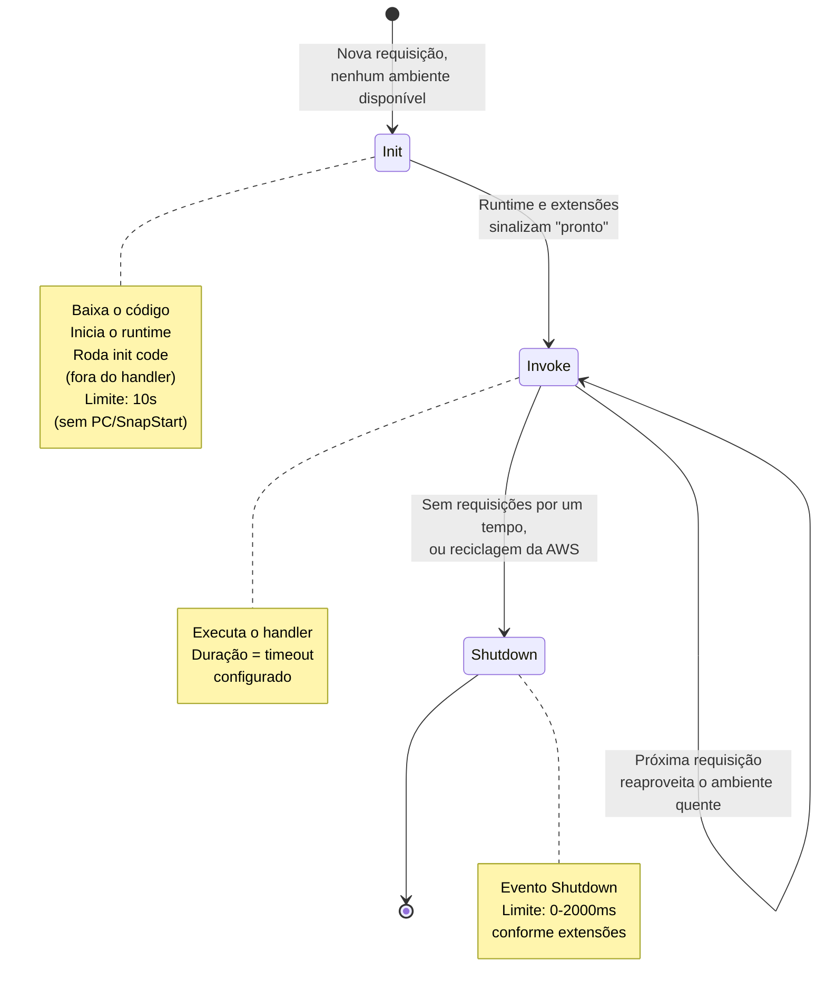
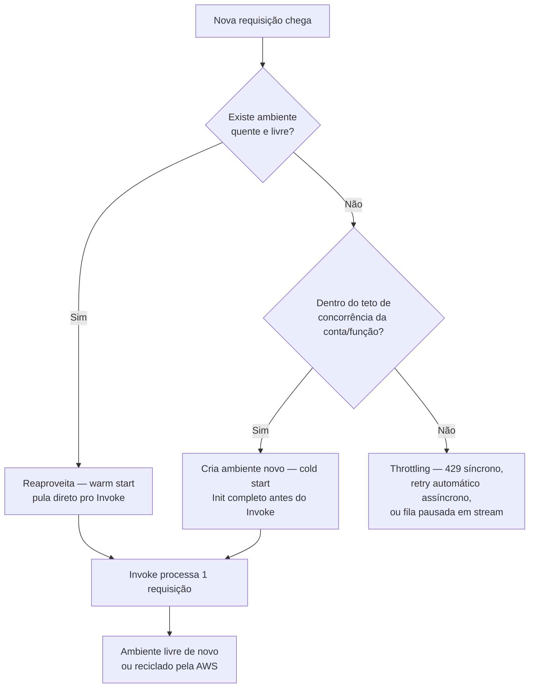

# Cold start, concurrency e performance

> [!abstract] TL;DR
> Toda função Lambda roda dentro de um **ambiente de execução** que passa por três fases — Init, Invoke, Shutdown — e a AWS reaproveita esse ambiente entre chamadas sempre que pode, porque criar um do zero é caro em tempo. A primeira requisição a chegar num ambiente novo paga esse custo de criação: é o **cold start**. As seguintes, enquanto o ambiente continuar quente, pulam direto para o Invoke — é o **warm start**, muito mais rápido. A concorrência de uma função Lambda não é um número abstrato de configuração: é, literalmente, a contagem de ambientes de execução rodando ao mesmo tempo, porque **cada ambiente processa uma única requisição por vez**. Escalar significa criar mais ambientes, a uma taxa controlada — 1.000 ambientes novos a cada 10 segundos, por função — até o teto de concorrência da conta (1.000 por região, por padrão, ajustável). Duas alavancas existem para controlar isso: **reserved concurrency** reserva uma fatia da conta para uma função (mínimo e máximo garantidos, sem custo extra); **provisioned concurrency** mantém ambientes já inicializados e quentes, prontos para responder sem cold start — com um custo adicional contínuo. E por baixo de tudo isso, uma peça que já apareceu na nota anterior ganha aqui todo o seu peso prático: memória e CPU estão acoplados, e a configuração errada de memória não é só uma questão de custo — é uma questão de latência e, às vezes, de a função simplesmente estourar o timeout.

## Por que a primeira requisição é sempre a mais lenta?

Se você já testou uma API construída sobre Lambda, provavelmente notou um padrão estranho: a primeira chamada depois de um tempo sem uso demora bem mais que as seguintes — às vezes o dobro, às vezes dez vezes mais — e depois, magicamente, as respostas ficam rápidas e consistentes. Não é imaginação, e não é um bug. É o preço estrutural de como a computação sem servidor consegue existir: a AWS não mantém milhões de contêineres ociosos rodando o seu código o tempo inteiro, esperando uma requisição que talvez nunca chegue. Ela cria o ambiente sob demanda, no exato momento em que uma requisição precisa dele — e só então.

Esse ato de criar o ambiente do zero — baixar o código, preparar o sistema de arquivos, iniciar o runtime da linguagem, rodar qualquer inicialização que o seu código faça fora do handler — tem um custo real, medido em dezenas a centenas de milissegundos, às vezes mais. A AWS chama isso de **Init phase**, e entender exatamente o que acontece dentro dela é o que separa quem só "usa Lambda" de quem entende por que a função de produção às vezes trava numa fila de espera de 800 ms sem motivo aparente. Esta nota é sobre essa mecânica interna: o ciclo de vida do ambiente, o que fica quente e por quanto tempo, como o Lambda decide quantos ambientes criar em paralelo, e as duas ferramentas que existem para domar tudo isso — reserved e provisioned concurrency.

Pense num restaurante que só abre a cozinha quando o primeiro pedido do dia chega. Ninguém está lá cortando legumes e pré-aquecendo o forno enquanto a sala está vazia — seria desperdício de gás e de gente parada. O primeiro cliente do dia espera mais: alguém precisa acender o fogão, abrir a geladeira, separar os ingredientes. O segundo cliente, que chega cinco minutos depois enquanto a cozinha ainda está quente, é atendido na velocidade normal, porque todo o trabalho de "ligar a cozinha" já foi pago pelo primeiro. É exatamente essa a troca que o Lambda faz por você, automaticamente, milhões de vezes por dia: a primeira requisição paga o preço de "acender a cozinha"; todas as seguintes, enquanto o fogão continuar aceso, só pagam o preço de fazer o prato.

> [!tip] Assista: A serverless journey: AWS Lambda under the hood (re:Invent 2019, SVS405-R1)
> **Canal:** AWS Events | **Duração:** ~51min | **Idioma:** EN
>
> Vai um nível abaixo do que esta nota cobre: mostra a arquitetura interna por trás do cold start — o *front-end* que autentica e checa a concorrência, o *worker manager* que rastreia sandboxes quentes, e o *placement service* acionado só quando não existe um ambiente pronto pra reaproveitar. Trecho de destaque [05:48]: *"the front-end routes to the worker manager and the worker manager's responsibility is to track warm sandboxes that are ready for invocation... since this is a first time invoke... there is not a sandbox that's there and readily available"*
>
> 🎬 [Assistir no YouTube](https://www.youtube.com/watch?v=xmacMfbrG28)

## O ciclo de vida do execution environment

Toda invocação de uma função Lambda acontece dentro de um **execution environment** — um ambiente isolado e seguro que a AWS provisiona para rodar o seu código. Segundo a documentação oficial, esse ambiente passa por três fases bem definidas, sempre na mesma ordem: **Init**, **Invoke**, **Shutdown**.



### Init — o que realmente acontece antes do seu handler rodar

Na fase Init, a AWS executa três tarefas, sempre nessa ordem: inicia as extensões registradas (`Extension init`), prepara o runtime da linguagem (`Runtime init`) e roda o código estático da sua função (`Function init`) — tudo aquilo que está escrito **fora** do handler: imports, criação de clientes de SDK, abertura de conexões. A fase termina quando o runtime e todas as extensões sinalizam que estão prontos, enviando uma requisição `Next` para a API interna do Lambda.

Há um limite duro aqui que vale conhecer: **a fase Init tem 10 segundos** para completar as três tarefas, nos ambientes padrão (sem provisioned concurrency, sem SnapStart). Se não completar a tempo, a AWS tenta de novo na hora da primeira invocação, agora usando o timeout configurado da função inteira. Para funções com provisioned concurrency ou SnapStart, o teto sobe: até 15 minutos de inicialização são permitidos, com um limite efetivo de 130 segundos ou o timeout configurado, o que for maior.

O ponto que mais gente subestima: **o código fora do handler roda uma vez por ambiente, não uma vez por invocação.** Um cliente do S3 instanciado no topo do arquivo, uma conexão de banco aberta antes da definição do handler — tudo isso é pago uma única vez, no Init, e reaproveitado em cada Invoke subsequente enquanto o ambiente ficar quente. É exatamente por isso que a otimização mais citada da documentação da AWS não é "escreva um handler mais rápido" — é "mova tudo que puder para fora do handler".

```python
# init-fora-do-handler.py — otimizado: paga o custo do cliente 1x por ambiente
import boto3

s3 = boto3.client("s3")          # roda no Init — reaproveitado entre invocações
conexao_db = abrir_conexao_db()  # idem — a conexão sobrevive entre chamadas

def handler(event, context):
    # Invoke — roda a cada requisição, usando o que já foi inicializado
    dados = conexao_db.query(event["id"])
    s3.put_object(Bucket="meu-bucket", Key=event["id"], Body=dados)
    return {"status": "ok"}
```

```python
# init-dentro-do-handler.py — antipadrão: paga o custo do cliente em TODA invocação
def handler(event, context):
    import boto3
    s3 = boto3.client("s3")           # recriado a cada chamada — mesmo em ambiente quente
    conexao_db = abrir_conexao_db()   # nova conexão TCP/TLS a cada invocação — caro e lento
    dados = conexao_db.query(event["id"])
    s3.put_object(Bucket="meu-bucket", Key=event["id"], Body=dados)
    return {"status": "ok"}
```

A diferença entre os dois blocos acima parece cosmética, mas não é: no segundo caso, mesmo um ambiente já quente reabre uma conexão TCP/TLS com o banco a cada requisição — o mesmo custo de rede que só deveria acontecer uma vez por ambiente passa a acontecer em toda invocação, inflando a latência de cada chamada de forma silenciosa e constante.

Quando o Init termina com sucesso, ele normalmente não deixa rastro nenhum nos logs — a AWS só emite um registro explícito de duração do Init quando algo especial está configurado (provisioned concurrency, ou SnapStart) ou quando algo dá errado. Uma falha de Init, por exemplo, aparece assim:

```text
INIT_REPORT Init Duration: 1236.04 ms Phase: init Status: timeout
```

Esse é o tipo de linha que vale procurar no CloudWatch Logs quando uma função começa a falhar de forma intermitente logo após um deploy: um `INIT_REPORT` com `Status: timeout` ou `Status: error` é sinal de que a inicialização — não o handler — é a origem do problema, geralmente porque algo pesado demais foi colocado fora do handler sem medir o tempo que aquilo consome.

### Invoke — a execução do handler propriamente dita

A fase Invoke roda o seu código de handler em resposta a cada evento. O timeout que você configura na função (até 900 segundos / 15 minutos) limita essa fase inteira — não existe uma fase "pós-invocação" separada; a duração cobrada é a soma de tudo que roda entre o início e o fim do handler, runtime e extensões incluídos. Um mesmo ambiente processa **uma invocação de cada vez** — nunca duas em paralelo dentro do mesmo ambiente — e, terminada a invocação, o ambiente fica disponível de novo para a próxima requisição que chegar, sem precisar refazer o Init.

Se o código falhar ou estourar o timeout durante o Invoke, a AWS reseta o ambiente — o mesmo comportamento de um Shutdown forçado — e a próxima invocação naquele ambiente reinicializa tudo de novo, um efeito chamado de "suppressed init" nos logs: a duração relatada mistura o novo Init com o Invoke seguinte, o que costuma confundir quem está lendo métricas sem saber desse detalhe.

### Shutdown — nem sempre acontece, e é rápido quando acontece

Quando a AWS decide encerrar um ambiente — por inatividade prolongada ou por rotina interna de manutenção — ela envia um evento `Shutdown` para as extensões registradas, com um limite de tempo que depende da configuração da função: 0 ms se não há extensão nenhuma, 500 ms com uma extensão interna, 2.000 ms com extensões externas. Se o processo não responder dentro desse prazo, a AWS o encerra com `SIGKILL`.

Importante notar: **a AWS não avisa a sua função quando ela vai congelar um ambiente entre invocações — só quando vai desligá-lo de vez.** Um ambiente "congelado" (frozen) entre duas chamadas não passa pelo Shutdown; ele simplesmente para de rodar CPU até a próxima invocação chegar, e "descongela" (thaw) direto para o Invoke seguinte. Isso é o que torna o reaproveitamento possível — e também por que a AWS avisa explicitamente: mesmo funções invocadas continuamente têm seus ambientes reciclados a cada poucas horas, para permitir atualizações do runtime. Nunca assuma que um ambiente vai sobreviver indefinidamente.

## Cold start vs warm start

Com o ciclo de vida claro, o vocabulário de cold e warm start fica direto: um **cold start** é qualquer invocação que precisa passar pela fase Init completa — baixar código, preparar o runtime, rodar a inicialização — antes de chegar ao Invoke. Um **warm start** é uma invocação que encontra um ambiente já pronto, esperando, e pula direto para o Invoke.

A documentação oficial da AWS é específica sobre a frequência e a magnitude: **cold starts tipicamente ocorrem em menos de 1% das invocações**, e a duração de um cold start varia de **menos de 100 ms a mais de 1 segundo**. Funções de desenvolvimento e teste, que recebem tráfego esporádico, tendem a ver cold starts com mais frequência que cargas de produção com tráfego constante — porque tráfego constante é justamente o que mantém ambientes quentes vivos.

> [!info] Números por runtime — o que a AWS confirma e o que não confirma
> A documentação consultada não publica uma tabela oficial de "cold start médio por runtime" — a variação depende de fatores concretos (tamanho do pacote, quantidade de dependências importadas, trabalho feito na inicialização), não só da linguagem. Dito isso, a própria AWS reconhece implicitamente que runtimes baseados em JVM têm um problema de inicialização mais sério que os demais: o **Lambda SnapStart**, um recurso dedicado inteiramente a mitigar cold start, existe hoje só para Java (11, 17) e alguns runtimes gerenciados adicionais — não para Python ou Node.js, que não precisam da mesma engenharia porque partem de um custo de inicialização estruturalmente menor (sem bytecode para carregar, sem classes para resolver). O .NET tem seu próprio mecanismo equivalente, o `AWS_LAMBDA_DOTNET_PREJIT`, que faz compilação antecipada (ahead-of-time) especificamente para reduzir a JIT compilation que o runtime faz "on the fly" na primeira chamada de cada biblioteca. A existência desses dois mecanismos dedicados é, por si, a melhor evidência documentada de que runtimes compilados/JIT (Java, .NET) sofrem mais com cold start que runtimes interpretados leves (Python, Node.js) — mesmo sem a AWS publicar uma tabela comparativa direta em milissegundos.

Vale entender, ainda que de raspão, *como* o SnapStart consegue driblar o problema, porque o mecanismo é elegante e ajuda a fixar por que ele não existe para qualquer runtime: em vez de rodar o Init do zero a cada novo ambiente, a AWS roda a inicialização **uma única vez**, no momento em que você publica uma versão da função, tira uma fotografia (snapshot) completa do estado de memória e disco daquele ambiente já inicializado, criptografa e guarda essa fotografia em cache de baixa latência. Todo ambiente novo que precisar depois disso não refaz o Init — ele **restaura** a partir do snapshot, um processo estruturalmente mais rápido que reconstruir tudo do zero, especialmente para runtimes como a JVM, cujo Init tende a ser dominado por carregamento de classes e "aquecimento" do JIT compiler.

O que fica quente, e por quanto tempo? Tudo que o Init inicializou: conexões de rede abertas, clientes de SDK instanciados, variáveis globais calculadas uma vez, e o conteúdo de `/tmp` — o diretório efêmero descrito em [[03-Dominios/Tecnologia/Cloud/11 - Serverless e FaaS — Lambda a fundo/02 - Anatomia de uma função Lambda|Anatomia de uma função Lambda]], que sobrevive enquanto o ambiente sobreviver, não entre ambientes diferentes. A AWS não publica um número fixo de "por quanto tempo um ambiente fica quente" — é uma decisão interna, dinâmica, baseada em padrão de tráfego — mas a orientação prática é sempre a mesma: trate o reaproveitamento como uma otimização provável, nunca como uma garantia contratual.

## O modelo de escala do Lambda: concorrência é ambientes, não um número de config

Aqui está a virada conceitual central desta nota, e ela é simples de enunciar mas fácil de esquecer sob pressão: **concorrência, no Lambda, não é uma configuração abstrata — é a contagem literal de ambientes de execução rodando ao mesmo tempo.** Cada ambiente processa uma invocação por vez. Se dez requisições chegam simultaneamente e nenhum ambiente está livre, a AWS cria dez ambientes novos, um para cada uma — e se a décima primeira chega antes de qualquer uma das dez terminar, um décimo primeiro ambiente é criado.



A AWS documenta uma fórmula prática para estimar a concorrência necessária de uma função: `concorrência = (requisições por segundo) × (duração média da requisição em segundos)`. Uma função que recebe 100 requisições por segundo, cada uma levando 1 segundo, precisa de 100 ambientes simultâneos. Se a mesma função levar 500 ms por chamada em vez de 1 segundo, a concorrência necessária cai pela metade — 50 ambientes — porque cada um consegue atender duas requisições por segundo em vez de uma.

### Burst concurrency e a taxa de escalonamento

Escalar não é instantâneo nem ilimitado. A AWS documenta uma **taxa de escalonamento de concorrência**: em cada região, para cada função, o Lambda consegue provisionar no máximo **1.000 instâncias de ambiente de execução novas a cada 10 segundos** (ou absorver 10.000 requisições por segundo adicionais a cada 10 segundos, o que acontecer primeiro). Essa taxa é por função — cada função da sua conta escala de forma independente das outras, então um pico numa função não consome a "cota de escalonamento" de outra.

Na prática, isso raramente vira um problema real — a maioria das cargas de trabalho nunca chega perto desse ritmo de crescimento. Mas vale nomear com precisão para o caso em que chega: um evento de tráfego que multiplica a demanda por 50× em poucos segundos (um lançamento viral, um pico de Black Friday mal dimensionado) pode, na teoria, esbarrar nesse teto de rampa antes mesmo de esbarrar no teto absoluto de concorrência da conta.

Vale fazer as contas uma vez, com números concretos, para essa taxa deixar de ser abstrata. Uma função com duração média de 200 ms recebendo um pico repentino de 5.000 requisições por segundo precisa de `5.000 × 0,2 = 1.000` ambientes simultâneos — exatamente o teto padrão da conta inteira, e bem dentro da capacidade de uma única rampa de 10 segundos (que já libera 1.000 ambientes de uma vez). Agora troque o cenário: a mesma função, com a mesma duração, mas um pico de 30.000 requisições por segundo — a conta precisaria de 6.000 ambientes simultâneos, quantidade que nem o teto padrão da conta comporta (seria preciso pedir aumento de cota) nem a rampa de 10 segundos entrega de um único fôlego (levaria seis janelas de 10 segundos, um minuto inteiro, só para acompanhar o pico). É esse tipo de conta — feita antes do incidente, não durante — que separa quem dimensiona capacidade de quem só reage a alarme de produção.

Há ainda uma sutileza que a documentação da AWS destaca separadamente da concorrência pura: além do teto de ambientes simultâneos, existe um limite de **requisições por segundo equivalente a 10× o teto de concorrência** — 10.000 req/s no caso do teto padrão de 1.000. Isso importa sobretudo para funções muito rápidas (poucas dezenas de milissegundos): é possível estourar esse limite de taxa antes de estourar o limite de concorrência propriamente dito, porque uma função curta processa muitas requisições por segundo usando relativamente poucos ambientes ao mesmo tempo.

### O teto de concorrência da conta

Independente da rampa de escalonamento, existe um teto absoluto: por padrão, **uma conta AWS tem um limite de 1.000 execuções concorrentes por região, compartilhado entre todas as funções daquela região** — não por função, pela conta inteira. Desse total, a AWS reserva automaticamente 100 unidades para funções que não configuram nenhuma concorrência reservada, então o valor efetivamente distribuível entre configurações de `reserved concurrency` é 900 por padrão. Esse limite é ajustável — dá para pedir aumento via Service Quotas — mas o padrão de 1.000 é o ponto de partida de qualquer conta nova, e é surpreendentemente fácil de descobrir na marra, quando uma função com bug entra em loop de retry e consome a cota inteira sozinha.

```bash
$ aws lambda get-account-settings
{
    "AccountLimit": {
        "ConcurrentExecutions": 1000,
        "UnreservedConcurrentExecutions": 900
    },
    "AccountUsage": {
        "FunctionCount": 8
    }
}
```

`ConcurrentExecutions` é o teto total da conta na região; `UnreservedConcurrentExecutions` é quanto ainda está disponível para reservar — cai conforme outras funções configuram `reserved concurrency`.

## Reserved concurrency e provisioned concurrency: duas ferramentas, dois problemas diferentes

É comum confundir as duas porque os nomes soam parecidos, mas elas resolvem problemas diferentes e não são substitutas uma da outra.

**Reserved concurrency** define um teto (e um piso) de quantos ambientes uma função específica pode usar — nada mais. Ela **não pré-inicializa nada**. Configurar 50 de reserved concurrency numa função garante que ela sempre tenha até 50 ambientes disponíveis, isolados do resto da conta (nenhuma outra função pode usar essa fatia), mas cada um desses 50 ainda nasce do zero na hora em que é preciso — cold start continua acontecendo normalmente dentro desse teto.

**Provisioned concurrency** faz o oposto: mantém um número N de ambientes **já inicializados e quentes**, prontos para responder imediatamente, mesmo sem tráfego nenhum no momento. Uma função com provisioned concurrency de 6 tem, o tempo todo, 6 ambientes rodando o Init em segundo plano e esperando invocações — não existe cold start dentro dessa faixa, porque o Init já aconteceu antes da requisição chegar.

Vale reter uma implicação prática que passa despercebida na primeira leitura: a AWS continua reciclando ambientes em segundo plano mesmo com provisioned concurrency ativa — por exemplo, depois de uma falha de invocação — e, sempre que isso acontece, ela reinicializa o ambiente reciclado imediatamente, sem esperar a próxima requisição, para manter o número configurado sempre cheio. Isso significa que provisioned concurrency reduz a *frequência* de cold start a praticamente zero para tráfego dentro da faixa provisionada, mas não é uma garantia absoluta e eterna contra qualquer cold start — só contra o cold start acontecer *na frente do usuário*, porque a reinicialização ocorre de forma antecipada, em segundo plano.

| | Reserved concurrency | Provisioned concurrency |
|---|---|---|
| O que faz | Define máximo e mínimo de ambientes para a função | Mantém N ambientes pré-inicializados e quentes |
| Elimina cold start? | Não — só limita quantos ambientes a função pode ter | Sim, dentro da faixa provisionada |
| Custo adicional | Nenhum | Sim — cobrado continuamente, mesmo sem tráfego |
| Comportamento acima do limite | Throttling (função não escala além do reservado) | Excedente cai para concorrência não-reservada (com cold start), a menos que reserved concurrency também esteja configurada |
| Onde a inicialização acontece | Sob demanda, a cada novo ambiente necessário | Antecipada — no momento da configuração e na reciclagem periódica |
| Conta para o teto da conta? | Sim | Sim |
| Uso típico | Isolar/proteger uma função crítica de outras "roubarem" concorrência | Latência previsível para tráfego interativo sensível a milissegundos (APIs voltadas ao usuário) |
| Pode combinar as duas? | Sim — provisioned não pode exceder o valor de reserved na mesma função/versão | — |

A documentação recomenda o uso de provisioned concurrency especificamente para cargas **interativas** — aplicações web e mobile com um usuário esperando resposta na hora — e desaconselha para cargas assíncronas, como pipelines de processamento em lote, que toleram melhor a latência ocasional de um cold start.

```bash
# Reservar concorrência (isolar, não pré-aquecer)
$ aws lambda put-function-concurrency \
    --function-name api-checkout \
    --reserved-concurrent-executions 50

# Provisionar concorrência (pré-aquecer, exige alias/versão publicada — não $LATEST)
$ aws lambda put-provisioned-concurrency-config \
    --function-name api-checkout \
    --qualifier PROD \
    --provisioned-concurrent-executions 20
```

```json
{
  "Requested ProvisionedConcurrentExecutions": 20,
  "Allocated ProvisionedConcurrentExecutions": 0,
  "Status": "IN_PROGRESS",
  "LastModified": "2026-07-24T11:30:00+0000"
}
```

Repare que a resposta chega com `Status: IN_PROGRESS` — provisioned concurrency não fica disponível de imediato; a AWS leva de um a alguns minutos para inicializar os ambientes solicitados, e nenhuma requisição usa a faixa provisionada até que a alocação termine por completo. Além disso, provisioned concurrency só pode ser aplicada a uma **versão publicada ou alias** da função — nunca ao `$LATEST` — um detalhe que derruba silenciosamente a configuração de quem esquece de apontar o gatilho (API Gateway, por exemplo) para o alias certo. Para acompanhar se a alocação terminou, ou para desfazer a configuração quando ela deixa de ser necessária:

```bash
# Verificar se a alocação já terminou (Status muda de IN_PROGRESS para READY)
$ aws lambda get-provisioned-concurrency-config \
    --function-name api-checkout --qualifier PROD

# Remover a configuração — os ambientes voltam a ser criados sob demanda,
# e o custo contínuo para de ser cobrado
$ aws lambda delete-provisioned-concurrency-config \
    --function-name api-checkout --qualifier PROD
```

Manter um número fixo de ambientes provisionados o dia inteiro é, em geral, desperdício: tráfego de produção quase sempre tem um padrão previsível de picos (horário comercial, campanha de marketing, fechamento de mês) intercalado com vales de baixa demanda. A AWS documenta a integração com o **Application Auto Scaling** especificamente para isso, em dois modos: **scheduled scaling**, que sobe e desce o número de ambientes provisionados em horários pré-definidos, e **target tracking**, que ajusta a quantidade dinamicamente para manter uma taxa de utilização-alvo (por exemplo, 70%) medida pela métrica `ProvisionedConcurrencyUtilization`.

```bash
# Registrar o alias como alvo escalável do Application Auto Scaling
$ aws application-autoscaling register-scalable-target \
    --service-namespace lambda \
    --resource-id function:api-checkout:PROD \
    --min-capacity 5 --max-capacity 100 \
    --scalable-dimension lambda:function:ProvisionedConcurrency

# Manter utilização perto de 70% — sobe/desce sozinho conforme o tráfego real
$ aws application-autoscaling put-scaling-policy \
    --service-namespace lambda \
    --scalable-dimension lambda:function:ProvisionedConcurrency \
    --resource-id function:api-checkout:PROD \
    --policy-name manter-70-porcento \
    --policy-type TargetTrackingScaling \
    --target-tracking-scaling-policy-configuration '{"TargetValue": 0.7, "PredefinedMetricSpecification": {"PredefinedMetricType": "LambdaProvisionedConcurrencyUtilization"}}'
```

## Memória e CPU continuam acoplados — e aqui é onde isso dói de verdade

A nota [[03-Dominios/Tecnologia/Cloud/11 - Serverless e FaaS — Lambda a fundo/02 - Anatomia de uma função Lambda|Anatomia de uma função Lambda]] já apresentou o fato: memória e CPU não são configurações independentes no Lambda — não existe um campo de "vCPUs"; a AWS aloca poder de processamento **em proporção direta** à memória configurada, numa faixa de 128 MB a 10.240 MB, em incrementos de 1 MB. E o ponto de referência que vale memorizar: **em 1.769 MB, uma função já tem o equivalente de uma vCPU inteira** (um vCPU-segundo de crédito por segundo) — abaixo disso, a função roda com uma fração de núcleo; acima, com múltiplos núcleos fracionários, até o teto.

O que esta nota acrescenta é o porquê disso ser uma decisão de **performance**, não só de custo. Uma função com pouca memória não é "só mais lenta" — ela pode estar tão faminta de CPU que um trabalho de 1 segundo em memória adequada leva 8 segundos em 128 MB, aproximando perigosamente do timeout configurado, ou estourando ele de vez.

E o trade-off contraintuitivo, que a AWS recomenda ativamente medir em vez de assumir: **aumentar a memória às vezes reduz o custo total**, mesmo pagando mais por GB-segundo, porque o tempo de execução cai proporcionalmente mais rápido do que o preço por unidade sobe. Uma função que roda 4 segundos com 512 MB pode rodar 1 segundo com 2.048 MB — quatro vezes mais memória, mas um quarto do tempo: o custo por invocação, nesse cenário, fica igual ou menor, e a latência (o que o usuário sente) cai de verdade.

```bash
# Testar uma nova configuração de memória e medir o efeito
$ aws lambda update-function-configuration \
    --function-name processa-relatorio --memory-size 3008

$ aws lambda invoke --function-name processa-relatorio \
    --log-type Tail out.json --query 'LogResult' --output text | base64 -d
# REPORT ... Duration: 1204.83 ms Billed Duration: 1205 ms Memory Size: 3008 MB Max Memory Used: 812 MB
```

Fazer essa medição manualmente, memória por memória, é tedioso e pouco confiável — o ambiente pode variar entre execuções. A AWS recomenda uma ferramenta open source de código aberto para automatizar exatamente isso: o **AWS Lambda Power Tuning**, construído sobre Step Functions, que roda a mesma função em várias configurações de memória em paralelo, mede duração e custo real de cada uma, e devolve um gráfico com o ponto ótimo — que pode ser "mais barato", "mais rápido", ou um equilíbrio configurável entre os dois. Vale registrar o nome e a existência da ferramenta como vocabulário; não é o foco desta nota reproduzir o passo a passo de configuração.

## Throttling: o que acontece quando a concorrência estoura

Quando uma requisição chega e não há ambiente disponível dentro do teto de concorrência (reservado, ou o compartilhado da conta), o Lambda **rejeita** a invocação — e a forma como essa rejeição se manifesta depende de como a função foi invocada:

- **Invocação síncrona** (API Gateway, chamada direta via SDK): o cliente recebe imediatamente um erro `429 TooManyRequestsException`, com a mensagem `"Rate Exceeded."` — cabe ao chamador decidir se tenta de novo. Não existe retry automático nesse caminho; se a aplicação que chama o Lambda não implementar sua própria lógica de retry com backoff, a requisição simplesmente falha.
- **Invocação assíncrona** (S3, SNS, EventBridge disparando a função): o Lambda **aceita** o evento imediatamente (o chamador recebe sucesso), mas enfileira e tenta a execução de novo automaticamente depois — por padrão, duas tentativas adicionais, com backoff — antes de rotear para uma fila de mensagens mortas (dead-letter queue) ou destino de falha configurado, se ainda assim não conseguir.
- **Origem baseada em stream/poll** (Kinesis, DynamoDB Streams, SQS): não existe erro devolvido a ninguém — o Lambda simplesmente **pausa** a leitura daquele fragmento do stream, sem avançar o checkpoint, e retoma sozinho quando a concorrência volta a ficar disponível. Os registros continuam lá, intactos, esperando.

O detalhe que costuma pegar times de surpresa: como o teto de concorrência padrão é **por conta**, não por função, uma função com bug em loop, ou um pico de tráfego inesperado numa função sem `reserved concurrency`, pode consumir a cota inteira da conta e derrubar todas as outras funções da mesma região com throttling — inclusive funções críticas que nunca tiveram problema nenhum de código. É exatamente esse cenário que a `reserved concurrency` existe para evitar.

Vale registrar também o outro lado dessa mesma moeda: `reserved concurrency` não serve só para *garantir* capacidade — serve também para *limitar* deliberadamente. Uma função que grava em um banco relacional com um pool de conexões de, digamos, 50 conexões simultâneas, não pode ter mais que 50 ambientes rodando ao mesmo tempo sem esgotar esse pool e começar a falhar do lado do banco, não do lado do Lambda. Configurar `reserved concurrency` de 50 nessa função transforma um throttling do Lambda (barato, reversível, sem dado corrompido) na única forma de proteção — em vez de deixar o banco de dados throttlar sozinho, de um jeito bem mais caro de diagnosticar.

Do lado da observação, o sinal mais direto de throttling é a métrica `Throttles` do CloudWatch, junto com o código de erro nos logs de quem chamou a função:

```json
{
  "errorMessage": "Rate Exceeded.",
  "errorType": "TooManyRequestsException"
}
```

```bash
# Verificar se uma função sofreu throttling nos últimos 15 minutos
$ aws cloudwatch get-metric-statistics \
    --namespace AWS/Lambda --metric-name Throttles \
    --dimensions Name=FunctionName,Value=api-checkout \
    --start-time $(date -u -d '15 minutes ago' +%Y-%m-%dT%H:%M:%S) \
    --end-time $(date -u +%Y-%m-%dT%H:%M:%S) \
    --period 60 --statistics Sum
```

Um valor diferente de zero em `Throttles`, sustentado ao longo de vários períodos, é o sinal de que ou o teto da conta está apertado demais para o tráfego real, ou uma função sem `reserved concurrency` está brigando por espaço com vizinhas barulhentas — os dois cenários descritos acima.

## Lente dupla: Lambda e DigitalOcean Functions

Vale ser honesto sobre o quanto essa camada de controle é mais rasa na DigitalOcean — não por acaso, mas porque é uma plataforma deliberadamente mais simples, com um público-alvo diferente do da AWS.

A DigitalOcean Functions documenta um teto de **120 execuções concorrentes por namespace** (já visto na nota anterior desta trilha) — uma ordem de grandeza bem menor que o padrão de 1.000 por conta/região da AWS, e sem a granularidade de "por função": o limite é compartilhado entre todas as funções do mesmo namespace, sem opção de reservar uma fatia isolada para uma função crítica, como o `reserved concurrency` da AWS permite. Não existe um mecanismo equivalente a "concorrência reservada por função" documentado pela DigitalOcean.

Sobre cold start, a documentação da DigitalOcean Functions consultada **não publica** números, comportamento detalhado, nem qualquer estratégia oficial de mitigação — nem cold start em si, nem warm-up, nem algo equivalente a provisioned concurrency. Isso não significa que cold start não exista na DigitalOcean (a plataforma é construída sobre Apache OpenWhisk, que tem seu próprio ciclo de container efêmero, então o fenômeno certamente ocorre) — significa que, ao contrário da AWS, a DigitalOcean não dá ao desenvolvedor nenhuma alavanca documentada para medir ou controlar isso de forma ativa. Quem precisa de latência previsível e sem cold start, hoje, tem uma resposta bem mais completa na AWS (ou em provedores com um modelo equivalente de warm pools) do que na DigitalOcean.

```bash
# AWS — mantém 20 ambientes pré-aquecidos, sob medida
$ aws lambda put-provisioned-concurrency-config \
    --function-name api-checkout --qualifier PROD \
    --provisioned-concurrent-executions 20

# DigitalOcean — não existe um comando equivalente;
# o único controle documentado é o teto por namespace
$ doctl serverless namespaces get
# (sem opção de "warm pool" ou concorrência pré-inicializada)
```

| Recurso | AWS Lambda | DigitalOcean Functions |
|---|---|---|
| Teto de concorrência | 1.000/conta/região (padrão, ajustável) | 120/namespace (compartilhado entre funções) |
| Concorrência reservada por função | Sim — `reserved concurrency` | Não documentado |
| Ambientes pré-aquecidos | Sim — `provisioned concurrency`, com custo extra | Não documentado / sem equivalente |
| Cold start — números publicados | Sim — `<1%` das invocações, `<100ms` a `>1s` | Não publicado |
| Ferramenta de tuning de memória/CPU | AWS Lambda Power Tuning (open source) | Não documentado |

> [!info] Caducidade
> Números e comportamento de escalonamento verificados em docs.aws.amazon.com (páginas de execution environment lifecycle, concurrency/scaling, provisioned concurrency, memory configuration) e docs.digitalocean.com (limits de Functions) em 2026-07-24. A taxa de escalonamento de 1.000 ambientes/10s e o teto padrão de conta de 1.000 são valores que a AWS já ajustou no passado (a rampa de burst concurrency foi revisada publicamente em 2023) e pode voltar a ajustar; confira a página de quotas atual antes de dimensionar algo crítico em produção.

## Tabela de tradução: Azure Functions e GCP Cloud Functions

| Conceito | AWS Lambda | Azure Functions | GCP Cloud Functions (2ª geração) | DigitalOcean Functions |
|---|---|---|---|---|
| Unidade de escala | Execution environment — 1 por invocação simultânea | Instância do plano de hospedagem | Instância de contêiner | Container efêmero (OpenWhisk) |
| Pré-aquecimento / sem cold start | Provisioned concurrency (custo extra) | Premium plan — instâncias "pre-warmed"/"always ready" | `min instances` (mantém N instâncias mínimas ativas) | Não documentado |
| Teto de concorrência ajustável por função | Sim — reserved concurrency | Depende do plano (Premium tem mais controle que Consumption) | Sim — `max instances` / `concurrency` por revisão | Não — só por namespace |
| Taxa de escalonamento documentada | 1.000 ambientes/10s por função | Varia por plano; Consumption escala de forma mais imprevisível | Documentada por região/projeto, ajustável | Não publicada |

O padrão que salta dessa tabela é o mesmo em três das quatro plataformas, com nomes diferentes: alguma forma de "manter instâncias mínimas vivas" existe na AWS (provisioned concurrency), na Azure (Premium plan) e na GCP (`min instances`) — os três resolvem exatamente o mesmo problema, trocando custo contínuo por latência previsível. A GCP, em particular, é a mais parecida conceitualmente com a AWS nesse ponto: `min instances` funciona por revisão de serviço, de forma muito próxima ao par versão/alias que a AWS exige para provisioned concurrency. A Azure amarra esse controle ao plano de hospedagem contratado — no Consumption plan (o mais barato, cobrado por execução) esse controle simplesmente não existe; é preciso subir para o Premium plan para ganhar previsibilidade. Só a DigitalOcean fica de fora dessa comparação, sem nenhuma alavanca documentada equivalente.

## Casos práticos

**O checkout que travava toda sexta-feira às 18h.** Um e-commerce percebeu que, toda sexta à tarde, a função de checkout começava a responder em 2-3 segundos em vez dos 200 ms habituais, exatamente quando o tráfego de fim de semana começava a subir. Investigando, a causa não era código lento — era concorrência sem reserva nenhuma: a função de checkout dividia a cota de 1.000 da conta com outras dezenas de funções, e uma função de geração de relatórios internos, rodando em lote toda sexta às 18h, consumia centenas de ambientes de uma vez. A correção não foi otimizar o checkout — foi dar a ele `reserved concurrency` de 200 (isolando-o do resto da conta) e `provisioned concurrency` de 20 (cobrindo o piso do tráfego normal sem cold start), deixando a função de relatórios livre para escalar na concorrência não-reservada restante, sem afetar mais ninguém.

**A função de processamento de imagem que ficou mais rápida *e* mais barata ao mesmo tempo.** Uma função de redimensionamento de imagem rodava em 512 MB, levando em média 4 segundos por imagem — tempo suficiente para o time considerar migrar para uma fila com workers dedicados. Antes de migrar, alguém rodou o AWS Lambda Power Tuning contra a função, testando de 512 MB a 3.008 MB. O resultado: em 1.769 MB (o ponto de 1 vCPU cheio), a mesma imagem processava em 900 ms — quatro vezes mais rápido — e o custo por invocação, medido em GB-segundos, caiu 15% em vez de subir, porque o tempo despencou mais que proporcionalmente ao aumento de memória. A migração para uma arquitetura de filas nunca aconteceu; o ajuste de memória resolveu o problema real.

**A API interna que preferiu pagar por provisioned concurrency a arriscar um SLA.** Uma API interna usada por um painel de operações tinha um SLA contratual de resposta em até 300 ms no percentil 99. Cold starts ocasionais, mesmo raros (bem abaixo de 1% das invocações, como a documentação da AWS descreve), ainda eram suficientes para violar esse SLA algumas vezes por dia, sempre nos horários de menor tráfego — exatamente quando os ambientes ficavam ociosos tempo demais e eram reciclados. A equipe configurou provisioned concurrency de 3 ambientes, o mínimo necessário para cobrir o tráfego de vale, com target tracking do Application Auto Scaling subindo esse número durante o horário comercial. O custo adicional mensal foi pequeno perto do risco de violar o SLA contratual repetidamente.

## Armadilhas comuns

> [!warning] Inicialização pesada dentro do handler, não fora dele
> Colocar a criação de clientes de SDK, a abertura de conexões de banco, ou o carregamento de um modelo de machine learning **dentro** do handler paga esse custo em toda invocação — mesmo em ambientes já quentes — em vez de pagar uma única vez por ambiente. É o erro mais comum e mais barato de corrigir: mova tudo que não depende do evento específico para fora do handler, no escopo do módulo.

> [!warning] Provisioned concurrency configurada e esquecida
> Provisioned concurrency é cobrada continuamente, esteja a função recebendo tráfego ou não — inclusive durante fins de semana, feriados, ou depois que a campanha de marketing que justificou a configuração já terminou. É comum encontrar contas pagando por dezenas de ambientes pré-aquecidos para uma função que não recebe uma requisição há semanas. Trate provisioned concurrency como um recurso com ciclo de vida — revise periodicamente, ou automatize com Application Auto Scaling baseado em agenda ou utilização, em vez de configurar manualmente e esquecer.

> [!warning] O teto de concorrência é da conta, não da função — um bug em uma função derruba todas
> Como o limite padrão de 1.000 (AWS) ou 120 (DigitalOcean) é compartilhado entre todas as funções da conta/namespace, uma função com um loop de retry mal configurado, ou um pico de tráfego inesperado numa função sem `reserved concurrency`, pode consumir a cota inteira e jogar `429` em funções completamente saudáveis que nunca tiveram problema nenhum. Funções críticas de produção deveriam quase sempre ter `reserved concurrency` configurada — não para acelerá-las, mas para isolá-las do comportamento ruim de outras.

> [!warning] Memória subdimensionada custa mais do que parece economizar
> Baixar a memória para "economizar" é uma economia de fachada quando o tempo de execução cresce mais rápido do que o preço por GB-segundo cai — e, em casos extremos, empurra a função para perto do timeout, trocando uma economia pequena e certa por uma falha grande e ocasional. Meça antes de assumir; o ponto de menor custo total frequentemente está numa memória maior, não menor.

## O que vem a seguir

Esta nota resolveu o *quando* e o *quantos* — quando um ambiente nasce do zero, quantos podem rodar ao mesmo tempo, e como pagar para eliminar essa espera quando a latência importa. Ficou pendente uma pergunta que atravessa tudo isso: quanto, exatamente, cada uma dessas decisões custa? Reserved concurrency não tem custo adicional, mas provisioned concurrency sim — e a relação entre memória, duração e GB-segundos cobrados, tocada de raspão aqui, é o assunto central da próxima nota desta trilha, sobre o **modelo de preços** do Lambda. Medir cold start e latência na prática, em produção, com métricas e alarmes — não só entender a mecânica — é assunto do galho de observabilidade na cloud, mais à frente nesta trilha. E otimizar custo de forma sistemática, além do "meça e ajuste memória" apresentado aqui, é o território do galho de FinOps, também mais adiante.

## Fontes

- [AWS Lambda — Understanding the Lambda execution environment lifecycle](https://docs.aws.amazon.com/lambda/latest/dg/lambda-runtime-environment.html) — fases Init/Invoke/Shutdown, limite de 10s no Init (padrão) e 15min (provisioned concurrency/SnapStart), limites de duração do Shutdown, reaproveitamento de conexões e `/tmp`, definição e frequência de cold start (`<1%`, `<100ms`–`>1s`); acessado em 2026-07-24.
- [AWS Lambda — Understanding Lambda function scaling](https://docs.aws.amazon.com/lambda/latest/dg/lambda-concurrency.html) — modelo de concorrência (1 ambiente = 1 requisição), fórmula de cálculo de concorrência, taxa de escalonamento (1.000 ambientes/10s por função), teto padrão de conta (1.000, com 900 unreserved), definição comparativa de reserved vs. provisioned concurrency; acessado em 2026-07-24.
- [AWS Lambda — Configuring provisioned concurrency for a function](https://docs.aws.amazon.com/lambda/latest/dg/provisioned-concurrency.html) — comando `put-provisioned-concurrency-config`, exigência de alias/versão publicada (não `$LATEST`), custo adicional, tempo de alocação (`IN_PROGRESS`), recomendação de uso para cargas interativas; acessado em 2026-07-24.
- [AWS Lambda — Configure Lambda function memory](https://docs.aws.amazon.com/lambda/latest/dg/configuration-memory.html) — faixa de memória (128 MB–10.240 MB), CPU proporcional à memória, 1.769 MB ≈ 1 vCPU, menção ao AWS Lambda Power Tuning; acessado em 2026-07-24.
- [AWS Lambda — Reserved concurrency and provisioned concurrency (dentro de Understanding Lambda function scaling)](https://docs.aws.amazon.com/lambda/latest/dg/lambda-concurrency.html#reserved-and-provisioned) — comportamento de throttling ao esgotar cada tipo de concorrência, comparação lado a lado; acessado em 2026-07-24.
- [AWS Lambda — AWS_LAMBDA_DOTNET_PREJIT / static initialization (dentro de Understanding the Lambda execution environment lifecycle)](https://docs.aws.amazon.com/lambda/latest/dg/lambda-runtime-environment.html#static-initialization) — otimização de inicialização estática, compilação antecipada específica do .NET; acessado em 2026-07-24.
- [DigitalOcean — Functions Limits](https://docs.digitalocean.com/products/functions/details/limits/) — teto de 120 execuções concorrentes por namespace, timeout máximo de 15 minutos, faixa de memória 128 MB–1 GB; acessado em 2026-07-24.
- [AWS Lambda Power Tuning (repositório open source, referenciado pela documentação oficial)](https://github.com/alexcasalboni/aws-lambda-power-tuning) — ferramenta baseada em Step Functions para medir performance/custo em múltiplas configurações de memória; acessado em 2026-07-24.
