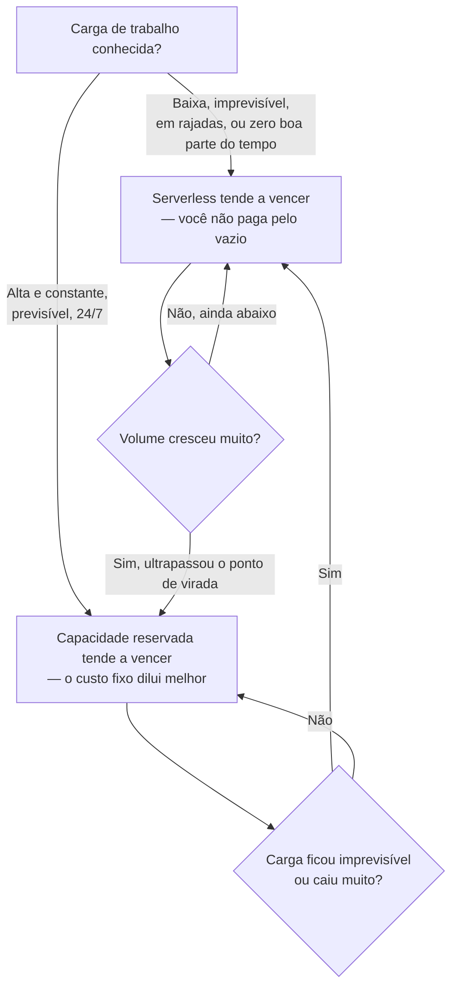
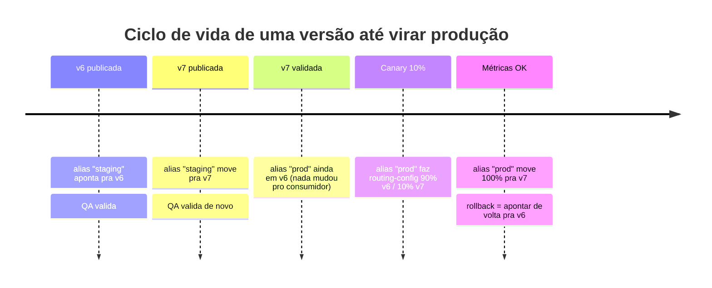

# Pricing, limites e operação

> [!abstract] TL;DR
> A promessa do serverless é "pague só pelo que usar" — e essa promessa é literalmente verdadeira, no sentido mais estrito possível: o AWS Lambda cobra por **número de requisições** e por **GB-segundo** (memória alocada × tempo de execução, arredondado a 1 ms). Não existe cobrança por servidor ocioso, porque não existe servidor ocioso para você. Mas a letra miúda importa tanto quanto a promessa: mais memória custa mais por segundo, mas pode custar *menos no total* se a função rodar mais rápido; ARM/Graviton é sistematicamente mais barato que x86 para a mesma carga; e existe todo um conjunto de custos que não aparecem na primeira leitura da fatura — concorrência provisionada ligada e esquecida, transferência de dados, chamadas para outros serviços, e logs do CloudWatch que, em funções muito verbosas, chegam a custar mais que a própria execução. Esta nota também cobre o outro lado da operação: como se versiona e se faz deploy seguro de uma função Lambda sem derrubar produção a cada `update-function-code`.

## A letra miúda da promessa "pague só pelo uso"

A nota 01 desta trilha apresentou o argumento central do serverless: você não paga por uma máquina ligada 24 horas por dia esperando tráfego que pode nunca chegar. Isso é verdade. Mas "pagar só pelo uso" é uma frase que esconde uma pergunta nada trivial: **uso de quê, exatamente, e medido como?**

A resposta do Lambda é precisa, e vale entender os dois eixos separadamente antes de somá-los numa fatura:

1. **Requisições** — quantas vezes a função foi invocada, não importa o resultado (sucesso, erro, timeout — todos contam).
2. **Duração** — quanto tempo cada invocação rodou, multiplicado pela memória que foi *alocada* para ela (não a memória que ela de fato usou — a que foi reservada no momento da configuração).

Essa segunda unidade tem nome próprio: **GB-segundo**. É a unidade que faz o Lambda ser, ao mesmo tempo, mais barato que uma VM ociosa e mais caro que uma VM ociosa não é, dependendo inteiramente de como a matemática se desenrola para a sua carga específica — e é exatamente essa matemática que o resto desta nota desenvolve.

## A fórmula de custo, com um exemplo trabalhado

A fórmula do Lambda, segundo a página oficial de pricing da AWS, tem esta forma:

```
GB-segundos por invocação = (memória alocada em GB) × (duração da execução em segundos, arredondada a 1 ms)
Custo de duração         = GB-segundos totais × preço por GB-segundo
Custo de requisições      = número de invocações × preço por milhão de requisições
Custo total               = custo de duração + custo de requisições − créditos do free tier
```

Os números oficiais, para a arquitetura x86 no tier padrão on-demand:

| Item | Valor |
|---|---|
| Preço por requisição | US$ 0,20 por milhão de requisições |
| Preço por GB-segundo (x86) | US$ 0,0000166667 |
| Free tier — requisições | 1.000.000 requisições/mês |
| Free tier — duração | 400.000 GB-segundos/mês |
| Arredondamento de duração | 1 ms |

> [!info] Caducidade
> Valores de pricing on-demand do Lambda (x86, tier padrão) verificados em `aws.amazon.com/lambda/pricing` em 2026-07-24. Preços da AWS mudam por região e por revisão de produto — confira a página oficial antes de orçar produção.

Agora o exemplo trabalhado, com uma carga plausível de uma API interna de médio porte:

- **10.000.000 requisições/mês**
- **300 ms de duração média por execução**
- **1024 MB (1 GB) de memória alocada**

```
Passo 1 — GB-segundos por invocação
  1 GB × 0,3 s = 0,3 GB-s

Passo 2 — GB-segundos totais
  10.000.000 × 0,3 GB-s = 3.000.000 GB-s

Passo 3 — abater o free tier
  Requisições billable: 10.000.000 − 1.000.000 = 9.000.000
  GB-s billable:        3.000.000 − 400.000     = 2.600.000

Passo 4 — aplicar o preço
  Custo de requisições: 9.000.000 / 1.000.000 × US$0,20 = US$ 1,80
  Custo de duração:     2.600.000 × US$0,0000166667      = US$ 43,33

Passo 5 — total
  US$ 1,80 + US$ 43,33 = US$ 45,13 / mês
```

Repare no que essa conta revela: o custo de requisições (US$ 1,80) é irrisório perto do custo de duração (US$ 43,33). Isso é a regra geral, não a exceção — em quase toda função Lambda com carga de trabalho real, é a *duração multiplicada pela memória* que domina a fatura, não o número de chamadas. Otimizar o "quantas vezes a função é chamada" quase sempre importa menos do que otimizar "quanto tempo cada chamada leva" e "quanta memória ela reserva".

## O ponto de virada: quando serverless é barato e quando explode

A matemática do pay-per-use tem uma propriedade que qualquer engenheiro sênior precisa saber articular numa entrevista: **o custo do Lambda cresce linearmente com o volume**, enquanto o custo de uma instância reservada é **fixo**, dentro da capacidade que ela oferece. Duas retas com inclinações diferentes se cruzam em algum ponto — e é esse ponto de cruzamento, não uma resposta genérica de "serverless é mais barato" ou "serverless é mais caro", que decide a escolha.



Vamos ao cálculo concreto — o mesmo perfil da seção anterior (10 milhões de requisições/mês, 300 ms, 1 GB de memória), agora contra uma instância EC2 reservada capaz de sustentar essa carga.

```
Custo Lambda por requisição (ignorando free tier, em escala):
  Duração:   0,3 GB-s × US$0,0000166667 = US$0,000005000
  Requisição:                              US$0,000000200
  Total por requisição:                    US$0,000005200

Custo Lambda projetado para 10M requisições:
  10.000.000 × US$0,000005200 ≈ US$ 52,00/mês (sem abater free tier)

Custo de uma instância reservada equivalente (ex.: t3.medium,
reserved 1 ano, sem pagamento antecipado — ordem de grandeza
ilustrativa, não cotação exata):
  ≈ US$ 20 a US$ 30/mês, fixo, independente do volume
```

> [!info] Caducidade
> Os valores de EC2 acima são **ilustrativos**, não uma cotação verificada nesta sessão — preços de instância reservada variam por região, tipo e modalidade de compromisso. Para o ponto de virada real de uma carga específica, use a AWS Pricing Calculator. O que a conta acima existe para mostrar é o *formato* do raciocínio, não o número exato.

Igualando as duas retas — custo Lambda por requisição × volume = custo fixo da instância — o ponto de virada para este perfil (300 ms, 1 GB) fica perto de **5 a 6 milhões de requisições/mês**. Abaixo disso, o Lambda tende a ser mais barato porque parte do tempo a instância reservada estaria ociosa, sendo paga do mesmo jeito. Acima disso, a reta do Lambda ultrapassa o custo fixo da instância e continua subindo — enquanto o custo da instância reservada permanece exatamente igual, tenha ela processado 6 milhões ou 60 milhões de requisições naquele mês (até o limite de capacidade física que ela aguenta).

Esse é o argumento de fundo que separa quem decide "serverless por modismo" de quem decide "serverless porque a conta fecha": **carga baixa, imprevisível, em rajada ou sazonal favorece Lambda; carga alta, constante e previsível favorece capacidade reservada.** E a decisão não é permanente — produtos crescem, migram de um lado do ponto de virada para o outro, e a arquitetura certa em 2024 pode não ser a certa em 2026.

## O impacto da memória no custo — e por que ARM é mais barato

Aqui mora uma armadilha de intuição. Mais memória custa mais por GB-segundo — isso é óbvio. O que não é óbvio é que mais memória também dá **mais CPU proporcional** à função (o Lambda aloca poder de processamento proporcionalmente à memória configurada), e uma função com mais CPU frequentemente **termina mais rápido**. Se a duração cai na proporção certa, o custo total — que é memória × duração, não memória sozinha — pode *cair*, não subir, ao aumentar a memória.

Retomando o exemplo desta nota: se a mesma função, com 1024 MB, levava 300 ms, e ao subir para 1769 MB (o ponto em que o Lambda aloca uma vCPU inteira) ela passa a levar 150 ms porque o gargalo era CPU, a conta de GB-segundos por invocação muda assim:

```
Antes:  1,000 GB × 0,300 s = 0,300 GB-s
Depois: 1,727 GB × 0,150 s = 0,259 GB-s   ← menos, apesar de mais memória
```

Essa é exatamente a ponte com [[03-Dominios/Tecnologia/Cloud/11 - Serverless e FaaS — Lambda a fundo/04 - Cold start, concurrency e performance|Cold start, concurrency e performance]], a nota anterior desta trilha: memória não é só uma variável de custo isolada — é uma variável de *performance* que se propaga direto para a fatura. Testar diferentes configurações de memória (a AWS oferece uma ferramenta open-source, o AWS Lambda Power Tuning, dedicada a isso) e medir custo real, não intuição, é prática de sênior.

A segunda alavanca de custo por memória é a **arquitetura do processador**. O Lambda oferece x86 e **arm64** (processadores Graviton2 da própria AWS), e o preço por GB-segundo em arm64 é sistematicamente mais baixo que em x86 para a mesma quantidade de memória — a AWS divulga a arquitetura Graviton2 como oferecendo melhor relação preço-performance para cargas de trabalho compatíveis.

> [!info] Caducidade
> A tabela completa de preços x86 vs. arm64 (por faixa de memória) na página oficial do Lambda é renderizada via JavaScript e não pôde ser extraída de forma confiável nesta sessão. O diferencial de preço entre as duas arquiteturas é público e estável há vários lançamentos, mas confirme os valores exatos por memória em `aws.amazon.com/lambda/pricing` (alternar a aba "Arm" no simulador) antes de orçar produção.

Trocar de x86 para arm64 costuma exigir recompilar dependências nativas (nada que dependa de binários pré-compilados x86 funciona sem ajuste) e reempacotar — não é um switch de configuração sem custo de engenharia — mas, para funções sem dependência nativa pesada, é uma das otimizações de custo com melhor relação esforço/retorno que existe no Lambda.

Para dar corpo ao "sistematicamente mais barato", vale aplicar um desconto ilustrativo de arm64 sobre o exemplo trabalhado da seção anterior desta nota (10 milhões de requisições, 300 ms, 1 GB, 2.600.000 GB-s billable) — usando a ordem de grandeza publicamente conhecida de economia do Graviton2 em cargas comparáveis, próxima de 20% sobre o preço de duração:

```
GB-s billable (igual ao exemplo x86):        2.600.000
Preço de duração arm64 (ilustrativo, ~20%
menor que os US$0,0000166667 do x86):        ≈ US$ 0,0000133334 / GB-s

Custo de duração em arm64:
  2.600.000 × US$0,0000133334 ≈ US$ 34,67

Custo de requisições (igual, arquitetura não muda esse preço):
  US$ 1,80

Total arm64 ≈ US$ 36,47/mês   (contra US$ 45,13/mês em x86 —
economia de aproximadamente 19% no total, sem tocar em código de negócio)
```

> [!info] Caducidade
> O valor de US$ 0,0000133334/GB-s acima é **ilustrativo**, derivado do percentual de economia amplamente divulgado do Graviton2 em cargas Lambda comparáveis — não foi confirmado diretamente contra a tabela oficial nesta sessão (motivo já explicado no callout anterior). Trate a economia relatada (~19–20%) como ordem de grandeza para justificar o teste, não como número a colar num orçamento fechado sem conferência.

> [!tip] Assista: Optimize Your AWS Lambda Function With Power Tuning
> **Canal:** Be A Better Dev | **Duração:** ~11min | **Idioma:** EN
>
> Mostra o AWS Lambda Power Tuning citado acima em ação de verdade: roda a mesma função em várias configurações de memória, plota duração e custo lado a lado, e deixa visível — com números reais, não intuição — o ponto em que aumentar memória reduz custo total em vez de aumentar. Trecho de destaque [09:32]: *"the more memory that you throw at the lambda function the more compute capacity it's going to have however there are diminishing returns... when you look at the cost increase it jumped by i would say a third of the cost"*
>
> 🎬 [Assistir no YouTube](https://www.youtube.com/watch?v=QUJ_Govd0CQ)

## Custos escondidos: a fatura não é só a função

Quatro itens que raramente aparecem na primeira estimativa de custo de uma arquitetura serverless, e que já surpreenderam times inteiros na primeira fatura real:

**Provisioned concurrency.** Cobre o problema de cold start (visto em [[03-Dominios/Tecnologia/Cloud/11 - Serverless e FaaS — Lambda a fundo/04 - Cold start, concurrency e performance|Cold start, concurrency e performance]]) mantendo um número fixo de execuções "quentes" o tempo todo — mas "quente o tempo todo" tem preço próprio, cobrado *mesmo sem nenhuma invocação acontecer*:

| Item | Preço (x86, on-demand equivalente) |
|---|---|
| Duração normal (sob demanda) | US$ 0,0000166667 / GB-s |
| Provisioned concurrency — capacidade reservada (ociosa ou ativa) | US$ 0,0000041667 / GB-s |
| Provisioned concurrency — execução ativa (com desconto) | US$ 0,0000097222 / GB-s |

> [!info] Caducidade
> Preços de provisioned concurrency verificados em `aws.amazon.com/lambda/pricing` em 2026-07-24. O ponto crítico, confirmado na mesma página: **o free tier não se aplica a funções com provisioned concurrency habilitado** — cada GB-segundo é cobrado desde o primeiro, mesmo sem tráfego algum.

**Data transfer.** Transferência de dados *entre* Lambda e a maioria dos serviços AWS na mesma região (S3, DynamoDB, SQS, SNS, Kinesis) não é cobrada — mas dados saindo da AWS para a internet seguem a tabela padrão de "data transfer out", que não é zero a partir de um certo volume mensal. Funções que fazem VPC networking (para acessar RDS numa subnet privada, por exemplo) também incorrem em custo de ENI e NAT Gateway, que não aparece na fatura do Lambda — aparece na fatura de EC2/VPC. O padrão que pega times de surpresa: uma função que devolve payloads grandes (relatórios, exports, imagens processadas) direto pela resposta HTTP, em vez de gravar num bucket S3 e devolver uma URL assinada, multiplica o volume de "data transfer out" por invocação — em alto volume, essa é a linha que cresce mais rápido na fatura de rede, não a do Lambda em si.

**Chamadas para outros serviços.** Uma função Lambda que lê e escreve em DynamoDB, publica em SNS, e invoca outra função a jusante está, ela mesma, gerando três faturas separadas — a do DynamoDB por unidade de capacidade ou requisição, a do SNS por mensagem publicada, a do Lambda a jusante por sua própria invocação. "O custo do Lambda" isoladamente é sempre menor que "o custo da arquitetura serverless completa" — e é este segundo número que precisa orçar.

**Logs do CloudWatch.** Toda invocação Lambda, por padrão, escreve no CloudWatch Logs. Ingestão de logs é cobrada por GB ingerido, mais um custo de armazenamento por GB por mês. Uma função com `print`/`console.log` verboso em cada invocação, rodando milhões de vezes por mês, gera um volume de log que — em times que nunca ajustaram o nível de log ou o período de retenção — já foi flagrado superando o custo da própria execução da função.

> [!warning] Logs do CloudWatch custando mais que a função
> É um cenário real, não hipotético: uma função de alto volume, com logging verboso "para debug" deixado ligado em produção, gera gigabytes de log por dia. Ao custo de ingestão somado ao de armazenamento sem política de retenção configurada (o padrão é "manter para sempre"), a linha do CloudWatch Logs na fatura ultrapassa a linha do Lambda. Configure nível de log e `retention_in_days` explicitamente — nunca deixe no padrão "sem expiração".

## Versionamento e aliases: como não quebrar produção no deploy

Toda função Lambda tem, desde a criação, uma versão especial chamada **`$LATEST`** — é para onde `update-function-code` sempre escreve, e é mutável por definição: o código apontado por `$LATEST` muda a cada deploy. É prático para desenvolvimento, e é exatamente o motivo pelo qual `$LATEST` **nunca deveria ser o que produção invoca diretamente** — se alguém fizer deploy de um bug enquanto produção aponta para `$LATEST`, o bug vai ao ar instantaneamente, sem intermediário.

A solução é publicar **versões**: um snapshot imutável do código e da configuração naquele instante, identificado por um número sequencial (1, 2, 3...). Uma vez publicada, uma versão nunca muda — é a garantia de reprodutibilidade que falta ao `$LATEST`.

```bash
# Publica a versão atual de $LATEST como um snapshot imutável
aws lambda publish-version \
  --function-name minha-funcao \
  --description "release 2026-07-24 — corrige timeout no handler de upload"
```

A resposta traz o número da versão nova, junto com o ARN completo que a identifica de forma permanente:

```json
{
    "FunctionName": "minha-funcao",
    "FunctionArn": "arn:aws:lambda:us-east-1:123456789012:function:minha-funcao:7",
    "Version": "7",
    "LastModified": "2026-07-24T14:02:11.000+0000"
}
```

Versões numeradas resolvem imutabilidade, mas criam um problema novo: nada, em nenhum sistema que invoca a função, quer apontar para "versão 7" hoje e precisar ser reconfigurado manualmente para "versão 8" amanhã. É para isso que existem os **aliases** — um ponteiro nomeado e mutável, que aponta para uma versão específica, e que pode ser trocado sem que quem invoca a função saiba ou precise mudar nada:

```bash
# Cria o alias "prod", apontando para a versão 7
aws lambda create-alias \
  --function-name minha-funcao \
  --name prod \
  --function-version 7 \
  --description "producao"

# O consumidor invoca sempre o alias, nunca o número da versao:
# arn:aws:lambda:us-east-1:123456789012:function:minha-funcao:prod
```

Trocar produção para a versão 8, depois de validada, é uma única chamada — sem tocar em nenhum consumidor:

```bash
aws lambda update-alias \
  --function-name minha-funcao \
  --name prod \
  --function-version 8
```



O passo final — o que separa "trocar o alias" de "trocar o alias com segurança" — é o **weighted alias**, o mecanismo nativo do Lambda para canary release: um alias pode apontar para *duas* versões ao mesmo tempo, com um peso de tráfego configurável entre elas.

```bash
# 90% do tráfego continua na v6 (estável), 10% vai testando a v7
aws lambda update-alias \
  --function-name minha-funcao \
  --name prod \
  --function-version 6 \
  --routing-config AdditionalVersionWeights={"7"=0.10}
```

Se as métricas da v7 (taxa de erro, latência, alarmes do CloudWatch) se mantiverem saudáveis durante a janela de observação, o peso sobe gradualmente até 100%. Se algo quebrar, **rollback é trivial**: basta apontar o alias de volta para 100% na versão anterior — não existe redeploy, não existe rebuild, é uma mudança de metadado que leva segundos.

| Conceito | Mutável? | Uso típico |
|---|---|---|
| `$LATEST` | Sim — muda a cada deploy | Desenvolvimento, nunca produção |
| Versão publicada (`1`, `2`, `3`...) | Não — imutável para sempre | Referência estável, auditoria, rollback exato |
| Alias (`prod`, `staging`) | Sim — o ponteiro muda, a versão-alvo não | O que consumidores de fato invocam |
| Weighted alias | Sim — o peso entre duas versões muda | Canary release, deploy progressivo |

## Operação de deploy, de raspão

Sem entrar no território da nota que um galho futuro (Infraestrutura como Código, com Terraform/CloudFormation/SAM/CDK) vai cobrir a fundo, vale fixar o vocabulário mínimo de como uma função Lambda chega a existir em produção:

- **Deployment package** — o artefato que carrega o código da função, cuja anatomia (handler, runtime, camadas) [[03-Dominios/Tecnologia/Cloud/11 - Serverless e FaaS — Lambda a fundo/02 - Anatomia de uma função Lambda|Anatomia de uma função Lambda]] já cobriu: um `.zip` (limite de 50 MB comprimido via upload direto, 250 MB descomprimido, contando camadas/layers) ou uma imagem de container (até 10 GB), publicada num registro compatível com o Lambda.
- **Camadas (layers)** — dependências compartilhadas entre várias funções (bibliotecas comuns, um runtime customizado) empacotadas separadamente do código de negócio, para não duplicar o mesmo `.zip` de dependências em cada função.
- **Infraestrutura como código** — em times sérios, `publish-version`/`create-alias`/`update-alias` não são chamados manualmente a cada deploy: um pipeline de CI/CD, orquestrado por SAM, CDK ou Terraform, publica a versão, roda testes de fumaça contra ela via um alias temporário, e só então promove o `prod` — com o weighted alias acima automatizado como canary progressivo. O aprofundamento dessas ferramentas fica para o galho de Infraestrutura como Código. Para dar uma ideia do formato, sem entrar no aprendizado da ferramenta: o SAM (Serverless Application Model, uma extensão de CloudFormation feita especificamente para Lambda) declara canary release como uma propriedade de configuração, não como uma sequência manual de comandos:

```yaml
# trecho ilustrativo de template.yaml (SAM) — não é o foco desta nota,
# só mostra que o canary da seção anterior vira declarativo em IaC
Resources:
  MinhaFuncao:
    Type: AWS::Serverless::Function
    Properties:
      Handler: app.handler
      Runtime: python3.13
      AutoPublishAlias: prod
      DeploymentPreference:
        Type: Canary10Percent5Minutes   # 10% do tráfego por 5 min, depois 100%
        Alarms:
          - !Ref ErroAltoAlarm           # rollback automático se disparar
```

  A vantagem de declarar isso em IaC em vez de rodar os comandos manuais desta nota um a um: o mesmo pipeline que publica a versão também associa um alarme do CloudWatch ao canary, e reverte sozinho se a taxa de erro subir durante a janela — o rollback deixa de depender de alguém notar o problema a tempo.
- **Rollback** é sempre, na prática, uma operação de alias — nunca um "desfazer" no código. Apontar `prod` de volta para a versão anterior é a forma correta e imediata de reverter um deploy ruim.

Um checklist mínimo de deploy seguro, juntando tudo o que esta seção cobriu:

- [ ] O código nunca vai para `prod` direto de `$LATEST` — sempre passa por uma versão publicada.
- [ ] Existe um alias `staging` (ou equivalente) apontando para a versão nova, validado antes de tocar em produção.
- [ ] O primeiro tráfego real na versão nova é uma fração pequena (5–10%), via `routing-config`, não 100% de uma vez.
- [ ] Existe um alarme do CloudWatch monitorando taxa de erro/latência durante a janela de canary.
- [ ] O caminho de rollback (apontar o alias de volta) foi testado *antes* do incidente, não descoberto durante ele.

| Estratégia de rollback | Velocidade | Risco residual |
|---|---|---|
| Reverter o alias para a versão anterior | Segundos — troca de metadado, sem rebuild | Baixo — versão anterior já era estável em produção |
| Redeploy do commit anterior via pipeline | Minutos — rebuild + republish completo | Médio — depende do pipeline estar saudável no momento do incidente |
| Editar `$LATEST` manualmente e torcer | Imprevisível | Alto — reintroduz exatamente o problema que versão+alias existem para evitar |

## Lente dupla: Lambda e DigitalOcean Functions

O AWS Lambda cobra em **GB-segundo** (memória × tempo, x86 e arm64 com preços diferentes) mais um valor por milhão de requisições. A DigitalOcean, com a filosofia de simplicidade que já apareceu em notas anteriores desta trilha, tem um modelo deliberadamente mais raso: **GiB-segundo** único, sem tiers de arquitetura e sem cobrança por requisição.

| Dimensão | AWS Lambda | DigitalOcean Functions |
|---|---|---|
| Unidade de compute | GB-segundo (memória em GB × tempo) | GiB-segundo (memória em GiB × tempo) |
| Preço de compute | US$ 0,0000166667/GB-s (x86, tier padrão) | US$ 0,0000185/GiB-s (equivalente a US$0,07/GiB-hora) |
| Cobrança por requisição | Sim — US$ 0,20/milhão | Não — sem cobrança separada por invocação |
| Free tier | 1.000.000 requisições + 400.000 GB-s/mês | 90.000 GiB-s (25 GiB-hora)/mês por time |
| Tiers de arquitetura (x86 vs ARM) | Sim — arm64/Graviton2 mais barato | Não — modelo único |
| Duração mínima cobrada por invocação | Arredondada a 1 ms | Mínimo de 100 ms por invocação |
| Concorrência provisionada (custo de ficar "quente") | Sim, item de linha próprio | Não documentado como produto separado |

> [!info] Caducidade
> Preço de DigitalOcean Functions (US$ 0,0000185/GiB-s, free tier de 90.000 GiB-s/mês) verificado em `docs.digitalocean.com/products/functions/details/pricing/` em 2026-07-24.

A diferença estrutural mais importante não está no valor por segundo — está em **quantas alavancas cada provedor oferece para otimizar**. A AWS dá duas dimensões independentes para apertar (memória/CPU e arquitetura de processador), mais um item de linha inteiro para gerenciar concorrência a quente. A DigitalOcean dá uma dimensão só: memória alocada. Isso é mais simples de prever e orçar — e mais raso para otimizar quando a fatura cresce. É o mesmo padrão de troca "granularidade por complexidade" contra "simplicidade por teto de otimização" que já apareceu nas notas de IAM desta trilha, agora aplicado a custo em vez de identidade.

## Tabela de tradução: como Azure e GCP cobram FaaS

| Dimensão | AWS Lambda | Azure Functions | Google Cloud Functions | DigitalOcean Functions |
|---|---|---|---|---|
| Unidade de compute | GB-segundo | GB-segundo (Consumption) / vCPU-s + GB-s (Premium) | GB-segundo + GHz-segundo (CPU) | GiB-segundo |
| Cobrança por invocação | Sim, por milhão | Sim, por milhão (Consumption) | Sim, por milhão | Não |
| Plano "sempre quente" dedicado | Provisioned concurrency (por GB-s) | Plano Premium (capacidade reservada) | Cloud Run functions com min-instances | Não documentado |
| Free tier mensal | 1M requisições + 400k GB-s | 1M execuções + 400k GB-s (Consumption) | 2M invocações + GB-s/GHz-s inclusos | 90k GiB-s |

> [!info] Caducidade
> Os valores de Azure Functions e Google Cloud Functions acima descrevem a **estrutura** de cobrança (quais dimensões cada provedor mede), não uma cotação verificada nesta sessão — esta nota fez WebFetch apenas contra AWS e DigitalOcean. Confirme preços exatos em `azure.microsoft.com/pricing/details/functions` e `cloud.google.com/functions/pricing` antes de orçar produção multi-nuvem.

O padrão que atravessa as quatro linhas dessa tabela vale mais do que os números exatos de qualquer célula: todo provedor de FaaS sério cobra por **tempo × memória** como eixo principal, e a diferença entre eles está em quantos eixos secundários eles empilham em cima disso. A AWS empilha arquitetura de processador (x86/arm64) e um produto separado para concorrência quente. O Google empilha uma segunda unidade de CPU (GHz-segundo) além da memória, refletindo um modelo de billing historicamente mais granular. A DigitalOcean, de novo, escolhe achatar tudo isso numa única dimensão. Para migrar um orçamento de um provedor para outro, a pergunta certa nunca é "qual preço por segundo é menor" isoladamente — é "quantas dimensões meu perfil de carga realmente movimenta", porque uma função CPU-bound se comporta de forma muito diferente entre um modelo que cobra GHz-segundo à parte e um que não cobra.

## Armadilhas comuns

> [!warning] Esquecer provisioned concurrency ligada
> Provisioned concurrency é cobrada por GB-segundo *mesmo sem tráfego*, e o free tier não se aplica a ela. É comum ligar provisioned concurrency para um evento pontual (um lançamento, um pico previsto), esquecer de desligar depois, e só notar na fatura do mês seguinte. Trate provisioned concurrency como um recurso com custo fixo — audite periodicamente o que está ligado, do mesmo jeito que se audita instâncias EC2 esquecidas rodando.

> [!warning] Achar que o free tier cobre produção
> 1 milhão de requisições e 400.000 GB-segundos por mês parecem generosos — e cobrem, confortavelmente, ambiente de desenvolvimento, testes, e produtos em estágio muito inicial. Mas o exemplo trabalhado desta nota (10 milhões de requisições, 300 ms, 1 GB) já ultrapassa o free tier de duração em mais de seis vezes. Orçar uma arquitetura de produção assumindo que o free tier absorve o volume real é o tipo de erro que só aparece na primeira fatura de verdade.

> [!warning] Loop recursivo de Lambda gerando fatura absurda
> Uma função que escreve num bucket S3, com um trigger configurado no *mesmo* bucket para invocar a *mesma* função a cada escrita, entra em loop — cada invocação gera uma nova escrita, que gera uma nova invocação, sem parar sozinha. É um erro de configuração real, documentado pela própria AWS, e a diferença entre pegar em minutos e pegar em dias é a diferença entre uma fatura de dezenas de dólares e uma de milhares. A AWS oferece detecção automática de recursão para casos comuns (S3↔Lambda, SNS↔Lambda), mas a defesa mais confiável continua sendo revisar a topologia de triggers antes de publicar, não confiar só na rede de segurança automática.

> [!warning] Logs verbosos custando mais que a execução
> Já coberto na seção de custos escondidos, mas vale repetir como armadilha isolada porque é a mais comum das quatro: nível de log em `DEBUG` deixado ligado em produção, sem retenção configurada, numa função de alto volume. Configure `retention_in_days` explicitamente em todo log group — o padrão do CloudWatch é reter para sempre, e "para sempre" é caro em escala.

## Casos práticos

**O deploy que quase saiu errado.** Um time publica a versão 12 de uma função de checkout, roda os testes automatizados contra o alias `staging` (que já aponta para a versão 12), e tudo passa. Em vez de mover `prod` inteiro de uma vez, configuram `routing-config` com 5% do tráfego real na versão 12 e 95% ainda na versão 11. Quinze minutos depois, um alarme do CloudWatch dispara: a taxa de erro na versão 12 está anormalmente alta — um caso de borda no cálculo de frete que os testes automatizados não cobriam. Como só 5% do tráfego real foi afetado, e o rollback é apontar o alias de volta para 100% na versão 11, o incidente dura minutos, não horas, e a maioria dos clientes nunca percebe. É o argumento completo, em um único incidente, para nunca fazer deploy de Lambda sem versão, alias e canary.

**A fatura que veio maior que o esperado.** Uma equipe migra um endpoint de alto tráfego para Lambda, orça com base no exemplo de 10 milhões de requisições desta nota, e a fatura do primeiro mês vem 30% acima do previsto. A investigação encontra duas causas, nenhuma delas na linha do Lambda: um log group sem `retention_in_days` configurado, acumulando gigabytes de log de debug esquecido em produção, e um provisioned concurrency de 20 instâncias ligado durante um teste de carga duas semanas antes — e nunca desligado. Nenhuma das duas aparece numa estimativa que só olha "requisições × duração × memória". É exatamente por isso que a seção de custos escondidos desta nota existe: a fatura de uma arquitetura serverless nunca é só a função.

## O que vem a seguir

Esta nota fechou o ciclo de "como a função roda e quanto custa fazê-la rodar" — anatomia, eventos, concorrência/performance, e agora pricing e operação. O que ainda falta é a pergunta que resume a trilha inteira: dado tudo isso, **quando serverless é de fato a escolha certa**, e quando é só a escolha da moda? É essa pergunta — decisão arquitetural, não mais mecanismo — que o capstone deste galho vai enfrentar de frente, juntando o que as cinco notas anteriores estabeleceram numa única lente de decisão.

## Fontes

- [AWS Lambda — Pricing](https://aws.amazon.com/lambda/pricing/) — preço por requisição (US$0,20/milhão), preço por GB-segundo x86 (US$0,0000166667), free tier (1M requisições + 400.000 GB-s), preços de provisioned concurrency (US$0,0000041667/GB-s reservado + US$0,0000097222/GB-s ativo), exclusão do free tier para provisioned concurrency; acessado em 2026-07-24.
- [DigitalOcean — Functions Pricing](https://docs.digitalocean.com/products/functions/details/pricing/) — modelo GiB-segundo, preço US$0,0000185/GiB-s (US$0,07/GiB-hora), free tier de 90.000 GiB-s/mês por time, ausência de cobrança por requisição, duração mínima de 100 ms por invocação; acessado em 2026-07-24.
- [AWS Lambda — Configuring function memory](https://docs.aws.amazon.com/lambda/latest/dg/configuration-memory.html) — relação entre memória alocada e CPU proporcional, impacto de memória em duração e custo.
- [AWS Lambda — Lambda function versions](https://docs.aws.amazon.com/lambda/latest/dg/configuration-versions.html) — semântica de `$LATEST` (mutável) vs. versões publicadas (imutáveis).
- [AWS Lambda — Lambda function aliases](https://docs.aws.amazon.com/lambda/latest/dg/configuration-aliases.html) — aliases como ponteiro mutável, weighted alias e `routing-config` para canary release.
- [AWS CLI — lambda publish-version](https://docs.aws.amazon.com/cli/latest/reference/lambda/publish-version.html) — sintaxe e formato de resposta do comando de publicação de versão.
- [AWS CLI — lambda create-alias / update-alias](https://docs.aws.amazon.com/cli/latest/reference/lambda/create-alias.html) — sintaxe de criação e atualização de alias, incluindo `--routing-config`.
- [AWS Lambda — Lambda quotas](https://docs.aws.amazon.com/lambda/latest/dg/gettingstarted-limits.html) — limites de tamanho de deployment package (.zip e imagem de container), camadas.
- [AWS re:Post — Troubleshoot recursive invocations in Lambda](https://repost.aws/knowledge-center/lambda-troubleshoot-recursive-invocation) — mecanismo de loop recursivo entre Lambda e outros serviços, e detecção automática de recursão.

