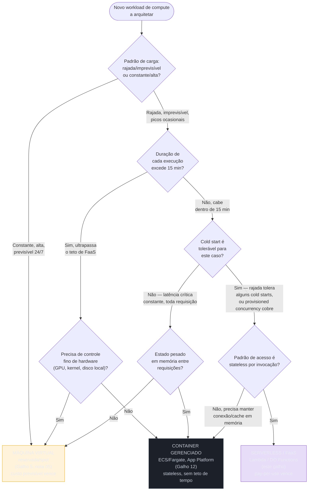
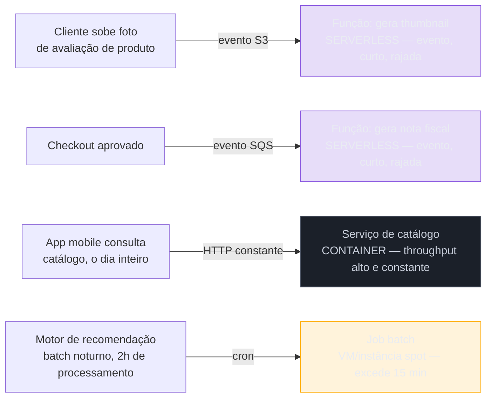
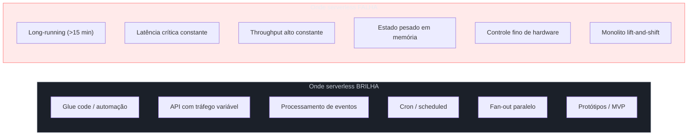
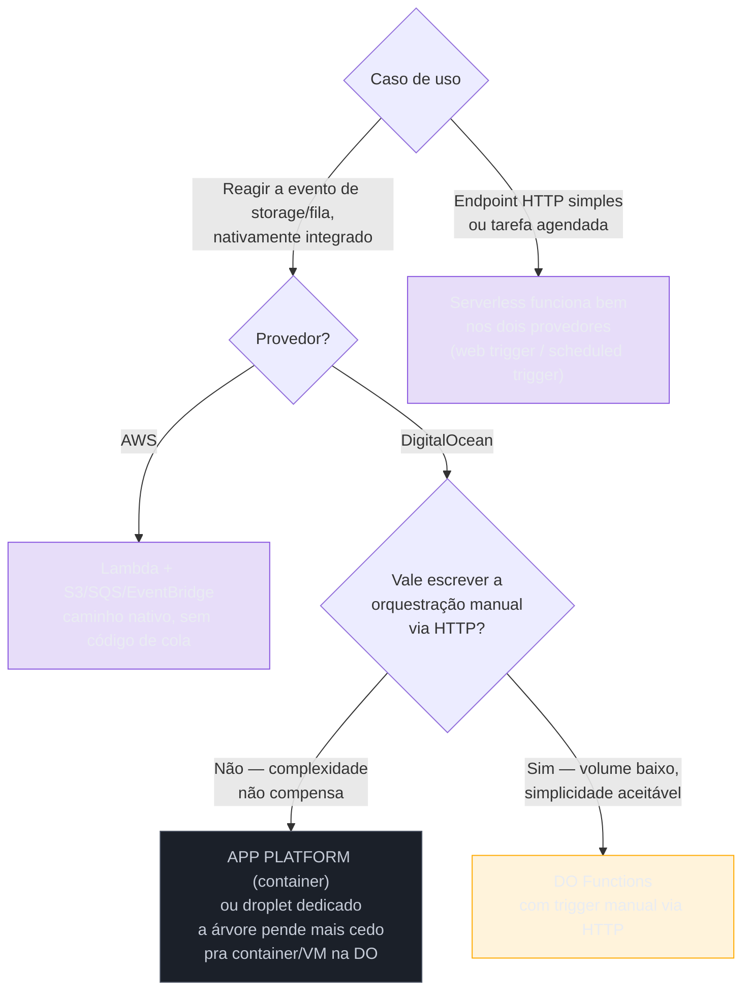

# Quando serverless faz (e não faz) sentido

> [!abstract] TL;DR
> As cinco notas anteriores deste galho construíram serverless de baixo pra cima: o modelo mental de "sem servidor visível, cobrado pelo uso" ([[03-Dominios/Tecnologia/Cloud/11 - Serverless e FaaS — Lambda a fundo/01 - O que é serverless, de verdade|nota 01]]), a anatomia de uma função por dentro ([[03-Dominios/Tecnologia/Cloud/11 - Serverless e FaaS — Lambda a fundo/02 - Anatomia de uma função Lambda|nota 02]]), o modelo de eventos que a alimenta ([[03-Dominios/Tecnologia/Cloud/11 - Serverless e FaaS — Lambda a fundo/03 - O modelo de eventos: triggers e integrações|nota 03]]), o que acontece com performance quando ela escala — cold start, concorrência, provisioned concurrency ([[03-Dominios/Tecnologia/Cloud/11 - Serverless e FaaS — Lambda a fundo/04 - Cold start, concurrency e performance|nota 04]]) — e quanto tudo isso custa em produção ([[03-Dominios/Tecnologia/Cloud/11 - Serverless e FaaS — Lambda a fundo/05 - Pricing, limites e operação|nota 05]]). Faltava só a pergunta que nenhuma das cinco respondia sozinha: **dado um problema real, serverless é a escolha certa, ou é só a escolha da moda?** Este capstone responde com uma árvore de decisão contra container gerenciado e VM, nomeia onde FaaS brilha e onde ele quebra a cara, encara o lock-in de frente, e prepara o terreno para o resto do Bloco 3 — containers gerenciados, mensageria, API Gateway e arquiteturas event-driven completas.

## A pergunta que amarra o galho

Um arquiteto sênior nunca escolhe compute por moda. A pergunta certa não é "serverless é bom?" — é "este problema específico, com este padrão de carga e esta tolerância a latência, se encaixa melhor em função, container ou máquina virtual?". As cinco notas anteriores deram munição técnica para responder isso com precisão: sabemos que uma função tem teto de 15 minutos, sabemos que a primeira invocação depois de um período ocioso paga cold start, sabemos que o modelo de cobrança pune carga alta e constante e premia carga em rajada. O que faltava era organizar esses fatos numa decisão só, contra as duas alternativas que este galho contrastou o tempo todo — [[03-Dominios/Tecnologia/Cloud/05 - Compute I — máquinas virtuais/index|Compute I]] (a VM provisionada à mão) e [[03-Dominios/Tecnologia/Cloud/06 - Compute II — elasticidade e balanceamento/index|Compute II]] (a elasticidade de VM que serverless tenta substituir) — e é isso que a árvore a seguir faz.

## A árvore de decisão: serverless, container gerenciado ou VM



Uma frase por caminho: **serverless** vence quando a carga é imprevisível, a execução é curta, o cold start é tolerável (ou mitigado com provisioned concurrency) e o processamento é stateless por invocação. **Container gerenciado** vence quando o processo é stateless mas precisa rodar por mais tempo, manter uma conexão viva, ou simplesmente não tolera nenhum cold start em nenhuma invocação. **VM** vence quando a carga é constante e alta o bastante para que o custo por hora reservada bata o custo por invocação, ou quando o workload exige controle de hardware que nenhuma das duas abstrações gerenciadas entrega.

> [!info] Fronteira
> Esta árvore decide **onde o código roda**. Ela não decide *como os componentes conversam entre si* (isso é o modelo de eventos da nota 03, aprofundado nos Galhos 13-15) nem *como escalar* dentro de cada opção (VM: Galho 6; container: Galho 12). É deliberadamente a primeira pergunta, não a única.

### Os eixos por trás da árvore

| Eixo | Serverless (FaaS) | Container gerenciado | VM |
|---|---|---|---|
| Padrão de carga ideal | Rajada, imprevisível, picos ocasionais | Constante moderada a alta, com picos | Constante, alta, previsível |
| Duração da tarefa | Segundos a 15 min (teto duro) | Sem teto — processo de longa duração | Sem teto |
| Cold start | Existe, mitigável com provisioned concurrency (nota 04) | Praticamente ausente (processo já roda) | Ausente (sempre ligada) |
| Estado em memória entre chamadas | Não confiável — ambiente pode ser reciclado a qualquer momento | Sim, enquanto o container viver | Sim, o tempo que a instância viver |
| Controle de ambiente/hardware | Nenhum — runtime e SO gerenciados pelo provedor | Parcial — você escolhe a imagem, o provedor gerencia o host | Total — SO, kernel, disco, GPU dedicada |
| Unidade de escala | Por invocação, automática, quase instantânea | Por réplica de container, segundos | Por instância, minutos (Galho 6) |
| Modelo de custo | Por invocação + duração × memória (nota 05) | Por vCPU/memória alocada, enquanto o container roda | Por hora/segundo da instância (Galho 5) |

### Matriz de decisão por eixo — limiares práticos

A tabela de eixos acima é qualitativa; vale ancorar cada eixo num número concreto, já estabelecido pelas notas anteriores, para tirar a decisão do campo do "acho que":

| Eixo | Limiar prático | Fonte |
|---|---|---|
| Volume mensal (perfil ~300 ms, 1 GB) | Acima de ~5-6 milhões de requisições/mês, capacidade reservada tende a vencer | Nota 05 |
| Duração por execução | Acima de 15 minutos, Lambda é desqualificado — não é mais pergunta de custo, é limite duro | Notas 01 e 04 |
| Concorrência simultânea (AWS) | Acima de 1.000 execuções concorrentes por região (padrão de conta), requer aumento de quota | Nota 04 |
| Concorrência simultânea (DigitalOcean) | Acima de 120 execuções concorrentes por namespace, sem caminho de aumento documentado como produto | Nota 04 |
| Cold start tolerável | Se a fase Init (até 10s de teto duro) não pode aparecer em nenhuma requisição do usuário, considerar provisioned concurrency ou container | Nota 04 |
| Estado em memória | Qualquer dependência de estado sobrevivendo entre invocações sem TTL/persistência externa é desqualificante | Nota 04 |

Nenhum desses números é absoluto — a nota 05 já avisou que o ponto de virada de custo muda com o perfil de duração e memória de cada função — mas eles dão um chão concreto para a árvore, em vez de deixá-la como intuição pura.

### A decisão não é permanente

Vale nomear explicitamente algo que os dois casos práticos ao fim desta nota vão mostrar de novo: nenhuma das três caixas da árvore é uma sentença definitiva para um workload. Um produto nasce pequeno, com tráfego imprevisível — serverless vence com folga. O produto cresce, o tráfego que era rajada vira platô alto e constante — o mesmo cálculo de custo que justificou serverless no dia 1 agora aponta para o lado oposto. Nada disso é falha de arquitetura original; é a natureza de uma decisão que depende de números que mudam com o produto.

| Sinal de que vale reavaliar | O que fazer |
|---|---|
| A fatura de Lambda cresce mês a mês, acompanhando tráfego que deixou de ser sazonal | Recalcular o ponto de virada (nota 05) contra capacidade reservada |
| Provisioned concurrency ficou ligada permanentemente, "só para não ter cold start" | Reconhece na prática que o workload virou "sempre quente" — avaliar container gerenciado |
| Uma função que era rápida (segundos) foi crescendo em escopo até se aproximar do teto de 15 min | Sinal de escopo inchado — dividir em funções menores ou migrar para job em container/VM |
| O time gasta mais tempo depurando cold start e limite de payload do que escrevendo feature nova | Custo de operação da abstração superou o valor que ela entrega — reavaliar |

Nenhum desses sinais é motivo de pânico — são exatamente o tipo de dado que faz um arquiteto sênior revisitar uma decisão de anos atrás com a mesma disciplina usada para tomá-la da primeira vez. A verificação em si não pede intuição — pede consultar os mesmos números que a nota 05 já ensinou a ler:

```bash
# Volume e duração média dos últimos 30 dias — os dois insumos do ponto de virada
$ aws cloudwatch get-metric-statistics \
    --namespace AWS/Lambda \
    --metric-name Invocations \
    --dimensions Name=FunctionName,Value=loja-catalogo-api \
    --start-time $(date -u -d '30 days ago' +%Y-%m-%dT%H:%M:%S) \
    --end-time $(date -u +%Y-%m-%dT%H:%M:%S) \
    --period 2592000 \
    --statistics Sum

# Provisioned concurrency ligada há quanto tempo — o sinal mais barato
# de detectar "isto virou sempre-quente e talvez devesse ser container"
$ aws lambda list-provisioned-concurrency-configs \
    --function-name loja-catalogo-api
```

Um número de invocações que só cresce, mês após mês, junto com uma configuração de provisioned concurrency que nunca foi desligada, é o par de sinais mais barato de auditar antes de decidir se vale reabrir a árvore de decisão para aquela função específica. Na DigitalOcean, o sinal equivalente mais barato de auditar é quão perto do teto de 120 execuções concorrentes por namespace uma função está chegando nos picos — o comando `doctl` correspondente lista as ativações recentes de um namespace inteiro:

```bash
# DigitalOcean — ativações recentes de um namespace, para checar
# se o volume está se aproximando do teto de 120 execuções concorrentes
$ doctl serverless activations list --limit 100 \
    --field "Function,Start,Duration,Status"
```

Um namespace onde as ativações concorrentes rotineiramente flertam com o teto é o sinal, na lente da DigitalOcean, de que a árvore da seção anterior já deveria estar apontando para App Platform, não para uma tentativa de contornar o limite.

> [!tip] Assista: Containers or serverless functions: A path for cloud-native success (re:Invent 2024, SVS209)
> **Canal:** AWS Events | **Duração:** ~56min | **Idioma:** EN
>
> Reforça, direto de arquitetos da AWS, o mesmo ponto central desta nota: a escolha entre container e função não é sobre o tipo de aplicação ("isto é uma web API, logo é container") — é sobre requisitos não-funcionais (padrão de escala, granularidade de billing, tolerância a cold start) que mudam ao longo da vida do workload. Trecho de destaque [37:13]: *"the decision when to use containers or functions is mainly driven by nonfunctional requirements so you essentially cannot say that okay this is a web API I just need to use containers or this is that specific application and this is for functions"*
>
> 🎬 [Assistir no YouTube](https://www.youtube.com/watch?v=OUXZEg3qUKI)

## Onde serverless brilha

A árvore decide o caso geral; vale nomear os padrões concretos onde a resposta "serverless" aparece com tanta frequência que já é reconhecível de longe.

**Glue code e automação.** Uma função que reage a um evento pontual — redimensionar uma imagem depois de um upload no S3, validar um arquivo antes de movê-lo, notificar um serviço quando um item muda de status numa fila — é exatamente o formato que a nota 03 mapeou: evento entra, função roda por segundos, sai. Não há servidor para manter porque não há trabalho contínuo o bastante para justificar um.

**Backends de API com tráfego variável.** Um endpoint que recebe 10 requisições por minuto de madrugada e 5.000 por minuto no horário de pico não precisa de uma frota dimensionada para o pico rodando 24 horas — precisa de capacidade que apareça exatamente quando o tráfego aparece. É o caso de uso central que a nota 05 já quantificou em custo: pagar por invocação, não por hora ociosa.

**Processamento de eventos (fila, storage, stream).** O modelo de eventos inteiro da nota 03 — SQS, S3, DynamoDB Streams, EventBridge — existe porque o padrão "algo aconteceu em outro serviço, processe" é o caso de uso fundador do FaaS. A AWS literalmente construiu o Lambda em cima dessa integração antes de construir a API HTTP síncrona.

**Cron e tarefas agendadas.** Limpeza noturna, geração de relatório semanal, sincronização periódica com um sistema externo — tarefas que rodam por minutos, uma vez por dia ou por hora, onde manter uma instância ligada o resto do tempo só para essa janela é desperdício puro. É o `ScheduleExpression` do EventBridge ou o scheduled trigger da DigitalOcean, ambos cobertos na nota 03.

**Fan-out de processamento paralelo.** Mil arquivos chegam de uma vez, e cada um precisa do mesmo processamento independente dos outros — o Lambda escala uma invocação por arquivo, em paralelo, sem que ninguém provisione um cluster para absorver o pico e depois o desligue manualmente. A nota 04 já descreveu a rampa de escalonamento burst que sustenta esse padrão.

**Protótipos e MVPs.** Quando o padrão de tráfego real ainda é desconhecido — um produto novo, uma feature sendo validada — pagar por invocação em vez de comprometer capacidade reservada evita o erro caro de dimensionar errado algo que ninguém sabe ainda quanto vai ser usado.

### Cenário de ponta a ponta: uma loja que usa serverless nos lugares certos

Vale aplicar a árvore inteira a um cenário concreto, com quatro workloads da mesma loja web recorrente na trilha, cada um puxando um ramo diferente:



O gerador de thumbnail e o gerador de nota fiscal são serverless porque encaixam nos seis critérios da seção anterior: disparam por evento, rodam em segundos, o volume varia com o tráfego de compras do dia. O serviço de catálogo, ao contrário, recebe requisição o dia inteiro, em volume alto e constante — é exatamente o padrão que a nota 05 já mostrou custar mais em Lambda do que numa frota de containers ou instâncias dimensionada corretamente, então vira container gerenciado. E o motor de recomendação processa por duas horas seguidas toda madrugada — ultrapassa o teto de 15 minutos de largada, então nunca foi candidato a função, é job batch numa instância spot.

Um checklist rápido, aplicável a qualquer workload novo antes de decidir, resume os quatro ramos da árvore numa sequência de perguntas de sim/não:

```text
1. Este processo excede 15 minutos numa execução isolada?           → SIM: descarta FaaS, vai para container/VM
2. Precisa de GPU dedicada, kernel customizado ou disco local?       → SIM: vai para VM
3. Toda requisição, sem exceção, precisa responder em poucos ms?     → SIM (e provisioned concurrency não cobre): container sempre quente
4. O volume é alto e constante, sem grandes vales de ociosidade?     → SIM: calcula custo Lambda vs container/VM (nota 05) — provavelmente perde
5. Precisa manter cache, conexão ou estado em memória entre chamadas?→ SIM: container gerenciado
   Se todas as respostas acima forem NÃO: serverless é o candidato natural.
```

## Os anti-padrões: onde serverless não faz sentido

A honestidade sênior está em nomear os casos onde a resposta óbvia do mercado ("serverless resolve tudo") simplesmente não se sustenta.

**Tarefas long-running.** O teto de 15 minutos por invocação (nota 01, nota 04) não é sugestão, é limite duro da plataforma. Um processamento de vídeo que leva 40 minutos, um job de ETL que roda por horas, não cabem no modelo — e forçar isso com checkpoints artificiais e reinvocações encadeadas é reconstruir, a duras penas, o que um container ou uma VM já fazem de graça.

**Latência crítica constante.** Uma API de trading, ou qualquer sistema onde toda requisição — não só a primeira depois de um período ocioso — precisa responder em poucos milissegundos, tem uma relação difícil com cold start. Provisioned concurrency (nota 04) mitiga isso, mas ao preço de pagar por capacidade sempre quente — que é, na prática, reintroduzir o modelo de custo de uma instância sempre ligada, só que mais caro por unidade.

**Workload de alto throughput constante.** É o anti-padrão mais citado nas cinco notas anteriores, e a nota 05 já colocou números nisso: uma função invocada continuamente, 24 horas por dia, a plena capacidade, tende a custar mais em Lambda do que a mesma carga numa instância reservada dimensionada corretamente. Serverless economiza dinheiro evitando ociosidade; se não há ociosidade para evitar, a vantagem desaparece e sobra só a sobretaxa de conveniência. A nota 05 já fez esse cálculo com números reais, e vale reproduzir a conclusão aqui porque ela é o coração deste anti-padrão: para o mesmo perfil de carga (300 ms, 1 GB de memória), o custo do Lambda em escala fica perto de **US$ 52,00/mês para 10 milhões de requisições** — contra uma instância reservada equivalente (ordem de grandeza ilustrativa, t3.medium reservada) na faixa de **US$ 20 a US$ 30/mês fixos, independente do volume**. Igualando as duas retas, o ponto de virada para esse perfil fica perto de **5 a 6 milhões de requisições/mês**: abaixo disso o Lambda tende a vencer porque a instância ficaria ociosa parte do tempo, mesmo assim cobrada; acima disso, a reta do Lambda ultrapassa o custo fixo da instância e continua subindo, enquanto o custo da capacidade reservada permanece exatamente o mesmo até ela saturar.

```text
Ponto de virada (perfil: 300 ms, 1 GB) ≈ 5-6 milhões de requisições/mês

  Abaixo do ponto → Lambda vence (instância ficaria ociosa, cobrada do mesmo jeito)
  Acima do ponto  → capacidade reservada vence (custo fixo dilui melhor o volume alto)
```

A carga real que "explode" não é o exemplo isolado — é o produto que cresce 10x ou 100x mantendo o tráfego constante: o custo do Lambda escala linearmente com cada invocação extra, enquanto o custo da instância reservada praticamente não se move até ela saturar e precisar de uma vizinha. É por isso que "throughput alto e constante" é o critério que decide, não o volume absoluto isolado — e por isso a decisão não é permanente: um produto pode nascer do lado do Lambda do ponto de virada e atravessar para o lado da instância reservada meses depois, sem que ninguém tenha "errado" a escolha original.

**Estado pesado em memória.** Uma aplicação que depende de manter uma cache grande, uma conexão de banco pool-eada, ou qualquer estrutura de dados construída ao longo de várias requisições, não pode contar com o ambiente de execução sobreviver entre invocações — a nota 04 já mostrou que ambientes são criados e destruídos pelo provedor, fora do controle do código. Isso não é um bug do modelo, é a definição dele.

**Controle fino de hardware.** GPU dedicada para inferência de modelo pesado, kernel customizado, acesso a disco local persistente de alto desempenho — nada disso está no menu do FaaS clássico, porque o próprio conceito de "sem servidor visível" implica abrir mão desse controle.

**Aplicações monolíticas grandes, migradas "lift-and-shift".** Pegar uma aplicação Django ou Rails inteira, com dezenas de rotas, sessões em memória e um processo de boot pesado, e simplesmente empacotar como uma função Lambda funciona tecnicamente (a nota 02 mostrou como) mas ignora o motivo de serverless existir: uma função gigante que carrega toda a aplicação a cada cold start, cobrada por invocação inteira mesmo quando só uma rota pequena foi chamada, converte as vantagens de FaaS em desvantagens puras.

### O mapa completo: brilha vs anti-padrão



| Requisito do problema | Serverless resolve? | Alternativa correta |
|---|---|---|
| Reagir a um evento pontual (upload, mensagem) | Sim — caso fundador | — |
| Tráfego imprevisível, picos ocasionais | Sim | — |
| Tarefa que leva mais de 15 minutos | Não | Container gerenciado (fila de jobs) ou VM |
| Toda requisição precisa de latência mínima garantida | Parcial (com provisioned concurrency, a custo alto) | Container sempre quente |
| Tráfego alto e constante, 24/7 | Não — custo explode (nota 05) | VM reservada/spot dimensionada |
| Precisa manter cache/conexão viva entre chamadas | Não | Container gerenciado |
| Precisa de GPU dedicada ou kernel customizado | Não | VM |
| Aplicação monolítica grande, sem refatoração | Não | Container gerenciado |

## O preço que ninguém nomeia de graça: lock-in

Toda essa conveniência — deploy de uma função, sem provisionar servidor, escalando sozinha — vem amarrada a um custo que as cinco notas anteriores tocaram de leve e que este capstone precisa nomear direto: **serverless amarra você ao provedor de um jeito que VM não amarra.**

O acoplamento acontece em três camadas. A primeira é o **modelo de eventos**: uma função escrita para reagir a um evento S3 espera o formato específico de payload que a AWS gera para esse trigger — a nota 03 já documentou essa estrutura exata, e vale reproduzi-la aqui para deixar o acoplamento concreto, não abstrato:

```json
{
  "Records": [
    {
      "eventSource": "aws:s3",
      "eventName": "ObjectCreated:Put",
      "s3": {
        "bucket": { "name": "meu-bucket", "arn": "arn:aws:s3:::meu-bucket" },
        "object": { "key": "uploads/foto.jpg", "size": 204800, "eTag": "abc123" }
      }
    }
  ]
}
```

O handler que faz `event["Records"][0]["s3"]["object"]["key"]` está lendo um contrato que só a AWS produz nesse formato exato. Um evento equivalente de Blob Storage do Azure, ou de Cloud Storage do GCP, chega com um envelope JSON completamente diferente — outros nomes de campo, outra estrutura de aninhamento, outro conjunto de metadados. Portar essa função para outro provedor não é trocar uma variável de ambiente, é reescrever a função de parsing do evento inteira, e testar de novo cada campo que o handler lê.

A segunda camada é **IAM**: a role e a policy que autorizam a função a ler daquele bucket específico, escrever naquela fila específica, são um artefato inteiramente da AWS — não existe "IAM policy" portável entre nuvens, cada provedor tem seu próprio modelo de identidade e permissão. A terceira é o **ferramental de deploy e observabilidade**: SAM, CloudFormation, CloudWatch Logs e X-Ray (mencionados na nota 01 e na nota 04) são todos específicos da AWS; migrar para outro provedor não é só mudar onde o código roda, é reconstruir todo o pipeline de deploy e todo o instrumental de debug em produção.

> [!warning] O trade-off real: velocidade agora vs portabilidade depois
> Adotar serverless é, quase sempre, a decisão que entrega valor mais rápido — menos infraestrutura para provisionar, menos operação para manter, tempo de mercado menor. O preço dessa velocidade é pago depois, se e quando a organização decidir trocar de provedor ou rodar multi-nuvem: uma arquitetura de VMs com containers Docker portáveis migra com esforço moderado; uma arquitetura de dezenas de funções Lambda amarradas a event sources específicos da AWS migra reescrevendo boa parte do código de integração. Não é um motivo para evitar serverless — é um custo a orçar conscientemente, não a descobrir na hora da migração forçada.

Existem frameworks que tentam abstrair parte desse acoplamento — o **Serverless Framework** e o **SST** (Serverless Stack) são os dois mais citados no ecossistema, e ambos oferecem uma camada de configuração declarativa que, em teoria, gera artefatos equivalentes para múltiplos provedores. Um trecho ilustrativo do tipo de configuração que esses frameworks oferecem (Serverless Framework, formato simplificado):

```yaml
# serverless.yml — a parte que o framework de fato uniformiza
service: loja-thumbnails
provider:
  name: aws          # trocar para outro provider muda o SDK,
  runtime: python3.13 # não elimina a reescrita do handler abaixo
functions:
  gerarThumbnail:
    handler: handler.processar
    events:
      - s3:
          bucket: loja-uploads
          event: s3:ObjectCreated:*
```

O que esse arquivo uniformiza é a *declaração* de infraestrutura — bucket, evento, memória, timeout. O que ele não uniformiza é o `handler.processar` em si: o código que lê `event["Records"][0]["s3"]["object"]["key"]`, como mostrado acima, continua sendo específico do formato de evento da AWS. Trocar `provider.name: aws` por outro provedor no arquivo de configuração não faz esse parsing virar portável sozinho — o framework organiza o deploy, não elimina o acoplamento de runtime. Vale nomear esses frameworks para saber que existem; avaliar qual deles serve a um caso real, e o quanto de portabilidade eles de fato entregam, é decisão de projeto, não deste galho.

A disciplina mais ampla de portabilidade entre nuvens — o que significa desenhar deliberadamente para trocar de provedor, quando isso vale o esforço extra, e quando é engenharia prematura — é uma pergunta maior que este galho não resolve sozinho; ela pertence à conversa sobre estratégia multi-cloud que a trilha retoma mais à frente.

## A lente dupla na decisão: AWS e DigitalOcean puxam a árvore para lados diferentes

As cinco notas anteriores já mostraram, ponto a ponto, que DigitalOcean Functions cobre um subconjunto deliberadamente mais enxuto do que o Lambda: teto de 15 minutos igual, mas memória limitada a 1 GB (contra até 10 GB no Lambda), sem tiers de arquitetura, sem produto documentado de concorrência sempre-quente equivalente a provisioned concurrency, e — o ponto mais importante para esta árvore — **sem o ecossistema de event sources nativos**. A nota 03 já nomeou isso com precisão: DO Functions só tem dois gatilhos, web trigger (HTTP) e scheduled trigger (cron); não existe "bucket dispara função" nativamente integrado ao Spaces, nem event source mapping para fila gerenciada.

Isso muda a árvore de decisão na prática, não só no detalhe: um caso de uso de "processar evento de storage" que na AWS é candidato natural a Lambda + S3 event notification, na DigitalOcean não tem esse caminho pronto — a aplicação precisa notificar a função via chamada HTTP manual ao web trigger, o que empurra a decisão de volta para "isso não é mais realmente serverless orientado a evento, é uma API HTTP comum fazendo uma chamada para outra API HTTP". Quando o caminho nativo de evento não existe, a vantagem de FaaS sobre um endpoint dentro do App Platform da DigitalOcean (container gerenciado, Galho 12) fica bem mais estreita.



A honestidade que vale registrar: a árvore de decisão central desta nota é neutra em provedor, mas ela **pende mais cedo para container/VM quando o provedor é a DigitalOcean**, não porque a DO seja pior, mas porque o ecossistema em volta do FaaS — o fator que fez "serverless brilha" ganhar tantos casos de uso na seção anterior — é bem mais raso ali. Escolher DO Functions ainda é a decisão certa para web trigger simples e cron; para processamento de evento orientado a storage ou fila, a lacuna de integração nativa é real o bastante para pesar a favor de App Platform desde o início, em vez de reconstruir manualmente o que o Lambda entrega de fábrica.

Vale revisitar, um por um, os seis casos onde serverless brilha listados nesta nota, e marcar honestamente quantos deles o DigitalOcean Functions ainda cobre bem:

| Caso onde serverless brilha | DO Functions cobre bem? | Por quê |
|---|---|---|
| Glue code / automação disparada por evento | Parcial | Sem trigger nativo de Spaces/fila — a aplicação precisa chamar o web trigger manualmente |
| Backend de API com tráfego variável | Sim | Web trigger nativo é exatamente esse caso; equivalente direto ao par API Gateway + Lambda |
| Processamento de eventos (storage/fila) | Não bem | Justamente a lacuna nomeada acima — sem event source mapping nativo |
| Cron / tarefas agendadas | Sim (com ressalva) | Scheduled trigger cobre, mas a nota 03 já registrou que está em private preview com limite de 3 triggers por conta |
| Fan-out de processamento paralelo | Parcial | Escala por invocação existe, mas o teto de 120 execuções concorrentes por namespace (nota 04) é bem mais apertado que o do Lambda |
| Protótipos e MVPs | Sim | Simplicidade de operação e custo baixo por GiB-segundo (nota 05) favorecem exatamente esse estágio |

O padrão que emerge da tabela: os dois casos onde DO Functions cobre bem (API HTTP, protótipo) são os mesmos onde o produto foi desenhado com mais cuidado — web trigger nativo, billing simples de uma dimensão só (nota 05). Os casos onde a cobertura é parcial ou fraca são justamente os que dependem do ecossistema de integrações que a AWS acumulou por mais de uma década. Não é acidente: é a mesma lição de escopo "deliberadamente mais enxuto" que atravessou as cinco notas anteriores deste galho, agora aplicada à decisão final.

## Casos práticos

**A migração que a árvore já previa.** Uma equipe lança o serviço de geração de thumbnail da loja como função Lambda, disparada por evento S3 — exatamente o caso de uso fundador da nota 03. Nos primeiros seis meses, com 500 mil uploads/mês, o custo é irrisório e a operação é zero: ninguém provisiona servidor, ninguém aplica patch. No mês 14, a loja lança um recurso de "vídeo de produto" e o volume de mídia sobe para 40 milhões de processamentos/mês, ultrapassando de sobra o ponto de virada calculado nesta nota. O time não descarta serverless por princípio — aplica a mesma árvore de novo, agora com o volume atualizado, e migra só o processamento de vídeo (que também passou a exigir mais de 15 minutos por arquivo grande, o segundo critério de desqualificação) para um pool de workers em container, mantendo o processamento de imagem — ainda rápido e ainda em rajada — como está. Não foi um erro de arquitetura original; foi a árvore de decisão sendo reaplicada quando os números do problema mudaram, exatamente como a seção do ponto de virada previu que aconteceria.

**O monolito que devia ter virado container, não função.** Um time decide "modernizar" uma aplicação Rails monolítica de e-commerce empacotando-a inteira como uma única função Lambda atrás do API Gateway, atraído pela promessa de "sem servidor para gerenciar". O resultado prático: cada cold start carrega a aplicação inteira (arquivos de rota, ORM, gems), não só o endpoint chamado — a nota 04 já mostrou que a fase Init tem peso proporcional ao tamanho do código carregado. A fatura mensal cresce porque a memória alocada precisa ser generosa para caber a aplicação inteira, e o tempo de execução por requisição sobe porque o processo faz muito mais trabalho de boot do que uma função desenhada para fazer uma coisa só. Rodar a mesma aplicação Rails num container (Galho 12) resolve o problema pela raiz: o processo sobe uma vez, fica de pé, atende muitas requisições sem recarregar nada — o padrão que esse tipo de aplicação sempre teve, e que empacotar como função só disfarçou de "moderno" sem mudar a physics por trás.

## Síntese do galho: as seis notas, amarradas numa decisão só

| Nota | O que ela deu a esta decisão |
|---|---|
| 01 — O que é serverless, de verdade | O modelo mental: servidor real, gerenciado por outra empresa; contrato pay-per-use; já nomeou os limites (15 min, cold start) que este capstone usa na árvore |
| 02 — Anatomia de uma função Lambda | Handler, evento, contexto de execução — a base para entender por que empacotar um monolito inteiro como função (anti-padrão desta nota) força o modelo além do que ele foi desenhado para fazer |
| 03 — O modelo de eventos: triggers e integrações | O catálogo de event sources que sustenta metade dos casos onde serverless brilha — e a lacuna de triggers da DigitalOcean que decide o desvio da árvore nessa lente |
| 04 — Cold start, concurrency e performance | Fase Init, rampa de escalonamento, provisioned concurrency — a base técnica de "cold start é tolerável?" e "o teto de concorrência aguenta o fan-out?" nesta árvore |
| 05 — Pricing, limites e operação | O ponto de virada entre Lambda e capacidade reservada — o cálculo que decide, com números, o anti-padrão de throughput alto e constante desta nota |
| 06 — Esta nota | A árvore que amarra as cinco: onde serverless vence, onde perde, o preço do lock-in, e a ponte para o resto do Bloco 3 |

O fio que amarra as seis: as notas 01-05 deram profundidade técnica a cada peça do mecanismo — o que é, como é feito por dentro, como é disparado, como se comporta sob carga, quanto custa — e nenhuma delas, sozinha, respondia à pergunta que todo arquiteto sênior precisa responder antes de escrever a primeira linha de infraestrutura: **isto aqui merece ser uma função?** Esta nota devolveu essa resposta, na forma de uma árvore que qualquer um pode aplicar a um problema novo sem precisar relembrar de memória cada limite técnico — só seguir os eixos: padrão de carga, duração, latência, estado, controle de hardware.

## O que vem a seguir

Este galho fechou o ciclo do FaaS puro: o que é serverless de verdade, a anatomia de uma função por dentro, o modelo de eventos que a alimenta, o que acontece com ela sob carga, quanto custa operá-la, e agora quando ela é — e quando não é — a peça certa. Mas a árvore de decisão desta nota abriu três portas que este galho deliberadamente não atravessou.

A primeira é **container gerenciado**: o ramo "stateless, mas long-running ou latência-sensível" desta árvore aponta pra lá, e a pergunta óbvia que fica em aberto é como esse meio-termo entre função e VM realmente funciona — ECS, Fargate, App Platform — quando a função não basta mas a máquina virtual inteira é demais.

A segunda é **mensageria gerenciada**: a nota 03 deste galho já tocou SQS, EventBridge e DynamoDB Streams como *event sources* do Lambda, de fora para dentro — o que falta é abrir cada um desses serviços por dentro, como já foi feito com o cache e os bancos gerenciados nos galhos anteriores.

A terceira é o **API Gateway**: o trigger HTTP síncrono apareceu em toda nota deste galho como "o jeito de expor uma função para o mundo", mas sempre de relance — falta a peça a fundo, com autenticação, throttling, transformação de request/response e todo o resto que faz um API Gateway ser mais do que "só um roteador na frente do Lambda".

E, juntando as três, falta a peça que amarra tudo de volta numa arquitetura completa — fan-out, orquestração com Step Functions, pipelines de eventos ponta a ponta — mostrando como as peças que soltas parecem simples (uma função, uma fila, um gateway) se compõem, na prática, num sistema real orientado a evento. É para lá que o Bloco 3 desta trilha caminha a partir daqui.

| O que falta | Onde esta nota já tocou o assunto | Por que ainda não é suficiente |
|---|---|---|
| Container gerenciado | Ramo "stateless, mas long-running" da árvore central; caso do serviço de catálogo e do monolito Rails nos casos práticos | Esta nota só nomeia o destino do ramo — não explica como ECS/Fargate/App Platform escalam, fazem deploy ou lidam com estado |
| Mensageria gerenciada a fundo | SQS, EventBridge, DynamoDB Streams como event sources (nota 03) | A nota 03 documentou o formato do evento que chega ao Lambda — não como a fila/barramento em si é dimensionado, particionado ou operado |
| API Gateway a fundo | Citado em toda nota do galho como "o jeito de expor a função ao mundo" | Nunca foi tratado como serviço com identidade própria — autenticação, throttling, transformação de payload seguem em aberto |
| Arquiteturas serverless completas | Cenário de ponta a ponta desta nota (thumbnail, fatura, catálogo, batch) | O cenário mostrou peças isoladas escolhidas corretamente — não como elas se orquestram sob falha parcial, retry e consistência entre si |

Cada linha dessa tabela é uma porta que esta nota abriu e decidiu, deliberadamente, não atravessar — a disciplina de galho fechado que este capstone segue à risca: nomear o próximo passo com precisão, sem fingir que já foi dado.

## Fontes

- [AWS Lambda — What is AWS Lambda?](https://docs.aws.amazon.com/lambda/latest/dg/welcome.html) — modelo "run code without provisioning or managing servers", limites de execução; acessado em 2026-07-24 (via nota 01 deste galho).
- [DigitalOcean Functions — Limits and known issues](https://docs.digitalocean.com/products/functions/details/limits/) — timeout de 15 minutos, memória 128 MB–1 GB, payload de 1 MB; acessado em 2026-07-24 (via nota 01 deste galho).
- [DigitalOcean Functions — Pricing](https://docs.digitalocean.com/products/functions/details/pricing/) — modelo GiB-segundo, ausência de cobrança por requisição, ausência de produto documentado de concorrência sempre-quente; acessado em 2026-07-24 (via nota 05 deste galho).
- [AWS Lambda — Lambda quotas](https://docs.aws.amazon.com/lambda/latest/dg/gettingstarted-limits.html) — teto de memória até 10 GB, teto de duração de 15 minutos; acessado em 2026-07-24 (via nota 04 deste galho).
- [AWS Lambda — Configuring reserved concurrency](https://docs.aws.amazon.com/lambda/latest/dg/lambda-concurrency.html#reserved-and-provisioned-concurrency) — teto padrão de 1.000 execuções concorrentes por região e mecanismo de aumento de quota; acessado em 2026-07-24 (via nota 04 deste galho).
- [DigitalOcean Functions — Limits and known issues](https://docs.digitalocean.com/products/functions/details/limits/) — teto de 120 execuções concorrentes por namespace; acessado em 2026-07-24 (via nota 04 deste galho).
- [AWS re:Post — Troubleshoot recursive invocations in Lambda](https://repost.aws/knowledge-center/lambda-troubleshoot-recursive-invocation) — armadilha de custo em loop recursivo, referenciada na nota 05 deste galho como evidência de que a fatura de serverless nunca é só "requisições × duração".
- Fatos de padrão de carga, cold start, custo e event sources citados nesta nota são síntese das notas 01-05 deste galho, cada uma com suas próprias fontes primárias já verificadas e datadas.

> [!info] Fronteira
> Container gerenciado (ECS/Fargate/App Platform), mensageria gerenciada a fundo (SQS/EventBridge/Pub-Sub) e API Gateway a fundo pertencem aos próximos galhos do Bloco 3 desta trilha — esta nota só nomeia onde cada um entra na árvore de decisão, sem aprofundar o mecanismo interno de nenhum deles. O primitivo de VM (Galho 5) e sua elasticidade (Galho 6) já foram cobertos a fundo antes deste galho e servem de contraponto ao longo de toda esta nota.
