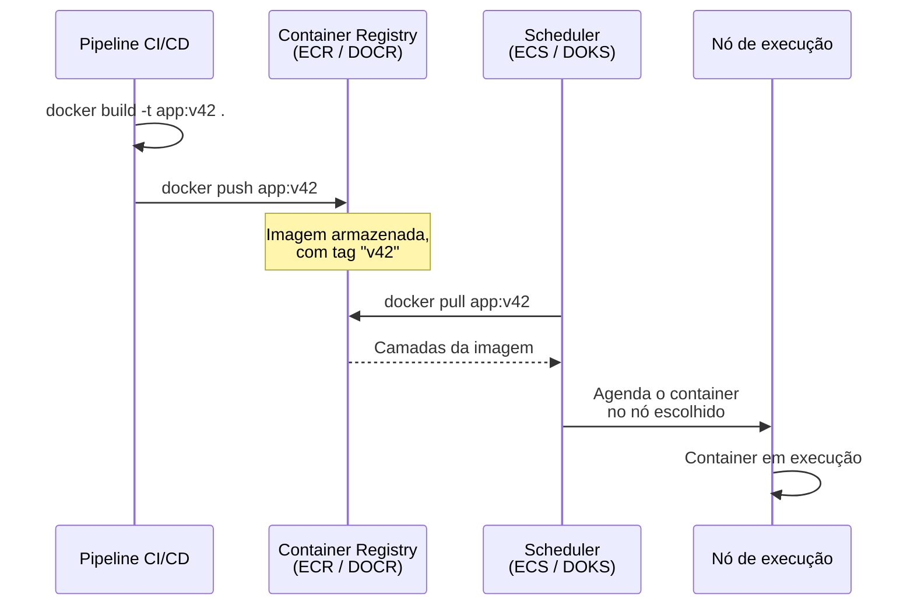
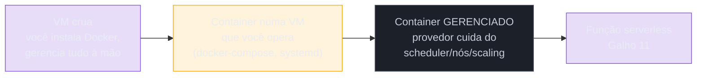
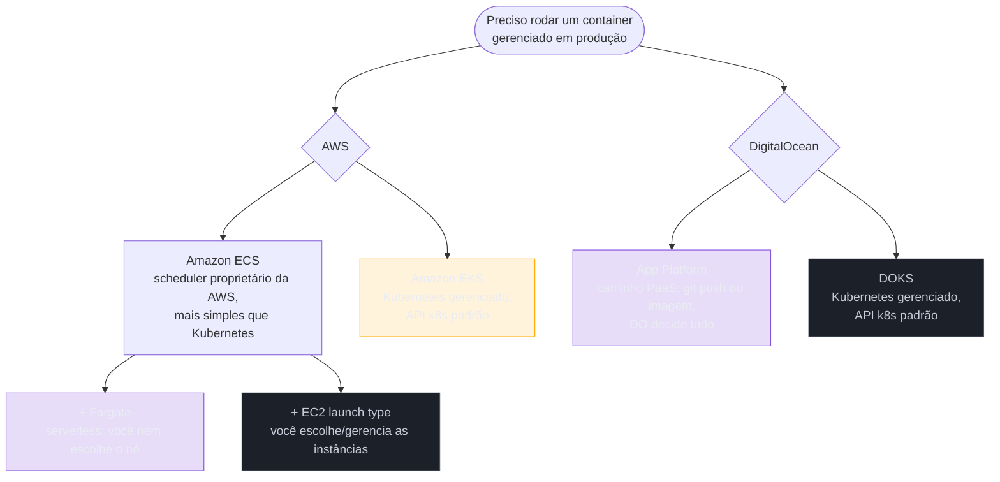

# O que é um container gerenciado

> [!abstract] TL;DR
> O galho anterior fechou com uma árvore de decisão apontando para cá: quando a carga não é rajada nem imprevisível o bastante para uma função, e a máquina virtual inteira — com todo o trabalho de mantê-la de pé — é peso demais, o meio-termo é rodar um **container** e deixar o **provedor** cuidar de onde ele roda, se está saudável, e quantas cópias existem. Este galho não reensina o que é um container ou uma imagem Docker — isso é assunto do galho de Docker, em Infraestrutura. O que ele cobre é a fatia de infraestrutura que se soma ao container quando você o leva para produção na nuvem: um lugar para a imagem morar (o **registry**), um sistema que decide em qual servidor cada container roda (o **scheduler**), e a promessa de "gerenciado" — health check, restart automático, escala, service discovery, integração com load balancer — sem você operar essa máquina de orquestração à mão. Do lado AWS isso é ECS/Fargate/EKS; do lado DigitalOcean é App Platform e DOKS. Cada um dos quatro ganha nota própria neste galho; esta é só o mapa.

> [!info] A contraparte instrumental (2026-08-02)
> Quando este galho foi escrito, o vault ainda não tinha casa para "o que é uma imagem Docker" e a atribuía a Operação. Ela tem agora: o galho [[03-Dominios/Tecnologia/Infraestrutura/Docker/index|Tecnologia/Infraestrutura/Docker]] cobre a imagem como artefato — [[03-Dominios/Tecnologia/Infraestrutura/Docker/02 - A anatomia de uma imagem|camadas e digest]] e o [[03-Dominios/Tecnologia/Infraestrutura/Docker/12 - Registry|registry]] que este galho pressupõe como pré-requisito. A divisão em três: **Infraestrutura** é o Docker que você mesmo opera, **Cloud** é quando o provedor gerencia, **Operação** é a disciplina de manter isso em produção.

## O problema: você tem uma imagem Docker, agora o quê?

Imagine que você já fez o trabalho de Operação: escreveu um `Dockerfile`, construiu uma imagem, testou `docker run` na sua máquina, e ela funciona. Ótimo — mas "funciona na minha máquina" e "roda em produção, o dia inteiro, para usuários reais" são dois problemas completamente diferentes. Para colocar esse container de pé de verdade, alguém precisa responder a um punhado de perguntas que o `docker run` local nunca respondeu:

- **Onde** esse container roda? Você precisa de um servidor Linux de pé, com Docker instalado, com CPU e memória suficientes.
- **O que acontece se ele cair?** Um processo dentro de um container pode travar, vazar memória, ou o próprio servidor pode reiniciar — alguém precisa notar e subir o container de novo.
- **Como ele escala?** Se o tráfego dobra, uma cópia do container não é mais suficiente — alguém precisa decidir subir mais cópias, e decidir onde elas rodam.
- **Como o tráfego chega até ele?** Um load balancer precisa saber quais IPs e portas apontam para as cópias vivas do container, e parar de mandar tráfego para uma cópia que morreu.
- **Como um container encontra outro?** Se o serviço A precisa falar com o serviço B, e ambos têm réplicas subindo e descendo o tempo todo, "o IP do serviço B" não pode ser uma constante fixa.

Fazer tudo isso à mão — um servidor, um script de restart, um load balancer configurado manualmente, um DNS interno mantido a unha — é reconstruir, peça por peça, um sistema de orquestração inteiro. É trabalho real, contínuo, e exatamente o tipo de operação pesada que esta trilha vem mostrando que a nuvem pública se propõe a tirar das suas costas. É aqui que "container gerenciado" entra: você continua entregando a imagem, mas entrega a resposta a todas essas perguntas para o provedor.

> [!question]- Mas eu não vi isso no Bloco 2? Uma VM elástica (Galho 6) já não faz "restart e escala" sozinha?
> Faz — mas na granularidade errada para um container. Um Auto Scaling Group decide quantas **instâncias EC2** existem, não quantos **containers** rodam dentro de cada instância. Se você quiser rodar três containers diferentes numa mesma frota de VMs — um de API, um de worker, um de processamento de imagem — o ASG não sabe nada sobre isso; ele só enxerga máquinas. Colocar containers de pé dentro dessas máquinas, decidir qual container vai em qual instância, e mover um container para outra instância se a atual ficar sobrecarregada, é trabalho de um **scheduler de containers** — uma camada inteira acima do que o ASG resolve sozinho. É essa camada que "container gerenciado" assume por você.

## Onde a imagem mora: o container registry

Antes de qualquer scheduler decidir onde rodar um container, ele precisa buscar a imagem de algum lugar — e esse lugar é o **container registry**. Se você já usou `docker pull nginx` ou `docker pull python:3.13`, já usou um registry — o Docker Hub, público e gratuito para imagens abertas. Para uma aplicação sua, privada, você precisa do equivalente privado: um lugar para fazer `docker push` da sua imagem depois de cada build, de onde o scheduler do provedor vai fazer `docker pull` quando precisar subir uma cópia nova.



**Amazon ECR (Elastic Container Registry)** é o registry gerenciado da AWS: repositórios privados com permissão via IAM, integração nativa com ECS e EKS — a própria documentação da AWS descreve o ECR como "uma extensão" desses dois serviços, porque o fluxo de setup é o mesmo. Entre os recursos que o ECR entrega prontos: **scan on push** (cada imagem enviada é automaticamente escaneada em busca de vulnerabilidades conhecidas), políticas de lifecycle (limpeza automática de imagens antigas não usadas), replicação entre regiões e contas, e assinatura de imagem gerenciada.

**DigitalOcean Container Registry (DOCR)** cobre o mesmo papel central — repositório privado, push/pull, integração nativa com DOKS — com um catálogo mais enxuto: três planos (um gratuito para testes, um básico e um profissional com repositórios ilimitados e mais armazenamento), suporte a camadas de imagem de até 20 GB e imagens completas de até 100 GB, e coleta de lixo automática para liberar espaço de camadas não referenciadas. A documentação oficial não lista, no momento desta pesquisa, um recurso equivalente ao scan-on-push automático do ECR como parte do produto.

> [!info] Verificado 2026-07-24
> ECR: scan on push, lifecycle policies, replicação cross-region/cross-account, managed signing — confirmado na documentação oficial (`docs.aws.amazon.com/AmazonECR`). DOCR: três planos (free/basic/professional), camadas até 20 GB, imagens até 100 GB, garbage collection automática — confirmado em `docs.digitalocean.com/products/container-registry`; nenhuma menção a scanning de vulnerabilidades nativo na página consultada — se isso for crítico para o seu caso, confirme na documentação atualizada antes de decidir.

O fluxo de trabalho com qualquer um dos dois é o mesmo par de comandos, todo dia, em todo pipeline de CI/CD:

```bash
# AWS — autenticar o Docker CLI no ECR, depois push de uma tag nova
$ aws ecr get-login-password --region us-east-1 | \
    docker login --username AWS --password-stdin \
    123456789012.dkr.ecr.us-east-1.amazonaws.com

$ docker tag app:v42 123456789012.dkr.ecr.us-east-1.amazonaws.com/app:v42
$ docker push 123456789012.dkr.ecr.us-east-1.amazonaws.com/app:v42
```

```bash
# DigitalOcean — autenticar via doctl, depois push de uma tag nova
$ doctl registry login
$ docker tag app:v42 registry.digitalocean.com/minha-loja/app:v42
$ docker push registry.digitalocean.com/minha-loja/app:v42
```

A tag (`v42`, ou mais comumente o hash do commit) é o que amarra "esta imagem específica" a "esta versão do código" — é ela que o scheduler vai referenciar quando você disser "suba a versão nova". Sem um registry, essa amarração inteira teria que ser feita na mão, copiando arquivos de imagem entre servidores — o registry é o elo que faz o pipeline de deploy de container funcionar como um pipeline de verdade, não como cópia manual.

> [!tip] Assista: AWS ECS Introduction: Clusters, Tasks & Fargate Explained
> **Canal:** DheerajTechInsight | **Duração:** ~12min | **Idioma:** EN
>
> Um passeio rápido de console pela AWS que mostra exatamente essa peça na prática: o vídeo aponta o ECR como "onde você guarda suas imagens de container" e compara direto com o Docker Hub, antes de entrar no cluster, no scheduler e nos health checks que compõem a promessa de "gerenciado". Trecho de destaque [01:33]: *"AWS ECR, that is Elastic Container Registry, where you store your container images. This is the same like Docker Hub."*
>
> 🎬 [Assistir no YouTube](https://www.youtube.com/watch?v=FALtq7CKehY)

## O espectro: de VM crua a container gerenciado

Vale encaixar "container gerenciado" no mesmo espectro que a nota 01 do Galho 11 já desenhou entre VM e função — só que agora olhando o degrau intermediário com mais detalhe, porque ele próprio tem subdivisões:



O primeiro degrau — **VM crua com Docker instalado** — é o que qualquer pessoa faz ao aprender container: uma instância EC2 ou um Droplet, você mesmo instala o Docker, roda `docker run` manualmente ou com um `docker-compose.yml`, e se a instância reiniciar ou o container travar, é você quem percebe e resolve. Todo o trabalho que a seção anterior listou — scheduling, health check, restart, escala, service discovery — é seu, mesmo que o container em si já esteja "empacotado" corretamente.

O segundo degrau — **container numa VM que você opera** — já usa alguma automação (um `systemd` que reinicia o container se ele cair, um `docker-compose` que sobe múltiplos serviços juntos), mas ainda é uma única máquina, ou um punhado delas que você mesmo coordena. Não há scheduler distribuído decidindo em qual das N máquinas cada container roda — só scripts.

O terceiro degrau, o assunto deste galho, é o **container gerenciado de verdade**: você entrega a imagem e uma descrição de quanto CPU/memória ela precisa, e o provedor decide em qual dos seus nós (visíveis ou não) o container roda, reinicia sozinho se ele cair, adiciona réplicas se a métrica de escala disparar, e conecta tudo isso a um load balancer sem você tocar em um `iptables` sequer.

## O que "gerenciado" assume, concretamente

"Gerenciado" não é um adjetivo vago — é um conjunto específico de responsabilidades que migram de você para o provedor. Vale nomear as quatro, porque são exatamente os pontos que cada nota seguinte deste galho vai aprofundar caso a caso:

| Responsabilidade | O que significa | Quem cuida, num container gerenciado |
|---|---|---|
| Agendamento (scheduling) | Decidir em qual servidor físico/virtual cada container roda, respeitando CPU/memória disponível | O scheduler do provedor (ECS Scheduler, o control plane do Kubernetes) |
| Health check e restart | Verificar periodicamente se o container está respondendo, e recriá-lo se não estiver | O provedor, com base numa checagem que você configura (endpoint HTTP, comando, porta TCP) |
| Escala | Subir ou derrubar réplicas do container conforme uma métrica (CPU, requisições, fila) | Auto-scaling do serviço — configurado por você, executado pelo provedor |
| Service discovery | Permitir que um container encontre outro pelo nome, mesmo com réplicas subindo e descendo | DNS interno do provedor (Cloud Map na AWS, DNS interno do Kubernetes) |
| Integração com load balancer | Registrar automaticamente réplicas saudáveis atrás de um balanceador, remover as que caem | Integração nativa entre o scheduler e o load balancer do provedor |

Repare no padrão: nenhuma dessas cinco linhas é mágica — cada uma é um problema real que times de infraestrutura resolveram, historicamente, com ferramentas como o próprio Kubernetes de código aberto, rodado e mantido à mão. "Container gerenciado" na nuvem pública é justamente pegar essa pilha de responsabilidades e devolvê-la a um serviço operado pelo provedor, do mesmo jeito que RDS devolveu a operação de um banco de dados (Galho 9) e Lambda devolveu a operação de um servidor de aplicação (Galho 11).

## Panorama da lente dupla: quatro caminhos, duas filosofias

Aqui é onde AWS e DigitalOcean divergem de forma mais visível do que em qualquer galho anterior desta trilha — não porque um seja "melhor", mas porque cada provedor oferece **dois caminhos** dentro do mesmo degrau, com filosofias diferentes de quanto controle você mantém.



Do lado **AWS**, o caminho central é o **Amazon ECS** (Elastic Container Service): um scheduler proprietário da AWS, mais simples de operar do que Kubernetes, organizado em torno de **task definitions** (o blueprint de um container — imagem, CPU, memória, variáveis de ambiente), **tasks** (uma execução, que roda e para — bom para jobs) e **services** (uma quantidade desejada de tasks rodando continuamente, com auto-scaling). Dentro do ECS você escolhe **onde** essas tasks efetivamente rodam: no **modelo EC2**, você ainda provisiona e gerencia as instâncias que compõem o cluster (o ECS agenda os containers nelas, mas as máquinas são suas); no **AWS Fargate**, você não vê nem escolhe nenhuma instância — Fargate é, segundo a própria documentação da AWS, "uma tecnologia serverless, paga pelo uso" que remove completamente a escolha de tipo de servidor e o dimensionamento de cluster. Existe ainda um terceiro caminho — **Amazon EKS** (Elastic Kubernetes Service) — que troca o scheduler proprietário da AWS pelo Kubernetes de verdade, com a mesma API que roda em qualquer nuvem ou datacenter, ao custo de mais complexidade operacional.

Do lado **DigitalOcean**, os dois caminhos equivalentes são **App Platform** e **DOKS** (DigitalOcean Kubernetes). O **App Platform** é descrito na documentação oficial como "uma Platform-as-a-Service totalmente gerenciada que implanta aplicações a partir de repositórios Git ou imagens de container" — você aponta para um repositório (com build automático) ou para uma imagem já publicada no DOCR, e o App Platform assume build, deploy, escala (incluindo, desde 2026, auto-scaling baseado em requisições por segundo e latência P95, não só CPU) e toda a infraestrutura por baixo. É o caminho mais próximo, em filosofia, do Fargate: você nunca vê um nó, um cluster, ou um scheduler. O **DOKS** é o Kubernetes gerenciado da DigitalOcean — control plane totalmente operado pela DO, alta disponibilidade, auto-scaling de nós — equivalente direto ao EKS, para quem precisa da API padrão do Kubernetes.

> [!warning] Onde a lente dupla não tem paridade exata
> App Platform e Fargate parecem equivalentes à primeira vista ("container gerenciado sem ver o nó"), mas não são o mesmo produto: Fargate é uma **opção de capacidade dentro do ECS** — ainda existe um cluster ECS, tasks e services por trás — enquanto App Platform é uma **PaaS completa**, com build a partir de Git, roteamento HTTP e domínio próprio incluídos por padrão. Um container ECS/Fargate puro não vem com "build a partir do seu repositório" de fábrica — isso é responsabilidade de um pipeline de CI/CD que você monta à parte. Tratar os dois como intercambiáveis nesta nota seria honestidade forçada; a nota 04 deste galho volta a esse ponto com mais precisão ao abrir o App Platform por dentro.

## Um vislumbre da forma: como você descreve "gerenciado" para o provedor

Vale ver, em código mínimo, como cada um dos dois caminhos centrais traduz "quero este container gerenciado" numa configuração declarativa — sem entrar no detalhe de cada campo, que é assunto das próximas notas.

No **ECS/Fargate**, você descreve uma task definition — o "blueprint" que a documentação da AWS nomeia — com a imagem (vinda do ECR), quanto CPU/memória alocar, e como o scheduler deve checar se o container está saudável:

```json
{
  "family": "api-catalogo",
  "requiresCompatibilities": ["FARGATE"],
  "cpu": "256",
  "memory": "512",
  "containerDefinitions": [
    {
      "name": "api",
      "image": "123456789012.dkr.ecr.us-east-1.amazonaws.com/app:v42",
      "portMappings": [{ "containerPort": 8080 }],
      "healthCheck": {
        "command": ["CMD-SHELL", "curl -f http://localhost:8080/health || exit 1"],
        "interval": 30,
        "timeout": 5,
        "retries": 3
      }
    }
  ]
}
```

Na **DigitalOcean**, o App Platform usa um `app.yaml` (app spec) equivalente, apontando para uma imagem no DOCR e declarando a mesma ideia de health check:

```yaml
name: api-catalogo
services:
  - name: api
    image:
      registry_type: DOCR
      repository: app
      tag: v42
    http_port: 8080
    health_check:
      http_path: /health
    instance_size_slug: basic-xxs
    instance_count: 2
```

O padrão que vale grifar nos dois exemplos: em nenhum dos dois você escreve "em qual servidor" o container vai rodar, nem escreve o script que reinicia o processo se `/health` parar de responder. Você declara a intenção — esta imagem, este tanto de recurso, este endpoint de saúde — e o scheduler do provedor é quem transforma isso em containers de pé, monitorados, atrás de um load balancer. É exatamente essa tradução, de intenção declarada para execução operada, que a palavra "gerenciado" está descrevendo o tempo todo nesta nota.

## Casos práticos

**A API que cresceu de uma VM para ECS.** Uma equipe começa com a API de catálogo de uma loja rodando numa única instância EC2, com Docker instalado à mão, reiniciada por um `systemd` quando cai — o segundo degrau do espectro desta nota. Funciona até o tráfego dobrar e a equipe perceber que está gastando mais tempo escrevendo scripts de deploy e monitorando manualmente do que evoluindo a API. A migração para ECS com Fargate não muda a imagem Docker nem uma linha do `Dockerfile` — muda quem decide onde o container roda, quem reinicia se ele cair, e quem adiciona réplicas quando a CPU passa de 70%. O trabalho operacional que antes era do time vira configuração declarativa de uma task definition.

**O time pequeno que escolhe App Platform em vez de DOKS.** Uma startup de dois desenvolvedores precisa colocar uma API Node.js em produção rápido, sem tempo para aprender Kubernetes. Em vez de montar um cluster DOKS — que exigiria entender nós, pods, deployments e YAML de Kubernetes antes mesmo de a primeira requisição chegar — eles conectam o App Platform diretamente ao repositório Git: cada push na branch principal dispara um build e um deploy automáticos, com HTTPS e domínio já configurados. É exatamente o tipo de troca "menos controle por menos peso operacional" que este domínio vem repetindo desde o Galho 3 — e a razão de este galho abrir com App Platform (nota 04) antes de encostar em Kubernetes gerenciado (nota 05) de raspão.

## Tabela de tradução — os quatro grandes provedores

| Conceito | AWS | Azure | GCP | DigitalOcean |
|---|---|---|---|---|
| Registry de imagens | ECR | Azure Container Registry (ACR) | Artifact Registry | Container Registry (DOCR) |
| Container gerenciado, caminho PaaS | Fargate (via ECS) | Azure Container Apps | Cloud Run | App Platform |
| Container isolado sob demanda | Fargate task | Azure Container Instances (ACI) | Cloud Run (job) | App Platform (job component) |
| Kubernetes gerenciado | EKS | AKS | GKE | DOKS |

> [!info] Caducidade
> Linha Azure/GCP citada de memória geral de mercado, não verificada via WebFetch nesta pesquisa — os nomes de produto mudam com frequência (Cloud Run já se chamou Cloud Functions em outro contexto, ACI e Container Apps se sobrepõem em propósito). Confirmar na documentação oficial de cada provedor antes de tratar como definitivo. As colunas AWS e DigitalOcean foram verificadas em `docs.aws.amazon.com` e `docs.digitalocean.com` em 2026-07-24.

## Armadilhas comuns

> [!warning] Achar que "container gerenciado" elimina a necessidade de entender Docker
> Nada nesta nota substitui saber construir uma imagem enxuta, entender camadas (layers), ou escrever um `Dockerfile` correto — isso continua sendo pré-requisito, e é ensinado a fundo em Operação. O que muda é só o que acontece **depois** que a imagem existe: onde ela roda e quem cuida disso.

> [!warning] Confundir Fargate com "servidor grátis"
> Fargate remove a decisão de tipo de instância e o gerenciamento de cluster — mas você continua pagando por vCPU e memória alocada, pelo tempo que o container roda, normalmente a um preço por unidade mais alto do que a mesma capacidade numa instância EC2 que você gerencia. "Gerenciado" é trocar dinheiro e alguma flexibilidade por menos operação, não eliminar o custo de compute.

> [!warning] Tratar App Platform e Fargate como o mesmo produto
> Já nomeado na seção da lente dupla, mas vale repetir como armadilha: App Platform é uma PaaS com build integrado; ECS/Fargate é um scheduler de containers com uma opção de capacidade serverless. Comparar preço ou funcionalidade entre os dois sem entender essa diferença de escopo leva a decisões erradas.

> [!warning] Achar que Kubernetes gerenciado (EKS/DOKS) é sempre a opção "mais séria"
> É tentador assumir que Kubernetes é o caminho certo por ser o mais falado do mercado — mas a complexidade operacional de aprender e manter manifests, deployments, services e ingress do Kubernetes é real, mesmo com o control plane gerenciado. Para times pequenos ou aplicações simples, ECS/Fargate ou App Platform costumam entregar o mesmo resultado prático (container rodando, escalando, saudável) com uma fração do investimento de aprendizado. A nota 06 deste galho (capstone) retoma essa comparação com critério.

## O que vem a seguir

Este mapa nomeou as quatro peças — registry, scheduler, o que "gerenciado" assume, e os quatro caminhos que AWS e DigitalOcean oferecem — sem aprofundar nenhuma delas. A próxima nota abre o **Amazon ECS** por dentro: o modelo de tarefas (task definitions, tasks, services), como o scheduler decide colocação, e como um cluster ECS se organiza antes mesmo de decidir entre EC2 launch type e Fargate. Depois vem o Fargate a fundo, o App Platform como caminho PaaS, uma passada de raspão por Kubernetes gerenciado (Galho de Operação é quem é dono de Kubernetes de verdade — aqui é só o suficiente para saber quando EKS/DOKS é a resposta certa), e um capstone que amarra container gerenciado contra VM e serverless — a árvore de decisão completa que a nota 06 do galho anterior já antecipou parcialmente.

Este galho tem fronteira forte com **Operação**: o conceito de container, imagem, camadas e o próprio Docker por dentro pertencem a esse domínio, não a este. Kubernetes como disciplina — manifests, operators, Helm, service mesh — também é dono de Operação; este galho toca EKS/DOKS só o suficiente para saber que existem e quando escolhê-los, sem virar uma trilha de Kubernetes paralela.

## Fontes

- [Amazon ECR — What is Amazon Elastic Container Registry?](https://docs.aws.amazon.com/AmazonECR/latest/userguide/what-is-ecr.html) — definição do serviço, scan on push, lifecycle policies, replicação, managed signing; acessado em 2026-07-24.
- [DigitalOcean — Container Registry](https://docs.digitalocean.com/products/container-registry/) — push/pull, planos free/basic/professional, limites de camada (20 GB) e imagem (100 GB), garbage collection automática; acessado em 2026-07-24.
- [Amazon ECS — What is Amazon Elastic Container Service?](https://docs.aws.amazon.com/AmazonECS/latest/developerguide/Welcome.html) — camadas capacidade/controller/provisioning, task definition, task, service, cluster auto scaling, service auto scaling; acessado em 2026-07-24.
- [AWS Fargate — Architect for AWS Fargate for Amazon ECS](https://docs.aws.amazon.com/AmazonECS/latest/developerguide/AWS_Fargate.html) — Fargate como tecnologia serverless de capacidade dentro do ECS, isolamento por task, Fargate Spot, integração com load balancer; acessado em 2026-07-24.
- [DigitalOcean — App Platform](https://docs.digitalocean.com/products/app-platform/) — PaaS totalmente gerenciada, deploy a partir de Git ou imagem de container do DOCR, auto-scaling baseado em requisições/P95 desde 2026; acessado em 2026-07-24.
- [DigitalOcean — Kubernetes (DOKS)](https://docs.digitalocean.com/products/kubernetes/) — control plane totalmente gerenciado, alta disponibilidade, integração com load balancers/volumes/Droplets da DO; acessado em 2026-07-24.

> [!info] Fronteira
> ECS a fundo (nota 02), Fargate a fundo (nota 03), App Platform a fundo (nota 04) e Kubernetes gerenciado de raspão (nota 05) pertencem às próximas notas deste galho. Container, imagem e Docker por dentro são domínio de Operação, não retomados aqui. Kubernetes como disciplina completa — manifests, Helm, operators — nunca vira trilha nesta lente; este galho toca EKS/DOKS apenas na medida em que decide "quando" e "por que", não "como" operar um cluster.
