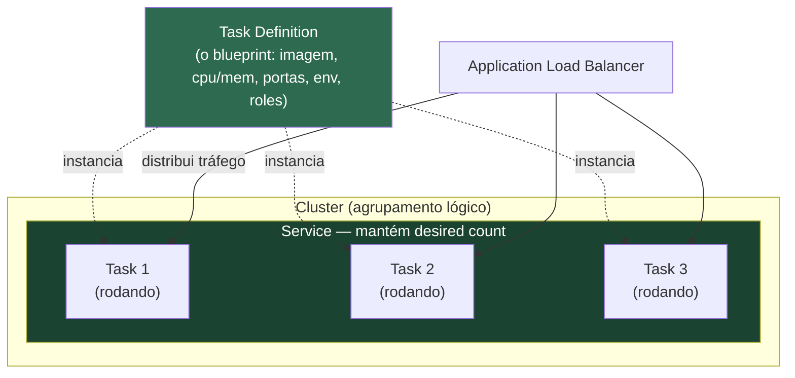
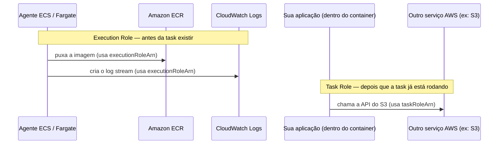
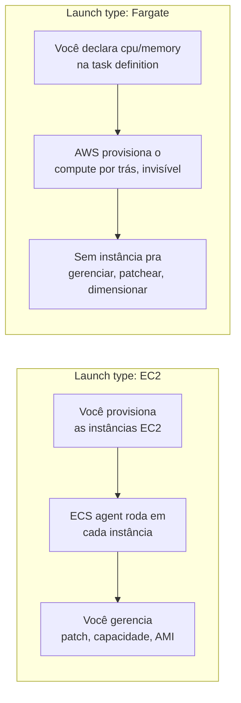
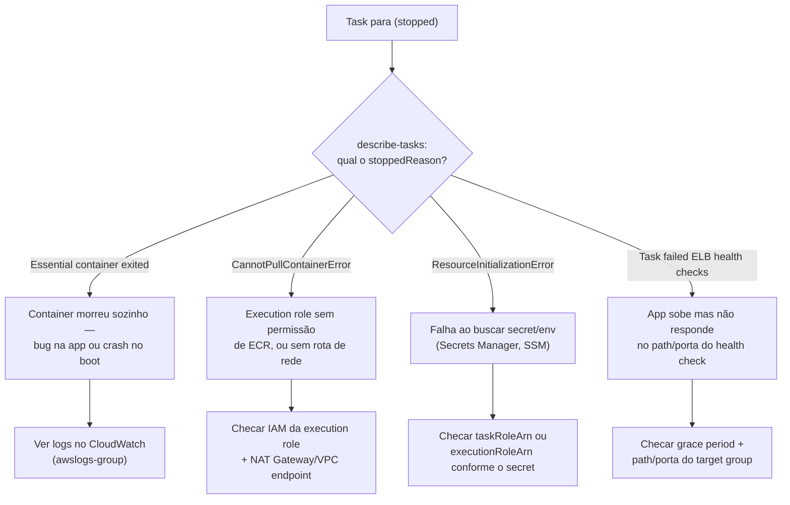

> [!abstract] TL;DR
> ECS orquestra containers em três camadas: **task definition** (o blueprint — que imagem, quanta CPU/memória, quais portas, quais variáveis), **task** (uma instância rodando desse blueprint) e **service** (o guardião que mantém N tasks de pé, substitui as que morrem e conversa com o load balancer). Duas roles diferentes cuidam de permissão: a **execution role** deixa o ECS puxar a imagem e escrever logs; a **task role** deixa a sua aplicação, já rodando, chamar outros serviços AWS. Você escolhe entre rodar em cima de instâncias EC2 que você gerencia, ou em Fargate, onde a AWS gerencia o servidor por trás do container — tema da próxima nota.

## O problema: `docker run` não escala sozinho

Na nota anterior você fechou a conta: uma VM pelada te dá controle total e trabalho total; uma função serverless te tira o trabalho mas te tira também o controle fino sobre o processo de longa duração. O container gerenciado promete o meio-termo — mas "gerenciado" esconde uma pergunta incômoda: **gerenciado por quem, fazendo o quê?**

Pense no que `docker run minha-imagem` faz na sua máquina. Ele sobe *um* container, num *único* host, e se esse container morrer, ninguém percebe — ele simplesmente para. Não há segunda instância assumindo a carga, não há verificação de saúde, não há nada decidindo se aquele container ainda está vivo do jeito que deveria estar. Em produção, isso é inaceitável: um pico de tráfego, um vazamento de memória, uma falha de rede — qualquer um desses eventos mata o container, e sem alguém vigiando, o serviço fica fora do ar até um humano notar.

O Amazon **Elastic Container Service (ECS)** é a resposta nativa da AWS pra essa pergunta. Ele não roda containers — ele **administra a vida** deles: decide onde rodam, quantos devem existir, o que fazer quando um morre, e como o tráfego chega até eles. Pra fazer isso, o ECS quebra o problema em três conceitos que se encaixam como bonecas russas.

## As três camadas: definição, instância, garantia



**Task definition** é o blueprint — um documento JSON versionado que descreve *o que* rodar, nunca *onde*. É parecido com uma planta de arquiteto: não é a casa, é a especificação de como construí-la. Toda vez que você registra uma task definition, ela ganha uma revisão (`family:revisão`, tipo `minha-api:7`), e revisões antigas continuam existindo — o que te dá rollback de graça.

**Task** é a casa construída: uma instância rodando de fato, ocupando CPU e memória reais, com um IP (dependendo do modo de rede) e um ciclo de vida próprio. Rodar uma task via `run-task` é o equivalente ECS de um `docker run` pontual — sobe, faz o trabalho, se morrer ninguém repõe. Útil pra jobs batch, péssimo pra uma API que precisa estar sempre de pé.

**Service** é quem transforma "uma task" em "um sistema confiável". Você diz ao service: "eu quero **3** tasks dessa definition sempre rodando" (o `desiredCount`), e ele vira um controlador contínuo — se uma task morre, ele sobe outra; se você aumenta o `desiredCount`, ele sobe mais; se você atualiza a task definition, ele troca as tasks antigas pelas novas, uma de cada vez (rolling deployment), sem downtime. É o service, não a task, que se registra num **target group** do Application Load Balancer, para que o tráfego HTTP só chegue às tasks saudáveis.

E o **cluster**? É só o agrupamento lógico onde tudo isso vive — uma fronteira de capacidade e de nomenclatura, não uma máquina física. Um cluster pode ter zero servidores visíveis (se tudo for Fargate) ou um monte de instâncias EC2 registradas nele (se você escolheu o outro caminho). Falaremos disso já já.

> [!info] Verificado em 2026-07-24
> Segundo a documentação oficial da AWS, o `family` de uma task definition funciona como nome com versionamento: o primeiro registro ganha revisão 1, e cada registro subsequente na mesma família recebe um número sequencial (docs.aws.amazon.com/AmazonECS/latest/developerguide/task_definition_parameters.html).

> [!tip] Assista: Amazon ECS: Core Components Overview - Cluster, Task, and Service
> **Canal:** Amazon Web Services (AWS) | **Duração:** ~4min | **Idioma:** EN
>
> Vídeo oficial curtíssimo, direto da equipe de ECS, que mostra as mesmas três camadas desta nota — cluster, task e service — com um diagrama simples e a criação de um cluster ao vivo no console. Bom para fixar a relação de dependência antes de entrar na anatomia da task definition. Trecho de destaque [01:00]: *"service maintains your desired number of tasks simultaneously in the ECS cluster"*
>
> 🎬 [Assistir no YouTube](https://www.youtube.com/watch?v=J81-EGhsbSQ)

## Anatomia de uma task definition

Abra o JSON e a estrutura conta a história sozinha. Aqui está uma definition mínima e realista pra uma API HTTP:

```json
{
  "family": "minha-api",
  "networkMode": "awsvpc",
  "requiresCompatibilities": ["FARGATE"],
  "cpu": "512",
  "memory": "1024",
  "executionRoleArn": "arn:aws:iam::111122223333:role/ecsTaskExecutionRole",
  "taskRoleArn": "arn:aws:iam::111122223333:role/minhaApiTaskRole",
  "containerDefinitions": [
    {
      "name": "api",
      "image": "111122223333.dkr.ecr.us-east-1.amazonaws.com/minha-api:1.4.0",
      "essential": true,
      "portMappings": [
        { "containerPort": 8080, "protocol": "tcp" }
      ],
      "environment": [
        { "name": "NODE_ENV", "value": "production" },
        { "name": "PORT", "value": "8080" }
      ],
      "secrets": [
        {
          "name": "DATABASE_URL",
          "valueFrom": "arn:aws:secretsmanager:us-east-1:111122223333:secret:minha-api/db-url"
        }
      ],
      "logConfiguration": {
        "logDriver": "awslogs",
        "options": {
          "awslogs-group": "/ecs/minha-api",
          "awslogs-region": "us-east-1",
          "awslogs-stream-prefix": "api"
        }
      },
      "healthCheck": {
        "command": ["CMD-SHELL", "curl -f http://localhost:8080/health || exit 1"],
        "interval": 30,
        "timeout": 5,
        "retries": 3
      }
    }
  ]
}
```

Repare no que cada bloco resolve:

- **`containerDefinitions`** é uma *lista* — uma task pode rodar mais de um container lado a lado, compartilhando rede e ciclo de vida (o padrão "sidecar": um container principal e um segundo cuidando de logging, proxy, ou métricas). `essential: true` diz ao ECS "se este container morrer, mate a task inteira".
- **`portMappings`** expõe a porta que o container escuta. Em `awsvpc` (o modo recomendado, inclusive obrigatório em Fargate), cada task ganha sua própria interface de rede — sem colisão de porta entre tasks no mesmo host, ao contrário do modo `bridge` mais antigo.
- **`environment`** injeta configuração em texto puro; **`secrets`** injeta valores puxados do Secrets Manager ou do Parameter Store em runtime, sem nunca aparecer em texto plano na definition — a diferença importa em qualquer auditoria de segurança.
- **`logConfiguration`** manda stdout/stderr do container pro CloudWatch Logs automaticamente. Sem isso, os logs morrem junto com a task — e depurar um crash de madrugada sem log é o pesadelo de qualquer plantonista.
- **`cpu`/`memory`** no nível da task (e, opcionalmente, por container) definem o tamanho da "caixa" que o ECS reserva. Em Fargate, essas combinações são restritas a um catálogo fixo de tamanhos — a próxima nota detalha isso.

## Duas roles, dois donos diferentes

Este é o ponto onde a maioria dos times novos em ECS tropeça, e ele conecta direto com a [[03-Dominios/Tecnologia/Cloud/04 - Identidade e acesso (IAM)/04 - Roles e credenciais temporárias|Roles e credenciais temporárias]] que você já estudou no galho de IAM.



A **execution role** (`executionRoleArn`) pertence à infraestrutura, não à sua aplicação. É o ECS — o agente que sobe o container por trás das cenas — usando essa role pra puxar a imagem do ECR e escrever logs no CloudWatch. O código da sua app nunca vê essas credenciais.

A **task role** (`taskRoleArn`) pertence à sua aplicação. É a permissão que o *código dentro do container* usa quando chama `aws s3 get-object` ou qualquer SDK da AWS. Segundo a documentação oficial, "essas permissões não são acessadas pelos agentes ECS/Fargate — elas permitem que seu código de aplicação, rodando no container, use outros serviços AWS" (docs.aws.amazon.com/AmazonECS/latest/developerguide/task-iam-roles.html).

Confundir as duas é o erro clássico: dar permissão de S3 na execution role não adianta nada pra sua app (ela nunca a usa), e esquecer de dar permissão de ECR na execution role trava a task antes mesmo dela nascer, com um erro de "unable to pull image" que não tem nada a ver com o seu código.

> [!warning] Least privilege nas duas pontas
> Assim como discutido em [[03-Dominios/Tecnologia/Cloud/04 - Identidade e acesso (IAM)/05 - Least privilege na prática|Least privilege na prática]], a tentação é dar uma role genérica "AdministratorAccess" pra task role só pra "resolver logo". Não faça isso — a task role é exatamente a superfície de ataque que um RCE na sua aplicação vai explorar primeiro. Escopo por task definition, uma role por serviço, permissões mínimas necessárias.

## Launch types: quem cuida do servidor por trás do container

Toda task precisa rodar em cima de *algum* computador. O ECS te dá duas respostas:



No launch type **EC2**, você é dono das instâncias: escolhe o tipo, decide quantas, patcheia o SO, gerencia o Auto Scaling Group por trás (o mesmo mecanismo de [[03-Dominios/Tecnologia/Cloud/06 - Compute II — elasticidade e balanceamento/04 - Auto Scaling Groups|Auto Scaling Groups]] que você já viu). O ECS agent, um daemon rodando em cada instância, registra a instância no cluster e recebe ordens de onde colocar cada task. A vantagem é controle total — você pode usar instâncias reservadas ou spot pra economizar, instalar agentes customizados no host, ajustar o kernel. A desvantagem é que agora você tem *dois* níveis de capacidade pra gerenciar: quantas tasks e quantas instâncias cabem essas tasks.

No launch type **Fargate**, essa segunda camada desaparece. Você declara `cpu` e `memory` na task definition, marca `requiresCompatibilities: ["FARGATE"]`, e a AWS provisiona o compute por trás da cena, invisível — não existe uma instância EC2 pra você ver, acessar via SSH, ou patchear. Cada task roda isolada, com seu próprio kernel virtual. Você paga pelo que declarou, pelo tempo que a task rodou, sem se preocupar se aquela instância de fundo estava com folga de CPU ou lotada. A próxima nota mergulha fundo nesse modelo — como o billing funciona, os tamanhos permitidos de cpu/memory, e onde Fargate perde pra EC2 em customização.

Por ora, o resumo prático: comece em Fargate. Migre pra EC2 quando um motivo concreto aparecer — GPU, licenciamento por núcleo físico, custo em escala massiva com Spot, ou necessidade de acessar o host diretamente.

## Service: o loop de reconciliação que mantém a promessa

Criar uma task definition não roda nada sozinho — é só o blueprint registrado. É o **service** que lê esse blueprint e o transforma numa garantia contínua.

```bash
# Registra a task definition (sobe uma nova revisão)
aws ecs register-task-definition \
  --cli-input-json file://task-definition.json

# Cria o service: mantém 3 tasks de pé, integrado ao ALB
aws ecs create-service \
  --cluster meu-cluster \
  --service-name minha-api-service \
  --task-definition minha-api:7 \
  --desired-count 3 \
  --launch-type FARGATE \
  --network-configuration '{
    "awsvpcConfiguration": {
      "subnets": ["subnet-0a1b2c3d", "subnet-0e4f5a6b"],
      "securityGroups": ["sg-0123456789abcdef0"],
      "assignPublicIp": "DISABLED"
    }
  }' \
  --load-balancers '[{
    "targetGroupArn": "arn:aws:elasticloadbalancing:us-east-1:111122223333:targetgroup/minha-api-tg/9f8e7d6c5b4a3210",
    "containerName": "api",
    "containerPort": 8080
  }]' \
  --health-check-grace-period-seconds 30
```

Esse comando amarra três coisas que você já conhece separadamente: a task definition (o *o quê*), a rede (`awsvpcConfiguration`, subnets privadas, sem IP público — reforçando o padrão de [[03-Dominios/Tecnologia/Cloud/07 - Rede na nuvem (VPC)/index|VPC]] que compute não precisa estar exposto direto à internet), e o target group do Application Load Balancer (o *como o tráfego chega*). A partir daqui, o service entra num loop contínuo: a cada poucos segundos, ele compara "quantas tasks saudáveis existem" com "quantas eu quero" (`desiredCount`), e age na diferença — sobe task se faltar, derruba se sobrar, sempre respeitando o health check do target group antes de considerar uma task pronta pra receber tráfego.

Atualizar o código é `update-service` apontando pra uma nova revisão da task definition:

```bash
aws ecs update-service \
  --cluster meu-cluster \
  --service minha-api-service \
  --task-definition minha-api:8
```

Por padrão, isso dispara um **rolling deployment**: o ECS sobe tasks novas (revisão 8) gradualmente, espera cada uma passar no health check do ALB, e só então desliga uma task antiga (revisão 7) — mantendo o `desiredCount` respeitado o tempo todo, sem downtime. Os parâmetros `minimumHealthyPercent` e `maximumPercent` controlam quão agressivo esse rodízio pode ser (por exemplo, 100%/200% permite dobrar de tamanho temporariamente pra trocar tudo de uma vez; 50%/100% é mais conservador, aceitando ficar com metade da capacidade por um instante).

## Service Auto Scaling: desiredCount deixa de ser fixo

Até aqui, `desiredCount: 3` foi um número fixo escolhido à mão. Em produção, você quer que esse número respire com a carga real — exatamente o problema que as [[03-Dominios/Tecnologia/Cloud/06 - Compute II — elasticidade e balanceamento/05 - Políticas de escala|Políticas de escala]] já resolveram pra EC2. O Application Auto Scaling faz o mesmo papel para services ECS, com **target tracking** como estratégia mais comum: você diz "quero que a CPU média fique em 60%", e o Auto Scaling ajusta o `desiredCount` pra cima ou pra baixo até chegar lá.

```bash
# Registra o service como alvo escalável (entre 2 e 10 tasks)
aws application-autoscaling register-scalable-target \
  --service-namespace ecs \
  --resource-id service/meu-cluster/minha-api-service \
  --scalable-dimension ecs:service:DesiredCount \
  --min-capacity 2 \
  --max-capacity 10

# Política de target tracking em CPU
aws application-autoscaling put-scaling-policy \
  --service-namespace ecs \
  --resource-id service/meu-cluster/minha-api-service \
  --scalable-dimension ecs:service:DesiredCount \
  --policy-name minha-api-cpu-scaling \
  --policy-type TargetTrackingScaling \
  --target-tracking-scaling-policy-configuration '{
    "TargetValue": 60.0,
    "PredefinedMetricSpecification": {
      "PredefinedMetricType": "ECSServiceAverageCPUUtilization"
    },
    "ScaleOutCooldownSeconds": 60,
    "ScaleInCooldownSeconds": 120
  }'
```

Note o mesmo padrão do Auto Scaling Group: cooldowns assimétricos (escala pra cima rápido, pra baixo devagar) pra evitar oscilação. A mecânica de fundo é idêntica à do EC2 — só a "unidade" escalada muda: lá era número de instâncias, aqui é número de tasks.

## Quando a task morre sem avisar: o loop de debug

Uma pergunta que todo iniciante em ECS faz na primeira semana: "criei o service, mas as tasks sobem e morrem em segundos, sem eu entender por quê". Vale conhecer o caminho de investigação porque ele revela como as peças se conectam.



Na prática, o primeiro comando que roda é sempre este:

```bash
# Lista as tasks paradas mais recentes do service
aws ecs describe-tasks \
  --cluster meu-cluster \
  --tasks $(aws ecs list-tasks --cluster meu-cluster \
      --service-name minha-api-service --desired-status STOPPED \
      --query 'taskArns[0]' --output text) \
  --query 'tasks[0].{stoppedReason: stoppedReason, containers: containers[*].{name: name, exitCode: exitCode, reason: reason}}'
```

O campo `stoppedReason` é o ponto de partida de qualquer investigação — ele já diz se o problema é de imagem, de rede, de permissão ou da própria aplicação, evitando o instinto comum de sair lendo logs de aplicação quando o problema nem chegou a esse ponto.

## Network mode: o detalhe que decide quem enxerga quem

Vale fechar um ponto que apareceu de raspão na task definition: `networkMode`. Ele define como os containers de uma task conversam entre si e com o resto da VPC, e a escolha errada aqui é fonte silenciosa de dor de cabeça.

| Network mode | Como funciona | Quando usar |
|---|---|---|
| `awsvpc` | Cada task recebe sua própria ENI (interface de rede) com IP privado próprio, dentro da subnet escolhida | Padrão recomendado; **obrigatório em Fargate**; isola tasks umas das outras, cada uma com seu próprio security group |
| `bridge` | Containers compartilham a rede da instância EC2 via ponte Docker padrão; portas mapeadas host↔container | Legado, launch type EC2; risco de colisão de porta entre tasks no mesmo host |
| `host` | Container usa a rede da instância EC2 diretamente, sem isolamento | Casos de baixíssima latência de rede; só EC2; uma task por porta por instância |
| `none` | Sem rede externa configurada pelo ECS | Jobs batch que não precisam de rede, ou que a gerenciam por conta própria |

Na prática, se você está em Fargate, essa escolha já foi feita por você — `awsvpc` é a única opção. É em EC2 que o detalhe pesa: `bridge` era o padrão histórico, mas força você a gerenciar mapeamento dinâmico de porta (o ECS escolhe uma porta livre no host e o ALB descobre via `dynamic port mapping`); `awsvpc` elimina esse malabarismo dando IP próprio a cada task, ao custo de consumir mais ENIs da subnet — algo que tem [limite por tipo de instância EC2](https://docs.aws.amazon.com/AWSEC2/latest/UserGuide/using-eni.html) e vale checar antes de empacotar dezenas de tasks pequenas num host grande.


Aqui a honestidade importa mais do que a analogia fácil. A DigitalOcean não vende um "ECS pequeno" — ela vende **App Platform**, um PaaS que resolve o mesmo problema de negócio por um caminho bem mais opinativo.

| Conceito ECS | Equivalente aproximado DO App Platform | Observação |
|---|---|---|
| Task definition | Especificação de um *component* (service/worker/job) | App Platform não expõe um JSON de blueprint portável do mesmo jeito — a config vive no app spec (YAML), mais amarrada à plataforma |
| Task | Instância do component rodando | Você não interage com a "task" individualmente como no ECS |
| Service (desiredCount, rolling deploy) | Component `service` com scaling configurado | App Platform faz *request-based autoscaling* nativamente (requisições/s, latência P95), não só CPU |
| Cluster | — (não existe) | App Platform não expõe um agrupamento lógico — é tudo por app |
| Execution role vs task role | — (não existe essa separação) | App Platform usa uma identidade única por app; não há duas roles distintas para infraestrutura vs. aplicação |
| EC2 launch type | — (não existe) | App Platform é 100% modelo gerenciado; não há opção de "trazer sua própria instância" |

A diferença de fundo não é de recursos, é de **filosofia**. ECS te dá peças (task definition, task, service, cluster, duas roles, dois launch types) que você monta conforme sua necessidade — dá pra construir algo tão simples quanto um App Platform, ou tão elaborado quanto uma malha de dezenas de services com scaling independente e roles finamente segregadas. App Platform já chega montado: você aponta um repositório Git ou uma imagem, e a plataforma decide a maior parte do resto. Ganha-se velocidade de entrega; perde-se o controle fino que a task definition JSON oferece — não há execution role vs. task role para diferenciar, nem cluster para agrupar múltiplos services sob uma mesma capacidade reservada.

Se seu time já vive dentro do ecossistema AWS — IAM, VPC, ALB — o ECS se encaixa nesse tecido sem fricção. Se você quer decolar rápido sem esse aparato, o caminho DO é genuinamente mais simples, não uma versão capada do mesmo serviço.

Só pra orientação de vocabulário — sem hands-on aqui, é território de outra trilha — os outros dois grandes provedores têm nomes próprios pro mesmo espaço de problema:

| Conceito | AWS | Azure | GCP | DigitalOcean |
|---|---|---|---|---|
| Orquestrador de containers gerenciado (não-K8s) | ECS | Azure Container Instances / Container Apps | Cloud Run (mais próximo de Fargate que de ECS) | App Platform |
| Blueprint de container | Task definition | Container Apps: template YAML | Cloud Run: service YAML | App spec (YAML) |
| Registro de imagens | ECR | Azure Container Registry (ACR) | Artifact Registry | DO Container Registry |
| Serverless containers (sem gerenciar nó) | Fargate | Container Apps (consumption plan) | Cloud Run | App Platform (implícito) |

> [!warning] Armadilhas comuns
> - **Esquecer a execution role no ECR privado.** Sem `ecr:GetAuthorizationToken` e `ecr:BatchGetImage` na execution role, a task nunca chega a nascer — o erro aparece como falha de pull de imagem, não como erro de aplicação, e confunde quem só olha logs do container (que nem existem ainda).
> - **`awsvpc` sem IP público em subnet privada, sem NAT Gateway.** A task sobe, mas não consegue puxar a imagem do ECR nem falar com a internet — porque não há rota de saída. Revise a [[03-Dominios/Tecnologia/Cloud/07 - Rede na nuvem (VPC)/index|topologia de rede]] antes de assumir que "privado" e "funcional" andam juntos.
> - **Rolling deployment travado por health check mal calibrado.** Se o `health-check-grace-period-seconds` for curto demais para o tempo de boot real da aplicação, o ALB marca a task nova como não saudável, o ECS a derruba, sobe outra, repete — um deployment que nunca conclui, girando em loop.
> - **Task role genérica demais.** Como já visto, dar `AdministratorAccess` "pra não travar nada" transforma qualquer vulnerabilidade de aplicação numa vulnerabilidade de conta inteira.

## O que vem a seguir

Você já sabe *o quê* o ECS orquestra e *como* ele garante que aquilo continue de pé. Falta a pergunta que ficou em aberto: como Fargate de fato cobra por isso, quais os tamanhos de `cpu`/`memory` permitidos, e onde esse modelo serverless de containers esbarra em limites que o launch type EC2 não tem. Essa é a próxima nota do galho, mergulhando em Fargate a fundo — inclusive comparando billing por segundo com o billing por instância que você já viu em Compute I.

## Fontes

- AWS. "Amazon ECS task definition parameters." https://docs.aws.amazon.com/AmazonECS/latest/developerguide/task_definition_parameters.html
- AWS. "Amazon ECS task IAM role." https://docs.aws.amazon.com/AmazonECS/latest/developerguide/task-iam-roles.html
- AWS. "Amazon ECS task execution IAM role." https://docs.aws.amazon.com/AmazonECS/latest/developerguide/task_execution_IAM_role.html
- AWS. "Amazon ECS services." https://docs.aws.amazon.com/AmazonECS/latest/developerguide/ecs_services.html
- AWS. "Service auto scaling." https://docs.aws.amazon.com/AmazonECS/latest/developerguide/service-auto-scaling.html
- AWS. "Use load balancing to distribute Amazon ECS service traffic." https://docs.aws.amazon.com/AmazonECS/latest/developerguide/service-load-balancing.html
- DigitalOcean. "App Platform Overview." https://docs.digitalocean.com/products/app-platform/
- DigitalOcean. "How to Scale an App." https://docs.digitalocean.com/products/app-platform/how-to/scale-app/

