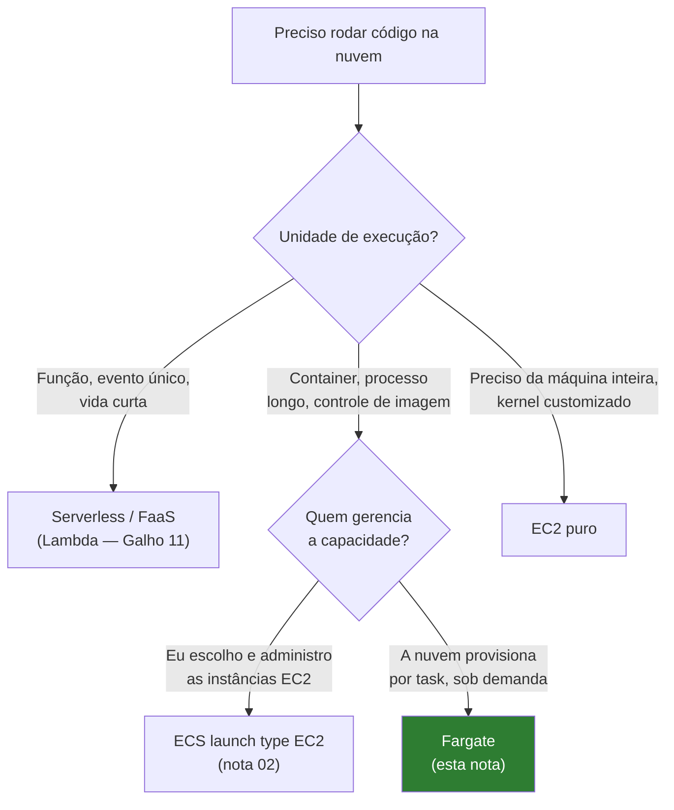
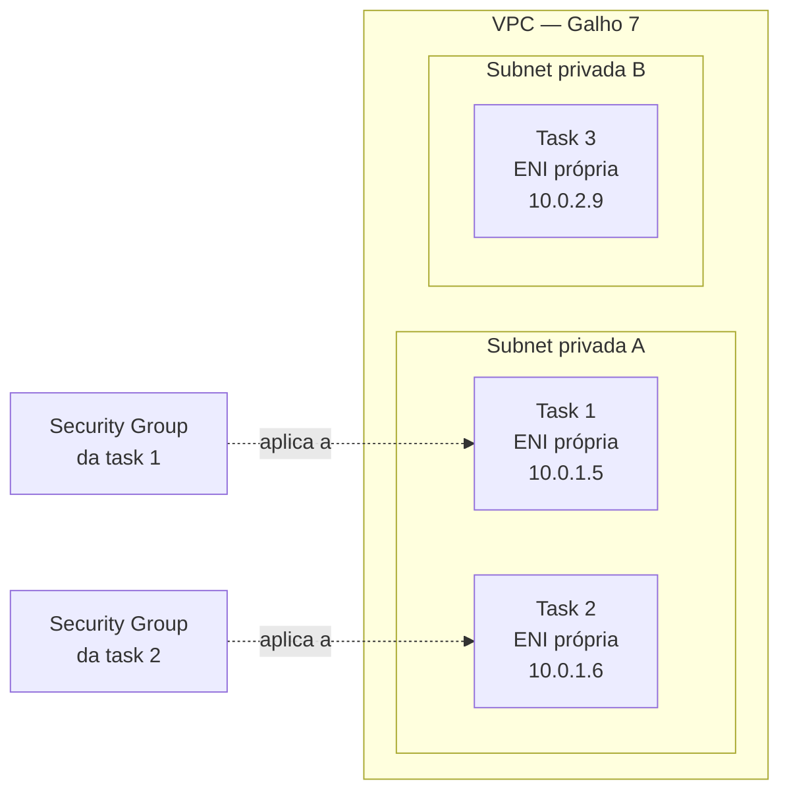

> [!abstract] TL;DR
> Fargate é o "serverless" do ECS: você declara CPU e memória por task, empacota seu container, e a AWS provisiona a capacidade isolada — sem você tocar num nó EC2. Cada task ganha sua própria interface de rede na VPC (`awsvpc`), o billing é por segundo de vCPU e GB usados enquanto a task roda, e o Fargate Spot corta até 70% do preço em troca de tolerância a interrupção. O equivalente mais próximo na DigitalOcean é o App Platform — mas é PaaS opinativo, não "ECS sem nós": você não escolhe task definition, escolhe um plano de instância.

## O problema: alguém tem que gerenciar os nós

Imagine que você acabou de ler a nota anterior sobre ECS e o modelo de tarefas. Você já sabe desenhar uma task definition, já sabe que o ECS agenda containers como tasks. Falta uma pergunta incômoda: **onde essas tasks rodam de fato?**

Na resposta clássica — o launch type `EC2` —, a resposta é "em instâncias EC2 que você provisionou, colocou num Auto Scaling Group, e patcheou". Isso significa: você escolhe o tipo de instância, decide quantas rodam, monitora se estão cheias ou ociosas, aplica patches de kernel, e paga pela instância inteira mesmo que ela esteja rodando meia task a 20% de utilização. O ECS agenda os containers *dentro* dessas instâncias, mas o *chão* embaixo delas ainda é seu problema.

É o mesmo desconforto que motivou a trilha inteira do galho 11 (serverless): "eu só queria rodar meu código, por que preciso administrar servidor?". Só que agora a unidade não é uma função — é um container, potencialmente de longa duração, com um processo persistente escutando uma porta.

Fargate é a resposta da AWS pra essa pergunta especificamente para containers: um **launch type** do ECS onde a AWS possui, provisiona e gerencia a capacidade de computação por trás de cada task. Você não vê VM nenhuma. Você declara "esta task precisa de 1 vCPU e 2 GB de memória", empacota o container, e a plataforma cuida do resto — incluindo isolar essa task de todas as outras tasks de todos os outros clientes rodando ao lado, mesmo que fisicamente compartilhem hardware.

> [!info] Fonte oficial (verificado 2026-07-24)
> "Cada task Fargate tem seu próprio limite de isolamento e não compartilha o kernel, os recursos de CPU, os recursos de memória, ou a interface de rede elástica com outra task" — [docs.aws.amazon.com/AmazonECS, Architect for AWS Fargate](https://docs.aws.amazon.com/AmazonECS/latest/developerguide/AWS_Fargate.html).

> [!tip] Assista: AWS Fargate Tutorial: Serverless Container Execution Explained for Beginners
> **Canal:** CodeLucky | **Duração:** ~9min | **Idioma:** EN
>
> Introdução curta e direta que resume o que esta seção acabou de abrir: você define uma task definition, não vê nem gerencia o servidor por trás dela, e o billing acontece por segundo enquanto a task roda — um bom resumo de 9 minutos antes de entrar nos detalhes de pricing e IAM mais à frente na nota. Trecho de destaque [04:06]: *"You never interact with or even see the underlying servers that run your containers."*
>
> 🎬 [Assistir no YouTube](https://www.youtube.com/watch?v=BRCQltXQEoU)

## Onde Fargate se encaixa na árvore da trilha



Fargate não substitui o ECS — ele é *um jeito de rodar* as tasks que o ECS agenda. A task definition continua sendo a mesma peça central que você viu na nota 02; a única coisa que muda é o valor do parâmetro `requiresCompatibilities` e alguns campos obrigatórios que passam a existir por causa disso.

## Como funciona: CPU e memória por task, não por nó

Aqui está a virada mental. No mundo EC2, você pensa em capacidade *agregada*: "tenho um cluster de instâncias `m5.xlarge`, quantas tasks cabem nele?". No mundo Fargate, você pensa em capacidade *por task*: "esta task específica precisa de X vCPU e Y GB, ponto".

Isso só é possível porque a AWS não expõe combinações livres de CPU/memória — ela define uma tabela fechada de combos válidos. Você não pode pedir "0.3 vCPU e 17 GB"; você escolhe dentro do que existe:

| CPU (unidades) | vCPU | Memória permitida |
|---|---|---|
| 256 | 0.25 | 512 MiB, 1 GB, 2 GB |
| 512 | 0.5 | 1–4 GB |
| 1024 | 1 | 2–8 GB |
| 2048 | 2 | 4–16 GB (passos de 1 GB) |
| 4096 | 4 | 8–30 GB (passos de 1 GB) |
| 8192 | 8 | 16–60 GB (passos de 4 GB) |
| 16384 | 16 | 32–120 GB (passos de 8 GB) |

> [!info] Verificado 2026-07-24 em [docs.aws.amazon.com — Troubleshoot task CPU/memory](https://docs.aws.amazon.com/AmazonECS/latest/developerguide/task-cpu-memory-error.html). Existe ainda um combo de 32 vCPU (32768 unidades) para 60/120/244 GB — omitido da tabela por ser caso extremo raro no dia a dia.

Registrar uma task definition com `cpu: 4096` e `memory: 20000` (20 GB) funciona, porque 20 GB cai dentro da faixa 8–30 GB do combo de 4 vCPU. Pedir `cpu: 512` (0.5 vCPU) com `memory: 8192` (8 GB) falha — 8 GB está fora da faixa 1–4 GB permitida pra esse tier de CPU. A API rejeita na hora do `register-task-definition`, então você descobre o erro antes de tentar rodar a task, não depois.

Por que essa rigidez? Porque a AWS precisa alocar *hardware isolado real* atrás de cada combinação — não é um cgroup arbitrário compartilhando um nó que você já paga de qualquer forma. Cada combo mapeia pra um tamanho de "micro-VM" que a AWS provisiona sob o capô (a tecnologia é o Firecracker, a mesma que roda o Lambda — se você leu a nota 04 do galho 11 sobre cold start, já topou com essa peça).

## awsvpc: cada task é um cidadão de primeira classe na rede

Tasks Fargate só suportam um modo de rede: `awsvpc`. Diferente do modo `bridge` (onde containers compartilham a interface de rede do host EC2 e disputam portas via NAT), no `awsvpc` cada task recebe sua **própria Elastic Network Interface (ENI)** com seu próprio IP privado dentro da sua VPC.



Isso tem uma consequência prática grande: **security groups se aplicam por task, não por instância**. Se você tem um serviço de API e um serviço de worker rodando no mesmo cluster, cada um pode ter regras de firewall completamente diferentes, porque cada task é seu próprio "host" na malha de rede da VPC — não há vizinho compartilhando a mesma ENI. Se você já leu a nota 04 do galho 7 sobre security groups, o modelo mental é idêntico ao de uma instância EC2 individual: regras de entrada/saída, statefulness, tudo igual — só que a "instância" aqui é efêmera e nasce/morre com a task.

A contrapartida é que cada ENI consome um IP da sua subnet. Rodar centenas de tasks Fargate numa subnet pequena pode esgotar o espaço de endereçamento — mais um motivo pra desenhar a VPC com CIDR generoso desde o início, como discutido na nota 01 do galho 7.

## Pricing: você paga o que a task consome, não o nó

Esta é a diferença mais visível em relação ao launch type EC2. Lá, você paga pela instância EC2 inteira — ligada, patcheada, existindo — independente de quantas tasks (ou se nenhuma) estão rodando dentro dela. Aqui, o billing é por **task em execução**, medido por segundo, multiplicando vCPU alocada × tempo e memória alocada × tempo.

> [!info] Verificado 2026-07-24 em [aws.amazon.com/fargate/pricing](https://aws.amazon.com/fargate/pricing/) (região us-east-1, Linux/x86)
> - vCPU: $0.000011244 por vCPU-segundo (~$0.04/hora por vCPU)
> - Memória: $0.000001235 por GB-segundo (~$0.0044/hora por GB)
>
> Uma task de 1 vCPU + 2 GB rodando 24h/mês custa aproximadamente 1×0.04×24 + 2×0.0044×24 ≈ $1.17/dia. Preços variam por região e mudam com o tempo — confira a página oficial antes de orçar produção.

O detalhe que costuma pegar quem vem do mundo EC2: você paga desde o momento em que a task começa a ser provisionada (pull da imagem, inicialização do agente) até ela parar — não é "por request" como o Lambda, é "por tempo que o processo existiu". Se sua task fica ociosa escutando uma fila vazia 23h por dia, você paga essas 23h, igual pagaria por uma instância EC2 ociosa. A diferença é que você pode escalar o número de tasks para zero quando não há trabalho — algo bem mais chato de fazer com uma frota EC2 fixa.

### Fargate Spot: capacidade sobrando, com aviso de 2 minutos

Assim como o EC2 tem instâncias Spot, o Fargate tem o **Fargate Spot** — um capacity provider que roda tasks em capacidade ociosa da AWS por um desconto agressivo.

> [!info] Verificado 2026-07-24 em [docs.aws.amazon.com — AWS Fargate](https://docs.aws.amazon.com/AmazonECS/latest/developerguide/AWS_Fargate.html)
> Fargate Spot oferece desconto de **até 70%** sobre o preço padrão do Fargate. Em troca, quando a AWS precisa da capacidade de volta, sua task recebe um aviso de interrupção de **2 minutos** antes de ser encerrada.

Isso é ótimo pra workloads tolerantes a interrupção — processamento em lote, workers de fila que reprocessam a partir de checkpoint, ambientes de CI que só rodam job e morrem. É péssimo pra qualquer coisa que precise de disponibilidade garantida (uma API síncrona voltada pro usuário final não deveria rodar 100% em Spot). O padrão de uso maduro é misturar: um capacity provider strategy que mantém uma base pequena em Fargate on-demand e estoura em Fargate Spot quando o tráfego sobe — você declara os pesos na task definition ou no serviço, e o ECS distribui as tasks entre os dois automaticamente.

> [!tip] Assista: AWS re:Invent 2020: AWS Fargate: Are serverless containers right for you?
> **Canal:** AWS Events | **Duração:** ~31min | **Idioma:** EN
>
> Talk oficial da AWS que aprofunda exatamente o billing por segundo e o desconto do Fargate Spot que esta seção acabou de explicar, com números e casos de uso reais de quando vale a pena aceitar o aviso de interrupção de 2 minutos em troca do desconto. Trecho de destaque [15:58]: *"another pricing option is Fargate Spot — if your application is fault tolerant, you can use Fargate Spot to avail a deep discount of 70 percent compared to your on-demand pricing"*
>
> 🎬 [Assistir no YouTube](https://www.youtube.com/watch?v=Vtymod0nPBo)

## Duas identidades IAM, dois propósitos diferentes

Um detalhe que trava muita gente na primeira task definition Fargate: existem *dois* papéis IAM diferentes, e confundi-los gera erros que não dizem "você trocou os roles".

- **`executionRoleArn`** — usado pela *infraestrutura do Fargate* antes mesmo do seu código rodar: puxar a imagem do ECR (ou de outro registry privado), buscar segredos do Secrets Manager ou Parameter Store referenciados na task definition, e escrever logs no CloudWatch. Sem esse role, a task nunca chega a iniciar.
- **`taskRoleArn`** — usado pelo *seu processo em execução dentro do container*, via credenciais entregues pela mesma variável de ambiente que o SDK da AWS já sabe ler. É o papel que autoriza seu código a ler de um bucket S3, escrever numa tabela DynamoDB, publicar numa fila SQS — o equivalente ao instance profile de uma EC2, só que por task em vez de por máquina inteira.

Essa separação por task (e não por cluster ou por conta) é uma das vantagens de segurança mais concretas do Fargate: um serviço de checkout e um serviço de relatórios podem rodar no mesmo cluster com `taskRole`s completamente diferentes, sem nenhum risco de um vazar permissão pro outro — algo bem mais trabalhoso de garantir quando várias tasks dividem a mesma instância EC2 e, por consequência, o mesmo instance profile.

## Fargate vs EC2 launch type: o trade-off de verdade

Não existe resposta certa universal — existe uma pergunta certa: **você tem trabalho suficiente, previsível o bastante, pra justificar administrar e lotar bem um pool de instâncias?**

| Dimensão | Fargate | ECS com EC2 launch type |
|---|---|---|
| Quem gerencia os nós | AWS | Você (patch, AMI, scaling do ASG) |
| Granularidade de billing | Por task, por segundo | Por instância EC2, inteira |
| Densidade / bin packing | Não é seu problema | Seu problema — instância ociosa é dinheiro parado |
| Controle de hardware | Nenhum (sem GPU até certas exceções, sem kernel customizado) | Total — qualquer tipo de instância, GPU, kernel tunado |
| Custo em alta escala e uso constante | Tende a ficar mais caro por vCPU | Tende a ficar mais barato com Reserved/Savings Plans + boa densidade |
| Startup de nova capacidade | Segundos, sob demanda por task | Minutos, precisa o ASG escalar a instância primeiro |
| Instâncias Spot | Fargate Spot (até 70% off) | EC2 Spot (desconto ainda maior, mas gerenciamento mais manual) |

A régua prática: workloads com tráfego elástico, times pequenos, ou fase inicial de produto — Fargate ganha, porque o custo de engenharia de gerenciar nós supera a diferença de preço por vCPU. Workloads grandes, estáveis, rodando 24/7 em volume alto, onde alguém já domina bem tuning de cluster — EC2 launch type com boa densidade (várias tasks pequenas por instância grande) costuma sair mais barato, especialmente combinado com Savings Plans.

## Task startup time: não é cold start de função, mas existe latência

Vale desfazer uma confusão comum: Fargate não tem "cold start" no sentido do Lambda (onde uma função parada por minutos leva um estouro extra no primeiro invocation, como você viu na nota 04 do galho 11). O que existe é **tempo de provisionamento de task** — quando você pede pra uma nova task subir, a AWS precisa alocar a micro-VM, montar a ENI na subnet, puxar a imagem do container (do ECR ou de outro registry) e só então iniciar o processo. Isso tipicamente leva dezenas de segundos, não milissegundos.

Isso importa em dois cenários: autoscaling reativo a pico de tráfego (a task nova não aparece instantaneamente — planeje um scale-out com folga, não em cima da hora) e deploys (uma rolling update precisa esperar as tasks novas ficarem `healthy` antes de matar as antigas, o que soma minutos ao pipeline). Imagens de container menores e camadas bem cacheadas no registry reduzem esse tempo — é o mesmo princípio de otimização de imagem que se aplica a qualquer container, só que aqui o efeito é sentido a cada scale event, não só no build.

## O paralelo (imperfeito) na DigitalOcean: App Platform

Se você pergunta "qual é o Fargate da DigitalOcean?", a resposta honesta é: não tem um idêntico — mas o **App Platform** é o que mais se aproxima do espírito de "eu só quero rodar meu container, sem tocar em VM".

A diferença de fundo: Fargate é uma *primitiva de execução* dentro do ECS — você ainda desenha task definitions, redes, security groups, capacity providers. App Platform é um **PaaS opinativo**: você aponta um container image (do DO Container Registry ou de outro registry) ou um repositório Git, escolhe um plano de instância, e a plataforma cuida de build, deploy, roteamento HTTP, TLS e scaling — com muito menos superfície de configuração exposta.

| | AWS Fargate (via ECS) | DigitalOcean App Platform |
|---|---|---|
| Unidade de configuração | Task definition (CPU/memória por combo fixo) | Plano de instância (ex.: 1 vCPU + 2 GB) |
| Rede | awsvpc — ENI própria por task, dentro da sua VPC | Gerenciada pela plataforma, integração mais simples, menos controle fino |
| Interrupção tolerante/barata | Fargate Spot, até 70% off | Sem equivalente documentado |
| Billing | Por vCPU-segundo + GB-segundo | Por instância/mês, com faixas fixas (ex.: 1 vCPU compartilhado + 512 MiB ≈ $5/mês) |
| Superfície de controle | Alta (capacity providers, IAM por task, service mesh) | Baixa — troca controle por simplicidade operacional |

> [!info] Verificado 2026-07-24 em [docs.digitalocean.com/products/app-platform/details/pricing](https://docs.digitalocean.com/products/app-platform/details/pricing/) — planos atuais vão de 1 vCPU compartilhado + 512 MiB (~$5/mês) até 8 vCPU dedicados + 32 GiB (~$392/mês). Confira a página antes de orçar: preços de plano mudam com mais frequência que os conceitos.

A honestidade importante aqui: App Platform não expõe um "launch type" alternativo tipo EC2 dentro da própria DO — se você quer o equivalente ao controle fino do ECS+EC2 na DigitalOcean, o caminho é DOKS (Kubernetes gerenciado, que a nota 05 deste galho toca de raspão) ou Droplets puros, não uma variação do App Platform. E não há um "App Platform Spot" documentado — se seu workload é tolerante a interrupção e o objetivo é economia agressiva, isso pesa a favor da AWS nesse comparativo específico.

## Azure e GCP: só os nomes, sem hands-on

Esta trilha é AWS ↔ DigitalOcean; Azure e GCP aparecem só como tradução de vocabulário, caso você precise ler a documentação deles ou uma vaga mencione o nome.

| Conceito | AWS | DigitalOcean | Azure | GCP |
|---|---|---|---|---|
| Container serverless (sem gerenciar nó) | Fargate (via ECS/EKS) | App Platform | Azure Container Apps / Container Instances | Cloud Run |
| Rede isolada por task | awsvpc (ENI própria) | Gerenciada pela plataforma | VNet integration (Container Apps) | VPC connector (Cloud Run) |
| Capacidade "Spot"/preemptível | Fargate Spot | — | Azure Container Apps consumption (sem spot dedicado) | Cloud Run não tem Spot; GKE Autopilot tem Spot pods |

## Código: task definition Fargate e Fargate Spot

Uma task definition mínima marcada pra Fargate precisa declarar `requiresCompatibilities`, `networkMode: awsvpc`, e os campos `cpu`/`memory` no nível da task (não só do container):

```json
{
  "family": "api-checkout",
  "requiresCompatibilities": ["FARGATE"],
  "networkMode": "awsvpc",
  "cpu": "1024",
  "memory": "2048",
  "executionRoleArn": "arn:aws:iam::123456789012:role/ecsTaskExecutionRole",
  "containerDefinitions": [
    {
      "name": "api",
      "image": "123456789012.dkr.ecr.us-east-1.amazonaws.com/api-checkout:latest",
      "portMappings": [{ "containerPort": 8080, "protocol": "tcp" }],
      "essential": true
    }
  ]
}
```

Rodando uma task avulsa via CLI, especificando a subnet e o security group exigidos pelo `awsvpc`:

```bash
aws ecs run-task \
  --cluster meu-cluster \
  --task-definition api-checkout \
  --launch-type FARGATE \
  --network-configuration "awsvpcConfiguration={subnets=[subnet-0abc123],securityGroups=[sg-0def456],assignPublicIp=DISABLED}"
```

Um serviço que mistura Fargate on-demand (base estável) com Fargate Spot (estouro barato) via capacity provider strategy:

```bash
aws ecs create-service \
  --cluster meu-cluster \
  --service-name api-checkout-svc \
  --task-definition api-checkout \
  --desired-count 6 \
  --capacity-provider-strategy \
      capacityProvider=FARGATE,weight=1,base=2 \
      capacityProvider=FARGATE_SPOT,weight=4
```

Aqui, 2 tasks sempre sobem em Fargate normal (o `base`), e o restante da demanda é distribuído na proporção 1:4 entre Fargate on-demand e Spot — na prática, a maior parte do estouro de tráfego roda no capacity provider mais barato, mantendo uma fundação estável imune a interrupção.

> [!warning] Armadilhas comuns
> - **Esquecer o `executionRoleArn`.** Sem ele, a task nem consegue puxar a imagem do ECR ou escrever logs — e o erro que aparece (`CannotPullContainerError` ou task falhando silenciosamente) não deixa óbvio que a causa é permissão, não rede.
> - **Sub-dimensionar memória achando que é "só o processo".** O runtime do container, agentes de sidecar (se houver) e o próprio overhead do Fargate consomem parte do combo escolhido — um app Java com heap de 1.5 GB rodando num combo de "2 GB total" vai ser OOM-killed sob carga.
> - **Rodar tudo em Fargate Spot sem base on-demand.** Um pico de demanda por capacidade Spot na região inteira pode interromper *todas* as suas tasks ao mesmo tempo — sempre mantenha um `base` em Fargate normal para o tráfego crítico.
> - **Confundir "sem servidor pra gerenciar" com "sem limite de recursos".** Fargate ainda tem quotas de conta (tasks concorrentes, vCPUs totais por região) — workloads que escalam agressivo devem checar os Service Quotas do ECS antes de depender disso em produção.
> - **Esperar cold start tipo Lambda.** Se seu health check do load balancer tem timeout curto demais, uma task Fargate legítima pode ser marcada unhealthy só porque ainda está subindo — ajuste o `healthCheckGracePeriodSeconds` do serviço.

## O que vem a seguir

A próxima nota deste galho olha pro outro lado do espectro: a DigitalOcean App Platform como *caminho PaaS completo* — não só como comparação pontual de billing, mas como filosofia de "eu escolho o plano, a plataforma escolhe tudo mais", incluindo build a partir de repositório Git, algo que o Fargate por si só não faz (você sempre traz uma imagem pronta). Depois disso, o galho fecha tocando Kubernetes gerenciado de raspão — o ponto em que "container gerenciado" vira orquestração completa, e a fronteira com a trilha de Operação fica explícita — antes do capstone que amarra container vs VM vs serverless numa única árvore de decisão.

## Fontes

- [AWS Fargate — Architect for AWS Fargate for Amazon ECS](https://docs.aws.amazon.com/AmazonECS/latest/developerguide/AWS_Fargate.html)
- [Amazon ECS — Troubleshoot task CPU/memory invalid combinations](https://docs.aws.amazon.com/AmazonECS/latest/developerguide/task-cpu-memory-error.html)
- [AWS Fargate — Pricing](https://aws.amazon.com/fargate/pricing/)
- [Amazon ECS — Fargate capacity providers (Fargate Spot)](https://docs.aws.amazon.com/AmazonECS/latest/developerguide/fargate-capacity-providers.html)
- [DigitalOcean App Platform — Documentation overview](https://docs.digitalocean.com/products/app-platform/)
- [DigitalOcean App Platform — Pricing](https://docs.digitalocean.com/products/app-platform/details/pricing/)

