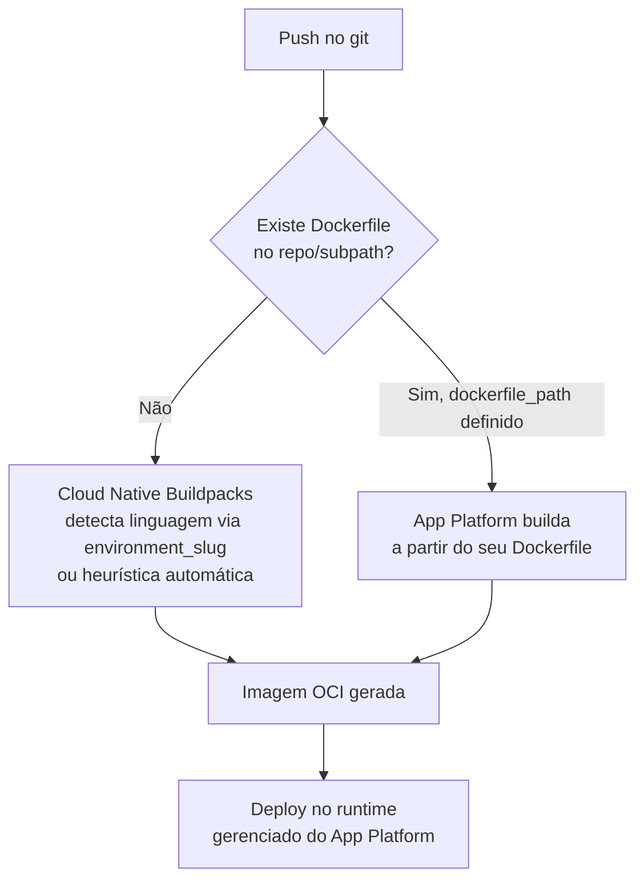
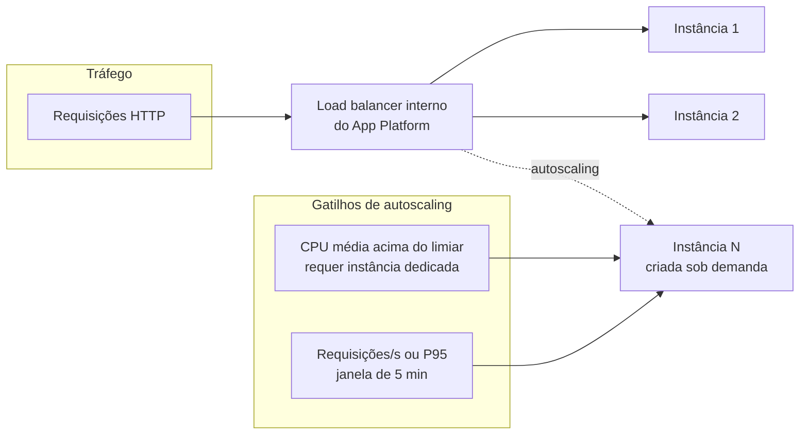

> [!abstract] TL;DR
> App Platform é o caminho PaaS da DigitalOcean: você aponta pra um repositório git (ou uma imagem), e a plataforma detecta a linguagem, builda, containeriza, publica atrás de TLS gerenciado e reimplanta a cada push — sem você escrever uma linha de infraestrutura. É a categoria "Heroku": menos controle, muito menos operação. O equivalente conceitual na AWS seria o App Runner, mas há uma reviravolta: a AWS fechou o App Runner pra novos clientes e agora recomienda o ECS Express Mode como o caminho PaaS-lite dentro do ECS. PaaS resolve bem o app web padrão de time pequeno; quando você precisa de rede fina, sidecars ou orquestração complexa, é hora de descer pra ECS/Fargate ou Kubernetes.

## O problema que o PaaS resolve

Imagine que você acabou de terminar um MVP. Um backend Node, um Postgres, talvez um worker que processa fila em background. Você olha pro ECS ([[03-Dominios/Tecnologia/Cloud/12 - Containers gerenciados/02 - ECS e o modelo de tarefas|nota 02]]) e vê: cluster, task definition, service, load balancer, target group, security group, IAM role de execução, VPC com subnets públicas e privadas... Cada peça faz sentido isoladamente, mas juntas formam um projeto de infraestrutura antes mesmo de você escrever a primeira rota da API.

Essa é exatamente a dor que o modelo PaaS (Platform as a Service) foi desenhado pra resolver. A promessa é simples de enunciar e difícil de entregar bem: você entrega **código**, a plataforma entrega uma **URL funcionando**, com HTTPS, escala e deploy automático a cada `git push`. Nada de Dockerfile obrigatório, nada de rede pra desenhar, nada de certificado pra renovar.

O Heroku inventou essa categoria em 2007 e moldou a expectativa de uma geração inteira de desenvolvedores: `git push heroku main` e o app está no ar. A DigitalOcean, historicamente a casa das Droplets (VMs simples) e depois do Kubernetes gerenciado (DOKS), lançou o **App Platform** em 2020 exatamente pra ocupar esse mesmo nicho — só que peguntando os aprendizados de mais de uma década de PaaS, e algo mais em linha com um modelo de contêineres por baixo dos panos.

A pergunta que esta nota responde não é "como usar o App Platform" (isso é documentação), mas: **o que você ganha, o que você abre mão, e onde fica o teto** — o ponto em que o PaaS deixa de servir e você precisa descer um degrau de controle.

## Anatomia de um app: components

No App Platform, tudo que compõe sua aplicação é um **component**, declarado num arquivo chamado *app spec* (YAML ou JSON). Cinco tipos cobrem praticamente qualquer topologia de app web:

| Component | O que faz | Expõe HTTP? |
|---|---|---|
| `services` | Processo web de longa duração (API, servidor HTTP) | Sim, roteado publicamente |
| `workers` | Processo de longa duração sem endpoint HTTP (consumidor de fila, processador em background) | Não |
| `jobs` | Tarefa de execução única, pré/pós-deploy ou agendada via cron (`kind: SCHEDULED`) | Não |
| `static_sites` | Assets estáticos (build de frontend) servidos direto por CDN | Sim, via arquivos estáticos |
| `databases` | Instância attachada — gerenciada pela DO (dev database) ou referência a um cluster gerenciado externo | N/A |

Um app real normalmente combina vários desses num único spec. Pense num SaaS típico: um `service` (a API), um `worker` (processa emails em fila), um `job` agendado (limpeza noturna do banco), um `static_site` (o frontend React) e um `database` (Postgres). Tudo isso é **um único app** no painel do App Platform, com um único deploy coordenado.

```yaml
name: minha-app
region: nyc

services:
  - name: api
    github:
      repo: minha-org/api
      branch: main
      deploy_on_push: true
    environment_slug: node-js
    http_port: 8080
    instance_count: 2
    instance_size_slug: apps-s-1vcpu-1gb
    routes:
      - path: /

workers:
  - name: email-worker
    github:
      repo: minha-org/api
      branch: main
    environment_slug: node-js
    run_command: node worker.js
    instance_count: 1

jobs:
  - name: limpeza-noturna
    github:
      repo: minha-org/api
      branch: main
    kind: SCHEDULED
    schedule:
      cron: "0 3 * * *"

static_sites:
  - name: frontend
    github:
      repo: minha-org/frontend
      branch: main
    environment_slug: html
    output_dir: dist

databases:
  - name: db
    engine: PG
    version: "17"
    production: true
```

Repare que `api` e `email-worker` apontam pro **mesmo repositório**, mudando só o `run_command` (ou o Procfile-equivalente). Isso é comum: o mesmo código-base, dois processos diferentes — um serve HTTP, o outro consome fila.

## Buildpacks vs Dockerfile: quem builda sua imagem?

Aqui está a decisão central de cada component do tipo `services`, `workers` ou `jobs`: **quem transforma seu código em uma imagem de container executável?**



**Sem Dockerfile** (o caminho padrão e o mais "PaaS" de todos): você declara um `environment_slug` (`node-js`, `python`, `go`, `ruby`, `php`, `hugo`, entre outros) ou deixa o App Platform detectar sozinho pela presença de `package.json`, `requirements.txt`, `go.mod`, etc. Por baixo, ele usa **Cloud Native Buildpacks** (o mesmo padrão open-source que o Heroku ajudou a criar e que hoje é um projeto da CNCF) para produzir uma imagem otimizada — cache de dependências, camadas corretas, sem que você escreva uma linha de `FROM`.

**Com Dockerfile**: você define `dockerfile_path` no component, e a plataforma builda exatamente a imagem que seu Dockerfile descreve. Isso te dá controle total sobre o processo de build — pacotes de sistema, multi-stage build, versão exata de runtime — sem abrir mão do resto da experiência PaaS (deploy automático, scaling, TLS).

Ou seja: **buildpacks vs Dockerfile não é PaaS vs container gerenciado** — é uma escolha *dentro* do PaaS, entre "deixa a plataforma decidir" e "eu decido o build, a plataforma decide o resto".

## Deploy automático e o ciclo de vida

O gancho que fecha a experiência Heroku-like é `deploy_on_push: true`. A cada commit na branch configurada, o App Platform:

1. Detecta o push via webhook do GitHub/GitLab
2. Builda a nova imagem (buildpack ou Dockerfile)
3. Faz o deploy com estratégia de substituição gradual das instâncias
4. Roda health checks antes de rotear tráfego pra versão nova
5. Mantém o histórico de deploys, com rollback de um clique pro painel

Não existe passo manual de "criar nova task definition" ou "atualizar o service" como no ECS ([[03-Dominios/Tecnologia/Cloud/12 - Containers gerenciados/02 - ECS e o modelo de tarefas|nota 02]]) — a plataforma absorve inteiramente esse ciclo.

## Scaling: horizontal e vertical

O App Platform separa os dois eixos de escala de forma explícita no app spec:

- **Horizontal** (`instance_count`): quantas réplicas do component rodam simultaneamente, de 1 a 250. Mais réplicas = mais capacidade de throughput, distribuída pelo load balancer interno da plataforma.
- **Vertical** (`instance_size_slug`): quanto CPU/memória cada réplica individual recebe — os "tamanhos" de container (`apps-s-1vcpu-1gb`, `apps-s-1vcpu-2gb`, etc.), análogos aos planos de Droplet, mas cobrados por instância de app.

> [!info] Verificado em 2026-07-24
> O App Platform oferece **autoscaling automático** em duas modalidades: baseado em CPU média (exige plano de CPU dedicada) e baseado em tráfego HTTP — requisições/segundo ou latência P95, calculado numa janela de 5 minutos, disponível também com CPU compartilhada, com teto de até 100 instâncias. Você configura `min_instance_count`/`max_instance_count` e o limiar. Isso é recente o suficiente pra valer conferir a doc oficial antes de depender do comportamento exato em produção.

Não há autoscaling *vertical* automático — trocar de tamanho de instância é sempre uma ação manual (ou via API/CI), diferente do horizontal.

> [!info] Verificado em 2026-07-24 — preços de referência
> Tamanhos de instância (`instance_size_slug`) vão de compartilhado (`apps-s-1vcpu-0.5gb`, a partir de US$ 5/mês) a dedicado (`apps-d-8vcpu-32gb`, US$ 392/mês). Um detalhe que pega gente de surpresa: **planos compartilhados de entrada não suportam autoscaling** — CPU-based autoscaling exige CPU dedicada (`apps-d-*`); só o request-based funciona também em CPU compartilhada. Preços mudam; confira a página oficial de pricing antes de orçar produção.



## TLS gerenciado por padrão

Todo app do App Platform recebe automaticamente um subdomínio HTTPS (`*.ondigitalocean.app`) com certificado já provisionado. Ao anexar um domínio customizado, a plataforma emite e renova o certificado TLS automaticamente via Let's Encrypt (ou Google Trust, como CA alternativa) — você só precisa apontar o DNS. Não existe um "Application Load Balancer" pra configurar, nem um ACM pra emitir certificado manualmente: isso tudo é interno à plataforma, invisível pra quem opera o app.

## Caso prático: do zero ao ar em cinco minutos

Vale visualizar o fluxo completo, porque é aí que a proposta de valor do PaaS fica concreta. Imagine uma API Node simples, sem Dockerfile nenhum no repositório:

1. Você escreve `app.yaml` com um único `service` apontando pro repo GitHub, `environment_slug: node-js`, `http_port: 3000`.
2. Roda `doctl apps create --spec app.yaml --wait`.
3. O App Platform clona o repo, detecta `package.json`, aplica o buildpack Node (instala dependências, identifica o comando de start), builda a imagem.
4. A imagem sobe, passa no health check na porta declarada, e a plataforma já expõe `minha-app-xxxxx.ondigitalocean.app` com certificado TLS válido.
5. Você aponta `api.suaempresa.com` como domínio customizado no spec; o App Platform emite o certificado via Let's Encrypt automaticamente e valida por DNS.
6. Daí em diante, todo `git push` na branch configurada dispara um novo build e deploy — sem você tocar em nada além do código.

Compare isso com o que a mesma tarefa exige no ECS clássico: criar cluster, task definition com a imagem já publicada num registry (você precisa ter buildado e enviado a imagem *antes*), service, load balancer, target group, security groups, e só então a rota funciona. O PaaS não elimina esse trabalho — ele o **internaliza**, e é exatamente esse internalizar que você está comprando (ou abrindo mão de controlar) ao escolher App Platform.

## A lente dupla: App Platform vs App Runner

O par natural de comparação na AWS é o **App Runner** — serviço lançado em 2021 com a mesma proposta: deploy de código-fonte ou imagem, scaling automático, HTTPS gerenciado, sem gestão de cluster.

> [!warning] Reviravolta importante (verificado em 2026-07-24)
> A AWS **fechou o App Runner para novos clientes**. Clientes existentes continuam podendo usar o serviço normalmente (inclusive criar novos recursos), mas a AWS não planeja mais lançar funcionalidades novas nele. A recomendação oficial da própria AWS pra quem migra do App Runner é o **Amazon ECS Express Mode** — um modo simplificado dentro do ECS que provisiona, com uma única chamada de API (imagem + duas IAM roles), um stack completo: serviço ECS no Fargate, Application Load Balancer, auto scaling e rede — sem cobrança adicional além dos recursos AWS subjacentes. Isso significa que, hoje, a resposta mais honesta pra "qual é o PaaS da AWS" é **ECS Express Mode**, não App Runner — mesmo que o App Runner ainda apareça em muito conteúdo e discussões como se fosse a opção corrente. Diferença estrutural relevante: o Express Mode exige uma imagem de container pronta (não builda a partir de código-fonte como o App Runner fazia); quem vinha de deploy direto de source precisa adicionar um passo de containerização (Dockerfile + CI) antes.

| Dimensão | App Platform (DO) | App Runner (AWS, legado p/ novos clientes) | ECS Express Mode (AWS, caminho atual) |
|---|---|---|---|
| Deploy a partir de | Git (buildpack ou Dockerfile) ou imagem | Código-fonte ou imagem de container | Só imagem de container |
| Unidade de composição | App com múltiplos components (service/worker/job/static/db) | Um serviço por vez | Um serviço por chamada; compõe via múltiplas chamadas |
| TLS gerenciado | Sim, automático (subdomínio e domínio próprio) | Sim, automático | Via ACM + ALB, criado junto no provisionamento |
| Autoscaling | CPU e/ou requisição, até 100 instâncias | Baseado em concorrência de requisições | Baseado em CPU (config no `scaling-target`) |
| Aberto a novos clientes | Sim | **Não** (fechado, só clientes existentes) | Sim |
| Cron/job agendado nativo | Sim (`jobs` com `kind: SCHEDULED`) | Não (precisa EventBridge + outro serviço) | Não nativamente (precisa compor com EventBridge) |

A lição pra quem está desenhando algo novo na AWS hoje: não comece por App Runner. O caminho recomendado é ECS Express Mode se você quer a experiência PaaS-lite, ou ECS/Fargate completo ([[03-Dominios/Tecnologia/Cloud/12 - Containers gerenciados/03 - Fargate a fundo|nota 03]]) se você já sabe que vai precisar de mais controle.

## Tradução de nomes (Azure/GCP, referência)

| Conceito | AWS | DigitalOcean | Azure | GCP |
|---|---|---|---|---|
| PaaS de deploy direto de código | App Runner (legado) / ECS Express Mode | App Platform | Azure App Service | Cloud Run (com source deploy) / App Engine |
| Build automático sem Dockerfile | (via Express Mode, requer imagem própria) | Buildpacks (CNB) | Oryx (buildpacks) | Buildpacks (Cloud Run) |
| Job agendado dentro da plataforma | EventBridge Scheduler (externo) | `jobs` com `kind: SCHEDULED` | WebJobs / Functions Timer | Cloud Scheduler (externo) |
| Worker sem HTTP | Serviço ECS sem load balancer | `workers` | WebJob contínuo | Cloud Run jobs / GKE |

## Quando o PaaS basta — e quando ele já não basta

O App Platform (e o equivalente que a AWS está empurrando, ECS Express Mode) resolve bem um perfil de problema específico:

- Time pequeno, sem SRE dedicado
- App web padrão: API + frontend + banco, talvez um worker
- Prioridade é velocidade de entrega, não customização de infraestrutura
- Tráfego previsível ou que escala de forma razoavelmente linear com HTTP requests/CPU

Isso cobre uma fatia enorme de startups, MVPs, side projects e até produtos em produção de porte médio. Não é "brinquedo" — dá pra rodar coisa séria em cima disso.

Mas existe um teto, e vale nomear com honestidade o que você abre mão:

> [!warning] O teto do PaaS
> - **Rede fina**: você não escolhe VPC, subnets, security groups por serviço, peering customizado. O App Platform te dá uma rede que "só funciona", mas se seu app precisa de uma topologia de rede específica (isolamento por camada, VPN site-to-site, peering com outra conta), você não tem esse controle.
> - **Sidecars e padrões de service mesh**: não há como anexar um container auxiliar (proxy, agente de telemetria customizado, sidecar de segurança) ao lado do seu processo principal — o modelo é um processo por component, não um pod com múltiplos containers como no Kubernetes.
> - **Customização de runtime de baixo nível**: kernel parameters, drivers específicos, hardware especializado (GPU em alguns planos, mas não a granularidade que Fargate/EKS oferecem) — fora do alcance.
> - **Orquestração complexa**: se seu sistema precisa de múltiplos serviços coordenados com dependências de deploy, canary releases sofisticados, ou políticas de rede zero-trust entre serviços, isso é terreno de Kubernetes, não de PaaS.
> - **Portabilidade**: o app spec do App Platform é específico da DO; migrar pra outro provedor significa reescrever a definição de infraestrutura (diferente de um Dockerfile + manifesto Kubernetes, que é mais portável).

Quando você bate nesse teto, o caminho de descida natural é: primeiro Fargate ([[03-Dominios/Tecnologia/Cloud/12 - Containers gerenciados/03 - Fargate a fundo|nota 03]]) ou ECS clássico ([[03-Dominios/Tecnologia/Cloud/12 - Containers gerenciados/02 - ECS e o modelo de tarefas|nota 02]]) — ainda gerenciado, mas com controle explícito de rede, task definitions e scaling policies. Se nem isso for suficiente — porque você precisa de sidecars, operators customizados, ou já tem um ecossistema inteiro pensado em termos de recursos Kubernetes — o degrau seguinte é Kubernetes gerenciado, que esta trilha toca de raspão (a fundo, é território da trilha de Operação).

## Colocando a mão: doctl e AWS CLI lado a lado

**DigitalOcean — criar o app a partir do spec:**

```bash
# valida e cria o app a partir do app.yaml
doctl apps create --spec app.yaml --wait

# atualiza um app existente com um novo spec
doctl apps update <app-id> --spec app.yaml

# lista os apps da conta
doctl apps list --format ID,Spec.Name,DefaultIngress,ActiveDeployment.Phase
```

**AWS — o caminho atual (ECS Express Mode), CLI:**

```bash
aws ecs create-express-gateway-service \
    --execution-role-arn arn:aws:iam::123456789012:role/ecsTaskExecutionRole \
    --infrastructure-role-arn arn:aws:iam::123456789012:role/ecsInfrastructureRoleForExpressServices \
    --primary-container '{
        "image": "123456789012.dkr.ecr.us-east-1.amazonaws.com/minha-app:latest",
        "containerPort": 8080
    }' \
    --service-name "minha-aplicacao" \
    --health-check-path "/" \
    --scaling-target '{"minTaskCount":1,"maxTaskCount":4}'
```

Repare na diferença estrutural que a lente dupla expõe: o comando da DO recebe um **spec declarativo completo** (services, workers, jobs, static sites, database, tudo junto); o comando AWS recebe uma **imagem já pronta** e provisiona a infraestrutura em volta dela — porque, como vimos, o caminho PaaS-lite atual da AWS não builda a partir de código-fonte.

## O que vem a seguir

Container gerenciado nem sempre significa ECS ou App Platform — às vezes significa Kubernetes, só que sem você precisar operar o control plane. A próxima nota deste galho encosta nesse território — Kubernetes gerenciado (EKS na AWS, DOKS na DigitalOcean) — o suficiente pra você reconhecer quando a resposta certa é "sim, você precisa de K8s", mesmo sem entrar na operação profunda do Kubernetes em si (essa profundidade mora na trilha de Operação). Depois disso, a nota-capstone deste galho fecha o Bloco 3 comparando container gerenciado, VM e serverless lado a lado — a árvore de decisão completa que começou lá na nota sobre [[03-Dominios/Tecnologia/Cloud/11 - Serverless e FaaS — Lambda a fundo/06 - Quando serverless faz (e não faz) sentido|quando serverless faz sentido]].

## Fontes

- [DigitalOcean App Platform — visão geral](https://docs.digitalocean.com/products/app-platform/)
- [DigitalOcean App Platform — App Spec Reference](https://docs.digitalocean.com/products/app-platform/reference/app-spec/)
- [DigitalOcean App Platform — Scale an App](https://docs.digitalocean.com/products/app-platform/how-to/scale-app/)
- [DigitalOcean App Platform — Manage Domains](https://docs.digitalocean.com/products/app-platform/how-to/manage-domains/)
- [doctl apps create — referência](https://docs.digitalocean.com/reference/doctl/reference/apps/create/)
- [AWS App Runner — What is App Runner](https://docs.aws.amazon.com/apprunner/latest/dg/what-is-apprunner.html)
- [AWS App Runner — Availability change (fechado a novos clientes) e migração pra ECS Express Mode](https://docs.aws.amazon.com/apprunner/latest/dg/apprunner-availability-change.html)
