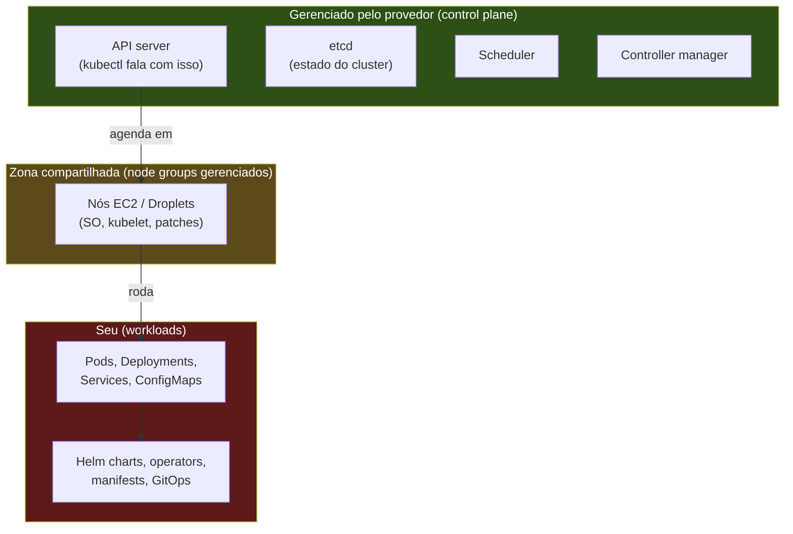
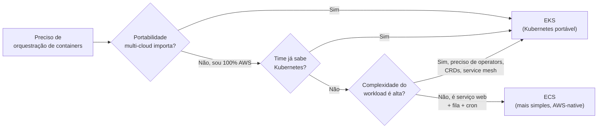
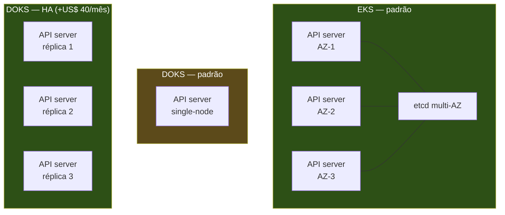

> [!abstract] TL;DR
> Kubernetes gerenciado tira do seu colo a parte mais chata de operar K8s — o control plane (API server, etcd, scheduler) — e deixa com você os workloads e, em boa parte, os nós. Amazon EKS é o Kubernetes "canônico" da AWS, rico em integrações mas com curva de operação real. DigitalOcean Kubernetes (DOKS) é a versão enxuta: control plane grátis, node pools simples, menos discagem fina. Esta nota mostra só a fronteira do que o provedor gerencia — Kubernetes a fundo (pods, Services, Helm, operators, GitOps) é assunto do domínio Operação, não deste galho.

> [!info] A contraparte instrumental (2026-08-04)
> Esta nota trata de **onde termina o control plane do provedor** e o que você deixa de operar ao escolher um Kubernetes gerenciado. O que exatamente está sendo gerenciado por você está descrito em [[03-Dominios/Tecnologia/Infraestrutura/Kubernetes/16 - O control plane por dentro|O control plane por dentro]], no galho [[03-Dominios/Tecnologia/Infraestrutura/Kubernetes/index|Tecnologia/Infraestrutura/Kubernetes]] — etcd e quórum, o api-server como única porta, a cadeia de admission, eleição de líder. Ler as duas juntas é o jeito mais rápido de saber o que some da sua responsabilidade e o que continua sendo seu.

## O problema: você quer os poderes do Kubernetes sem virar administrador de etcd

Imagina que você já passou pela nota anterior deste galho e decidiu que o App Platform da DigitalOcean, ou o Elastic Beanstalk, são simples demais pro que você precisa. Você tem múltiplos times, dezenas de microsserviços, precisa de orquestração fina — afinidade de pods, rollouts canário, autoscaling por métrica customizada, service mesh. Você quer Kubernetes.

Só que Kubernetes "cru" — rodado por você do zero — não é um produto, é um sistema distribuído que você precisa manter vivo. O control plane sozinho já é um projeto: um `etcd` cluster consistente (o banco de estado do Kubernetes, que se corromper derruba o cluster inteiro), um API server em alta disponibilidade atrás de load balancer, um scheduler e um controller-manager rodando em quorum, certificados TLS internos girando, upgrades de versão coordenados sem downtime. Isso antes mesmo de você rodar o primeiro pod de aplicação.

É exatamente esse pedaço — o control plane — que o Kubernetes gerenciado tira das suas costas. AWS opera o etcd, o API server, o scheduler; você só aponta seu `kubectl` pro endpoint e começa a aplicar manifests. É a mesma lógica de "gerenciado" que já apareceu neste galho pro Fargate e pro ECS: alguém garante que a fundação está de pé, você garante que o prédio em cima dela faz sentido.

Pense num prédio de apartamentos. O síndico (o provedor) cuida do elevador, da fiação elétrica do edifício, do encanamento principal, da portaria — a infraestrutura compartilhada que, se quebrar, derruba o prédio inteiro. Você, morador, cuida do seu apartamento: móveis, decoração, quem entra e sai. Kubernetes "cru" seria comprar um terreno e construir o prédio inteiro sozinho, elevador incluso. Kubernetes gerenciado é alugar o apartamento pronto, num prédio com síndico profissional. A pergunta que resta — e que esta nota responde — é: **onde exatamente termina a área comum e começa o seu apartamento?**

## Onde a linha é traçada

O diagrama a seguir é o coração desta nota — ele mostra exatamente onde o provedor para e onde você começa.



Repare que existe uma zona do meio: os **nós** (as máquinas que efetivamente rodam seus pods). Em Kubernetes gerenciado com *managed node groups* (EKS) ou *node pools* (DOKS), o provedor cuida do provisionamento da máquina, da instalação do `kubelet` (o agente que fala com o control plane) e — em boa parte dos casos — dos patches de sistema operacional e da substituição automática de nós não saudáveis. Mas o nó ainda é uma VM sua rodando na sua conta, cobrada como instância normal. Ele não desaparece como no Fargate.

> [!info] Fargate também serve o EKS
> Tanto EKS quanto ECS podem rodar sobre Fargate — nesse caso os nós somem de vez e você paga por pod, não por VM. Isso já foi coberto na nota sobre [[03-Dominios/Tecnologia/Cloud/12 - Containers gerenciados/03 - Fargate a fundo|Fargate a fundo]] (verifique se essa nota já existe no seu vault antes de seguir o link). O EKS Auto Mode, lançado mais recentemente, estende a gestão da AWS também para a escolha de instâncias e patching dos nós — um meio-termo entre managed node groups e Fargate puro.

Por que essa zona do meio existe e não é simplesmente absorvida pelo provedor? Porque o nó é onde a AWS ou a DO precisam abrir mão de controle em troca de flexibilidade sua: é ali que você escolhe o tipo de instância (CPU, memória, GPU), a zona de disponibilidade, o volume de disco anexado. Se o provedor absorvesse 100% do nó — como acontece no Fargate — você perderia esse tipo de ajuste fino. Managed node groups e node pools são o meio-termo deliberado: o provedor cuida do ciclo de vida operacional do nó (provisionar, registrar no cluster, substituir se morrer, aplicar patch de segurança do SO quando configurado), mas o dimensionamento e o tipo continuam sendo decisão sua.

## Amazon EKS: o Kubernetes "de verdade" da AWS

O Amazon Elastic Kubernetes Service roda um Kubernetes certificado — conformante com a especificação upstream, então ferramentas, plugins e conhecimento da comunidade Kubernetes funcionam sem adaptação. Isso é o principal argumento de venda do EKS sobre o [[03-Dominios/Tecnologia/Cloud/12 - Containers gerenciados/02 - ECS e o modelo de tarefas|ECS]]: você não fica preso ao vocabulário e às APIs proprietárias da AWS, o cluster é portável (em teoria) pra qualquer outro provedor Kubernetes.

O modelo de nós no EKS tem três variantes:

- **Managed node groups**: você diz "quero N instâncias EC2 deste tipo", a AWS provisiona um Auto Scaling Group, instala o `kubelet` e cuida de drenar/substituir nós em updates. É o caminho recomendado pra maioria dos casos.
- **Self-managed nodes**: você monta o Auto Scaling Group e a AMI você mesmo. Mais controle, mais trabalho — raramente vale a pena hoje.
- **Fargate profiles**: pods rodam sem nó visível, como descrito acima.

Criar um cluster EKS via `eksctl` (a CLI de mais alto nível, que abstrai boa parte do CloudFormation por baixo) tem essa cara:

```bash
# Cluster com um managed node group já embutido
eksctl create cluster \
  --name meu-cluster \
  --region us-east-1 \
  --nodegroup-name workers-padrao \
  --node-type t3.medium \
  --nodes 3 \
  --nodes-min 2 \
  --nodes-max 5

# Isso provisiona: control plane gerenciado + ASG de EC2 +
# configuração de kubectl local (~/.kube/config) pronta pra uso
```

Depois de criado, um comando simples confirma que o control plane está de pé e enxergando os nós — sem entrar em nenhum manifest de aplicação ainda:

```bash
# Confirma que o kubectl está falando com o control plane gerenciado
# e que os nós do managed node group já se registraram
kubectl get nodes

# NAME                            STATUS   ROLES    AGE   VERSION
# ip-192-168-10-20.ec2.internal   Ready    <none>   2m    v1.31.0-eks-...
# ip-192-168-31-45.ec2.internal   Ready    <none>   2m    v1.31.0-eks-...
```

Esse é o ponto exato onde a responsabilidade do EKS termina e a sua começa: o cluster existe, tem nós saudáveis, e está pronto pra receber workloads. A partir daqui, tudo que envolve `kubectl apply`, Deployments, Services, Ingress, Helm charts, operators — é Kubernetes puro, e **sai do escopo deste galho**. É aqui que a fronteira com o domínio Operação fica mais nítida.

Duas peças de gestão continuam sob responsabilidade compartilhada e vale nomear, mesmo sem aprofundar:

- **Upgrades de versão do cluster**: o EKS dá suporte por tempo limitado a cada versão do Kubernetes (support padrão de cerca de 14 meses por versão, com extended support pago depois disso). Você decide quando fazer o upgrade do control plane e dos node groups, mas precisa fazê-lo — versões saem de suporte e o cluster não atualiza sozinho.
- **IAM Roles for Service Accounts (IRSA)**: o mecanismo pelo qual um pod dentro do EKS assume permissões IAM específicas (por exemplo, pra ler um bucket S3) sem precisar de credenciais estáticas. É a ponte entre a identidade do Kubernetes (Service Account) e a identidade da AWS (IAM Role) — um dos recursos que dá ao EKS uma integração mais fina com o resto da AWS do que a DOKS consegue oferecer com a DigitalOcean.

> [!info] Fronteira forte com Operação
> Esta nota mostra só até "o cluster existe e está pronto para receber workloads". Tudo que vem depois — desenhar Deployments e Services, entender Ingress controllers, escrever Helm charts, adotar operators, montar pipeline GitOps com Argo CD ou Flux — é conteúdo de Kubernetes a fundo, que vive no domínio [[03-Dominios/Engenharia/Operação/index|Operação]]. Cloud aqui só ensina "quem liga o control plane e quem administra os nós"; a arte de operar workloads dentro do cluster é outro capítulo do grimório, propositalmente fora deste galho.

> [!tip] Assista: Amazon EKS Explained: Introduction to Managed Kubernetes on AWS
> **Canal:** CodeLucky | **Duração:** ~6min | **Idioma:** EN
>
> Resumo rápido de exatamente a fronteira que esta nota traça: o que a AWS assume no control plane (disponibilidade, escala, patching dos componentes do master) versus o que fica com você nos node groups — sem entrar em Deployments ou manifests, só a divisão de responsabilidade. Trecho de destaque [01:15]: *"you get a managed control plane where AWS automatically handles the availability, scaling, and patching of your Kubernetes master components"*
>
> 🎬 [Assistir no YouTube](https://www.youtube.com/watch?v=aGI_yUbmTFU)

## DigitalOcean Kubernetes (DOKS): o mesmo K8s, com menos discagem

A DigitalOcean também roda Kubernetes certificado — o mesmo Kubernetes upstream, não uma variante. A diferença está na filosofia de produto: onde a AWS te dá dezenas de opções (tipos de node group, modos de rede, integrações IAM finas), a DO reduz as decisões ao essencial.

Criar um cluster DOKS via `doctl`:

```bash
# Lista as versões de Kubernetes disponíveis
doctl kubernetes options versions

# Cria o cluster com um node pool
doctl kubernetes cluster create meu-cluster \
  --region nyc1 \
  --node-pool "name=workers-padrao;size=s-2vcpu-4gb;count=3;auto-scale=true;min-nodes=2;max-nodes=5"

# doctl já grava o kubeconfig localmente ao final
```

DOKS tem autoscaling de dois níveis nativamente integrado: o **Cluster Autoscaler** ajusta o número de nós conforme a demanda de pods não agendados, e o **Horizontal Pod Autoscaler** (HPA) ajusta o número de réplicas de um Deployment conforme métricas — os dois trabalham juntos, um escalando infraestrutura, o outro escalando a aplicação. Repare que o comando de criação acima já embute `auto-scale=true` com `min-nodes`/`max-nodes` — na DO isso é uma flag do node pool, não uma peça separada que você monta à parte (como um Auto Scaling Group na AWS).

O mesmo teste de sanidade do EKS vale aqui — depois do cluster criado, `kubectl get nodes` (usando o kubeconfig que o `doctl` já baixou) confirma que o control plane gerenciado está de pé e os nós do node pool se registraram. A partir daí, a fronteira com Operação é idêntica à do EKS: workloads, Deployments, Services, Helm — território do outro domínio.

A DO também gerencia atualizações de versão do Kubernetes de forma mais opinativa que a AWS: você pode habilitar **auto-upgrade** pra que patches de versão sejam aplicados automaticamente em uma janela de manutenção configurável, reduzindo ainda mais a carga operacional — ao custo de menos controle fino sobre o timing exato do upgrade.

> [!info] Verificado 2026-07-24 — control plane
> O control plane padrão do DOKS é **gratuito** — você paga só pelos Droplets dos node pools (cobrados por segundo). Existe uma opção de **control plane em alta disponibilidade** por **US$ 40/mês** (prorateado por hora), pra quem quer redundância adicional no plano de controle. No EKS, o control plane padrão custa **US$ 0,10 por cluster por hora** (~US$ 73/mês) — sempre, não é opcional. É uma diferença de posicionamento real: a DO subsidia o control plane básico pra baixar a barreira de entrada; a AWS cobra por ele desde o primeiro cluster.

## EKS vs ECS: quando cada um faz sentido

Essa é provavelmente a decisão mais recorrente dentro da AWS pra quem escolhe orquestração de containers. Não existe resposta universal, mas os eixos de decisão são claros:



| Critério | Amazon ECS | Amazon EKS |
|---|---|---|
| Curva de aprendizado | Baixa — conceitos próprios da AWS (task, service) | Alta — Kubernetes tem vocabulário e mecânica próprios |
| Portabilidade | Nula — só existe na AWS | Alta — cluster roda o mesmo K8s de qualquer lugar |
| Ecossistema de ferramentas | Limitado ao que a AWS oferece | Imenso — Helm, operators, service mesh, toda a CNCF |
| Custo do control plane | Embutido, sem cobrança adicional | US$ 0,10/hora fixo, sempre |
| Times pequenos / MVP | Favorece ECS | Overhead raramente compensa |
| Times grandes, multi-time, multi-cloud | Menos natural | Favorece EKS |

Regra prática: se sua equipe já domina Kubernetes ou você precisa rodar a mesma stack em múltiplas nuvens (ou em nuvem + on-premises), EKS paga o preço da complexidade. Se você está 100% dentro da AWS e quer o caminho de menor atrito operacional, ECS — especialmente com Fargate — costuma vencer.

Um exemplo concreto ajuda a fixar a intuição. Imagine uma fintech que roda hoje só na AWS, com um time de 4 desenvolvedores backend e nenhum SRE dedicado. Ela precisa subir 6 microsserviços, uma fila de processamento assíncrono e um cron job noturno de conciliação. Nenhuma exigência de portabilidade multi-cloud, nenhum operator externo necessário. Esse é o perfil clássico de ECS + Fargate: sobe rápido, o time entende o modelo de tasks em um dia, e ninguém precisa aprender o vocabulário de Kubernetes pra shippar. Agora troque o cenário: a mesma fintech foi comprada por um grupo maior que já roda Kubernetes on-premises em datacenter próprio por exigência regulatória, e quer os mesmos manifests rodando tanto lá quanto na nuvem, com o mesmo Helm chart e a mesma pipeline de deploy. Nesse cenário a portabilidade deixa de ser luxo e vira requisito — e o EKS (ou qualquer K8s gerenciado) passa a ser a escolha que evita reescrever a camada de orquestração duas vezes.

## Alta disponibilidade do control plane: o que "gerenciado" garante por baixo

Vale abrir uma pergunta que costuma ficar implícita: quando você aponta pra um control plane gerenciado, o que exatamente está sendo garantido em termos de resiliência?

No EKS, o control plane roda distribuído por múltiplas zonas de disponibilidade dentro da região escolhida — o etcd e o API server têm réplicas espalhadas, de forma que a perda de uma AZ inteira não derruba o cluster. Isso é parte do que você paga com os US$ 0,10/hora: não é só "alguém opera o etcd pra você", é "alguém opera um etcd resiliente a falha de zona, sem você precisar desenhar essa topologia".

No DOKS, o control plane padrão roda numa configuração enxuta — e é justamente por isso que existe a opção paga de **HA control plane** por US$ 40/mês: ela adiciona réplicas do control plane distribuídas, elevando a garantia de disponibilidade pro nível que o EKS já oferece por padrão. Ou seja, a comparação de preço "control plane grátis vs US$ 0,10/hora" simplifica demais se a sua carga exige alta disponibilidade real — nesse caso a conta da DO passa a incluir os US$ 40/mês, e a diferença de custo entre os dois provedores encolhe.



Essa é a pergunta certa pra levar pra entrevista ou pra decisão de arquitetura: não "qual control plane é mais barato", mas "qual nível de resiliência do control plane eu realmente preciso, e quanto isso custa em cada provedor".

## A posição da DOKS no mercado

DOKS não compete com EKS em profundidade de recursos — não tem, por exemplo, o equivalente ao EKS Auto Mode ou às integrações finas de IAM por Service Account (IRSA) que o EKS oferece. O que a DOKS vende é **simplicidade e previsibilidade de custo**: control plane gratuito, interface e CLI (`doctl`) mais enxutas, faturamento por segundo nos Droplets, e uma superfície de decisão bem menor na hora de subir o cluster.

Isso faz da DOKS uma porta de entrada natural pra quem quer aprender Kubernetes de verdade (o mesmo K8s upstream, os mesmos manifests, o mesmo `kubectl`) sem a barreira de custo e de opções da AWS. Para cargas de produção de grande escala com exigências regulatórias pesadas ou integrações profundas com outros serviços AWS (IAM granular, VPC peering complexo, compliance específico), o ecossistema do EKS ainda pesa mais.

Há também uma diferença de rede que vale mencionar sem aprofundar (isso é Operação, não Cloud): o EKS usa por padrão o **VPC CNI**, um plugin de rede que atribui a cada pod um IP real dentro da VPC — o que facilita integração com outros recursos AWS, mas consome endereços IP da sua VPC mais rápido do que se espera em clusters grandes. A DOKS usa uma implementação baseada em **Cilium** (eBPF) pro CNI padrão, com um modelo de rede mais autocontido dentro do cluster. Se essa frase não fizer sentido agora, tudo bem — é exatamente o tipo de detalhe que só importa quando você já está operando o cluster no dia a dia, e é onde o domínio Operação assume a explicação completa.

Um jeito rápido de resumir a diferença de filosofia: a AWS trata o EKS como uma peça de um ecossistema enorme, com dezenas de pontos de integração possíveis (IAM, VPC, CloudWatch, GuardDuty, Resilience Hub) — o poder vem acompanhado de superfície de decisão. A DigitalOcean trata o DOKS como um produto autocontido, otimizado pra você chegar num cluster funcional com o menor número de decisões possível. Nenhuma das duas filosofias é "certa" — a pergunta é qual delas combina com o tamanho do seu time e a complexidade real do seu domínio.

## Tradução de nomes: Azure e GCP

Como em toda a trilha, aqui não vamos operar Azure nem GCP — só mapear o vocabulário, caso você cruze com esses nomes em entrevistas ou documentação de terceiros.

| Conceito | AWS | DigitalOcean | Azure | GCP |
|---|---|---|---|---|
| Kubernetes gerenciado | EKS (Elastic Kubernetes Service) | DOKS (DigitalOcean Kubernetes) | AKS (Azure Kubernetes Service) | GKE (Google Kubernetes Engine) |
| Grupo de nós gerenciado | Managed node group | Node pool | Node pool | Node pool |
| Nós sem VM visível | Fargate profile | — (sem equivalente direto) | Virtual nodes (ACI) | Autopilot |
| CLI de alto nível | eksctl | doctl | az aks | gcloud container |
| Cobrança do control plane | US$ 0,10/hora (padrão) | Grátis (padrão) / US$ 40/mês (HA) | Grátis (tier padrão) | Grátis a partir de um cluster/conta (Autopilot cobra por pod) |

Vale notar: GKE foi historicamente considerado o Kubernetes gerenciado mais maduro do mercado — o Google criou o Kubernetes internamente (a partir do Borg) antes de doá-lo à CNCF — mas essa nota não entra em avaliação comparativa de profundidade entre os quatro, só no vocabulário.

> [!warning] Armadilhas comuns
> - **Achar que "gerenciado" significa "sem trabalho nenhum"**: mesmo com control plane gerenciado, você ainda precisa gerenciar upgrades de versão do cluster, patches nos nós (se não usar Fargate/Auto Mode), políticas de rede, RBAC, e — o mais fácil de esquecer — os custos de Load Balancer e de tráfego que o cluster gera por baixo dos panos.
> - **Subestimar a curva de EKS por causa da CLI amigável**: `eksctl create cluster` sobe um cluster funcional em minutos, mas isso não ensina Kubernetes. O trabalho real (Deployments corretos, HPA configurado, Ingress, observabilidade) continua todo por sua conta.
> - **Comparar preço só pelo control plane**: US$ 0,10/hora do EKS parece pouco perto do custo real de rodar múltiplos nós EC2, load balancers e volumes EBS. O control plane raramente é o item caro da conta — é só o pedaço mais visível na página de pricing.
> - **Escolher EKS "porque é o padrão de mercado" sem considerar o tamanho do time**: Kubernetes tem custo de operação real (SRE dedicado, observabilidade, gestão de upgrades). Times pequenos que escolhem EKS "porque todo mundo usa" frequentemente descobrem isso tarde.

## Fazendo a conta: um cluster pequeno em cada provedor

Números ajudam a tirar a decisão do campo abstrato. Considere um cluster modesto — 3 nós, cada um equivalente a 2 vCPUs / 4 GB de RAM, sem HA extra no control plane, rodando um mês inteiro:

| Item | AWS EKS | DigitalOcean DOKS |
|---|---|---|
| Control plane | US$ 0,10/h × 730h ≈ US$ 73/mês | US$ 0 (padrão) |
| 3 nós (2 vCPU/4GB equivalente) | ~US$ 90–110/mês (t3.medium sob demanda, varia por região) | ~US$ 3 nós `s-2vcpu-4gb` a US$ 24/mês cada ≈ US$ 72/mês |
| Load balancer (se usado) | ~US$ 16–20/mês + tráfego | ~US$ 12/mês |
| **Total aproximado** | **~US$ 180–200/mês** | **~US$ 84/mês** |

> [!info] Verificado 2026-07-24 — valores aproximados
> Os valores de instância variam por região e mudam com frequência — trate esta tabela como ordem de grandeza, não cotação exata. O ponto estrutural que **não muda** é o padrão: EKS sempre soma US$ 0,10/hora de control plane à conta, DOKS não soma nada no padrão. Confira `aws.amazon.com/eks/pricing` e `digitalocean.com/pricing/kubernetes` antes de orçar um projeto real.

Repare que a diferença não vem só do control plane — vem também do preço por vCPU/GB, historicamente mais competitivo na DO pra instâncias pequenas e médias. Isso reforça por que a DOKS costuma vencer em cenários de time pequeno / orçamento apertado / carga previsível, enquanto o EKS se paga em cenários onde o ecossistema AWS (IAM fino, integrações de rede complexas, compliance) já é um requisito de negócio, não um luxo.

## O que vem a seguir

Esta nota fechou o giro pelas opções concretas de containers gerenciados na trilha Cloud: ECS, Fargate, App Platform e agora EKS/DOKS. A próxima nota deste galho é o capstone — ela junta os três caminhos possíveis (serverless, container gerenciado, VM) numa árvore de decisão única, revisitando a pergunta que fechou o galho de Serverless: "quando a função não basta, mas a VM é demais, qual sabor de container escolher — e quando nem container resolve?".

## Fontes

- [What is Amazon EKS?](https://docs.aws.amazon.com/eks/latest/userguide/what-is-eks.html) — AWS Docs
- [Amazon EKS Pricing](https://aws.amazon.com/eks/pricing/) — AWS
- [Kubernetes docs — Control plane components](https://kubernetes.io/docs/concepts/overview/components/#control-plane-components) — Kubernetes upstream
- [DigitalOcean Kubernetes — Product Docs](https://docs.digitalocean.com/products/kubernetes/) — DigitalOcean
- [DOKS Pricing](https://docs.digitalocean.com/products/kubernetes/details/pricing/) — DigitalOcean
