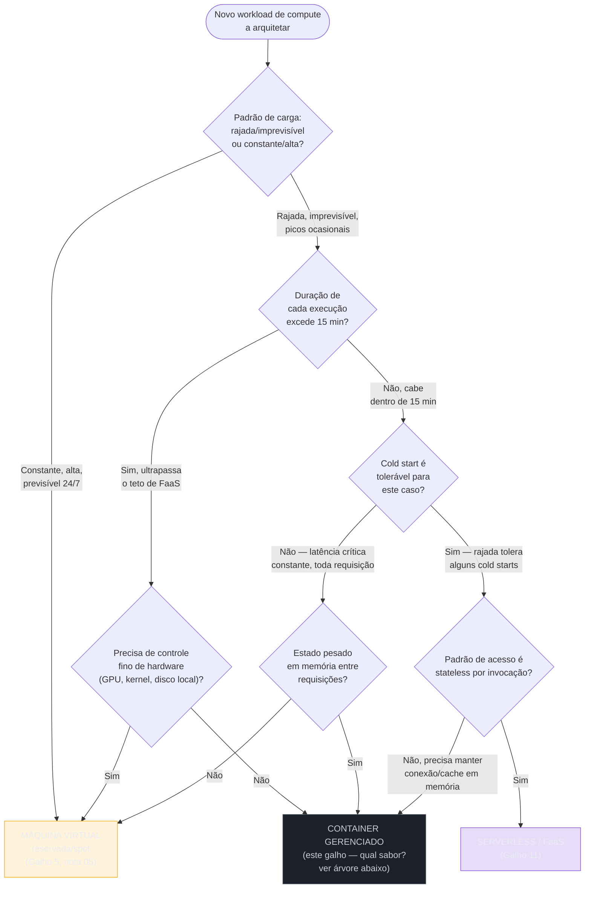
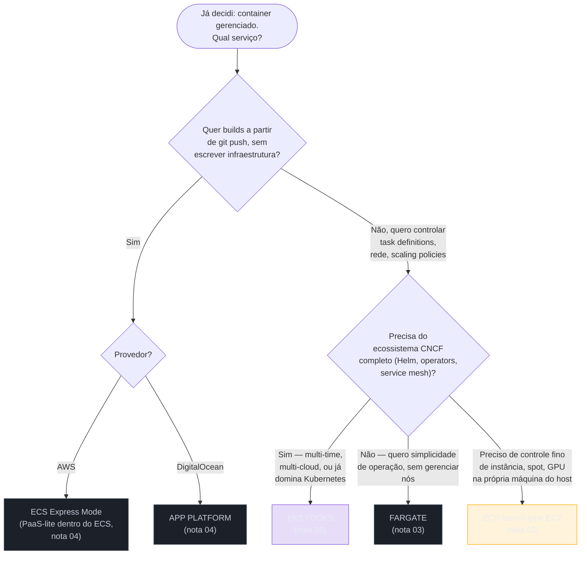
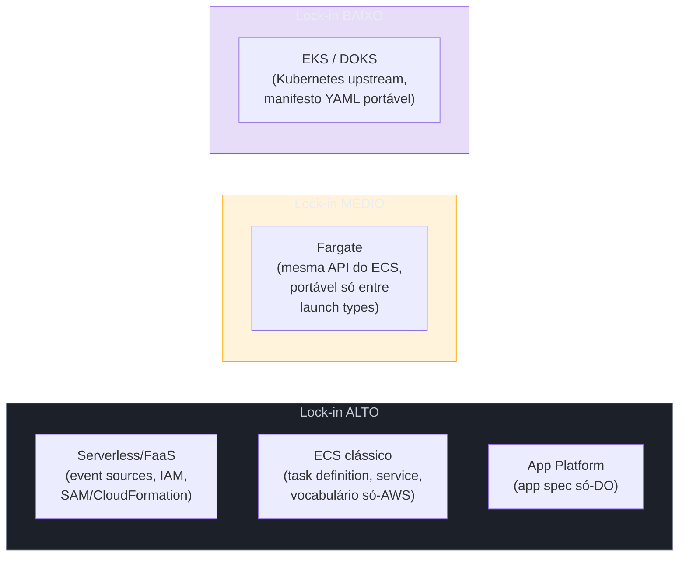

> [!abstract] TL;DR
> Este galho passou cinco notas explicando o meio-termo entre função e máquina virtual: o que é um container gerenciado, o modelo de tasks do ECS, o Fargate sem servidor visível, o caminho PaaS do App Platform e Kubernetes gerenciado de raspão. Faltava fechar o círculo aberto pelo capstone do Galho 11 — a árvore que apontava "container gerenciado" como uma caixa única, sem abrir o que tem dentro dela. Este capstone faz duas coisas: refina a árvore de três vias (VM, container gerenciado, serverless) com os eixos que decidem cada ramo, e abre a caixa "container gerenciado" numa sub-escolha própria (ECS vs Fargate vs EKS vs App Platform), nomeando onde cada um vence e onde o lock-in aperta. A ponte final entra em mensageria — compute decidido, falta como as peças conversam.

## O problema: a caixa do meio nunca foi tão simples quanto parecia

Volte à árvore que fechou o Galho 11. Ela tinha três destinos possíveis — serverless, container gerenciado, VM — e cada um deles resolvia um enigma diferente sobre padrão de carga, duração e estado. Mas repare no que ela fez com a caixa do meio: tratou "container gerenciado" como uma resposta única, um retângulo azul no diagrama, como se ECS, Fargate, EKS e App Platform fossem a mesma coisa vestida de nomes diferentes.

Não são. As cinco notas anteriores deste galho mostraram, uma a uma, que essa caixa esconde um espectro inteiro de controle-vs-simplicidade: da API de baixo nível do ECS clássico, passando pelo "esqueça o servidor" do Fargate, até o "aponte pro repositório git" do App Platform, e o Kubernetes upstream do EKS/DOKS pra quem precisa do ecossistema CNCF inteiro. Escolher "container gerenciado" na árvore de compute é só a primeira decisão. A segunda — qual sabor de container — é tão consequente quanto a primeira, e ninguém ainda tinha juntado as duas numa sequência só.

É essa sequência de duas decisões — primeiro o eixo grande (VM vs container vs serverless), depois o eixo fino (qual container) — que este capstone constrói. E, no fim, ela termina numa pergunta que nenhuma das seis notas deste galho respondeu ainda: depois que o compute está decidido e rodando, como as peças conversam entre si sem virar um emaranhado de chamadas síncronas frágeis? Essa pergunta abre a porta pro próximo galho.

## A grande árvore: VM, container gerenciado ou serverless

O capstone do Galho 11 já desenhou esta árvore com seis perguntas amarradas a números concretos — teto de 15 minutos, ponto de virada de custo perto de 5-6 milhões de requisições/mês, teto de 1.000 execuções concorrentes na AWS contra 120 na DigitalOcean. Vale reproduzi-la aqui, porque este capstone existe pra completá-la, não pra substituí-la:



Traduzindo os seis eixos que decidem essa árvore numa tabela só, agora com as três opções lado a lado — e com o eixo que faltava nas notas anteriores: maturidade operacional do time, porque nenhuma dessas três escolhas é neutra em relação a quem vai operá-la depois:

| Eixo | VM | Container gerenciado | Serverless |
|---|---|---|---|
| Padrão de carga ideal | Constante, alta, previsível | Constante moderada a alta, com picos | Rajada, imprevisível |
| Duração da tarefa | Sem teto | Sem teto | Segundos a 15 min (teto duro) |
| Controle de ambiente | Total — SO, kernel, disco, GPU | Parcial — você escolhe a imagem, o provedor gerencia o host (ou nem isso, no Fargate) | Nenhum — runtime gerenciado pelo provedor |
| Portabilidade | Alta (imagem de máquina, mas presa ao formato do provedor) | Alta (imagem OCI roda em qualquer container runtime) | Baixa — event sources e IAM são específicos do provedor |
| Estado em memória | Sim, o tempo que a instância viver | Sim, enquanto o container/pod viver | Não confiável entre invocações |
| Densidade/custo | Melhor em carga alta e constante | Melhor em carga moderada com picos previsíveis | Melhor em carga baixa/rajada |
| Maturidade operacional exigida | Média — você administra o SO | Média a alta — depende do sabor (ver árvore abaixo) | Baixa para operar, alta para depurar em produção |

O eixo que este capstone acrescenta — maturidade operacional do time — não é acessório. Um time de dois desenvolvedores sem SRE dedicado que escolhe EKS "porque é o padrão de mercado" contraiu uma dívida que a nota 05 deste galho já nomeou: alguém vai precisar entender upgrades de versão, IRSA, políticas de rede, mesmo que o control plane seja gerenciado. O mesmo time escolhendo App Platform ou ECS Express Mode entrega o mesmo app web sem contrair essa dívida — ao custo de um teto de customização mais baixo.

> [!tip] Assista: AWS re:Invent 2022 - Build your application easily & efficiently with serverless containers (CON309)
> **Canal:** AWS Events | **Duração:** ~44min | **Idioma:** EN
>
> Talk oficial que percorre exatamente os três nós da árvore acima do lado serverless/container — Lambda, App Runner e Fargate — comparando concorrência, escala e billing lado a lado, com números reais de latência e custo que complementam a tabela desta seção. Trecho de destaque [09:41]: *"starting with AWS Lambda, think of AWS Lambda as a containerized event handling function in the cloud"*
>
> 🎬 [Assistir no YouTube](https://www.youtube.com/watch?v=MqPxzWqttJs)

## Abrindo a caixa: qual sabor de container gerenciado?

Aqui está a árvore que faltava nas cinco notas anteriores, cada uma delas provavelmente focada no seu próprio serviço sem comparar os quatro lado a lado.



E a tabela que amarra os quatro caminhos por controle, simplicidade, portabilidade e custo — os quatro eixos que qualquer arquiteto sênior pesa antes de comprometer um time a um deles:

| Serviço | Controle | Simplicidade operacional | Portabilidade | Custo |
|---|---|---|---|---|
| ECS (launch type EC2) | Alto — você escolhe instância, gerencia o cluster de hosts | Baixa — cluster de EC2 pra manter, capacity provider pra dimensionar | Nula — vocabulário e API só existem na AWS | Menor por vCPU em uso constante/alto (nota 03) |
| Fargate | Médio — CPU/memória por task, sem escolher instância | Alta — nenhum host pra corrigir ou dimensionar | Nula — mesmo vocabulário ECS, só o launch type muda | Maior por vCPU, mas sem ociosidade paga (nota 03) |
| EKS / DOKS | Médio a alto — Kubernetes upstream, node groups configuráveis | Baixa a média — control plane gerenciado, mas Kubernetes em si exige operação real (nota 05) | Alta — mesmo K8s upstream roda em qualquer provedor | EKS: control plane fixo (US$ 0,10/h) + nós; DOKS: control plane grátis + nós (nota 05) |
| App Platform / ECS Express Mode | Baixo — plataforma decide rede, scaling, deploy | Muito alta — `git push`, a plataforma faz o resto | Baixa — app spec da DO ou fluxo do Express Mode são específicos do provedor | Previsível por instância/mês (App Platform, nota 04); recursos AWS subjacentes (Express Mode) |

> [!info] Verificado 2026-07-24
> A ordem de portabilidade nesta tabela não é opinião — é estrutural. ECS e Fargate compartilham a mesma API e vocabulário proprietários da AWS (task definition, service, cluster); migrar pra outro provedor significa reescrever a camada de orquestração inteira, exatamente como a nota 05 deste galho já registrou na comparação EKS vs ECS. EKS e DOKS, ao rodar o Kubernetes certificado upstream, permitem que o mesmo Deployment YAML rode em qualquer cluster conformante — a portabilidade está no manifesto de workload, não no controle do control plane em si.

## Onde container gerenciado é a escolha certa

Voltando à pergunta que a árvore grande faz: quando exatamente o ramo "container" ganha dos outros dois? Três padrões concretos, cada um puxando o critério que a árvore de decisão já nomeou.

**App stateless de longa duração.** Um serviço de catálogo, um backend de API que atende tráfego o dia inteiro, sem picos extremos de ociosidade — é o exemplo que o próprio capstone do Galho 11 usou pra rejeitar serverless (custo explode em carga constante) e reter container. O processo sobe uma vez, mantém pool de conexão com o banco, atende milhares de requisições sem recarregar nada — a vantagem estrutural que nem FaaS nem VM isolada entregam com a mesma proporção de simplicidade-vs-eficiência.

**Precisa de mais que 15 minutos.** Qualquer processamento que ultrapasse o teto duro do Lambda/DO Functions — um job de ETL, uma exportação de relatório pesada, um worker de fila que processa itens grandes — descarta serverless de largada. Se a tarefa não exige GPU dedicada ou kernel customizado (o que empurraria pra VM), container gerenciado é o destino natural: sem o teto de tempo, sem o custo operacional de administrar uma frota de VMs.

**Quer portabilidade sem abrir mão de gerenciamento.** Um time que já sabe que vai rodar em múltiplas nuvens, ou que tem requisito regulatório de rodar on-premises e em nuvem com o mesmo artefato, ganha isso com container (imagem OCI roda em qualquer runtime compatível) de um jeito que nem VM (imagens de máquina são específicas de cada provedor) nem serverless (event sources e IAM são específicos de cada provedor) entregam.

**Sidecars e controle de imagem.** Um processo principal que precisa de um proxy de rede ao lado (service mesh), um agente de telemetria customizado, ou qualquer padrão de "container auxiliar rodando junto" é território exclusivo de container — a nota 04 deste galho já nomeou isso como o teto explícito do App Platform ("não há como anexar um container auxiliar... o modelo é um processo por component, não um pod com múltiplos containers"). Se sidecar é requisito, ECS/Fargate com múltiplos containers na mesma task, ou Kubernetes com múltiplos containers no mesmo pod, são os únicos caminhos — nem PaaS, nem serverless, oferecem essa composição.

### Anti-padrões: quando container gerenciado é a escolha errada

A honestidade sênior exige nomear onde essa caixa do meio, mesmo sendo o "meio-termo confortável", não é a resposta certa.

- **Tarefa que roda uma vez por dia, por segundos, disparada por evento.** Manter um serviço de container rodando 24/7 (ou mesmo escalado a zero com cold start de container, que existe mas raramente é tão rápido quanto uma função) pra processar um evento pontual é pagar por infraestrutura ociosa quando uma função resolveria pelo preço de centavos.
- **Carga alta, constante, 24/7, sem picos.** Aqui a régua da nota 03 deste galho já apontou: em uso constante e alto, EC2 (VM) tende a ficar mais barato por vCPU que Fargate, porque você paga taxa de conveniência pelo gerenciamento de host que, numa carga que nunca varia, tem menos valor a entregar.
- **Precisa de GPU dedicada, kernel customizado, disco local de alto desempenho.** Nenhum dos quatro sabores de container gerenciado deste galho abre esse nível de controle — é território de VM, ponto final.
- **Time de dois devs escolhendo EKS "porque é o padrão".** Já nomeado na nota 05: a curva de operação de Kubernetes é real, mesmo com control plane gerenciado. Se o requisito é "app web + banco + worker", App Platform ou ECS Express Mode entregam o mesmo resultado com fração da carga operacional.

## Lock-in e portabilidade: a camada que este capstone amarra de vez

O capstone do Galho 11 nomeou o lock-in do serverless com precisão: modelo de eventos proprietário, IAM específico do provedor, ferramental de deploy amarrado (SAM, CloudFormation). O que faltava — e que este capstone completa — é posicionar container gerenciado nesse mesmo espectro, porque ele não é uniformemente portável: depende de qual sabor você escolheu.



A ironia estrutural vale nomear direto: dentro da mesma categoria "container gerenciado", ECS e App Platform têm um lock-in comparável ao do serverless — vocabulário, API e ferramental proprietários — enquanto EKS/DOKS, rodando o mesmo Kubernetes certificado, entregam a portabilidade que a categoria inteira promete de fora. Escolher "container" na árvore grande não compra portabilidade automaticamente; compra a *opção* de portabilidade, que só se realiza se você também escolher o sabor Kubernetes.

> [!warning] Armadilhas comuns
> - **Achar que "é container, logo é portável".** Uma task definition ECS não roda em nenhum outro lugar sem reescrita completa — o Dockerfile é portável, o *orquestrador em volta dele* não é, a menos que esse orquestrador seja Kubernetes.
> - **Escolher Fargate achando que é "serverless de verdade".** Fargate remove a gestão de instância, mas mantém o teto de tempo aberto (sem limite de 15 min) e o modelo de estado do container — não é o mesmo contrato de FaaS, é container sem host visível. Confundir os dois leva a esperar comportamento de escala instantânea por invocação que o Fargate não entrega da mesma forma.
> - **Comparar só o preço do control plane ao decidir EKS vs DOKS vs ECS.** A nota 05 já mostrou que os US$ 0,10/hora do EKS raramente são o item caro da conta — o mesmo vale aqui: comparar sabores de container só pelo preço de lista ignora o custo de operação (SRE, tempo de deploy, curva de aprendizado) que pesa mais no total.
> - **Portar de EKS/DOKS pra outro provedor achando que é grátis.** O manifesto Kubernetes é portável; volumes persistentes, load balancers anexados via `Service type: LoadBalancer`, IRSA/permissões de nuvem e qualquer CRD específico do provedor não são. Portabilidade de Kubernetes é real, mas parcial — vale a mesma disciplina de "orçar o esforço" que o capstone anterior aplicou ao serverless.

## Colocando a mão: o mesmo deploy, quatro sabores diferentes

Vale ver a diferença de controle-vs-simplicidade em código, não só em tabela. Suponha o mesmo serviço — uma API stateless simples — subindo em cada um dos quatro sabores. O contraste no volume de configuração necessária *é* o argumento da tabela anterior, só que legível linha a linha:

```bash
# App Platform (DO) — a plataforma decide rede, load balancer, TLS, scaling
doctl apps create --spec app.yaml --wait
# app.yaml já contém tudo: service, porta, instance_count — nada além disso

# ECS Express Mode (AWS) — uma chamada, mas exige imagem pronta e duas roles
aws ecs create-express-gateway-service \
    --execution-role-arn arn:aws:iam::123456789012:role/ecsTaskExecutionRole \
    --infrastructure-role-arn arn:aws:iam::123456789012:role/ecsInfrastructureRoleForExpressServices \
    --primary-container '{"image":"123456789012.dkr.ecr.us-east-1.amazonaws.com/api:latest","containerPort":8080}' \
    --service-name "api" --scaling-target '{"minTaskCount":1,"maxTaskCount":4}'

# Fargate "clássico" — você já registrou task definition, cluster, service e ALB antes disso
aws ecs create-service \
    --cluster meu-cluster --service-name api --task-definition api:7 \
    --desired-count 2 --launch-type FARGATE \
    --network-configuration "awsvpcConfiguration={subnets=[subnet-abc,subnet-def],securityGroups=[sg-123]}"

# EKS — o mesmo serviço agora é um Deployment + Service Kubernetes,
# portável, mas exigindo que o cluster (control plane + node group) já exista
kubectl apply -f deployment.yaml
kubectl apply -f service.yaml
```

O primeiro comando não pressupõe nada além de um repositório git. O último pressupõe um cluster inteiro já provisionado, IRSA já configurado, e alguém no time capaz de ler `kubectl describe pod` quando algo falha. Entre os dois, ECS Express Mode e Fargate clássico ocupam o meio — mais controle que o primeiro, menos pré-requisito de infraestrutura que o último. É a mesma régua controle-vs-simplicidade da tabela anterior, só que expressa em linhas de comando em vez de adjetivos.

## Síntese do galho: as seis notas, amarradas na árvore fina

| Nota | O que ela deu a esta árvore |
|---|---|
| 01 — O que é um container gerenciado | O modelo mental: o provedor cuida do host/cluster, você cuida da imagem e do workload — a base de todo o eixo "controle parcial" que separa container de VM e de serverless |
| 02 — ECS e o modelo de tarefas | Task definition, service, cluster — o vocabulário AWS-nativo que dá ao ECS seu lock-in alto e seu controle fino de launch type EC2 |
| 03 — Fargate a fundo | O modelo de billing por vCPU/GB-segundo e a régua de quando EC2 vence Fargate em carga alta e constante — o eixo de custo desta árvore |
| 04 — App Platform e o caminho PaaS | O teto do PaaS (sem sidecar, sem rede fina, sem controle de runtime) e a reviravolta do App Runner fechado — a base do ramo "simplicidade máxima" |
| 05 — Kubernetes gerenciado de raspão | A fronteira EKS/DOKS com Operação, e a comparação de custo/portabilidade que fundamenta o ramo "quero o ecossistema CNCF" |
| 06 — Esta nota | A árvore de duas camadas que amarra as cinco: primeiro VM/container/serverless, depois qual sabor de container — e o preço de lock-in de cada escolha |

## Caso prático: a mesma fintech, agora decidindo o sabor

Retome o exemplo do Galho 11: uma fintech 100% AWS, time de 4 backend devs, sem SRE dedicado, precisa subir 6 microsserviços, uma fila de processamento e um cron noturno. A árvore grande já respondeu "container gerenciado" pros microsserviços (stateless, tráfego constante moderado) e "serverless" pro cron (curto, disparado por agenda). Falta a segunda decisão: qual sabor de container pros 6 microsserviços?

O time não tem experiência com Kubernetes, e o requisito de portabilidade multi-cloud não existe — é 100% AWS por decisão de negócio. A árvore fina aponta direto pra Fargate: sem host pra gerenciar, escala por task, e o vocabulário ECS (mesmo proprietário) é aprendido em um dia pelo time, como a nota 05 já registrou. Passe agora pro cenário revisado do mesmo galho: a fintech foi comprada por um grupo que já roda Kubernetes on-premises por exigência regulatória e quer os mesmos manifests em nuvem e datacenter. Aqui a árvore fina muda de resposta — não porque Fargate piorou, mas porque o requisito de portabilidade, ausente antes, agora domina a decisão, e só EKS entrega o mesmo Deployment YAML rodando nos dois lugares.

Nenhuma das duas respostas está errada — são a mesma árvore aplicada a dois conjuntos diferentes de requisitos, exatamente como o capstone anterior insistiu que a decisão de compute nunca é permanente nem universal.

**O contraste na DigitalOcean.** Imagine agora a mesma dor, só que numa startup que roda inteiramente na DO: um MVP com API + worker + frontend, dois desenvolvedores, nenhum SRE. A árvore grande já aponta container gerenciado (stateless, tráfego moderado) sobre serverless (a lacuna de event sources nativos da DigitalOcean, nomeada no capstone do Galho 11, torna DO Functions menos atraente aqui) e sobre VM (ninguém no time quer administrar Droplet manualmente). A árvore fina, por sua vez, nem chega a hesitar: sem Fargate-equivalente documentado e sem motivo de negócio pra Kubernetes, App Platform é a resposta imediata — um `app.yaml` com `services`, `workers` e `static_sites` sobe tudo junto. Só quando essa mesma startup crescer a ponto de precisar de sidecars de observabilidade customizados, ou for comprada por um grupo que já roda Kubernetes em outro lugar, a pergunta "DOKS agora?" volta à mesa — o mesmo gatilho de portabilidade que reabriu a árvore no cenário AWS acima, só que reaplicado ao catálogo mais enxuto da DO.

## A lente dupla: como a escolha muda entre AWS e DigitalOcean

A árvore fina — ECS vs Fargate vs EKS vs App Platform — é inteiramente AWS-centrada na sua primeira metade, porque a AWS oferece um catálogo amplo de granularidade dentro da própria categoria "container": você escolhe entre gerenciar o host (EC2 launch type), abrir mão dele (Fargate), ou subir um nível de abstração (ECS Express Mode). A DigitalOcean simplifica essa mesma decisão pra duas opções: App Platform (PaaS) ou DOKS (Kubernetes). Não existe um "Fargate da DO" — não há um serviço documentado equivalente que ofereça exatamente "containers sem servidor, fora do modelo Kubernetes e fora do modelo PaaS opinativo".

| Decisão | AWS | DigitalOcean |
|---|---|---|
| "Quero simplicidade total, git push" | ECS Express Mode (recomendação atual, App Runner fechado a novos clientes) | App Platform |
| "Quero controlar task/rede, sem gerenciar host" | Fargate | Sem equivalente direto — mais perto é DOKS com autoscaling agressivo de nós |
| "Quero controlar a instância por baixo" | ECS launch type EC2 | Droplet com Docker manual (fora do escopo deste galho — é Compute I) |
| "Quero Kubernetes upstream" | EKS | DOKS |
| Número de opções dentro de "container gerenciado" | 4 (ECS EC2, Fargate, EKS, Express Mode) | 2 (App Platform, DOKS) |

A lição que atravessa as seis notas deste galho, reaplicada aqui: a AWS vende opcionalidade, a DigitalOcean vende decisão já tomada. Um time pequeno ganha velocidade com o catálogo mais enxuto da DO — menos eixos pra avaliar antes de escrever a primeira linha de infraestrutura. Um time grande, com requisitos que mudam por produto ou por time interno, ganha do catálogo amplo da AWS a chance de escolher o ponto exato de controle-vs-simplicidade que cada workload individual pede, em vez de aceitar um único ponto médio pra tudo.

## Tradução de nomes: Azure e GCP

| Conceito | AWS | DigitalOcean | Azure | GCP |
|---|---|---|---|---|
| Orquestração de container "clássica" | ECS | — (usa DOKS) | Container Instances / ACI | Cloud Run (modelo próprio) |
| Container sem servidor visível | Fargate | — | Container Instances (serverless containers) | Cloud Run |
| Kubernetes gerenciado | EKS | DOKS | AKS | GKE |
| PaaS de deploy direto de código | ECS Express Mode / App Runner (legado) | App Platform | Azure App Service | Cloud Run (source deploy) / App Engine |

## O que vem a seguir

Este capstone fechou o galho de containers gerenciados e, com ele, o eixo inteiro de compute que a trilha construiu desde a VM crua ([[03-Dominios/Tecnologia/Cloud/05 - Compute I — máquinas virtuais/index|Compute I]]), passando pela elasticidade ([[03-Dominios/Tecnologia/Cloud/06 - Compute II — elasticidade e balanceamento/index|Compute II]]), pelo serverless ([[03-Dominios/Tecnologia/Cloud/11 - Serverless e FaaS — Lambda a fundo/06 - Quando serverless faz (e não faz) sentido|Quando serverless faz sentido]]), até este galho de containers. Você já sabe, com uma árvore de duas camadas, onde rodar o código — VM, container ou função — e, dentro de container, qual sabor escolher.

O que falta é a pergunta que essa árvore inteira pressupôs sem responder: uma vez que o código está rodando em algum lugar, como os pedaços diferentes do sistema — o serviço de catálogo em container, a função de thumbnail em Lambda, o worker que processa fila — conversam entre si sem virar uma teia de chamadas HTTP síncronas que quebra em cascata na primeira falha parcial? A nota 03 do Galho 11 já tocou SQS e EventBridge como *event sources* de fora pra dentro; o próximo galho da trilha — mensageria gerenciada — abre esses mesmos serviços por dentro, e é onde a arquitetura event-driven que este capstone só nomeou de relance finalmente ganha profundidade.

## Fontes

- [Amazon ECS — What is Amazon ECS?](https://docs.aws.amazon.com/AmazonECS/latest/developerguide/Welcome.html) — AWS Docs
- [AWS Fargate — What is AWS Fargate?](https://docs.aws.amazon.com/AmazonECS/latest/developerguide/what-is-fargate.html) — AWS Docs
- [Amazon EKS Pricing](https://aws.amazon.com/eks/pricing/) — AWS; verificado 2026-07-24, control plane padrão US$ 0,10/cluster/hora
- [DigitalOcean Kubernetes — Pricing](https://docs.digitalocean.com/products/kubernetes/details/pricing/) — DigitalOcean; verificado 2026-07-24, control plane padrão gratuito, HA control plane US$ 40/mês
- [DigitalOcean App Platform — App Spec Reference](https://docs.digitalocean.com/products/app-platform/reference/app-spec/) — DigitalOcean Docs
- [AWS App Runner — Availability change](https://docs.aws.amazon.com/apprunner/latest/dg/apprunner-availability-change.html) — fechamento a novos clientes, recomendação de migração pro ECS Express Mode
- Fatos de pricing, limites e comportamento de cada serviço citados neste capstone são síntese das seis notas anteriores deste galho e do capstone do Galho 11, cada um já com suas próprias fontes primárias verificadas e datadas em 2026-07-24.

> [!info] Fronteira
> Kubernetes a fundo (Deployments, Services, Helm, operators, GitOps) continua fora do escopo desta trilha — mora no domínio [[03-Dominios/Engenharia/Operação/index|Operação]]. Este capstone só decide *onde* o código roda e *qual sabor* de gerenciamento cobre esse "onde"; a arquitetura de comunicação entre os componentes decididos aqui é o assunto do próximo galho da trilha.
