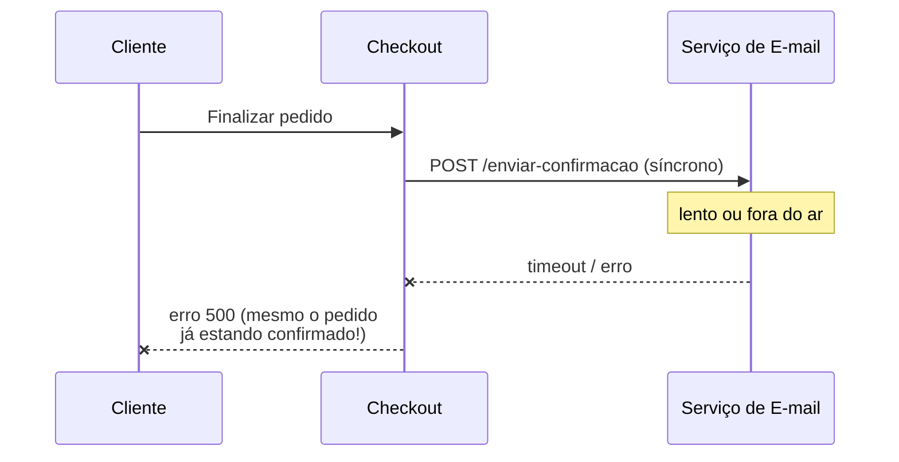
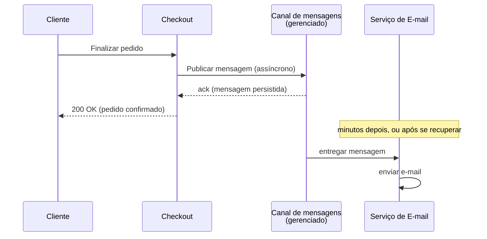
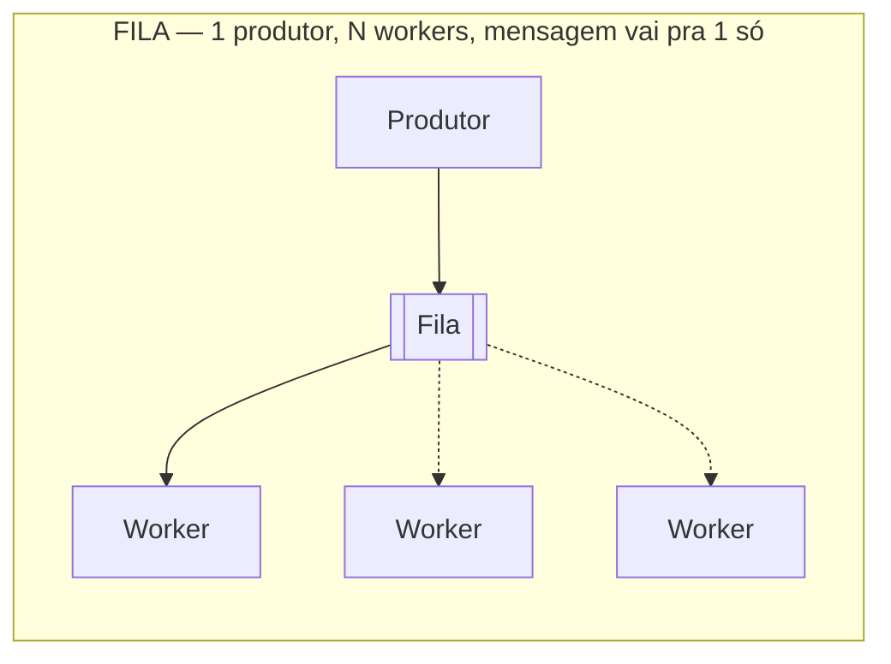
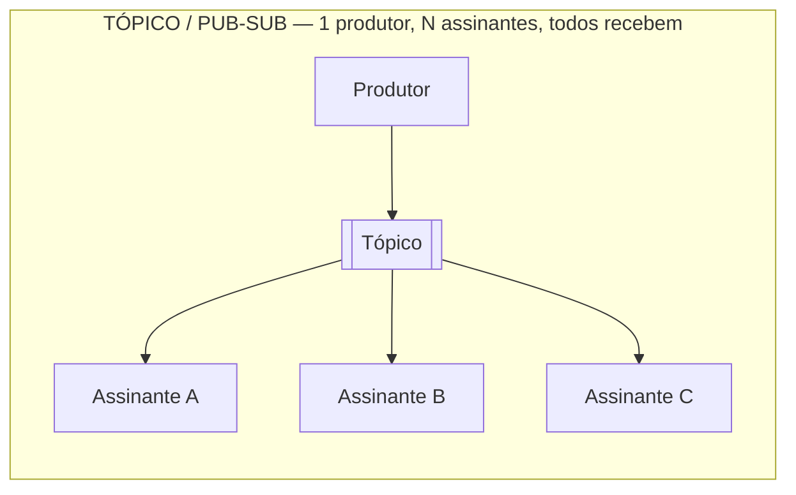
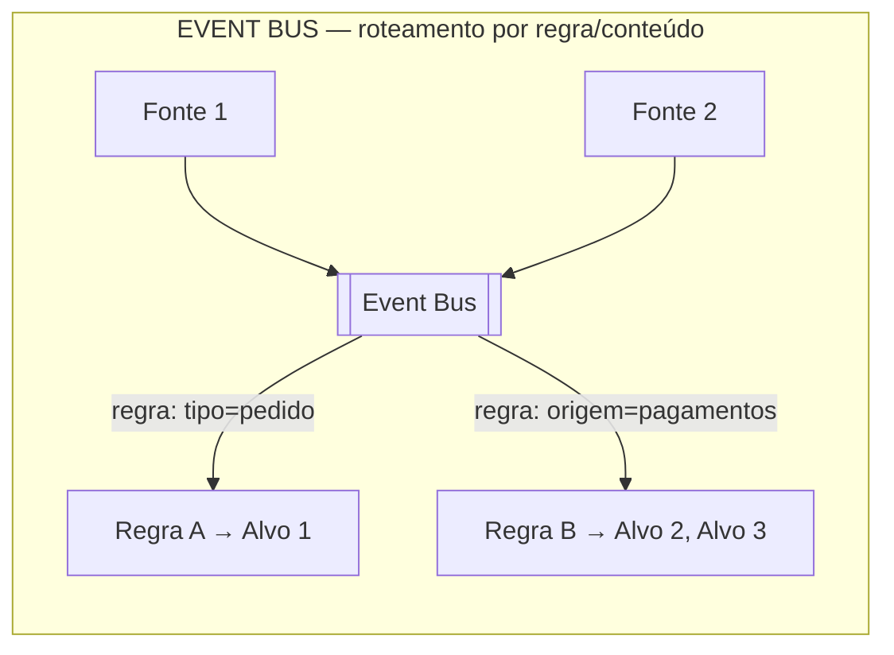

> [!abstract] TL;DR
> Quando o serviço A chama o serviço B diretamente (HTTP síncrono), a saúde de A fica refém da saúde de B — se B cai ou fica lento, A trava junto. Mensageria quebra essa corrente: A deixa uma mensagem em algum lugar durável e segue em frente; B processa quando puder. Na nuvem, esse "algum lugar" é um serviço gerenciado — fila (SQS), tópico pub/sub (SNS) ou barramento de eventos (EventBridge) — e você para de operar broker pra focar em desenhar o fluxo.

## O problema: A chama B, B cai, A cai junto

Imagine um e-commerce simples. O serviço de **Checkout** finaliza um pedido e, no mesmo request, chama o serviço de **Envio de E-mail** pra mandar a confirmação. Chamada HTTP direta, síncrona: Checkout espera a resposta de E-mail antes de devolver "pedido confirmado" pro cliente.

Funciona bem — até o dia em que o serviço de E-mail fica lento (um provedor de terceiros degradado, por exemplo) ou cai de vez. Nesse momento, toda finalização de pedido trava esperando uma resposta que não vem. O Checkout, que não tem nada a ver com o problema de e-mail, começa a acumular requisições penduradas, esgota o pool de conexões, e o site inteiro para. Uma falha pontual e periférica (envio de e-mail) virou uma indisponibilidade central (checkout fora do ar).

Esse é o **acoplamento síncrono**: quando A depende da disponibilidade *imediata* de B pra terminar seu próprio trabalho, a confiabilidade do sistema todo vira o produto das confiabilidades de cada elo — e cai em cascata.

Repare no absurdo: o pedido *foi* confirmado — o problema está inteiramente em um efeito colateral (mandar um e-mail). Mas como a chamada é síncrona, esse efeito colateral vira bloqueante. É esse tipo de acoplamento desnecessário que a mensageria existe pra resolver.

> [!info] Isso já é teoria de arquitetura, não exclusividade de cloud
> O padrão "publicar mensagem em vez de chamar direto" é um princípio de design de sistemas distribuídos, coberto a fundo em [[03-Dominios/Engenharia/Comunicação entre Sistemas/index|Comunicação entre Sistemas]] (comunicação síncrona vs. assíncrona, filas, pub/sub, event-driven). Esta nota — e o galho inteiro — não reensina essa teoria: assume que você já sabe o que é uma fila e foca em como esses conceitos ganham corpo como **serviços gerenciados** na AWS e na DigitalOcean.

## Assíncrono: A larga a mensagem e segue

A alternativa é o Checkout, em vez de chamar E-mail diretamente, **publicar uma mensagem** ("pedido 4471 confirmado, mandar e-mail de confirmação") em algum canal intermediário durável, e devolver sucesso pro cliente imediatamente. O serviço de E-mail consome essa mensagem quando estiver disponível — em 200ms, em 2 segundos, ou em 3 minutos se estiver se recuperando de um incidente. Do ponto de vista do Checkout, não importa: a mensagem está guardada, esperando.

Esse desenho compra três coisas que o modelo síncrono não dá de graça:

- **Desacoplamento no tempo** — o produtor e o consumidor não precisam estar disponíveis ao mesmo tempo. Um pode estar de pé enquanto o outro está em deploy, reiniciando, ou temporariamente fora.
- **Buffer / absorção de pico** — se chegam 10 mil pedidos num minuto de Black Friday, mas o serviço de e-mail só processa 500/minuto, a fila absorve a diferença. O consumidor drena no seu próprio ritmo, sem cair, sem descartar trabalho.
- **Resiliência a falha parcial** — a falha de um consumidor down-stream vira, na pior das hipóteses, um atraso na entrega da mensagem (que fica retida no canal até o consumidor voltar), não uma falha em cascata que arrasta o resto do sistema.

O preço que se paga é consistência eventual: o e-mail não sai no mesmo milissegundo que o pedido foi confirmado. Pra a maioria dos efeitos colaterais (notificação, atualização de índice de busca, geração de relatório, disparo de webhook), esse preço é baixíssimo perto do ganho em resiliência.

## Três sabores conceituais, um problema cada

"Mensageria" não é uma coisa só. Existem três formas geométricas diferentes de mover uma mensagem de quem produz pra quem consome, e cada provedor de nuvem tem um serviço gerenciado pra cada uma. Esta nota é o panorama; as próximas três notas do galho mergulham em cada serviço a fundo.

**Fila (trabalho distribuído).** Um produtor publica, e a mensagem é entregue a **exatamente um** consumidor dentre um grupo de workers — o modelo clássico de fila de trabalho. Se você tem 5 workers processando pedidos de uma fila, cada pedido é pego por um único worker; os outros quatro pegam os próximos. É o padrão certo quando o objetivo é distribuir carga de trabalho e garantir que cada item seja processado uma vez. Na AWS, isso é o **SQS** (Simple Queue Service) — coberto na nota 02 deste galho.

**Tópico / pub-sub (fan-out).** Um produtor publica em um tópico, e **todo assinante** recebe uma cópia da mensagem — não é rateio de trabalho, é replicação. É o padrão certo quando vários sistemas independentes precisam saber do mesmo evento sem que o produtor precise conhecer quem são (ex.: "pedido confirmado" dispara e-mail, atualização de estoque e log de analytics, três sistemas diferentes, três cópias da mesma notificação). Na AWS, isso é o **SNS** (Simple Notification Service) — nota 03.

**Event bus (roteamento por conteúdo).** Múltiplas fontes publicam eventos num barramento central, e regras de roteamento decidem, com base no *conteúdo* do evento (tipo, origem, campos do payload), pra quais alvos cada evento vai — potencialmente alvos diferentes pra eventos diferentes vindos da mesma fonte. É o modelo mais rico dos três: junta ingestão de múltiplas fontes, filtragem por regra e até transformação do evento antes da entrega. Na AWS, isso é o **EventBridge** — nota 04.

A distinção importa porque escolher o sabor errado custa caro depois. Usar um tópico pub/sub quando você precisava de fila de trabalho gera processamento duplicado (todo assinante processa tudo). Usar fila quando você precisava de fan-out obriga a criar N filas manualmente e replicar a publicação N vezes. A nota 06 (capstone do galho) volta a esse critério de escolha com mais profundidade — depois que você já viu os três serviços por dentro.

## O que "gerenciado" tira do seu prato

Antes de existir SQS, SNS e EventBridge como serviços, times que queriam esse desacoplamento tinham que **operar o próprio broker** — instalar e manter um RabbitMQ, um ActiveMQ, ou (mais recentemente) um cluster Kafka self-hosted. Isso significa: provisionar VMs ou containers, configurar clustering pra alta disponibilidade, gerenciar réplicas e partições, aplicar patches de segurança, monitorar disco (uma fila cheia que não é drenada enche o disco do broker), planejar capacidade pra picos, e ter um plano de disaster recovery se o broker inteiro cair.

"Gerenciado" significa que o provedor de nuvem assume essa operação: você não vê VM, não aplica patch, não configura replicação de partição. Você chama uma API (`SendMessage`, `Publish`, `PutEvents`) e o serviço garante durabilidade (a mensagem sobrevive a falhas de hardware), escala automaticamente (não existe "cluster pequeno demais pro pico de Black Friday" — o serviço escala por trás da API) e entrega com as garantias documentadas (at-least-once na maioria dos casos, exactly-once em modos específicos).

O trade-off, como em todo serviço gerenciado, é liberdade de configuração fina e portabilidade: você ganha operação zero, mas fica dentro do modelo de dados e das garantias que o serviço oferece — não é um Kafka completo com todo o controle de partição e replay que ele permite.

> [!info] Verificado 2026-07-24 — SQS retenção de mensagem
> O período padrão de retenção de mensagens no SQS é 4 dias, configurável de 60 segundos a 14 dias (1.209.600 segundos). Fonte: [SQS Developer Guide](https://docs.aws.amazon.com/AWSSimpleQueueService/latest/SQSDeveloperGuide/welcome.html). Confira antes de depender desse número em produção — limites de serviço mudam.

## A lente dupla: AWS tem o catálogo, DigitalOcean não tem paridade

Aqui a bifurcação entre os dois provedores que este galho segue é mais aguda do que em qualquer galho anterior da trilha.

**AWS** tem um catálogo de mensageria rico e propositalmente segmentado: SQS pra filas, SNS pra pub/sub, EventBridge pra roteamento por evento, e ainda Amazon MQ pra quem migra de um broker tradicional (RabbitMQ/ActiveMQ) e precisa de protocolos como AMQP ou JMS. A [documentação oficial da AWS](https://docs.aws.amazon.com/AWSSimpleQueueService/latest/SQSDeveloperGuide/welcome.html) é explícita sobre a diferença: SQS decopla componentes como serviço de fila (tipicamente um único consumidor por mensagem), SNS distribui mensagens de publishers pra múltiplos subscribers através de tópicos, e Amazon MQ existe pra compatibilidade com brokers tradicionais que falam AMQP, MQTT ou STOMP.

**DigitalOcean não tem um SQS, um SNS ou um EventBridge.** Não existe, no catálogo da DO, um serviço de fila gerenciada nem um serviço de pub/sub gerenciado com o mesmo desenho de "chame uma API, esqueça o broker". O que a DigitalOcean oferece de mais próximo é:

- **Managed Kafka**, que vive dentro da família de **Managed Databases** da DO — ou seja, é tratado como um motor de banco gerenciado (ao lado de PostgreSQL, MySQL, Redis/Valkey, MongoDB, OpenSearch), não como um produto de mensageria dedicado. Ele te dá um cluster Kafka operado pela DO — sem VM pra você provisionar, com criptografia, controle de acesso, autoescala de armazenamento e schema registry — mas você ainda projeta tópicos, partições e consumer groups como faria com Kafka on-prem. É poder bruto de streaming de eventos, não um serviço de fila de alto nível como o SQS.
- **Functions**, que pode reagir a triggers (incluindo, com integração, tópicos do próprio Managed Kafka) pra compor um fluxo evento→função, mas sem o roteamento por regra de conteúdo que o EventBridge oferece nativamente.

Isso não é uma lacuna cosmética: se sua arquitetura depende de fan-out simples via pub/sub (tipo SNS) ou de um event bus com filtragem por regra (tipo EventBridge), rodar isso na DigitalOcean significa **construir a peça você mesmo** em cima do Kafka gerenciado (tópicos + lógica de roteamento em código) ou aceitar rodar um broker adicional por conta própria. Não existe atalho gerenciado equivalente — e é importante não fingir que existe.

> [!warning] Não force uma equivalência que não existe
> É tentador, ao comparar AWS e DigitalOcean serviço a serviço, procurar "o SQS da DO" ou "o SNS da DO". Não existe. O erro mais caro nessa área não é técnico, é de expectativa: times que migram de AWS pra DigitalOcean assumindo que vão trocar SQS por "algo equivalente mais barato" descobrem tarde demais que precisam desenhar a camada de mensageria do zero em cima do Kafka gerenciado — um investimento de arquitetura bem maior do que apontar o SDK pra um endpoint diferente.

## Panorama de tradução: Azure e GCP

Só pra fixar o vocabulário — sem detalhamento hands-on, que foge do escopo desta trilha:

| Conceito | AWS | Azure | GCP |
|---|---|---|---|
| Fila gerenciada | SQS | Storage Queues / Service Bus Queues | Cloud Tasks |
| Pub/Sub (tópico, fan-out) | SNS | Service Bus Topics | Pub/Sub |
| Event bus (roteamento por regra) | EventBridge | Event Grid | Eventarc |
| Broker compatível com AMQP/JMS | Amazon MQ | Service Bus (Premium) | — (usar broker self-managed) |
| Streaming de eventos (Kafka-like) | Amazon MSK | Event Hubs | Pub/Sub + Dataflow |

Repare que o Azure, assim como a AWS, segmenta claramente fila (Storage Queues, mais simples) de pub/sub rico (Service Bus Topics) de roteamento por evento (Event Grid) — um desenho mais próximo do catálogo da AWS do que do minimalismo da DigitalOcean. O GCP concentra fila e pub/sub numa família só (Cloud Tasks pra fila ponto-a-ponto, Pub/Sub pra fan-out), com Eventarc cuidando do roteamento por evento entre serviços do Google Cloud.

> [!tip] Assista: Synchronous and Asynchronous Communication between Microservices
> **Canal:** Arpit Bhayani | **Duração:** ~40min | **Idioma:** EN
>
> Arpit Bhayani (educador de sistemas distribuídos) disseca por que uma cadeia de chamadas síncronas empilha tempo de bloqueio em cada nível e pode estourar timeout de rede — o mesmo mecanismo do cenário Checkout→E-mail desta nota, só que generalizado pra qualquer cadeia de serviços.
> Trecho de destaque [10:03]: *"there are lots of problems when you have a large chain of synchronous communication and most of them arise because the call is blocking"*
>
> 🎬 [Assistir no YouTube](https://www.youtube.com/watch?v=ewUw0sUxHI4)

## O que vem a seguir

A próxima nota deste galho mergulha na **fila gerenciada da AWS a fundo**: como o SQS modela mensagem, visibility timeout, dead-letter queue, a diferença entre fila standard e FIFO, e como isso se compara (e não se compara) ao que a DigitalOcean oferece via Kafka. Depois vêm SNS e pub/sub, EventBridge e o event bus, os padrões de arquitetura event-driven que esses serviços habilitam, e por fim o capstone do galho — o critério pra escolher qual serviço usar (ou combinar) em cada situação.

Se você quer revisitar por que "assíncrono" resolve o problema de acoplamento antes de ver isso encarnado em serviço da AWS, [[03-Dominios/Tecnologia/Cloud/11 - Serverless e FaaS — Lambda a fundo/03 - O modelo de eventos: triggers e integrações|a nota sobre o modelo de eventos do galho 11]] já tocou SQS, SNS e EventBridge como fontes de evento que disparam Lambda — essa nota olhava de fora pra dentro (como consumir um evento). Este galho olha de dentro: como cada um desses serviços funciona por si.

## Fontes

- [Amazon SQS — What is Amazon Simple Queue Service?](https://docs.aws.amazon.com/AWSSimpleQueueService/latest/SQSDeveloperGuide/welcome.html)
- [Amazon SNS — What is Amazon SNS?](https://docs.aws.amazon.com/sns/latest/dg/welcome.html)
- [Amazon EventBridge — What Is Amazon EventBridge?](https://docs.aws.amazon.com/eventbridge/latest/userguide/eb-what-is.html)
- [DigitalOcean — Managed Kafka](https://docs.digitalocean.com/products/databases/kafka/)
- [AWS — Amazon MQ](https://aws.amazon.com/amazon-mq/)
