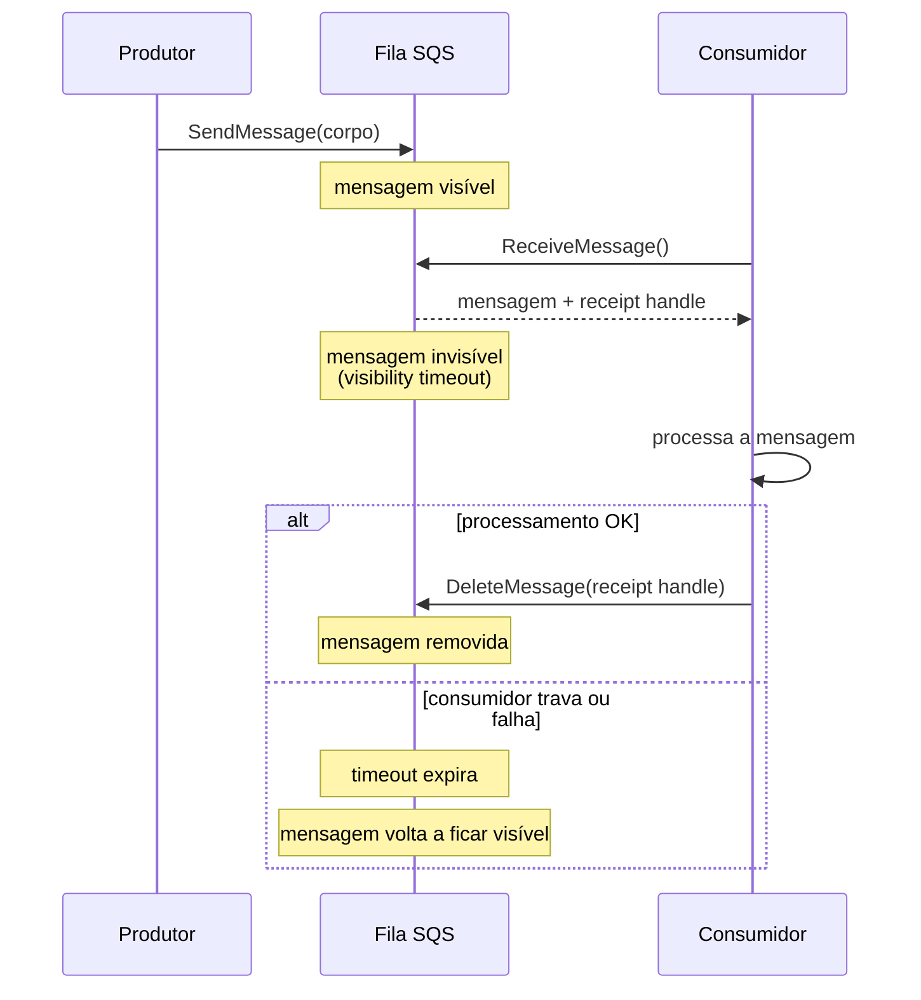
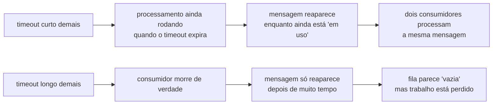
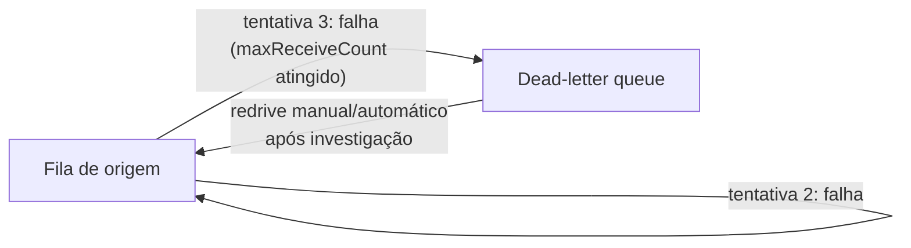

> [!abstract] TL;DR
> SQS é uma fila gerenciada: produtores enviam mensagens, consumidores puxam (poll), processam e deletam. O contrato é **at-least-once** — a mensagem pode chegar duplicada, então idempotência é responsabilidade sua. Duas variantes: **Standard** (throughput altíssimo, ordem best-effort) e **FIFO** (ordem exata por `MessageGroupId`, exactly-once processing, throughput limitado por partição). O mecanismo central é o **visibility timeout**: a mensagem some da fila enquanto é processada e volta se não for deletada a tempo — é assim que o SQS lida com consumidores que travam ou morrem. Mensagens que falham repetidas vezes vão para uma **dead-letter queue** via `maxReceiveCount`, em vez de travar a fila pra sempre. A DigitalOcean não tem um SQS-like: o parente mais próximo é o Managed Kafka, com um modelo bem diferente.

## O problema: quem segura a mensagem enquanto alguém trabalha nela?

Imagine uma fila de atendimento num banco. Você tira uma senha, senta, e espera ser chamado. Enquanto o caixa 3 está atendendo você, ele não pode atender outra pessoa — mas a fila continua avançando pros outros. Se o caixa 3 tiver um troço e sumir no meio do atendimento, alguém precisa perceber que sua senha "travou" e te devolver pra fila, ou você fica esperando pra sempre.

Uma fila de mensagens distribuída tem exatamente esse problema, multiplicado por milhares de "caixas" (consumidores) processando em paralelo. Se dois consumidores pegarem a mesma mensagem ao mesmo tempo, ela é processada duas vezes — inconsistência. Se um consumidor pegar a mensagem e cair antes de terminar, a mensagem precisa reaparecer pra outro consumidor pegar — senão ela se perde pra sempre.

Você já viu esse problema de outro ângulo: [[03-Dominios/Tecnologia/Cloud/11 - Serverless e FaaS — Lambda a fundo/03 - O modelo de eventos: triggers e integrações|o modelo de eventos]] do Lambda trata o SQS como *fonte* de eventos — o Lambda faz polling da fila e invoca sua função pra cada lote de mensagens. Esta nota abre o SQS *por dentro*: o que acontece entre "a mensagem está na fila" e "a mensagem foi processada com sucesso", e como o serviço gerenciado resolve os dois problemas acima sem você escrever nenhum código de coordenação.

A resposta da AWS é um contrato de **pull** (o consumidor pede mensagens, a fila não empurra nada pra ninguém) combinado com um cronômetro por mensagem: o **visibility timeout**.

## Anatomia de uma fila SQS

Uma fila SQS é um buffer durável e gerenciado. Produtores chamam `SendMessage`, consumidores chamam `ReceiveMessage` — que **não remove** a mensagem, só a torna invisível por um tempo — e, ao terminar o processamento com sucesso, chamam `DeleteMessage` explicitamente, usando o *receipt handle* recebido junto com a mensagem.



Repare que **nada** nesse fluxo garante que a mensagem só será processada uma vez. Se o consumidor processar a mensagem com sucesso mas cair *antes* de chamar `DeleteMessage`, o timeout expira, a mensagem volta pra fila, e outro consumidor a processa de novo. Isso é a garantia **at-least-once**: pelo menos uma vez, possivelmente mais. O SQS Standard não tem como evitar isso — é o preço do throughput quase ilimitado. Guarde essa ideia; ela volta na seção sobre idempotência.

## Visibility timeout: o coração do mecanismo

O visibility timeout é quanto tempo uma mensagem fica invisível depois de um `ReceiveMessage`, antes de reaparecer automaticamente na fila. O padrão é **30 segundos**, o mínimo é **0 segundos** e o máximo é **12 horas**.

> [!info] Verificado 2026-07-24 na documentação oficial (`sqs-limits`/`quotas-messages`). Valores de quota da AWS mudam raramente, mas confira antes de dimensionar produção.

A regra prática: **o visibility timeout precisa ser maior que o tempo de processamento esperado**, com folga. Se seu consumidor normalmente leva 20 segundos pra processar uma mensagem mas o timeout está em 30 segundos, uma variação de carga (um pico, um GC pause, uma dependência lenta) faz o timeout expirar *antes* do processamento terminar — e a mesma mensagem é entregue a um segundo consumidor enquanto o primeiro ainda trabalha nela. Resultado: processamento duplicado, na cara dura, mesmo sem nenhuma falha real.



Se o processamento pode variar bastante (por exemplo, uma chamada a uma API externa com latência instável), o SQS oferece `ChangeMessageVisibility`: o próprio consumidor estende o timeout de uma mensagem específica enquanto ainda está trabalhando nela, em vez de você chutar um timeout fixo generoso demais pro caso comum. É o equivalente a avisar "ainda estou aqui, não me tire da mesa" no meio do atendimento.

## Long polling vs short polling

Quando um consumidor chama `ReceiveMessage` e a fila está vazia, o que acontece? Duas opções:

- **Short polling** (`WaitTimeSeconds=0`, o padrão histórico): a chamada retorna *imediatamente*, mesmo que não haja mensagem. Se você faz polling em loop apertado, gasta uma chamada de API por "não, não tem nada" — e paga por cada uma.
- **Long polling** (`WaitTimeSeconds` de 1 a 20): a chamada **espera** até 20 segundos por uma mensagem chegar antes de retornar vazia. Se uma mensagem chega no meio da espera, a chamada retorna na hora.

Long polling é quase sempre a escolha certa: reduz o número de chamadas vazias (menos custo, já que SQS cobra por requisição), reduz a latência média de entrega comparado a um short-poll espaçado, e some com o "efeito sanfona" de um consumidor batendo na API em loop tight. A única razão pra usar short polling é quando você precisa de resposta imediata mesmo vazia — raro na prática.

## Standard vs FIFO: dois contratos diferentes

| Característica | Standard | FIFO |
|---|---|---|
| Ordem | Best-effort (pode chegar fora de ordem) | Exata, por `MessageGroupId` |
| Duplicação | At-least-once (duplicatas possíveis) | Exactly-once processing (dedupe de 5 min) |
| Throughput por partição | Praticamente ilimitado | 300 msg/s sem batching, 3.000 msg/s com batching (modo alto throughput) |
| Sufixo do nome da fila | livre | obrigatório `.fifo` |
| `MessageGroupId` | opcional (ativa *fair queues*) | obrigatório |
| Caso de uso típico | logs, notificações, jobs independentes | pedidos de um mesmo cliente, transições de estado, eventos que dependem de ordem |

A fila **FIFO** garante ordem *dentro do mesmo* `MessageGroupId` — mensagens de grupos diferentes podem intercalar livremente, o que é o que permite escalar horizontalmente sem quebrar a promessa de ordem. Internamente, cada `MessageGroupId` é roteado (via hash) pra uma partição, e cada partição sustenta até 3.000 msg/s com batching ou 300 msg/s sem batching — por isso "throughput limitado" não quer dizer "lento", quer dizer "seu paralelismo depende de quantos grupos distintos você usa".

> [!info] Verificado 2026-07-24 na documentação oficial ("Partitions and data distribution for high throughput for SQS FIFO queues"): 300 msg/s sem batching e 3.000 msg/s com batching, por partição, em regiões suportadas. Confira antes de dimensionar capacidade real.

"Exactly-once processing" no FIFO não é mágica distribuída — é uma janela de deduplicação de 5 minutos baseada em `MessageDeduplicationId` (explícito) ou num hash do corpo da mensagem (dedupe baseado em conteúdo, ativado com `ContentBasedDeduplication: true`). Se você reenviar a mesma mensagem dentro dessa janela, o SQS descarta o duplicado silenciosamente, sem entregá-lo a nenhum consumidor. Fora da janela, a garantia não vale mais — é uma proteção contra retry do produtor, não uma garantia global de unicidade eterna.

### Um caso prático: por que escolher errado dói

Pense num sistema de e-commerce com uma fila `atualizacoes-estoque`. Cada evento é "produto X teve o estoque decrementado em N unidades". Se você usa **Standard**, dois eventos do mesmo produto podem ser processados fora de ordem — um consumidor aplica "decrementa 3" antes de "decrementa 5" que foi enviado primeiro, e o estoque final fica sujeito a *race* se os handlers não forem cuidadosos (ex.: usar incremento atômico no banco em vez de "ler, calcular, escrever"). Na prática, muita gente usa Standard aqui e absorve o risco porque os handlers já são idempotentes e comutativos (decrementos são comutativos entre si, desde que atômicos).

Já numa fila `transicoes-pedido` — "pedido criado" → "pagamento aprovado" → "pedido enviado" — a ordem *importa de verdade*: processar "enviado" antes de "pagamento aprovado" é um bug de negócio, não só uma curiosidade. Aqui, FIFO com `MessageGroupId = pedidoId` é a escolha certa: garante que as transições de um mesmo pedido chegam na ordem em que foram enviadas, enquanto pedidos diferentes continuam sendo processados em paralelo (grupos diferentes, partições diferentes).

## Dead-letter queue: onde vão as mensagens venenosas

Uma **dead-letter queue** (DLQ) é uma fila SQS comum que você configura como destino de mensagens que falharam repetidamente na fila de origem. A ligação é feita por uma **redrive policy**, que define o `maxReceiveCount`: quantas vezes uma mensagem pode ser recebida (não deletada) antes de ser desviada pra DLQ.



Sem DLQ, uma mensagem "venenosa" — que sempre causa exceção no consumidor, por exemplo um payload malformado — fica reaparecendo pra sempre depois de cada visibility timeout, sendo reprocessada (e falhando) indefinidamente. Isso consome capacidade de processamento sem produzir nenhum progresso, e mistura ruído com mensagens saudáveis na mesma fila. A DLQ isola essas mensagens pra você investigar depois, sem bloquear o fluxo normal.

Duas regras que vale ter em mente:
- A DLQ **precisa existir antes** de ser referenciada na redrive policy, e precisa estar na mesma conta e região da fila de origem.
- Para filas Standard, se `maxReceiveCount` for maior que 3, uma mensagem recebida 3+ vezes sem ser deletada é movida pro *fim* da fila de origem (não pra DLQ ainda) — só quando o `maxReceiveCount` de fato é atingido ela vai pra DLQ.
- Em filas **FIFO**, usar DLQ quebra a ordem exata (a mensagem desviada sai da sequência) — a documentação da AWS recomenda cautela quando a ordem importa mais que a resiliência a falhas.

### Redrive: trazendo mensagens de volta

Depois de investigar por que as mensagens foram parar na DLQ (um bug no consumidor, um payload malformado, uma dependência externa fora do ar), você normalmente quer reprocessá-las — seja porque corrigiu o bug, seja porque a dependência voltou. O SQS suporta isso nativamente via **redrive de DLQ**, tanto no console quanto pela API (`StartMessageMoveTask`), sem você precisar escrever um script que faz `receive` na DLQ e `send` na fila original mensagem por mensagem:

```bash
aws sqs start-message-move-task \
  --source-arn arn:aws:sqs:us-east-1:123456789012:pedidos-processamento-dlq \
  --destination-arn arn:aws:sqs:us-east-1:123456789012:pedidos-processamento
```

Isso move as mensagens de volta em lote, respeitando a ordem de chegada na DLQ. É a diferença entre "a DLQ é uma gaveta de mensagens perdidas pra sempre" e "a DLQ é uma área de quarentena temporária" — o segundo é o uso pretendido.

## Retenção, delays e tamanho de mensagem

Além do ciclo receive/delete, a fila tem parâmetros de configuração que moldam seu comportamento:

- **Message retention period**: quanto tempo uma mensagem não deletada fica na fila antes de ser descartada automaticamente. Padrão de **4 dias**, configurável de 60 segundos até **14 dias** no máximo.
- **Delay queues**: um atraso (`DelaySeconds`, de 0 a **15 minutos**) aplicado a *todas* as mensagens da fila entre `SendMessage` e a mensagem ficar visível — útil pra dar tempo de um processo assíncrono relacionado terminar antes do consumo começar.
- **Tamanho de mensagem**: o corpo de uma mensagem SQS vai de 1 byte até **1.048.576 bytes (1 MiB)**. Pra payloads maiores, a *Amazon SQS Extended Client Library* (Java e Python) armazena o corpo real no S3 e manda só uma referência pela fila — o limite prático sobe pra 2 GB por mensagem.

> [!info] Verificado 2026-07-24 na documentação oficial ("Amazon SQS message quotas"). O tamanho máximo de mensagem já foi historicamente citado como 256 KB em material mais antigo — a doc atual da AWS lista 1 MiB (1.048.576 bytes) como limite padrão. Confira a página oficial antes de basear uma decisão de arquitetura nesse número.

- **Batching**: `SendMessageBatch`, `ReceiveMessage` (via `MaxNumberOfMessages`) e `DeleteMessageBatch` processam até **10 mensagens** por chamada, reduzindo o número de requisições de API — e, por tabela, o custo, já que o SQS cobra por requisição (não por mensagem). Um consumidor que faz `ReceiveMessage` mensagem a mensagem, em vez de puxar lotes de 10, paga até 10x mais requisições pro mesmo volume de trabalho — é a otimização de custo mais barata (e mais esquecida) do SQS.
- **Message attributes**: além do corpo, cada mensagem aceita até 10 atributos de metadado (`MessageAttributes`) — pares chave/valor tipados, úteis pra roteamento ou filtragem sem precisar desserializar o corpo inteiro:

```bash
aws sqs send-message \
  --queue-url https://sqs.us-east-1.amazonaws.com/123456789012/pedidos-processamento \
  --message-body '{"pedidoId": "abc123"}' \
  --message-attributes '{
    "TipoEvento": {"DataType": "String", "StringValue": "pagamento_aprovado"},
    "Prioridade": {"DataType": "Number", "StringValue": "1"}
  }'
```

## At-least-once: idempotência é sua, não do SQS

Vale repetir com todas as letras: **SQS Standard não garante entrega única**. Duplicação pode acontecer por várias razões — visibility timeout curto demais, retry do produtor após timeout de rede (a mensagem pode já ter sido recebida do outro lado), ou falhas parciais durante o `DeleteMessage`. O serviço garante que a mensagem *não se perde*; ele não garante que ela chega exatamente uma vez (isso só o FIFO tenta, e só dentro de uma janela de 5 minutos).

Na prática, isso empurra a responsabilidade de idempotência pro consumidor: processar a mesma mensagem duas vezes precisa produzir o mesmo resultado que processá-la uma vez. As táticas mais comuns:

- Chave de idempotência no payload da mensagem (um `orderId`, um `eventId`) verificada contra um registro antes de aplicar o efeito.
- Operações naturalmente idempotentes (`UPDATE ... SET status = 'paid' WHERE id = X` é seguro repetir; `INSERT` sem checagem de unicidade, não).
- Um "outbox" ou tabela de deduplicação com TTL, quando o efeito não é naturalmente idempotente (ex.: cobrar um cartão).

Isso não é peculiaridade do SQS — é uma consequência estrutural de qualquer sistema at-least-once distribuído. O SQS só torna o trade-off explícito em vez de fingir uma garantia que sistemas distribuídos não conseguem dar de graça.

Um esqueleto de idempotência do lado do consumidor, em Python com boto3, fica assim:

```python
import boto3

sqs = boto3.client("sqs")
QUEUE_URL = "https://sqs.us-east-1.amazonaws.com/123456789012/pedidos-processamento"

def ja_processado(evento_id: str) -> bool:
    # checagem contra uma tabela de deduplicação (DynamoDB, Redis, etc.)
    # com TTL maior que a retention period da fila
    ...

def processar(mensagem: dict) -> None:
    corpo = mensagem["Body"]
    evento_id = extrair_evento_id(corpo)

    if ja_processado(evento_id):
        return  # duplicata: no-op, mas ainda deleta a mensagem abaixo

    aplicar_efeito(corpo)
    registrar_processado(evento_id)

resposta = sqs.receive_message(
    QueueUrl=QUEUE_URL,
    MaxNumberOfMessages=10,
    WaitTimeSeconds=20,
    VisibilityTimeout=60,
)

for msg in resposta.get("Messages", []):
    processar(msg)
    # só deleta DEPOIS de confirmar sucesso (ou duplicata já tratada)
    sqs.delete_message(QueueUrl=QUEUE_URL, ReceiptHandle=msg["ReceiptHandle"])
```

O ponto central: o `delete_message` só acontece depois que o efeito é aplicado (ou identificado como duplicata) — nunca antes. Deletar cedo demais é como dar baixa numa senha antes do caixa terminar de atender: se o processo cair no meio, a mensagem já era, sem ter sido de fato processada.

## Código: o ciclo completo

```bash
# Cria uma fila standard
aws sqs create-queue --queue-name pedidos-processamento

# Cria a dead-letter queue primeiro
aws sqs create-queue --queue-name pedidos-processamento-dlq
```

```bash
# Configura a redrive policy na fila de origem, apontando pra DLQ
aws sqs set-queue-attributes \
  --queue-url https://sqs.us-east-1.amazonaws.com/123456789012/pedidos-processamento \
  --attributes '{
    "RedrivePolicy": "{\"deadLetterTargetArn\":\"arn:aws:sqs:us-east-1:123456789012:pedidos-processamento-dlq\",\"maxReceiveCount\":\"5\"}"
  }'
```

```bash
# Envia uma mensagem
aws sqs send-message \
  --queue-url https://sqs.us-east-1.amazonaws.com/123456789012/pedidos-processamento \
  --message-body '{"pedidoId": "abc123", "acao": "processar_pagamento"}'
```

```bash
# Recebe com long polling (espera até 20s por mensagem) e visibility timeout de 60s
aws sqs receive-message \
  --queue-url https://sqs.us-east-1.amazonaws.com/123456789012/pedidos-processamento \
  --wait-time-seconds 20 \
  --visibility-timeout 60 \
  --max-number-of-messages 10
```

```bash
# Deleta após processar com sucesso, usando o receipt handle retornado acima
aws sqs delete-message \
  --queue-url https://sqs.us-east-1.amazonaws.com/123456789012/pedidos-processamento \
  --receipt-handle "AQEB...handle-recebido-no-receive..."
```

Uma fila FIFO exige o sufixo `.fifo` no nome e um `MessageGroupId` em cada mensagem:

```bash
aws sqs create-queue \
  --queue-name pedidos-cliente.fifo \
  --attributes '{"FifoQueue":"true","ContentBasedDeduplication":"true"}'

aws sqs send-message \
  --queue-url https://sqs.us-east-1.amazonaws.com/123456789012/pedidos-cliente.fifo \
  --message-body '{"pedidoId": "abc123", "status": "criado"}' \
  --message-group-id "cliente-789"
```

E, fechando a ponte com o galho de serverless, o Lambda consome SQS via *event source mapping* — o próprio Lambda faz o polling (long polling, internamente) e invoca sua função com um lote de mensagens; se a função levantar exceção, o Lambda devolve o lote (ou as mensagens individuais, com *partial batch response*) pra fila, e o `maxReceiveCount`/DLQ da fila entram em ação normalmente:

```bash
aws lambda create-event-source-mapping \
  --function-name processar-pedido \
  --event-source-arn arn:aws:sqs:us-east-1:123456789012:pedidos-processamento \
  --batch-size 10
```

> [!warning] Armadilhas comuns
> - **Visibility timeout menor que o tempo de processamento**: a causa mais comum de duplicação "misteriosa". Meça o P99 do seu processamento, não a média, e dê folga.
> - **Não deletar a mensagem em caso de sucesso parcial num lote**: se você processa 10 mensagens de um `ReceiveMessage` mas só deleta as que deram certo, as que falharam voltam corretamente — mas se você deletar o lote inteiro "porque a maioria deu certo", perde silenciosamente as que falharam.
> - **DLQ sem retenção maior que a fila de origem**: se a DLQ tem retenção igual ou menor que a fila principal, uma mensagem pode expirar e sumir da DLQ antes de você conseguir investigá-la — a contagem de retenção da mensagem original *não reinicia* ao entrar na DLQ (em filas standard).
> - **Tratar SQS como se garantisse ordem**: só a fila FIFO garante ordem, e só dentro do mesmo `MessageGroupId`. Usar Standard e assumir ordem é bug esperando pra acontecer.
> - **Ignorar idempotência "porque é raro"**: duplicação em produção não é hipotética — é uma característica garantida do contrato at-least-once, não uma falha de borda.

## A lente dupla: SQS e a ausência de equivalente na DigitalOcean

Aqui a honestidade importa mais que a analogia. A AWS tem uma família inteira de serviços de mensageria gerenciada — SQS (fila), SNS (pub-sub), EventBridge (event bus) — cada um com um modelo de entrega e uma API dedicados. A DigitalOcean **não tem** um serviço equivalente a nenhum dos três. Não existe "DO Queue" nem "DO Pub/Sub" no catálogo gerenciado.

O que a DigitalOcean oferece de mais próximo é o **Managed Kafka**, listado entre os bancos gerenciados (não como "mensageria" separada): um cluster Kafka operado pela DO, com criação/gestão de tópicos, redimensionamento, schema registry e encaminhamento de logs. Mas o modelo é fundamentalmente diferente do SQS:

- Kafka é um **log de eventos append-only** com *offsets* que consumidores avançam por conta própria; SQS é uma **fila com visibility timeout** por mensagem individual.
- Kafka retém mensagens por um período configurável independente de consumo (várias aplicações podem reler o mesmo log); SQS remove a mensagem quando ela é deletada — uma vez consumida e confirmada, não existe mais.
- Kafka não tem o conceito de "esconder a mensagem enquanto processa e devolver se falhar" — quem controla isso é o consumidor, avançando (ou não) o offset.

Se seu caso de uso é "preciso de uma fila de trabalho gerenciada com retry automático e DLQ" e você está na DigitalOcean, a alternativa realista é montar isso você mesmo — um banco gerenciado (Postgres/Redis) como fila com lock otimista, ou uma função DO (Functions) lendo de um tópico Kafka e implementando visibility timeout na aplicação. Não existe atalho gerenciado equivalente; é importante nomear essa lacuna em vez de fingir paridade que não existe.

| Conceito | AWS | DigitalOcean |
|---|---|---|
| Fila gerenciada (SQS-like) | Amazon SQS | não existe |
| Pub-sub gerenciado (SNS-like) | Amazon SNS | não existe |
| Event bus gerenciado (EventBridge-like) | Amazon EventBridge | não existe |
| Streaming de eventos gerenciado | Amazon MSK (Kafka gerenciado) | DigitalOcean Managed Kafka |

## Tradução de nomes: Azure e GCP

| Conceito | AWS | Azure | GCP | DigitalOcean |
|---|---|---|---|---|
| Fila de mensagens | SQS | Azure Queue Storage / Service Bus Queues | Cloud Tasks / Pub/Sub (modo pull) | — |
| Pub-sub | SNS | Service Bus Topics / Event Grid | Pub/Sub | — |
| Event bus | EventBridge | Event Grid | Eventarc | — |
| Streaming (log de eventos) | MSK / Kinesis | Event Hubs | Pub/Sub (modo stream) / Dataflow | Managed Kafka |

## O que vem a seguir

O SQS resolve a comunicação **ponto a ponto**: um produtor, uma fila, um (ou mais) consumidores competindo pelas mesmas mensagens. Mas e quando você precisa que a *mesma* mensagem chegue a vários destinos independentes — um pedido criado que precisa notificar o time de estoque, o time de faturamento e o time de analytics, cada um sem saber da existência do outro? Esse é o problema do **pub-sub**, e a próxima nota deste galho abre o Amazon SNS: como ele resolve fan-out, e por que SNS e SQS costumam aparecer juntos (o padrão "fan-out SNS → múltiplas filas SQS") em vez de escolher um ou outro.

## Fontes

- [Amazon SQS quotas — SQS Developer Guide](https://docs.aws.amazon.com/AWSSimpleQueueService/latest/SQSDeveloperGuide/sqs-limits.html)
- [Amazon SQS message quotas](https://docs.aws.amazon.com/AWSSimpleQueueService/latest/SQSDeveloperGuide/quotas-messages.html)
- [Using dead-letter queues in Amazon SQS](https://docs.aws.amazon.com/AWSSimpleQueueService/latest/SQSDeveloperGuide/sqs-dead-letter-queues.html)
- [High throughput for FIFO queues in Amazon SQS](https://docs.aws.amazon.com/AWSSimpleQueueService/latest/SQSDeveloperGuide/high-throughput-fifo.html)
- [Amazon SQS FIFO queues](https://docs.aws.amazon.com/AWSSimpleQueueService/latest/SQSDeveloperGuide/sqs-fifo-queues.html)
- [Amazon SQS visibility timeout](https://docs.aws.amazon.com/AWSSimpleQueueService/latest/SQSDeveloperGuide/sqs-visibility-timeout.html)
- [DigitalOcean Managed Kafka documentation](https://docs.digitalocean.com/products/databases/kafka/)
- [AWS CLI reference: sqs](https://docs.aws.amazon.com/cli/latest/reference/sqs/)
