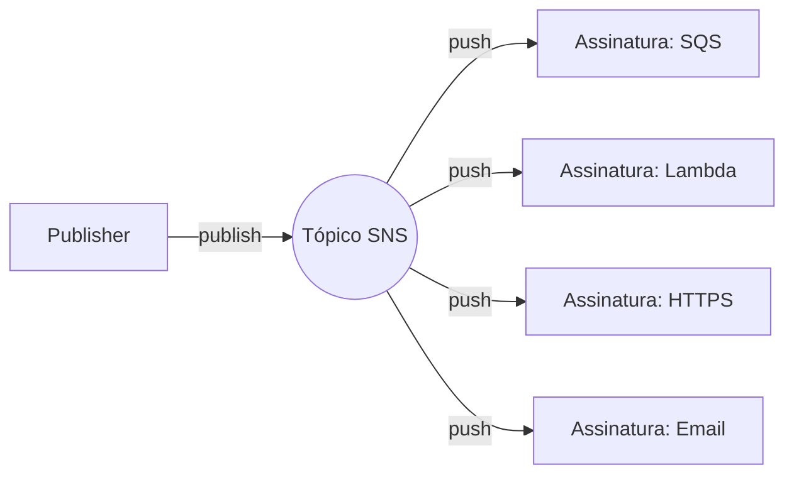
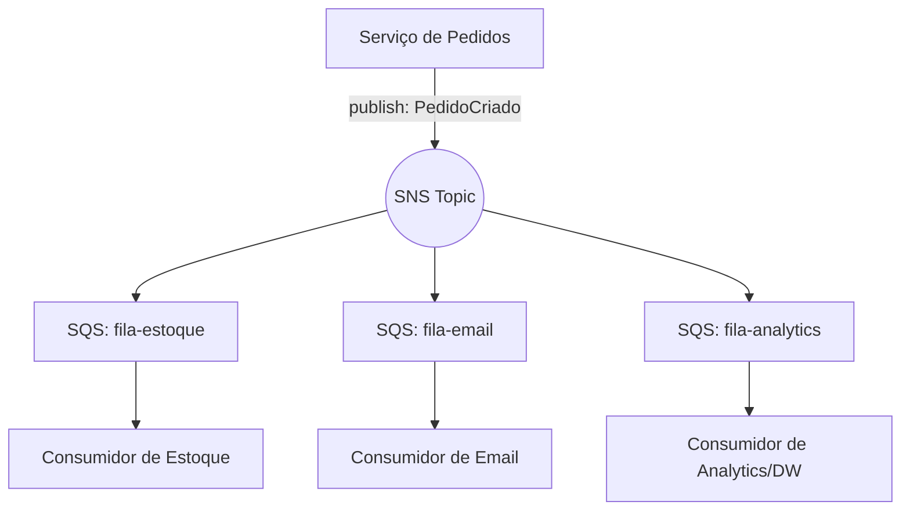
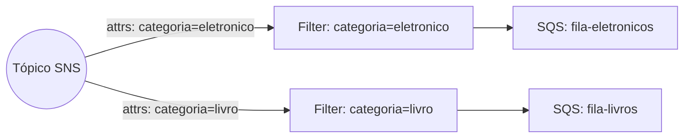
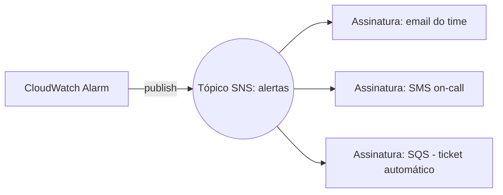

> [!abstract] TL;DR
> SNS é um tópico gerenciado: um `publish` vira N cópias, uma por assinante (SQS, Lambda, HTTP/S, email, SMS, push). É o motor do padrão **fan-out** — várias filas SQS assinam o mesmo tópico e cada uma processa no seu próprio ritmo, sem o publisher saber quem está do outro lado. Filter policies deixam cada assinante escolher que fatia do tráfego quer receber, sem tocar no código de quem publica. A DigitalOcean não tem um SNS nativo — o mais próximo é montar pub/sub você mesmo em cima do Managed Kafka ou aceitar o acoplamento de chamar Functions direto.

## O problema: um evento, muitos interessados

Imagine que você trabalha num e-commerce e o evento "pedido criado" precisa disparar três coisas ao mesmo tempo: debitar o estoque, enviar e-mail de confirmação e alimentar o data warehouse de analytics. A tentação óbvia é o serviço de pedidos chamar os três diretamente — um `POST` pro serviço de estoque, outro pro serviço de e-mail, outro pro pipeline de dados.

Funciona até o dia em que alguém adiciona um quarto interessado (o time de fraude quer ver todo pedido em tempo real) e precisa editar o serviço de pedidos pra incluir mais uma chamada. Ou até o serviço de e-mail cair por 10 minutos e travar a criação de pedidos inteira, porque a chamada era síncrona. O publisher virou refém de todo mundo que decide ouvir.

A pergunta que separa quem já apanhou desse acoplamento de quem ainda vai apanhar é: **quem deveria saber quem está ouvindo — o publisher ou a infraestrutura?** A resposta do pub/sub é: ninguém deveria precisar saber. O serviço de pedidos publica "pedido criado" em um canal. Quem quiser ouvir, assina o canal. Adicionar um quinto assinante não toca uma linha do código de quem publica.

Isso já apareceu no galho de Comunicação entre Sistemas como o padrão publish/subscribe em abstrato. Aqui a pergunta muda: como é a encarnação **gerenciada** disso na AWS, e o que ela resolve que você não precisa mais operar?

## O mecanismo: tópico como ponto de fan-out

O Amazon SNS (*Simple Notification Service*) é um tópico gerenciado. Você cria um tópico, ele vira um ARN — um endereço lógico. Publishers mandam mensagens pra esse endereço sem saber quantos assinantes existem, nem quem são. O SNS cuida de replicar a mensagem e entregar uma cópia pra cada assinatura ativa.

A palavra-chave aqui é **push**: o SNS empurra a mensagem pro assinante, não o contrário. Isso é a diferença estrutural com o SQS, que veremos daqui a pouco.



Os tipos de assinatura (subscription) suportados hoje incluem SQS, Lambda, endpoints HTTP/S, email, SMS, push mobile, Amazon Data Firehose e alguns provedores de terceiros (Datadog, MongoDB, Splunk). Cada assinatura é configurada independentemente: você pode ter uma fila SQS, uma função Lambda e um endpoint HTTPS assinando o mesmo tópico simultaneamente, cada um recebendo a mensagem completa.

### Standard vs FIFO topic

Como no SQS, o SNS tem duas variantes de tópico:

- **Standard**: throughput praticamente ilimitado, entrega *at-least-once*, sem garantia de ordem. É o padrão pra notificações, fan-out de eventos, alertas — a imensa maioria dos casos.
- **FIFO**: ordem estrita por *message group* e deduplicação, no mesmo espírito do SQS FIFO. A AWS documenta que tópicos FIFO se integram especificamente com filas SQS FIFO — ou seja, a garantia de ordem só se propaga de ponta a ponta se o assinante também for uma fila FIFO. Um tópico FIFO não entrega direto pra Lambda ou HTTP; SQS é o alvo natural.

> [!info] Verificado 2026-07-24 — SNS FIFO topics integram com SQS FIFO queues para garantir ordenação e deduplicação ponta a ponta; a documentação não cobre entrega FIFO ordenada para Lambda/HTTP diretamente. Confirme na doc oficial antes de desenhar um fluxo FIFO que não passe por SQS.

Na prática: se você precisa de fan-out simples (várias filas recebendo o mesmo evento, cada uma no seu ritmo), standard resolve. Se precisa que a ordem dos eventos de um mesmo agregado (ex: todos os eventos do pedido #123) seja preservada em cada assinante, FIFO + SQS FIFO é o caminho — mas aceite o teto de throughput que vem junto.

## O padrão canônico: fan-out para múltiplas SQS

Esse é o desenho que você vai ver repetido em praticamente todo sistema orientado a eventos na AWS, e é a resposta arquitetural pro problema do início da nota. Em vez de o publisher chamar N serviços, ele publica uma vez no tópico SNS. N filas SQS assinam o tópico. Cada fila alimenta um consumidor diferente, isolado dos outros.



Por que colocar uma fila SQS entre o tópico e o consumidor, em vez de o SNS entregar direto pra um endpoint HTTP do consumidor? Porque isso é o que dá **durabilidade** ao desenho. A nota [[03-Dominios/Tecnologia/Cloud/13 - Mensageria e eventos gerenciados/02 - SQS a fundo|SQS a fundo]] cobriu isso: se o consumidor de analytics estiver fora do ar por uma hora, a mensagem fica esperando na fila dele — os outros dois consumidores não são afetados, e quando o consumidor de analytics voltar, ele processa o que acumulou. Se o SNS entregasse via HTTP direto pro consumidor, uma indisponibilidade de alguns minutos poderia significar mensagem perdida (dependendo da política de retry) e, pior, o problema de um assinante nunca afeta o publisher nem os outros assinantes.

Esse combo — **SNS pra distribuir, SQS pra amortecer e durar** — é tão comum que a AWS o chama explicitamente de "fanout to SQS queues for asynchronous processing" na própria documentação.

### Message filtering: roteamento sem lógica no publisher

Ainda existe um problema no desenho acima: e se o consumidor de estoque só se importa com pedidos de um certo tipo de produto, e não quer processar (e descartar) 100% do tráfego do tópico? A resposta ingênua seria colocar um `if` no início do consumidor. A resposta do SNS é **filter policy**.

Por padrão, todo assinante recebe toda mensagem publicada no tópico. Uma filter policy é um objeto JSON anexado à assinatura (não ao tópico) que define quais mensagens aquele assinante específico quer receber. O SNS compara os atributos da mensagem (ou, dependendo do escopo configurado, o corpo da mensagem, se for JSON bem formado) contra a política, e só entrega se todas as condições baterem.



Isso é roteamento condicional acontecendo *na infraestrutura*, não no código do publisher nem do consumidor. O publisher continua publicando um único tipo de evento com atributos descritivos; cada assinante declara seu próprio interesse.

Exemplo de filter policy — a assinatura só recebe mensagens de pedidos com `categoria` = `eletronico` ou `informatica`:

```json
{
  "categoria": ["eletronico", "informatica"]
}
```

Por padrão a filter policy compara message attributes, mas o SNS também suporta filtrar pelo **corpo da mensagem** (`FilterPolicyScope: MessageBody`), desde que o payload seja um JSON bem formado. Isso evita duplicar o mesmo dado como atributo e como campo do corpo só pra viabilizar o filtro — se o pedido já carrega `{"categoria": "eletronico", ...}` no corpo, você aponta a política pra esse campo diretamente em vez de o publisher ter que também setar um message attribute redundante.

## Message attributes, raw message delivery e DLQ por assinatura

Três detalhes operacionais que fazem diferença prática:

**Message attributes** são metadados estruturados (chave-valor tipados) anexados à mensagem, separados do corpo. São eles que alimentam as filter policies — em vez de o SNS precisar fazer parsing do corpo pra decidir quem recebe o quê, ele olha os atributos.

**Raw message delivery** controla o formato de entrega quando o assinante é SQS ou HTTP/S. Por padrão, o SNS envelopa a mensagem original num JSON próprio (com `MessageId`, `TopicArn`, `Message`, etc.) — o que significa que o consumidor precisa fazer um parse extra pra chegar no payload real. Ativar raw message delivery entrega o corpo original sem esse envelope, o que importa principalmente quando o mesmo payload também precisa ser consumido por algo que não fala o formato de envelope do SNS (por exemplo, um sistema legado que já espera o JSON puro).

**Dead-letter queue por assinatura**: assim como no SQS, mensagens que falham repetidamente podem ir pra uma DLQ — mas no SNS a DLQ é configurada por *assinatura*, não por tópico, porque a entrega acontece no nível da assinatura. Isso faz sentido: se a fila de e-mail está com problema de permissão e todas as entregas falham, você quer isolar essas mensagens numa DLQ da assinatura de e-mail, sem misturar com as entregas (que estão funcionando normalmente) para estoque e analytics. Erros de cliente (endpoint deletado, política mudada) não são reprocessados; erros de servidor entram numa política de retry — para endpoints gerenciados pela AWS como SQS e Lambda, a AWS documenta até 100.015 tentativas ao longo de 23 dias antes de desistir e mandar pra DLQ (se configurada).

> [!info] Verificado 2026-07-24 — retry de até 100.015 tentativas em 23 dias para endpoints AWS-managed (SQS/Lambda); endpoints customer-managed (HTTP, SMTP, SMS, push) usam política interna de 50 tentativas em 6 horas (HTTP permite política customizada). Fonte: docs.aws.amazon.com/sns/latest/dg/sns-dead-letter-queues.html — confira se o número mudou.

## Caso prático: A2P — quando o assinante é uma pessoa, não um sistema

Até aqui, todos os exemplos foram A2A (*application-to-application*): SQS, Lambda, HTTP/S. Mas o SNS nasceu também pensando em A2P (*application-to-person*) — email, SMS e push mobile como tipos de assinatura de primeira classe, não um bolt-on.

O caso canônico é alerta operacional: uma métrica do CloudWatch cruza um threshold (CPU acima de 90% por 5 minutos, fila DLQ com mensagens acumulando) e o CloudWatch publica num tópico SNS que tem um endereço de e-mail e um número de SMS assinados. O time de operação recebe os dois ao mesmo tempo, sem que o CloudWatch precise saber nada sobre como entregar e-mail ou SMS — só precisa saber publicar num tópico.



Repare que é o mesmo mecanismo de fan-out da seção anterior — só muda o tipo de assinante. Isso é o ponto central de entender o SNS como *tópico genérico*, não como "serviço de fila para sistemas" versus "serviço de notificação para pessoas": é a mesma primitiva, com protocolos de entrega plugáveis.

Outro caso comum de e-commerce: confirmação de pedido enviada por e-mail ao cliente é uma assinatura de e-mail no mesmo tópico `pedido-criado` que alimenta as filas de estoque e analytics — o mesmo evento, publicado uma vez, atende sistemas internos e usuário final simultaneamente, cada um com o protocolo de entrega que faz sentido pra ele.

> [!warning] SMS e email têm confirmação de assinatura (e custo por mensagem)
> Assinaturas de e-mail e HTTP/S ficam em estado `PendingConfirmation` até o destinatário clicar num link de confirmação — o SNS não entrega nada até essa confirmação acontecer, o que costuma pegar quem testa localmente e esquece desse passo manual. SMS, além disso, tem custo por mensagem que varia por país/operadora — não é gratuito como entrega para SQS/Lambda, então alertas de alto volume via SMS podem virar uma linha de custo que ninguém previu no orçamento de infraestrutura.

## SNS vs SQS: push vs pull, fan-out vs fila de trabalho

Essa comparação já foi tocada na nota anterior, mas vale fechar o quadro agora que os dois lados estão explicados:

| Dimensão | SNS | SQS |
|---|---|---|
| Modelo de entrega | Push (SNS empurra pro assinante) | Pull (consumidor busca ativamente) |
| Padrão que resolve | Fan-out — 1 evento, N cópias, N assinantes independentes | Fila de trabalho — N mensagens, 1 pool de workers que se dividem o trabalho |
| Durabilidade da mensagem se ninguém processar | Depende do tipo de assinante (HTTP sem DLQ pode perder) | Sempre durável até `ReceiveCount`/retenção esgotar |
| Quem decide o ritmo de consumo | O SNS entrega assim que pode | O consumidor decide quando fazer poll |
| Uso combinado | Distribuir para múltiplas filas SQS = fan-out durável | Cada fila SQS processa no seu ritmo, isolada das outras |

A combinação SNS→múltiplas SQS não é um meio-termo entre os dois modelos — é os dois modelos empilhados, cada um resolvendo a parte que o outro não resolve sozinho: o SNS resolve "todo mundo que se importa recebe uma cópia", o SQS resolve "essa cópia não se perde enquanto meu consumidor não conseguir processá-la".

## Lente AWS ↔ DigitalOcean

Aqui a honestidade importa mais do que em qualquer outra nota deste galho: **a DigitalOcean não tem um serviço equivalente ao SNS**. Não existe um "DO Pub/Sub gerenciado" no catálogo. As alternativas reais, cada uma com trade-off diferente:

- **DigitalOcean Managed Kafka** (parte da linha de bancos gerenciados): Kafka é fundamentalmente um sistema pub/sub com tópicos e partições — dá pra replicar o padrão fan-out usando tópicos Kafka e múltiplos grupos de consumidores. Mas isso significa operar conceitos de Kafka (partições, offsets, consumer groups) em vez do modelo simples de "assinatura" do SNS, e você paga o cluster de Kafka mesmo em baixo volume.
- **DigitalOcean Functions** chamado diretamente: você perde o desacoplamento — quem publica precisa saber o endpoint de cada função, o que é exatamente o problema que o pub/sub existe pra resolver.
- Montar isso à mão: um serviço próprio (ou um pequeno broker rodando num Droplet) fazendo o papel de tópico, publicando em múltiplas filas — o que tira da DO a promessa de "gerenciado" e devolve a você a operação.

Se o seu critério de decisão é "quero fan-out gerenciado sem operar infraestrutura de mensageria", isso pesa a favor da AWS de um jeito que nenhuma outra nota deste galho pesou até agora — não é questão de nome diferente pro mesmo conceito, é ausência real de produto.

## Tradução de nomes: Azure e GCP

| Conceito | AWS | Azure | GCP | DigitalOcean |
|---|---|---|---|---|
| Tópico pub/sub gerenciado | SNS | Azure Service Bus Topics / Event Grid | Pub/Sub (Cloud Pub/Sub) | — (sem equivalente nativo) |
| Fan-out para filas | SNS → SQS | Service Bus Topics → Subscriptions | Pub/Sub Topic → múltiplas Subscriptions | Managed Kafka (com esforço extra) |
| Filtro de mensagem por assinante | Filter policy (JSON) | SQL filters / correlation filters | Filtro por atributo (attribute filter) | N/A |

## Código: criar tópico, assinar, publicar e filtrar

Criar um tópico e assinar uma fila SQS via AWS CLI:

```bash
# Cria o tópico
aws sns create-topic --name pedido-criado

# Assina uma fila SQS ao tópico (ARN da fila já existente)
aws sns subscribe \
  --topic-arn arn:aws:sns:us-east-1:123456789012:pedido-criado \
  --protocol sqs \
  --notification-endpoint arn:aws:sqs:us-east-1:123456789012:fila-estoque
```

Publicar uma mensagem com atributos (os mesmos que alimentam a filter policy):

```bash
aws sns publish \
  --topic-arn arn:aws:sns:us-east-1:123456789012:pedido-criado \
  --message '{"pedidoId": "789", "total": 249.90}' \
  --message-attributes '{
    "categoria": {"DataType": "String", "StringValue": "eletronico"}
  }'
```

Aplicar uma filter policy à assinatura, pra que ela só receba pedidos de eletrônicos:

```bash
aws sns set-subscription-attributes \
  --subscription-arn arn:aws:sns:us-east-1:123456789012:pedido-criado:abc-123 \
  --attribute-name FilterPolicy \
  --attribute-value '{"categoria": ["eletronico"]}'
```

Fan-out completo (tópico + duas filas + política de permissão pra SNS publicar na fila) — o esqueleto que você repetiria pra cada assinante:

```bash
aws sns create-topic --name pedido-criado

aws sqs create-queue --queue-name fila-estoque
aws sqs create-queue --queue-name fila-analytics

# Repita subscribe para cada fila, uma por assinante
aws sns subscribe --topic-arn arn:aws:sns:...:pedido-criado \
  --protocol sqs --notification-endpoint arn:aws:sqs:...:fila-estoque

aws sns subscribe --topic-arn arn:aws:sns:...:pedido-criado \
  --protocol sqs --notification-endpoint arn:aws:sqs:...:fila-analytics
```

> [!warning] SQS precisa de política de fila permitindo o SNS publicar
> Assinar uma fila SQS a um tópico SNS não é suficiente — a fila precisa de uma resource policy que autorize `sns.amazonaws.com` a chamar `SendMessage` nela. Sem isso, a assinatura fica confirmada mas as mensagens nunca chegam, e o erro não aparece no publisher (que recebeu sucesso do `publish`) — só nas métricas de entrega falha do SNS. É um dos erros mais comuns de quem monta fan-out pela primeira vez.

Assinar uma função Lambda diretamente (sem fila intermediária) — útil quando o processamento é rápido e idempotente, mas perde o buffer de durabilidade que a SQS dá:

```bash
aws sns subscribe \
  --topic-arn arn:aws:sns:us-east-1:123456789012:pedido-criado \
  --protocol lambda \
  --notification-endpoint arn:aws:lambda:us-east-1:123456789012:function:processar-pedido

aws lambda add-permission \
  --function-name processar-pedido \
  --statement-id sns-invoke \
  --action lambda:InvokeFunction \
  --principal sns.amazonaws.com \
  --source-arn arn:aws:sns:us-east-1:123456789012:pedido-criado
```

> [!warning] SNS→Lambda direto não tem fila de amortecimento
> Se a Lambda estiver com erro ou throttling, o SNS aplica a política de retry (com backoff) e, no fim, descarta a mensagem — a menos que você tenha configurado uma DLQ na assinatura. Diferente do padrão SQS-como-event-source (onde a Lambda faz polling e a mensagem simplesmente fica esperando na fila), aqui a fila de espera não existe por padrão. Pra cargas onde perder uma mensagem é inaceitável, prefira SNS→SQS→Lambda (SQS como event source) em vez de SNS→Lambda direto.

## O que vem a seguir

O fan-out resolve "todo mundo que se importa recebe uma cópia", mas ainda pressupõe que você sabe, na hora de desenhar o sistema, quais tópicos e quais filtros existem. A próxima peça deste galho olha pra um problema mais amplo: como orquestrar eventos vindos não só da sua aplicação, mas de dezenas de serviços AWS diferentes, com roteamento baseado em regras mais ricas do que um filtro de atributo — isso é o território do EventBridge e do conceito de *event bus*.

## Fontes

- https://docs.aws.amazon.com/sns/latest/dg/welcome.html
- https://docs.aws.amazon.com/sns/latest/dg/sns-message-filtering.html
- https://docs.aws.amazon.com/sns/latest/dg/sns-fifo-topics.html
- https://docs.aws.amazon.com/sns/latest/dg/sns-dead-letter-queues.html
- https://docs.aws.amazon.com/sns/latest/dg/sns-sqs-as-subscriber.html
- https://docs.aws.amazon.com/sns/latest/dg/sns-lambda-as-subscriber.html
- https://docs.digitalocean.com/products/databases/kafka/
