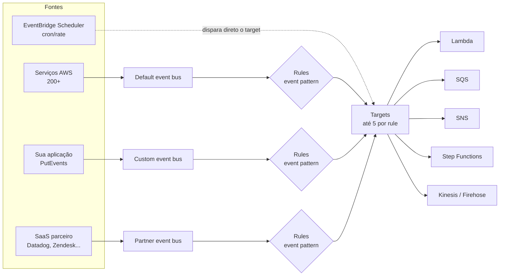
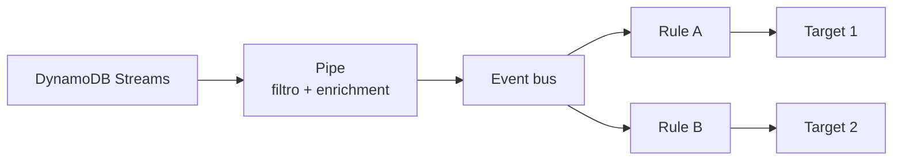

> [!abstract] TL;DR
> O EventBridge é um **roteador de eventos por conteúdo**: em vez de assinar um tópico inteiro (como no SNS), você escreve uma *regra* que casa com o formato/valores de um evento JSON e manda só o que interessa para até 5 destinos. Ele soma isso a um recurso que o SQS e o SNS não têm sozinhos: um **cron gerenciado** (EventBridge Scheduler), integração nativa com dezenas de SaaS de terceiros, um registro de schemas, e a capacidade de **arquivar e reproduzir** eventos passados. A DigitalOcean não tem nada equivalente a essa peça — o mais próximo é o *scheduled trigger* do Functions, que cobre só a fatia do cron.

## O problema: alguém precisa decidir quem recebe o quê

Imagine um e-commerce publicando um evento `OrderPlaced` toda vez que um pedido é fechado. Quem precisa saber disso?

- O serviço de faturamento, sempre.
- O serviço de fraude, só se o valor for maior que R$ 5.000.
- O serviço de fidelidade, só se o cliente for do tier "gold".
- Um pipeline de analytics, sempre — mas em lote, não em tempo real.

Com [[03-Dominios/Tecnologia/Cloud/13 - Mensageria e eventos gerenciados/03 - SNS e pub-sub|SNS]] você resolveria isso publicando no tópico e deixando cada assinante decidir se o evento interessa — o SNS até tem *filter policies* por atributo de mensagem, então dá pra fazer roteamento condicional básico. Mas o filtro do SNS olha atributos que **você anexou à mensagem na hora de publicar**, não o corpo inteiro do evento. E o SNS não sabe nada sobre "todo dia às 9h" ou "todo evento que vier do Zendesk".

O EventBridge nasceu resolvendo exatamente essa lacuna: um serviço que entende o **conteúdo estrutural** do evento (o JSON inteiro, aninhado), que fala com serviços de fora da AWS como se fossem publishers nativos, e que também sabe disparar coisas *no relógio*, não só em reação a um evento.

## O bus: onde os eventos entram

Tudo no EventBridge gira em torno de um **event bus** — um pipe lógico que recebe eventos e os entrega a regras. Existem três tipos:

- **Default event bus**: existe automaticamente em toda conta AWS. Recebe eventos de mais de 200 serviços AWS (EC2 mudou de estado, um objeto chegou no S3, um Step Functions terminou) sem nenhuma configuração.
- **Custom event bus**: você cria um pra isolar o tráfego da sua aplicação — por exemplo, um bus por domínio de negócio (`orders-bus`, `payments-bus`), ou um por ambiente. Isso evita que uma regra pensada para eventos da sua aplicação acidentalmente case com um evento de infraestrutura da AWS.
- **Partner event bus**: criado quando você integra um SaaS parceiro (Datadog, Zendesk, PagerDuty, Auth0, entre outros). O parceiro publica eventos direto nesse bus — você não precisa escrever nenhum código de polling ou webhook.



Repare que o bus por si só não faz nada além de receber o evento e checá-lo contra as regras cadastradas nele. Toda a inteligência de roteamento mora na regra.

> [!tip] Assista: Amazon EventBridge — Learning about rules
> **Canal:** Serverless Land (AWS oficial) | **Duração:** ~7min | **Idioma:** EN
>
> Vídeo curto e oficial da AWS mostrando três regras diferentes casando o mesmo evento de exemplo (um caixa eletrônico fictício) — vê ao vivo o que acontece quando um evento casa com múltiplas regras ou com nenhuma, sem precisar montar o cenário você mesmo. Trecho de destaque [0:07]: *"events flow through event buses but nothing happens until a rule is matched — a rule matches incoming events and sends them to targets for processing"*
>
> 🎬 [Assistir no YouTube](https://www.youtube.com/watch?v=S_LZ9yDNNAo)

## A regra: o coração do roteamento por conteúdo

Uma **rule** tem duas metades: um **event pattern** (o que casa) e uma lista de **targets** (para onde vai). O pattern é um JSON que descreve, por caminho de campo, quais valores você aceita. O EventBridge compara isso contra o corpo do evento recebido — sem você escrever nenhum código de filtro.

Veja um evento típico chegando no bus:

```json
{
  "version": "0",
  "id": "6a7e8feb-b491-4cf7-a9f1-bf3703467718",
  "detail-type": "OrderPlaced",
  "source": "com.minhaloja.orders",
  "account": "123456789012",
  "time": "2026-07-24T14:32:00Z",
  "region": "us-east-1",
  "detail": {
    "orderId": "ORD-9931",
    "amount": 5820.00,
    "customerTier": "gold",
    "currency": "BRL"
  }
}
```

E uma regra que só quer pedidos "gold" acima de R$ 5.000:

```json
{
  "source": ["com.minhaloja.orders"],
  "detail-type": ["OrderPlaced"],
  "detail": {
    "customerTier": ["gold"],
    "amount": [{ "numeric": [">", 5000] }]
  }
}
```

Isso é uma consulta declarativa dentro do próprio motor de roteamento: sem Lambda de filtro, sem código seu decidindo se o evento importa. O EventBridge suporta operadores como `numeric`, `prefix`, `exists`, `anything-but`, e combinações `$or` — o suficiente pra cobrir a maioria dos cenários de negócio sem virar uma engine de regras completa.

Criando isso via CLI:

```bash
# cria a regra com o event pattern acima salvo em pattern.json
aws events put-rule \
  --name pedidos-gold-alto-valor \
  --event-bus-name orders-bus \
  --event-pattern file://pattern.json \
  --state ENABLED

# associa até 5 targets a essa regra
aws events put-targets \
  --event-bus-name orders-bus \
  --rule pedidos-gold-alto-valor \
  --targets \
    "Id"="1","Arn"="arn:aws:lambda:us-east-1:123456789012:function:AlertaFraude" \
    "Id"="2","Arn"="arn:aws:sqs:us-east-1:123456789012:fila-fidelidade"
```

> [!info] Verificado em 2026-07-24 (docs.aws.amazon.com)
> Limite padrão de **5 targets por rule** (soft limit, aumentável via Service Quotas). Tamanho máximo do event pattern: 2.048 bytes. Tamanho máximo do evento: 256 KB. Até 10 event buses por conta e 300 rules por bus, também soft limits — cheque a página `eventbridge-limits-quotas` antes de desenhar algo perto desses tetos.

Cada target pode ter sua própria transformação (*input transformer*) antes da entrega — por exemplo, extrair só o `orderId` e mandar pro SQS em vez do evento inteiro. Isso reduz acoplamento: o consumidor recebe exatamente o shape que precisa, não o evento cru.

Um `input transformer` funciona em duas partes: um `InputPathsMap` que extrai campos do evento original por JSONPath, e um `InputTemplate` que remonta esses campos num payload novo. Por exemplo, para o target da fila de fidelidade, você pode configurar:

```json
{
  "InputPathsMap": {
    "pedido": "$.detail.orderId",
    "cliente": "$.detail.customerTier"
  },
  "InputTemplate": "{\"tipo\": \"pedido-elegivel\", \"pedidoId\": <pedido>, \"tier\": <cliente>}"
}
```

O consumidor na outra ponta nunca vê o envelope `detail-type`/`source`/`time` do EventBridge — só o payload que a transformação produziu. Isso é o que permite que dois consumidores diferentes, ligados à mesma regra, recebam formatos completamente distintos do mesmo evento de origem.

E como o evento chega no bus em primeiro lugar? Sua aplicação publica via `PutEvents`, uma chamada de API síncrona que aceita até 10 eventos por requisição:

```bash
aws events put-events --entries '[
  {
    "Source": "com.minhaloja.orders",
    "DetailType": "OrderPlaced",
    "EventBusName": "orders-bus",
    "Detail": "{\"orderId\":\"ORD-9931\",\"amount\":5820.00,\"customerTier\":\"gold\",\"currency\":\"BRL\"}"
  }
]'
```

Repare que `Source` e `DetailType` são convenções livres da sua aplicação — a AWS não impõe um vocabulário, só recomenda um padrão consistente (ex.: `<empresa>.<domínio>` para source, PascalCase para detail-type) para que as rules fiquem legíveis com o tempo.

## O cron gerenciado: EventBridge Scheduler

Antes do Scheduler existir como produto separado, o EventBridge já fazia "scheduled rules" — uma regra sem event pattern, mas com uma `schedule expression`, que dispara sozinha no relógio em vez de reagir a um evento:

```bash
aws events put-rule \
  --name relatorio-diario \
  --schedule-expression "cron(0 9 * * ? *)" \
  --state ENABLED
```

O **EventBridge Scheduler**, lançado depois, é a evolução dedicada disso: suporta até um milhão de schedules por conta (bem além do limite de rules por bus), tem janelas de entrega flexíveis, controle de retry e retenção de invocações falhas, e permite agendamentos *one-time* além de recorrentes — algo que a scheduled rule clássica não fazia bem. Na prática, hoje o Scheduler é o caminho recomendado para "rode isso às 9h todo dia" ou "rode isso uma vez, daqui a 3 dias"; as scheduled rules continuam existindo por compatibilidade.

Sintaxes de agendamento aceitas: `rate(5 minutes)`, `rate(1 day)` para intervalos simples, ou `cron(0 9 * * ? *)` para expressões cron completas (formato AWS, com o campo de dia-da-semana usando `?` quando o de dia-do-mês está preenchido, e vice-versa).

## SaaS parceiro, schema registry e Pipes

Três recursos complementam o bus e valem conhecer, mesmo que você não os use no dia a dia:

- **Partner event sources**: dezenas de SaaS (Datadog, Zendesk, PagerDuty, Shopify, Auth0, MongoDB Atlas, entre outros) publicam eventos direto num partner event bus na sua conta, depois que você associa a integração no console do parceiro. Isso elimina a necessidade de você escrever um webhook receptor e validar assinatura — o parceiro já fala o protocolo do EventBridge.
- **Schema registry e discovery**: o EventBridge pode inferir o schema (OpenAPI) dos eventos que passam por um bus e mantê-lo versionado num registro. Dali você gera código de binding (classes tipadas) para Java, Python, TypeScript — útil quando dezenas de times consomem o mesmo bus e ninguém quer adivinhar o shape do JSON.
- **EventBridge Pipes**: um mecanismo *ponto a ponto*, diferente do bus de "muitos para muitos". Um pipe lê de uma única fonte (DynamoDB Streams, Kinesis, SQS, MSK) — opcionalmente filtra, enriquece (chamando uma Lambda ou API Destination) e transforma o payload — e entrega a um único destino. Pipes e bus combinam bem: um padrão comum é usar um pipe para tirar eventos de um stream do DynamoDB e jogá-los num event bus, que então os roteia para múltiplos targets via rules.



- **Archive e replay**: você pode configurar um bus para arquivar todo evento que passa por ele (com uma expressão de filtro opcional) e, depois, **reproduzir** uma janela de tempo desse arquivo de volta pelas mesmas rules — útil para recuperar de um bug num consumidor sem precisar reprocessar a fonte original.

## EventBridge vs SNS: quando usar cada um

A pergunta mais comum de quem já conhece SNS é "por que eu trocaria um tópico simples por isso?". A resposta é sobre **granularidade do filtro** e **superfície de integração**, não sobre qual é "melhor":

| Critério | SNS | EventBridge |
|---|---|---|
| Modelo | Pub/sub — assina o tópico, filtra por atributo da mensagem | Roteamento por conteúdo — regra casa com o corpo JSON inteiro |
| Filtro | Filter policy sobre atributos anexados na publicação | Event pattern sobre qualquer campo aninhado do evento |
| Fan-out máximo | Milhares de assinantes por tópico | Até 5 targets por rule (múltiplas rules cobrem mais) |
| Fontes SaaS de terceiros | Não nativo | Partner event sources prontos |
| Agendamento (cron) | Não | EventBridge Scheduler nativo |
| Replay de eventos passados | Não | Archive + replay nativos |
| Latência | Muito baixa, desenho mais simples | Levemente maior — mais uma camada de avaliação de regras |
| Fan-out SNS→SQS | Padrão consagrado ([[03-Dominios/Tecnologia/Cloud/13 - Mensageria e eventos gerenciados/03 - SNS e pub-sub|nota 03]]) | Não é o ponto forte — EventBridge roteia, não faz fan-out em massa pra milhares de filas |

Regra prática: se o requisito é "todo mundo que se inscrever recebe tudo, com no máximo um filtro raso por atributo", SNS é mais simples e mais barato. Se o requisito envolve "só quero o subconjunto de eventos que casa com esta condição de negócio", "preciso agendar isso", ou "preciso que este SaaS externo me avise", o EventBridge é a ferramenta certa. Nada impede combinar os dois — aliás [[03-Dominios/Tecnologia/Cloud/13 - Mensageria e eventos gerenciados/03 - SNS e pub-sub|SNS e EventBridge]] frequentemente aparecem lado a lado num mesmo desenho: SNS para fan-out simples de notificação, EventBridge para orquestração condicional entre serviços internos.

A nota de [[03-Dominios/Tecnologia/Cloud/11 - Serverless e FaaS — Lambda a fundo/03 - O modelo de eventos: triggers e integrações|triggers e integrações do Lambda (galho 11)]] já mostrou o EventBridge como *fonte de eventos* olhando de fora para dentro — aqui vimos o mecanismo por dentro: como a regra decide, e por que ela decide daquele jeito.

## Lente dupla: EventBridge ↔ DigitalOcean

Aqui a honestidade importa mais do que em qualquer outra nota deste galho: **a DigitalOcean não tem um equivalente ao EventBridge**. Não existe um serviço de bus de eventos com roteamento por conteúdo, integração de SaaS parceiro, schema registry ou archive/replay na plataforma.

O que existe é parcial:

- **Functions scheduled triggers**: o DigitalOcean Functions suporta disparar uma função por expressão cron (`triggers:` com `sourceType: scheduler` no `project.yml`), cobrindo a fatia de "rode isso todo dia às 9h" que corresponde ao EventBridge Scheduler. Mas isso é só o cron — não há roteamento condicional de eventos de negócio, não há bus, não há regra casando conteúdo JSON.

> [!info] Verificado em 2026-07-24 (docs.digitalocean.com)
> Scheduled triggers do DigitalOcean Functions estavam, na documentação consultada, em fase de *private preview*, com limite de 3 triggers por conta — bem mais restrito que o EventBridge Scheduler (até 1 milhão de schedules por conta na AWS). Confira o estado atual antes de decidir uma arquitetura em torno disso.

- **Managed Kafka**: como mencionado na nota anterior deste galho, se o requisito é "múltiplos consumidores, replay de mensagens, streams particionados", o caminho na DO é montar isso sobre o Kafka gerenciado — mas aí você está operando um motor de streaming genérico, não um roteador de eventos por regra declarativa. É engenharia equivalente em poder bruto, mas com curva de operação e desenho totalmente diferente.

Se seu desenho depende pesadamente de roteamento condicional rico, integração de SaaS de terceiros, ou replay de eventos, isso pesa a favor da AWS (ou de rodar algo como um broker CloudEvents por conta própria na DO) — não é um gap que se tapa com "só reimplementar a lógica na aplicação" sem custo de engenharia.

## Tradução de nomes: Azure e GCP

Sem hands-on aqui — só para você reconhecer o conceito quando aparecer em outra nuvem. Azure tem duas peças que, juntas, cobrem o que o EventBridge faz sozinho; o GCP também separa roteamento de agendamento:

| Conceito | AWS | Azure | GCP | Nota |
|---|---|---|---|---|
| Roteamento por conteúdo/schema de evento | EventBridge (event bus + rules) | Event Grid | Eventarc | Os três descrevem eventos em formato próximo do CloudEvents |
| Pub/sub simples | SNS | Service Bus Topics | Pub/Sub | Ver nota anterior deste galho |
| Cron gerenciado | EventBridge Scheduler | Azure Logic Apps (recurrence trigger) / Azure Functions Timer trigger | Cloud Scheduler | Azure não tem um "scheduler" dedicado tão isolado quanto o da AWS/GCP |
| Ponto a ponto com enrichment | EventBridge Pipes | Logic Apps / Azure Functions bindings | Eventarc + Workflows | Function bindings do Azure cobrem parte do caso de uso |
| Integração SaaS parceiro nativa | Partner event sources | Event Grid partner topics | Não nativo (via Pub/Sub push + webhook) | Event Grid é o mais próximo do modelo de partner bus |

> [!warning] Armadilhas comuns
> - **Confundir "não casou a regra" com "evento perdido"**: se o event pattern não casa com nenhum evento, ele simplesmente não vai a lugar nenhum — não há erro, não há fila de dead-letter automática a menos que você configure uma para o alvo específico. Teste patterns com `aws events test-event-pattern` antes de confiar neles em produção.
> - **Esperar ordem garantida**: o EventBridge não garante ordem de entrega entre eventos, mesmo vindos da mesma fonte. Se ordem importa, isso precisa ser resolvido a jusante (ex.: SQS FIFO como target, ou lógica de sequenciamento na aplicação).
> - **Tratar o default bus como se fosse seu**: eventos de +200 serviços AWS passam pelo default bus. Uma regra mal escrita ali pode casar com tráfego que você nunca pretendeu capturar. Prefira um custom bus para tráfego de aplicação.
> - **Esquecer o limite de 5 targets**: para fan-out amplo (dezenas de consumidores), a peça certa é publicar num SNS a partir de um target do EventBridge, ou usar múltiplas rules — não tentar espremer tudo em 5 targets de uma única regra.

## O que vem a seguir

Com SQS, SNS e EventBridge cada um no seu lugar — fila ponto a ponto, pub/sub simples, roteamento por conteúdo — a próxima nota deste galho junta as peças em **padrões event-driven** reconhecíveis: fan-out, saga, outbox, dead-letter queue como estratégia (não só como recurso técnico), e como esses padrões se compõem numa arquitetura real.

## Fontes

- [What Is Amazon EventBridge?](https://docs.aws.amazon.com/eventbridge/latest/userguide/eb-what-is.html)
- [Amazon EventBridge event buses](https://docs.aws.amazon.com/eventbridge/latest/userguide/eb-event-bus.html)
- [Amazon EventBridge rules](https://docs.aws.amazon.com/eventbridge/latest/userguide/eb-rules.html)
- [Amazon EventBridge event patterns](https://docs.aws.amazon.com/eventbridge/latest/userguide/eb-event-patterns.html)
- [Amazon EventBridge quotas](https://docs.aws.amazon.com/eventbridge/latest/userguide/eventbridge-limits-quotas.html)
- [Using Amazon EventBridge Scheduler](https://docs.aws.amazon.com/eventbridge/latest/userguide/using-eventbridge-scheduler.html)
- [Amazon EventBridge Pipes](https://docs.aws.amazon.com/eventbridge/latest/userguide/eb-pipes.html)
- [Amazon EventBridge schema registry](https://docs.aws.amazon.com/eventbridge/latest/userguide/eb-schema.html)
- [Amazon EventBridge archives and replaying events](https://docs.aws.amazon.com/eventbridge/latest/userguide/eb-archive.html)
- [DigitalOcean Functions — Schedule Functions](https://docs.digitalocean.com/products/functions/how-to/schedule-functions/)
