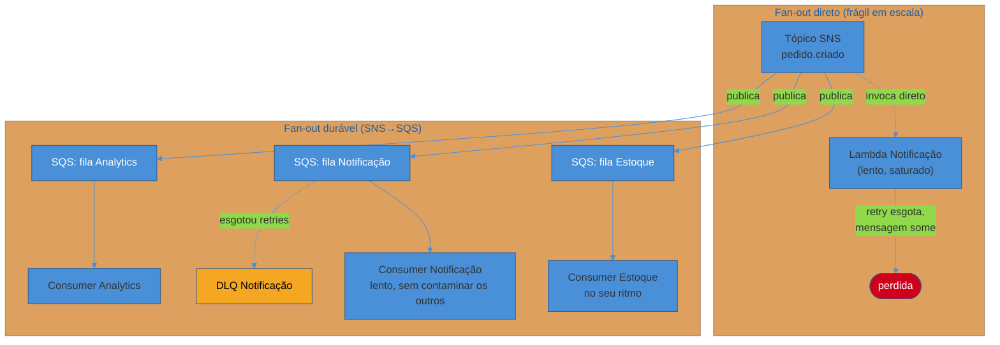
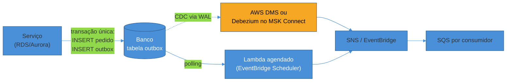
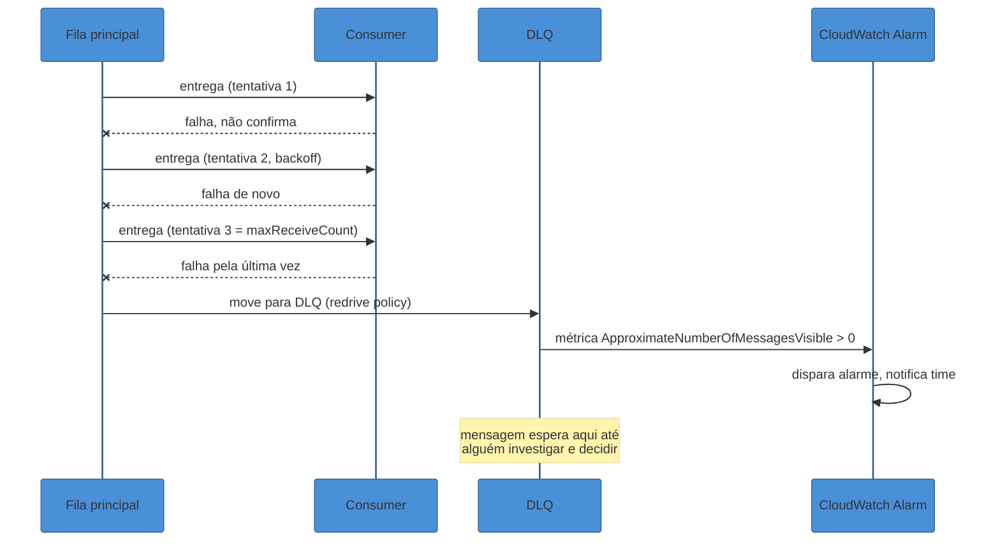

# Padrões event-driven na cloud

> [!abstract] TL;DR
> Ter SQS, SNS e EventBridge disponíveis não torna um sistema event-driven — só dá as peças. O que transforma peças em arquitetura é um punhado de padrões que se repetem em todo sistema assíncrono sério: **fan-out durável** (SNS publicando para filas SQS, não direto para consumidores, porque cada consumidor precisa do seu próprio ritmo e da sua própria fila morta), **idempotência no consumer** (toda entrega em nuvem é at-least-once — duplicata é regra, não exceção, e o consumer precisa absorver isso), **ordenação seletiva** (só quando dois eventos descrevem o mesmo agregado, e sempre ao custo de paralelismo), **outbox** (para nunca perder a sincronia entre "commitei no banco" e "publiquei o evento"), e **DLQ com estratégia** (poison message isolado, alarme disparando, e um plano deliberado de redrive — não uma fila que só acumula silêncio). Esta nota amarra os quatro serviços das notas anteriores deste galho em torno desses padrões, e fecha com o contraste inevitável: a AWS tem um ecossistema desenhado para isso; a DigitalOcean, honestamente, não tem — o mais perto que chega é Managed Kafka mais Functions, e a distância entre um e outro é o próprio assunto desta nota.

Um sistema de e-commerce publica um evento `pedido.criado` num tópico SNS. Três serviços diferentes precisam reagir: Estoque reserva o item, Notificação manda um email, Analytics registra a métrica. O jeito mais direto de conectar isso — e o jeito que qualquer tutorial de cinco minutos ensina primeiro — é assinar os três como endpoints Lambda diretamente no tópico. Funciona no ambiente de testes, com um pedido por minuto. Funciona ainda na Black Friday, com mil pedidos por segundo, até o momento em que o serviço de Notificação, que depende de uma API de terceiros lenta e imprevisível (o provedor de email trava, o rate limit dele é apertado), começa a rejeitar invocações mais rápido do que consegue processá-las. A concorrência do Lambda de Notificação satura, o SNS esgota sua política de retry contra aquele endpoint específico — e, sem um lugar para pousar, mensagens que o serviço de Notificação não deu conta de processar simplesmente desaparecem. O pior: Estoque e Analytics, que não têm nada a ver com o gargalo de Notificação, continuam recebendo e processando normalmente, porque o SNS trata cada assinatura como independente — o que quer dizer que ninguém, olhando o painel geral do sistema, percebe de imediato que só um dos três consumidores está sangrando mensagens.

Essa história — um consumidor lento contamina o sistema inteiro, ou pior, esconde a própria falha — é o motivo de existir quase todo padrão desta nota. Nenhum deles é exótico; são as respostas que a indústria já convergiu, refinadas por anos de incidente em produção, para as mesmas perguntas que qualquer sistema assíncrono real precisa responder: o que acontece quando um consumidor trava? O que acontece quando a mesma mensagem chega duas vezes? Quando a ordem importa, e quando ela é só um capricho que custa throughput? E como garantir que "salvei no banco" e "avisei o mundo" nunca saem de sincronia?

## Fan-out durável: por que SNS→SQS, não SNS→Lambda direto

A nota anterior deste galho já registrou o mecanismo do fan-out — um único evento no SNS entregue a múltiplas assinaturas. O que essa nota acrescenta é a régua de decisão prática: **em qualquer fan-out onde os consumidores têm ritmos, cargas ou disponibilidade diferentes entre si, a assinatura correta não é o consumidor direto — é uma fila SQS entre o tópico e o consumidor.**



**Por que a fila muda tudo:** sem ela, o SNS entrega direto ao endpoint e retenta segundo a política de entrega daquele protocolo — para SQS e Lambda, isso já é generoso por padrão: 3 tentativas imediatas, mais 2 com 1 segundo de intervalo, mais 10 com backoff exponencial de 1 a 20 segundos, mais até 100.000 tentativas espaçadas em 20 segundos, totalizando mais de 100 mil tentativas ao longo de até 23 dias antes de desistir. Isso parece suficiente — e é, para uma falha transitória de rede. O problema não é a quantidade de tentativas; é que, sem uma fila no meio, **não existe onde a mensagem esperar** enquanto o consumidor está genuinamente indisponível ou saturado — o SNS entrega no ritmo que o SNS decide, não no ritmo que o consumidor consegue absorver, e quando o Lambda de Notificação está com a concorrência no teto, cada nova invocação tentada é mais uma invocação throttled, não uma mensagem esperando pacientemente numa fila.

Uma fila SQS entre o tópico e o consumidor resolve isso de um jeito estrutural, não paliativo: a mensagem fica **persistida e esperando** até o consumidor puxá-la no seu próprio ritmo (poll-based, não push-based) — o backlog cresce na fila, visível como métrica (`ApproximateNumberOfMessagesVisible`), em vez de se perder silenciosamente numa cadeia de retries que eventualmente esgota. E cada fila tem sua própria política de retry (`maxReceiveCount`) e sua própria DLQ — o que quer dizer que o problema de Notificação fica **isolado** na fila de Notificação, sem vazar para Estoque ou Analytics, que continuam consumindo normalmente da fila deles.

> [!info] Verificado em 2026-07-24 — política de retry padrão do SNS para SQS/Lambda
> Fase imediata: 3 tentativas sem atraso. Pré-backoff: 2 tentativas, 1s de intervalo. Backoff: 10 tentativas, exponencial de 1s a 20s. Pós-backoff: até 100.000 tentativas, 20s de intervalo. Total: ~100.015 tentativas ao longo de até 23 dias (fonte: AWS SNS Developer Guide, "Message delivery retries"). Esse número é generoso o bastante para cobrir qualquer instabilidade transitória — o ponto da nota não é que o SNS retenta pouco, é que retentar sem fila não dá tempo/espaço pro consumidor absorver carga no próprio ritmo.

A régua prática, então, não é "sempre use fila" — é: **se o consumidor é rápido, sempre disponível, e uma falha nele não deve bloquear nem atrasar ninguém (um webhook de notificação best-effort, por exemplo), a invocação direta é aceitável.** Se o consumidor tem qualquer chance de ficar lento, indisponível, ou processar em lote — o que descreve a maioria dos consumidores de negócio reais — o fan-out durável via SQS é o padrão default, não a exceção.

## Idempotência: a consequência inevitável de at-least-once

Toda entrega gerenciada na cloud — SQS, SNS, EventBridge, os três — é **at-least-once**: o serviço garante que a mensagem não se perde, e para cumprir essa garantia, reentrega sempre que não recebe confirmação a tempo (um `ack` de SQS que se perde na volta, um rebalanceamento, um timeout de processamento). O preço dessa garantia é duplicata — não como bug ocasional, mas como comportamento esperado do sistema sob condições normais de operação. A [[03-Dominios/Engenharia/Comunicação entre Sistemas/index|trilha de Comunicação entre Sistemas]] já cobriu essa disciplina em profundidade, do lado conceitual: por que exactly-once genuíno é impossível numa rede que pode perder confirmações, por que at-least-once mais idempotência é, na prática, a combinação que a indústria inteira usa, e como desenhar a chave de deduplicação e a checagem atômica que tornam um consumer seguro para reprocessar. Esta nota não repete esse mecanismo — assume-o como pré-requisito e mostra como ele se encarna especificamente num consumer rodando sobre SQS/Lambda na AWS.

A tática mais comum na AWS é uma tabela DynamoDB com escrita condicional: o consumer tenta gravar a chave de idempotência (o `MessageId` do SQS, ou um `event_id` de negócio presente no payload) **antes** de executar o efeito, usando `ConditionExpression` para que a escrita falhe se a chave já existir — transformando a checagem "já processei isso?" numa única operação atômica, sem race condition entre "checar" e "gravar".

```python
import boto3
from botocore.exceptions import ClientError

dynamodb = boto3.resource("dynamodb")
tabela_idempotencia = dynamodb.Table("eventos-processados")

def processar_com_idempotencia(event_id, efeito_de_negocio):
    try:
        # Escrita condicional: só grava se a chave AINDA NÃO existir.
        # Se já existir, ConditionalCheckFailedException — evento duplicado, ignora.
        tabela_idempotencia.put_item(
            Item={
                "event_id": event_id,
                "processado_em": int(time.time()),
                "ttl": int(time.time()) + 86400 * 7,  # expira em 7 dias via TTL do DynamoDB
            },
            ConditionExpression="attribute_not_exists(event_id)",
        )
    except ClientError as e:
        if e.response["Error"]["Code"] == "ConditionalCheckFailedException":
            print(f"Evento {event_id} já processado, ignorando duplicata")
            return
        raise

    # Só chega aqui se a chave foi gravada com sucesso — primeira vez vendo este evento.
    efeito_de_negocio()
```

O TTL nativo do DynamoDB (expiração automática de itens, sem custo de escrita adicional) resolve um problema colateral que toda tabela de deduplicação enfrenta: sem TTL, a tabela cresce para sempre; com TTL calibrado para um pouco mais que a janela máxima de reentrega esperada, a tabela se autolimpa.

> [!tip] Assista: Fix Duplicate Messages with the Idempotent Consumer Pattern
> **Canal:** Milan Jovanović | **Duração:** ~14min | **Idioma:** EN
>
> Mesmo com Azure Service Bus em vez de SQS, o raciocínio é idêntico ao desta nota: exactly-once *delivery* não existe de verdade, então a defesa é exactly-once *processing* no consumer, via checagem de duplicata antes do efeito — o mesmo princípio da escrita condicional no DynamoDB, só que ilustrado com um exemplo de código completo do zero. Trecho de destaque [2:38]: *"exactly once delivery isn't really possible in a real-world system — however, exactly once processing is, and that's what we're going to talk about in this video"*
>
> 🎬 [Assistir no YouTube](https://www.youtube.com/watch?v=GsZ_ZtlRCBg)

> [!warning] Idempotência no handler Lambda, não fora dele
> **O que acontece:** um time implementa a checagem de idempotência numa camada de infraestrutura — um decorator, um middleware genérico — sem garantir que a gravação da chave e a execução do efeito de negócio fiquem atomicamente juntas. **Por quê:** se o Lambda processa o evento, gera o efeito (por exemplo, chama uma API de pagamento) e só depois grava a chave de idempotência, existe uma janela real onde uma reentrega — porque o Lambda morreu logo depois do efeito, antes de gravar a chave — dispara o efeito de novo, exatamente o cenário que a idempotência existia para prevenir. A ordem importa: gravar a chave (ou pelo menos reservar a intenção, com um status `em_processamento`) antes ou atomicamente com o efeito, nunca depois. **Como evitar:** usar a escrita condicional como *reserva* da execução antes de disparar o efeito, e não como um registro de auditoria depois do fato — o padrão do exemplo acima faz isso corretamente porque a gravação acontece antes de `efeito_de_negocio()` ser chamado.

## Ordenação: quando importa, e o que ela custa

A mesma trilha de Comunicação entre Sistemas nomeia a regra geral: ordenação importa quando dois eventos descrevem o **mesmo agregado** — o mesmo pedido, o mesmo item de estoque — e não importa entre agregados diferentes. Na encarnação AWS desse princípio, a escolha concreta é entre fila/tópico **standard** e **FIFO**:

- **SQS standard / SNS standard:** sem garantia de ordem — mensagens podem chegar fora de sequência mesmo sem nenhuma falha envolvida —, mas throughput praticamente ilimitado.
- **SQS FIFO / SNS FIFO:** ordem estrita dentro do mesmo `MessageGroupId`, às custas de throughput menor por grupo (embora filas FIFO de alto throughput distribuam carga entre mais grupos em paralelo, mantendo ordem só dentro de cada grupo individual) e de uma limitação estrutural que costuma pegar quem desenha o sistema pela primeira vez: **SNS FIFO só pode publicar para SQS FIFO** — não é possível ligar um tópico SNS FIFO diretamente a um Lambda, porque o próprio conceito de ordem estrita exige que exista uma fila retendo a sequência até um consumidor único processá-la sem paralelismo dentro do grupo.
- **EventBridge:** não oferece garantia de ordem alguma, em nenhuma configuração — cada regra e cada target são disparados de forma independente, e o próprio serviço não tem o conceito de `MessageGroupId`. Se um fluxo em EventBridge precisa de ordenação, a solução não é configuração — é arquitetural: o consumer que recebe o evento precisa ele mesmo reordenar por timestamp/versão, ou o publisher precisa rotear eventos que exigem ordem para um SQS FIFO como target, tirando a responsabilidade do EventBridge.

O custo de ordenação não é abstrato — é throughput medido em mensagens por segundo, e a régua prática continua sendo a mesma da nota conceitual: só pague esse custo onde a ordem muda o resultado. `estoque.reservado` seguido de `estoque.liberado` do mesmo SKU precisa de ordem; `pedido.criado` do cliente A e `pedido.criado` do cliente B não têm relação nenhuma entre si, e forçar ordem entre eles é gargalo puro, sem ganho de correção nenhum.

## Outbox na cloud: quem faz o papel do relay

A nota irmã em Comunicação entre Sistemas já cobriu o Outbox Pattern em profundidade — a tabela `outbox` na mesma transação do dado de negócio, resolvendo o dual-write problem ao mover a atomicidade para dentro do banco. O que muda na encarnação cloud é **quem desempenha o papel do relay** que lê a tabela outbox e publica no broker:



Duas opções concretas: um **Lambda agendado** (via EventBridge Scheduler, rodando a cada poucos segundos) fazendo o papel do Polling Publisher — simples de montar, mesmo trade-off de latência e carga de leitura já discutido na nota conceitual —, ou **AWS DMS** (Database Migration Service) em modo de replicação contínua, lendo o WAL do RDS/Aurora via CDC e publicando no destino, fazendo o papel que Debezium faz em ambiente self-managed. Uma terceira peça específica da AWS vale nomear: **EventBridge Pipes**, um serviço desenhado justamente para conectar uma fonte (DynamoDB Streams, Kinesis, um SQS de entrada) a um destino (outro SQS, um Step Functions, o próprio EventBridge) com transformação e filtro no meio, sem escrever nenhum código de glue — útil quando a "tabela outbox" é, na verdade, um DynamoDB e a mudança já chega via DynamoDB Streams em vez de precisar de um relay que faz polling.

A DigitalOcean, aqui, não oferece nenhuma dessas peças gerenciadas — nem um DMS equivalente, nem um EventBridge Pipes. Implementar Outbox sobre um banco gerenciado da DO significa rodar o próprio Debezium (ou um poller próprio) em um Droplet ou App Platform, como qualquer implementação self-managed faria — honesto reconhecer que aqui a distância entre "a AWS tem um serviço gerenciado pra isso" e "você mesmo opera essa peça" é real, não cosmética.

## DLQ strategy: poison message, alarme, redrive

Uma Dead Letter Queue existe para uma pergunta específica: o que fazer com uma mensagem que o consumer tentou processar e falhou, repetidamente, de um jeito que retry não resolve — o **poison message**. Um payload malformado, uma regra de negócio que rejeita aquele pedido especificamente, um bug que só aquela combinação de dados dispara. Sem DLQ, essa mensagem fica presa na fila principal, sendo reentregue para sempre (bloqueando, em filas FIFO, todo o resto do grupo atrás dela) ou sendo descartada silenciosamente ao esgotar a retenção — as duas piores opções.



A peça de configuração central é o `maxReceiveCount` na redrive policy da fila principal — quantas vezes uma mensagem pode ser recebida (não processada com sucesso) antes de ser movida para a DLQ. Um valor baixo demais (1 ou 2) manda para a DLQ mensagens que só precisavam de mais uma tentativa, contra uma falha transitória de rede; um valor alto demais atrasa a detecção de um poison message genuíno.

> [!info] Verificado em 2026-07-24 — mecânica de redrive do SQS
> A redrive allow policy da DLQ controla quais filas de origem podem usar aquela DLQ (padrão: todas). Para mover mensagens de volta da DLQ para a fila principal depois de corrigido o bug, a AWS oferece redrive via console/API (`StartMessageMoveTask`) que reprocessa o conteúdo da DLQ de volta à origem. Um detalhe operacional que a documentação destaca: não usar DLQ com filas FIFO se a ordem estrita não puder ser quebrada — mover mensagens de/para a DLQ não preserva posição relativa (fonte: AWS SQS Developer Guide, "Using dead-letter queues"). Vale conferir o comportamento exato de `StartMessageMoveTask` (limites de taxa, quantas tarefas simultâneas) no momento de implementar, porque a API evolui.

A DLQ sozinha, sem alarme, é só um cemitério silencioso — mensagens acumulam ali e ninguém percebe até um cliente reclamar. A prática madura sempre acompanha a DLQ de um **CloudWatch Alarm** na métrica `ApproximateNumberOfMessagesVisible` daquela fila especificamente, notificando via SNS/Slack assim que a contagem sai de zero — porque a existência de qualquer mensagem numa DLQ, mesmo uma só, já é sinal de algo que merece investigação humana, não um número que só vira problema depois de acumular centenas.

```python
# Redrive programático (SDK) — reprocessar mensagens da DLQ de volta à origem
# depois de corrigir o bug que causou o poison message
import boto3

sqs = boto3.client("sqs")

response = sqs.start_message_move_task(
    SourceArn="arn:aws:sqs:us-east-1:123456789012:pedidos-dlq",
    DestinationArn="arn:aws:sqs:us-east-1:123456789012:pedidos-fila-principal",
    MaxNumberOfMessagesPerSecond=10,  # limita a taxa de redrive, evita novo pico no consumer
)
```

## Retry e backoff, e o mito do exactly-once distribuído

Vale nomear explicitamente, porque a confusão é comum: nenhum dos serviços desta trilha entrega exactly-once de ponta a ponta. SQS e SNS são at-least-once por design; EventBridge, idem. A única exceção parcial é o Kafka (e, por extensão, o Amazon MSK) com Exactly-Once Semantics habilitado — mas, como a nota conceitual da trilha de Comunicação já deixou claro, esse EOS vale **dentro** do cluster Kafka, nunca no momento em que o efeito sai para um sistema externo (um banco, uma API de pagamento, um email). "Exactly-once" anunciado por qualquer ferramenta cloud, sem qualificar a fronteira exata onde essa garantia para de valer, é motivo para desconfiar, não para relaxar a idempotência do consumer.

O backoff, do lado do consumer, na AWS tem uma peça específica que vale nomear: o **visibility timeout** do SQS. Quando um consumer recebe uma mensagem, ela fica invisível para outros consumers por esse período — se o consumer processa com sucesso e a apaga antes do timeout expirar, tudo bem; se falha, trava, ou demora mais que o timeout, a mensagem volta a ficar visível e é reentregue. Ajustar esse timeout corretamente (maior que o pior caso razoável de tempo de processamento, mas não tão alto a ponto de atrasar a detecção de um consumer travado) é, na prática, a forma mais direta de controlar o ritmo de retry no SQS — sem precisar de uma lógica de backoff explícita no código do consumer, porque o próprio serviço já espaça as tentativas por esse mecanismo.

## Choreography vs orchestration: prévia do próximo galho

A Saga já foi tratada em profundidade, do lado conceitual, na trilha de Comunicação — coreografia (cada serviço reage a eventos, sem coordenador central) contra orquestração (um coordenador central chama cada passo). Na AWS, essa escolha tem encarnações concretas e bem distintas:

- **Coreografia** se monta naturalmente sobre EventBridge (ou SNS→SQS): cada serviço publica um evento quando termina sua parte, e os serviços seguintes estão inscritos via regras/assinaturas — sem nenhum componente central sabendo o fluxo inteiro.
- **Orquestração** tem uma casa dedicada na AWS: **Step Functions**, uma máquina de estados gerenciada que define o fluxo completo (incluindo os passos de compensação) como um diagrama declarativo, com retry, timeout e tratamento de erro configuráveis por estado, e visibilidade de qual instância está em qual passo, a qualquer momento.

Esta nota não entra na mecânica de Step Functions — esse é o assunto do próximo galho desta trilha Cloud, dedicado a orquestração e workflows gerenciados. O que vale reter aqui é só a régua de decisão, herdada da nota conceitual: poucos passos e fluxo simples favorecem coreografia via EventBridge; muitos passos, ramificações condicionais, ou a necessidade de visibilidade operacional clara sobre "em que ponto essa saga travou" favorecem Step Functions.

## Lente dupla: montando esses padrões na AWS e o limite real da DigitalOcean

Todos os padrões desta nota — fan-out durável, DLQ com alarme, outbox via CDC, orquestração gerenciada — se apoiam em peças que a AWS oferece como serviço gerenciado, prontas para compor: SNS, SQS, EventBridge, DynamoDB (para idempotência), CloudWatch (para alarme), DMS ou EventBridge Pipes (para o relay do outbox), Step Functions (para orquestração). É um ecossistema desenhado para isso há mais de uma década, com integração nativa entre as peças.

A DigitalOcean não tem equivalente nativo a nenhum dos três serviços centrais desta trilha — não existe SQS, SNS ou EventBridge gerenciado na DO. O caminho mais próximo que a plataforma oferece é **Managed Kafka** (um dos engines do produto de bancos gerenciados) como broker, combinado com **DO Functions** como camada de compute reativo — mas essa combinação exige montar manualmente boa parte do que a AWS entrega pronto: não há um DLQ gerenciado com alarme integrado do jeito que o CloudWatch oferece para SQS, não há um serviço equivalente a Step Functions para orquestração visual, e a documentação de DO Functions, na verificação feita para esta nota, não descreve triggers nativos a partir de tópicos Kafka — a integração entre Managed Kafka e Functions, quando necessária, tende a passar por um consumer customizado rodando à parte (num Droplet ou App Platform), não por um binding gerenciado como o event source mapping do Lambda com SQS.

| Padrão | AWS | DigitalOcean |
|---|---|---|
| Fan-out durável | SNS → múltiplas filas SQS | Kafka topics + consumer groups (manual) |
| Idempotência (storage) | DynamoDB conditional write | Managed Postgres/Redis com `UPSERT` ou `SETNX` |
| DLQ gerenciada + alarme | SQS DLQ + CloudWatch Alarm | Sem equivalente nativo — implementar tópico "morto" no Kafka e alarme manual |
| Outbox relay (CDC) | DMS / EventBridge Pipes / Debezium no MSK Connect | Debezium self-managed sobre o Postgres/MySQL gerenciado |
| Orquestração de saga | Step Functions | Sem equivalente — Temporal/Camunda self-hosted num Droplet |

Isso não torna a DO inviável para arquitetura event-driven — Kafka é, ele mesmo, uma base sólida e amplamente usada em produção fora da AWS —, mas muda o cálculo de operação: na AWS, boa parte destes padrões é configuração declarativa sobre serviços gerenciados; na DO, vários deles voltam a ser código e infraestrutura que o time precisa escrever e manter, o mesmo trabalho que qualquer stack self-managed de Kafka exigiria em qualquer nuvem.

## Casos práticos

**Fan-out direto que escondeu um vazamento de mensagens por semanas.** Uma fintech conecta três Lambdas diretamente a um tópico SNS de eventos de transação — Fraude, Contabilidade, Notificação — sem fila intermediária. O Lambda de Fraude, que chama um serviço de scoring de terceiros com SLA de 2 segundos, começa a sofrer timeouts intermitentes durante um pico de tráfego às sextas-feiras. Como não existe fila retendo as mensagens que falharam, e a política de retry do SNS eventualmente se esgota para aquele endpoint específico, uma fração pequena mas constante de transações nunca chega a ser avaliada por fraude — sem nenhum erro visível nos dashboards gerais do sistema, porque Contabilidade e Notificação continuam processando 100% normalmente. O gap só é descoberto num audit trimestral, comparando o volume total de transações com o volume avaliado por Fraude. A correção: inserir uma fila SQS entre o tópico e cada Lambda, com DLQ e alarme individual por fila — a partir daí, qualquer degradação específica de um consumidor vira visível como crescimento de backlog naquela fila, em vez de invisível.

**Redrive de DLQ sem corrigir a causa raiz, repetindo o mesmo erro.** Um time de e-commerce vê o alarme de DLQ disparar, entra correndo no console, e usa o redrive para mover as 400 mensagens de volta à fila principal — sem investigar por que elas foram parar lá. As mesmas 400 mensagens, com o mesmo payload malformado (um campo `cep` vindo nulo de uma integração recém-quebrada com um parceiro), voltam a esgotar o `maxReceiveCount` e retornam para a DLQ minutos depois, agora somadas às novas mensagens que continuam chegando com o mesmo defeito. A lição, reforçada por esse incidente, virou processo formal: redrive só acontece depois de confirmar, por amostragem manual do conteúdo da DLQ, que a causa raiz foi corrigida — nunca como reflexo automático ao ver o alarme disparar.

## Armadilhas comuns

> [!warning] Idempotência tratada como responsabilidade do broker
> **O que acontece:** um time assume que, porque o SQS ou o SNS "garantem entrega confiável", a duplicação de mensagens é um evento raro o suficiente para ignorar. **Por quê:** at-least-once **é** a garantia padrão — duplicata acontece em operação normal (rebalanceamento, timeout de ack, retry de rede), não só em cenário de desastre. Um consumer sem idempotência processa a mesma mensagem múltiplas vezes cedo ou tarde, sob volume real. **Como evitar:** toda escrita de efeito colateral relevante (cobrança, envio de email, decremento de estoque) passa por uma checagem de deduplicação atômica antes de executar — o padrão de escrita condicional no DynamoDB desta nota, ou equivalente.

> [!warning] DLQ sem alarme configurado
> **O que acontece:** a DLQ existe, tecnicamente configurada, mas ninguém recebe notificação quando mensagens chegam ali — ela só é olhada quando alguém lembra, ou quando um cliente reclama. **Por quê:** uma DLQ sem alarme funciona, na prática, como at-most-once disfarçado de at-least-once: a mensagem não foi perdida tecnicamente (ela existe, sentada na DLQ), mas o efeito de negócio que ela representava nunca aconteceu, e ninguém sabe disso até tarde. **Como evitar:** todo DLQ nesta trilha nasce com um CloudWatch Alarm na métrica de mensagens visíveis, configurado no mesmo PR/deploy que cria a fila — nunca como item de backlog "adicionar depois".

> [!warning] Ordenação forçada onde não era necessária
> **O que acontece:** um time usa SQS FIFO ou SNS FIFO em todo o sistema, por reflexo de "ordem é sempre mais seguro", sem avaliar se os eventos em questão de fato compartilham um agregado. **Por quê:** FIFO custa throughput real — e, além disso, limita as opções de integração (SNS FIFO só publica para SQS FIFO, nunca direto para Lambda), forçando uma camada extra que talvez nem fosse necessária se a ordenação não fosse exigida em primeiro lugar. **Como evitar:** aplicar a mesma régua da nota conceitual — ordenação só onde dois eventos descrevem o mesmo agregado — e usar `MessageGroupId` calibrado por entidade de negócio, não uma fila FIFO genérica para tudo.

## Em entrevista

"Desenhe um fan-out de eventos para três consumidores com ritmos diferentes" é uma pergunta comum de entrevista de arquitetura sênior em cloud, e a resposta fraca para no primeiro nível — "usa SNS para publicar e cada consumidor assina" — sem notar o problema de acoplamento de ritmo que essa resposta esconde. A resposta forte nomeia explicitamente por que uma fila SQS entre o tópico e cada consumidor importa: isolamento de falha (um consumidor lento não contamina os outros), backpressure (a fila absorve o descompasso entre taxa de publicação e taxa de consumo) e DLQ por consumidor (cada um com sua própria política de retry e seu próprio diagnóstico). Um segundo sinal forte é reconhecer, sem que o entrevistador precise perguntar, que SNS já retenta agressivamente por conta própria (mais de 100 mil tentativas ao longo de até 23 dias, para SQS/Lambda) — o problema do fan-out direto não é falta de retry, é falta de um lugar para a mensagem esperar no ritmo do consumidor.

Um terceiro sinal, mais raro, é a pergunta invertida: "quando você **não** colocaria uma fila entre o tópico e o consumidor?" — a resposta madura reconhece que fan-out direto é aceitável para consumidores rápidos, sempre disponíveis, e onde uma falha ocasional é aceitável (um webhook de analytics best-effort), evitando a armadilha de tratar "sempre use fila" como regra cega em vez de trade-off avaliado.

> [!question]- Por que a AWS não oferece um "SQS gerenciado" nativamente dentro do SNS, evitando a necessidade de configurar as duas peças separadamente?
> Porque as duas peças resolvem problemas ortogonais e compostáveis, não um único problema — SNS é o mecanismo de fan-out (um evento, N destinos), SQS é o mecanismo de buffer durável (mensagens esperando, no ritmo do consumidor). Fundir os dois num serviço único removeria a flexibilidade de decidir, por assinatura, se aquele consumidor específico precisa de buffer (a maioria) ou pode ser invocado direto (os poucos casos best-effort). É o mesmo princípio de composição por trás de Unix pipes — ferramentas pequenas e ortogonais, combinadas conforme a necessidade, em vez de uma ferramenta monolítica tentando prever todo uso possível de antemão.

## How to explain in English

> "Having SQS, SNS, and EventBridge available doesn't make a system event-driven — it just gives you the pieces. What turns pieces into architecture is a handful of patterns that repeat across every serious asynchronous system. Durable fan-out means publishing to SQS queues, not invoking consumers directly, because each consumer needs its own pace, its own retry policy, and its own dead-letter queue — otherwise one slow consumer's backpressure has nowhere to go and starts silently dropping messages once the publisher's retry budget runs out. Idempotency is non-negotiable because every managed delivery guarantee in the cloud — SQS, SNS, EventBridge — is at-least-once: duplicates are expected behavior under normal operation, not an edge case, and the consumer has to absorb that with an atomic deduplication check, typically a conditional write against a key-value store like DynamoDB. Ordering only matters when two events describe the same aggregate, and enforcing it costs real throughput, so the default should be unordered unless a specific aggregate's events need a shared partition key or message group. Outbox solves the dual-write problem between committing to a database and publishing an event, with the relay implemented via CDC (AWS DMS, Debezium) or a scheduled poller. And a dead-letter queue without an alarm is worse than no DLQ at all, because it silently absorbs failures that nobody investigates — the message isn't technically lost, but the business effect it represented never happens, and nobody notices until a customer complains."

| PT | EN |
|----|----|
| Fan-out durável | Durable fan-out |
| Fila intermediária / buffer | Intermediate queue / buffer |
| Contaminação de consumidor lento | Slow-consumer contamination |
| Escrita condicional | Conditional write |
| Chave de idempotência | Idempotency key |
| Mensagem envenenada | Poison message |
| Política de redrive | Redrive policy |
| Contagem máxima de recebimento | Max receive count |
| Timeout de visibilidade | Visibility timeout |
| Relay do outbox | Outbox relay |
| Captura de dados de mudança | Change data capture (CDC) |
| Coreografia / orquestração | Choreography / orchestration |

## O que vem a seguir

Esta nota fecha o galho de mensageria olhando para os padrões que amarram os quatro serviços anteriores em arquitetura real. A próxima decisão natural, depois de entender os padrões, é a de critério: dado um cenário concreto — throughput esperado, se ordenação importa, se o consumo é 1:1 ou fan-out, se o time já opera Kafka — qual serviço escolher entre SQS, SNS, EventBridge e alternativas como Kafka/MSK. É esse o capstone deste galho.

Do lado da orquestração explícita mencionada na seção de choreography vs orchestration, o próximo galho desta trilha Cloud trata Step Functions e workflows gerenciados a fundo — como definir uma máquina de estados, como ela lida com retry e compensação nativamente, e quando orquestração declarativa vale o acoplamento que ela introduz.

## Fontes

- AWS Docs — [*Amazon SNS message delivery retries*](https://docs.aws.amazon.com/sns/latest/dg/sns-message-delivery-retries.html) (acessado 2026-07-24) — política de retry padrão para SQS/Lambda e HTTP/S, backoff exponencial e jitter.
- AWS Docs — [*Using dead-letter queues in Amazon SQS*](https://docs.aws.amazon.com/AWSSimpleQueueService/latest/SQSDeveloperGuide/sqs-dead-letter-queues.html) (acessado 2026-07-24) — `maxReceiveCount`, redrive allow policy, retenção de mensagens na DLQ.
- AWS Docs — [*Amazon SQS visibility timeout*](https://docs.aws.amazon.com/AWSSimpleQueueService/latest/SQSDeveloperGuide/sqs-visibility-timeout.html) — mecânica de invisibilidade e reentrega.
- AWS Docs — [*Amazon DynamoDB conditional writes*](https://docs.aws.amazon.com/amazondynamodb/latest/developerguide/WorkingWithItems.html#WorkingWithItems.ConditionalUpdate) — `ConditionExpression` para escrita idempotente.
- AWS Docs — [*Amazon EventBridge Pipes*](https://docs.aws.amazon.com/eventbridge/latest/userguide/eb-pipes.html) — conectar fonte a destino com filtro/transformação sem código de glue.
- AWS Docs — [*AWS Step Functions*](https://docs.aws.amazon.com/step-functions/latest/dg/welcome.html) — orquestração declarativa, retry e compensação por estado.
- AWS Docs — [*AWS Database Migration Service*](https://docs.aws.amazon.com/dms/latest/userguide/Welcome.html) — replicação contínua/CDC como relay de outbox.
- DigitalOcean Docs — [*DigitalOcean Functions*](https://docs.digitalocean.com/products/functions/) (acessado 2026-07-24) — modelo de execução e triggers documentados (scheduling); sem menção a triggers nativos de pub/sub ou Kafka.
- DigitalOcean Docs — [*Managed Databases for Kafka*](https://docs.digitalocean.com/products/databases/kafka/) — Kafka como um dos engines do produto de bancos gerenciados da DO.
- [[03-Dominios/Engenharia/Comunicação entre Sistemas/index|Comunicação entre Sistemas]] — trilha-mãe dos conceitos de idempotência, ordenação, outbox e saga aprofundados aqui na encarnação cloud.
