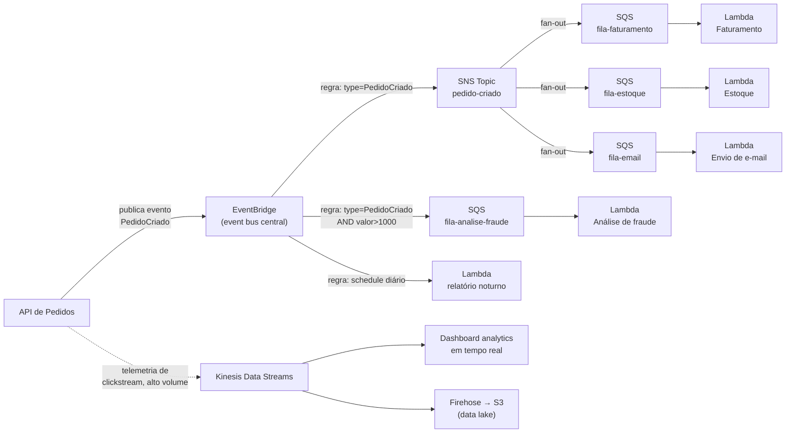

> [!abstract] TL;DR
> Não existe "o serviço de mensageria certo" — existe a pergunta certa. Precisa que **um** trabalhador processe cada mensagem e ela desapareça da fila? SQS. Precisa que **vários** consumidores independentes recebam a mesma notificação? SNS (ou SNS→SQS pra cada um ter sua própria fila durável). Precisa rotear eventos por conteúdo, cruzar fronteira de SaaS, ou agendar em cron? EventBridge. Precisa de um **stream** ordenado, replayável, que múltiplos leitores percorrem no próprio ritmo — analytics em tempo real, sourcing de eventos, ingestão de sensores? Kinesis Data Streams ou MSK (Kafka gerenciado). A árvore de decisão deste capstone amarra os quatro galhos-irmãos anteriores e finalmente distingue "fila de trabalho" de "stream de dados" — a confusão mais cara de gastar dinheiro (e sono) resolvendo tarde.

## O problema: mensageria não é uma coisa só

Depois de ler as quatro notas anteriores deste galho, é tentador achar que "mensageria gerenciada" é uma prateleira única: você escolhe um serviço, aponta produtor e consumidor pra ele, pronto. Mas SQS, SNS, EventBridge, Kinesis e MSK resolvem problemas genuinamente diferentes — tão diferentes que confundi-los não é um detalhe de implementação, é escolher a ferramenta errada pra tarefa errada e descobrir isso só quando a fatura ou o incidente chegam.

A pergunta que separa tudo é simples de enunciar e traiçoeira de responder sob pressão de prazo: **você está distribuindo trabalho, ou você está publicando um fato que aconteceu?**

- "Processar este pedido" é trabalho. Alguém faz, a tarefa termina, ela some da fila.
- "O pedido #4521 foi criado" é um fato. Pode interessar ao faturamento, ao estoque, ao time de fraude, ao dashboard de BI — e nenhum deles "consome" o fato a ponto de apagá-lo pros outros.

Essa distinção — que a nota [[03-Dominios/Tecnologia/Cloud/13 - Mensageria e eventos gerenciados/05 - Padrões event-driven na cloud|Padrões event-driven na cloud]] já tocou nos padrões de composição — é o eixo central desta árvore. E há um terceiro eixo que os dois primeiros não cobrem: quando o "fato" não é um evento isolado, mas uma sequência ordenada de milhares por segundo que precisa ser relida do início por processos diferentes (streaming), a resposta não é fila nem pub/sub — é log distribuído.

## A árvore de decisão

```mermaid
flowchart TD
    Start["Preciso comunicar<br/>componentes de forma assíncrona"] --> Q1{"É trabalho a<br/>distribuir entre<br/>workers, com<br/>garantia de<br/>'só um processa'?"}

    Q1 -->|Sim| Q1b{"Preciso de<br/>ordem estrita<br/>e sem duplicata?"}
    Q1b -->|Sim| SQSFIFO["SQS FIFO<br/>(fila de trabalho ordenada)"]
    Q1b -->|Não| SQSSTD["SQS Standard<br/>(fila de trabalho, at-least-once)"]

    Q1 -->|Não| Q2{"Preciso notificar<br/>N consumidores<br/>independentes<br/>do MESMO evento?"}

    Q2 -->|Sim, fan-out simples| SNS["SNS<br/>(pub/sub, push,<br/>sem retenção própria)"]
    Q2 -->|Sim, cada consumidor<br/>precisa de fila durável| SNSSQS["SNS → SQS por consumidor<br/>(fan-out durável)"]

    Q2 -->|Não| Q3{"Preciso rotear por<br/>CONTEÚDO/schema,<br/>cruzar fronteira de<br/>SaaS de terceiros,<br/>ou agendar (cron)?"}

    Q3 -->|Sim| EB["EventBridge<br/>(event bus + roteamento<br/>por regra + schedule)"]

    Q3 -->|Não| Q4{"É um STREAM: alto<br/>volume ordenado,<br/>múltiplos leitores<br/>relendo/replay,<br/>janelas de tempo?"}

    Q4 -->|Sim, nativo AWS,<br/>sem operar cluster| Kinesis["Kinesis Data Streams<br/>(streaming gerenciado, shard-based)"]
    Q4 -->|Sim, preciso do<br/>ecossistema Kafka<br/>(Connect, Streams, ksqlDB)<br/>ou portabilidade| MSK["MSK<br/>(Kafka gerenciado,<br/>broker-based)"]

    Q4 -->|Não, é request-response<br/>síncrono disfarçado| Anti["🚫 Nenhum destes —<br/>use API síncrona<br/>(REST/gRPC)"]

    style SQSFIFO fill:#2d5016,color:#fff
    style SQSSTD fill:#2d5016,color:#fff
    style SNS fill:#1a4d6d,color:#fff
    style SNSSQS fill:#1a4d6d,color:#fff
    style EB fill:#6d4d1a,color:#fff
    style Kinesis fill:#5a1a6d,color:#fff
    style MSK fill:#5a1a6d,color:#fff
    style Anti fill:#6d1a1a,color:#fff
```

Repare que a árvore tem quatro perguntas, não uma — e as três primeiras já foram respondidas em detalhe pelas notas [[03-Dominios/Tecnologia/Cloud/13 - Mensageria e eventos gerenciados/02 - SQS a fundo|SQS a fundo]], [[03-Dominios/Tecnologia/Cloud/13 - Mensageria e eventos gerenciados/03 - SNS e pub-sub|SNS e pub/sub]] e [[03-Dominios/Tecnologia/Cloud/13 - Mensageria e eventos gerenciados/04 - EventBridge e o event bus|EventBridge e o event bus]]. A quarta pergunta — streaming — é nova neste capstone, porque ela pertence a uma família de serviço com modelo mental diferente: não é fila (mensagem sai quando processada), é **log** (mensagem fica, cada leitor guarda sua própria posição de leitura).

## Fila vs. stream: o modelo mental que a árvore esconde

A diferença entre "fila de trabalho" (SQS) e "stream" (Kinesis/MSK) não é só de throughput — é de **quem é dono do cursor de leitura**.

Numa fila, o serviço é dono do cursor: quando você lê uma mensagem, ela fica invisível pros outros (visibility timeout) e, quando você confirma o processamento, ela é apagada. Não existe "reler a mensagem #500" depois que ela foi processada — ela já era.

Num stream, **você** é dono do cursor. O dado fica no stream pelo período de retenção configurado (default 24h em Kinesis, ajustável até 8760h/365 dias via `IncreaseStreamRetentionPeriod`; em Kafka/MSK, tipicamente dias a semanas, configurável por tópico). Cinco aplicações diferentes podem ler o mesmo stream do início ao fim, cada uma no seu próprio ritmo, sem interferir nas outras — porque nenhuma delas "consome" o dado, elas só avançam o próprio ponteiro.

> [!info] Verificado 2026-07-24 — limites de Kinesis Data Streams (podem mudar; confira a página oficial antes de dimensionar)
> - Retenção: mínimo 24h, ajustável até 8760h (365 dias) via `IncreaseStreamRetentionPeriod`.
> - Modo provisionado: cada shard suporta até 1.000 registros/s ou 1 MB/s de escrita, e até 2 MB/s de leitura (ou 2.000 registros/s com enhanced fan-out por consumidor registrado).
> - Modo on-demand: por padrão 4 MB/s de escrita e 8 MB/s de leitura por stream, escalando automaticamente até 200 MB/s de escrita / 400 MB/s de leitura na maioria das regiões (até 10 GB/s de escrita / 20 GB/s de leitura em regiões selecionadas, sob solicitação).
> - Tamanho máximo de registro: 10 MiB antes de base64.
> Fonte: docs.aws.amazon.com/streams/latest/dev/service-sizes-and-limits.html

Isso é o oposto do modelo de fila, e é por isso que "trocar SQS por Kinesis pra aguentar mais volume" é um erro conceitual comum: Kinesis não é "SQS mais rápido", é um serviço pra um problema diferente (múltiplos leitores independentes relendo um log ordenado), não pra distribuir trabalho entre workers concorrentes.

## MSK: quando o ecossistema Kafka pesa mais que a conveniência

Kinesis e MSK resolvem o mesmo problema de fundo — streaming ordenado e replayável — mas com trade-offs diferentes:

Kinesis é *shard-based*, nativo da AWS, com API proprietária simples e cobrança por shard-hora (ou por throughput no modo on-demand). Você não gerencia broker nenhum.

O Amazon MSK (Managed Streaming for Apache Kafka) roda **Apache Kafka de verdade** — o mesmo binário open-source, com as mesmas APIs, o mesmo ecossistema (Kafka Connect, Kafka Streams, ksqlDB de terceiros, clientes em toda linguagem que já existe pra Kafka). A AWS gerencias os planos de controle (criar/atualizar/deletar cluster) e você opera o plano de dados via API Kafka padrão — inclusive substituindo brokers com falha automaticamente. O MSK tem dois formatos: **Provisioned** (você dimensiona brokers e storage) e **Serverless** (a AWS escala o cluster por você, cobrando por throughput).

A escolha entre os dois raramente é sobre performance bruta — é sobre **portabilidade e ecossistema**. Se seu time já usa Kafka on-prem e quer migrar pra nuvem sem reescrever nada, ou se você depende de uma ferramenta do ecossistema Kafka (Debezium pra CDC, Kafka Streams pra processamento, um conector específico), MSK é a escolha natural: o contrato é Kafka, não AWS. Se você está começando do zero na AWS e não tem esse investimento prévio, Kinesis costuma ser operacionalmente mais simples — menos conceitos (sem ZooKeeper/KRaft, sem partições-vs-consumer-groups pra aprender), integração nativa mais direta com Lambda, Firehose e Data Streams Analytics.

> [!info] Verificado 2026-07-24 — Amazon MSK usa KRaft (sucessor do ZooKeeper) para metadados de cluster, incluído sem custo adicional e sem gestão extra da sua parte; o MSK Provisioned oferece brokers Standard e Express, o MSK Serverless abstrai o dimensionamento de brokers inteiramente. Fonte: docs.aws.amazon.com/msk/latest/developerguide/what-is-msk.html

## A tabela comparativa

| Serviço | Modelo de entrega | Ordering | Retenção | Escala | Caso de uso típico | Custo (modelo) |
|---|---|---|---|---|---|---|
| **SQS Standard** | Fila, at-least-once, 1 consumidor "vence" por mensagem | Best-effort (pode reordenar) | Até 14 dias (padrão 4 dias) | Throughput quase ilimitado, auto-scale | Distribuir trabalho entre workers | Por requisição (milhão de requests) |
| **SQS FIFO** | Fila, exactly-once dentro do grupo | Estrita por `MessageGroupId` | Até 14 dias | Até 3.000 msg/s com batching (por API) | Trabalho que exige ordem (pagamentos, transições de estado) | Por requisição, ligeiramente mais caro que Standard |
| **SNS** | Pub/sub, push, sem fila própria | Não garantida (FIFO topic à parte garante por grupo) | Sem retenção — não entregue vira erro/DLQ | Alto, milhões de publicações | Fan-out de notificação (1 evento → N sistemas) | Por publicação + por entrega |
| **EventBridge** | Event bus, roteamento por regra/pattern-match | Não garantida globalmente | Sem retenção própria (replay via Archive à parte) | Alto; latência de roteamento tipicamente sub-segundo | Roteamento por conteúdo, integração SaaS (150+ parceiros), agendamento (Scheduler) | Por evento publicado |
| **Kinesis Data Streams** | Log/stream, múltiplos leitores independentes | Estrita por partition key | 24h a 365 dias (configurável) | Por shard: até 1.000 rec/s ou 1 MB/s escrita (provisionado); on-demand auto-scale | Analytics em tempo real, ingestão de telemetria, sourcing de eventos | Por shard-hora ou por throughput (on-demand) |
| **MSK (Kafka gerenciado)** | Log/stream, protocolo Kafka nativo | Estrita por partição | Configurável por tópico (dias a indefinido) | Depende do broker/partições; escala manual (Provisioned) ou automática (Serverless) | Migração de Kafka on-prem, pipelines que dependem do ecossistema Kafka | Por broker-hora + storage (Provisioned) ou por throughput (Serverless) |

> [!info] Verificado 2026-07-24 — retenção padrão do SQS é 4 dias, máxima 14 dias (`MessageRetentionPeriod`); throughput de SQS FIFO padrão é até 3.000 mensagens/s por API com batching, ou 300/s sem batching. Confira docs.aws.amazon.com/AWSSimpleQueueService/latest/SQSDeveloperGuide/sqs-limits.html antes de dimensionar, pois quotas evoluem.

## O padrão combinado numa arquitetura real

Sistemas de produção raramente usam um serviço isolado — eles compõem. Um exemplo comum de e-commerce que amarra tudo que este galho cobriu:



Note a divisão de trabalho: o **EventBridge** decide QUEM deve saber sobre o evento (roteamento por conteúdo — só a fila de fraude recebe pedidos acima de R$1.000). O **SNS** faz o fan-out puro pra três sistemas que sempre querem saber de todo pedido criado. Cada **SQS** downstream dá a cada consumidor sua própria fila durável — se o serviço de e-mail cair por uma hora, a fila acumula e ele processa o backlog quando voltar, sem perder nada e sem travar faturamento ou estoque. E, em paralelo, o **Kinesis** trata de um fluxo completamente diferente — telemetria de alto volume que não é "um evento de negócio", é uma torrente contínua de cliques que alimenta dashboards em tempo real e um data lake.

Essa combinação é exatamente o padrão que a nota [[03-Dominios/Tecnologia/Cloud/13 - Mensageria e eventos gerenciados/05 - Padrões event-driven na cloud|Padrões event-driven na cloud]] descreveu em nível de arquitetura — aqui ele aparece com os quatro serviços plugados nos seus papéis certos, e o stream ao lado, sem se misturar com o fluxo de eventos de negócio.

## Anti-padrões: onde essa árvore costuma ser ignorada

> [!warning] Fila pra request-response síncrono
> Se o chamador precisa de uma resposta imediata pra continuar (ex.: "valide este CPF e me diga se é válido antes de eu prosseguir o checkout"), enfiar isso numa fila SQS com um Lambda do outro lado — e o cliente fazendo polling até a resposta aparecer — só adiciona latência e complexidade sem ganho nenhum. Isso é trabalho pra uma API síncrona (REST/gRPC), não pra mensageria assíncrona. Mensageria resolve desacoplamento temporal; se você não pode se dar ao luxo de desacoplar no tempo, ela é a ferramenta errada.

> [!warning] EventBridge pra alto throughput de streaming
> EventBridge foi desenhado pra roteamento de eventos discretos de negócio — "pedido criado", "usuário cadastrado" — não pra ingerir milhões de registros de telemetria por segundo. Ele não tem o modelo de partição/shard do Kinesis e não foi pensado pra esse volume nem pra replay de longo prazo. Se o volume é de streaming, é streaming — vai pro Kinesis ou MSK, não pro event bus.

> [!warning] Ignorar idempotência em qualquer um destes
> SQS Standard entrega **at-least-once** — a mesma mensagem pode chegar duplicada, mesmo depois de processada com sucesso (uma falha de rede na confirmação basta). SNS também não garante entrega única. Kinesis e Kafka podem reentregar em cenários de rebalanceamento de consumer group. Se o handler do outro lado não for idempotente — processar a mesma mensagem duas vezes não pode cobrar o cliente duas vezes, não pode enviar o e-mail duas vezes — qualquer um destes serviços vai, mais cedo ou mais tarde, causar um bug de duplicação em produção. A defesa é sempre a mesma: chave de idempotência no handler, não confiança cega na entrega exatamente-uma-vez do serviço (mesmo o SQS FIFO garante isso só dentro do mesmo `MessageGroupId`, e streaming em geral não garante nada disso).

## A lente DigitalOcean: honestidade sobre o que falta

Esta é a hora de ser direto: a DigitalOcean **não tem** equivalentes nativos a SQS, SNS ou EventBridge. Não existe um "DO Queue" gerenciado, não existe um "DO Pub/Sub" gerenciado, não existe um event bus gerenciado com roteamento por conteúdo e catálogo de integrações SaaS. O que a DigitalOcean oferece nesse espaço é o **DigitalOcean Managed Kafka** — um produto dentro da linha de Managed Databases, ou seja, a DO trata Kafka como "mais um banco gerenciado", não como uma família própria de serviços de mensageria.

O Managed Kafka da DO cobre exatamente a fatia de "streaming ordenado, replayável" — a mesma faixa de problema que Kinesis/MSK resolvem na AWS — com clusters de 3, 6, 9 ou 15 brokers, escalonamento vertical e horizontal, failover automático e Schema Registry integrado. Mas ele **não cobre** fila de trabalho simples nem pub/sub leve nem roteamento por conteúdo — pra isso, na DO, você tem duas opções, e ambas exigem mais trabalho manual do seu lado:

1. **Usar o próprio Kafka como fila/pub-sub**, aceitando a complexidade conceitual de tópicos/partições/consumer-groups pra um caso de uso que na AWS levaria 5 minutos com uma fila SQS. Funciona, mas é usar um caminhão pra levar uma sacola de pão.
2. **Combinar Managed Kafka com DigitalOcean Functions** (o serverless da DO) pra simular o padrão "evento dispara função" — só que sem o roteamento declarativo por conteúdo do EventBridge, sem o catálogo de 150+ integrações SaaS, e sem um SNS pra fan-out simples. Você escreve o roteamento na mão, dentro da função ou num consumidor dedicado.

Na prática: se o seu produto vive na DigitalOcean e o volume não justifica Kafka, o caminho mais realista é rodar você mesmo uma fila leve (RabbitMQ auto-gerenciado num Droplet, ou um serviço gerenciado de terceiros) — o que é exatamente o tipo de trabalho operacional que a AWS tira do seu prato com SQS/SNS/EventBridge por centavos de dólar por milhão de mensagens. Não é um julgamento de valor sobre a DO — é reconhecer que "mensageria gerenciada completa" ainda é um diferencial real de catálogo da AWS neste ponto específico, do jeito que a nota [[03-Dominios/Tecnologia/Cloud/13 - Mensageria e eventos gerenciados/01 - Por que mensageria na nuvem|Por que mensageria na nuvem]] já havia sinalizado ao abrir o galho.

## Azure e GCP: tradução de nomes

Só pra orientação — sem hands-on nestas notas:

| Conceito | AWS | Azure | GCP |
|---|---|---|---|
| Fila de trabalho | SQS | Azure Queue Storage / Service Bus Queues | Cloud Tasks |
| Pub/sub | SNS | Service Bus Topics / Event Grid | Pub/Sub |
| Event bus com roteamento | EventBridge | Event Grid | Eventarc |
| Streaming (log distribuído) | Kinesis Data Streams | Event Hubs | Pub/Sub (Lite) |
| Kafka gerenciado | MSK | HDInsight Kafka / Event Hubs (protocolo Kafka) | Managed Service for Apache Kafka |

## O que vem a seguir

Este capstone fecha o galho de mensageria: você agora sabe distinguir fila de pub/sub de event bus de stream, e sabe compor os quatro numa arquitetura real. Mas todo esse desacoplamento assíncrono resolve a comunicação *entre componentes internos* — falta a porta de entrada síncrona, onde clientes externos (apps mobile, front-ends, parceiros de API) batem na sua arquitetura pela primeira vez. Esse é o assunto do próximo galho: API Gateway, autenticação de borda, rate limiting e o ponto onde requisição síncrona vira, muitas vezes, o primeiro evento que dispara toda essa maquinaria assíncrona que você acabou de aprender a montar.

## Fontes

- Amazon Kinesis Data Streams — Quotas and limits: https://docs.aws.amazon.com/streams/latest/dev/service-sizes-and-limits.html
- Amazon MSK Developer Guide — What is Amazon MSK: https://docs.aws.amazon.com/msk/latest/developerguide/what-is-msk.html
- Amazon SQS Developer Guide — Quotas: https://docs.aws.amazon.com/AWSSimpleQueueService/latest/SQSDeveloperGuide/sqs-limits.html
- DigitalOcean Managed Databases for Apache Kafka: https://www.digitalocean.com/products/managed-databases-kafka
- DigitalOcean Functions: https://docs.digitalocean.com/products/functions/
