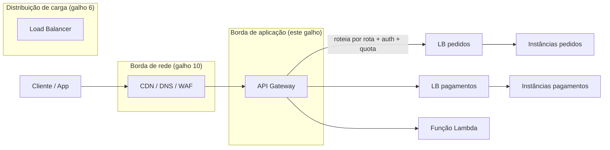
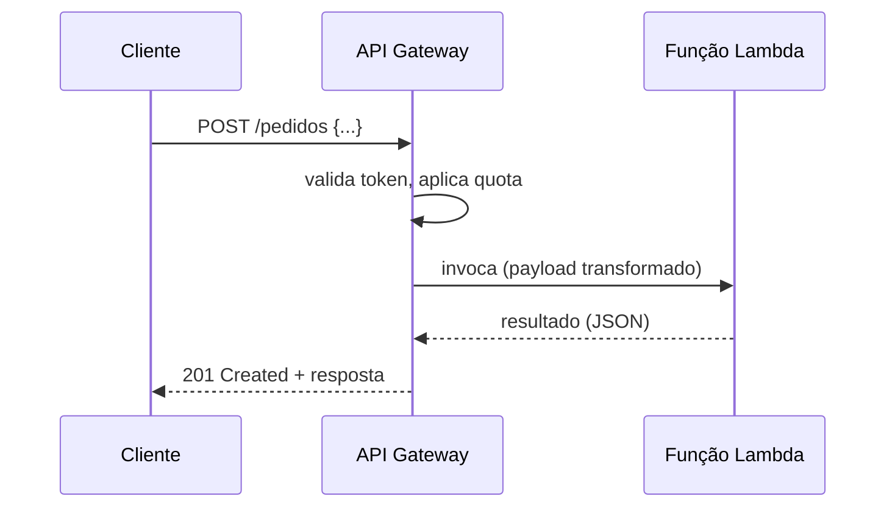

> [!abstract] TL;DR
> Quando você tem vários microsserviços ou funções expostos, cada cliente não deveria precisar saber o endereço de cada um — nem cada serviço deveria reimplementar autenticação, rate limit e logging por conta própria. O API Gateway é a fachada única: um proxy reverso gerenciado que fica na borda de aplicação, entende a *semântica* das suas rotas HTTP (não só pacotes) e centraliza roteamento, auth, throttling, transformação e observabilidade. Ele é diferente do Load Balancer (que distribui carga sem saber o que é uma "rota") e diferente da CDN (que fica na borda de *rede*, mais perto do usuário). Na AWS, é o Amazon API Gateway — rico e é o trigger padrão do Lambda. Na DigitalOcean, não existe um serviço homônimo: o roteamento por path do App Platform e os HTTP triggers das Functions cobrem parte do problema; o resto pede um ALB, um CDN na frente, ou um gateway de terceiros.

## O problema: N serviços, um cliente confuso

Imagine que você passou os últimos meses quebrando aquele monolito em pedaços menores. Hoje você tem um serviço de `pedidos`, outro de `pagamentos`, outro de `usuários`, mais um punhado de funções Lambda para tarefas assíncronas. Do ponto de vista da arquitetura, ótimo — cada peça evolui, escala e falha de forma independente. Do ponto de vista de quem *consome* essa API — o app mobile, o frontend web, o parceiro externo — isso é um pesadelo.

Por quê? Porque agora o cliente precisa saber:

- O endereço (DNS, porta) de cada um dos N serviços.
- Como se autenticar em cada um — e torcer para que todos implementem o mesmo esquema de auth do mesmo jeito.
- Que cada serviço pode ter uma política de rate limit diferente, ou nenhuma.
- Como lidar com TLS, CORS e versionamento de API em cada porta de entrada separadamente.

E do lado de dentro, cada equipe de serviço reimplementa a mesma coisa: validação de token, contagem de requisições por cliente, logging estruturado, tratamento de CORS. É código de infraestrutura copiado e colado (ou pior, divergente) por todo o backend. Se você já leu a nota sobre o Load Balancer em [[03-Dominios/Tecnologia/Cloud/06 - Compute II — elasticidade e balanceamento/index|Compute II]], vai reconhecer o padrão: assim como o LB tirou da aplicação a responsabilidade de saber *quais instâncias* estão de pé, o API Gateway tira da aplicação a responsabilidade de saber *como* uma requisição de API deve ser tratada antes de chegar à lógica de negócio.

A pergunta natural é: por que não resolver isso com um Load Balancer, que a essa altura você já conhece bem? Porque o LB e o API Gateway resolvem problemas em camadas diferentes — e entender essa diferença é o primeiro passo para saber quando você precisa de cada um.

## O conceito: um proxy que entende API, não só tráfego

Um **API Gateway** é um proxy reverso gerenciado, posicionado na borda de aplicação, que funciona como a porta de entrada única (o "front door") para um conjunto de APIs. Ele intercepta cada requisição HTTP antes que ela chegue aos serviços de backend e aplica um conjunto de políticas:

- **Roteamento**: direciona `/pedidos/*` para o serviço de pedidos, `/pagamentos/*` para o de pagamentos — cada rota pode apontar para um backend HTTP, uma função serverless ou até um serviço AWS diretamente.
- **Autenticação e autorização**: valida tokens, chaves de API ou integra com um provedor de identidade *antes* de a requisição tocar no backend.
- **Throttling e quotas**: limita quantas requisições por segundo (ou por período) um cliente pode fazer.
- **Transformação de payload**: reescreve headers, converte formatos, monta a resposta que o cliente espera a partir do que o backend devolveu.
- **Caching de respostas**: evita bater no backend para requisições repetidas e idênticas.
- **Observabilidade**: centraliza logs, métricas e tracing de todas as chamadas de API num único ponto.

O detalhe que separa o API Gateway de um proxy genérico é que ele opera na **camada de aplicação com semântica de API**: ele entende métodos HTTP, paths, parâmetros de query, corpo JSON, esquemas de autenticação — não apenas "distribuir pacotes entre backends saudáveis". Essa é exatamente a fronteira que separa API Gateway de Load Balancer.

### API Gateway vs Load Balancer vs borda de rede (CDN)

É fácil confundir os três, porque todos ficam "na frente" de alguma coisa. Mas eles resolvem problemas em camadas diferentes da requisição:



- O **Load Balancer** (visto em [[03-Dominios/Tecnologia/Cloud/06 - Compute II — elasticidade e balanceamento/index|Compute II]]) distribui carga entre réplicas de *um mesmo serviço*, olhando saúde (health checks) e, no máximo, algumas regras L7 simples (path, host header). Ele não sabe o que é uma "quota de cliente" nem valida um JWT.
- O **API Gateway** entende a API como um contrato: sabe que `GET /pedidos/{id}` é uma rota diferente de `POST /pedidos`, sabe quem é o chamador, sabe quantas requisições esse chamador já fez neste minuto. Ele pode rotear para *vários* serviços diferentes (cada um com seu próprio LB atrás), não só balancear réplicas de um único serviço.
- A **borda de rede** — DNS, CDN, TLS na borda, WAF, vista em [[03-Dominios/Tecnologia/Cloud/10 - DNS, CDN e borda/index|DNS, CDN e borda]] — fica um passo *antes* de tudo isso, mais perto geograficamente do usuário. Ela decide "para qual região/edge location essa requisição vai" e filtra tráfego malicioso antes mesmo de saber qual API está sendo chamada. A CDN pode até cachear respostas estáticas sem nunca acionar o API Gateway.

Uma forma de fixar a hierarquia: a borda de rede pergunta "de onde vem essa requisição e ela é segura?"; o API Gateway pergunta "quem é você, o que você quer fazer, e pode?"; o Load Balancer pergunta "qual das minhas réplicas saudáveis vai atender isso agora?".

## O casamento com serverless

Se você leu a nota sobre [[03-Dominios/Tecnologia/Cloud/11 - Serverless e FaaS — Lambda a fundo/index|Serverless e FaaS]], já viu de relance que funções Lambda precisam de um jeito de receber requisições HTTP síncronas — afinal, uma função por si só não escuta numa porta TCP esperando conexões. O API Gateway é justamente esse trigger: ele recebe a requisição HTTP, invoca a função Lambda de forma síncrona, espera a resposta e a devolve ao cliente.

Essa combinação (API Gateway + Lambda) é, provavelmente, o padrão mais comum de "API totalmente serverless" na AWS: sem servidor algum para gerenciar, escala automática nos dois lados, cobrança por requisição. O Gateway cuida de tudo que é "borda de API" — auth, throttling, validação de schema — e delega para a função só a lógica de negócio.



Vale registrar a fronteira: o *mecanismo* de rate limiting como conceito (algoritmos de token bucket, sliding window etc.) pertence ao domínio de Comunicação entre Sistemas — aqui você vê a *encarnação* desse mecanismo na borda de API gerenciada. O mesmo vale para autenticação e autorização: OAuth, OIDC e JWT como protocolo são tema do domínio Auth e Identidade; aqui a pergunta é só "onde, na cadeia da requisição, esse gateway intercepta e valida isso".

## A lente dupla: AWS e DigitalOcean

### AWS: Amazon API Gateway

O Amazon API Gateway é o serviço "canônico" de API Gateway gerenciado na nuvem pública — e é deliberadamente rico. Segundo a documentação oficial, ele cria e gerencia três tipos de API:

- **REST APIs** — o formato mais antigo e mais configurável, com recursos como validação de request/response, transformação de payload via templates e múltiplos estágios de deploy.
- **HTTP APIs** — uma versão mais enxuta e mais barata, pensada para casos de proxy simples (menos features, latência menor, custo menor).
- **WebSocket APIs** — para comunicação full-duplex e stateful, útil em chats, notificações em tempo real e dashboards ao vivo.

Entre as funcionalidades que a AWS lista para o serviço estão: autenticação flexível (políticas IAM, funções Lambda como autorizador customizado, integração com Cognito), *canary releases* para rollout seguro de mudanças, logging e métricas via CloudWatch, suporte a domínios customizados, integração nativa com AWS WAF para proteção contra exploits comuns, e tracing distribuído via X-Ray. Ele funciona como a peça "voltada para o app" da infraestrutura serverless da AWS, lado a lado com o Lambda.

Uma visão rápida de quando usar cada tipo (a nota seguinte deste galho detalha a anatomia de cada um):

| Tipo de API | Protocolo | Estado | Uso típico |
|---|---|---|---|
| REST API | HTTP | Stateless | APIs com validação de schema rica, transformação de payload avançada, cache por estágio |
| HTTP API | HTTP | Stateless | Proxy simples para Lambda/backend HTTP, menor latência e custo |
| WebSocket API | WebSocket | Stateful, full-duplex | Chats, notificações em tempo real, dashboards ao vivo |

### DigitalOcean: sem API Gateway gerenciado dedicado

Aqui a honestidade importa mais do que a analogia fácil: a DigitalOcean **não oferece um serviço com o nome e o escopo de "API Gateway"** equivalente ao da AWS. Não existe um produto dedicado para roteamento semântico de API com autenticação, quotas por cliente e transformação de payload configuráveis como serviço gerenciado standalone.

O que existe, e cobre parte do problema:

- **App Platform — ingress rules**: no App Spec do App Platform, a seção `ingress.rules` permite rotear requisições de um mesmo domínio para componentes diferentes com base em prefixo ou correspondência exata de path (por exemplo, `/api` vai para o serviço de API, `/` vai para o site estático). Dá para reescrever o path antes de encaminhar (`rewrite`) e configurar CORS por regra. Isso resolve a parte de *roteamento por rota entre múltiplos componentes*, mas não entrega throttling por cliente, autenticação centralizada rica nem transformação de payload no nível do Amazon API Gateway.
- **Functions — HTTP triggers**: as DigitalOcean Functions expõem endpoints HTTP diretamente, mas sem uma camada de gateway configurável separada (quotas, autorizadores customizados, cache de resposta) — a função responde diretamente ao invólucro HTTP que a plataforma fornece.

> [!info] Verificado em 2026-07-24
> A tentativa de confirmar detalhes mais finos dos HTTP triggers das DigitalOcean Functions (`docs.digitalocean.com/products/functions/reference/http-triggers/`) retornou 404 no momento da pesquisa — a estrutura de URLs da doc pode ter mudado. O comportamento geral (função exposta via HTTP sem gateway dedicado configurável) é consistente com a documentação de App Platform e com o posicionamento de mercado da DigitalOcean (PaaS simplificado, não hyperscaler feature-complete). Vale reconferir a doc oficial antes de qualquer decisão de arquitetura que dependa desse detalhe.

Na prática, quando um time na DigitalOcean precisa de comportamento de API Gateway "de verdade" — throttling por API key, autorização customizada rica, cache de resposta por rota, transformação de payload — as saídas comuns são: colocar um Application Load Balancer ou uma CDN na frente com regras próprias, ou trazer um gateway de terceiros (Kong, Tyk, ou até o próprio Nginx/Envoy configurado como gateway) rodando em um Droplet ou container gerenciado. Isso não é "pior" por definição — é uma escolha consciente de trade-off: a DigitalOcean prioriza simplicidade e previsibilidade de custo sobre a superfície de features de um hyperscaler.

## Casos práticos

### Caso 1 — expondo três serviços por trás de um único domínio

Voltando ao exemplo do início: `pedidos`, `pagamentos` e `usuários`. Sem gateway, o cliente bateria em três hosts diferentes (`pedidos.minhaempresa.com`, `pagamentos.minhaempresa.com`...) e teria que lidar com TLS, CORS e auth em cada um. Com um API Gateway na frente, o cliente vê um único host — `api.minhaempresa.com` — e o roteamento por path decide para onde cada requisição vai.

Uma definição de API Gateway na AWS (formato OpenAPI reduzido, só para ilustrar a ideia — não é um manifesto de deploy completo) ficaria assim:

```yaml
paths:
  /pedidos/{proxy+}:
    x-amazon-apigateway-any-method:
      x-amazon-apigateway-integration:
        type: http_proxy
        uri: "http://lb-pedidos.interno/{proxy}"
  /pagamentos/{proxy+}:
    x-amazon-apigateway-any-method:
      x-amazon-apigateway-integration:
        type: http_proxy
        uri: "http://lb-pagamentos.interno/{proxy}"
  /usuarios/{proxy+}:
    x-amazon-apigateway-any-method:
      x-amazon-apigateway-integration:
        type: aws_proxy
        uri: "arn:aws:lambda:us-east-1:123456789012:function:usuarios"
```

Repare que `/pedidos` e `/pagamentos` apontam para um Load Balancer interno (que por sua vez distribui entre réplicas — a camada vista em [[03-Dominios/Tecnologia/Cloud/06 - Compute II — elasticidade e balanceamento/index|Compute II]]), enquanto `/usuarios` vai direto para uma função Lambda. O cliente não sabe — nem precisa saber — que por trás da mesma fachada existem arquiteturas completamente diferentes.

### Caso 2 — o mesmo problema no App Platform da DigitalOcean

O equivalente aproximado no App Spec do App Platform usa `ingress.rules`:

```yaml
ingress:
  rules:
    - match:
        path:
          prefix: /pedidos
      component:
        name: servico-pedidos
    - match:
        path:
          prefix: /pagamentos
      component:
        name: servico-pagamentos
    - match:
        path:
          prefix: /usuarios
      component:
        name: funcao-usuarios
```

A estrutura parece quase igual — e para o problema de *roteamento por path*, é. A diferença aparece no que falta: não há, nesse nível, um jeito nativo de dizer "clientes do tier gratuito só podem fazer 100 requisições por minuto na rota `/pedidos`" ou "valide este JWT com esta chave pública antes de rotear". Isso teria que ser implementado dentro de cada serviço, ou resolvido com uma camada adicional na frente (um WAF/CDN com regras próprias, ou um gateway de terceiros).

### Caso 3 — API Gateway como trigger síncrono do Lambda

Este é o caso mais comum de todos na AWS: uma função Lambda que processa um pedido de checkout, exposta como `POST /checkout`. O API Gateway:

1. Recebe a requisição HTTP.
2. Valida o token JWT (via autorizador nativo ou uma função Lambda dedicada a validar tokens).
3. Verifica se o cliente não estourou a quota configurada.
4. Transforma o corpo da requisição no formato de evento que o Lambda espera.
5. Invoca o Lambda de forma síncrona e espera a resposta.
6. Devolve a resposta ao cliente, já no formato HTTP esperado.

Sem o Gateway, a função Lambda precisaria ser invocada por outro mecanismo (SDK, fila) — ela não tem, por conta própria, um endpoint HTTP público. É por isso que, na prática, "Lambda exposto na internet" quase sempre significa "Lambda atrás de um API Gateway" (ou, em cenários mais simples, atrás de uma Function URL — um mecanismo mais enxuto que a AWS oferece para invocação HTTP direta, sem todas as features de gateway).

## Tabela de tradução: Azure e GCP

Só para orientação de vocabulário — sem hands-on aqui, apenas mapeamento de nomes entre provedores:

| Conceito | AWS | Azure | GCP | DigitalOcean |
|---|---|---|---|---|
| API Gateway gerenciado (rico) | Amazon API Gateway | Azure API Management (APIM) | Cloud API Gateway (Apigee para casos avançados) | — (sem equivalente dedicado) |
| Trigger HTTP para função serverless | API Gateway + Lambda | APIM / Function App HTTP trigger | Cloud API Gateway + Cloud Functions | HTTP trigger nativo das Functions |
| Roteamento por path em PaaS | — (é papel do API GW) | Azure App Service / Front Door | Cloud Run + Load Balancer | App Platform (`ingress.rules`) |
| Gateway "enterprise" (governança de API, monetização) | Amazon API Gateway + AWS Marketplace | Azure APIM (tier Premium) | Apigee | — (terceiros: Kong, Tyk) |

> [!warning] Armadilhas comuns
> - **Confundir API Gateway com Load Balancer.** Colocar um LB na frente de vários serviços e chamar isso de "gateway" funciona até você precisar de autenticação centralizada ou quota por cliente — aí a ausência de semântica de API cobra o preço.
> - **Achar que a DigitalOcean tem paridade de features com o Amazon API Gateway só porque tem "rotas".** O `ingress.rules` do App Platform resolve roteamento; não resolve throttling por cliente nem autorizadores customizados sem trabalho adicional.
> - **Tratar rate limiting e autenticação como "features do gateway" sem entender o mecanismo por trás.** O gateway é onde essas políticas são *aplicadas* na borda — o algoritmo de throttling e o protocolo de auth têm vida própria em outros domínios (Comunicação entre Sistemas e Auth e Identidade, respectivamente).
> - **Esquecer que HTTP APIs e REST APIs do Amazon API Gateway não são intercambiáveis silenciosamente.** São produtos com features, preço e limites diferentes — a escolha entre eles é uma decisão de arquitetura, não um detalhe de configuração.

## O que vem a seguir

Esta nota ficou no "por quê" e na fronteira conceitual. A próxima nota deste galho mergulha na anatomia interna de um API Gateway — os tipos de API (REST vs HTTP vs WebSocket na AWS), os componentes de uma configuração (recursos, métodos, integrações, estágios de deploy) e como esses conceitos se comparam entre provedores. Depois disso, o galho segue para throttling e caching a fundo, autorização na borda de API, e fecha com a comparação honesta de alternativas na DigitalOcean e um capstone compondo a borda de API ponta a ponta.

## Fontes

- Amazon API Gateway — What is Amazon API Gateway?: https://docs.aws.amazon.com/apigateway/latest/developerguide/welcome.html
- DigitalOcean App Platform — App Spec Reference (ingress rules): https://docs.digitalocean.com/products/app-platform/reference/app-spec/
- DigitalOcean App Platform — visão geral: https://docs.digitalocean.com/products/app-platform/
- DigitalOcean Functions — visão geral: https://docs.digitalocean.com/products/functions/
