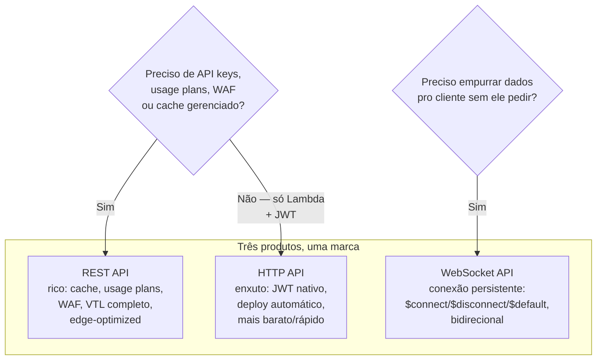
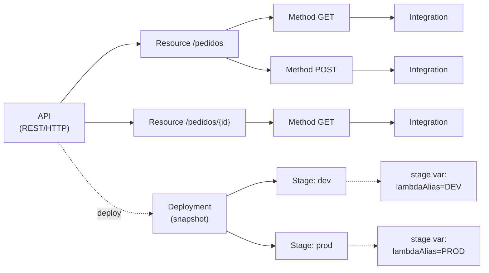
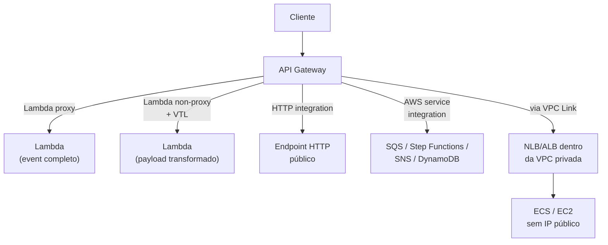

> [!abstract] TL;DR
> O Amazon API Gateway não é um serviço só — são três produtos com anatomias diferentes debaixo do mesmo nome. **REST API** é o modelo rico e caro (cache, usage plans, WAF, mock integrations). **HTTP API** é o modelo enxuto e barato, otimizado pra proxy de Lambda com JWT nativo. **WebSocket API** é o modelo pra conexões persistentes bidirecionais (chat, jogos, feeds em tempo real). Por baixo dos três, a anatomia se repete: **resources** (paths) contêm **methods** (verbos HTTP), cada method aponta pra uma **integration** (o que acontece de fato — Lambda, HTTP, outro serviço AWS, ou um VPC link pra dentro de uma VPC privada), e tudo isso só vira URL invocável quando você faz **deploy** pra um **stage**. Na DigitalOcean, não existe equivalente direto: App Platform tem rotas por componente (path → serviço), mas sem mapping templates, sem stages versionados, sem os três sabores — é routing, não um API Gateway gerenciado.

## O problema: qual API Gateway eu quero, afinal?

Quando você abre o console do Amazon API Gateway pela primeira vez, ele pergunta uma coisa que parece boba mas não é: "Build" de qual tipo? REST API, HTTP API, ou WebSocket API. É tentador escolher no piloto automático — "eu quero uma API REST, óbvio, marca REST API" — e é exatamente aí que a maioria erra. Porque "REST API" aqui não é a categoria genérica (uma API que segue princípios REST); é um **produto específico** da AWS, com um conjunto de features e um preço que o diferenciam de um outro produto chamado "HTTP API", que também serve APIs RESTful, só que mais simples e mais barato.

É como se uma locadora de carros tivesse dois modelos chamados "Sedan Completo" e "Sedan", e "Sedan" não fosse uma versão reduzida de nome — fosse literalmente outro contrato, outra anatomia de acessórios, outro preço por km. Escolher errado não quebra nada no dia 1, mas te deixa pagando por ar-condicionado que você nunca liga, ou percebendo tarde demais que falta o porta-malas (leia-se: WAF, ou usage plans) que você precisava.

A pergunta certa não é "qual API Gateway é melhor" — é **o que a sua API precisa que só um dos três oferece**. Esta nota resolve essa pergunta e depois abre o capô: como cada peça (resource, method, stage, integration) se encaixa, não importa qual dos três você escolheu.

## Os três produtos: REST, HTTP, WebSocket

### REST API — o modelo rico

REST API foi o produto original do API Gateway (2015) e continua sendo o mais completo. Segundo a documentação oficial da AWS, REST APIs suportam mais features que HTTP APIs — a troca é preço: HTTP API foi desenhado com features mínimas justamente pra custar menos.

O que só o REST API tem, e que pode ser decisivo:

- **Usage plans e API keys** — cada cliente ganha uma chave, você limita quantas requisições por segundo/dia cada um pode fazer, e cobra por tier. Se você vende acesso à sua API como produto, é aqui.
- **Caching gerenciado** — o gateway guarda a resposta por um TTL configurável, sem você escrever uma linha de cache.
- **AWS WAF integrado** — regras de firewall de aplicação direto na borda da API.
- **Request validation e mapping templates completos (VTL)** — você pode transformar o payload antes dele chegar no backend, sem código extra.
- **Endpoint edge-optimized** — a API roteada pela CloudFront globalmente (a rede de borda que a nota [[03-Dominios/Tecnologia/Cloud/10 - DNS, CDN e borda/04 - TLS e certificados na borda|TLS e certificados na borda]] já te apresentou por outro ângulo).
- **Canary release, mock integrations, private endpoints, resource policies.**

O preço dessa riqueza é complexidade de configuração e um custo por milhão de requisições mais alto que o HTTP API.

### HTTP API — o modelo enxuto

Lançado em 2019, o HTTP API foi desenhado pra resolver o caso mais comum de todos: uma função Lambda (ou um serviço HTTP) atrás de uma URL, com autenticação JWT, sem cache gerenciado, sem usage plans. Segundo a AWS, ele é mais barato e tem latência menor que o REST API pro mesmo tipo de tráfego.

O que o HTTP API ganha que o REST API não tem nativamente:

- **Autorizador JWT nativo** — você aponta o issuer (Cognito, Auth0, Keycloak) e o gateway valida o token sozinho, sem Lambda authorizer.
- **Deploy automático** — mudou a configuração, já está no ar; não existe o passo manual de "Deploy API" que o REST API exige.
- **Preço menor por chamada** e latência menor.

O que ele **não tem** — e isso importa na hora de escolher: API keys, per-client throttling avançado, WAF, mapping templates de corpo de requisição (só mapeamento de parâmetros), caching gerenciado, X-Ray tracing, resource policies.

Na prática: se sua API é "Lambda atrás de uma URL, com JWT, sem cliente pagando por tier de uso" — HTTP API. Se você precisa de qualquer um dos itens acima, REST API.

> [!info] Verificado 2026-07-24 — preços mudam, reconfirme antes de orçar
> A ordem de grandeza que vale guardar: HTTP API historicamente custa cerca de **70% menos por milhão de requisições** que REST API na mesma região, e ambos cobram por requisição processada (não por tempo de conexão, diferente de WebSocket API, que cobra por minuto de conexão além das mensagens). Os valores exatos por milhão de requisições variam por região e mudam com frequência suficiente pra não valer fixar o número aqui — confira em `aws.amazon.com/api-gateway/pricing/` antes de orçar qualquer coisa.

### WebSocket API — o modelo de conexão persistente

Os dois anteriores são request/response: o cliente pede, o servidor responde, a conexão morre. WebSocket é outra categoria inteira — a conexão fica **aberta**, e tanto cliente quanto servidor podem mandar mensagens a qualquer momento, sem que um precise "pedir" pro outro falar.

Segundo a documentação da AWS, uma WebSocket API é uma coleção de **rotas** integradas com endpoints HTTP, funções Lambda ou outros serviços AWS, com comportamento bidirecional: o cliente manda mensagens pro serviço, e o serviço manda mensagens de volta pro cliente **de forma independente**, sem exigir que o cliente peça primeiro. É o desenho natural pra chat, jogos multiplayer, colaboração em tempo real (cursor de outro usuário se movendo na tela) e feeds de dados financeiros.

Vale insistir no porquê disso ser uma categoria à parte, não uma variação de configuração das outras duas: numa API REST ou HTTP comum, o servidor é sempre reativo — ele só fala quando alguém pergunta. Pra simular "tempo real" nesse modelo, o cliente é obrigado a fazer polling (perguntar de novo a cada N segundos, "mudou alguma coisa?"), o que desperdiça requisições na maior parte das vezes em que a resposta é "não". WebSocket inverte isso: a conexão TCP fica aberta o tempo todo, e o servidor pode escrever nela a qualquer momento, sem que nenhuma pergunta tenha sido feita antes. É a diferença entre checar a caixa de correio a cada cinco minutos e ter alguém batendo na sua porta assim que a carta chega.

A anatomia de rotas é diferente: em vez de `GET /pedidos`, você tem rotas especiais de ciclo de vida da conexão —

- `$connect` — disparada quando o cliente abre a conexão (é aqui que você autentica).
- `$disconnect` — disparada quando a conexão cai (nem sempre de forma confiável — TCP não garante aviso de desconexão).
- `$default` — pega qualquer mensagem que não bateu com nenhuma rota customizada.
- Rotas customizadas (`sendMessage`, `joinRoom`) — você define o nome da rota olhando pra um campo do payload JSON recebido.

Cada conexão ganha um `connectionId`, e o backend usa a API de "Management" do gateway pra mandar mensagens de volta pra uma conexão específica a qualquer momento — não só como resposta a uma mensagem recebida.

> [!tip] Assista: AWS API Gateway Tutorial for Beginners — HTTP vs REST vs WebSocket APIs
> **Canal:** AWS Made Easy | **Duração:** ~16min | **Idioma:** EN
>
> Passa pelos três produtos na mesma ordem desta nota e ainda amarra a diferença de deploy/stages: por que o HTTP API "publica sozinho" enquanto o REST API exige o passo manual de deploy pra stage. Trecho de destaque [09:59]: *"firstly what is HTTP API — it's basically a RESTful API, you can build very simple RESTful API which has very lower latency and low cost than REST APIs [...] the REST API comes with additional features at the cost of extra cost and latency."*
>
> 🎬 [Assistir no YouTube](https://www.youtube.com/watch?v=e3YnsfkaEEU)



## Anatomia comum: resources, methods, stages

Debaixo dos três produtos (com nuances), a mesma estrutura de árvore se repete.

**Resources** são os caminhos da sua API — o `/pedidos`, o `/pedidos/{id}`, o `/pedidos/{id}/itens`. Cada segmento vira um nó numa árvore; `{id}` é um path parameter. No REST API você monta essa árvore explicitamente (resource por resource); no HTTP API você geralmente define rotas direto (`GET /pedidos/{id}`) sem o passo intermediário.

**Methods** são os verbos amarrados a um resource: `GET /pedidos`, `POST /pedidos`, `DELETE /pedidos/{id}`. Cada method tem sua própria configuração de autorização, validação de request e integração de backend — dois methods no mesmo resource podem ir pra lugares completamente diferentes.

**Stages** são o que transforma a configuração num endpoint invocável. Você pode editar resources e methods à vontade, mas nada muda pro mundo até você fazer **deploy** desse snapshot pra um stage — `dev`, `staging`, `prod`. Cada stage tem sua própria URL (`https://{api-id}.execute-api.{region}.amazonaws.com/{stage}`), suas próprias configurações de throttling, cache e logging, e pode apontar pra uma **deployment** (snapshot versionado) diferente das outras. É por isso que você pode ter `prod` rodando a deployment de ontem enquanto testa a de hoje em `staging`, sem tocar em produção.

**Stage variables** são pares chave-valor por stage que você referencia na configuração da API — o exemplo clássico é a stage variable `lambdaAlias` que faz o mesmo resource, no stage `prod`, invocar a versão `PROD` da função Lambda, e no stage `dev`, invocar `DEV`, sem duplicar nenhuma configuração de resource. A nota [[03-Dominios/Tecnologia/Cloud/11 - Serverless e FaaS — Lambda a fundo/02 - Anatomia de uma função Lambda|Anatomia de uma função Lambda]] já te mostrou aliases e versões do lado do Lambda; stage variables são a ponte que liga esse conceito ao gateway.



> [!warning] "Salvei a configuração" não é "está no ar"
> No REST API, esquecer de fazer deploy depois de editar um method é o erro de iniciante mais comum — você testa no console, funciona, mas a URL pública continua servindo a versão antiga porque ninguém "publicou" a mudança pro stage. O HTTP API evita isso com deploy automático, o que é conveniente até você perceber que também tira de você o controle fino de "essa mudança só vai pro ar quando eu mandar".

## Integration types: o que acontece depois do method

O method decide **qual verbo, em qual path**. A integration decide **o que roda de verdade**. É a peça mais variável da anatomia, e a AWS te dá quatro sabores principais.

**Lambda proxy integration** é hoje o padrão de fato. O gateway empacota a requisição inteira — método, path, headers, query string, body, informações do cliente — num objeto JSON único (`event`) e entrega pra sua função Lambda. Sua função devolve um objeto com `statusCode`, `headers` e `body`, e o gateway repassa isso quase sem tocar. Vantagem: toda a lógica de parsing fica no código, não em configuração; você testa a função isoladamente sem precisar do gateway no meio.

**Lambda non-proxy (custom) integration** existe pro caso oposto: você quer que o *gateway* transforme o request antes de chegar na função, usando **mapping templates** escritos em VTL (Velocity Template Language, a mesma linguagem de template que o Java carrega há décadas). Isso desacopla o formato que o cliente manda do formato que sua função espera — útil quando o backend é legado e você não pode mudar o contrato dele, só a casca que o expõe. O custo é real: você agora depura VTL, uma linguagem obscura, em vez de código na sua stack normal.

```
## Exemplo de mapping template VTL — non-proxy integration
## Transforma um POST JSON do cliente num formato que o backend legado espera

#set($inputRoot = $input.path('$'))
{
  "clienteId": "$inputRoot.customer_id",
  "itens": [
    #foreach($item in $inputRoot.items)
    {
      "sku": "$item.sku",
      "quantidade": $item.qty
    }#if($foreach.hasNext),#end
    #end
  ],
  "origem": "api-gateway",
  "ip_cliente": "$context.identity.sourceIp"
}
```

> [!tip] Assista: Mapping Templates in API Gateways
> **Canal:** Binary Guy | **Duração:** ~6min | **Idioma:** EN
>
> Demonstração curta e prática de exatamente essa non-proxy integration: no console da AWS, criando o mapping template em VTL que reescreve o body do request antes dele chegar no backend — o mesmo mecanismo por trás do exemplo acima. Trecho de destaque [01:29]: *"has to be written in VTL, virtual is a velocity template language developed by Apache — this is necessary because API Gateway only accepts these mapping templates in [VTL]."*
>
> 🎬 [Assistir no YouTube](https://www.youtube.com/watch?v=-_nYddYkd7M)

**HTTP integration** aponta o method direto pra um endpoint HTTP existente — um serviço em EC2, um container em ECS com IP público, ou até uma API de terceiros. O gateway vira um proxy reverso configurável na frente desse endpoint, com autenticação, throttling e cache do lado do gateway, sem tocar no código do backend.

**AWS service integration** é a integração menos óbvia e mais poderosa: o method chama **diretamente** uma API de outro serviço AWS — SQS, Step Functions, SNS, DynamoDB — sem passar por Lambda nenhuma. Um `POST /pedidos` pode virar uma chamada `SendMessage` pra uma fila SQS, configurada inteiramente em mapping template, zero linhas de código rodando entre o cliente e a fila. Isso elimina cold start e custo de invocação Lambda pra operações que são puro "recebe e enfileira" — mas também move lógica de negócio pra dentro de configuração YAML/VTL, o que fica difícil de testar e versionar como código de verdade.

**VPC Link** não é bem um quinto tipo de integration — é um mecanismo que os tipos acima usam pra alcançar recursos **privados** dentro de uma VPC (sem IP público), tipicamente atrás de um Network Load Balancer ou Application Load Balancer. Sem VPC Link, o API Gateway só enxerga endpoints públicos ou funções Lambda; com ele, você expõe publicamente uma API cujo backend real — um ECS Fargate, um EC2, um serviço legado — nunca tem uma rota direta pra internet. Segundo a documentação da AWS, tanto REST API quanto HTTP API suportam integrações privadas via NLB; HTTP API também suporta ALB e AWS Cloud Map diretamente.



## Request/response: mapping templates, passthrough, CORS

Três decisões práticas aparecem toda vez que você configura uma integration não-proxy:

**Mapping templates (VTL)** — como visto acima, transformam o corpo da requisição/resposta. Você escreve um template por `Content-Type` (tipicamente `application/json`), e o API Gateway aplica esse template antes de repassar o payload.

**Payload passthrough** — quando não existe um template pro `Content-Type` recebido, você decide o comportamento: `WHEN_NO_MATCH` (passa o body como está, sem transformar), `WHEN_NO_TEMPLATES` (só passa se não existir *nenhum* template configurado) ou `NEVER` (rejeita qualquer content-type sem template exato). Essa configuração, que parece um detalhe, decide se sua API é permissiva com clientes mal comportados ou estritamente controlada.

**CORS (Cross-Origin Resource Sharing)** — se sua API é chamada por JavaScript rodando num browser em outro domínio, o browser exige que o servidor declare explicitamente quais origens, métodos e headers são permitidos, via um preflight `OPTIONS`. No REST API você configura CORS resource por resource (o console gera o method `OPTIONS` e os headers pra você, mas ainda é manual). No HTTP API existe uma configuração de CORS **nativa e centralizada** por API inteira, mais simples de manter.

> [!warning] CORS mal configurado é o erro mais reportado por quem começa com API Gateway
> O sintoma clássico: a chamada funciona perfeitamente no Postman/curl, mas falha silenciosamente no browser com um erro genérico de rede no console — não um erro HTTP com corpo explicando o que houve. Isso acontece porque o preflight `OPTIONS` nunca chega a acionar sua integration de verdade (ele é respondido pelo próprio gateway, ou nem é tratado); o browser bloqueia a chamada real antes dela sair, e o erro que aparece é do browser, não da sua API. Regra prática: sempre que uma chamada funciona em ferramenta de linha de comando mas falha só no browser, o primeiro suspeito é CORS, não autenticação.

## Deployment: stage, canary, custom domain

Já vimos que stage é onde a configuração vira URL. Dois recursos avançados de deployment merecem nota:

**Canary release** (exclusivo do REST API) deixa você mandar uma fração do tráfego de um stage pra uma deployment nova, enquanto o resto continua na antiga — 5% do tráfego de `prod` vai pra versão nova, você observa métricas de erro, e só promove pra 100% se estiver tudo certo. É o mesmo princípio de canary que aparece em deploys de infraestrutura em geral, aplicado na camada de API.

**Custom domain name + ACM** — por padrão, sua API vive numa URL feia (`https://abc123.execute-api.us-east-1.amazonaws.com/prod`). Pra servir em `api.seudominio.com`, você registra um custom domain no API Gateway, associa um certificado TLS emitido pelo AWS Certificate Manager (a mesma peça que a nota [[03-Dominios/Tecnologia/Cloud/10 - DNS, CDN e borda/04 - TLS e certificados na borda|TLS e certificados na borda]] detalhou), e aponta um registro DNS pro domínio gerado pelo gateway. REST API edge-optimized exige o certificado em `us-east-1` (porque roteia via CloudFront, que é global); REST API regional e HTTP API exigem o certificado na mesma região da API.

## Na prática: criando cada tipo via CLI

Ver a anatomia em comandos reais ajuda a fixar que resource, method, integration e stage são objetos distintos, não sinônimos.

Criar uma HTTP API com integração Lambda proxy — o caminho mais curto de todos, porque o HTTP API tem um atalho (`--target`) que cria rota, integração e deploy automático numa tacada só:

```bash
aws apigatewayv2 create-api \
  --name "pedidos-http-api" \
  --protocol-type HTTP \
  --target arn:aws:lambda:us-east-1:123456789012:function:processarPedido
```

O mesmo resultado, montado explicitamente (rota + integração Lambda proxy separadas), pra deixar visível que são dois objetos:

```bash
API_ID=$(aws apigatewayv2 create-api --name "pedidos-http-api" \
  --protocol-type HTTP --query 'ApiId' --output text)

INTEGRATION_ID=$(aws apigatewayv2 create-integration \
  --api-id $API_ID \
  --integration-type AWS_PROXY \
  --integration-uri arn:aws:lambda:us-east-1:123456789012:function:processarPedido \
  --payload-format-version 2.0 \
  --query 'IntegrationId' --output text)

aws apigatewayv2 create-route \
  --api-id $API_ID \
  --route-key "POST /pedidos" \
  --target integrations/$INTEGRATION_ID
```

O mesmo em REST API mostra a anatomia completa — resource, method e integration como três chamadas distintas, e um quarto passo obrigatório (`create-deployment`) que o HTTP API dispensa:

```bash
API_ID=$(aws apigateway create-rest-api --name "pedidos-rest-api" \
  --query 'id' --output text)

ROOT_ID=$(aws apigateway get-resources --rest-api-id $API_ID \
  --query 'items[0].id' --output text)

RESOURCE_ID=$(aws apigateway create-resource --rest-api-id $API_ID \
  --parent-id $ROOT_ID --path-part "pedidos" \
  --query 'id' --output text)

aws apigateway put-method --rest-api-id $API_ID \
  --resource-id $RESOURCE_ID --http-method POST \
  --authorization-type NONE

aws apigateway put-integration --rest-api-id $API_ID \
  --resource-id $RESOURCE_ID --http-method POST \
  --type AWS_PROXY --integration-http-method POST \
  --uri arn:aws:apigateway:us-east-1:lambda:path/2015-03-31/functions/arn:aws:lambda:us-east-1:123456789012:function:processarPedido/invocations

# sem este passo, nada acima está no ar:
aws apigateway create-deployment --rest-api-id $API_ID --stage-name prod
```

Configurar um custom domain com certificado ACM, ligando de volta na nota de TLS na borda:

```bash
CERT_ARN=$(aws acm request-certificate \
  --domain-name api.seudominio.com \
  --validation-method DNS \
  --query 'CertificateArn' --output text)

# depois de validar o certificado via registro DNS...
aws apigatewayv2 create-domain-name \
  --domain-name api.seudominio.com \
  --domain-name-configurations CertificateArn=$CERT_ARN,EndpointType=REGIONAL

aws apigatewayv2 create-api-mapping \
  --domain-name api.seudominio.com \
  --api-id $API_ID \
  --stage '$default'
```

## Observabilidade: o que cada produto te deixa ver

Vale marcar uma diferença que só aparece quando algo dá errado em produção. REST API tem **execution logs** — um nível de log que registra, requisição por requisição, cada etapa que o gateway executou internamente (recebeu o request, aplicou o mapping template, chamou a integration, recebeu a resposta, aplicou o mapping de saída). É o nível de detalhe que salva quando um mapping template VTL está silenciosamente descartando um campo. HTTP API não tem esse nível — só access logs (quem chamou o quê, quando, com que status) e métricas agregadas no CloudWatch. Junto com a ausência de X-Ray tracing nativo no HTTP API, isso significa que depurar um HTTP API problemático depende mais de instrumentação dentro da própria Lambda (logs estruturados, correlação por request ID) do que de recursos do gateway em si. É outro fio da troca "mais simples, mais barato" — você abre mão de visibilidade que o REST API dá de graça.

## Casos práticos

**Backend for Frontend simples com Lambda**: HTTP API + Lambda proxy integration + JWT authorizer apontando pro Cognito. Configuração mínima, deploy automático, custo baixo — o caso mais comum em aplicações novas. A troca consciente aqui é abrir mão de execution logs e X-Ray nativo; a equipe compensa com logging estruturado dentro da própria função.

**API vendida como produto pra terceiros**: REST API, com usage plans e API keys por cliente, cache habilitado pros endpoints de leitura mais pesados, e WAF na frente pra filtrar tráfego malicioso antes de gastar invocação Lambda. Aqui a decisão não é sobre qual é "melhor" — é que usage plans e WAF simplesmente não existem no HTTP API, então a escolha está feita antes mesmo de comparar preço.

**Dashboard colaborativo com cursor ao vivo**: WebSocket API — o servidor precisa empurrar a posição do cursor de outros usuários sem que o cliente fique fazendo polling. A rota `$connect` valida o token de autenticação (via Lambda authorizer, já que WebSocket API não tem JWT authorizer nativo) e registra o `connectionId` numa tabela DynamoDB associada à sala; quando outro usuário se move, uma Lambda varre essa tabela e usa a API de management (`postToConnection`) pra empurrar a atualização a cada conexão da sala, sem que nenhum cliente tenha pedido nada.

**Expor um sistema legado em VPC privada, sem tocar no código dele**: REST ou HTTP API com HTTP integration ou AWS service integration via VPC Link até um NLB na frente do sistema legado, com mapping template VTL fazendo a tradução de formato na borda. Esse é o caso onde a "riqueza" do REST API paga o próprio preço — sem VTL, você precisaria de uma Lambda só pra traduzir formato, adicionando cold start e mais uma peça pra manter.

## A lente DigitalOcean: routing, não API Gateway

A DigitalOcean **não tem** um produto equivalente ao API Gateway. O que existe é o roteamento de **App Platform**: cada app pode ter múltiplos componentes (services, functions), e você define regras de rota — um `path` prefix (`/api`, `/admin`) mapeado pra um componente específico — na especificação do app. É path-based routing simples, resolvido antes do tráfego chegar no componente.

> [!info] Verificado 2026-07-24 — confirme antes de usar em produção
> Não consegui confirmar via WebFetch os detalhes atuais de configuração de rotas do App Platform (a página específica retornou 404 na consulta). O que é estável e documentado publicamente há anos: App Platform roteia por `path` prefix pra componentes dentro do mesmo app, sem mapping templates, sem stages versionados, sem os três produtos (REST/HTTP/WebSocket) separados — é um roteador de tráfego HTTP simples, não um gateway de API configurável. Reconfirme na doc oficial (`docs.digitalocean.com/products/app-platform/`) se for depender disso.

O que falta, com honestidade, comparado ao API Gateway:

- **Sem VTL, sem mapping templates** — não há como transformar payload na borda; a transformação é sempre responsabilidade do seu código.
- **Sem stages versionados com deploy independente** — App Platform tem ambientes de deploy (preview/produção via git), mas não a granularidade de "stage `dev` e `prod` da mesma API com stage variables distintas".
- **Sem usage plans/API keys nativos** — rate limiting por cliente e chaves de API não são um recurso do roteamento; se você precisa disso na DO, resolve na aplicação ou coloca algo na frente.
- **Sem VPC Link equivalente** — App Platform já roda dentro da malha da DO; o problema que o VPC Link resolve (expor publicamente um backend que não tem IP público) se resolve diferente lá, não com essa mesma peça.

Pra quem precisa de um API Gateway "de verdade" na DigitalOcean, a saída real é compor: um Application Load Balancer ou um CloudFront na frente (mesmo hospedando o backend na DO), ou um gateway de terceiros (Kong, Traefik, ou um serviço gerenciado de outro provedor) rodando como mais um componente. Isso volta a aparecer, com mais profundidade, na nota sobre a borda de API na DigitalOcean deste mesmo galho.

## Tabela de tradução — Azure e GCP

| Conceito | AWS | Azure | GCP | DigitalOcean |
|---|---|---|---|---|
| API Gateway gerenciado rico | API Gateway (REST API) | Azure API Management | Apigee / API Gateway | — (sem paridade) |
| API Gateway enxuto/serverless | API Gateway (HTTP API) | Azure Functions HTTP trigger + APIM Consumption | Cloud Endpoints | App Platform routing (parcial) |
| Conexão persistente/bidirecional | API Gateway (WebSocket API) | Azure Web PubSub | — (via Cloud Run + libs) | — |
| Roteamento por path simples | ALB / CloudFront | Application Gateway | Cloud Load Balancing (URL maps) | App Platform routes |

## O que vem a seguir

Ter os três tipos e a anatomia mapeados resolve "o que existe". A próxima pergunta é operacional: como você protege essa borda de tráfego excessivo e reduz latência com cache — throttling, quotas e caching são o assunto da próxima nota deste galho. Depois dela, a pergunta vira "quem pode entrar": autenticação e autorização na borda de API, onde o JWT authorizer do HTTP API mencionado aqui ganha profundidade.

## Fontes

- AWS. "Choose between REST APIs and HTTP APIs." https://docs.aws.amazon.com/apigateway/latest/developerguide/http-api-vs-rest.html
- AWS. "API Gateway WebSocket APIs." https://docs.aws.amazon.com/apigateway/latest/developerguide/apigateway-websocket-api.html
- AWS. "Set up Lambda proxy integrations in API Gateway." https://docs.aws.amazon.com/apigateway/latest/developerguide/set-up-lambda-proxy-integrations.html
- AWS. "Set up data transformations for REST APIs in API Gateway." https://docs.aws.amazon.com/apigateway/latest/developerguide/rest-api-data-transformations.html
- AWS. "Configure a Network Load Balancer to use with an HTTP API." https://docs.aws.amazon.com/apigateway/latest/developerguide/http-api-develop-integrations-private.html
- AWS. "Working with AWS Lambda proxy integrations for HTTP APIs." https://docs.aws.amazon.com/apigateway/latest/developerguide/http-api-develop-integrations-lambda.html
- AWS. "Set up canary release deployments for REST APIs." https://docs.aws.amazon.com/apigateway/latest/developerguide/canary-release.html
- AWS. "Custom domain names for REST APIs in API Gateway." https://docs.aws.amazon.com/apigateway/latest/developerguide/how-to-custom-domains.html
- DigitalOcean. "App Platform Product documentation." https://docs.digitalocean.com/products/app-platform/
