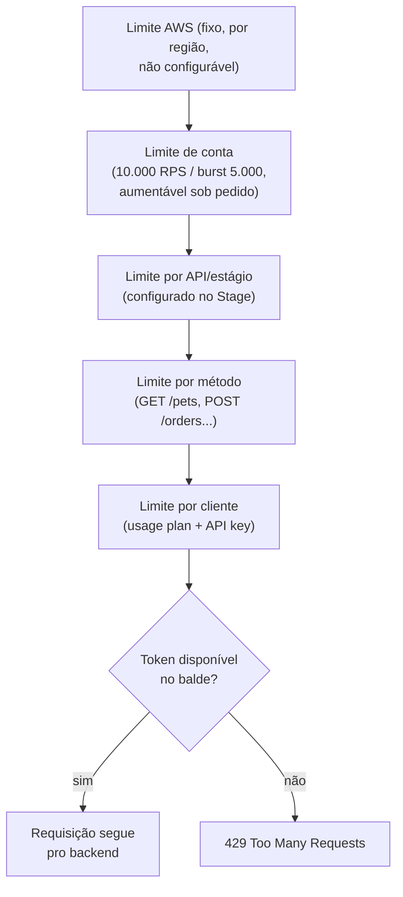
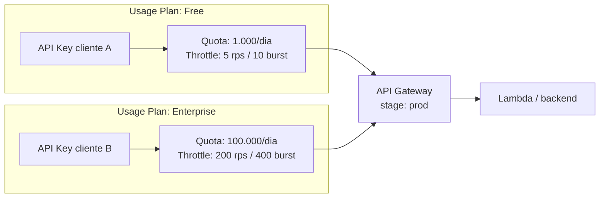
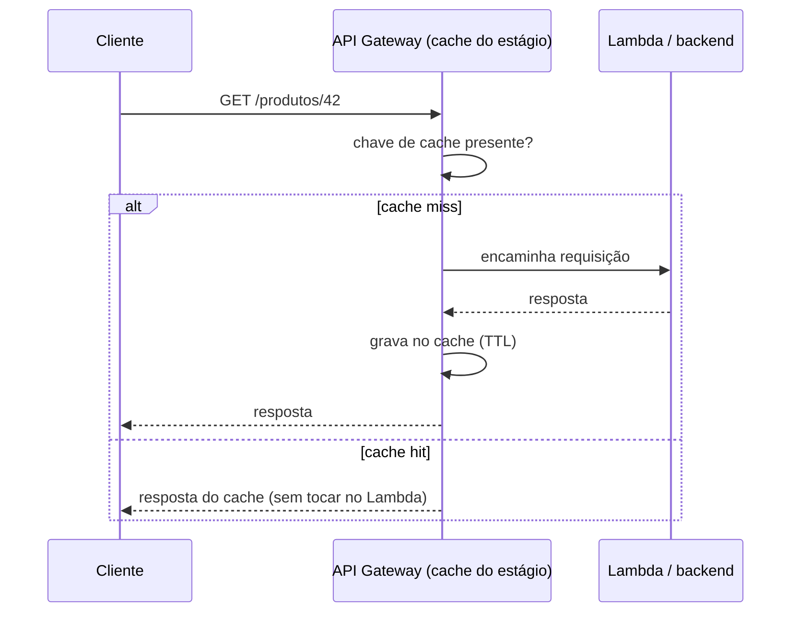
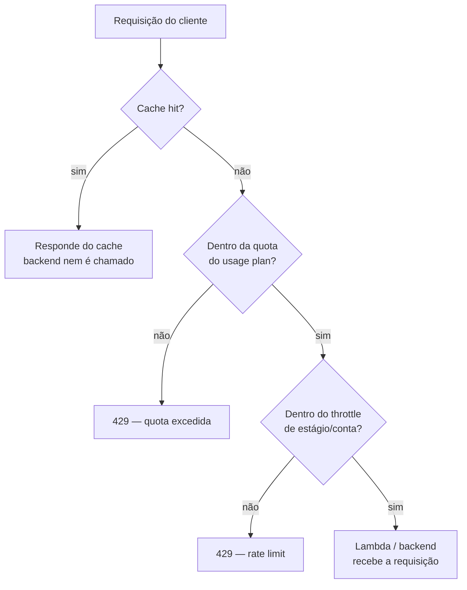

> [!abstract] TL;DR
> O API Gateway protege o backend com três mecanismos independentes: **throttling** (limita a taxa de requisições, devolve `429` quando estoura), **usage plans + API keys** (quotas e limites por cliente, a base de monetização de APIs) e **response caching** (guarda respostas de `GET` por um TTL, evitando bater no backend a cada chamada). Os três operam na camada de API, gerenciados — a DigitalOcean não tem equivalente rico nativo; o que existe ali se resolve na aplicação ou com terceiros.

## O problema: seu backend não é infinito

Imagine que a API que você projetou nas notas anteriores está no ar. Ela funciona. E então, um cliente mal comportado — um script com bug, um loop sem backoff, ou simplesmente um pico de tráfego legítimo — começa a disparar milhares de requisições por segundo. O Lambda por trás da API escala, sim, mas escala vinculado a *algo*: concorrência reservada, conexões de banco de dados, orçamento. Sem uma barreira na borda, esse tráfego atravessa o Gateway inteiro e bate direto no seu ponto mais frágil.

A pergunta que este mecanismo responde não é "como deixo minha API rápida" — é "como eu decido, na porta de entrada, quem passa, quanto passa, e o que devolvo pra quem não passa, antes que o backend precise se preocupar com isso". Três respostas complementares: throttling (limite bruto de taxa), usage plans (limite por identidade de cliente) e caching (evitar até fazer a pergunta de novo).

## Throttling: o balde de fichas na porta

O API Gateway usa o algoritmo de **token bucket** para throttling — cada requisição consome um "token"; os tokens são repostos numa taxa constante (a *rate*, em requisições por segundo em regime estável); o balde tem uma capacidade máxima (o *burst*), que absorve picos curtos sem rejeitar nada. Quando o balde esvazia, novas requisições recebem `429 Too Many Requests`.

> [!info] Verificado 2026-07-24 — via docs.aws.amazon.com/apigateway
> O limite de conta padrão, por região, é **10.000 requisições por segundo (RPS)** em regime estável, com capacidade de burst de **5.000 requisições**. Em algumas regiões mais novas (África/Cidade do Cabo, Europa/Milão, Ásia-Pacífico/Jacarta, Oriente Médio/EAU, Ásia-Pacífico/Hyderabad e Melbourne, Europa/Espanha e Zurique, Israel/Tel Aviv, Canadá Oeste/Calgary, Ásia-Pacífico/Malásia e Tailândia, México Central) o padrão cai para **2.500 RPS / 1.250 de burst**. O limite de conta pode ser aumentado sob pedido; limites por API/estágio/método nunca podem ultrapassá-lo.

O throttling é aplicado em quatro camadas, cada uma um teto para a de baixo:



A ordem de aplicação (da documentação oficial) é: primeiro o limite por cliente/método definido no usage plan, depois o limite por método no estágio, depois o limite de conta, depois o limite regional fixo da AWS. Ou seja — o cliente pode ser barrado bem antes de chegar perto do teto da conta inteira.

Você configura throttling em dois lugares:
- **No estágio (Stage)**: um alvo de rate/burst que vale por padrão para todos os métodos daquele estágio — a defesa "geral" do backend.
- **No usage plan**: um alvo específico por cliente (API key), que pode ser mais restritivo que o do estágio.

```bash
# Throttle no nível do estágio (todos os métodos, salvo override)
aws apigateway update-stage \
  --rest-api-id a1b2c3 \
  --stage-name prod \
  --patch-operations \
    op=replace,path=/*/*/throttling/rateLimit,value=500 \
    op=replace,path=/*/*/throttling/burstLimit,value=200

# Override por método específico (ex.: endpoint caro precisa de teto menor)
aws apigateway update-stage \
  --rest-api-id a1b2c3 \
  --stage-name prod \
  --patch-operations \
    op=replace,path=/~1orders/POST/throttling/rateLimit,value=50 \
    op=replace,path=/~1orders/POST/throttling/burstLimit,value=10
```

> [!warning] Throttling é best-effort, não uma garantia
> A própria documentação da AWS é explícita: throttles e quotas "são aplicados em regime de melhor esforço e devem ser vistos como alvos, não como tetos garantidos". Em picos muito abruptos, alguma sobrecarga pode escapar do limite configurado antes que o throttling reaja. Não trate o throttling do API Gateway como controle de custo rígido — para isso, combine com AWS Budgets (alertas) e, se o objetivo for bloquear abuso de verdade, com AWS WAF na frente.

### Fazendo as contas: rate vs. burst na prática

Vale desmontar o que "rate 5, burst 10" realmente significa, porque a intuição de "10 requisições por segundo" está errada. Rate é a velocidade de reposição do balde; burst é o tamanho máximo do balde. Com rate=5 e burst=10:

- O balde começa cheio: 10 tokens disponíveis.
- Um cliente que dispara 10 requisições no mesmo instante consome o balde inteiro — todas passam.
- A 11ª requisição, no mesmo segundo, recebe `429` — o balde está vazio e a reposição (5 tokens/segundo) ainda não alcançou.
- Um segundo depois, há 5 tokens novos disponíveis (limitado ao teto de 10) — o cliente pode fazer até 5 requisições extras.

Isso significa que um cliente "bem comportado" que manda exatamente 5 req/s nunca esbarra no limite — o balde nunca esvazia. Já um cliente "rajado" (silêncio, depois uma explosão de chamadas) pode escoar o burst inteiro de uma vez, e só depois cair no ritmo do rate. É esse comportamento que faz do token bucket uma escolha melhor do que um contador fixo por janela: ele absorve picos legítimos (o usuário que dá refresh na página duas vezes seguidas) sem simplesmente rejeitar tudo que passa de N por segundo cravado.

> [!tip] Assista: Como fazer throttling da minha API no Amazon API Gateway? Usage Plan e API Keys
> **Canal:** Douglas Mugnos | **Duração:** ~7min | **Idioma:** PT-BR
>
> Cobre a mesma distinção rate/burst desta nota com outra analogia (o que "cabe correndo" versus "o que roda em paralelo"), e mostra como o usage plan identifica o cliente via header — a peça que a nota detalha a seguir com `x-api-key`. Trecho de destaque [03:00]: *"o rate é o máximo de requests em um... que pode encaminhar em um segundo, já o burst é quantas requests eu tenho rodando em paralelo... uma coisa é quanto você pode inserir naquele segundo, e já o burst é quanto você pode estar rodando em paralelo naquele determinado tempo."*
>
> 🎬 [Assistir no YouTube](https://www.youtube.com/watch?v=mE8S1icgckY)

## Usage plans e API keys: throttling por identidade de cliente

Throttling de estágio protege o backend contra volume agregado. Mas e se você quiser dar 1.000 req/dia grátis pro cliente A e 100.000 req/dia pro cliente B que paga o plano enterprise? Isso é o papel dos **usage plans**.

Um usage plan associa:
- **Quota**: um teto de requisições num intervalo (por dia, semana ou mês) — o "orçamento" do cliente.
- **Throttle**: rate e burst específicos daquele plano, aplicados por API key.
- **API keys**: identificadores que os clientes enviam no header `x-api-key`; cada key pertence a um usage plan por estágio.



Isso é, na prática, o mecanismo de **monetização de API**: cada tier de preço vira um usage plan diferente. É o mesmo padrão que produtos como Stripe, Twilio ou qualquer "API as a product" usam por trás — o Gateway não sabe nada de faturamento, mas sabe dizer "esse cliente já gastou a cota dele hoje".

```bash
# 1. Criar o usage plan com quota e throttle
aws apigateway create-usage-plan \
  --name "Plano Free" \
  --api-stages apiId=a1b2c3,stage=prod \
  --throttle burstLimit=10,rateLimit=5 \
  --quota limit=1000,period=DAY

# 2. Criar a API key
aws apigateway create-api-key \
  --name "cliente-a-key" \
  --enabled

# 3. Associar a key ao plano
aws apigateway create-usage-plan-key \
  --usage-plan-id <plan-id> \
  --key-id <key-id> \
  --key-type API_KEY
```

Quando a quota estoura, a resposta também é `429` — a mesma sinalização do throttling de taxa, então o cliente da API precisa checar o corpo/headers da resposta (ou a documentação do seu produto) pra saber se foi limite de burst momentâneo ou cota diária esgotada.

> [!warning] API key não é autenticação
> A própria AWS avisa: não use API keys para controlar *quem pode acessar o quê*. Uma key válida para um usage plan dá acesso a **todas** as APIs daquele plano — ela identifica o cliente para fins de billing/quota, não autoriza operações. Autenticação de verdade é IAM, Lambda authorizer ou Cognito — assunto da próxima nota desta galho, sobre autorização na borda.

## Response caching: nem sempre vale a pena perguntar ao backend

Throttling e quotas decidem *quem* passa. Caching decide se a pergunta *precisa* chegar ao backend. Se o endpoint `GET /produtos/42` muda uma vez por hora mas recebe mil chamadas por minuto, por que pedir ao Lambda pra recalcular a resposta 60 mil vezes?

O API Gateway REST API tem cache de resposta nativo, opcional, provisionado por estágio:

> [!info] Verificado 2026-07-24 — via docs.aws.amazon.com/apigateway
> TTL default: **300 segundos**; TTL máximo: **3.600 segundos**; `TTL=0` desativa o cache daquele método. Tamanho máximo de uma resposta cacheável: **1.048.576 bytes (1 MB)**. Tamanhos de cluster de cache disponíveis (GB): **0.5, 1.6, 6.1, 13.5, 28.4, 58.2, 118, 237** — cobrado por hora, independente de tráfego, e **não** coberto pelo free tier.

Por padrão, só métodos `GET` são cacheáveis quando você liga o cache do estágio — por segurança (evitar cachear efeitos colaterais de `POST`/`PUT`), mas dá pra habilitar por método via override.



O detalhe fino é a **cache key**: por padrão a key é o path do método, mas você pode incluir parâmetros de query, path ou headers como parte dela. Se `GET /users?type=admin` e `GET /users?type=regular` devem ter respostas diferentes, `type` precisa entrar na cache key — senão o segundo cliente recebe a resposta cacheada do primeiro.

```bash
# Provisionar cache de 0.5 GB no estágio prod, com cache-por-padrão em métodos GET
aws apigateway update-stage \
  --rest-api-id a1b2c3 \
  --stage-name prod \
  --patch-operations \
    op=replace,path=/cacheClusterEnabled,value=true \
    op=replace,path=/cacheClusterSize,value=0.5 \
    op=replace,path=/*/*/caching/enabled,value=true

# Ajustar TTL de um método específico
aws apigateway update-stage \
  --rest-api-id a1b2c3 \
  --stage-name prod \
  --patch-operations \
    op=replace,path=/~1produtos~1{id}/GET/caching/ttlInSeconds,value=60

# Invalidar (flush) o cache inteiro do estágio — ex.: após deploy com mudança de contrato
aws apigateway flush-stage-cache \
  --rest-api-id a1b2c3 \
  --stage-name prod
```

Invalidação também pode ser feita por requisição individual: um cliente que envie o header `Cache-Control: max-age=0` força o Gateway a ignorar o cache e buscar resposta fresca do backend — desde que você autorize essa permissão (`execute-api:InvalidateCache`); caso contrário, qualquer cliente poderia invalidar o cache de todo mundo a vontade, o que na prática anularia o benefício.

### Enxergando o cache funcionar: as métricas certas

Caching mal configurado é silencioso — a API continua respondendo normalmente, só que mais devagar e mais cara do que deveria, e nada te avisa disso por padrão. O jeito de verificar se o cache está de fato absorvendo tráfego é olhar duas métricas do CloudWatch que o próprio API Gateway publica: `CacheHitCount` (quantas vezes a resposta veio do cache) e `CacheMissCount` (quantas vezes teve que ir ao backend). Uma proporção hit/miss baixa depois de o cache estar quente é sinal de que a cache key está granular demais (ex.: incluindo um parâmetro que varia em quase toda chamada) ou que o TTL está curto demais pro padrão de acesso real.

```bash
# Ver hit/miss das últimas 3 horas pra uma API+estágio específicos
aws cloudwatch get-metric-statistics \
  --namespace AWS/ApiGateway \
  --metric-name CacheHitCount \
  --dimensions Name=ApiName,Value=minha-api Name=Stage,Value=prod \
  --start-time "$(date -u -d '3 hours ago' +%Y-%m-%dT%H:%M:%S)" \
  --end-time "$(date -u +%Y-%m-%dT%H:%M:%S)" \
  --period 300 \
  --statistics Sum
```

Um detalhe que a documentação da AWS chama atenção explicitamente: não use o header `X-Cache` da resposta do CloudFront pra inferir se o cache do *API Gateway* funcionou — são duas camadas de cache diferentes (borda de rede vs. borda de aplicação, como a nota de fronteira acima já separou), e o header de uma não fala pela outra.

> [!info] Comunicação entre Sistemas — fronteira
> Este cache de resposta é a encarnação gerenciada de um conceito mais amplo: caching como estratégia de comunicação entre sistemas (invalidação, staleness, cache-aside vs write-through). O tratamento conceitual — quando cachear, como versionar chaves, trade-off consistência-vs-latência — vive em [[03-Dominios/Engenharia/Comunicação entre Sistemas/index|Comunicação entre Sistemas]]. Aqui você está vendo *uma* implementação específica, na camada de API, com seus botões e limites concretos.

O galho 10 desta trilha já cobriu cache de borda — [[03-Dominios/Tecnologia/Cloud/10 - DNS, CDN e borda/03 - CDN e cache de borda|CDN e cache de borda]] — mas aquele cache vive na borda de *rede* (CloudFront, geograficamente distribuído, cacheia qualquer conteúdo HTTP). O cache do API Gateway vive na borda de *aplicação*: mais próximo do backend, ciente da semântica de método/parâmetro da sua API, e sem distribuição geográfica — é um cluster único por estágio, não um CDN.

## O amortecedor: por que isso tudo protege o Lambda

Volte à pergunta de abertura: seu backend não é infinito. Coloque os três mecanismos lado a lado e você tem uma pilha de defesa em profundidade antes que qualquer bit chegue ao seu código:



Cada camada que barra uma requisição antes do Lambda é trabalho, tempo de execução e dinheiro que você não gasta. É por isso que, na prática, o desenho de uma API de produção quase sempre combina os três: cache pra reduzir volume bruto, quota pra diferenciar clientes, e throttling como último cinto de segurança contra qualquer coisa que passe pelas duas primeiras.

## A lente DigitalOcean: o que falta e o que sobra

Aqui a honestidade importa mais que em qualquer outra seção desta galho. A DigitalOcean **não tem** um equivalente gerenciado a usage plans, API keys por cliente, quotas configuráveis ou response caching nativo na borda de aplicação. O App Platform oferece autoscaling de instâncias (reage a CPU/memória, não é throttling de requisições) e as rotas do próprio App Platform, mas nenhum botão equivalente a "crie um usage plan com quota de 1.000 req/dia".

Na prática, quem precisa desses recursos na DigitalOcean tem três caminhos:
- **Implementar na própria aplicação**: middleware de rate limiting (ex. bibliotecas como `express-rate-limit` em Node, ou um contador em Redis) — funciona, mas é código seu pra manter, não configuração gerenciada.
- **Colocar um proxy de borda na frente**: Cloudflare (rate limiting rules, cache rules) ou um NGINX/Kong próprio à frente do App Platform — reintroduz a peça que faltou, mas como componente adicional a operar.
- **Migrar a carga de API management para AWS mesmo com o resto rodando na DO** — arquitetura híbrida, mais rara, mas existe quando o produto de fato precisa de tiers de API como característica central do negócio.

Um exemplo concreto do primeiro caminho — rate limiting resolvido dentro da própria aplicação Node.js rodando no App Platform, sem nenhuma peça gerenciada de borda:

```javascript
// server.js — App Platform component, sem gateway gerenciado na frente
const rateLimit = require('express-rate-limit');

const limiter = rateLimit({
  windowMs: 1000,       // janela de 1 segundo
  max: 5,                // 5 requisições por janela por IP
  standardHeaders: true,
  message: { error: 'Too Many Requests' },
  statusCode: 429,
});

app.use('/api/', limiter);
```

Funciona — mas repare no que você perdeu em relação ao usage plan gerenciado: não há noção nativa de "cliente" (só IP, a menos que você implemente extração de API key manualmente), não há quota diária persistida entre reinícios do processo (a menos que troque o armazenamento em memória por Redis), e cada instância escalada horizontalmente tem seu próprio contador — a menos que centralize o estado. É trabalho de engenharia que, na AWS, o usage plan resolve com uma chamada de API.

Essa lacuna vai ficar mais explícita ainda na nota que fecha esta galho, dedicada especificamente à borda de API na DigitalOcean e nas alternativas de terceiros.

### Tradução de nomes — Azure e GCP

| Conceito | AWS | Azure | GCP |
|---|---|---|---|
| Throttling / rate limit | Stage/method throttling (token bucket) | Rate limit policies (APIM) | Quotas (Cloud Endpoints/API Gateway) |
| Quota por cliente | Usage Plan + API Key | Product + Subscription (APIM) | Quota + API Key (Cloud Endpoints) |
| Cache de resposta | Stage cache (REST API) | Cache policy (APIM) | Cloud CDN em frente ao backend |
| Unidade de identidade do cliente | API Key | Subscription Key | API Key / Service Account |

## Caso prático: uma API de catálogo com dois tiers de cliente

Junte as peças num cenário concreto. Você opera uma API de catálogo de produtos (`GET /produtos`, `GET /produtos/{id}`) consumida por dois tipos de cliente: parceiros do plano gratuito (baixo volume, sem SLA) e parceiros do plano pago (alto volume, latência garantida). O catálogo muda algumas vezes por dia, não a cada segundo.

A configuração de borda, decidida antes de qualquer linha de código do backend:

1. **Cache de estágio ligado**, TTL de 120 segundos em `GET /produtos*` — o catálogo tolera até 2 minutos de defasagem, e isso sozinho já deve eliminar a maior parte do tráfego repetido de ambos os tiers.
2. **Usage plan "Free"**: quota de 2.000 req/dia, throttle de 3 rps / 5 burst por API key.
3. **Usage plan "Pro"**: quota de 200.000 req/dia, throttle de 50 rps / 100 burst por API key.
4. **Throttle de estágio** (teto de segurança, acima de qualquer plano): 300 rps / 600 burst — protege o backend mesmo se, por erro de configuração, algum usage plan individual ficasse permissivo demais.

Com isso no lugar, um script de um cliente Free em loop infinito nunca chega perto do Lambda além dos primeiros 5 tokens de burst — e mesmo os clientes Pro legítimos, que juntos poderiam ultrapassar centenas de rps, batem no cache antes de bater no throttle de estágio na maioria das chamadas, porque o catálogo muda pouco. O backend, na prática, só processa "cache miss dentro da quota" — uma fração pequena do tráfego total que os clientes de fato enviam.

## Armadilhas

> [!warning] Confundir throttle de conta com throttle de cliente
> Um usage plan restritivo (5 rps por cliente) não te protege se você tiver mil clientes simultâneos — o teto de conta (10.000 RPS) ainda pode ser atingido pelo agregado. Pense nas camadas como um funil, não como limites independentes.

> [!warning] Cachear resposta que depende de identidade do usuário sem incluir isso na cache key
> Se `GET /minha-conta` retorna dados diferentes por usuário mas a cache key não inclui um identificador do usuário (token, header), o segundo usuário pode literalmente receber os dados cacheados do primeiro. Isso não é hipotético — é o tipo de vazamento de dados que caching mal configurado causa.

> [!warning] Cache de estágio "esquecido" ligado durante debugging
> Depois de ativar o cache pra testar performance, é fácil esquecer que ele está ligado — e passar minutos "debugando" um bug que já foi corrigido no backend, mas que o Gateway insiste em servir da versão em cache. `flush-stage-cache` (ou o header `Cache-Control: max-age=0`, se autorizado) resolve — mas primeiro você precisa lembrar que o cache existe.

> [!warning] Tratar quota como controle de custo
> A documentação da AWS é explícita: usage plans "não são limites rígidos" e não devem ser usados pra controlar custo — em alguns casos o cliente pode ultrapassar a cota configurada. Se o objetivo é proteção financeira de verdade, combine com AWS Budgets e alertas, não confie só na quota.

## O que vem a seguir

Throttling, quotas e cache decidem *quanto* e *com que frequência* uma requisição passa. Mas nada até aqui decidiu *quem* tem permissão de fazer a requisição em primeiro lugar — API key identifica o cliente pra fins de billing, não autoriza operações. A próxima nota desta galho mergulha na autorização na borda de API: IAM, Lambda authorizers e Cognito/OIDC, a fronteira com o domínio Auth e Identidade.

## Fontes

- AWS API Gateway — Throttle requests to your REST APIs: https://docs.aws.amazon.com/apigateway/latest/developerguide/api-gateway-request-throttling.html
- AWS API Gateway — Amazon API Gateway quotas: https://docs.aws.amazon.com/apigateway/latest/developerguide/limits.html
- AWS API Gateway — Usage plans and API keys for REST APIs: https://docs.aws.amazon.com/apigateway/latest/developerguide/api-gateway-api-usage-plans.html
- AWS API Gateway — Cache settings for REST APIs: https://docs.aws.amazon.com/apigateway/latest/developerguide/api-gateway-caching.html
- AWS API Gateway API Reference — CreateStage (cacheClusterSize): https://docs.aws.amazon.com/apigateway/latest/api/API_CreateStage.html
- DigitalOcean App Platform — documentação de produto: https://docs.digitalocean.com/products/app-platform/
