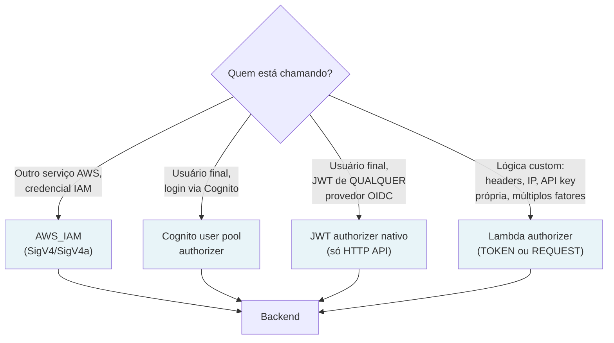
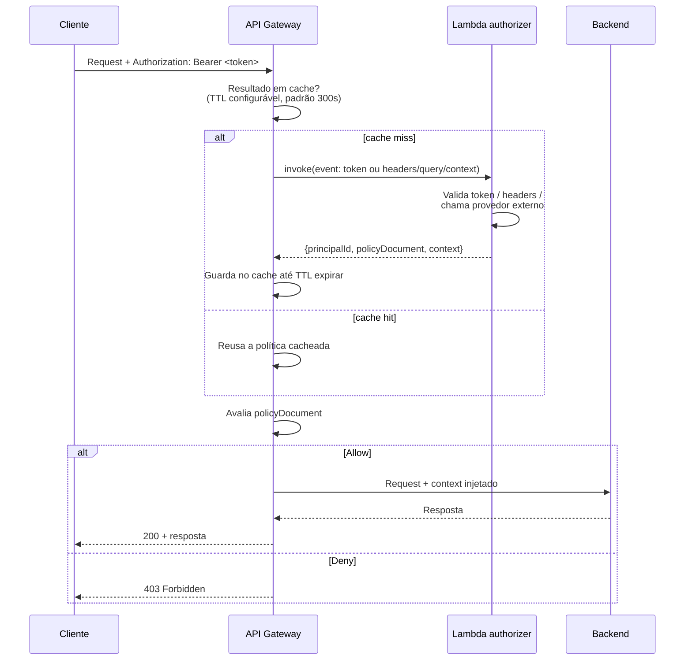
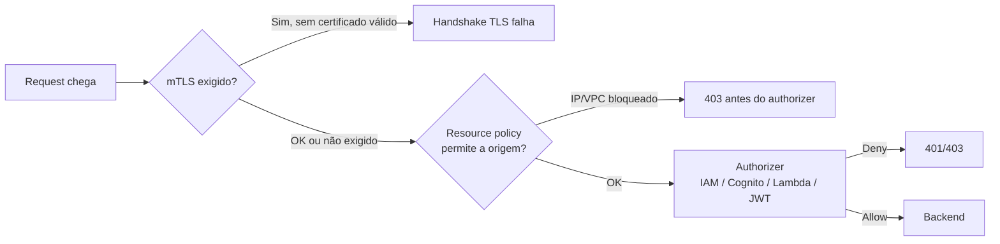

# Autorização na borda de API

> [!abstract] TL;DR
> A nota anterior mostrou o API Gateway protegendo o backend de *volume* — throttling, quotas, cache. Esta nota mostra o mesmo Gateway protegendo o backend de *identidade errada*: decidir, antes de qualquer linha de código da aplicação rodar, se esta requisição tem o direito de entrar. O API Gateway oferece quatro formas de fazer essa checagem na borda, e elas não competem entre si — resolvem problemas diferentes. **AWS_IAM** autentica chamadas de serviço-para-serviço com credenciais AWS assinadas (SigV4). O **Cognito authorizer** valida tokens JWT emitidos por um User Pool gerenciado, sem escrever código. O **Lambda authorizer** é a válvula de escape: uma função sua decide, com qualquer lógica que quiser, e devolve uma política IAM de allow/deny — mais um `context` que carrega dados pro backend. E o **JWT authorizer nativo** das HTTP APIs faz a mesma validação de JWT que um Lambda authorizer faria, mas sem precisar de Lambda nenhum, para qualquer provedor OIDC. Por cima disso, **mTLS** e **resource policies** adicionam camadas de rede — que certificado, que IP, que VPC pode nem bater na porta. A DigitalOcean não tem nada disso embutido no App Platform: autenticação e autorização ficam por conta da própria aplicação ou de uma Function.

## O problema: onde a decisão de "quem é você" deveria acontecer

Imagine uma API de pagamentos com cinquenta rotas espalhadas por dez microsserviços. Sem um ponto central de autorização, cada serviço reimplementa a mesma lógica: decodificar o token, verificar a assinatura, checar se não expirou, extrair o usuário. Dez implementações da mesma checagem significam dez lugares onde alguém pode errar — esquecer de validar a expiração, aceitar um algoritmo de assinatura fraco, deixar passar um token de um emissor errado. E cada erro desses não é um bug cosmético: é uma porta destrancada.

A nota 01 desta trilha já estabeleceu por que centralizar essas responsabilidades na borda faz sentido — throttling, cache, transformação de payload. Autorização é a mais crítica de todas, porque o custo de errar não é degradação de performance, é vazamento de dados. E o argumento para centralizá-la no Gateway é ainda mais forte que para throttling: uma requisição que não deveria nem existir para o backend consumir CPU, abrir conexão de banco, ou tocar em qualquer lógica de negócio, é melhor barrada *antes* da porta, não depois.

A pergunta que esta nota resolve não é "como validar um JWT" — isso é [[03-Dominios/Engenharia/Auth e Identidade/index|teoria de OAuth 2.1, OIDC e a anatomia de um token]], e essa trilha já cobriu isso a fundo. A pergunta aqui é mais estreita e mais prática: **dado que a requisição chegou na borda com algum tipo de credencial, qual mecanismo do API Gateway a AWS oferece pra decidir "entra ou não entra" antes de qualquer linha do backend rodar?**

> [!info] Fronteira com Auth e Identidade
> OAuth 2.1, OpenID Connect, a anatomia de um JWT (header/payload/assinatura), fluxos de concessão (authorization code, client credentials) — tudo isso é protocolo e teoria de identidade, e vive em [[03-Dominios/Engenharia/Auth e Identidade/index|Auth e Identidade]]. Esta nota não reensina nada disso. Ela assume que você já sabe o que é um JWT e foca em uma pergunta diferente: como o API Gateway *consome* esse token na borda, mecanicamente, antes do request chegar no seu código.

## O mapa dos quatro mecanismos

O API Gateway não força você a escolher um mecanismo único para toda a API — rotas diferentes podem usar autorizers diferentes. O critério de escolha gira em torno de uma pergunta: **quem está chamando, e o que ele já carrega?**



Repare que os quatro não são mutuamente exclusivos com as camadas de rede: mTLS e resource policies se sobrepõem por cima, filtrando *quem chega na porta* antes mesmo de qualquer authorizer rodar.

## AWS_IAM: quando o chamador já é uma identidade da AWS

O caso mais simples é quando quem chama a API já tem uma identidade IAM — outro serviço AWS, uma aplicação rodando com um papel assumido, um usuário federado. Nesse caso, marcar o método com `authorizationType: AWS_IAM` faz o API Gateway exigir que a requisição venha **assinada com Signature Version 4** (SigV4, ou a variante mais nova SigV4a) — a mesma assinatura criptográfica que qualquer chamada à API da AWS usa, calculada a partir da chave de acesso, do timestamp e do corpo da requisição.

O fluxo de decisão é puramente de políticas IAM, sem nenhum código seu envolvido:

1. O cliente assina a requisição com uma credencial IAM (permanente ou temporária — a nota 04 do galho de IAM já cobriu a diferença).
2. O API Gateway verifica a assinatura e identifica o principal.
3. O API Gateway checa se esse principal tem uma **identity-based policy** anexada permitindo a ação `execute-api:Invoke` no ARN do recurso — algo como `arn:aws:execute-api:us-east-1:123456789012:abc123/prod/GET/pagamentos`.
4. Se a política permite, o request passa. Se não, `403 Forbidden`.

Esse é o mecanismo certo para comunicação serviço-a-serviço dentro do próprio perímetro AWS — um Lambda chamando a API de outro time, um pipeline de CI/CD invocando um endpoint de deploy. Não é o mecanismo certo para usuários finais de uma aplicação: eles não têm (nem deveriam ter) credenciais IAM.

```bash
# Chamando uma API com AWS_IAM usando o utilitário de assinatura da AWS CLI
curl --request GET \
  --url "https://abc123.execute-api.us-east-1.amazonaws.com/prod/pagamentos" \
  --aws-sigv4 "aws:amz:us-east-1:execute-api" \
  --user "$AWS_ACCESS_KEY_ID:$AWS_SECRET_ACCESS_KEY" \
  --header "x-amz-security-token: $AWS_SESSION_TOKEN"
```

## Cognito user pools authorizer: JWT gerenciado, zero linha de código

Quando quem chama é um usuário final que fez login através de um **Amazon Cognito user pool**, o API Gateway sabe validar o token resultante nativamente, sem nenhuma função Lambda no meio. Você aponta o authorizer para o User Pool, o cliente manda o `id token` ou `access token` do Cognito no header `Authorization`, e o Gateway:

1. Verifica a assinatura do JWT contra as chaves públicas do User Pool (buscadas do endpoint JWKS do Cognito).
2. Confere `exp` (expiração), `iss` (emissor — deve bater com o User Pool configurado) e, opcionalmente, escopos.
3. Se válido, injeta as claims do token no `$context.authorizer.claims` — disponíveis para mapping templates e para o backend via `event.requestContext.authorizer.claims` em uma integração Lambda proxy.
4. Se inválido, `401 Unauthorized`.

É o caminho de menor atrito quando Cognito já é o provedor de identidade da aplicação — não precisa escrever, testar nem manter uma função de autorização própria. A limitação natural é justamente essa: ele é específico do Cognito. Se a identidade vem de outro lugar — Auth0, um provedor corporativo via SAML/OIDC, um sistema de login próprio — este authorizer não serve, e a escolha vira JWT authorizer nativo (se o provedor for OIDC padrão) ou Lambda authorizer (se a lógica for mais exótica).

## Lambda authorizer: a válvula de escape com lógica própria

Quando nenhum dos mecanismos prontos encaixa — um esquema de autenticação próprio, uma checagem que cruza múltiplas fontes, uma integração com um provedor SAML, uma regra de negócio tipo "só usuários do tier premium acessam este endpoint" — o **Lambda authorizer** (antigo *custom authorizer*) é a peça que devolve controle total pra você, em troca de você escrever e manter o código.

O contrato é simples e rígido: o API Gateway invoca sua função Lambda passando a identidade do chamador; sua função devolve **uma política IAM completa** (`Effect: Allow` ou `Deny`, `Action: execute-api:Invoke`, `Resource` com o ARN do método) mais um `principalId` obrigatório e, opcionalmente, um objeto `context` livre — pares chave-valor de string, número ou boolean que o Gateway repassa para o backend sem interpretar.



Existem dois tipos, e a diferença está em *o que* o Gateway extrai da requisição para passar à função:

- **`TOKEN`** — o mais simples: o Gateway extrai um único bearer token de um header (tipicamente `Authorization`) e passa em `event.authorizationToken`. Bom para o caso clássico "valide este JWT e me diga se ele é válido".
- **`REQUEST`** — mais rico: o Gateway passa headers, query string, path parameters, stage variables e variáveis de `$context` inteiras. É o tipo recomendado pela própria AWS hoje, porque permite decisões baseadas em múltiplas fontes (por exemplo, IP de origem *e* um header customizado) e — ponto importante para performance — permite compor a **cache key** a partir de várias dessas fontes, em vez de depender de um único header.

```javascript
// Lambda authorizer tipo TOKEN — valida um JWT e devolve allow/deny
const jwt = require('jsonwebtoken');
const jwksClient = require('jwks-rsa');

const client = jwksClient({ jwksUri: 'https://SEU_DOMINIO/.well-known/jwks.json' });

exports.handler = async (event) => {
  const token = event.authorizationToken.replace('Bearer ', '');

  try {
    const decoded = jwt.decode(token, { complete: true });
    const key = await client.getSigningKey(decoded.header.kid);
    const claims = jwt.verify(token, key.getPublicKey(), { algorithms: ['RS256'] });

    return {
      principalId: claims.sub,
      policyDocument: buildPolicy('Allow', event.methodArn),
      // context vira event.requestContext.authorizer.* no backend
      context: { userId: claims.sub, tier: claims['custom:tier'] || 'free' },
    };
  } catch (err) {
    // qualquer erro lançado aqui vira 401 Unauthorized genérico
    throw new Error('Unauthorized');
  }
};

function buildPolicy(effect, resource) {
  return {
    Version: '2012-10-17',
    Statement: [{ Action: 'execute-api:Invoke', Effect: effect, Resource: resource }],
  };
}
```

> [!info] Fatos verificados em 2026-07-24 (docs.aws.amazon.com)
> TTL do cache de resultado do Lambda authorizer: **padrão 300 segundos (5 minutos)**, configurável de 0 (cache desligado) até um teto de **3600 segundos (1 hora)**. Para authorizer `REQUEST` com cache ligado, todas as identity sources declaradas compõem a chave de cache; se alguma faltar na requisição, o Gateway devolve `401` sem sequer invocar a Lambda. Para `TOKEN`, a chave de cache é o próprio valor do header do token.

O cache é o detalhe de performance que mais gente esquece de configurar — sem ele, *toda* requisição paga uma invocação Lambda extra só para autorizar, dobrando a latência de borda. Com TTL bem calibrado, a maioria das requisições de uma mesma sessão nem toca a função depois da primeira chamada.

Vale ver também a variante `REQUEST`, porque ela é a recomendação atual da AWS e o formato do `event` muda: em vez de um único `authorizationToken`, a função recebe `headers`, `queryStringParameters`, `pathParameters` e `stageVariables` como objetos completos.

```javascript
// Lambda authorizer tipo REQUEST — decide combinando múltiplas fontes
exports.handler = async (event) => {
  const apiKey = event.headers['x-api-key'];
  const sourceIp = event.requestContext.identity.sourceIp;

  const isKeyValid = await validarApiKey(apiKey); // lookup em DynamoDB, por exemplo
  const isIpAllowed = ipEstaNaFaixaPermitida(sourceIp);

  const effect = (isKeyValid && isIpAllowed) ? 'Allow' : 'Deny';

  return {
    principalId: apiKey || 'anonymous',
    policyDocument: {
      Version: '2012-10-17',
      Statement: [{ Action: 'execute-api:Invoke', Effect: effect, Resource: event.methodArn }],
    },
    context: { sourceIp },
  };
};
```

Repare no detalhe que costuma pegar quem está começando: o `Resource` da política pode ser um ARN específico (só aquele método) ou um padrão com curinga cobrindo toda a API (`arn:aws:execute-api:regiao:conta:api-id/stage/*/*`). Se sua política devolve `Allow` só para o método exato que gerou a chamada, e você tem cache ligado, a *próxima* rota que o mesmo usuário tentar acessar vai bater no cache de uma decisão que nunca considerou essa rota — dependendo de como o Gateway interpreta o cache por identity source, isso tanto pode gerar um `403` inesperado numa rota que deveria ser permitida quanto, pior, permitir uma rota que a política nunca avaliou explicitamente. A prática recomendada é fazer a política cobrir todas as rotas às quais aquele principal tem direito, resolvendo o "pode ou não pode" inteiramente dentro da lógica da função, e não depender de granularidade por-rota do lado do cache.

## Casos práticos: qual mecanismo para qual cenário

| Cenário | Mecanismo recomendado | Por quê |
|---|---|---|
| Pipeline de CI/CD chamando endpoint interno de deploy | AWS_IAM | Já existe credencial IAM; sem usuário final envolvido |
| App mobile com login via Cognito | Cognito user pools authorizer | Zero código, integração nativa |
| API pública consumida por parceiros que já têm um IdP próprio (Auth0, Okta) | JWT authorizer nativo (HTTP API) | Sem Lambda pra manter; qualquer OIDC serve |
| Regra de negócio ("só tier premium acessa") além de validar o token | Lambda authorizer | Única opção com lógica arbitrária |
| B2B com certificado de cliente obrigatório | mTLS + qualquer authorizer acima | mTLS é complementar, não substitui autorização de identidade |
| API que só deveria ser alcançável de dentro da VPC corporativa | Resource policy (IP/VPC) + authorizer | Reduz superfície mesmo se o authorizer tiver bug |

## JWT authorizer nativo: a mesma validação, sem escrever Lambda

Para HTTP APIs (o tipo mais moderno e barato de API Gateway, coberto na nota 02 desta trilha), a AWS oferece um terceiro caminho que resolve o caso mais comum do Lambda authorizer — "valide este JWT" — sem precisar escrever, implantar nem manter nenhuma função. O **JWT authorizer** nativo valida tokens de qualquer provedor compatível com OIDC: Cognito, Auth0, Okta, um Keycloak próprio, o que for — desde que exponha um endpoint `jwks_uri` padrão.

A configuração é puramente declarativa — dois parâmetros centrais, `Issuer` e `Audience`:

```yaml
# Trecho relevante de um template CloudFormation/SAM
JWTAuthorizer:
  Type: AWS::ApiGatewayV2::Authorizer
  Properties:
    ApiId: !Ref MinhaHttpApi
    AuthorizerType: JWT
    IdentitySource:
      - "$request.header.Authorization"
    JwtConfiguration:
      Audience:
        - !Ref MeuAppClientId
      Issuer: !Sub "https://cognito-idp.${AWS::Region}.amazonaws.com/${MeuUserPool}"
    Name: jwt-authorizer
```

Por baixo, o mecanismo é exatamente o que um Lambda authorizer bem escrito faria manualmente:

1. Extrai o token da fonte declarada (`identitySource`).
2. Decodifica o header do JWT e busca a chave pública correspondente no `jwks_uri` do emissor — o Gateway cacheia essas chaves públicas por até **duas horas**.
3. Valida a assinatura (só algoritmos baseados em RSA são suportados).
4. Valida claims: `iss` deve bater com o `Issuer` configurado; `aud` (ou `client_id`, se `aud` estiver ausente) deve bater com uma das `Audience` configuradas; `exp` e `nbf` devem ser consistentes com o horário atual; e, se a rota exige escopos, o claim `scope` (ou `scp`) precisa conter ao menos um deles.
5. Se tudo bate, as claims ficam disponíveis para o backend em `$event.requestContext.authorizer.jwt.claims`.

A vantagem sobre o Lambda authorizer é dupla: menos código pra manter (zero, na verdade) e menos latência (a validação acontece no próprio Gateway, sem uma invocação de função extra). A limitação é o espelho da vantagem: só existe para **HTTP APIs**, não para REST APIs, e só cobre validação de JWT puro — se a lógica de autorização precisar de algo além de "este token é válido e tem este escopo" (consultar um banco, cruzar com uma feature flag), o Lambda authorizer volta a ser necessário.

Escopos são configurados por rota, não pelo authorizer em si — o mesmo authorizer JWT pode servir uma rota que exige o escopo `pagamentos:leitura` e outra que exige `pagamentos:escrita`:

```bash
aws apigatewayv2 update-route \
    --api-id abc123 \
    --route-id xyz789 \
    --authorization-type JWT \
    --authorizer-id jwt-auth-01 \
    --authorization-scopes pagamentos:escrita
```

> [!warning] `aud` vence `client_id`, e o authorizer não diferencia access token de ID token
> Dois detalhes que geram bug silencioso: primeiro, quando o token tem tanto `aud` quanto `client_id`, o API Gateway avalia **apenas `aud`** — se o seu provedor só popula `client_id`, configure a `Audience` do authorizer para bater com esse valor, não o contrário. Segundo, a própria AWS avisa que não existe um mecanismo padrão para diferenciar um *access token* de um *ID token* dentro de um JWT — ambos podem ter formato válido. Se sua rota não exige escopos, um ID token (que deveria servir só para identificar o usuário no *frontend*, nunca para autorizar chamadas de API) pode passar pela validação como se fosse um access token legítimo. A mitigação recomendada pela própria documentação é configurar escopos obrigatórios nas rotas sempre que o provedor suportar — isso força a distinção, porque ID tokens tipicamente não carregam `scope`.

## mTLS e resource policies: filtros antes mesmo do authorizer

Os quatro mecanismos acima decidem *quem* está fazendo a requisição. Duas camadas adicionais decidem se a requisição sequer deveria chegar até esse ponto:

**Mutual TLS (mTLS)** inverte o handshake TLS padrão: em vez de só o servidor provar identidade ao cliente (o cadeado do navegador), o *cliente também* precisa apresentar um certificado X.509 que o Gateway reconhece. É o padrão comum em integrações B2B e IoT — "só sistemas com este certificado específico conversam com esta API", uma camada bem mais forte que qualquer token, porque o handshake falha na camada de transporte, antes mesmo do request HTTP existir. Na AWS, configurar mTLS exige um domínio customizado (não funciona no endpoint default `execute-api`) e um **truststore** — um arquivo `.pem` com a cadeia de certificados confiáveis, hospedado num bucket S3. O Gateway repassa o certificado do cliente para Lambda authorizers e para o backend, permitindo checagens adicionais (como revogação, que o Gateway *não* verifica nativamente).

**Resource policies** são políticas IAM anexadas à própria API — não a um usuário, a um papel — que restringem de onde uma requisição pode vir, independentemente de quem a está fazendo. O caso mais comum: restringir por endereço IP de origem ou por VPC/VPC endpoint, útil quando a API deveria só ser alcançável de dentro de uma rede corporativa ou de uma VPC específica, mesmo que a credencial apresentada fosse válida.



> [!warning] Camadas que se sobrepõem, não que se substituem
> É tentador pensar "já tenho um Lambda authorizer, não preciso de resource policy" — mas são defesas de naturezas diferentes. Um authorizer decide sobre a *identidade do chamador*; uma resource policy decide sobre a *origem da rede*; mTLS decide sobre a *posse de um certificado*. Uma API exposta publicamente sem nenhuma restrição de rede, mesmo com o melhor Lambda authorizer do mundo, ainda aceita conexões de qualquer lugar do planeta tentando adivinhar tokens válidos. Defesa em profundidade aqui não é redundância — é reduzir a superfície de ataque em camadas independentes.

Um exemplo concreto de resource policy, restringindo invocação a um range de IPs corporativo:

```json
{
  "Version": "2012-10-17",
  "Statement": [
    {
      "Effect": "Deny",
      "Principal": "*",
      "Action": "execute-api:Invoke",
      "Resource": "arn:aws:execute-api:us-east-1:123456789012:abc123/prod/*/*",
      "Condition": {
        "NotIpAddress": {
          "aws:SourceIp": ["203.0.113.0/24"]
        }
      }
    },
    {
      "Effect": "Allow",
      "Principal": "*",
      "Action": "execute-api:Invoke",
      "Resource": "arn:aws:execute-api:us-east-1:123456789012:abc123/prod/*/*"
    }
  ]
}
```

Repare na estrutura: um `Deny` explícito condicionado a "IP fora da faixa" *antes* de um `Allow` genérico. Essa ordem importa por causa de como a avaliação de políticas IAM funciona — um `Deny` explícito sempre vence, não importa em que ordem os statements aparecem no documento, mas escrever assim deixa a intenção legível: "negue tudo que não vier da faixa corporativa, e permita o resto".

> [!warning] `Resource: "*"` no papel de execução do Lambda authorizer
> É comum copiar o exemplo oficial da AWS que dá ao papel de execução da Lambda a permissão `lambda:InvokeFunction` com `Resource: "*"` — e esse exemplo específico é inofensivo, porque é o *Gateway* invocando a *função*, não o inverso. O erro real acontece um passo adiante: quando a própria função authorizer, dentro do seu código, precisa consultar outro recurso AWS (um DynamoDB com a lista de tokens revogados, por exemplo) e alguém generosamente anexa `AmazonDynamoDBFullAccess` ao papel de execução "pra não ter que debugar permissão depois". Uma função que roda a cada requisição de autorização, com acesso de escrita irrestrito a um banco de dados, é um alvo de alto valor — qualquer falha na própria lógica de validação do token vira um caminho para escalar privilégio dentro da conta. Aplique least privilege (nota 05 do galho de IAM) com o mesmo rigor num authorizer que aplicaria em qualquer outro serviço com dados sensíveis.

## A lente DigitalOcean: honestidade sobre a lacuna

Este é o ponto em que a lente dupla desta trilha precisa ser honesta em vez de forçar uma equivalência que não existe. O **App Platform** da DigitalOcean não tem um conceito de *authorizer* gerenciado na borda — não há como anexar uma função de validação de token às rotas de uma app antes delas chegarem ao seu código, e não há um equivalente a AWS_IAM, Cognito authorizer ou JWT authorizer nativo embutido na plataforma.

O que existe:

- **Autenticação dentro da própria aplicação** — o padrão mais comum: o próprio framework web (Express, Django, Spring, o que for) valida o JWT recebido, com middleware de autenticação escrito por você, usando as mesmas bibliotecas que usaria em qualquer ambiente. A validação acontece *depois* que o request já entrou na app, não na borda.
- **DigitalOcean Functions com autenticação própria** — se a rota é uma Function (o análogo mais próximo de Lambda na DO, coberto na trilha de Serverless), a validação de token também é código seu dentro da função, não um recurso declarativo da plataforma.
- **Restrição de rede via VPC** — o App Platform suporta colocar componentes numa VPC privada da DigitalOcean, o que cobre parcialmente o papel que resource policies cumprem na AWS (restringir origem), mas sem o refinamento de políticas IAM por IP/conta.

Times que migram uma arquitetura pesada em Lambda authorizers para a DigitalOcean sentem essa lacuna rapidamente: a lógica de autorização que vivia centralizada e declarativa na borda precisa ser reescrita como middleware distribuído em cada aplicação. Isso não é necessariamente pior — para times pequenos, ter a lógica de auth junto com o código da aplicação, em vez de espalhada num artefato Lambda separado, pode até simplificar o deploy — mas é estruturalmente diferente, e a nota 05 desta trilha volta a esse ponto com mais profundidade, olhando pra alternativas de terceiros (Kong, Cloudflare Workers) que preenchem parte dessa lacuna.

| Mecanismo AWS | Equivalente DigitalOcean |
|---|---|
| AWS_IAM (SigV4) | Sem equivalente — não há credencial de plataforma pra service-to-service na borda |
| Cognito user pools authorizer | Sem equivalente gerenciado — validar JWT vira código na app |
| Lambda authorizer | Sem equivalente — middleware de auth dentro da app ou da Function |
| JWT authorizer nativo (HTTP API) | Sem equivalente — mesma lacuna do item acima |
| mTLS | Não suportado nativamente no App Platform |
| Resource policy (IP/VPC) | VPC privada da DO cobre parcialmente o filtro de rede |

## Tabela de tradução (Azure e GCP)

| Conceito | AWS | Azure | GCP |
|---|---|---|---|
| Serviço gerenciado de borda de API | API Gateway | Azure API Management (APIM) | Apigee / API Gateway (GCP) |
| Validação nativa de JWT | JWT authorizer (HTTP API) | Política `validate-jwt` no APIM | Autenticação JWT no Cloud Endpoints/API Gateway |
| Função custom de autorização | Lambda authorizer | Policy custom (C#/XML) no APIM | Extensão OpenAPI `x-google-backend` + serviço externo |
| Identidade gerenciada de usuário final | Cognito user pools authorizer | Microsoft Entra ID (ex-Azure AD B2C) | Identity Platform / Firebase Auth |
| mTLS na borda | Custom domain + truststore S3 | Certificado de cliente no APIM | mTLS no Cloud Endpoints/Apigee |

## O que vem a seguir

Esta nota resolveu "quem pode entrar" na borda de uma única API. A próxima nota deste galho olha para a DigitalOcean com mais profundidade — não só onde ela não tem paridade (como vimos aqui), mas o que colocar no lugar: App Platform routes, Functions, e quando vale a pena trazer um ALB, um CloudFront, ou um API Gateway de terceiros (Kong, Cloudflare) para preencher a lacuna. Depois disso, o capstone do galho compõe as quatro peças — anatomia, throttling, autorização e a lacuna da DO — num desenho único de borda de API para um cenário real.

## Fontes

- AWS — Use API Gateway Lambda authorizers: https://docs.aws.amazon.com/apigateway/latest/developerguide/apigateway-use-lambda-authorizer.html
- AWS — Control access to HTTP APIs with JWT authorizers in API Gateway: https://docs.aws.amazon.com/apigateway/latest/developerguide/http-api-jwt-authorizer.html
- AWS — Control access to a REST API with IAM permissions: https://docs.aws.amazon.com/apigateway/latest/developerguide/permissions.html
- AWS — How to turn on mutual TLS authentication for your REST APIs in API Gateway: https://docs.aws.amazon.com/apigateway/latest/developerguide/rest-api-mutual-tls.html
- AWS — API Gateway caching (TTL de authorizer): https://docs.aws.amazon.com/apigateway/latest/developerguide/apigateway-caching.html
- AWS — Control access for invoking an API (resource policies): https://docs.aws.amazon.com/apigateway/latest/developerguide/apigateway-resource-policies.html
- DigitalOcean — App Platform: How to Manage App Networking (VPC): https://docs.digitalocean.com/products/app-platform/how-to/configure-networking/
- DigitalOcean — App Platform overview: https://docs.digitalocean.com/products/app-platform/
