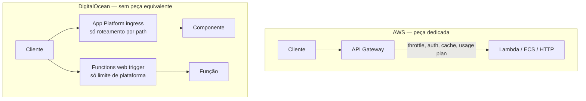
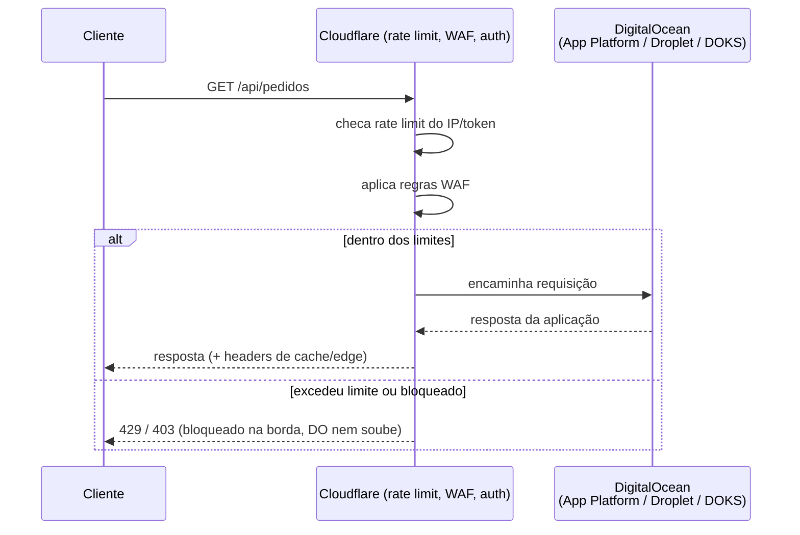
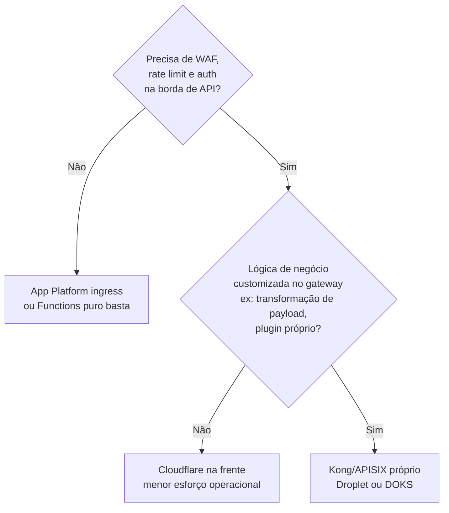

> [!abstract] TL;DR
> A DigitalOcean **não tem** um API Gateway gerenciado equivalente ao da AWS. O App Platform resolve roteamento básico por path (ingress); as Functions expõem HTTP direto, sem gateway de verdade na frente. Pra ter throttling por cliente, API keys, autorizadores centralizados ou WAF, você compõe com um terceiro (tipicamente Cloudflare) ou sobe seu próprio proxy (Kong, APISIX) num Droplet ou no DOKS. E mesmo na AWS, o API Gateway nem sempre é a peça certa: em alto volume, ALB apontando direto pra Lambda ou pra um serviço em ECS/EKS costuma ser mais barato e mais simples, trocando funcionalidades ricas por previsibilidade de custo.

## O problema: toda nuvem promete uma "porta de entrada gerenciada"

Nas quatro notas anteriores deste galho você construiu um vocabulário inteiro em cima de uma peça que a AWS oferece pronta: o API Gateway. Roteamento por rota, autorização plugável, throttling por cliente, usage plans, caching de resposta — tudo isso é um produto, com um console, uma API de configuração e uma conta no fim do mês.

Agora troque de provedor. Você abre o painel da DigitalOcean procurando "API Gateway" e não encontra. Não é um bug de navegação nem falta de sorte sua — a DO genuinamente não oferece esse produto. E aqui mora a armadilha mais comum de quem migra de AWS pra DO (ou desenha arquitetura multi-cloud sem verificar paridade antes): assumir que "toda nuvem grande tem os mesmos blocos" e só trocar o nome. Isso quebra silenciosamente — o código sobe, funciona no dia 1, e no dia 90 alguém descobre que não tem rate limit nenhum protegendo a API contra abuso, porque o gateway que "deveria estar ali" nunca existiu.

Esta nota é sobre encarar esse buraco de frente: o que a DO oferece de fato, o que fica faltando, e os dois caminhos honestos pra preencher a lacuna — compor com terceiros ou hospedar seu próprio proxy. E, de brinde, uma segunda honestidade: mesmo dentro da AWS, o API Gateway nem sempre é a escolha certa.

## O que a DigitalOcean realmente tem na borda de API

Dois produtos da DO tocam parte do problema, cada um cobrindo uma fatia — nenhum cobre o todo.

### App Platform: roteamento por path, não gateway de API

Se você já leu [[03-Dominios/Tecnologia/Cloud/12 - Containers gerenciados/04 - App Platform e o caminho PaaS|App Platform e o caminho PaaS]], sabe que o App Platform é a resposta da DO a "eu só quero fazer deploy de código e não pensar em infraestrutura". Ele tem, sim, uma camada de roteamento: o `app spec` (a especificação YAML/JSON de um app) define como requisições HTTP chegam a cada componente.

Historicamente isso vivia num campo `routes` — um array simples de prefixos de path por componente, hoje marcado como legado. A forma atual e recomendada é o objeto `ingress`, com uma lista de `rules`. Cada regra casa um `match` de path contra um componente de destino, e você escolhe o comportamento de reescrita:

- **Padrão**: o prefixo casado é cortado à esquerda antes de encaminhar. Uma requisição em `/api/list` roteada pra um componente montado em `/api` chega no componente como `/list`.
- **`preserve_path_prefix: true`**: mantém o path inteiro. `/api/list` continua `/api/list` do lado do componente.
- **`rewrite`**: reescrita explícita — você pode transformar `/api/list` em `/v1/list`, por exemplo.

Isso é roteamento de aplicação de verdade, com TLS gerenciado automaticamente (certificado emitido e renovado pra qualquer domínio anexado ao app) e CORS configurável por regra de ingress. Mas pare e note o que **não** está na lista: não há throttling por cliente, não há usage plans, não há API keys emitidas pela plataforma, não há autorizador plugável tipo Lambda authorizer. O ingress do App Platform decide "pra onde vai essa requisição" — não "quem pode fazer essa requisição, quantas vezes, e a que custo".

### Functions: HTTP direto, sem gateway na frente

As DigitalOcean Functions (a resposta da DO ao Lambda) podem ser invocadas via HTTP assim que você as cria — não existe um passo separado de "criar uma integração de API" como você faria conectando Lambda ao API Gateway. Isso parece uma vantagem à primeira vista (menos peças pra configurar), mas é também exatamente o ponto cego: não há gateway nenhum entre o mundo e a função.

Os limites que existem são de **plataforma**, não de **política por cliente**: um namespace de Functions aceita até 600 invocações por minuto e até 120 execuções concorrentes (verificado 2026-07-24, sujeito a mudança — confirme em `docs.digitalocean.com/products/functions/details/limits/`), payload de entrada e saída limitado a 1 MB, timeout máximo de 15 minutos. Isso protege a plataforma de um abuso geral, mas não te dá "o cliente X pode fazer 100 req/s e o cliente Y pode fazer 10". Autenticação existe (chaves de acesso do namespace, até 200 por conta), mas é chave-de-conta, não um esquema de authorizer por rota como você viu na nota anterior.

> [!info] Verificado 2026-07-24
> Limites de Functions (600 inv/min, 120 concorrentes, payload 1 MB, timeout 15 min) vêm de `docs.digitalocean.com/products/functions/details/limits/`. Como toda página de "limits", tende a mudar sem aviso — reconfira antes de dimensionar algo crítico.



O contraste é o que importa reter: na AWS, "API Gateway" é uma **peça arquitetural nomeada**, com um dono de decisão claro. Na DO, as responsabilidades que essa peça cobre estão espalhadas — parte no ingress do App Platform, parte (pouca) nos limites de Functions, e o resto simplesmente não existe até você trazer.

## O caminho real na DO: compor, não esperar que apareça

Quando você precisa de throttling por cliente, WAF, autenticação centralizada ou um authorizer plugável na frente de uma API na DO, há dois caminhos honestos — nenhum é "clique e pronto" como na AWS.

### Caminho 1: Cloudflare (ou outro CDN/WAF) na frente

O padrão mais comum na prática é colocar um serviço de terceiro — tipicamente a Cloudflare, mas o mesmo raciocínio vale pra Fastly ou outro CDN com camada de segurança — entre o cliente e a origem hospedada na DO (App Platform, Droplet, DOKS). A Cloudflare não é um produto DigitalOcean nem uma integração nativa gerenciada pela DO: é um serviço externo que você configura por conta própria, apontando o DNS do seu domínio pra ela e ela proxyando pra origem na DO.

O que isso te devolve, conceitualmente equivalente ao que o API Gateway faz nativamente na AWS:

- **Rate limiting** por regra (IP, path, header, cookie) — o mesmo conceito de throttling da nota 03 deste galho, só que aplicado antes do tráfego tocar a DO.
- **WAF** com regras gerenciadas e customizadas — filtra payloads maliciosos antes de chegar no seu App Platform ou Droplet.
- **Autenticação na borda** via Cloudflare Access, pra proteger rotas administrativas ou internas sem tocar o código da aplicação.

A diferença de fundo pra AWS: aqui você está **integrando** duas contas de provedores diferentes (DNS na Cloudflare, compute na DO), não configurando um recurso dentro de um único painel. Isso significa mais peças móveis — dois lugares pra observar, duas faturas, dois modelos de autenticação (API tokens da Cloudflare distintos das API tokens da DO) — em troca de ganhar de volta boa parte do que o API Gateway daria de graça na AWS.



Conceitualmente, um `app.yaml` de App Platform com ingress fica assim — note que ele resolve o roteamento, mas não tem campo nenhum pra throttling ou API key:

```yaml
# app spec (App Platform) — roteamento por path, sem gateway de políticas
name: pedidos-api
services:
  - name: pedidos-svc
    github:
      repo: minha-org/pedidos-api
      branch: main
    http_port: 8080
ingress:
  rules:
    - match:
        path:
          prefix: /api/pedidos
      component:
        name: pedidos-svc
      # sem preserve_path_prefix: "/api/pedidos/123" chega no
      # componente como "/123" — o prefixo é cortado à esquerda
    - match:
        path:
          prefix: /api/estoque
      component:
        name: estoque-svc
      preserve_path_prefix: true
      # aqui o componente recebe o path inteiro, "/api/estoque/456"
```

E o lado Cloudflare, em prosa de regra (não é um produto DO, então não há CLI da DO pra isso — a configuração vive inteira no painel/API da Cloudflare):

```
Regra de rate limit (Cloudflare):
  SE  path começa com "/api/"
  E   requisições do mesmo IP > 100 em 60s
  ENTÃO responder 429, sem repassar pra origem DO

Regra de WAF (Cloudflare):
  SE  corpo da requisição casa com assinatura de SQLi/XSS conhecida
  ENTÃO bloquear com 403, logar, sem repassar pra origem DO
```

### Caminho 2: seu próprio proxy — Kong ou APISIX

Quando você precisa de algo mais próximo do que o API Gateway da AWS entrega — authorizers customizados escritos por você, transformação de payload, plugins específicos de negócio — o caminho é subir um proxy de API gateway open source você mesmo. Kong e Apache APISIX são as escolhas mais comuns: ambos rodam como um proxy reverso com plugins (rate limiting, JWT, API keys, transformação de request/response) na frente dos seus serviços.

Na DO isso vira infraestrutura que você opera: um Droplet dedicado (ou um pequeno cluster de Droplets atrás de um Load Balancer da DO), ou — mais robusto — um deployment dentro do DOKS, o Kubernetes gerenciado da DO (veja [[03-Dominios/Tecnologia/Cloud/12 - Containers gerenciados/05 - Kubernetes gerenciado de raspão|Kubernetes gerenciado de raspão]] se quiser o pano de fundo desse produto). Kong e APISIX têm charts Helm oficiais, o que torna o caminho DOKS o mais natural pra quem já está nesse mundo.

O trade-off é direto: você ganha controle total — o mesmo nível de sofisticação de authorizer, throttling e transformação que o API Gateway da AWS oferece gerenciado — mas perde o "gerenciado". Patches de segurança, upgrades de versão, HA do proxy em si, capacity planning: tudo isso é seu agora. É a mesma escolha de fundo entre PaaS e "eu mesmo administro o servidor" que atravessa o galho de Containers — só que aplicada à camada de borda de API em vez de à camada de compute.

Pra fixar como fica um Kong configurado declarativamente na frente de uma API na DO — o pedaço que resolve o que nem App Platform nem Cloudflare cobrem sozinhos, como transformação de payload por rota —, um trecho de `kong.yml` (modo DB-less, comum quando você roda Kong em container no DOKS):

```yaml
# kong.yml — configuração declarativa, Kong rodando no DOKS
_format_version: "3.0"

services:
  - name: pedidos-svc
    url: http://pedidos-svc.default.svc.cluster.local:8080
    routes:
      - name: pedidos-route
        paths: ["/api/pedidos"]
    plugins:
      - name: rate-limiting
        config:
          minute: 100
          policy: redis          # backend compartilhado — ver armadilha abaixo
          redis_host: redis.default.svc.cluster.local
      - name: jwt                # valida token JWT antes de repassar
      - name: key-auth           # ou API key, se preferir esse esquema
```

Compare esse trecho com o `app spec` da seção anterior: o `app spec` não tem (e não pretende ter) um campo `plugins`. É exatamente essa ausência que Kong, APISIX ou Cloudflare preenchem — cada um com seu próprio modelo de configuração, fora do painel da DO.

### Qual caminho escolher

Não existe uma resposta única — a escolha depende de quanto controle você precisa e de quanto esforço operacional está disposto a assumir:



Times pequenos, com uma API relativamente simples e sem exigência de lógica de gateway sob medida, quase sempre saem ganhando com Cloudflare: menos infraestrutura pra manter, cobertura ampla de WAF e rate limit, e uma equipe de segurança dedicada cuidando das assinaturas de ataque atualizadas — algo que dificilmente você replica sozinho num Kong self-hosted. Kong/APISIX entra quando a necessidade é de fato de **gateway de API** — autorização com lógica própria, transformação de contrato entre cliente e serviço, ou quando a equipe já opera Kubernetes com maturidade suficiente pra tratar mais um componente stateful como rotina, não como exceção.

## A alternativa que existe dentro da própria AWS: nem sempre API Gateway é a resposta

Vale fechar com uma segunda honestidade, desta vez dentro do próprio território AWS: ter o API Gateway disponível não significa que ele é sempre a escolha certa. Em cenários de alto volume e baixa necessidade de funcionalidades ricas, dois caminhos alternativos aparecem com frequência em arquiteturas de produção:

**ALB apontando direto pra Lambda.** Um Application Load Balancer pode ter Lambda como tipo de target de um target group — sem API Gateway no meio. O ALB invoca a função diretamente (sem conexão de rede, é uma invocação, não um proxy HTTP) e repassa a requisição em JSON. Isso funciona bem quando você já paga por um ALB de qualquer forma (por exemplo, ele também serve tráfego pra um ECS/Fargate no mesmo domínio) e não precisa de usage plans, API keys ou autorizadores plugáveis — só precisa rotear HTTP pra uma função. As limitações são reais: corpo de requisição e resposta limitados a 1 MB cada, sem suporte a WebSockets, um único Lambda por target group (você troca de função criando um novo target group, não substituindo o registro).

**CloudFront + Lambda@Edge (ou CloudFront Functions).** Pra lógica leve que precisa rodar o mais perto possível do cliente — reescrita de header, redirecionamento, autenticação simples de borda — Lambda@Edge (ou a variante mais barata e limitada, CloudFront Functions) roda dentro da distribuição CloudFront, sem precisar de um API Gateway atrás. Isso é mais sobre a camada de CDN do que sobre API propriamente dita — o território que você já viu em [[03-Dominios/Tecnologia/Cloud/10 - DNS, CDN e borda/05 - A borda como camada|A borda como camada]] — mas é um lembrete de que "borda de aplicação" e "borda de rede" se sobrepõem, e a linha entre "isso é API Gateway" e "isso é CDN fazendo um pouco de lógica" é mais fina do que os nomes dos produtos sugerem.

A tabela abaixo resume a comparação REST API vs HTTP API do próprio API Gateway (a decisão *dentro* da AWS) e depois estende pra ALB — porque a pergunta certa nunca é só "API Gateway ou não", é "quanto de feature eu realmente preciso pagar por".

| Recurso | REST API (Gateway) | HTTP API (Gateway) | ALB → Lambda direto |
|---|---|---|---|
| API keys / usage plans | Sim | Não | Não |
| Throttling por cliente | Sim | Não | Não (só limites gerais do ALB) |
| Autorizador Lambda customizado | Sim | Sim | Não (lógica de auth fica na própria função) |
| JWT authorizer nativo | Não | Sim | Não |
| AWS WAF integrado | Sim | Não | Sim (WAF pode anexar no ALB) |
| Caching de resposta | Sim | Não | Não |
| Custo por milhão de requisições | Mais alto | Mais baixo | Mais baixo (paga o ALB, não por API) |

> [!info] Verificado 2026-07-24
> Comparação REST API vs HTTP API confirmada em `docs.aws.amazon.com/apigateway/latest/developerguide/http-api-vs-rest.html`. Limites de ALB→Lambda (payload 1 MB, sem WebSocket, um Lambda por target group) confirmados em `docs.aws.amazon.com/elasticloadbalancing/latest/application/lambda-functions.html`. Preços por milhão de requisições variam por região e mudam com frequência — não cravados aqui, confira a calculadora oficial antes de decidir.

## Traduzindo pra Azure e GCP

Como sempre neste galho, aqui é só pra você reconhecer o nome quando aparecer numa vaga ou numa arquitetura de terceiro — não é hands-on.

| Conceito | AWS | DigitalOcean | Azure | GCP |
|---|---|---|---|---|
| Gateway de API gerenciado rico | API Gateway | — (não existe) | Azure API Management | Apigee / API Gateway (Cloud Endpoints) |
| Roteamento básico por path (PaaS) | — | App Platform ingress | Azure App Service routing | Cloud Run URL routing |
| HTTP direto pra função serverless | Lambda Function URL | Functions web trigger | Azure Functions HTTP trigger | Cloud Functions HTTP trigger |
| WAF/rate limit de borda (terceiro) | AWS WAF (nativo) | Cloudflare (externo) | Azure Front Door + WAF | Cloud Armor |

## Caso prático: uma API que cresce na DO

Um exemplo concreto ajuda a ver os caminhos se encaixando na ordem em que aparecem na vida real de um time pequeno.

**Fase 1 — MVP.** Uma startup sobe uma API de pedidos no App Platform: um serviço, ingress simples roteando `/api/*` pro componente, TLS automático no domínio próprio. Não há clientes externos ainda, só o próprio frontend consumindo. Ingress do App Platform resolve 100% do problema — não falta nada.

**Fase 2 — primeiros parceiros externos.** A API passa a ser consumida por dois parceiros de integração. Agora existe risco real de um deles, por bug do lado dele, disparar milhares de requisições por segundo e derrubar o serviço pros outros. Esse é exatamente o ponto onde "não ter API Gateway" começa a doer — na AWS, aqui você criaria um usage plan por API key. Na DO, o time decide colocar Cloudflare na frente: DNS migra pra Cloudflare, regra de rate limit por token de API (100 req/min por parceiro) é criada, e a origem continua sendo o mesmo app no App Platform, sem tocar em código.

**Fase 3 — necessidade de transformação de contrato.** Um terceiro parceiro exige um formato de payload ligeiramente diferente do que a API interna usa, e o time não quer sujar o código de domínio com essa lógica de adaptação. Cloudflare não faz transformação de payload arbitrária — é aqui que Kong ou APISIX entram, geralmente rodando num pequeno DOKS que o time já tinha, com um plugin de request-transformer só pra rota desse parceiro específico.

Repare que as três fases não competem entre si — elas se somam, cada uma resolvendo o problema que apareceu naquele momento. A DO nunca entrega tudo de uma vez, mas o caminho de composição é incremental, não um replanejamento completo a cada novo requisito.

## Armadilhas

> [!warning] "A DO vai ter isso em algum lugar escondido do painel"
> Não vai. Se você está procurando um recurso chamado "API Gateway", "usage plan" ou "authorizer" no painel da DigitalOcean, pare de procurar — não existe. O tempo gasto vasculhando o console é tempo que deveria ir pra decidir entre Cloudflare e proxy próprio.

> [!warning] Cloudflare na frente não é "grátis e sem esforço"
> O plano gratuito da Cloudflare existe e cobre bastante coisa, mas rate limiting granular, regras de WAF customizadas e Access geralmente exigem um plano pago. Trate isso como um item de orçamento e de operação — não como um detalhe incidental de DNS.

> [!warning] Subir seu próprio Kong/APISIX é assumir um novo componente stateful pra operar
> Rate limiting distribuído em Kong/APISIX normalmente depende de um backend compartilhado (Redis, por exemplo) pra contar requisições entre réplicas. Se você subir múltiplas instâncias do proxy sem esse backend, cada réplica conta sozinha — e o limite real vira "limite configurado × número de réplicas", silenciosamente. É o mesmo tipo de armadilha distribuída que apareceu na nota 03 deste galho, agora aplicada à sua própria infraestrutura, não à da nuvem.

> [!warning] ALB → Lambda não é "API Gateway mais barato com os mesmos recursos"
> É uma troca genuína de funcionalidade por custo. Se seu caso de uso precisa de API keys por cliente, usage plans ou throttling diferenciado, ALB não entrega isso — ele é uma via de invocação, não um gateway de gestão de API. Escolha esse caminho pela característica de custo/volume, não como um downgrade "de graça".

## O que vem a seguir

Esta nota fechou o quadro de honestidade: você agora sabe exatamente o que a DigitalOcean tem, o que falta, e como preencher o vazio — seja compondo com um terceiro como a Cloudflare, seja hospedando seu próprio proxy. A próxima nota deste galho é o capstone do Bloco 3: uma arquitetura ponta a ponta que amarra tudo — tipos de gateway, throttling, autorização e a decisão AWS-nativo-vs-composição-DO — num cenário único de API pública com múltiplos clientes.

## Fontes

- API Gateway — REST vs HTTP API: https://docs.aws.amazon.com/apigateway/latest/developerguide/http-api-vs-rest.html
- ALB com Lambda como target: https://docs.aws.amazon.com/elasticloadbalancing/latest/application/lambda-functions.html
- App Platform — App Spec Reference (ingress, routes, rewrite): https://docs.digitalocean.com/products/app-platform/reference/app-spec/
- DigitalOcean Functions — limites (invocações, concorrência, payload, timeout): https://docs.digitalocean.com/products/functions/details/limits/
- DigitalOcean Functions — visão geral do produto: https://www.digitalocean.com/products/functions

