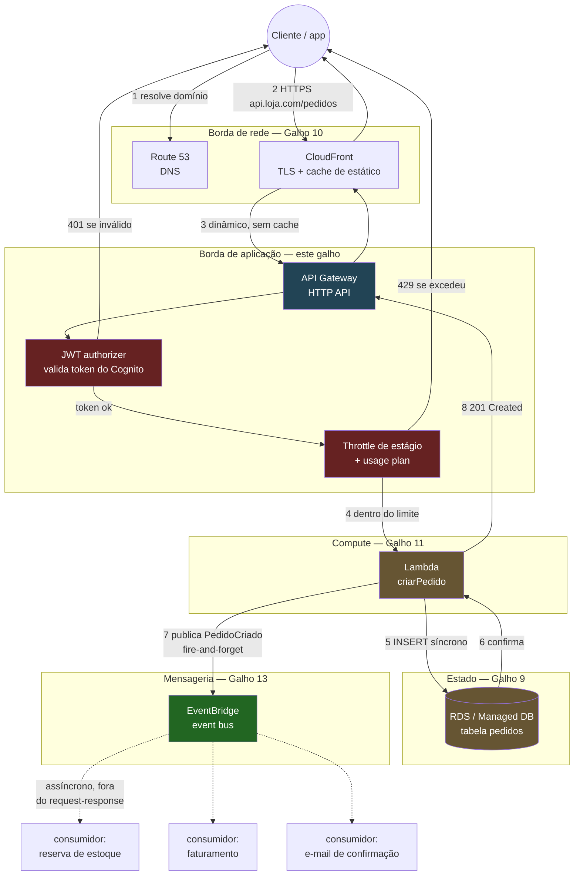
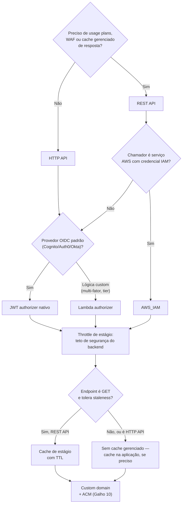
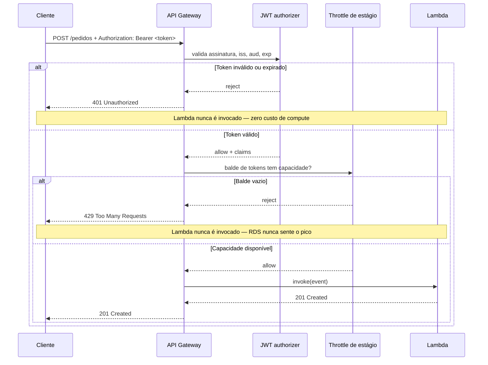
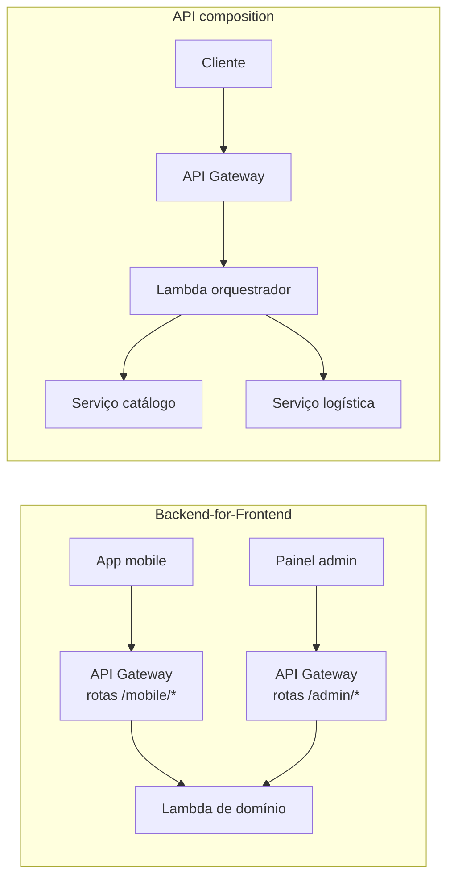
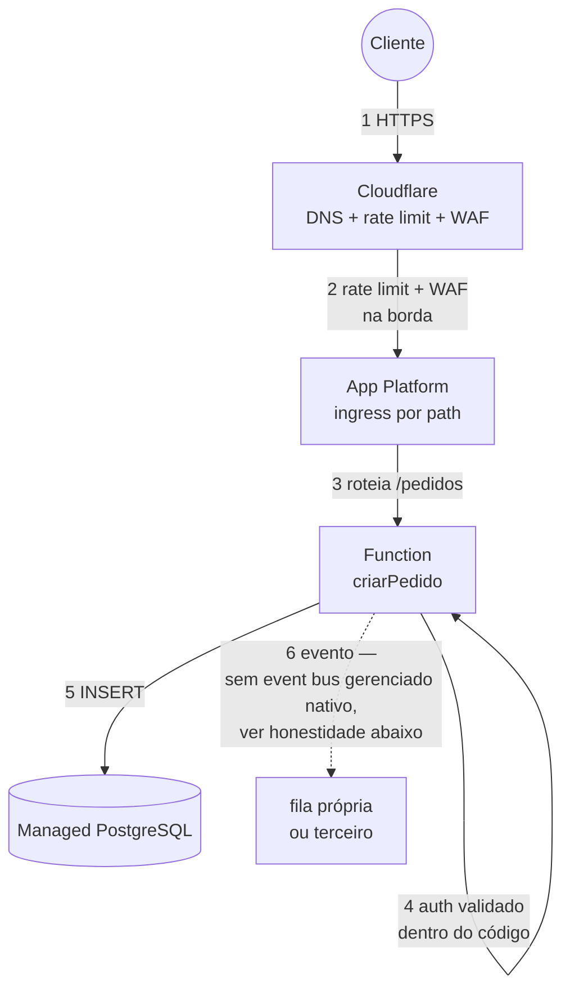

# Compondo a borda de API

> [!abstract] TL;DR
> Cinco notas construíram peça por peça: por que centralizar a borda de API, os três produtos do API Gateway (REST/HTTP/WebSocket) e sua anatomia, throttling/quotas/cache, os quatro mecanismos de autorização, e a honestidade sobre a lacuna da DigitalOcean. Esta nota monta as peças numa arquitetura serverless completa — cliente → DNS/CDN → API Gateway (JWT authorizer + throttle) → Lambda → mensageria/banco — e nomeia as decisões que fecham essa borda: REST ou HTTP API, qual authorizer, quanto throttle, quando cachear, que domínio customizado. Fecha com dois padrões de composição (BFF, API composition), os três anti-padrões que mais aparecem em produção, e a ponte que liga a borda síncrona construída aqui à mensageria assíncrona do galho anterior — as duas juntas formam a arquitetura event-driven completa que o próximo galho explora.

## O problema: a borda de API não é uma peça, é uma pilha de decisões

Volte à pergunta que abriu este galho: um cliente bate numa URL, e antes de qualquer linha do seu código rodar, uma sequência de decisões já aconteceu — quem é você, quanto você pode pedir, o que já foi respondido antes e pode ser reaproveitado, em qual domínio essa API vive. Cada nota deste galho isolou uma dessas decisões e a tratou a fundo. O que ainda falta é o que só aparece quando você monta a arquitetura de verdade: essas decisões não são independentes. A escolha de REST API versus HTTP API já restringe qual authorizer você pode usar; o authorizer escolhido muda o que a política de cache pode ou não fazer com segurança; e nada disso faz sentido sozinho — a borda de API só existe porque há algo do outro lado dela recebendo o tráfego que ela deixou passar.

Esse "algo do outro lado" é o resto do Bloco 3 desta trilha. O [[03-Dominios/Tecnologia/Cloud/11 - Serverless e FaaS — Lambda a fundo/index|galho 11]] construiu o Lambda que processa a requisição. Este galho construiu a porta de entrada gerenciada que aciona esse Lambda de forma síncrona. E o próximo pedaço da história — o que acontece depois que o Lambda decide que algo mais precisa saber do resultado — é mensageria assíncrona, que a trilha já cobriu no galho anterior a este. Esta nota é o lugar onde essas três peças finalmente aparecem no mesmo diagrama, com um request de verdade atravessando todas elas.

## O diagrama central: um request atravessando a borda de aplicação inteira

Um cenário concreto guia o resto da nota: uma API de checkout de e-commerce, `POST /pedidos`, que precisa autenticar o cliente, criar o pedido no banco, e notificar o resto do sistema (estoque, faturamento, notificação por e-mail) sem fazer o cliente esperar por nenhum desses três.



Repare na linha divisória mais importante do diagrama: os passos 1 a 8 são **síncronos** — o cliente está esperando uma resposta HTTP, e cada milissegundo nessa cadeia é latência que ele sente. O que sai do EventBridge para os três consumidores é **assíncrono** — o cliente já recebeu `201 Created` antes de qualquer um deles rodar. Essa é exatamente a fronteira entre este galho (a borda síncrona) e o galho de mensageria (o resto do sistema reagindo, sem que ninguém precise esperar por ele). A nota 05 do galho de mensageria já formalizou esse padrão sob o nome de escrita síncrona + notificação assíncrona; aqui você está vendo o lado que faltava daquele padrão — o request HTTP que dispara tudo.

## A pilha de decisões: cinco escolhas que fecham a borda

Cada decisão abaixo já foi justificada a fundo em alguma nota anterior deste galho. O que muda aqui é a ordem: elas não são cinco checkboxes independentes, são uma sequência onde a resposta de uma restringe a próxima.



**1. REST API ou HTTP API.** A nota 02 já detalhou a anatomia dos dois; a decisão prática é uma pergunta só: você vende acesso à API como produto (usage plans, API keys por cliente), precisa de WAF integrado ou cache gerenciado de resposta? Se sim, REST API — não há alternativa, essas features simplesmente não existem no HTTP API. Se não — se o caso é "Lambda atrás de uma URL, com JWT, sem cliente pagando por tier" — HTTP API, mais barato e com deploy automático. O checkout deste diagrama não vende a API a terceiros; é HTTP API.

**2. Qual authorizer.** Serviço-a-serviço com credencial AWS existente → `AWS_IAM`. Usuário final autenticado por um provedor OIDC padrão (Cognito, Auth0, Okta) → JWT authorizer nativo se você escolheu HTTP API, ou Cognito authorizer se escolheu REST API. Lógica que nenhum dos prontos cobre (checagem de tier, múltiplas fontes, integração com sistema legado de auth) → Lambda authorizer, em qualquer um dos dois tipos. O checkout usa JWT authorizer contra um Cognito user pool — o caso mais comum de aplicação nova, coberto na nota 04.

**3. Throttling: o teto de segurança, sempre presente.** Independente do que veio antes, todo estágio de produção precisa de throttle configurado — é o "cinto de segurança" que a nota 03 descreveu, protegendo o backend mesmo se uma camada anterior falhar. Um HTTP API não tem usage plans por cliente, mas tem throttle de estágio (rate/burst por segundo, aplicável globalmente à API). Se o caso de uso precisar de limite diferenciado por cliente pagante, essa é, sozinha, uma razão suficiente para ter escolhido REST API no passo 1.

**4. Cache: só onde a resposta é idempotente e tolera atraso.** Cache de resposta gerenciado só existe no REST API. `POST /pedidos` nunca é cacheável — é uma escrita. Um hipotético `GET /pedidos/{id}/status` poderia ser, com um TTL curto. Se a API inteira é HTTP API (sem cache nativo) e algum endpoint de leitura pesada precisa de cache mesmo assim, a saída é cache do lado da aplicação (dentro do Lambda, ou num ElastiCache — o galho de bancos já cobriu essa peça) ou uma camada de CDN na frente, se o conteúdo for compartilhado entre usuários.

**5. Custom domain.** Por padrão a API vive em `https://abc123.execute-api.us-east-1.amazonaws.com/prod` — uma URL que nenhum cliente deveria ver em produção. Configurar `api.loja.com` como domínio customizado, com certificado ACM, é a mesma peça que a nota [[03-Dominios/Tecnologia/Cloud/10 - DNS, CDN e borda/04 - TLS e certificados na borda|TLS e certificados na borda]] detalhou — o galho 10 já resolveu essa parte da equação; o API Gateway só consome o certificado.

```bash
# A espinha da decisão em CLI: HTTP API + JWT authorizer + throttle de estágio
API_ID=$(aws apigatewayv2 create-api --name "checkout-api" \
  --protocol-type HTTP --query 'ApiId' --output text)

AUTH_ID=$(aws apigatewayv2 create-authorizer \
  --api-id $API_ID --authorizer-type JWT \
  --identity-source '$request.header.Authorization' \
  --jwt-configuration Audience=meuAppClientId,Issuer=https://cognito-idp.us-east-1.amazonaws.com/us-east-1_XXXXX \
  --name jwt-checkout --query 'AuthorizerId' --output text)

aws apigatewayv2 create-route --api-id $API_ID \
  --route-key "POST /pedidos" \
  --authorization-type JWT --authorizer-id $AUTH_ID \
  --target integrations/$INTEGRATION_ID

aws apigatewayv2 update-stage --api-id $API_ID --stage-name prod \
  --default-route-settings ThrottlingRateLimit=300,ThrottlingBurstLimit=600
```

## O que acontece quando algo na borda diz "não"

O diagrama central mostrou o caminho feliz. Vale também percorrer os dois caminhos onde a borda barra o request antes dele custar um centavo de Lambda ou de banco — porque é justamente aí que a pilha de decisões da seção anterior prova seu valor.



O detalhe que vale nomear explicitamente: nos dois ramos de rejeição, o Lambda **nunca roda** — nem o `INSERT` no banco, nem a publicação do evento acontecem. É exatamente o "amortecedor" que a nota 03 descreveu, agora desenhado dentro do fluxo completo, não isolado: cada `401` e cada `429` que a borda resolve sozinha é trabalho, tempo de execução e dinheiro que a arquitetura inteira — Lambda, RDS, EventBridge — nunca chega a gastar. Uma API mal desenhada, sem authorizer ou sem throttle, empurra essa mesma decisão para dentro do Lambda (que precisaria validar o token e checar limites ele mesmo) ou, pior, não a toma em lugar nenhum.

## Dois padrões de composição: BFF e API composition, de raspão

A borda de API não serve só "uma API, um backend". Duas variações aparecem com frequência suficiente em arquiteturas reais para merecer nome, mesmo que este galho não as aprofunde — vale reconhecê-las quando aparecerem numa entrevista ou num diagrama de terceiro.

**Backend-for-Frontend (BFF)**: em vez de um único API Gateway genérico servindo todos os clientes (web, mobile, parceiro externo) com o mesmo contrato, cada tipo de cliente ganha sua própria API — geralmente seu próprio API Gateway ou pelo menos seu próprio conjunto de rotas — desenhada especificamente para o que aquele cliente precisa. O app mobile tem uma tela de "resumo do pedido" que precisa de três campos; o painel administrativo web precisa de vinte. Sem BFF, os dois compartilham o mesmo endpoint genérico e um deles paga o preço (over-fetching no mobile, ou um segundo endpoint especial que ninguém queria manter). Com BFF, `GET /mobile/pedidos/{id}` e `GET /admin/pedidos/{id}` são rotas (ou APIs) diferentes, cada uma com o payload exato que seu consumidor precisa, ambas chamando o mesmo Lambda de domínio por trás — ou orquestrando chamadas diferentes.

**API composition**: quando um único request do cliente precisa de dados que vivem em serviços diferentes — o resumo do pedido, mas com o nome do produto (serviço de catálogo) e o status de entrega (serviço de logística) — alguém precisa agregar essas respostas antes de devolver uma única resposta ao cliente. Isso pode acontecer dentro de um Lambda dedicado a orquestração (chama os dois serviços, junta o resultado, devolve), ou — em cenários mais ricos — com uma camada de GraphQL na borda (AWS AppSync é o serviço dedicado a isso na AWS, fora do escopo deste galho). O API Gateway sozinho não faz composição: ele roteia uma requisição por vez para uma integration; quem agrega é o código atrás dele.



> [!tip] Assista: "Backends for Frontends": what is it?
> **Canal:** Software Developer Diaries | **Duração:** ~8min | **Idioma:** EN
>
> Desenha o mesmo problema do zero: uma API genérica compartilhada entre web, mobile e TV força cada cliente a puxar (ou sofrer com) dados que não precisa, até quebrar em uma API dedicada por tipo de cliente — a mesma separação `/mobile/*` vs `/admin/*` do diagrama acima.
> Trecho de destaque [03:24]: *"instead of having a general purpose API, we're going to create separate backends for every use case, or let's say user interface — we're going to call it BFF, which stands for backend for frontends."*
>
> 🎬 [Assistir no YouTube](https://www.youtube.com/watch?v=tmGnpU8xOGE)

> [!tip] Assista: API Composition Pattern in Microservices
> **Canal:** Arpit Bhayani | **Duração:** ~26min | **Idioma:** EN
>
> Detalha o mesmo papel do Lambda orquestrador do código acima — um "composer" no meio que chama vários serviços e junta a resposta — e no restante do vídeo (fora do trecho citado) discute os trade-offs de latência e acoplamento que crescem quando a composição vira multi-nível.
> Trecho de destaque [04:39]: *"a super simple implementation is API composition — what we do is we put a middleman, a composer sitting in between. The user makes a request to composer, this composer knows what to do [...] would talk to order service, would talk to payment service, would talk to logistics service."*
>
> 🎬 [Assistir no YouTube](https://www.youtube.com/watch?v=5pYLlYsy6fQ)

Nenhum dos dois padrões é exclusivo de serverless — BFF e API composition existem há muito mais tempo do que o API Gateway gerenciado, em qualquer arquitetura de microsserviços. O que muda aqui é só onde eles se encaixam nesta pilha: BFF vira uma decisão de quantas APIs (ou quantos conjuntos de rotas) você provisiona; composition vira uma decisão de onde a lógica de agregação mora — quase sempre num Lambda, nunca no Gateway em si.

Um Lambda de composição, resolvendo o exemplo do resumo de pedido, torna concreto o que "agregar" significa na prática — duas chamadas independentes, despachadas em paralelo, uma única resposta montada no fim:

```javascript
// Lambda orquestrador atrás de GET /pedidos/{id}/resumo
// Agrega catálogo + logística numa única resposta pro cliente
const { InvokeCommand, LambdaClient } = require('@aws-sdk/client-lambda');
const lambda = new LambdaClient();

exports.handler = async (event) => {
  const pedidoId = event.pathParameters.id;

  // Duas chamadas independentes, disparadas em paralelo — não em série
  const [catalogoResp, logisticaResp] = await Promise.all([
    lambda.send(new InvokeCommand({
      FunctionName: 'buscarProdutoDoPedido',
      Payload: JSON.stringify({ pedidoId }),
    })),
    lambda.send(new InvokeCommand({
      FunctionName: 'buscarStatusEntrega',
      Payload: JSON.stringify({ pedidoId }),
    })),
  ]);

  const produto = JSON.parse(Buffer.from(catalogoResp.Payload).toString());
  const entrega = JSON.parse(Buffer.from(logisticaResp.Payload).toString());

  return {
    statusCode: 200,
    body: JSON.stringify({
      pedidoId,
      produto: produto.nome,
      statusEntrega: entrega.status,
      previsao: entrega.previsaoEntrega,
    }),
  };
};
```

O detalhe que separa uma composição bem feita de uma ruim é o `Promise.all` — chamar catálogo e depois logística em série, esperando a primeira terminar antes de iniciar a segunda, dobra a latência do request sem necessidade nenhuma, já que as duas chamadas não dependem uma da outra. É um erro pequeno de código que se torna um problema de arquitetura quando multiplicado por todas as rotas que fazem o mesmo tipo de agregação.

## As três costuras com o resto do Bloco 3

Este galho não existe isolado — ele é a peça que faz o Bloco 3 funcionar de ponta a ponta, e vale nomear explicitamente onde cada costura acontece.

- **Com o [[03-Dominios/Tecnologia/Cloud/11 - Serverless e FaaS — Lambda a fundo/index|galho 11 (Lambda)]]**: o API Gateway é o gatilho síncrono padrão do Lambda para tráfego HTTP — a nota 03 daquele galho já cobriu o modelo de eventos e triggers em geral; aqui você viu a metade que faltava, o lado do Gateway que empacota o request na forma que o Lambda espera (payload format, `event.requestContext`). A nota [[03-Dominios/Tecnologia/Cloud/11 - Serverless e FaaS — Lambda a fundo/06 - Quando serverless faz (e não faz) sentido|Quando serverless faz sentido]] já discutiu os limites dessa combinação — cold start, timeout de 29 segundos do API Gateway (menor que o timeout máximo do próprio Lambda), e quando um Lambda por trás de um Gateway deixa de ser a resposta certa.
- **Com o galho 12 (Containers gerenciados)**: a integração HTTP do API Gateway (vista na nota 02) não exige Lambda do outro lado — ela pode apontar para um serviço containerizado, seja direto via HTTP integration num endpoint público, seja via VPC Link para um NLB/ALB na frente de um serviço ECS/Fargate privado. É a mesma "fachada única" da nota 01 deste galho, agora com um backend de container em vez de função — o API Gateway não sabe nem precisa saber a diferença.
- **Com o galho de mensageria**: o diagrama central desta nota mostrou exatamente esse ponto. O Lambda por trás do API Gateway é, tipicamente, o **produtor** que inicia um fluxo de eventos — publicando numa fila SQS, um tópico SNS ou um event bus do EventBridge — depois de responder ao cliente. A borda de API decide *se* e *quando* um request entra no sistema; a mensageria decide o que acontece depois, sem bloquear ninguém.

## A lente dupla: montando isso na AWS e na DigitalOcean

Na AWS, tudo o que este diagrama central desenha existe como produto gerenciado, configurável dentro de um único painel: HTTP API, JWT authorizer, throttle de estágio, Lambda, EventBridge, RDS — seis serviços, uma conta, uma superfície de billing.

Na DigitalOcean, a nota 05 já deixou claro que não há um API Gateway equivalente. Montar o mesmo cenário de checkout na DO significa compor, não configurar um produto único:



Duas honestidades se acumulam aqui, cada uma já nomeada em notas anteriores deste galho e do galho de mensageria:

- **A borda**: Cloudflare cobre rate limiting e WAF (o que o App Platform sozinho não tem); a validação de JWT vira código dentro da própria Function, porque não existe JWT authorizer nativo do lado da DO — a nota 04 já foi explícita sobre essa lacuna.
- **A mensageria**: a DigitalOcean não tem um serviço equivalente ao EventBridge ou SNS/SQS gerenciados de forma tão rica; publicar um evento a partir da Function tipicamente significa gravar numa fila própria (Redis, RabbitMQ auto-hospedado) ou chamar um serviço de terceiro.

O padrão que se repete em todo este galho aparece de novo aqui, em escala de arquitetura completa: a AWS entrega a pilha inteira como produtos configuráveis dentro de um único provedor; a DigitalOcean entrega parte dela nativamente e pede composição — com terceiros ou com código próprio — para o resto. Nenhuma das duas é "errada"; a pergunta certa, como em todo o resto da trilha, é que fatia dessa complexidade o seu time está disposto a operar.

A espinha equivalente, agora em `app.yaml` (App Platform) e numa regra de Cloudflare em prosa — deliberadamente sem CLI unificada, porque, como a nota 05 já apontou, não existe uma ferramenta só que configure as duas contas:

```yaml
# app.yaml — App Platform, roteamento e TLS automático
name: checkout-api
functions:
  - name: criar-pedido
    source_dir: functions/criar-pedido
ingress:
  rules:
    - match:
        path:
          prefix: /pedidos
      component:
        name: criar-pedido
databases:
  - name: checkout-db
    engine: PG
    production: true
```

```
Regra de rate limit (Cloudflare, na frente do domínio api.loja.com):
  SE  path começa com "/pedidos"
  E   requisições do mesmo token de sessão > 300 em 60s
  ENTÃO responder 429, sem repassar pra origem DO

Autenticação (dentro da própria Function criar-pedido, em código):
  1. extrai o JWT do header Authorization
  2. valida assinatura contra o jwks_uri do provedor OIDC
  3. se inválido, retorna 401 — o mesmo resultado do JWT authorizer
     nativo da AWS, só que é código seu, não configuração declarativa
```

A diferença que mais importa reter, olhando as duas versões lado a lado: na AWS, o `AUTH` e o `THR` do diagrama central são **caixas do próprio Gateway** — configuração, não código de aplicação. Na DO, a validação de token vira uma função dentro do handler da Function, e o rate limit vive numa conta separada (Cloudflare), fora do app spec inteiramente. Isso não é necessariamente pior para um time pequeno — significa menos peças gerenciadas separadamente, mas move responsabilidade de "configurar" para "programar e testar", com todo o custo de manutenção que código próprio sempre carrega em relação a um recurso declarativo gerenciado.

## Caso prático: fechando o checkout do início ao fim

Retomando o diagrama central com números concretos de configuração, a decisão completa fica assim:

| Camada | Escolha | Por quê |
|---|---|---|
| Tipo de API | HTTP API | Sem venda de API como produto, sem necessidade de WAF ou cache gerenciado |
| Authorizer | JWT nativo, issuer = Cognito user pool | Usuário final autenticado, provedor OIDC padrão, zero Lambda extra |
| Throttle de estágio | 300 rps / 600 burst | Teto de segurança acima do que o Lambda + RDS aguentam com folga |
| Cache | Nenhum | `POST /pedidos` é escrita, nunca cacheável |
| Custom domain | `api.loja.com`, certificado ACM regional | HTTP API exige certificado na mesma região, não em `us-east-1` fixo |
| Integração | Lambda proxy | Payload completo no `event`, parsing no código, não em VTL |
| Pós-processamento | EventBridge, evento `PedidoCriado` | Estoque/faturamento/e-mail reagem sem bloquear o `201 Created` |

O request completo, do clique do cliente até a resposta, nunca espera pelos três consumidores do evento — e é essa independência de tempo, mais do que qualquer detalhe de configuração isolado, que separa uma arquitetura serverless bem desenhada de uma que só trocou "servidor" por "função" sem mudar a forma como as partes conversam.

Vale amarrar essa decisão com o que ela custa. A tabela abaixo junta, num só lugar, o padrão de cobrança de cada camada que apareceu no diagrama central — sem prometer um número final, pela mesma razão que a nota de armazenamento e a nota de bancos já explicaram: cada linha depende de volume real.

| Camada | O que cobra | Fonte |
|---|---|---|
| HTTP API (requests) | Por milhão de requisições processadas, ~70% mais barato que REST API na mesma região | Nota 02 deste galho |
| JWT authorizer nativo | Sem cobrança adicional — embutido no preço da requisição, ao contrário do Lambda authorizer, que soma uma invocação Lambda extra por requisição não cacheada | Nota 04 deste galho |
| Throttle de estágio | Sem cobrança direta — é uma política, não um recurso provisionado | Nota 03 deste galho |
| Lambda (`criarPedido`) | Por invocação + GB-segundo de execução, cold start incluso no tempo cobrado | Galho 11, nota 05 |
| RDS / Managed DB | Por hora de instância + storage, dobrado se Multi-AZ | Galho 9, nota 02-03 |
| EventBridge | Por milhão de eventos publicados; regras e destinos adicionais podem somar custo por invocação de destino | Galho 13, nota 04 |
| Custom domain (ACM) | Certificado TLS emitido pelo ACM é gratuito para uso com serviços integrados da AWS; o custo real é o do próprio API Gateway/CloudFront que o consome | Nota 02 deste galho |

> [!info] Fatura ilustrativa, não uma cotação
> Como no capstone do Bloco 2, esta tabela mostra a *forma* da fatura — o que cobra por requisição, o que cobra por tempo de execução, o que é gratuito por si só — não um número somado. Para orçar de verdade, sempre a calculadora oficial (`aws.amazon.com/api-gateway/pricing/`) com o volume real esperado.

## Quando o API Gateway não é a resposta certa, nem dentro da própria AWS

Vale fechar a decisão arquitetural com a mesma honestidade que a nota 05 já aplicou: ter o API Gateway disponível não significa que ele é sempre a peça certa, mesmo dentro do território AWS. Se o checkout deste capstone precisar escalar para um volume de tráfego muito alto, com pouca necessidade de authorizer plugável ou throttle diferenciado por cliente, um **Application Load Balancer apontando direto para o Lambda** (target type `lambda` no target group) é uma alternativa real — sem API Gateway no meio, sem usage plans, sem JWT authorizer nativo, mas também sem o custo por milhão de requisições do Gateway, especialmente relevante quando o ALB já existe por outro motivo (por exemplo, servindo tráfego para um serviço em ECS no mesmo domínio). A troca é a mesma que a nota 05 já nomeou: você abre mão de features ricas de gestão de API em troca de previsibilidade de custo em alto volume. Para o checkout deste capstone — volume moderado, authorizer JWT genuinamente necessário, throttle por estágio suficiente — o HTTP API continua sendo a escolha certa; a alternativa existe para quando o cálculo de volume mudar essa resposta.

## Tabela de tradução: Azure e GCP

Como em todo o resto deste galho, isto é vocabulário para reconhecer numa vaga ou numa arquitetura de terceiro — não é hands-on.

| Conceito desta arquitetura | AWS | Azure | GCP |
|---|---|---|---|
| Gateway de API + trigger de função | API Gateway (HTTP API) + Lambda | APIM Consumption + Azure Functions HTTP trigger | Cloud Endpoints/API Gateway + Cloud Functions |
| Validação de JWT na borda | JWT authorizer nativo | Política `validate-jwt` no APIM | Autenticação JWT no API Gateway |
| Event bus para pós-processamento assíncrono | EventBridge | Azure Event Grid | Eventarc / Pub/Sub |
| BFF por tipo de cliente | Múltiplas APIs/rotas no API Gateway | Múltiplas APIM instances/products | Múltiplos Cloud Endpoints |

## Anti-padrões

> [!warning] API Gateway como service mesh interno
> É tentador, depois de ver o Gateway centralizar auth e roteamento tão bem para tráfego externo, começar a rotear chamadas *internas* entre microsserviços através dele também — serviço A chama serviço B via uma URL pública do API Gateway, em vez de uma chamada direta dentro da rede privada. Isso mistura dois problemas diferentes: a borda de API existe para tráfego que cruza um perímetro de confiança (cliente externo → sistema); comunicação serviço-a-serviço dentro do mesmo sistema é malha interna, resolvida com service discovery, mTLS interno ou um service mesh de verdade (Istio, App Mesh) — não com uma peça desenhada para ser a porta de entrada pública. Cada chamada interna passando pelo Gateway público adiciona latência, custo por requisição e uma dependência desnecessária de disponibilidade de um serviço que deveria ser puramente interno.

> [!warning] Lógica de negócio dentro de mapping template
> A nota 02 já mostrou VTL fazendo transformação de payload — uma ferramenta legítima para adaptar formato entre cliente e backend legado. O anti-padrão é usar essa mesma ferramenta para decidir: "se o campo `tier` for `premium`, aplique desconto de 10%" dentro do template, em vez de no código. VTL não tem testes unitários fáceis, não tem debugger, não versiona como código de aplicação, e vive fora do repositório onde o resto da lógica de negócio mora. Regra prática: mapping template traduz forma (json → json, campo A vira campo B); nunca decide (if/else de negócio). No momento em que um template precisa de um `#if` que expressa uma regra de produto, essa regra pertence ao Lambda, não ao Gateway.

> [!warning] Esquecer throttling e tomar bill shock ou DoS
> Uma API sem throttle configurado — e HTTP API não vem com um throttle restritivo por padrão, é preciso configurar — está exposta a dois riscos simultâneos: um script com bug em loop pode gerar uma fatura de Lambda + RDS muito acima do esperado antes que alguém perceba, e um ataque deliberado de negação de serviço encontra zero resistência antes de chegar ao backend. A nota 03 já foi explícita que throttling é best-effort, não garantia absoluta — mas best-effort configurado é infinitamente melhor que nenhum throttle. Nenhuma API de produção deveria ir ao ar sem, no mínimo, um throttle de estágio definido conscientemente, mesmo que generoso.

## Confirmando por comando, não por memória

O mesmo hábito que os capstones anteriores desta trilha já praticaram — verificar a configuração real em vez de assumir que ela é o que você lembra de ter digitado:

```bash
# O authorizer configurado na rota é mesmo o JWT esperado, com o issuer certo?
aws apigatewayv2 get-authorizers --api-id $API_ID \
  --query 'Items[].{Nome:Name,Tipo:AuthorizerType,Issuer:JwtConfiguration.Issuer}'
```

```json
[{ "Nome": "jwt-checkout", "Tipo": "JWT", "Issuer": "https://cognito-idp.us-east-1.amazonaws.com/us-east-1_XXXXX" }]
```

```bash
# O throttle de estágio está de fato aplicado, não só configurado no template?
aws apigatewayv2 get-stage --api-id $API_ID --stage-name prod \
  --query 'DefaultRouteSettings.{Rate:ThrottlingRateLimit,Burst:ThrottlingBurstLimit}'
```

```json
{ "Rate": 300, "Burst": 600 }
```

Nenhum desenho de arquitetura vale o diagrama que o descreve até alguém confirmar, por comando, que a conta viva bate com o que o diagrama promete — o mesmo princípio que atravessou os dois capstones anteriores do Bloco 2, agora aplicado à borda de API.

## O que vem a seguir

Este galho fechou a borda síncrona: como um request HTTP entra num sistema serverless, é autenticado, tem sua taxa controlada, opcionalmente serve de cache, e aciona o backend certo. O diagrama central desta nota já deixou visível a peça que falta: o que acontece depois que o Lambda termina de responder ao cliente e publica um evento — a mensageria assíncrona que o galho anterior desta trilha cobriu a fundo. A próxima etapa da trilha junta as duas metades: a borda síncrona (este galho) mais a espinha assíncrona (mensageria) formam, juntas, o que se chama de arquitetura event-driven completa — sistemas onde o request-response inicial é só a ponta visível, e a maior parte do trabalho real acontece em reação a eventos, sem ninguém esperando por eles. É esse desenho, de ponta a ponta, que o próximo galho da trilha explora.

## Fontes

- AWS. "Choose between REST APIs and HTTP APIs." https://docs.aws.amazon.com/apigateway/latest/developerguide/http-api-vs-rest.html
- AWS. "Working with AWS Lambda proxy integrations for HTTP APIs." https://docs.aws.amazon.com/apigateway/latest/developerguide/http-api-develop-integrations-lambda.html
- AWS. "Control access to HTTP APIs with JWT authorizers in API Gateway." https://docs.aws.amazon.com/apigateway/latest/developerguide/http-api-jwt-authorizer.html
- AWS. "Throttle requests to your HTTP APIs." https://docs.aws.amazon.com/apigateway/latest/developerguide/http-api-request-throttling.html
- AWS. "Amazon EventBridge." https://docs.aws.amazon.com/eventbridge/latest/userguide/eb-what-is.html
- DigitalOcean. "App Platform — App Spec Reference (ingress)." https://docs.digitalocean.com/products/app-platform/reference/app-spec/
- DigitalOcean. "App Platform Product documentation." https://docs.digitalocean.com/products/app-platform/

> [!info] Verificado 2026-07-24
> O timeout máximo de integração do API Gateway (29 segundos, menor que o timeout máximo de 15 minutos de uma função Lambda invocada diretamente) é citado de memória a partir de material consolidado nas notas 02 e do galho 11 desta trilha, não reconfirmado nesta sessão via WebFetch — reconfira em `docs.aws.amazon.com/apigateway/latest/developerguide/limits.html` antes de depender desse número num desenho crítico.
