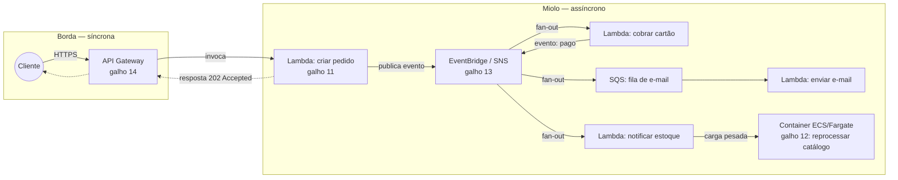
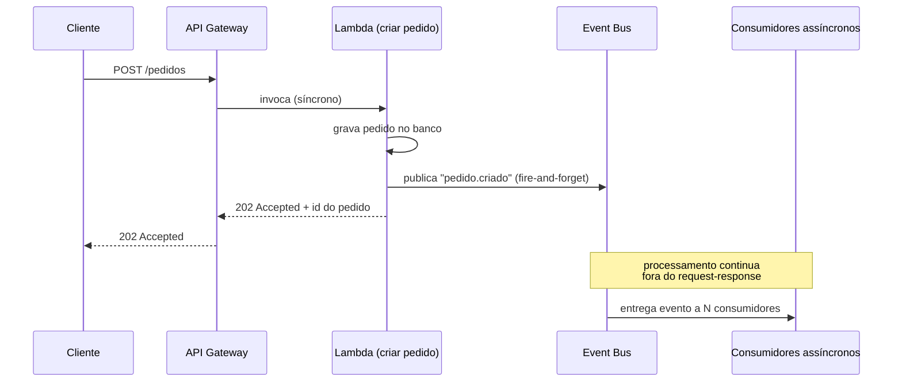

> [!abstract] TL;DR
> Arquitetura event-driven é o sistema reagindo a eventos — "isto aconteceu" — em vez de seguir um roteiro fixo de chamadas síncronas. Na nuvem, ela nasce da combinação de quatro peças que você já conhece separadamente: a porta síncrona (API Gateway), o compute reativo (Lambda/FaaS), a cola assíncrona (mensageria) e os workloads longos (containers). A borda do sistema costuma ser síncrona — o cliente quer resposta na hora — mas o miolo é assíncrono, desacoplado por eventos. O ganho é escala independente e resiliência a falha parcial; o custo é debugging distribuído e consistência eventual.

## O problema que motivou os últimos quatro galhos

Pare um segundo e olhe pra trás. Nos galhos 11 a 14 você conheceu, uma de cada vez, quatro peças:

- **Galho 11** — Lambda/FaaS: código que roda sob demanda, sem servidor pra gerenciar.
- **Galho 12** — containers gerenciados: workloads que precisam rodar por mais tempo, com mais controle sobre runtime.
- **Galho 13** — mensageria e eventos gerenciados (SQS, SNS, EventBridge): a cola que carrega mensagens entre partes do sistema.
- **Galho 14** — API Gateway: a porta de entrada HTTP, com autenticação, throttling e roteamento.

Cada peça, isolada, resolve um problema pontual. Mas nenhuma delas, sozinha, é uma arquitetura. Você pode ter um Lambda perfeito, uma fila SQS impecável, um API Gateway bem configurado — e ainda assim não ter pensado em como eles se encaixam pra formar um *sistema* que reage ao mundo.

É essa a pergunta deste galho: como transformar peças soltas numa arquitetura coesa? E a resposta começa por entender o paradigma que amarra tudo — **event-driven** — antes de entrar em ferramentas de orquestração (Step Functions, no galho seguinte) ou em pipelines de dados (mais adiante).

## O que é, de fato, um evento

Um evento é um fato que já aconteceu, registrado como dado: "o pedido #4471 foi criado", "o arquivo `relatorio.csv` foi enviado ao bucket", "o usuário clicou em comprar". Repare no tempo verbal — passado. Um evento não é um comando ("processe este pedido"); é uma notificação de que algo mudou de estado.

Essa diferença sutil é a raiz de tudo. Num sistema orientado a comando, quem envia sabe (e se importa) quem vai receber e o que vai acontecer depois. Num sistema orientado a evento, quem produz o evento não sabe — e não precisa saber — quem vai consumi-lo, nem quantos consumidores existem, nem o que cada um vai fazer.

> [!question] Por que isso importa tanto?
> Porque é essa ignorância mútua que permite **desacoplamento**. Um serviço de pedidos pode emitir "pedido criado" sem jamais ter ouvido falar do serviço de e-mail, do serviço de estoque ou do serviço de analytics que vão reagir a esse evento. Novos consumidores podem aparecer amanhã sem que uma linha do produtor mude.

Os três papéis de uma arquitetura event-driven são sempre os mesmos:

- **Produtor** — quem detecta o fato e emite o evento (um serviço, um upload de arquivo, um clique).
- **Evento** — o dado em si, geralmente pequeno, autocontido, carimbado com tipo e timestamp.
- **Consumidor** — quem reage ao evento, um ou muitos, cada um fazendo sua própria coisa.

Esse tripé já apareceu, disperso, nos galhos anteriores: o galho 13 mostrou os canais (SQS, SNS, EventBridge) que carregam o evento do produtor ao consumidor; o galho 11 mostrou o Lambda como um tipo comum de consumidor (e às vezes produtor). Este galho amarra o tripé numa arquitetura.

> [!tip] Assista: Arquitetura Orientada a Eventos: Lidando com a complexidade
> **Canal:** Full Cycle | **Duração:** ~35min | **Idioma:** PT-BR
>
> Complementa o tripé produtor/evento/consumidor desta nota com o ângulo de quem já sofreu na pele o acoplamento: a palestra mostra como um sistema cresce, ganha módulos, e só depois de sentir dor descobre que precisava desacoplar — o mesmo argumento que a nota faz, mas contado como história real de arquitetura, não como definição a priori. Trecho de destaque [07:14]: *"em algum momento vai ter algum consumidor interessado que vai tirar proveito disso, vai consumir"*
>
> 🎬 [Assistir no YouTube](https://www.youtube.com/watch?v=bBNK1VbaZ1I)

## Os building blocks, recapitulados e encaixados

Pense numa aplicação de e-commerce simples: um cliente faz um pedido pelo navegador. O que acontece?

Note a topologia: o cliente bate na porta (API Gateway), a porta aciona o primeiro Lambda, e a partir dali o sistema deixa de conversar por chamada direta e passa a conversar por evento publicado. O Lambda que cria o pedido não chama o Lambda que cobra o cartão — ele publica "pedido criado" e vai embora. Quem quiser saber, que assine.

Isso não é acidente de implementação — é a decisão arquitetural central deste galho: **onde a borda do sistema termina e o miolo assíncrono começa.**

## Síncrono na borda, assíncrono no miolo

Aqui mora a tensão mais prática de toda arquitetura serverless: o cliente (humano ou outro sistema) quer uma resposta HTTP na hora. Ninguém aceita um navegador travado esperando três segundos enquanto sete microsserviços reagem em cascata. Mas o processamento de fundo — cobrar cartão, atualizar estoque, mandar e-mail, recalcular recomendação — não precisa (e não deve) travar essa resposta.

A solução de projeto é quase sempre a mesma: **responda rápido, processe depois.**

O código HTTP `202 Accepted` (em vez de `200 OK`) é quase um símbolo dessa arquitetura: "recebi seu pedido, vou processar, não espere aqui". O cliente que precisa saber o resultado final consulta depois (polling num endpoint de status) ou recebe um push (webhook, WebSocket, notificação).

Isso significa que **push vs. pull** e **sync vs. async** convivem na mesma arquitetura, em camadas diferentes:

| Camada | Padrão | Exemplo |
|---|---|---|
| Cliente → borda | Síncrono, pull (cliente pergunta e espera) | HTTP request/response via API Gateway |
| Borda → primeiro compute | Síncrono (a Lambda de borda ainda responde ao Gateway) | Lambda proxy integration |
| Compute → mensageria | Assíncrono, push (produtor empurra e segue) | `PutEvents` no EventBridge, `Publish` no SNS |
| Mensageria → consumidor (fila) | Assíncrono, pull (consumidor puxa no seu ritmo) | Lambda faz *poll* do SQS, ou Event Source Mapping automatiza o poll |
| Mensageria → consumidor (pub/sub) | Assíncrono, push (o bus empurra pro assinante) | SNS/EventBridge invocam o Lambda diretamente |

Se esse quadro de push/pull/sync/async soa familiar, é porque é — o galho 13 (mensageria) já tratou fila vs. tópico em detalhe, e a nota 3 do domínio de API na borda (galho 14) tratou a resposta síncrona. Aqui o que muda é a lente: não é mais "como funciona esse serviço", é "onde no fluxo do pedido cada padrão se aplica".

## Benefícios: por que vale a complexidade

Três ganhos concretos justificam desenhar assim, em vez de uma cadeia de chamadas síncronas encadeadas:

**Escala independente.** Se o Lambda de cobrança de cartão está lento hoje (a operadora de cartão está com latência alta), isso não trava a criação de pedidos nem o envio de e-mail. Cada consumidor escala — ou falha — no seu próprio ritmo, porque não há chamada bloqueante entre eles.

**Resiliência a falha parcial.** Numa cadeia síncrona A→B→C→D, se D cai, a cadeia inteira falha e o cliente vê erro. Numa cadeia orientada a evento, se o consumidor de e-mail está fora do ar, a fila (SQS) simplesmente acumula as mensagens até ele voltar. O pedido já foi criado, o pagamento já foi cobrado — só o e-mail está atrasado, e ninguém percebeu.

**Evolução desacoplada.** Quer adicionar um novo consumidor — por exemplo, um serviço de fraude que analisa todo pedido criado? Assine o evento "pedido.criado". Não precisa tocar no código que cria o pedido. Esse é o mesmo argumento de baixo acoplamento que aparece em Comunicação entre Sistemas, só que aqui materializado em serviços gerenciados da nuvem.

## Os custos: o que ninguém te conta antes

> [!warning] Event-driven não é grátis em complexidade
> Você trocou uma pilha de chamadas fácil de seguir (`A chama B chama C`) por um grafo de eventos que só existe, de fato, em runtime. Não tem stack trace. Um "pedido não chegou no e-mail" pode significar: o evento não foi publicado, foi publicado mas a regra do EventBridge não casou o padrão, casou mas o SQS entregou fora de ordem, ou entregou e o Lambda falhou silenciosamente e caiu numa dead-letter queue que ninguém está olhando. Rastrear essa cadeia exige tracing distribuído (X-Ray, OpenTelemetry) desde o dia 1 — não é opcional em produção.

Outros custos reais:

- **Consistência eventual.** O pedido existe no banco antes do estoque ser debitado. Existe uma janela — de milissegundos a segundos — em que o sistema está "inconsistente" sob a ótica de uma transação clássica. Se seu domínio não tolera essa janela (ex.: saldo bancário), event-driven puro é a arquitetura errada pra aquele pedaço específico.
- **Debugging distribuído.** Reproduzir um bug exige recriar a sequência de eventos, não só rodar uma função com um input. Ferramentas de observabilidade deixam de ser luxo.
- **Ordem e duplicação.** Filas e tópicos gerenciados, em geral, não garantem ordem estrita nem entrega exatamente uma vez (o galho 13 já tratou at-least-once vs. exactly-once). Seu código consumidor precisa ser idempotente — processar o mesmo evento duas vezes não pode quebrar nada.

Este galho não vai fundo em observabilidade de sistemas distribuídos — isso é assunto do Bloco 4 (operação e governança da trilha Cloud) e da trilha de Operação. Aqui a bandeira é só: saiba que esse custo existe antes de assinar embaixo da arquitetura.

## Fronteira: isso é conceito de arquitetura, não feature de nuvem

Vale marcar uma fronteira importante. "Event-driven architecture" como *estilo arquitetural* — produtores, consumidores, desacoplamento, os prós e contras que você acabou de ler — não é invenção da AWS nem da DigitalOcean. É um padrão de design de sistemas que existe independente de nuvem, tratado com profundidade em [[03-Dominios/Engenharia/Comunicação entre Sistemas/index|Comunicação entre Sistemas]] (mensageria, contratos de evento, coreografia entre serviços).

O que este galho 15 faz é diferente e mais estreito: mostrar a **encarnação serverless na nuvem** desse padrão — como AWS e DigitalOcean te dão (ou não dão) os blocos gerenciados pra montar essa arquitetura sem operar a infraestrutura de eventos você mesmo. Se você quer entender *por que* desacoplar por eventos é bom design, a resposta longa está em Comunicação. Se você quer saber *com o que* montar isso na AWS ou na DO, a resposta está aqui.

## A lente dupla: AWS tem o catálogo completo, DigitalOcean monta na mão

É aqui que a diferença entre as duas nuvens fica mais nítida do que em qualquer galho anterior. A AWS não vende só peças soltas — vende um **catálogo inteiro desenhado pra se encaixar**: EventBridge como roteador central de eventos com regras e transformação, Step Functions pra orquestrar (próxima nota), SQS/SNS como cola, Lambda e Fargate como compute, tudo com integração nativa entre si.

A DigitalOcean não tem esse catálogo. Ela tem DigitalOcean Functions — um FaaS real, hoje suportando Node.js, Python e Go, operável via `doctl` — mas, segundo a documentação oficial consultada, **não existe um serviço equivalente ao EventBridge**: não há roteador de eventos central com regras de match e fan-out automático baseado em conteúdo do evento. Se você quer esse comportamento na DO, você o constrói: com DigitalOcean Managed Kafka como espinha de eventos, com filas montadas por conta própria, ou disparando Functions por webhook/HTTP a partir de outros serviços.

> [!info] Verificado em 2026-07-24
> Confirmado via `docs.digitalocean.com/products/functions/`: a documentação de Functions não menciona nenhum serviço de orquestração/roteamento de eventos nativo equivalente ao EventBridge. A DO oferece agendamento de funções (cron) e integração via App Platform, mas o "event bus" central é ausência confirmada, não suposição.

| Building block | Papel na arquitetura | Serviço AWS | Equivalente / lacuna DigitalOcean |
|---|---|---|---|
| Porta síncrona | Recebe request HTTP, autentica, roteia | API Gateway (galho 14) | Functions tem trigger HTTP embutido; sem produto de "API Gateway" dedicado com throttling/cache avançado |
| Compute reativo | Executa em resposta a evento/request | Lambda (galho 11) | DigitalOcean Functions (Node.js, Python, Go) |
| Compute de workload longo | Processa cargas maiores, controla runtime | ECS/Fargate/EKS (galho 12) | DigitalOcean App Platform / Droplets / Kubernetes (DOKS) |
| Cola assíncrona ponto-a-ponto | Fila com retry, DLQ | SQS (galho 13) | Sem serviço de fila gerenciado dedicado — mensageria costuma ir via Managed Kafka |
| Pub/sub de eventos | Fan-out pra múltiplos assinantes | SNS (galho 13) | Sem equivalente direto; Kafka topics cobrem o caso de uso, com mais esforço de setup |
| Roteador central de eventos | Match por regra, transformação, múltiplos destinos | EventBridge (galho 13) | **Sem equivalente** — lacuna confirmada, não suposição |
| Orquestração de workflow | Coordena passos com estado, erro, retry | Step Functions (próxima nota) | Sem equivalente gerenciado — orquestração se monta em código ou em ferramenta externa |

A leitura honesta não é "DigitalOcean é pior" — é "DigitalOcean otimiza pra simplicidade operacional de projetos menores, e isso tem um preço em ausência de peças de arquitetura mais sofisticada". Se seu sistema exige um event bus de verdade, com regras declarativas e dezenas de integrações nativas, hoje a resposta pragmática é AWS (ou compor Kafka na mão em qualquer nuvem).

## Azure e GCP: só os nomes, pra você reconhecer

Sem hands-on aqui — só a tradução de vocabulário, caso você cruze com esses nomes em vaga, artigo ou certificação.

| Conceito | AWS | DigitalOcean | Azure | GCP |
|---|---|---|---|---|
| FaaS | Lambda | Functions | Azure Functions | Cloud Functions / Cloud Run functions |
| Fila | SQS | (Kafka manual) | Azure Queue Storage / Service Bus | Cloud Tasks / Pub/Sub |
| Pub/sub | SNS | (Kafka manual) | Service Bus Topics | Pub/Sub |
| Event bus / roteador | EventBridge | — | Event Grid | Eventarc |
| Orquestração de workflow | Step Functions | — | Logic Apps / Durable Functions | Workflows |
| API na borda | API Gateway | Functions (HTTP trigger) | API Management | API Gateway |

## O que vem a seguir

Você agora tem o vocabulário e o mapa mental do paradigma: produtor, evento, consumidor, borda síncrona, miolo assíncrono, os quatro building blocks encaixados. Falta responder uma pergunta prática que toda arquitetura event-driven não trivial enfrenta: quando o fluxo tem múltiplos passos com dependência entre si (cobrar, *depois* debitar estoque, *depois* notificar — e desfazer tudo se algo falhar no meio), quem coordena isso? A próxima nota deste galho compara as duas respostas clássicas — orquestração centralizada versus coreografia distribuída — antes de mergulhar no Step Functions como a ferramenta AWS pra orquestração.

## Fontes

- AWS. "What Is Amazon EventBridge?" — https://docs.aws.amazon.com/eventbridge/latest/userguide/eb-what-is.html
- AWS. "What is AWS Lambda?" — https://docs.aws.amazon.com/lambda/latest/dg/welcome.html
- DigitalOcean. "DigitalOcean Functions" — https://docs.digitalocean.com/products/functions/
- DigitalOcean. "Managed Kafka" — https://docs.digitalocean.com/products/managed-databases-kafka/
- AWS. "Amazon API Gateway" — https://docs.aws.amazon.com/apigateway/latest/developerguide/welcome.html
