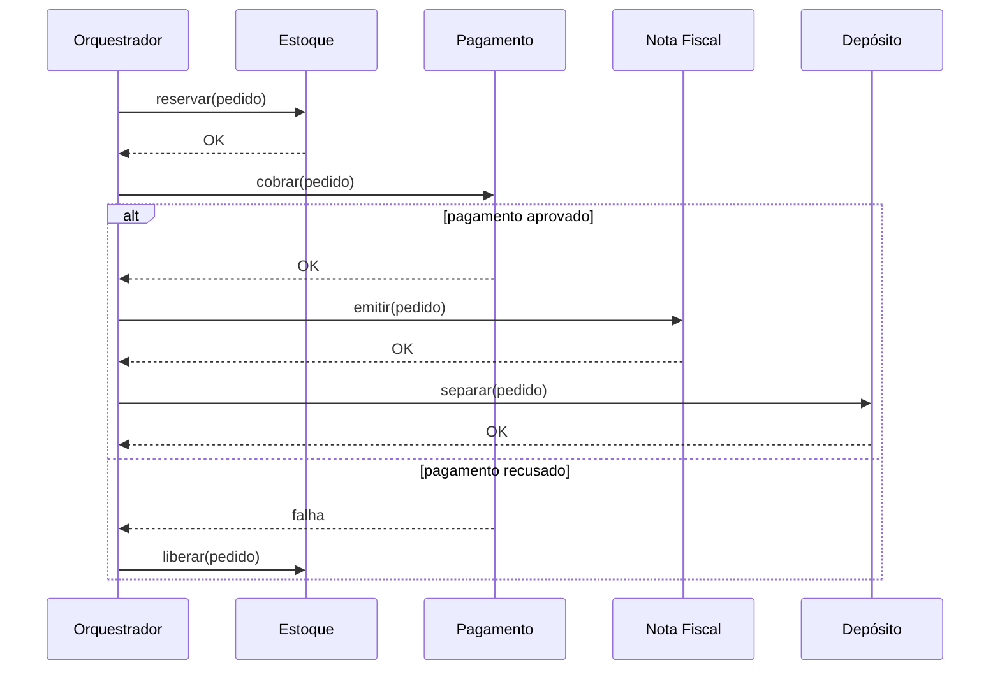
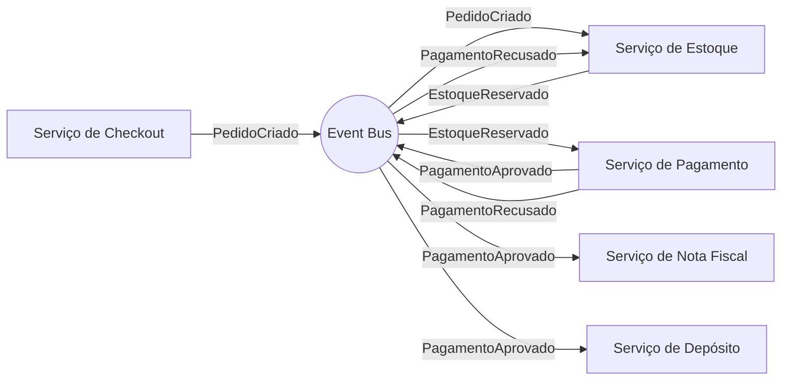
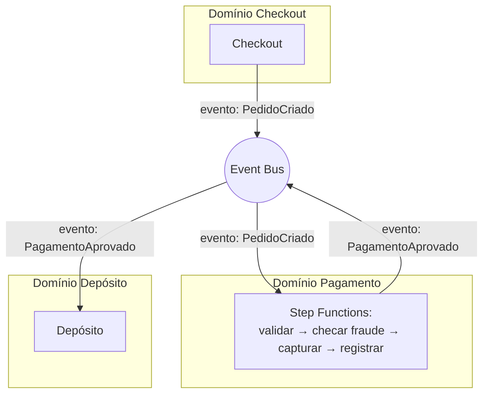

> [!abstract] TL;DR
> Quando um processo de negócio precisa de vários passos coordenados, você tem duas formas de organizar quem manda em quem. **Orquestração** é um maestro central (AWS Step Functions) que chama cada serviço na ordem certa e sabe, a qualquer momento, em que passo o processo está. **Coreografia** é cada serviço reagindo a eventos por conta própria (EventBridge, SNS, SQS), sem ninguém no comando — o fluxo emerge da soma das reações. Não existe "a certa": workflows de negócio com passos claros, timeouts e compensação pedem orquestração; reações desacopladas entre domínios pedem coreografia. A AWS tem as duas ferramentas prontas; a DigitalOcean tem coreografia via fila/pub-sub, mas não tem um Step Functions — orquestração ali se escreve à mão.

## O problema: quem decide "e agora, o quê?"

Imagine um checkout de e-commerce. O cliente aperta "comprar" e, por trás da cena, quatro coisas precisam acontecer: reservar o estoque, cobrar o cartão, gerar a nota fiscal e notificar o depósito para separar o pedido. Cada uma dessas coisas provavelmente já é um serviço separado — talvez até uma função Lambda ou um droplet diferente, escrito por um time diferente.

Duas perguntas simples viram um projeto de arquitetura inteiro:

1. Se cobrar o cartão falhar depois que o estoque já foi reservado, quem desfaz a reserva?
2. Se eu quiser adicionar um quinto passo daqui a três meses ("enviar cupom de fidelidade"), preciso mexer em código de quem?

A resposta que você dá a essas duas perguntas empurra sua arquitetura para um de dois polos. Se você quer um lugar único que "sabe" o processo inteiro, sabe em que passo cada pedido está agora e decide explicitamente o próximo passo — isso é **orquestração**. Se você prefere que cada serviço apenas reaja a "aconteceu X" e ninguém precise saber o processo completo — isso é **coreografia**.

A nota anterior desta trilha, sobre o paradigma event-driven, tratou eventos como a moeda de troca entre serviços. Esta nota mergulha na decisão que separa quem *manda* nesses eventos.

## Orquestração: um maestro, uma partitura

Na orquestração, existe um componente central — o orquestrador — que conhece o processo do início ao fim. Ele chama o serviço A, espera a resposta, decide se chama B ou C dependendo do resultado, trata erros, e sabe dizer, a qualquer momento, "este pedido está no passo 3 de 5".



Repare: o orquestrador fala com todo mundo. Estoque, Pagamento, Nota Fiscal e Depósito não se conhecem — cada um só sabe responder a uma chamada. Toda a lógica de "o que fazer se o pagamento falhar" mora num lugar só.

Isso traz vantagens concretas:

- **Visibilidade total.** Você abre um painel e vê exatamente em que passo cada execução está, quanto tempo cada passo levou, onde travou.
- **Debugging trivial.** Um erro aponta para um passo específico dentro de um fluxo visível, não uma cadeia de eventos espalhada em cinco serviços.
- **Compensação centralizada.** A lógica de "desfazer o que já foi feito" fica em um único lugar, fácil de auditar.

O preço é o acoplamento. O orquestrador precisa conhecer a interface de todo mundo — se o serviço de Pagamento muda a assinatura da chamada, o orquestrador precisa mudar junto. E ele vira um ponto único: se a lógica de orquestração tem um bug, o processo inteiro trava, mesmo que os quatro serviços individuais estejam saudáveis.

### AWS Step Functions

O AWS Step Functions é o orquestrador gerenciado da AWS. Você descreve o fluxo como uma **state machine** — um documento declarativo (Amazon States Language, um dialeto de JSON) com estados como `Task` (chama um Lambda, uma API, um serviço), `Choice` (decide o próximo estado com base em dados), `Parallel` (roda ramos em paralelo) e `Map` (aplica o mesmo fluxo a cada item de uma lista). O serviço executa essa state machine, mantém o estado de cada execução e oferece `Retry`/`Catch` nativos em cada estado — não é preciso escrever `try/except` manual para retentativas.

> [!info] Verificado em 2026-07-24 (docs.aws.amazon.com/step-functions)
> Step Functions tem dois tipos de workflow: **Standard**, com execução *exactly-once*, histórico auditável no console e duração de até um ano — ideal para processos de negócio; e **Express**, com execução *at-least-once*, duração de até cinco minutos e taxa de até 100.000 execuções por segundo — ideal para volume alto (streaming, ingestão de IoT). Standard é cobrado por transição de estado; Express por número e duração de execuções. Ambos suportam `Retry` e `Catch` nativos nos estados.

A próxima nota deste galho mergulha fundo no Step Functions — aqui o que importa é a peça no tabuleiro: é o orquestrador gerenciado, você não roda servidor nenhum, e o próprio serviço é o "cérebro" que decide os próximos passos.

### E na DigitalOcean?

Aqui a honestidade é obrigatória: **a DigitalOcean não tem um serviço equivalente ao Step Functions.** Não existe um produto gerenciado de state machine na plataforma. Se você quer orquestração na DO, você escreve o orquestrador você mesmo — tipicamente como uma DigitalOcean Function (ou um pequeno serviço em App Platform) que chama as outras funções em sequência, guarda o estado do processo num banco (Managed PostgreSQL ou o Redis/Valkey gerenciado, vistos no galho de bancos gerenciados) e implementa retentativa e compensação na mão.

Isso não é um defeito da DO — reflete o posicionamento da plataforma: menos serviços gerenciados de nicho, mais primitivas simples que você compõe. Mas significa que, se orquestração complexa com auditoria de estado é central para o seu produto, a DO empurra trabalho de engenharia que na AWS vem pronto.

## Coreografia: ninguém manda, todos reagem

Na coreografia, não existe um componente que conhece o processo inteiro. Cada serviço publica um evento quando termina seu trabalho, e outros serviços — que só sabem "eu reajo a eventos do tipo X" — pegam esse evento e fazem sua parte, publicando por sua vez o próprio evento.



O mesmo checkout, remodelado: o serviço de Checkout publica `PedidoCriado` e esquece o assunto. O serviço de Estoque, que está inscrito nesse evento, reserva o estoque e publica `EstoqueReservado`. O serviço de Pagamento, inscrito nesse evento, cobra o cartão e publica `PagamentoAprovado` ou `PagamentoRecusado`. Se aprovado, tanto Nota Fiscal quanto Depósito — ambos inscritos em `PagamentoAprovado` — disparam em paralelo, sem coordenação entre si. Se recusado, o Estoque (inscrito em `PagamentoRecusado`) libera a reserva.

Ninguém, olhando o código de um único serviço, vê o processo inteiro. O fluxo existe apenas como o resultado agregado de todas essas reações — daí o nome: é uma dança onde cada dançarino sabe seus próprios passos, mas ninguém rege a coreografia inteira.

As vantagens são o espelho das desvantagens da orquestração:

- **Desacoplamento máximo.** O serviço de Pagamento não sabe que Nota Fiscal e Depósito existem. Você pode adicionar um quinto assinante de `PagamentoAprovado` sem tocar em nenhum código existente — é exatamente o argumento que a nota sobre EventBridge já detalhou para o publish/subscribe.
- **Evolução independente.** Times diferentes evoluem seus serviços sem coordenar deploys.
- **Sem ponto único de falha lógica.** Não existe um orquestrador cujo bug trava tudo.

E o preço, espelhado: **é difícil ver o processo inteiro.** Não existe um painel que mostre "este pedido está em tal passo" — você precisa reconstruir o fluxo rastreando eventos em vários serviços e logs, o que empurra a necessidade de tracing distribuído (assunto do Bloco 4 desta trilha, quando o galho de observabilidade entrar em cena). E surgem problemas novos: e se `EstoqueReservado` chegar duas vezes? E se `PagamentoAprovado` chegar antes de `EstoqueReservado` por algum atraso de rede? Ordering e consistência eventual, que a nota de EventBridge já introduziu, ficam mais presentes quanto mais passos o processo tem.

### AWS: EventBridge, SNS, SQS

A AWS oferece o kit completo de coreografia já coberto no galho 13 de mensageria: EventBridge como barramento de eventos com roteamento por regra, SNS para fan-out pub/sub, SQS para filas ponto-a-ponto com garantia de entrega. Um checkout coreografado na AWS tipicamente usa EventBridge como espinha dorsal, com cada serviço publicando no bus e assinando via regras.

### DigitalOcean: mesma peça, sem EventBridge

A DO não tem um EventBridge — não há barramento de eventos gerenciado com roteamento por regras e schema registry. O que existe é [[03-Dominios/Tecnologia/Cloud/13 - Mensageria e eventos gerenciados/06 - Escolher o serviço de mensageria (capstone)|o combo Managed Kafka + Managed Redis/Valkey]] cobertos no capstone do galho de mensageria: você monta a coreografia com tópicos Kafka (para fan-out de eventos de domínio) ou filas simples em Redis, e a lógica de roteamento — "quem assina qual evento" — fica em código, não em uma tela de configuração de regras. Funciona, mas o trabalho de montar o barramento é seu.

## Lado a lado

| Dimensão | Orquestração | Coreografia |
|---|---|---|
| Quem sabe o processo inteiro | O orquestrador (state machine) | Ninguém — emerge da soma das reações |
| Acoplamento | Alto entre orquestrador e serviços; baixo entre serviços | Baixo entre todos os participantes |
| Visibilidade do fluxo | Um painel mostra o passo atual de cada execução | Reconstruída via tracing distribuído / correlação de logs |
| Adicionar um novo passo | Editar a definição do orquestrador | Novo assinante do evento existente, sem tocar nos outros |
| Compensação em caso de erro | Centralizada, explícita (`Catch` → passo de compensação) | Espalhada — cada serviço assina eventos de falha e se autocompensa |
| Ponto único de falha lógica | Sim — bug no orquestrador trava o processo inteiro | Não, mas falhas silenciosas (evento nunca chega) são mais difíceis de notar |
| Serviço gerenciado na AWS | Step Functions | EventBridge / SNS / SQS |
| Serviço gerenciado na DO | Nenhum — orquestração é código seu | Managed Kafka / Managed Redis-Valkey (sem roteamento por regra) |
| Melhor para | Workflows de negócio com passos claros, timeouts, sagas | Reações independentes entre domínios que não deveriam se conhecer |

## A grande escolha: workflow de negócio ou reação desacoplada?

A pergunta certa não é "qual é melhor", é "o que este processo específico precisa". Dois testes ajudam:

**Teste 1 — Existe um dono do processo de ponta a ponta?** Se existe uma equipe ou um contexto de negócio que é dona do fluxo inteiro (o time de Checkout é dono do processo de compra do início ao fim), orquestração é natural: o processo já tem um dono conceitual, só falta um dono técnico. Se o processo atravessa vários domínios que não deveriam se conhecer (Checkout não deveria saber como Depósito organiza sua logística interna), coreografia respeita melhor essa fronteira.

**Teste 2 — Erros pedem compensação coordenada ou reação independente?** Se um erro no meio do processo exige desfazer passos anteriores numa ordem específica (uma saga clássica: reservar → cobrar → se cobrar falhar, tem que liberar a reserva **nessa ordem**), a lógica de compensação centralizada da orquestração evita bugs sutis de "esqueci de desfazer X". Se cada serviço pode reagir a uma falha de forma independente e idempotente (o serviço de Notificação simplesmente não dispara se `PagamentoAprovado` nunca chega — não precisa "saber" que algo deu errado), coreografia é suficiente.

Na prática, sistemas grandes usam as duas: coreografia entre domínios (Checkout não fala diretamente com Depósito — fala via evento), orquestração dentro de um domínio complexo (o processo interno de "processar um pagamento" — validar cartão, checar fraude, capturar, registrar — pode ser uma pequena state machine). O diagrama abaixo mostra esse padrão híbrido no mesmo checkout: os domínios se comunicam por evento (coreografia), mas o domínio de Pagamento, internamente, é uma state machine (orquestração).



Essa combinação é comum o suficiente para ter nome informal: "coreografia macro, orquestração micro". O critério prático é escala do domínio — quanto mais passos internos e mais compensação um único domínio precisa, mais vale isolar aquele pedaço numa state machine própria, mesmo que a comunicação entre domínios continue por evento.

## Saga: o padrão que aparece nos dois lados

Quando o processo é uma transação distribuída — vários passos que, juntos, deveriam ser tudo-ou-nada, mas não podem usar uma transação de banco de dados única porque atravessam serviços diferentes — o nome do padrão é **saga**. A ideia: em vez de uma transação atômica, você tem uma sequência de passos locais, cada um com uma **ação de compensação** que desfaz o efeito se algo mais adiante falhar.

O padrão saga não pertence a orquestração nem a coreografia — ele pode ser implementado das duas formas:

- **Saga orquestrada**: um Step Functions define a sequência de passos e, em cada `Catch`, chama explicitamente o passo de compensação correspondente. É a forma mais fácil de auditar: você olha a state machine e vê toda a lógica de compensação num lugar.
- **Saga coreografada**: cada serviço publica um evento de sucesso ou falha; os serviços anteriores na cadeia assinam o evento de falha e disparam sua própria compensação. Não há coordenador — a compensação "se espalha" pelos assinantes de eventos de falha, como no exemplo do checkout acima (Estoque assinando `PagamentoRecusado` para se auto-compensar).

> [!warning] A saga coreografada esconde a complexidade, não elimina
> É tentador achar que a saga coreografada é "mais simples" porque tem menos código central. Na prática, ela move a complexidade da compensação para dentro de cada serviço — cada um precisa saber reagir corretamente a eventos de falha que talvez nem sejam "dele". Isso costuma ficar difícil de rastrear justamente quando mais precisa (produção, sob incidente). Para sagas com mais de três ou quatro passos, vale considerar orquestração mesmo perdendo um pouco de desacoplamento — a visibilidade de debugging compensa.

> [!tip] Assista: The SAGA Design Pattern Explained in 6 MINUTES | Orchestration vs Choreography
> **Canal:** CodeOpinion | **Duração:** ~6min | **Idioma:** EN
>
> Um resumo rápido e denso do mesmo dilema desta nota, com foco no padrão saga: por que a coreografia fica difícil de auditar quando a saga cresce, e por que a orquestração centraliza justamente a lógica de compensação que a coreografia espalha entre serviços. Trecho de destaque [04:35]: *"we can implement orchestration where the execution flow control is centralized — a service is responsible for the invocation of all..."*
>
> 🎬 [Assistir no YouTube](https://www.youtube.com/watch?v=hkQhqDmriKA)

> [!warning] Orquestrador "feito em casa" na DigitalOcean vira dívida técnica silenciosa
> Como a DO não tem um Step Functions gerenciado, é tentador escrever o orquestrador como "só mais uma function que chama as outras em sequência". Isso funciona até o dia em que uma chamada trava a meio caminho — sem `Retry`/`Catch` nativos e sem histórico de execução persistido pelo próprio serviço, você precisa construir essa auditoria à mão (tabela de estado no Postgres, idempotência por `pedido_id`, timeout explícito). Não é impossível, mas é fácil subestimar esse esforço achando que "é só um `for` chamando funções" — na prática é a reimplementação de uma fatia do Step Functions.

## Comparativo de código: a mesma decisão, dois jeitos de escrever

Um trecho conceitual de definição de state machine (Amazon States Language, simplificado) para o passo "cobrar cartão, e se falhar, liberar estoque":

```json
{
  "StartAt": "CobrarCartao",
  "States": {
    "CobrarCartao": {
      "Type": "Task",
      "Resource": "arn:aws:lambda:...:function:cobrarCartao",
      "Catch": [
        {
          "ErrorEquals": ["PagamentoRecusado"],
          "Next": "LiberarEstoque"
        }
      ],
      "Next": "EmitirNotaFiscal"
    },
    "LiberarEstoque": {
      "Type": "Task",
      "Resource": "arn:aws:lambda:...:function:liberarEstoque",
      "End": true
    },
    "EmitirNotaFiscal": {
      "Type": "Task",
      "Resource": "arn:aws:lambda:...:function:emitirNotaFiscal",
      "Next": "SepararPedido"
    },
    "SepararPedido": {
      "Type": "Task",
      "Resource": "arn:aws:lambda:...:function:separarPedido",
      "End": true
    }
  }
}
```

Repare que a lógica de "se falhar, faça X" está declarada ali mesmo, no `Catch`. Agora o equivalente coreografado — o handler do serviço de Estoque, que só sabe reagir a um evento:

```python
def handler(event, context):
    detail_type = event["detail-type"]

    if detail_type == "PagamentoRecusado":
        pedido_id = event["detail"]["pedido_id"]
        liberar_reserva(pedido_id)
        publicar_evento("EstoqueLiberado", {"pedido_id": pedido_id})

    # este handler não sabe que existe um "processo de checkout";
    # ele só sabe reagir a um evento específico
```

O segundo trecho é mais simples isoladamente — mas para entender o processo de checkout inteiro, você precisaria ler o handler de cada serviço envolvido e reconstruir mentalmente o fluxo. O primeiro trecho é mais verboso, mas o processo inteiro está ali, num arquivo só.

## O que vem a seguir

A próxima nota deste galho mergulha fundo no AWS Step Functions — os tipos de estado além de `Task` e `Choice`, os padrões de integração (`Run a Job`, `Wait for Callback`), e como pensar em custo por transição de estado. Depois disso, o galho segue para pipelines de dados serverless (onde orquestração e coreografia se combinam num terceiro uso: mover e transformar dados em lote ou streaming) e fecha com padrões e anti-padrões antes do capstone do Bloco 3, que amarra FaaS, containers, mensageria, API Gateway e esta decisão de orquestração vs coreografia numa arquitetura de referência completa.

## Fontes

- AWS Step Functions — What is Step Functions: https://docs.aws.amazon.com/step-functions/latest/dg/welcome.html
- AWS Step Functions — Handling errors (Retry/Catch): https://docs.aws.amazon.com/step-functions/latest/dg/concepts-error-handling.html
- AWS Step Functions — Choosing workflow type: https://docs.aws.amazon.com/step-functions/latest/dg/choosing-workflow-type.html
- Amazon EventBridge — What is Amazon EventBridge: https://docs.aws.amazon.com/eventbridge/latest/userguide/eb-what-is.html
- DigitalOcean Functions — documentação: https://docs.digitalocean.com/products/functions/
- DigitalOcean Managed Kafka — documentação: https://docs.digitalocean.com/products/databases/kafka/
- Padrão Saga (referência conceitual, microservices.io): https://microservices.io/patterns/data/saga.html
