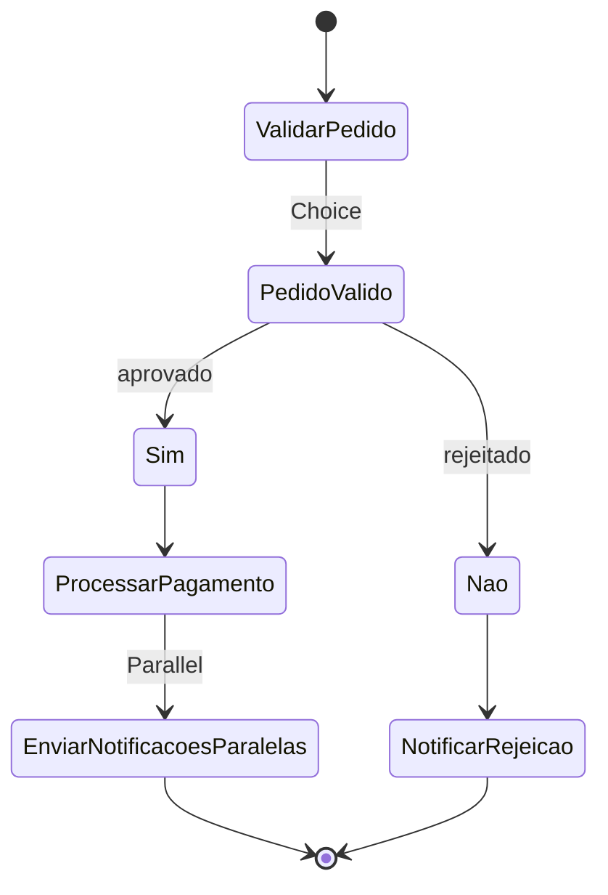
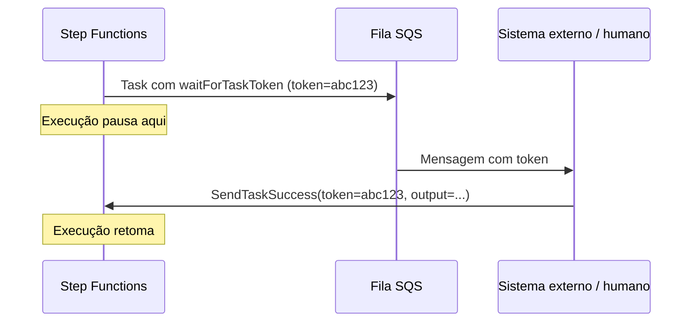

> [!abstract] TL;DR
> Step Functions é uma máquina de estados serverless: você descreve o workflow em JSON declarativo (Amazon States Language) — quais passos existem, em que ordem, o que fazer quando algo falha — e a AWS executa, persiste o progresso e cuida do retry por você. Existem dois sabores: **Standard** (durável, auditável, até um ano, cobra por transição) e **Express** (rápido, barato, até cinco minutos, cobra por execução). Onde a AWS tem um serviço dedicado para isso, a DigitalOcean não tem — orquestração vira código de aplicação ou um workflow engine de terceiros.

## O problema: código de orquestração é código que ninguém quer escrever duas vezes

Na nota [[03-Dominios/Tecnologia/Cloud/15 - Arquiteturas serverless e event-driven/02 - Orquestração vs coreografia|Orquestração vs coreografia]] você já viu a escolha: quando o fluxo de negócio precisa de uma sequência clara, com decisões, paralelismo e um dono explícito do "próximo passo", orquestração ganha da coreografia pura. Mas orquestrar manualmente — com uma Lambda "maestro" que chama outras Lambdas, guarda estado em algum lugar, decide o que fazer se uma falhar, espera respostas assíncronas — é reescrever, função por função, um motor de workflow. E motor de workflow é chato de escrever bem: precisa persistir estado entre passos (o processo pode levar horas), decidir quando repetir uma chamada que falhou, decidir quando desistir e rodar um plano B, e dar visibilidade de onde cada execução está.

O Step Functions resolve isso tirando essa lógica do seu código e colocando numa declaração. Você não escreve "se a Lambda A falhar, tente de novo até 3 vezes com backoff exponencial, e se ainda assim falhar, chame a Lambda B de compensação" em Python ou Node — você escreve isso em um campo JSON chamado `Retry`/`Catch`, e o serviço garante a execução. É a mesma virada de chave que containers deram para deploy, ou que IaC deu para infraestrutura: transformar procedimento imperativo em declaração que uma plataforma administra.

## A peça central: a state machine em Amazon States Language

Uma **state machine** no Step Functions é um documento JSON escrito em **Amazon States Language (ASL)**. Ela descreve um grafo de **estados** (`States`), cada um com um tipo, e transições entre eles (`Next`, ou `End: true` para terminar).



Os tipos de estado principais são um vocabulário pequeno, mas suficiente pra modelar quase qualquer workflow:

| Estado | O que faz | Analogia |
|---|---|---|
| `Task` | Executa um trabalho — chama uma Lambda, um serviço AWS, uma Activity externa | Uma linha de código que faz algo |
| `Choice` | Ramifica com base em condições sobre o input | `if/else` |
| `Parallel` | Roda N branches fixos e conhecidos ao mesmo tempo | `Promise.all` com passos definidos no código |
| `Map` | Roda o mesmo sub-workflow para cada item de uma lista (fan-out dinâmico) | `for item in lista: processar(item)` |
| `Wait` | Pausa por um tempo fixo ou até um timestamp | `sleep()` |
| `Pass` | Passa o input adiante, opcionalmente transformando-o — não faz trabalho real | Um estágio de "no-op" pra montar dado |
| `Succeed` / `Fail` | Termina a execução com sucesso ou falha explícita | `return` / `throw` |

Um esqueleto mínimo de state machine, com `Task`, `Choice` e tratamento de erro:

```json
{
  "Comment": "Processa um pedido: valida, cobra, notifica",
  "StartAt": "ValidarPedido",
  "States": {
    "ValidarPedido": {
      "Type": "Task",
      "Resource": "arn:aws:lambda:us-east-1:123456789012:function:validar-pedido",
      "Retry": [
        {
          "ErrorEquals": ["Lambda.ServiceException", "Lambda.TooManyRequestsException"],
          "IntervalSeconds": 2,
          "MaxAttempts": 3,
          "BackoffRate": 2.0
        }
      ],
      "Catch": [
        {
          "ErrorEquals": ["States.ALL"],
          "ResultPath": "$.erro",
          "Next": "FalhaValidacao"
        }
      ],
      "Next": "PedidoValido"
    },
    "PedidoValido": {
      "Type": "Choice",
      "Choices": [
        {
          "Variable": "$.aprovado",
          "BooleanEquals": true,
          "Next": "ProcessarPagamento"
        }
      ],
      "Default": "FalhaValidacao"
    },
    "ProcessarPagamento": {
      "Type": "Task",
      "Resource": "arn:aws:lambda:us-east-1:123456789012:function:cobrar",
      "TimeoutSeconds": 30,
      "End": true
    },
    "FalhaValidacao": {
      "Type": "Fail",
      "Error": "PedidoInvalido",
      "Cause": "Validação recusou o pedido"
    }
  }
}
```

Repare: `Retry` e `Catch` são campos declarativos, não `try/except` espalhado pelo código de cada Lambda. `IntervalSeconds`, `MaxAttempts` e `BackoffRate` implementam exponential backoff sem você escrever uma linha de lógica de retry — é a mesma resiliência que, numa arquitetura sem orquestrador, você teria que reimplementar em cada função que chama outra.

## Standard vs Express: dois motores para dois tipos de carga

Essa é a decisão mais importante ao criar uma state machine — e ela é **imutável** depois de criada, então vale entender antes.

> [!info] Verificado em 2026-07-24 (docs.aws.amazon.com/step-functions)
> **Standard**: duração máxima de 1 ano, execução *exactly-once* (nenhum passo roda mais de uma vez, exceto por `Retry` explícito), histórico de execução consultável por até 90 dias, cobrança por state transition. Suporta Distributed Map e Activities. **Express**: duração máxima de 5 minutos, execução *at-least-once* (assíncrono) ou *at-most-once* (síncrono), sem histórico nativo (vai pro CloudWatch Logs), cobrança por número de execuções + duração + memória consumida. NÃO suporta Distributed Map nem Activities.

A diferença de semântica de execução é a parte que mais gera bug em produção: Standard garante que cada `Task` roda exatamente uma vez, o que o torna seguro para ações **não-idempotentes** — cobrar um cartão, iniciar um cluster EMR, debitar um saldo. Express pode, em teoria, rodar um passo mais de uma vez (o estado interno entre transições não é persistido do mesmo jeito), então ele é adequado para ações **idempotentes** — gravar um evento no DynamoDB com upsert, transformar e re-emitir um dado, processar um clique. Rodar uma cobrança de cartão dentro de um workflow Express é o tipo de erro que passa despercebido em teste e aparece como cobrança duplicada em produção.

| Critério | Standard | Express |
|---|---|---|
| Duração máxima | 1 ano | 5 minutos |
| Semântica | Exactly-once | At-least-once (async) / at-most-once (sync) |
| Taxa de execução suportada | 2.000/s | 100.000/s |
| Histórico de execução | Nativo, consultável até 90 dias | Só via CloudWatch Logs |
| Cobrança | Por state transition | Por execução + duração + memória |
| Distributed Map | Sim | Não |
| `.sync` / `.waitForTaskToken` | Sim | Não |
| Quando usar | Pipelines de dados, aprovações humanas, orquestração de infraestrutura, saga transacional | Ingestão de IoT/streaming, backends de app mobile, processamento de alto volume e curta duração |

> [!info] Verificado em 2026-07-24 (aws.amazon.com/step-functions/pricing)
> Standard: US$ 0,000025 por state transition (região us-east-1), com 4.000 transições grátis por mês. Express: US$ 1,00 por milhão de requests + US$ 0,00001667 por GB-segundo de duração×memória. Preços mudam por região — confira a calculadora antes de orçar produção.

Na prática, a régua mental é: **se o workflow pode durar mais que 5 minutos, ou se uma ação não pode rodar duas vezes por acidente, é Standard.** Se é um fluxo curto, de altíssimo volume, e idempotente, Express é ordens de magnitude mais barato por execução.

## Parallel, Wait e Pass: as peças menos óbvias

`Parallel` difere de `Map` numa coisa importante: os branches de `Parallel` são **fixos e diferentes entre si**, definidos um a um no ASL — é para quando você sabe de antemão que precisa rodar, digamos, "validar CPF" e "consultar score de crédito" ao mesmo tempo, não para repetir o mesmo sub-workflow N vezes.

```json
"ValidacoesParalelas": {
  "Type": "Parallel",
  "Branches": [
    {
      "StartAt": "ValidarCPF",
      "States": {
        "ValidarCPF": {"Type": "Task", "Resource": "arn:...:validar-cpf", "End": true}
      }
    },
    {
      "StartAt": "ConsultarScore",
      "States": {
        "ConsultarScore": {"Type": "Task", "Resource": "arn:...:consultar-score", "End": true}
      }
    }
  ],
  "Next": "DecidirAprovacao"
}
```

O resultado de `Parallel` é um array com a saída de cada branch, na ordem em que foram declarados — e se qualquer branch falhar sem `Catch` próprio, o `Parallel` inteiro falha.

`Wait` pausa a execução por um intervalo (`Seconds`) ou até um timestamp absoluto (`Timestamp`), sem consumir cômputo — útil para "esperar 24h antes de reenviar um lembrete" sem manter uma Lambda dormindo e cobrando. `Pass` não faz trabalho nenhum: só existe para transformar o formato do dado entre dois `Task`, ou para deixar um "rascunho" de workflow rodável antes de plugar a Lambda de verdade.

```json
"EsperarUmDia": {
  "Type": "Wait",
  "Seconds": 86400,
  "Next": "ReenviarLembrete"
}
```

## Integração de serviço: chamar 200+ APIs da AWS sem escrever cliente HTTP

Um `Task` não precisa chamar uma Lambda. Via **AWS SDK integrations**, uma state machine pode invocar diretamente mais de 200 serviços AWS — DynamoDB, S3, SNS, SQS, ECS, SageMaker, Bedrock — usando a sintaxe `arn:aws:states:::<serviço>:<ação>` no campo `Resource`. Isso elimina a "Lambda de cola" que só existe para chamar outro serviço AWS.

```json
"GravarNoDynamo": {
  "Type": "Task",
  "Resource": "arn:aws:states:::dynamodb:putItem",
  "Parameters": {
    "TableName": "Pedidos",
    "Item": {
      "id": {"S.$": "$.pedidoId"},
      "status": {"S": "PROCESSADO"}
    }
  },
  "Next": "Proximo"
}
```

Existem três **padrões de integração** que mudam o que "chamar um serviço" significa:

1. **Request Response (padrão)** — chama o serviço, avança assim que recebe a resposta HTTP. Não sabe se o trabalho real terminou, só que a chamada foi aceita.
2. **Run a Job (`.sync`)** — chama um serviço que roda um job assíncrono (Batch, Glue, ECS, SageMaker) e o Step Functions **espera o job terminar** antes de avançar, sem polling manual. Só existe em Standard.
3. **Wait for Callback (`.waitForTaskToken`)** — a Task gera um `TaskToken` e o workflow **pausa indefinidamente** até que algum sistema externo (um humano clicando "aprovar", uma fila SQS, outro serviço) chame `SendTaskSuccess`/`SendTaskFailure` com esse token de volta.

O callback pattern é a peça que resolve "human in the loop" ou integração com sistemas de terceiros sem polling: o workflow literalmente dorme — sem consumir crédito de execução ativa — até alguém devolver o token.



## Saga: modelando compensação para transações distribuídas

Quando um workflow espalha uma "transação" por vários serviços — reservar estoque, cobrar cartão, agendar entrega — não existe um `COMMIT`/`ROLLBACK` atômico como num banco relacional. O padrão **Saga** resolve isso definindo, para cada passo que muda estado, um passo de **compensação** que desfaz o efeito se algo mais adiante falhar. Step Functions modela isso naturalmente com `Catch`, porque cada `Catch` pode apontar para uma cadeia de estados de compensação em vez de simplesmente falhar.

```json
{
  "StartAt": "ReservarEstoque",
  "States": {
    "ReservarEstoque": {
      "Type": "Task",
      "Resource": "arn:aws:lambda:us-east-1:123456789012:function:reservar-estoque",
      "Catch": [{"ErrorEquals": ["States.ALL"], "Next": "FalhaFinal"}],
      "Next": "CobrarCartao"
    },
    "CobrarCartao": {
      "Type": "Task",
      "Resource": "arn:aws:lambda:us-east-1:123456789012:function:cobrar-cartao",
      "Catch": [{"ErrorEquals": ["States.ALL"], "Next": "CompensarEstoque"}],
      "Next": "AgendarEntrega"
    },
    "CompensarEstoque": {
      "Type": "Task",
      "Resource": "arn:aws:lambda:us-east-1:123456789012:function:liberar-estoque",
      "Next": "FalhaFinal"
    },
    "AgendarEntrega": {
      "Type": "Task",
      "Resource": "arn:aws:lambda:us-east-1:123456789012:function:agendar-entrega",
      "End": true
    },
    "FalhaFinal": {
      "Type": "Fail",
      "Error": "TransacaoFalhou"
    }
  }
}
```

Se `CobrarCartao` falhar, o workflow não deixa o estoque reservado órfão: ele passa por `CompensarEstoque` antes de declarar falha. É exatamente o mecanismo que o padrão Saga pede — só que aqui é declaração, não um framework de saga rodando dentro da sua aplicação.

## Map e Distributed Map: fan-out sobre uma lista

O estado `Map` "inline" roda um sub-workflow para cada item de um array pequeno (até 40 iterações concorrentes, dataset de até 256 KiB), tudo dentro da mesma execução. Para volumes muito maiores — milhares ou milhões de itens, como processar cada linha de um CSV gigante no S3 — existe o **Distributed Map**, que transforma cada iteração numa **child workflow execution** própria, com seu próprio histórico, rodando até 10.000 em paralelo por padrão (configurável via `MaxConcurrency`).

> [!info] Verificado em 2026-07-24 (docs.aws.amazon.com/step-functions, state-map-distributed)
> Use Distributed Map quando o dataset excede 256 KiB, quando o histórico de execução ultrapassaria 25.000 entradas, ou quando a concorrência precisa passar de 40 iterações. Distributed Map só existe em workflows Standard (o `Mode: DISTRIBUTED` pode invocar sub-workflows Standard ou Express via `ExecutionType`).

Esse mecanismo é a ponte direta para a próxima nota do galho, sobre pipelines de dados serverless: processar cada arquivo de um bucket S3, cada registro de um dump, cada linha de um CSV de milhões de linhas — sem escrever o loop de concorrência você mesmo.

> [!tip] Assista: AWS Step Functions Distributed Map | Hands on Tutorial
> **Canal:** be a Better Dev | **Duração:** ~15min | **Idioma:** EN
>
> Vê o Distributed Map saindo do papel: um tutorial hands-on que cria a state machine, distingue Map inline de Distributed Map na prática, e mostra os logs de execução das child executions rodando em paralelo — o complemento visual da explicação em ASL desta nota. Trecho de destaque [00:53]: *"inline map is for smaller data sets and distributed map is for larger data sets"*
>
> 🎬 [Assistir no YouTube](https://www.youtube.com/watch?v=2odmnTlqVfk)

## Da declaração à execução: criar e disparar via CLI

```bash
# Criar a state machine a partir de um arquivo ASL
aws stepfunctions create-state-machine \
  --name "processar-pedido" \
  --definition file://workflow.json \
  --role-arn arn:aws:iam::123456789012:role/StepFunctionsRole \
  --type STANDARD

# Disparar uma execução com input
aws stepfunctions start-execution \
  --state-machine-arn arn:aws:states:us-east-1:123456789012:stateMachine:processar-pedido \
  --input '{"pedidoId": "abc123", "valor": 199.90}'

# Acompanhar o status
aws stepfunctions describe-execution \
  --execution-arn arn:aws:states:us-east-1:123456789012:execution:processar-pedido:abc123
```

Na prática raramente se escreve ASL à mão em produção — CDK, SAM e Terraform têm construtores de state machine que geram o JSON — mas entender o ASL cru é o que permite ler o console do Step Functions (que renderiza exatamente esse grafo) e debugar quando algo se comporta diferente do esperado.

## A lente DigitalOcean: honestidade sobre uma lacuna real

Aqui a lente dupla que atravessa este galho encontra seu limite mais nítido: **a DigitalOcean não tem um serviço equivalente ao Step Functions.** Não é uma diferença de nome ou de limite — é ausência de categoria. A DO oferece Functions (o equivalente a Lambda, coberto na nota [[03-Dominios/Tecnologia/Cloud/11 - Serverless e FaaS — Lambda a fundo/02 - Anatomia de uma função Lambda|Anatomia de uma função Lambda]]), mas nenhum motor gerenciado de state machine, retry declarativo ou callback pattern.

Isso significa que, numa arquitetura DigitalOcean, orquestração vira uma de três escolhas:

1. **Código de orquestração na aplicação** — uma função ou serviço que chama as outras em sequência, com `try/except` e retry manual escritos à mão. Funciona para fluxos simples, mas reintroduz exatamente o problema que o Step Functions resolve.
2. **Workflow engine de terceiros auto-hospedado** — rodar Temporal, Camunda ou Apache Airflow num Droplet ou no DigitalOcean Kubernetes (DOKS). Ganha-se o poder declarativo, perde-se o "gerenciado": você opera o motor, os workers, o banco de estado dele.
3. **Composição via fila + estado externo** — orquestrar "manualmente" com filas (o equivalente DO ao SQS) e uma tabela de estado no banco gerenciado, reimplementando um subconjunto pequeno do que o Step Functions faz de graça.

Nenhuma dessas é errada, mas todas custam mais trabalho de engenharia do que apontar para um serviço gerenciado. Se orquestração complexa e auditável é central para o seu domínio de negócio — pipelines financeiros, workflows de aprovação, sagas multi-serviço — essa é uma lacuna real de plataforma, não um detalhe: pesa na balança de "AWS vs DO" com peso concreto, ao lado de outras lacunas já registradas ao longo deste vault.

> [!warning] Armadilhas comuns
> - **Escolher Express para uma ação não-idempotente** — semântica at-least-once significa que "cobrar o cartão" pode rodar duas vezes. Padrão errado custa dinheiro real.
> - **Esquecer `Retry`/`Catch` em cada `Task`** — sem eles, qualquer erro transiente (throttling do Lambda, timeout de rede) derruba a execução inteira sem tentar de novo.
> - **Usar Map inline para milhares de itens** — o limite de 40 iterações concorrentes e 256 KiB de dataset estoura rápido; a resposta é Distributed Map, não forçar o Map comum.
> - **Tratar o tipo de workflow como reversível** — Standard vs Express é decidido na criação e não pode ser trocado depois; migrar significa recriar a state machine.
> - **Ignorar `TimeoutSeconds`** — sem timeout explícito num `Task`, uma Lambda travada pode segurar a execução por muito mais tempo do que o esperado (até o limite de duração do workflow).

## O que vem a seguir

A próxima nota deste galho usa exatamente o Distributed Map como motor de fan-out para construir um pipeline de dados serverless completo — ingestão, transformação e carga orientadas a evento, sem servidor fixo em nenhuma etapa. Depois dela, o galho fecha o Bloco 3 catalogando padrões e anti-padrões de arquitetura serverless, e por fim consolida tudo numa arquitetura de referência que amarra FaaS, mensageria, API Gateway e orquestração num sistema único.

## Fontes

- [Choosing workflow type in Step Functions](https://docs.aws.amazon.com/step-functions/latest/dg/concepts-standard-vs-express.html) — AWS Documentation
- [What is Step Functions?](https://docs.aws.amazon.com/step-functions/latest/dg/welcome.html) — AWS Documentation
- [Using Map state in Distributed mode](https://docs.aws.amazon.com/step-functions/latest/dg/state-map-distributed.html) — AWS Documentation
- [Handling errors in Step Functions workflows](https://docs.aws.amazon.com/step-functions/latest/dg/concepts-error-handling.html) — AWS Documentation
- [AWS Step Functions pricing](https://aws.amazon.com/step-functions/pricing/) — AWS
- [DigitalOcean Functions documentation](https://docs.digitalocean.com/products/functions/) — DigitalOcean Documentation
