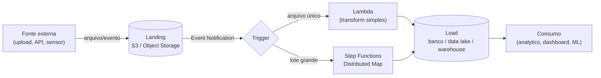
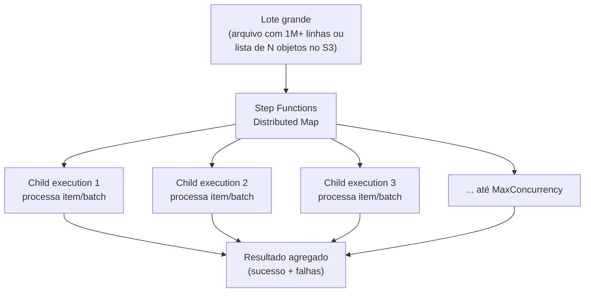
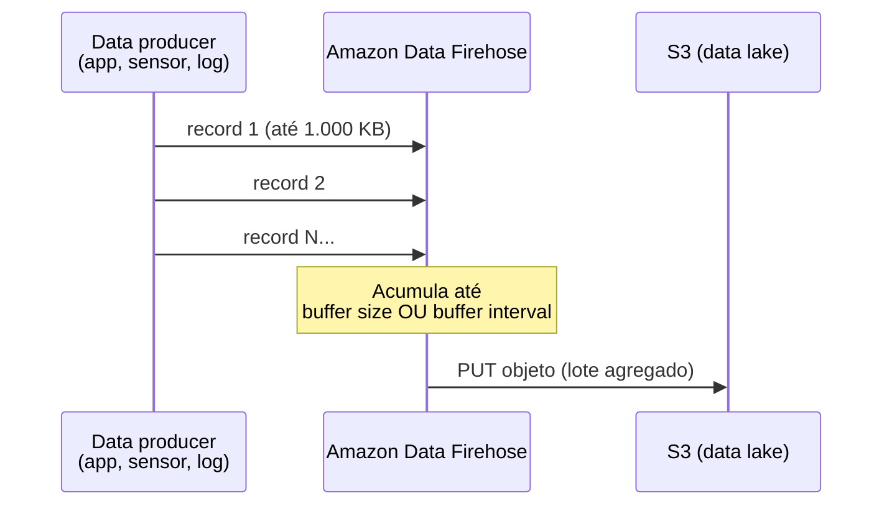

> [!abstract] TL;DR
> Um pipeline de dados serverless é uma esteira de eventos: um arquivo chega, um evento dispara, uma função (ou uma orquestração de funções) transforma o dado, e o resultado pousa em outro lugar — tudo sem você provisionar um único servidor de processamento. O padrão canônico é **landing → trigger → transform → load**. A peça que separa um script de brinquedo de um pipeline de produção é o *fan-out*: como você processa um milhão de itens em paralelo sem estourar limites nem perder o controle de erros parciais.

## O problema: dado chega, alguém precisa processar

Imagine que sua empresa recebe, todo dia às 3h da manhã, um arquivo CSV de 2 GB com as vendas do dia anterior de cem lojas. Alguém precisa ler esse arquivo, validar cada linha, transformar em um formato de análise, e carregar num banco ou data lake para os analistas consultarem de manhã.

A resposta "burra" é: sobe uma VM, roda um cron às 3h, processa o arquivo, desliga. Funciona — até o dia em que o arquivo dobra de tamanho, ou chega atrasado, ou chega duas vezes, ou o processo cai na linha 400.000 e ninguém percebe até o analista reclamar que o dashboard está vazio.

A pergunta que o serverless resolve não é "como processo dados" — isso a engenharia de dados resolve há décadas com ferramentas como Airflow, Spark ou dbt (o domínio Dados cobre modelagem, warehouse e orquestração a fundo; aqui a lente é outra). A pergunta aqui é: **como faço a infraestrutura de processamento aparecer só quando o dado aparece, escalar sozinha, e sumir quando termina** — sem eu gerenciar um cluster ligado 24h esperando o próximo arquivo.

É a mesma promessa do FaaS que a nota [[03-Dominios/Tecnologia/Cloud/11 - Serverless e FaaS — Lambda a fundo/04 - Cold start, concurrency e performance|Cold start, concurrency e performance]] já explorou — só que agora aplicada não a uma requisição HTTP, mas a um fluxo de dados.

## O padrão canônico: landing → trigger → transform → load

Todo pipeline de dados serverless, por mais sofisticado que pareça, é uma variação de quatro estágios:

1. **Landing** — o dado pousa em algum lugar durável e barato. Quase sempre um object storage (S3, ou a fila de um serviço de streaming).
2. **Trigger** — a chegada do dado dispara um evento. Ninguém fica de plantão olhando a pasta; o próprio storage avisa.
3. **Transform** — uma função (ou uma cadeia de funções orquestrada) lê, valida, limpa, agrega ou enriquece o dado.
4. **Load** — o resultado processado vai para o destino final: um banco, um data warehouse, outro bucket em formato otimizado (Parquet, por exemplo).



Repare que o diagrama tem duas saídas do trigger: uma para transformação simples (um arquivo, uma função) e outra para fan-out (um lote grande, dividido em N execuções paralelas). Essa bifurcação é o cerne da nota.

## Ingestão: como o dado entra no pipeline

Existem, na prática, dois jeitos de o dado chegar.

### Arquivo pousa, evento dispara (batch orientado a arquivo)

O caso mais comum: alguém — um sistema legado, um parceiro, um usuário — faz upload de um arquivo num bucket. O storage emite um evento de "objeto criado" para quem estiver escutando, e uma função processa esse arquivo específico.

Na AWS isso é **S3 Event Notifications**: o bucket pode publicar eventos de criação, remoção, restauração e outros diretamente para SQS, SNS, Lambda ou EventBridge. A documentação da AWS é explícita sobre a semântica: a entrega é *at-least-once* — normalmente leva segundos, mas pode levar mais, e o mesmo evento pode, raramente, chegar duplicado. Isso significa que sua função de processamento precisa ser **idempotente** (processar o mesmo arquivo duas vezes não pode gerar dado duplicado no destino).

> [!warning] O loop de auto-disparo
> Se sua função processa um arquivo e grava o resultado *no mesmo bucket* que disparou o evento, você pode criar um loop infinito: o resultado dispara um novo evento, que dispara a função de novo. A própria documentação da AWS alerta para isso — a mitigação é usar dois buckets separados (landing e output) ou restringir o gatilho a um prefixo específico (ex.: só `incoming/`).

Na DigitalOcean, **Spaces** (o object storage compatível com S3) não expõe um mecanismo de eventos equivalente ao S3 Event Notifications integrado a Functions — não há um "Spaces → Functions trigger" documentado. Os triggers suportados pela DigitalOcean Functions são agendamento (cron), invocação HTTP direta e invocação assíncrona via CLI/API. Se você precisa do padrão "arquivo chega → função dispara" na DO, a saída prática é rodar um Function em cron que faz *polling* no bucket (lista objetos novos periodicamente) — mais manual, com latência de detecção, e sem a elegância do evento nativo da AWS.

### Streaming contínuo (dado que não para de chegar)

Quando o dado não vem em arquivos discretos, mas como um fluxo contínuo de eventos — cliques, logs, leituras de sensor, transações — o padrão muda: você não espera um arquivo "terminar", você acumula um fluxo e periodicamente materializa pedaços dele em storage durável.

Na AWS, esse é o papel do **Amazon Data Firehose** (antigo Kinesis Data Firehose): um serviço totalmente gerenciado que recebe um fluxo contínuo de registros — de até 1.000 KB cada — e entrega para destinos como S3, Redshift, OpenSearch ou endpoints HTTP de terceiros, sem você escrever ou operar a aplicação de entrega. Ele funciona com dois parâmetros de controle centrais: **buffer size** (MB) e **buffer interval** (segundos) — o Firehose acumula dados até bater um dos dois limites e só então grava no destino, trocando latência por eficiência (menos arquivos pequenos no data lake). Firehose pode ler diretamente de um **Kinesis Data Stream** existente, funcionando como a "cauda" que entrega o que o Kinesis Data Streams já ingeriu — a nota [[03-Dominios/Tecnologia/Cloud/13 - Mensageria e eventos gerenciados/06 - Escolher o serviço de mensageria (capstone)|Escolher o serviço de mensageria]] já discutiu quando usar Kinesis Data Streams como a fila de ingestão.

Na DigitalOcean não existe equivalente gerenciado ao Firehose. O caminho é montar você mesmo: um cluster **Kafka** (auto-hospedado numa Droplet ou usando o DigitalOcean Managed Kafka, quando disponível na região) recebendo o fluxo, e um consumidor — rodando numa Droplet, App Platform ou Function com polling — que lê do Kafka e grava periodicamente em Spaces. É mais peça, mais operação, mais decisão sua (tamanho de batch, frequência de flush) — exatamente onde a AWS terceiriza essa lógica no Firehose, a DO devolve a responsabilidade para você.

## Transformação: da função solitária ao fan-out orquestrado

Uma vez que o dado pousou e o evento disparou, alguém precisa transformá-lo. Aqui a escolha depende de uma pergunta simples: **o trabalho cabe numa única invocação de função, ou precisa ser dividido?**

### Um arquivo pequeno, uma função

Se o arquivo cabe no tempo de execução e na memória de uma função (na AWS, Lambda tem limite de 15 minutos e até 10.240 MB de memória), a resposta é direta: o evento de "objeto criado" invoca a função, ela lê o arquivo do storage, transforma, grava o resultado. Fim. É o caso de uma imagem que precisa ser redimensionada, um JSON de webhook que precisa ser validado e normalizado, um log que precisa ser parseado.

### Um lote gigantesco, milhões de itens

Agora o caso interessante: você recebe um arquivo com 5 milhões de linhas, ou uma lista de 200 mil objetos no bucket que precisam, cada um, de uma chamada de API externa. Uma única função não dá conta — nem deveria tentar, porque um erro na linha 3 milhões derrubaria o processamento inteiro sem checkpoint.

É aqui que entra o **fan-out**: dividir o lote em N pedaços e processar cada pedaço em paralelo, com controle de concorrência, retry por item e agregação dos resultados no final.



A AWS tem três ferramentas para esse fan-out, em ordem crescente de escala:

- **SNS/SQS fan-out**: você publica um evento por item numa fila ou tópico, e N funções consomem em paralelo, controladas pelo *reserved concurrency* da própria Lambda. É o padrão mais simples — cada mensagem é uma unidade de trabalho — mas você mesmo cuida de agregação de resultado e de rastrear o que falhou.
- **Step Functions Map state (clássico)**: processa uma lista de itens que já está no *payload* da execução, com paralelismo controlado, mas limitado a coleções relativamente pequenas (a lista inteira precisa caber no estado da execução).
- **Step Functions Distributed Map**: a ferramenta certa para escala real. Cada iteração do Map roda como uma **execução filha independente** (não como uma tarefa dentro da mesma execução), o que permite processar coleções muito maiores — inclusive lendo diretamente um arquivo grande no S3 (CSV, JSON Lines, ou até um manifesto de inventário do S3) sem precisar carregar tudo na memória da execução principal. Você controla a concorrência máxima (`MaxConcurrency`) das execuções filhas, e cada uma reporta sucesso ou falha de forma independente — o resultado final é um relatório agregado do que passou e do que não passou.

> [!info] Verificado 2026-07-24
> Os limites exatos de items/segundo e de concorrência máxima do Distributed Map (e a lista completa de formatos aceitos pelo ItemReader) mudam com frequência conforme a AWS expande o serviço — confira `docs.aws.amazon.com/step-functions/latest/dg/state-machine-distributed-map.html` antes de dimensionar um pipeline de produção. O que é estável: a arquitetura de execuções filhas independentes e a leitura direta de objetos S3 sem materializar tudo em memória.

Vale registrar também o **AWS Glue**: um serviço de ETL gerenciado, baseado em Spark serverless, para quando a transformação é pesada o suficiente para justificar processamento distribuído de verdade (joins entre datasets grandes, agregações complexas) — em vez de Lambda/Step Functions orquestrando funções pequenas. Glue foge do escopo desta nota (ele já é, de fato, um motor de processamento de dados, não uma peça de orquestração event-driven) — pense nele como a ponte entre "arquitetura serverless" e "engenharia de dados de verdade", que o domínio Dados cobre em profundidade.

Na DigitalOcean, esse nível de orquestração declarativa e fan-out gerenciado simplesmente não existe como produto pronto. Não há um equivalente a Step Functions Distributed Map. O caminho manual é: uma Function dispara N invocações de outra Function (via chamadas assíncronas encadeadas), ou você usa uma fila (RabbitMQ/Kafka auto-hospedado) como buffer de fan-out e um pool de workers (Droplets ou App Platform) consumindo em paralelo — reconstruindo, à mão, o que o Distributed Map dá pronto.

## Batch vs. stream: duas filosofias de processamento

| Dimensão | Batch (orientado a arquivo) | Stream (contínuo) |
|---|---|---|
| Unidade de trabalho | Arquivo completo | Registro/evento individual |
| Latência típica | Minutos a horas | Segundos |
| Gatilho AWS | S3 Event Notification | Kinesis Data Streams + Firehose |
| Gatilho DO | Polling em cron (sem evento nativo) | Kafka auto-hospedado + consumidor |
| Ferramenta de escala AWS | Step Functions Distributed Map | Firehose (buffer size/interval) |
| Quando usar | Relatórios diários, cargas de parceiros, migrações | Cliques, logs, IoT, métricas em quase-tempo-real |
| Custo de operação DO | Baixo (polling simples) | Alto (você opera o Kafka) |

Não existe "o melhor" entre os dois — existe o que casa com a forma como o dado chega. Um pipeline de faturamento que recebe um CSV por dia não precisa de streaming; um sistema de detecção de fraude que precisa reagir a cada transação não pode esperar um batch noturno.

## Um exemplo concreto: pipeline de vendas diário na AWS

Amarrando as peças: toda madrugada, um parceiro faz upload de `vendas-YYYY-MM-DD.csv` no bucket `landing-vendas`.

```json
{
  "LambdaFunctionConfigurations": [
    {
      "Id": "trigger-processamento-vendas",
      "LambdaFunctionArn": "arn:aws:lambda:us-east-1:123456789012:function:validar-vendas",
      "Events": ["s3:ObjectCreated:Put"],
      "Filter": {
        "Key": {
          "FilterRules": [
            { "Name": "prefix", "Value": "incoming/" },
            { "Name": "suffix", "Value": ".csv" }
          ]
        }
      }
    }
  ]
}
```

A função `validar-vendas` faz uma checagem rápida (schema, tamanho) e, se o arquivo tem mais de 100 mil linhas, dispara uma execução de Step Functions com Distributed Map em vez de processar ela mesma:

```json
{
  "Type": "Map",
  "ItemProcessor": {
    "ProcessorConfig": { "Mode": "DISTRIBUTED", "ExecutionType": "STANDARD" },
    "StartAt": "TransformarLinha",
    "States": {
      "TransformarLinha": {
        "Type": "Task",
        "Resource": "arn:aws:states:::lambda:invoke",
        "Parameters": { "FunctionName": "transformar-linha-venda" },
        "End": true
      }
    }
  },
  "ItemReader": {
    "Resource": "arn:aws:states:::s3:getObject",
    "ReaderConfig": { "InputType": "CSV", "CSVHeaderLocation": "FIRST_ROW" },
    "Parameters": { "Bucket": "landing-vendas", "Key.$": "$.arquivo" }
  },
  "MaxConcurrency": 200,
  "ResultWriter": {
    "Resource": "arn:aws:states:::s3:putObject",
    "Parameters": { "Bucket": "output-vendas", "Prefix": "processado/" }
  }
}
```

Cada linha do CSV vira uma execução filha da função `transformar-linha-venda`, até 200 rodando ao mesmo tempo. O `ResultWriter` grava o relatório agregado (o que passou, o que falhou) de volta no S3 — pronto para um analista, ou uma segunda etapa do pipeline, consumir.

## O outro lado do streaming: Kinesis Firehose na prática

Vale abrir o Firehose um pouco mais, porque a decisão de buffer é a alavanca que você mais vai girar em produção. Um Firehose stream apontado para S3 tem duas variáveis: **buffer size** (em MB) e **buffer interval** (em segundos) — o serviço libera para o destino assim que **qualquer um dos dois** limites é atingido, o que vier primeiro.



Buffer curto (ex.: 60 segundos) = dado disponível para consulta quase em tempo real, mas gera muitos arquivos pequenos no lake. Buffer longo (ex.: 15 minutos, 128 MB) = arquivos maiores e mais baratos de consultar depois, mas o analista espera mais para ver o dado novo. Essa troca — latência de disponibilidade vs. eficiência de armazenamento — é a decisão de engenharia central de qualquer pipeline de streaming, e nenhuma configuração "certa" existe fora do contexto: um dashboard de fraude quer buffer curto; um relatório mensal de faturamento pode esperar.

Firehose também pode invocar uma Lambda no meio do caminho (antes de gravar no destino) para transformar cada registro — descompactar, enriquecer, filtrar — sem você precisar gerenciar um consumidor separado do stream.

> [!tip] Assista: AWS Kinesis Data Firehose Explained | Destinations, Transformations & Near Real-Time
> **Canal:** CloudWolf | **Duração:** ~4min | **Idioma:** EN
>
> Reforça em formato bem curto e direto o mecanismo exato de buffer size/interval que esta nota detalha, além de mapear os três grupos de destino do Firehose (AWS, HTTP customizado, terceiros como Datadog/Splunk) — o quadro completo por trás do "S3 ou Redshift" que a nota já cobriu. Trecho de destaque [03:12]: *"it will either wait for a batch of 1 megabyte of data before it writes or it'll wait for 60 seconds, whichever comes first"*
>
> 🎬 [Assistir no YouTube](https://www.youtube.com/watch?v=7XOFXob4bFM)

## Armadilhas comuns

> [!warning] Idempotência não é opcional
> Como a entrega de eventos do S3 é *at-least-once*, seu processamento precisa suportar receber o mesmo evento duas vezes sem duplicar dado no destino. Use uma chave de deduplicação (nome do arquivo + hash, ou um `UPSERT` no banco de destino) em vez de assumir que cada evento chega exatamente uma vez.

> [!warning] Fan-out sem limite de concorrência derruba o destino
> Se seu Distributed Map dispara 1.000 execuções filhas em paralelo, cada uma chamando uma API externa ou um banco relacional, você pode saturar o destino antes mesmo do seu pipeline terminar. `MaxConcurrency` existe exatamente para isso — dimensione pensando no gargalo a jusante, não só na sua própria capacidade.

> [!warning] Arquivo pequeno demais também é problema
> Um pipeline de streaming mal configurado (buffer interval muito curto) pode gerar milhares de arquivos minúsculos no data lake — o chamado "small file problem", que mata a performance de qualquer motor de consulta analítica depois. O buffer size/interval do Firehose existe justamente para equilibrar latência contra tamanho de arquivo.

## O que vem a seguir

Esta nota mostrou a encarnação de dados dentro do galho de arquiteturas serverless — a peça que falta agora é dar um passo atrás e catalogar os padrões (e anti-padrões) de arquitetura serverless de forma mais ampla, não só para pipelines de dados: como decompor em funções, quando NÃO usar serverless, os erros clássicos de quem vem do mundo de servidores sempre ligados. Essa é a próxima nota do galho.

## Fontes

- [Amazon S3 Event Notifications — AWS Docs](https://docs.aws.amazon.com/AmazonS3/latest/userguide/EventNotifications.html)
- [What is Amazon Data Firehose? — AWS Docs](https://docs.aws.amazon.com/firehose/latest/dev/what-is-this-service.html)
- [AWS Step Functions — Distributed Map](https://docs.aws.amazon.com/step-functions/latest/dg/state-machine-distributed-map.html)
- [What is AWS Step Functions? — AWS Docs](https://docs.aws.amazon.com/step-functions/latest/dg/welcome.html)
- [DigitalOcean Functions — Documentation](https://docs.digitalocean.com/products/functions/)
- [DigitalOcean Functions — How to guides](https://docs.digitalocean.com/products/functions/how-to/)
- [DigitalOcean Spaces — Object Storage](https://docs.digitalocean.com/products/spaces/)
