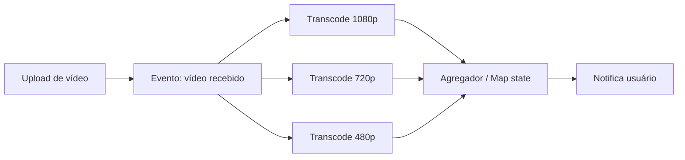
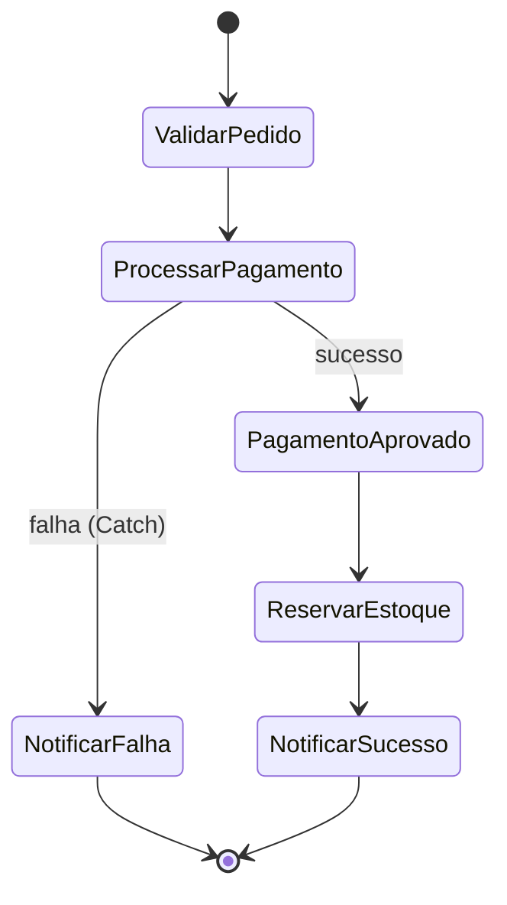
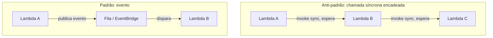
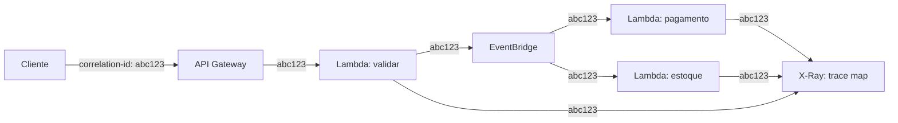

> [!abstract] TL;DR
> Serverless event-driven não perdoa arquitetura ruim — ele só esconde os sintomas por mais tempo. Os padrões maduros (função de propósito único, fan-out/fan-in, coreografia por eventos, orquestração com Step Functions, idempotência sempre, DLQ em tudo) reduzem acoplamento e dor operacional. Os anti-padrões (Lambda monolítica, Lambda chamando Lambda de forma síncrona, estado em memória entre invocações, distributed monolith disfarçado de microsserviços) parecem inofensivos no protótipo e viram incêndio em produção — custo dobrado, latência somada, debugging que exige reconstruir uma história espalhada em 6 serviços. A observabilidade (tracing distribuído, correlation id, logs estruturados) não é opcional aqui: é o único jeito de enxergar o sistema depois que ele descentralizou.

## O problema: você já construiu o sistema errado antes de perceber

Imagine dois times, ambos começando um projeto serverless na mesma semana. O Time A lê "serverless é rápido pra prototipar" e escreve uma função Lambda de 2000 linhas que recebe um webhook, valida, processa pagamento, atualiza estoque, manda e-mail e grava auditoria — tudo num `handler`. Funciona. O Time B quebra o mesmo fluxo em cinco funções pequenas conectadas por eventos, cada uma fazendo uma coisa.

Três meses depois, o Time A precisa mudar a lógica de e-mail. Precisa reler as 2000 linhas pra achar onde ela vive, redeployar a função inteira (mesmo risco pra mudar 10 linhas que pra mudar 500), e torcer pra não ter quebrado o fluxo de pagamento. O Time B muda a função de e-mail, testa isolado, deploya isolado. Nenhum dos dois times "errou a sintaxe" — os dois escreveram código que funciona. A diferença é arquitetural, e ela só aparece quando o sistema precisa mudar, crescer ou ser debugado sob pressão.

É esse o território desta nota: não sintaxe de FaaS (isso ficou no [[03-Dominios/Tecnologia/Cloud/11 - Serverless e FaaS — Lambda a fundo/06 - Quando serverless faz (e não faz) sentido|galho 11]]), nem o catálogo de eventos gerenciados (isso ficou no [[03-Dominios/Tecnologia/Cloud/13 - Mensageria e eventos gerenciados/05 - Padrões event-driven na cloud|galho 13]]). Aqui a pergunta é: dado que você tem FaaS, mensageria, orquestração e API Gateway na caixa de ferramentas, quais combinações produzem sistemas que sobrevivem a produção — e quais produzem sistemas que só sobrevivem à demo?

## Os padrões maduros

### 1. Single-purpose functions

Uma função Lambda (ou DO Function) deveria fazer uma coisa e ter um único motivo pra mudar — o princípio de responsabilidade única aplicado à unidade de deploy, não só à classe. `processar-pagamento`, `enviar-email-confirmacao`, `atualizar-estoque` são três funções, não uma com `if`. O ganho é duplo: você pode escalar, versionar e debugar cada peça de forma independente, e o "blast radius" de um bug fica contido numa função pequena.

O teste prático: se o nome da função precisa de "e" (`processarPagamentoEEnviarEmail`), ela provavelmente devia ser duas.

### 2. Fan-out / fan-in

Um evento dispara N processamentos em paralelo (fan-out), e os resultados são agregados depois (fan-in). Exemplo clássico: um upload de vídeo dispara transcodificação simultânea em 5 resoluções diferentes; quando todas terminam, uma função final consolida e notifica o usuário.



Na AWS, fan-out nativo vem de SNS (um tópico, múltiplas assinaturas Lambda) ou do `Parallel`/`Map` state do Step Functions — este último já cuida do fan-in, esperando todos os branches terminarem antes de seguir. Na DO, sem SNS nem Step Functions nativos, fan-out vira orquestração manual: a função disparadora escreve N mensagens numa fila (ou invoca N funções assíncronas) e algo — um banco, um contador — precisa rastrear quando todas terminaram pra acionar o fan-in. É o mesmo padrão, com bem mais código de cola.

### 3. Coreografia com eventos (choreography)

Cada serviço reage a eventos e publica os seus próprios, sem um maestro central dizendo "agora você, agora você". Pedido criado → serviço de pagamento reage e publica "pagamento aprovado" → serviço de estoque reage e publica "estoque reservado" → serviço de envio reage. Ninguém sabe o fluxo inteiro; cada peça só sabe sua própria reação.

Isso já foi coberto a fundo na nota de padrões event-driven do galho 13 — aqui vale reforçar o trade-off central: coreografia desacopla bem (times evoluem serviços sem coordenar deploys) mas torna o fluxo de ponta a ponta invisível no código. Não existe um arquivo que você abre e lê "isso é o que acontece quando um pedido é criado". Isso só existe no seu tracing distribuído (mais adiante) ou, melhor, na sua orquestração.

### 4. Orquestração com Step Functions pra fluxos com estado

Quando o fluxo tem lógica condicional, precisa de retry declarativo, espera humana no meio (aprovação de crédito), ou simplesmente precisa ser visualizável e auditável, a orquestração explícita vence a coreografia implícita. Step Functions modela o fluxo como uma máquina de estados: você vê o desenho inteiro, cada estado tem `Retry`/`Catch` configurável, e a execução fica com histórico consultável — quem chamou o quê, quando, com que payload.



A regra prática que separa quando usar cada um: se o fluxo precisa ser *visto e auditado* como uma unidade (pedido → pagamento → estoque → envio, com estado "onde estou agora"), orquestre. Se cada reação é independente e ninguém precisa da visão de conjunto (um evento de log dispara três consumidores que não se importam uns com os outros), coreografe. Muitos sistemas maduros fazem os dois: coreografia entre domínios (bounded contexts), orquestração dentro de um domínio.

Na DO, não existe um Step Functions gerenciado. O caminho é rodar um orquestrador próprio (Temporal, Camunda, ou até uma máquina de estados simples num banco) numa App Platform Service ou Droplet, ou aceitar que o fluxo fica coreografado com mais disciplina de retry manual em cada função.

### 5. Idempotência sempre

Em sistemas assíncronos e event-driven, entrega "at-least-once" é a norma, não a exceção — uma mensagem pode ser processada duas vezes por causa de retry, timeout, ou reprocessamento manual. Se `processar-pagamento` cobra o cartão de novo no reprocessamento, você tem um bug de produção grave.

```python
# Padrão: idempotência via chave de deduplicação
def processar_pagamento(evento):
    chave = evento["idempotency_key"]  # gerada no cliente, ou o event id da fonte

    if ja_processado(chave):           # checagem em DynamoDB/tabela dedicada
        return resultado_anterior(chave)

    resultado = cobrar_cartao(evento["valor"], evento["cartao"])
    salvar_resultado(chave, resultado)  # write condicional (idempotent put)
    return resultado
```

A chave de idempotência pode vir do cliente (um UUID gerado no request original) ou ser derivada do próprio evento (message id do SQS, event id do EventBridge). O armazenamento de "já processei isso" costuma ser uma tabela de chave-valor com TTL — DynamoDB na AWS, managed database (Postgres/Redis) na DO.

### 6. DLQ em tudo

Toda fila, todo destino assíncrono, toda integração de evento deveria ter uma dead-letter queue configurada. Sem DLQ, uma mensagem que falha repetidamente é silenciosamente descartada (ou fica travada bloqueando a fila) — e ninguém sabe que aconteceu até um cliente reclamar.

> [!info] Verificado 2026-07-24 — comportamento de invocação assíncrona Lambda
> Segundo a documentação oficial da AWS, invocações assíncronas do Lambda são colocadas numa fila interna antes de serem entregues à função; você pode configurar como o Lambda trata erros e enviar "registros de invocação" a um destino downstream (SQS, SNS, EventBridge) para encadear componentes. Configurar um destino de falha (ou uma DLQ clássica anexada à função) é o mecanismo que evita perda silenciosa de eventos com erro. Fonte: docs.aws.amazon.com/lambda/latest/dg/invocation-async.html.

Na AWS isso é: DLQ em toda fila SQS que alimenta Lambda, destino de falha (`on-failure destination`) em toda invocação assíncrona, e alarme de CloudWatch monitorando a profundidade da DLQ (uma DLQ que cresce e ninguém olha é a mesma coisa que não ter DLQ). Na DO, sem uma fila gerenciada nativa robusta o suficiente para esse padrão, o caminho comum é usar Redis (Managed Databases) como fila com um esquema de retry manual, ou trazer uma fila externa (RabbitMQ gerenciado por terceiro, ou uma instância própria) — mais responsabilidade operacional pra ter a mesma garantia.

### 7. Backend-for-frontend (BFF)

Cada cliente (web, mobile, parceiro externo) tem uma camada fina de agregação adaptada às suas necessidades específicas, em vez de todo mundo bater no mesmo endpoint genérico e receber um payload gigante que só um dos clientes usa por inteiro. Na prática serverless, um BFF costuma ser uma função (ou pequeno grupo de funções) atrás do API Gateway que orquestra chamadas a serviços de domínio e devolve exatamente o shape que aquele cliente precisa.

O ganho é evolução independente: o time mobile pode mudar o formato de resposta do seu BFF sem negociar com o time web. O custo é mais uma camada — cada BFF é mais uma coisa pra deployar, versionar e observar.

## Os anti-padrões

### 1. Lambda monolítica ("lambdalith")

Uma função gigante que faz tudo — o oposto direto do padrão 1. É sedutor no início (um deploy, um lugar pra olhar) e vira uma dívida técnica que cresce com cada feature: cold start mais lento (mais código pra carregar), blast radius maior (um bug em qualquer parte derruba a função inteira), impossível escalar partes diferentes de forma independente (se `enviar-email` é lento mas `processar-pagamento` precisa de baixa latência, os dois ficam presos ao mesmo runtime).

> [!warning] Lambdalith não é sempre errado
> Existe uma zona cinzenta legítima: agrupar rotas relacionadas de um mesmo domínio numa única função por trás de um framework web (Express, FastAPI) dentro do Lambda é uma técnica válida pra reduzir cold starts quando você tem dezenas de endpoints pequenos e correlatos. A linha vermelha é quando a função cruza domínios de negócio inteiros — pagamento, estoque e notificação no mesmo handler é o cheiro real.

### 2. Lambda chamando Lambda de forma síncrona (Lambda ping-ponging)

Função A invoca Função B de forma síncrona (espera a resposta), que invoca Função C, que invoca Função D. Parece inofensivo — é só "chamar uma função de dentro da outra", como você faria em qualquer linguagem — mas em serverless isso é uma armadilha de custo e latência dupla.



Por quê isso é caro: enquanto A espera B responder, A continua sendo cobrado — cada Lambda cobra por duração de execução, e "esperando" conta como executando. Se A espera B por 3 segundos, você paga a duração de A (3s+) *e* a duração de B, dobrado. Encadeie quatro níveis assim e a latência total do usuário é a soma de todas as latências, não a maior delas — exatamente o oposto do paralelismo que serverless promete.

```python
# Anti-padrão: chamada síncrona encadeada (custo dobrado + latência somada)
import boto3
lambda_client = boto3.client("lambda")

def handler_a(event, context):
    resposta = lambda_client.invoke(
        FunctionName="funcao-b",
        InvocationType="RequestResponse",  # síncrono — A espera B
        Payload=json.dumps(event),
    )
    return json.loads(resposta["Payload"].read())

# Padrão: publica um evento e segue (assíncrono, desacoplado)
def handler_a_evento(event, context):
    eventbridge = boto3.client("events")
    eventbridge.put_events(Entries=[{
        "Source": "app.pedidos",
        "DetailType": "PedidoValidado",
        "Detail": json.dumps(event),
        "EventBusName": "default",
    }])
    return {"status": "publicado"}  # A não espera B
```

A correção não é sempre "nunca chame síncrono" — às vezes você genuinamente precisa da resposta antes de seguir (validação bloqueante, por exemplo). A correção é: prefira eventos por padrão, e reserve chamada síncrona pra quando a resposta é estritamente necessária pro próximo passo — e mesmo aí, considere se Step Functions (que orquestra sem que uma função pague enquanto espera outra) não é melhor que Lambda invocando Lambda diretamente.

### 3. Estado em memória entre invocações

Uma função que guarda estado numa variável global — um contador, um cache, uma conexão — e assume que ele vai estar lá na próxima invocação. Às vezes funciona (o ambiente de execução é reaproveitado em invocações consecutivas do mesmo container "quente"), o que torna o bug traiçoeiro: passa em teste local, passa em staging com baixo tráfego, e falha de forma intermitente em produção quando o provedor decide reciclar o ambiente ou escalar horizontalmente pra outro container que não tem aquele estado.

Serverless é, por definição, stateless entre invocações garantidas — qualquer estado que sobrevive precisa ir pra fora da função: banco de dados, cache gerenciado (ElastiCache/Redis), ou parâmetro explícito no payload do próximo evento.

### 4. Ignorar cold start no caminho crítico

Cold start (o tempo de inicializar um novo ambiente de execução antes de rodar o handler) já foi tratado a fundo no galho 11 como propriedade do runtime. O anti-padrão aqui é arquitetural: colocar uma função com cold start relevante no caminho síncrono crítico de uma experiência sensível a latência — o checkout, a autenticação, a primeira tela do app — sem mitigação (provisioned concurrency, runtime mais leve, ou simplesmente tirar aquele passo do caminho síncrono e movê-lo pra assíncrono).

O erro comum é medir a latência média em dev (onde o container já está quente de tanto testar) e não perceber que o p99 de produção — cheio de cold starts em picos de tráfego — é uma história completamente diferente.

### 5. Distributed monolith disfarçado de microsserviços event-driven

Este é o mais sutil dos cinco. Você tem N serviços separados, cada um com seu próprio deploy, seu próprio repositório, publicando e consumindo eventos — parece a arquitetura dos livros. Mas na prática, o Serviço A não consegue fazer nada sem que o Serviço B responda primeiro, que não consegue responder sem o Serviço C, numa cadeia de dependências síncronas disfarçadas de "eventos" (na verdade é request/response com um bus no meio). Deploy de A quebra silenciosamente B porque o schema do evento mudou. Ninguém consegue subir o sistema localmente porque tudo depende de tudo.

Você pagou o custo operacional dos microsserviços (deploy independente, complexidade de rede, observabilidade distribuída) sem ganhar o benefício real (times realmente independentes, falhas realmente isoladas). O sintoma mais confiável: se você não consegue explicar, numa frase, o que cada serviço faz sem mencionar outro serviço, é um distributed monolith.

## Observabilidade e debugging distribuído: o calcanhar de Aquiles

Aqui está o preço que event-driven serverless cobra em troca de todo o desacoplamento: você perdeu o stack trace único. Num monolito, um erro tem uma pilha de chamadas que você lê de cima a baixo. Num sistema de 8 Lambdas coreografadas por eventos, o "stack trace" de um bug está espalhado em 8 conjuntos de logs, em 8 timestamps diferentes, sem nenhuma ligação óbvia entre eles — a menos que você tenha instrumentado isso desde o início.



Três mecanismos resolvem isso juntos, nenhum sozinho:

**Correlation id.** Um identificador único gerado na borda do sistema (no API Gateway, ou no primeiro evento) que viaja em todo evento subsequente — no header HTTP, no atributo da mensagem SQS, no `detail` do evento EventBridge. Sem isso, correlacionar "esses 6 log lines em 6 serviços diferentes pertencem à mesma requisição do usuário" é arqueologia.

```python
# Propagar correlation id através da cadeia de eventos
import uuid, json

def handler_borda(event, context):
    correlation_id = event.get("headers", {}).get("x-correlation-id") or str(uuid.uuid4())
    logger.info("Requisição recebida", extra={"correlation_id": correlation_id})

    eventbridge.put_events(Entries=[{
        "Source": "app.pedidos",
        "DetailType": "PedidoRecebido",
        "Detail": json.dumps({"correlation_id": correlation_id, "pedido": event["body"]}),
        "EventBusName": "default",
    }])
```

**Structured logging.** Logs em JSON (não texto livre), com campos consistentes — `correlation_id`, `service_name`, `timestamp`, `level` — em todo serviço, permitindo que uma ferramenta de agregação (CloudWatch Logs Insights, ou qualquer stack de logs centralizado) filtre "me dê tudo com esse correlation_id" e reconstrua a linha do tempo.

**Tracing distribuído.** AWS X-Ray instrumenta o código pra enviar spans de cada chamada (segmentos e subsegmentos) e monta um trace map — visualização de "cliente → API Gateway → Lambda A → EventBridge → Lambda B → DynamoDB", com latência de cada salto.

> [!info] Verificado 2026-07-24 — AWS X-Ray
> Segundo a documentação oficial, o X-Ray coleta dados de requisições servidas pela aplicação e fornece um *trace map* mostrando o cliente, o serviço de front-end, e os serviços de back-end chamados no caminho — útil pra identificar gargalos e picos de latência. Serviços integrados ao X-Ray (Lambda incluso) podem propagar headers de trace e enviar dados diretamente, e o Lambda já roda o daemon do X-Ray na sua plataforma. Fonte: docs.aws.amazon.com/xray/latest/devguide/aws-xray.html.

Por que isso é mais difícil em event-driven do que em request/response tradicional? Porque a cadeia de causalidade não é uma pilha de chamadas síncronas que a linguagem rastreia sozinha — é uma sequência de publicações e reações assíncronas, muitas vezes com atraso, retry e reordenação envolvidos. Rastrear isso manualmente (sem correlation id, sem tracing) significa reconstruir, na mão, "o que aconteceu quando" a partir de logs desconexos — exatamente o tipo de trabalho que consome uma tarde inteira de um engenheiro sênior num incidente de produção. Este tema — como operar e observar esse tipo de sistema no dia a dia, não só desenhá-lo — é aprofundado no Bloco 4 da trilha, especificamente no galho de Observabilidade e Operação.

Na DO, sem X-Ray nativo, o caminho é: instrumentar manualmente com OpenTelemetry (que exporta pra um backend de tracing de terceiro — Honeycomb, Jaeger auto-hospedado, Datadog) e disciplinar o correlation id e structured logging com o mesmo rigor, só que sem a integração "de fábrica" que a AWS oferece entre Lambda, API Gateway e X-Ray.

## Custo em escala: onde event-driven serverless fica caro

Vale reforçar aqui, na lente dos padrões, o que a nota 05 do galho 11 já detalhou em números: o modelo de cobrança por invocação e duração que é vantajoso em baixo/médio volume se inverte em alto volume constante. Cada padrão desta nota tem uma pegada de custo diferente:

- Fan-out amplifica invocações — 1 evento vira N execuções, cada uma cobrada.
- Chamadas síncronas encadeadas (o anti-padrão) dobram (ou multiplicam) o tempo cobrado, porque quem espera também paga.
- Step Functions Standard cobra por transição de estado — um workflow com muitos estados pequenos pode custar mais do que uma função só fazendo tudo, mesmo sendo pior arquitetura.
- DLQ e retry, se mal configurados (retry infinito sem backoff), silenciosamente multiplicam invocações cobradas num cenário de falha em cascata.

O ponto prático: os mesmos padrões que tornam o sistema mais correto e mais fácil de debugar tendem a ser os que multiplicam unidades de cobrança. Isso não é motivo pra abandoná-los — é motivo pra medir, com carga realista, antes de assumir que "serverless é sempre mais barato".

## Lock-in: o preço mais alto do event-driven serverless

De todas as camadas desta trilha, arquitetura serverless event-driven é a mais amarrada ao provedor — mais até que FaaS isolado. Por quê: não é só o runtime da função que é proprietário, é o *modelo de evento inteiro*. O formato do evento do EventBridge, os padrões de matching de regras, a sintaxe da Amazon States Language do Step Functions, o jeito como IAM concede permissão de um serviço invocar outro — tudo isso é AWS. Reescrever pra outro provedor não é trocar o `import boto3` por outro SDK; é redesenhar a topologia de comunicação entre serviços.

| Camada | Lock-in |
|---|---|
| Código da função | Baixo — a lógica de negócio é portável |
| Runtime FaaS | Médio — assinatura do handler muda entre provedores |
| Modelo de evento (EventBridge, regras) | Alto — sintaxe e semântica proprietárias |
| Orquestração (Step Functions / ASL) | Alto — Amazon States Language não tem padrão aberto amplamente adotado |
| IAM entre serviços | Alto — políticas e roles são o cimento que segura tudo junto |

Isso não é argumento pra evitar o padrão — é argumento pra entrar de olhos abertos. Times que escolhem event-driven serverless na AWS estão fazendo uma aposta de longo prazo na plataforma, não só numa função isolada.

## Lente dupla: os padrões na prática, AWS e DigitalOcean

| Padrão/anti-padrão | Na AWS | Na DigitalOcean |
|---|---|---|
| Single-purpose functions | Nativo — Lambda por design | Nativo — DO Functions, mesmo princípio |
| Fan-out/fan-in | SNS + assinantes, ou `Parallel`/`Map` no Step Functions | Manual — múltiplas invocações + contador em banco |
| Coreografia | EventBridge como espinha dorsal | Manual — fila (Redis/RabbitMQ) fazendo o papel do bus |
| Orquestração declarativa | Step Functions (ASL, visual, gerenciado) | Sem equivalente gerenciado — Temporal/Camunda auto-hospedado |
| DLQ | SQS DLQ + destino de falha do Lambda, nativo | Sem fila gerenciada robusta — Redis com retry manual ou fila externa |
| Tracing distribuído | X-Ray, integrado a Lambda/API Gateway de fábrica | Sem equivalente nativo — OpenTelemetry + backend de terceiro |

A DO cobre bem a metade "computar e responder a eventos simples" da arquitetura serverless. A metade "orquestrar, rastrear e operar em escala com ferramental gerenciado" é onde a lacuna com a AWS é mais funda neste galho inteiro — e é uma lacuna que ferramental de terceiro (Temporal Cloud, Honeycomb, um bus próprio) preenche, com custo operacional adicional pra manter.

## O que vem a seguir

Os padrões e anti-padrões aqui são o crivo crítico — a lente que separa arquitetura madura de arquitetura que só parece madura. A próxima e última nota deste bloco costura tudo: as peças de FaaS, mensageria, API Gateway, orquestração e os padrões desta nota se juntam numa arquitetura de referência completa, o capstone do Bloco 3, fechando a trilha de "serverless e event-driven" antes de o Bloco 4 assumir a pergunta seguinte — como operar, governar e manter esse sistema vivo em produção.

## Fontes

- AWS. "Invoking a Lambda function asynchronously." https://docs.aws.amazon.com/lambda/latest/dg/invocation-async.html
- AWS. "What is AWS X-Ray?" https://docs.aws.amazon.com/xray/latest/devguide/aws-xray.html
- AWS. "What is Step Functions?" https://docs.aws.amazon.com/step-functions/latest/dg/welcome.html
- DigitalOcean. "Functions Limits." https://docs.digitalocean.com/products/functions/details/limits/
