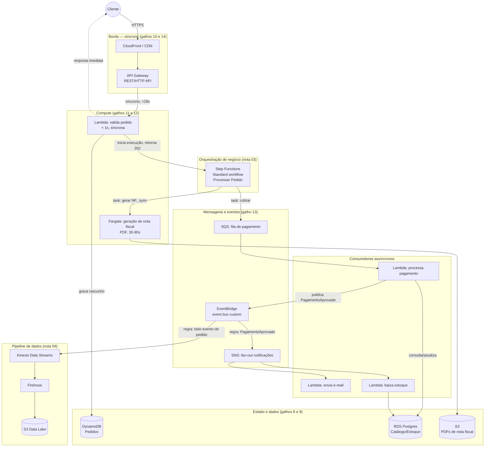

> [!abstract] TL;DR
> Uma arquitetura serverless de referência não é uma peça nova — é a costura das dez peças que os galhos 8 a 15 deram separadamente. Borda síncrona (API Gateway/CDN) recebe o pedido, compute (Lambda ou Fargate, dependendo da duração) processa, um workflow (Step Functions) orquestra as etapas de negócio, eventos (EventBridge/SNS/SQS) desacoplam os sistemas que reagem, e o estado pousa em bancos gerenciados e storage. Este capstone monta o diagrama completo, segue um pedido de e-commerce do clique ao e-mail de confirmação, e entrega a tabela de decisão do Bloco 3 inteiro — junto com a ponte honesta pro Bloco 4, onde a arquitetura desenhada aqui aprende a ser operada.

## O problema: peças ótimas, sistema nenhum

Você terminou os galhos 11 a 14. Sabe quando uma Lambda é a escolha certa e quando é Fargate. Sabe a diferença entre SQS, SNS e EventBridge no sangue. Sabe throttling de API Gateway de cor. E agora?

Aqui mora a armadilha mais comum de quem estuda cloud peça por peça: cada componente, isolado, parece uma decisão pequena — "uso fila ou tópico?", "Lambda ou container?". Mas um sistema real não é uma lista de componentes escolhidos independentemente. É um grafo onde a escolha de um nó restringe os vizinhos. Uma API síncrona que chama uma Lambda que precisa terminar em 200ms não pode enfileirar um passo de 40 minutos no meio — precisa disparar um evento e responder "202 Accepted" pro cliente. Um Step Functions que orquestra sete serviços não substitui o EventBridge que avisa o time de analytics que um pedido fechou — são camadas diferentes do mesmo sistema, uma para *fluxo de negócio conhecido*, outra para *fan-out de quem-quer-saber*.

Este capstone existe para responder a pergunta que nenhuma nota isolada responde: **como essas dez peças se encaixam num sistema que atende de verdade um caso de negócio, do primeiro milissegundo ao dado que pousa no data warehouse?**

## O caso de negócio: um pedido de e-commerce

Vamos seguir um pedido real através da arquitetura. O cliente aperta "Finalizar compra". O que acontece, camada por camada?

Repare na costura de camadas que aparece nesse diagrama e que resume o Bloco 3 inteiro:

1. **Borda síncrona** ([[03-Dominios/Tecnologia/Cloud/10 - DNS, CDN e borda/index|DNS, CDN e borda]] + [[03-Dominios/Tecnologia/Cloud/14 - API Gateway e edge de aplicação/index|API Gateway e edge de aplicação]]): o cliente nunca fala direto com compute. CDN cacheia estático, API Gateway autentica, valida e aplica throttling antes de qualquer linha de código de negócio rodar.
2. **Compute elástico** ([[03-Dominios/Tecnologia/Cloud/11 - Serverless e FaaS — Lambda a fundo/index|Serverless e FaaS]] + [[03-Dominios/Tecnologia/Cloud/12 - Containers gerenciados/index|Containers gerenciados]]): a Lambda que valida o pedido responde em milissegundos porque só faz uma checagem e devolve. A geração de PDF da nota fiscal, que pode levar dezenas de segundos, roda em Fargate — não porque Fargate seja "melhor", mas porque estoura o teto prático de uma chamada síncrona de API Gateway (29 segundos) e o padrão de invocação de Lambda pensado para tarefas curtas.
3. **Orquestração de workflow** (nota 03 deste galho): o Step Functions é quem sabe a *receita* do processo de negócio — cobrar, gerar nota fiscal, esperar confirmação — com retry, tratamento de erro e paralelismo explícitos no desenho do workflow, não espalhados em código.
4. **Mensageria e eventos** ([[03-Dominios/Tecnologia/Cloud/13 - Mensageria e eventos gerenciados/index|Mensageria e eventos gerenciados]]): depois que o pagamento é aprovado, ninguém no fluxo principal *sabe* nem *precisa saber* quem vai reagir. O evento `PagamentoAprovado` cai no EventBridge e qualquer time pode assinar uma regra nova sem tocar no código do pedido — é a diferença entre orquestração (o Step Functions sabe a receita) e coreografia (o restante do sistema reage a fatos publicados, ver nota 02).
5. **Estado** ([[03-Dominios/Tecnologia/Cloud/09 - Bancos gerenciados/index|Bancos gerenciados]] e [[03-Dominios/Tecnologia/Cloud/08 - Armazenamento (object, block e file)/index|Armazenamento]]): DynamoDB guarda o pedido pela previsibilidade de latência sob carga de escrita alta; RDS guarda catálogo e estoque, que têm relações e transações que fazem mais sentido em SQL; S3 guarda o binário do PDF.
6. **Pipeline de analytics** (nota 04 deste galho): o mesmo evento que dispara e-mail e baixa de estoque também alimenta, em paralelo e sem acoplamento, um pipeline via Kinesis → Firehose → data lake em S3, para quem for medir conversão, ticket médio ou fraude depois.

## Por que a orquestração some no meio do caminho

Uma dúvida comum de quem chega até aqui: por que o Step Functions dispara uma tarefa síncrona (`.sync`) para o Fargate mas dispara um evento assíncrono para o pagamento? A resposta é sobre **quem precisa saber quando termina**.

O workflow *precisa* saber quando a nota fiscal terminou de ser gerada, porque o próximo passo do processo de pedido depende do PDF existir — por isso o Step Functions usa integração `.sync`, que bloqueia a transição de estado até o Fargate terminar (documentado na tabela de integrações otimizadas do Step Functions: ECS/Fargate suporta `Run a Job (.sync)`). Já o pagamento aprovado é um *fato* que interessa a consumidores que o workflow nem conhece — e-mail, estoque, analytics — então vira evento publicado, não um passo que o workflow espera terminar.

Essa distinção — "preciso do resultado para continuar" (orquestração, chamada síncrona ou `.sync`) versus "aconteceu um fato que outros vão querer saber" (evento, publicação assíncrona) — é o fio que atravessa a arquitetura inteira, e é a mesma distinção que a nota 02 deste galho trata em profundidade.

## A tabela de decisão do Bloco 3

Chegou a hora de consolidar, numa única tabela, a pergunta que cada galho anterior respondeu isoladamente: dado um requisito, qual peça?

| Requisito | Peça AWS | Peça DigitalOcean | Por quê |
|---|---|---|---|
| Endpoint HTTP com autenticação, rate limit, cache de borda | API Gateway (REST/HTTP API) | App Platform (roteamento + rate limit básico) | Borda cuida de autenticação/quota antes do compute rodar |
| Lógica de negócio curta, orientada a evento, sem estado de longa duração | Lambda | DigitalOcean Functions | FaaS: paga por invocação, escala a zero |
| Processo de longa duração, streaming, ou que precisa de mais controle de runtime | Fargate / ECS | App Platform (Service component) | Container gerenciado: sem gestão de host, mas sem o teto de tempo de execução do FaaS |
| Fluxo de negócio com múltiplas etapas, retry e estado visível | Step Functions | Não há paridade direta — orquestração fica a cargo da aplicação ou de fila+worker | AWS tem orquestrador dedicado; DO exige montar a máquina de estados na própria aplicação |
| Fila ponto-a-ponto, garantir processamento único de uma tarefa | SQS | Managed Kafka (tópico com um consumer group) ou fila própria sobre Redis gerenciado | DO não tem um SQS-equivalente dedicado; Kafka cobre o caso, mas com mais operação |
| Publicar um fato para múltiplos assinantes (fan-out) | SNS | Managed Kafka (múltiplos consumer groups no mesmo tópico) | Pub-sub: SNS é dedicado, Kafka faz o mesmo padrão com mais partes móveis |
| Roteamento de eventos por regra/schema entre múltiplos produtores e consumidores desacoplados | EventBridge | Não há paridade direta — a malha de regras teria que ser montada em cima do Kafka | EventBridge é a peça sem equivalente honesto na DO (ver nota 05 do galho 13) |
| Estado de alta escrita, chave-valor, latência previsível | DynamoDB | Managed Databases (não há wide-column gerenciado na DO) | Sem paridade completa — DO cobre com Postgres/Redis, não um DynamoDB-like |
| Estado relacional, transações, catálogo | RDS | Managed Databases (Postgres/MySQL) | Paridade real, gerenciamento comparável |
| Storage de objeto durável para arquivos, PDFs, exports | S3 | Spaces | Paridade real, API compatível S3 |
| Pipeline de streaming de eventos para analytics | Kinesis + Firehose | Managed Kafka + job de ingestão manual para storage/warehouse | AWS entrega o pipeline gerenciado ponta a ponta; DO entrega o broker, a ingestão fica por sua conta |

> [!info] Verificado 2026-07-24
> A tabela de integrações otimizadas do Step Functions confirma que ECS/Fargate suporta os três padrões (Request-Response, `.sync`, `.waitForTaskToken`), enquanto SNS e SQS suportam Request-Response e `.waitForTaskToken`, mas não `.sync` — por isso publicar em SQS/SNS a partir de um workflow é sempre "dispara e segue", nunca "espera terminar" (fonte: docs.aws.amazon.com/step-functions). Confirme se a tabela mudou antes de reusar esse detalhe num desenho crítico.

## Standard vs Express: a escolha que muda o preço e o comportamento

O Step Functions tem dois sabores de workflow, e a escolha errada aqui é uma armadilha real de arquitetura, não só de custo:

- **Standard**: execução *exatamente uma vez*, roda até um ano, taxa de até 2.000 execuções/segundo e 4.000 transições de estado/segundo, cobrado por transição de estado. Mostra histórico de execução completo no console. É a escolha para o "Processar Pedido" do diagrama acima — você quer auditoria completa e a garantia de que cada passo roda exatamente uma vez.
- **Express**: execução *pelo menos uma vez* (um passo pode rodar mais de uma vez em caso de retry interno), roda até 5 minutos, suporta até 100.000 execuções/segundo, cobrado por número e duração de execuções (não por transição). É a escolha para processar um stream de eventos de alto volume, tipo enriquecer cada evento que chega no Kinesis — não para um fluxo de pedido onde cobrar duas vezes seria um bug de negócio.

(Fonte: docs.aws.amazon.com/step-functions, seção "Standard and Express workflows types", verificado 2026-07-24.)

## Quando essa arquitetura é a certa — e quando é over-engineering

Depois de montar esse diagrama inteiro, a tentação natural é achar que toda aplicação nova merece essa topologia. Não merece. O julgamento sênior aqui é saber quando parar de desenhar.

**Serverless event-driven ganha quando:**
- A carga é imprevisível ou tem picos (Black Friday, campanha, viralização) — pagar por invocação e escalar a zero é economicamente melhor que manter capacidade reservada 24/7.
- Os subsistemas têm ritmos de evolução diferentes — o time de e-mail não deveria fazer deploy junto com o time de pagamento, e eventos desacoplam esses ciclos.
- Auditoria e replay importam — um event bus com histórico permite reprocessar, um monólito síncrono geralmente não guarda o rastro.

**É over-engineering quando:**
- O time é pequeno (2-4 pessoas) e a carga é previsível — um monólito bem estruturado com fila simples resolve com uma fração da complexidade operacional, e monitorar quinze Lambdas, três filas e um bus de eventos consome tempo de engenharia que poderia ir para o produto.
- A lógica de negócio é sequencial e conhecida (A depois B depois C, sempre) — nesse caso um workflow imperativo dentro de um único serviço é mais fácil de debugar do que espalhar a lógica em seis funções conectadas por eventos.
- Não existe ainda um segundo consumidor do evento — publicar um evento "para o futuro" antes de ter quem o consome é complexidade especulativa; o padrão certo é adicionar o event bus quando o segundo consumidor aparecer de fato, não antes (ver os anti-padrões da nota 05 deste galho, em especial o "event bus como fila disfarçada").

> [!warning] O event bus não é grátis em complexidade cognitiva
> Uma arquitetura event-driven troca "eu sei ler o código de cima a baixo" por "eu preciso saber quem assina cada evento". Isso é um custo real de onboarding e de debugging (rastrear um pedido perdido através de cinco filas é mais difícil que ler um stack trace). A decisão de desacoplar via eventos deve ser paga por um ganho real de escala ou de autonomia entre times — nunca por estética arquitetural.

## Custo e operação: o preview do Bloco 4

Esse diagrama tem um problema deliberado: ele mostra o desenho, não a operação. Antes de fechar, vale nomear o que falta — porque é exatamente aí que o Bloco 4 começa.

- **Quanto custa essa arquitetura rodando?** Depende de volume, não de contagem de componentes — dez Lambdas quase ociosas custam menos que uma instância EC2 rodando 24/7, mas o mesmo tráfego em escala alta pode inverter essa conta. FinOps para serverless (galho 19) ensina a fazer essa conta direito, incluindo custos escondidos como transferência de dados entre serviços e o custo por transição do Step Functions Standard.
- **Como esse sistema fica visível quando algo quebra?** Um pedido que trava entre "pagamento aprovado" e "e-mail nunca chegou" exige rastrear uma cadeia assíncrona através de múltiplos serviços gerenciados — trace distribuído, dead-letter queues e alarmes por componente (galho 17, observabilidade) não são opcionais aqui, são a diferença entre "encontrei o bug em 5 minutos" e "não sei nem por onde procurar".
- **Como essa arquitetura é declarada e versionada?** O diagrama acima representa dezenas de recursos (funções, filas, tópicos, regras, tabelas, buckets, roles IAM) — criar isso manualmente no console é insustentável e não reproduzível; Infrastructure as Code (galho 16) é como esse desenho vira algo que se recria, revisa e reverte.
- **Como cada peça está isolada e autorizada?** Cada seta do diagrama é uma permissão IAM que precisa existir e não uma a mais — segurança em profundidade para arquiteturas serverless (galho 18) trata exatamente da superfície de permissões que esse tipo de sistema multiplica.
- **O que acontece quando uma peça falha?** Uma fila cheia, uma região fora do ar, um downstream lento — resiliência (galho 20) é o que garante que a falha de um nó do diagrama não vira a falha do sistema inteiro.

O Bloco 3 desenhou a arquitetura. O Bloco 4 é quem ensina a mantê-la viva, visível, segura, barata e resiliente em produção — sem isso, o diagrama bonito é só um diagrama.

## Lente AWS ↔ DigitalOcean: a mesma arquitetura, dois graus de maturidade

Vale fechar reafirmando com honestidade o que a tabela de decisão já revelou: a arquitetura de referência inteira, ponta a ponta, existe pronta e gerenciada na AWS. Na DigitalOcean, ela é montável, mas com peças reais faltando.

- **Borda + compute**: paridade boa. App Platform cobre HTTP roteado, DigitalOcean Functions cobre FaaS, App Platform Service component cobre containers de longa duração.
- **Orquestração de workflow**: sem paridade. Não existe um Step Functions da DO — a orquestração de múltiplas etapas de negócio precisa ser codificada na própria aplicação ou montada sobre filas manualmente.
- **Mensageria**: paridade parcial via Managed Kafka, que cobre fila (um consumer group) e pub-sub (múltiplos consumer groups) num único produto, mas exige mais operação do consumidor do que um SQS ou SNS gerenciados — e não existe um equivalente ao EventBridge (roteamento por regra e schema entre múltiplos produtores/consumidores).
- **Estado**: paridade boa em relacional (Managed Databases cobre Postgres/MySQL como o RDS), sem paridade em wide-column tipo DynamoDB.
- **Storage**: paridade real — Spaces é compatível com a API do S3.
- **Analytics pipeline**: sem paridade gerenciada ponta a ponta — o Kafka entrega o transporte de eventos, mas a ingestão para um data lake/warehouse é responsabilidade da aplicação, não um Kinesis Firehose pronto.

> [!info] Verificado 2026-07-24
> A documentação de limites do App Platform (docs.digitalocean.com/products/app-platform/details/limits) confirma que Functions não têm suporte a VPC e não são elegíveis para autoscaling baseado em requisições — uma diferença operacional real frente ao Lambda dentro de VPC. A documentação de Managed Kafka (docs.digitalocean.com/products/databases/kafka) confirma que o produto é a peça de mensageria/streaming gerenciada da DO, sem um serviço dedicado equivalente a SNS/SQS/EventBridge separadamente.

Isso não é a DO perdendo — é a DO sendo uma plataforma mais simples e mais barata, que troca profundidade de serviços gerenciados por menos partes móveis e menos vendor lock-in ao Kafka. Para um time pequeno que já decidiu que precisa de event-driven, mas não precisa de doze produtos diferentes, essa simplicidade é uma vantagem, não uma lacuna.

## O que vem a seguir

Este capstone fecha o Bloco 3 (Computação sem servidor e arquiteturas orientadas a eventos) — os galhos 11 a 15 deram as peças e este último as costurou num sistema de referência. O Bloco 4 (Operar, sustentar, governar) pega exatamente esse diagrama e pergunta, galho a galho: como declarar essa infraestrutura como código, como observá-la em produção, como protegê-la em profundidade, como pagar por ela sem susto, e como fazê-la sobreviver a falhas parciais. A arquitetura está desenhada — falta aprender a mantê-la viva.

## Fontes

- AWS Step Functions — Standard vs Express workflows: https://docs.aws.amazon.com/step-functions/latest/dg/sfn-express-vs-standard.html
- AWS Step Functions — visão geral e tabela de integrações otimizadas: https://docs.aws.amazon.com/step-functions/latest/dg/welcome.html
- AWS Step Functions — pricing: https://aws.amazon.com/step-functions/pricing/
- DigitalOcean App Platform — Limits: https://docs.digitalocean.com/products/app-platform/details/limits/
- DigitalOcean Managed Databases for Kafka: https://docs.digitalocean.com/products/databases/kafka/
- AWS EventBridge — documentação: https://docs.aws.amazon.com/eventbridge/latest/userguide/
- AWS Well-Architected Framework — Serverless Applications Lens: https://docs.aws.amazon.com/wellarchitected/latest/serverless-applications-lens/welcome.html
