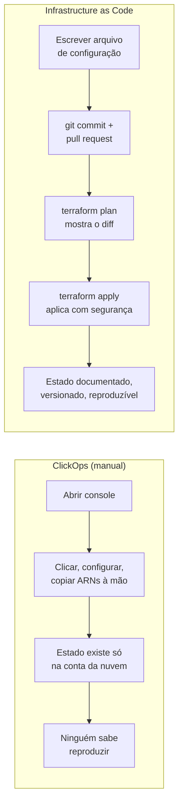
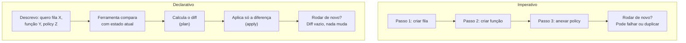

> [!abstract] TL;DR
> Criar infraestrutura clicando no console funciona uma vez — e falha na segunda. Infrastructure as Code (IaC) descreve a infraestrutura desejada em arquivos de texto versionados, que uma ferramenta (Terraform, CloudFormation) lê e aplica de forma reproduzível. Você troca "lembrar quais botões cliquei" por "ler o que está escrito no arquivo" — e ganha histórico, revisão e um `plan` que mostra o que vai mudar antes de mudar.

## O problema: o capstone do Bloco 3 não cabe no console

Pare um segundo e imagine reconstruir, só de clique, a arquitetura serverless que fechou o [[03-Dominios/Tecnologia/Cloud/15 - Arquiteturas serverless e event-driven/06 - Arquitetura serverless de referência (capstone do Bloco 3)|capstone do Bloco 3]]: um punhado de funções, filas, tópicos, tabelas, roles IAM com permissões cirúrgicas entre eles, API Gateway amarrando tudo. Cada recurso tem um nome, uma configuração, uma dependência do recurso anterior. Você abre o console, cria a fila, copia o ARN, cola na função, cria a role, anexa a policy certa, testa, ajusta um timeout, esquece de anotar que ajustou.

Agora imagine que precisa da mesma arquitetura numa segunda região, para disaster recovery. Ou numa conta de staging, idêntica à de produção. Ou que o engenheiro que montou tudo isso de cabeça saiu da empresa mês passado.

É aqui que o clique no console — carinhosamente apelidado de **ClickOps** — mostra sua fratura estrutural. Não é que seja lento (embora seja). É que o resultado não é *conhecimento*, é um estado que existe só dentro da conta da nuvem, sem registro de como chegou lá.

### Os quatro pecados do ClickOps

**Drift silencioso.** Alguém entra no console às 3h de uma sexta-feira, ajusta um limite de memória "só para resolver o incidente agora", e esquece de documentar. Seis meses depois, ninguém sabe por que aquela função tem um valor de memória diferente de todas as outras. O estado real da infraestrutura foi divergindo (drift) da intenção original, e não existe fonte de verdade que capture os dois.

**Snowflake servers.** Cada ambiente criado à mão acaba sutilmente diferente do outro — um floco de neve único, irrepetível. Staging "quase" igual a produção não serve para testar nada, porque o "quase" é exatamente onde os bugs se escondem.

**Sem code review.** Um clique no console não passa por pull request. Ninguém revisou se a role criada tem permissão de mais, se o bucket ficou público sem querer, se o nome do recurso segue a convenção do time. A mudança acontece e já está em produção.

**Conhecimento tribal.** A arquitetura vive na cabeça de quem a construiu. Sem exagero: é comum uma empresa descobrir, no dia em que essa pessoa sai, que ninguém mais sabe explicar por que aquela VPC tem três sub-redes ao invés de duas, ou o que aconteceria se aquele security group fosse removido.

> [!warning] O console não é o inimigo
> Console é ótimo para explorar, aprender um serviço novo, debugar um problema pontual. O problema é usá-lo como *método de provisionamento* de algo que precisa existir de novo, de forma confiável, mais de uma vez. IaC não substitui o console — ele substitui o console como fonte de verdade.

## O que Infrastructure as Code entrega

IaC resolve isso invertendo a pergunta. Em vez de "quais passos eu executo para chegar no resultado?", você escreve "qual é o resultado que eu quero?" — e delega à ferramenta a tarefa de descobrir os passos.



Da mudança de método nascem consequências concretas:

- **Reproduzibilidade.** O mesmo arquivo, aplicado numa conta nova ou numa região nova, produz a mesma infraestrutura. Não existe "esqueci um passo" — o arquivo é o passo a passo completo.
- **Versionamento real.** O arquivo vive no git. `git log` vira o histórico da infraestrutura: quem mudou o quê, quando, e por quê (a mensagem do commit).
- **Code review.** Uma mudança de infraestrutura passa por pull request como qualquer mudança de código. Um colega revisa antes de a permissão de mais entrar em produção.
- **Plan antes de aplicar.** A ferramenta calcula o diff entre o estado atual e o desejado e mostra exatamente o que vai criar, mudar ou destruir — antes de tocar em qualquer coisa. É o equivalente a um `git diff` para infraestrutura.
- **Documentação viva.** O arquivo de configuração *é* a documentação da arquitetura. Não fica desatualizado, porque é a própria fonte que gera o estado real — se o arquivo mentisse, a infraestrutura não bateria com ele.
- **Ambientes idênticos.** Staging e produção deixam de ser "parecidos" e passam a ser literalmente o mesmo template, com parâmetros diferentes (tamanho da instância, contagem de réplicas).

## Declarativo vs. imperativo

Essa é a distinção central que separa as ferramentas de IaC de um script de shell que "também automatiza infraestrutura".

Num modelo **imperativo**, você escreve os passos: "crie uma fila com este nome, depois crie uma função, depois anexe esta policy à role". É um roteiro de ações, em ordem. Rodar o script duas vezes pode ter efeitos diferentes — na segunda vez, a fila já existe, e o comando `create-queue` provavelmente falha com "já existe".

Num modelo **declarativo**, você descreve o estado final: "eu quero uma fila com este nome e esta configuração de retenção". A ferramenta compara esse desejo com o que já existe e decide sozinha o que fazer — criar, se não existe; ajustar, se existe mas está diferente; não fazer nada, se já está exatamente como pedido.



Essa propriedade de "rodar de novo não muda nada se já está no estado desejado" tem nome: **idempotência**. É o que torna seguro reexecutar um `terraform apply` sem medo — se nada mudou na configuração e nada fez drift na nuvem, o segundo `apply` não faz absolutamente nada. Terraform, CloudFormation e ferramentas semelhantes são declarativas por design; um script bash que chama a AWS CLI em sequência é imperativo, a menos que você mesmo escreva a lógica de "só crie se não existir" — o que, na prática, é reinventar (mal) o que a ferramenta declarativa já resolve.

## Um exemplo concreto: a mesma fila, dois jeitos

Para tirar isso do abstrato, veja como o mesmo recurso simples — uma fila de mensagens — aparece em Terraform, primeiro na AWS, depois na DigitalOcean. O ponto não é decorar a sintaxe agora (isso é assunto da próxima nota), é notar a forma: um bloco `resource`, um tipo, um nome lógico, um conjunto de atributos. Nada de "passo 1, passo 2, passo 3".

```hcl
# AWS — fila SQS
resource "aws_sqs_queue" "pedidos" {
  name                      = "fila-pedidos"
  message_retention_seconds = 86400
  visibility_timeout_seconds = 30
}
```

```hcl
# DigitalOcean — não existe fila gerenciada nativa equivalente à SQS;
# o exemplo abaixo é um Droplet, para mostrar a MESMA forma sintática
resource "digitalocean_droplet" "worker" {
  name   = "worker-fila"
  region = "nyc3"
  size   = "s-1vcpu-1gb"
  image  = "ubuntu-22-04-x64"
}
```

Repare: a *forma* do bloco é idêntica nos dois provedores — `resource "<tipo>" "<nome_lógico>" { atributos }` — porque quem muda é o *provider* por baixo, não o modelo mental do Terraform. Isso é o que sustenta a promessa "multi-cloud": aprender a ler um bloco `resource` te dá o vocabulário para ler o de qualquer provider, mesmo que os atributos específicos mudem.

> [!info] DigitalOcean não tem fila gerenciada nativa (verificado 2026-07-24)
> Diferente da AWS (SQS), a DigitalOcean não oferece um serviço de fila de mensagens totalmente gerenciado no seu catálogo principal. Times que precisam de fila na DO em geral rodam algo próprio (RabbitMQ, Redis) num Droplet ou usam um serviço gerenciado de terceiros — não é uma equivalência 1:1, e por isso o segundo exemplo troca a fila por um Droplet, só para preservar a comparação sintática.

Rodar `terraform apply` sobre esse arquivo, da primeira vez, cria a fila (ou o Droplet). Rodar de novo, sem mudar nada, não faz nada — o `plan` mostra "0 to add, 0 to change, 0 to destroy". Mude o `message_retention_seconds` para `172800` e rode de novo: o `plan` mostra exatamente essa linha como "~ update in-place", e só ela. É essa precisão cirúrgica — "aqui está exatamente o que vai mudar" — que falta por completo no clique manual no console.

## Panorama das ferramentas

Não existe uma ferramenta de IaC única — existe um espectro, do multi-cloud genérico ao nativo específico de cada provedor.

| Ferramenta | Provedor | Estilo | Linguagem |
|---|---|---|---|
| Terraform | Multi-cloud | Declarativo | HCL (HashiCorp Configuration Language) |
| OpenTofu | Multi-cloud | Declarativo | HCL (fork open-source do Terraform) |
| CloudFormation | AWS nativo | Declarativo | JSON/YAML |
| AWS CDK | AWS nativo | Declarativo (gera CloudFormation) | TypeScript, Python, Java, C#, Go |
| Pulumi | Multi-cloud | Declarativo (linguagem de programação) | TypeScript, Python, Go, C# |
| doctl / AWS CLI | Específico | Imperativo | Shell / scripts |

**Terraform** é o ponto de partida mais comum hoje, e o foco desta trilha: HCL é uma linguagem de configuração declarativa própria (não é JSON, nem uma linguagem de programação de verdade), desenhada para descrever recursos de qualquer provedor de nuvem através de *providers* — plugins que traduzem HCL em chamadas de API. Isso é o que dá a fama de "multi-cloud": o mesmo fluxo de trabalho (`plan`/`apply`) serve para AWS, DigitalOcean, Azure, GCP ou qualquer serviço com um provider Terraform.

> [!info] Terraform, licença e OpenTofu (verificado 2026-07-24)
> Em 2023 a HashiCorp mudou a licença do Terraform de open-source (MPL) para Business Source License (BSL), o que gerou um fork da comunidade chamado **OpenTofu**, mantido pela Linux Foundation e compatível com a sintaxe HCL do Terraform. Os dois convivem hoje; esta trilha usa "Terraform" como termo guarda-chuva para o modelo de trabalho, que se aplica igualmente ao OpenTofu. Vale reconferir o estado da licença e da compatibilidade antes de decisões de produção — esse é um território que ainda se move.

**CloudFormation** é o irmão nativo da AWS: você não instala nada além da CLI, o serviço roda inteiramente dentro da AWS, e não cobra pelo uso do CloudFormation em si — você paga apenas pelos recursos que ele provisiona. A vantagem é integração profunda com o resto da AWS (rollback automático em caso de falha, por exemplo); a desvantagem é que só existe para AWS.

**CDK** (Cloud Development Kit) é uma camada acima do CloudFormation: você escreve infraestrutura numa linguagem de programação de verdade (TypeScript, Python...) e o CDK compila isso para um template CloudFormation por baixo dos panos. Ganha-se loops, funções, testes unitários da infraestrutura — perde-se a leitura direta e simples de um YAML declarativo puro. Pulumi persegue a mesma ideia, mas multi-cloud, como o Terraform.

## A lente dupla: AWS e DigitalOcean

Na AWS, o caminho nativo é **CloudFormation** (e seu primo CDK), mas Terraform é tão usado no mundo AWS quanto o nativo — a AWS mantém oficialmente o [provider Terraform para AWS](https://registry.terraform.io/providers/hashicorp/aws/latest/docs), e boa parte das empresas que atuam multi-cloud, ou que só preferem HCL a YAML de CloudFormation, escolhem Terraform mesmo estando 100% na AWS.

Na DigitalOcean, não existe equivalente a um CloudFormation nativo — a DO não tem uma linguagem/serviço de IaC própria e proprietária. Em vez disso, a DO investe em ser um bom cidadão do ecossistema Terraform: mantém oficialmente o [`digitalocean/digitalocean` Terraform provider](https://registry.terraform.io/providers/digitalocean/digitalocean/latest), publicado e documentado como parte da própria documentação da DO. Isso significa que, na prática, Terraform *é* a forma declarativa de fazer IaC na DigitalOcean.

O outro lado da DO é **doctl**, a CLI oficial de linha de comando — mas doctl é imperativo: você chama `doctl compute droplet create` e ele cria um droplet naquele instante, sem noção de "estado desejado" nem plan/apply. doctl serve bem para scripts pontuais, automação simples, ou para explorar a API a partir do terminal — não para modelar uma arquitetura inteira de forma declarativa e versionada. Para isso, a resposta da DO é: "use o provider Terraform".

> [!info] Verificado 2026-07-24
> Confirmado via `docs.digitalocean.com`: o provider oficial é `terraform-provider-digitalocean` (repositório `digitalocean/terraform-provider-digitalocean` no GitHub), documentado como caminho recomendado de IaC na DigitalOcean. A documentação da DO não referencia nenhuma ferramenta de IaC nativa própria além do doctl (imperativo) e do provider Terraform.

## Tradução de nomes entre os quatro provedores

| Conceito | AWS | DigitalOcean | Azure | GCP |
|---|---|---|---|---|
| IaC declarativo multi-cloud | Terraform (provider `hashicorp/aws`) | Terraform (provider `digitalocean/digitalocean`) | Terraform (provider `azurerm`) | Terraform (provider `google`) |
| IaC nativo declarativo | CloudFormation | — (não existe) | ARM Templates / Bicep | Deployment Manager (legado) / Config Connector |
| IaC como linguagem de programação | AWS CDK | — (não existe) | Bicep (DSL própria, não linguagem geral) | — (usa Terraform/Pulumi) |
| CLI imperativa oficial | AWS CLI | doctl | Azure CLI (`az`) | gcloud CLI |
| Unidade de mudança aplicada | Stack (CloudFormation) | — (Terraform state) | Deployment (ARM) / Deployment (Bicep) | Deployment |

## Onde termina esta nota e onde começa Operação

Vale marcar uma fronteira que vai aparecer o tempo todo daqui para frente: esta nota — e o resto deste galho — trata de **provisionar** infraestrutura (criar o servidor, a fila, a role). Como essa provisionamento se encaixa num pipeline automatizado, quem aprova o `apply` em produção, o que é GitOps, e como IaC conversa com CI/CD, é disciplina de **entrega contínua**, tratada no domínio [[03-Dominios/Engenharia/Operação/index|Operação]]. Aqui o foco é a ferramenta e o conceito; lá é o processo de time em torno dela.

> [!info] Fronteira com Operação
> GitOps, pipelines de deploy e "quem aperta o botão de produção" pertencem à disciplina de Operação/Entrega. Este galho ensina Terraform e o modelo declarativo — não como rodá-lo dentro de um pipeline de CI/CD (isso é assunto de outro domínio).

## Armadilhas para o iniciante

> [!warning] "IaC" não é sinônimo de "sem erro"
> Um `apply` mal calculado pode destruir um banco de dados em produção com a mesma facilidade que criaria um. O `plan` existe exatamente para você ler antes de confirmar — ignorá-lo (ou automatizar o `apply` sem revisão humana em ambientes críticos) é trocar um risco humano (clique errado) por outro (código errado que roda sozinho).

> [!warning] Declarativo não significa "sem estado para gerenciar"
> Para saber o que já existe e calcular o diff, Terraform precisa guardar em algum lugar o mapeamento entre a configuração e os recursos reais criados — o *state*. Esse arquivo de estado é, por sua vez, uma peça delicada (quem acessa, onde fica, como evita conflito entre duas pessoas aplicando ao mesmo tempo). É assunto grande o bastante para ter nota própria mais adiante neste galho.

> [!warning] Ferramenta de IaC não substitui entender o serviço
> Escrever `resource "aws_lambda_function"` sem entender o que é uma função Lambda, seus limites de timeout, sua configuração de memória, não vira infraestrutura confiável só porque está em HCL. IaC documenta e reproduz decisões — não substitui as decisões em si.

## O que vem a seguir

A próxima nota mergulha em Terraform de fato: instalação, providers, resources, variables, outputs, e o ciclo `init` → `plan` → `apply` na prática, com exemplos reais tanto na AWS quanto na DigitalOcean. Depois disso, o galho aborda o problema do state (onde ele mora, como colaborar em time sem pisar no arquivo um do outro), o caminho nativo com CloudFormation e CDK, boas práticas de módulos e ambientes, e fecha com um capstone que pede uma escolha justificada de ferramenta para um cenário real.

## Fontes

- AWS. "What is CloudFormation?" — https://docs.aws.amazon.com/AWSCloudFormation/latest/UserGuide/Welcome.html
- AWS. "AWS CloudFormation pricing" — https://aws.amazon.com/cloudformation/pricing/
- AWS. Terraform AWS Provider (Terraform Registry) — https://registry.terraform.io/providers/hashicorp/aws/latest/docs
- DigitalOcean. "Terraform" (documentação oficial) — https://docs.digitalocean.com/reference/terraform/
- DigitalOcean. Terraform DigitalOcean Provider (Terraform Registry) — https://registry.terraform.io/providers/digitalocean/digitalocean/latest
- DigitalOcean. doctl (CLI oficial) — https://docs.digitalocean.com/reference/doctl/
- HashiCorp. Terraform documentation — https://developer.hashicorp.com/terraform/docs
- Linux Foundation. OpenTofu — https://opentofu.org/
- AWS. AWS Cloud Development Kit (CDK) — https://docs.aws.amazon.com/cdk/v2/guide/home.html
