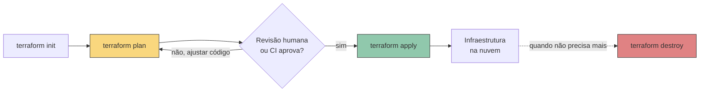
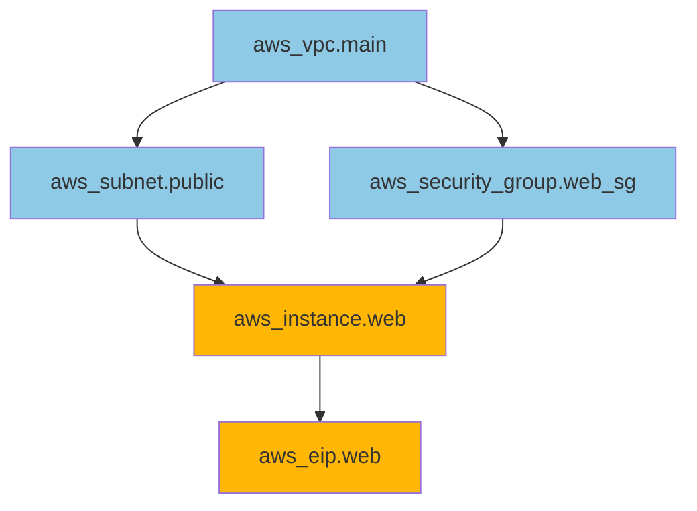

> [!abstract] TL;DR
> Terraform descreve infraestrutura em arquivos declarativos (HCL) e a mantém sincronizada com a nuvem através de um ciclo de três passos: `init` baixa os providers, `plan` calcula o diff entre o que você escreveu e o que existe, `apply` executa esse diff. O mesmo binário fala com dezenas de nuvens através de providers — troque o bloco `provider` e o resto do vocabulário (variáveis, dependências, laços) continua igual, seja você provisionando na AWS ou na DigitalOcean.

## O problema: o desenho não vira infraestrutura sozinho

Você fechou o capstone do bloco anterior com um diagrama de arquitetura: uma VPC, duas subnets, um load balancer, um Auto Scaling Group, um banco gerenciado, um bucket, algumas regras de firewall. No papel, é elegante. No console da AWS, é uma sequência de talvez quarenta cliques, cada um com uma dúzia de campos, em uma ordem que importa (a subnet precisa existir antes do ASG que a referencia) e que ninguém lembra de cabeça na segunda tentativa.

Agora multiplique isso por três: você precisa do ambiente de staging igual ao de produção, e vai precisar recriar tudo depois de um desastre, e o time inteiro precisa poder revisar a mudança antes dela acontecer. Cliques no console não passam por code review. Cliques no console não têm histórico de "quem mudou o quê e por quê". Cliques no console, feitos duas vezes por duas pessoas diferentes, divergem — e a divergência silenciosa é como ambientes ficam "meio parecidos" até quebrarem de um jeito que só acontece em produção.

Infrastructure as Code resolve isso descrevendo o estado desejado em arquivo texto. Terraform é, hoje, o jeito mais comum de fazer isso fora de uma única nuvem: um único vocabulário declarativo, um único ciclo de comandos, e um provider para cada plataforma — AWS, DigitalOcean, Azure, GCP, Cloudflare, Datadog, e centenas de outras coisas que têm API.

> [!info] Sobre a nota anterior
> Esta nota assume que você já decidiu que IaC vale a pena — o porquê (reprodutibilidade, revisão, versionamento) é o assunto da nota anterior do galho, "01 - Por que Infrastructure as Code". Aqui o foco é mecânica: como o Terraform funciona por dentro.

## HCL: o vocabulário

Terraform usa uma linguagem própria, a HashiCorp Configuration Language (HCL) — declarativa, não um script imperativo. Você não escreve "crie uma instância, depois crie um firewall, depois associe". Você declara "existe uma instância assim, existe um firewall assim, o firewall se aplica a essa instância" e deixa o Terraform descobrir a ordem.

Seis tipos de bloco cobrem praticamente tudo que você vai escrever:

```hcl
# 1. terraform — configuração do próprio Terraform (versão, providers exigidos, backend)
terraform {
  required_providers {
    aws = {
      source  = "hashicorp/aws"
      version = "~> 5.0"
    }
  }
  required_version = ">= 1.7"
}

# 2. provider — como falar com uma nuvem específica
provider "aws" {
  region = "us-east-1"
}

# 3. resource — algo que o Terraform vai CRIAR e GERENCIAR
resource "aws_instance" "web" {
  ami           = "ami-0abcdef1234567890"
  instance_type = "t3.micro"
}

# 4. data — algo que já EXISTE e você só quer LER
data "aws_ami" "ubuntu" {
  most_recent = true
  owners      = ["099720109477"] # Canonical
  filter {
    name   = "name"
    values = ["ubuntu/images/hvm-ssd/ubuntu-jammy-*"]
  }
}

# 5. variable — entrada parametrizável
variable "instance_type" {
  type        = string
  default     = "t3.micro"
  description = "Tipo de instância para o servidor web"
}

# 6. output — saída que o Terraform expõe depois do apply
output "web_public_ip" {
  value = aws_instance.web.public_ip
}
```

Repare na anatomia de um `resource`: `resource "<tipo>" "<nome_local>" { ... }`. O tipo (`aws_instance`) vem do provider e determina quais campos existem. O nome local (`web`) é só uma etiqueta dentro do seu código — é como você referencia esse recurso em outro lugar do config, via `aws_instance.web.public_ip`, por exemplo. Não confunda o nome local com o nome real do recurso na nuvem (a tag `Name`, o hostname) — são coisas diferentes que só coincidem se você quiser.

Existe ainda um sétimo bloco, `locals`, para valores calculados que você quer nomear e reusar sem expor como variável de entrada nem criar um resource:

```hcl
locals {
  common_tags = {
    Project     = "capstone-cloud"
    Environment = "staging"
    ManagedBy   = "terraform"
  }
}

resource "aws_instance" "web" {
  # ...
  tags = local.common_tags
}
```

## O ciclo: init → plan → apply → destroy

Esse é o coração operacional do Terraform, e a razão de ele ser mais seguro que clicar no console: toda mudança passa por uma etapa de "prévia" antes de acontecer de verdade.



**`terraform init`** — roda uma vez por diretório de config (ou sempre que você adiciona/troca um provider). Lê o bloco `required_providers`, baixa os plugins correspondentes (o plugin `aws`, o plugin `digitalocean`) para uma pasta local `.terraform/`, e configura o backend onde o state vai morar. Sem isso, o Terraform nem sabe como falar com a AWS — o provider é literalmente o código que traduz HCL em chamadas de API.

**`terraform plan`** — a etapa mais importante do ciclo, e a que mais separa Terraform de "rodar um script". O Terraform lê seu código, lê o *state* (o registro do que ele acha que já existe — assunto da próxima nota do galho), consulta a API real da nuvem para conferir se o state ainda bate com a realidade, e calcula um diff de três categorias:

```
Terraform will perform the following actions:

  # aws_instance.web will be created
  + resource "aws_instance" "web" {
      + ami           = "ami-0abcdef1234567890"
      + instance_type = "t3.micro"
      + public_ip     = (known after apply)
      ...
    }

  # aws_security_group.web_sg will be updated in-place
  ~ resource "aws_security_group" "web_sg" {
      ~ ingress = [
          - { from_port = 22, ... },
          + { from_port = 443, ... },
        ]
    }

  # aws_instance.old_bastion will be destroyed
  - resource "aws_instance" "old_bastion" {
      - id = "i-0123456789abcdef0" -> null
    }

Plan: 1 to add, 1 to change, 1 to destroy.
```

`+` para criar, `~` para atualizar in-place, `-` para destruir. O `plan` é a sua rede de segurança: você lê essa saída *antes* de qualquer coisa acontecer. Um `1 to destroy` inesperado num plan de "só queria adicionar uma tag" é o sinal de que algo no seu código mudou uma propriedade que força recriação do recurso — e é exatamente o tipo de acidente que o `plan` existe para pegar antes de apagar produção.

**`terraform apply`** — executa o plano. Por padrão pede confirmação interativa (`yes`), ou aceita um plano salvo (`terraform apply tfplan`) para pipelines de CI/CD onde a aprovação já aconteceu em outro lugar — GitOps e pipelines são o assunto da trilha Operação, não desta nota.

**`terraform destroy`** — o inverso: calcula e executa um plano onde tudo que o Terraform gerencia neste state vira `-`. Útil para ambientes efêmeros (um ambiente de PR, um lab de estudo) e perigoso pela mesma razão — é fácil rodar no diretório errado.

> [!warning] `plan` não é garantia absoluta
> O `plan` reflete o estado no momento em que você rodou. Se alguém aplicar outra mudança (via console, via outro pipeline) entre o seu `plan` e o seu `apply`, o Terraform detecta a divergência e recalcula — mas isso significa que um `apply` sem `plan` recente na tela pode surpreender. Em times, é comum rodar `plan` e `apply` na mesma execução de pipeline, sem gap manual no meio.

## Providers: o mesmo vocabulário, nuvens diferentes

Um provider é um plugin que traduz os blocos `resource` e `data` da sua config em chamadas à API de uma plataforma específica. É a peça que faz Terraform ser "multi-cloud" sem ser mágico — cada nuvem ainda tem seu próprio provider, com seus próprios tipos de recurso, nomeados e documentados separadamente no Terraform Registry.

### AWS

```hcl
provider "aws" {
  region = "us-east-1"
  # autenticação: nunca hardcode aqui.
  # usa a mesma cadeia de credenciais da AWS CLI —
  # env vars AWS_ACCESS_KEY_ID/AWS_SECRET_ACCESS_KEY,
  # ~/.aws/credentials, ou IAM role (instance profile / OIDC em CI)
}

resource "aws_instance" "web" {
  ami                    = data.aws_ami.ubuntu.id
  instance_type          = "t3.micro"
  vpc_security_group_ids = [aws_security_group.web_sg.id]
  subnet_id              = aws_subnet.public.id
  tags = {
    Name = "web-server"
  }
}

resource "aws_security_group" "web_sg" {
  name   = "web-sg"
  vpc_id = aws_vpc.main.id

  ingress {
    from_port   = 443
    to_port     = 443
    protocol    = "tcp"
    cidr_blocks = ["0.0.0.0/0"]
  }
}
```

### DigitalOcean

```hcl
provider "digitalocean" {
  # autenticação: variável ou env var DIGITALOCEAN_TOKEN
  token = var.do_token
}

resource "digitalocean_droplet" "web" {
  image    = "ubuntu-22-04-x64"
  name     = "web-server"
  region   = "nyc3"
  size     = "s-1vcpu-1gb"
  vpc_uuid = digitalocean_vpc.main.id
}

resource "digitalocean_firewall" "web_fw" {
  name        = "web-fw"
  droplet_ids = [digitalocean_droplet.web.id]

  inbound_rule {
    protocol         = "tcp"
    port_range       = "443"
    source_addresses = ["0.0.0.0/0"]
  }
}
```

> [!info] Verificado 2026-07-24
> O exemplo de `digitalocean_droplet` acima segue o formato publicado na documentação oficial da DigitalOcean (docs.digitalocean.com/reference/terraform/getting-started). A doc oficial configura a autenticação via `variable "do_token" {}` com prompt interativo no `apply`, em vez de padronizar um env var — na prática o provider `digitalocean/digitalocean` também aceita `DIGITALOCEAN_TOKEN` como variável de ambiente (comportamento estável do provider, mas confirme a versão atual no Terraform Registry antes de fixar em pipeline, já que a página de release notes não foi possível confirmar via fetch nesta sessão).

Note o paralelo estrutural: `aws_instance` ↔ `digitalocean_droplet`, `aws_security_group` ↔ `digitalocean_firewall`, `aws_vpc` ↔ `digitalocean_vpc`. O *conceito* de máquina virtual e regra de firewall é o mesmo — veja [[03-Dominios/Tecnologia/Cloud/05 - Compute I — máquinas virtuais/index|Compute I]] para a anatomia de uma instância — mas os *nomes de campo* e o que cada provider expõe divergem. `aws_instance` tem dezenas de argumentos opcionais (placement groups, EBS otimizado, IMDSv2); `digitalocean_droplet` é deliberadamente mais enxuto, refletindo a filosofia mais simples da própria DO.

### Multi-provider no mesmo config

Nada impede declarar dois providers no mesmo diretório — por exemplo, provisionar um droplet na DO e ao mesmo tempo um registro DNS na Route 53 da AWS:

```hcl
provider "aws" {
  region = "us-east-1"
}

provider "digitalocean" {
  token = var.do_token
}

resource "digitalocean_droplet" "web" {
  image  = "ubuntu-22-04-x64"
  name   = "web-server"
  region = "nyc3"
  size   = "s-1vcpu-1gb"
}

resource "aws_route53_record" "web" {
  zone_id = var.hosted_zone_id
  name    = "app.exemplo.com"
  type    = "A"
  ttl     = 300
  records = [digitalocean_droplet.web.ipv4_address]
}
```

Isso é exatamente o `depends_on` implícito em ação — o record da Route 53 referencia `digitalocean_droplet.web.ipv4_address`, então o Terraform sabe que precisa criar o droplet primeiro. Chega lá na próxima seção.

### Tradução de nomes: Azure e GCP

Você provavelmente não vai escrever HCL para Azure ou GCP nesta trilha, mas reconhecer o vocabulário evita susto em entrevista ou em código legado de terceiros:

| Conceito | AWS | DigitalOcean | Azure | GCP |
|---|---|---|---|---|
| Provider Terraform | `hashicorp/aws` | `digitalocean/digitalocean` | `hashicorp/azurerm` | `hashicorp/google` |
| Máquina virtual | `aws_instance` | `digitalocean_droplet` | `azurerm_linux_virtual_machine` | `google_compute_instance` |
| Rede privada | `aws_vpc` | `digitalocean_vpc` | `azurerm_virtual_network` | `google_compute_network` |
| Firewall/SG | `aws_security_group` | `digitalocean_firewall` | `azurerm_network_security_group` | `google_compute_firewall` |
| Bucket de objeto | `aws_s3_bucket` | `digitalocean_spaces_bucket` | `azurerm_storage_container` | `google_storage_bucket` |

## O grafo de dependências

O Terraform não executa seu código de cima para baixo — ele constrói um grafo dirigido acíclico (DAG) a partir das referências entre recursos, e usa esse grafo para decidir ordem de criação (e paralelizar o que não depende de nada).



**Dependência implícita** é o caso comum: quando um resource referencia um atributo de outro (`subnet_id = aws_subnet.public.id`), o Terraform infere automaticamente que precisa criar a subnet antes da instância. Isso cobre a esmagadora maioria dos casos — você quase nunca precisa declarar dependência manualmente.

**Dependência explícita**, via `depends_on`, existe para o caso raro em que a relação não aparece em nenhum atributo referenciado — por exemplo, uma policy de IAM que precisa existir antes de um recurso começar a rodar, mas cujo ID não é usado em lugar nenhum do bloco desse recurso:

```hcl
resource "aws_iam_role_policy" "web_policy" {
  # ...
}

resource "aws_instance" "web" {
  ami           = data.aws_ami.ubuntu.id
  instance_type = "t3.micro"

  depends_on = [aws_iam_role_policy.web_policy]
}
```

Use `depends_on` com moderação — cada uso é um sinal de que o relacionamento não está expresso nos dados, o que é uma pista para revisar o design do config. Na maioria dos casos bem modelados você nunca precisa dele.

## Resource lifecycle, count e for_each

Todo `resource` aceita um bloco `lifecycle` opcional para ajustar como o Terraform lida com criação e destruição:

```hcl
resource "aws_instance" "web" {
  ami           = data.aws_ami.ubuntu.id
  instance_type = "t3.micro"

  lifecycle {
    create_before_destroy = true # cria o substituto antes de destruir o antigo
    prevent_destroy        = true # bloqueia terraform destroy neste resource
    ignore_changes          = [tags["LastDeployedBy"]] # ignora drift nesse campo
  }
}
```

`create_before_destroy` é o que evita downtime quando uma mudança força recriação (por exemplo, trocar a AMI de uma instância): em vez de destruir e depois criar, o Terraform cria o novo recurso primeiro. `prevent_destroy` é uma trava de segurança para recursos que você nunca quer apagar por acidente — um banco de produção, por exemplo.

Para criar múltiplas instâncias do mesmo resource, duas ferramentas:

```hcl
# count — quando as instâncias são intercambiáveis, indexadas por número
resource "digitalocean_droplet" "web" {
  count  = 3
  name   = "web-${count.index}"
  image  = "ubuntu-22-04-x64"
  region = "nyc3"
  size   = "s-1vcpu-1gb"
}

# for_each — quando cada instância tem identidade própria, indexada por chave
resource "aws_instance" "web" {
  for_each      = toset(["us-east-1a", "us-east-1b", "us-east-1c"])
  ami           = data.aws_ami.ubuntu.id
  instance_type = "t3.micro"
  availability_zone = each.value
  tags = {
    Name = "web-${each.value}"
  }
}
```

A diferença importa na hora de mudar a lista: com `count`, remover o item do meio de uma lista renumera tudo que vem depois — o Terraform destrói e recria índices só porque a posição mudou. Com `for_each`, cada chave é independente; remover uma entrada só destrói aquele recurso, sem perturbar os outros. Na dúvida, prefira `for_each` para qualquer coleção que possa crescer ou encolher.

Funções embutidas completam o vocabulário para expressões — `join`, `split`, `lookup`, `merge`, `coalesce`, `templatefile`, entre dezenas de outras — usadas dentro de qualquer argumento, sem precisar de um bloco à parte:

```hcl
locals {
  instance_name = join("-", ["web", var.environment, "01"])
  full_tags     = merge(local.common_tags, { Name = local.instance_name })
}
```

## OpenTofu: o fork open-source

> [!info] Verificado 2026-07-24
> Em agosto de 2023 a HashiCorp trocou a licença do Terraform de MPL 2.0 (open source) para BUSL 1.1 (Business Source License, que restringe uso comercial competitivo). Em resposta, um grupo de empresas (Gruntwork, Spacelift, Harness, Env0, Scalr e outras) criou o OpenTofu, um fork mantido pela Linux Foundation que preserva a licença aberta. Datas/versões exatas de release podem ter avançado desde a verificação — confira opentofu.org antes de fixar como fato em produção.

Na prática, para efeitos desta nota, tudo que você aprendeu aqui vale para os dois: OpenTofu manteve compatibilidade de sintaxe HCL e de comandos (`tofu init`, `tofu plan`, `tofu apply` espelham `terraform init/plan/apply`), e os providers publicados no Terraform Registry funcionam nos dois. A escolha entre um e outro é mais uma questão de licenciamento organizacional do que de mecânica — não é o foco desta trilha, mas é importante saber que existe, porque você vai encontrar `tofu` em pipelines de empresas que migraram.

## Casos práticos: variables e outputs amarrando tudo

Um config real raramente hardcoda valores — ele parametriza via `variable` e expõe resultado via `output`, formando uma interface reutilizável:

```hcl
# variables.tf
variable "environment" {
  type        = string
  description = "Nome do ambiente (staging, production)"
}

variable "instance_count" {
  type    = number
  default = 2
}

# main.tf
resource "aws_instance" "web" {
  count         = var.instance_count
  ami           = data.aws_ami.ubuntu.id
  instance_type = var.environment == "production" ? "t3.medium" : "t3.micro"
  tags = {
    Name        = "web-${var.environment}-${count.index}"
    Environment = var.environment
  }
}

# outputs.tf
output "instance_ips" {
  value = aws_instance.web[*].public_ip
}
```

A expressão condicional (`var.environment == "production" ? "t3.medium" : "t3.micro"`) é o operador ternário do HCL — um recurso pequeno, mas que evita duplicar blocos inteiros só para variar o tamanho da instância por ambiente. `aws_instance.web[*].public_ip` é a splat expression, que coleta o atributo de todas as instâncias criadas por `count` numa lista só — útil para alimentar, por exemplo, um `output` consumido por outro sistema.

## Armadilhas comuns

> [!warning] `terraform apply` sem `plan` na tela
> É tentador rodar `terraform apply -auto-approve` para ganhar tempo. Em ambiente de estudo, tudo bem. Em produção, é assinar cheque em branco: você está confiando cegamente que o diff calculado é o que você espera, sem checar. Reserve `-auto-approve` para pipelines onde o plano já foi revisado e salvo em etapa anterior.

> [!warning] Misturar mudança manual no console com Terraform
> Se alguém edita no console da AWS um recurso que o Terraform gerencia, o próximo `plan` vai mostrar esse recurso "voltando" ao estado descrito no código — o chamado *drift*. Isso surpreende quem não sabe que aconteceu a edição manual, e é uma das razões pelas quais equipes maduras bloqueiam edição manual de recursos geridos por IaC.

> [!warning] Recriação silenciosa por mudança de argumento imutável
> Alguns argumentos (a AMI de uma instância, a região de um droplet) não podem ser atualizados in-place — mudá-los força destruir e recriar o recurso. O `plan` avisa (`-/+ destroy and then create replacement`), mas é fácil não notar num diff grande. Leia sempre a contagem final (`X to add, Y to change, Z to destroy`) antes de confirmar.

> [!warning] Provider da DO tem menos superfície que o da AWS
> A DigitalOcean é deliberadamente mais simples que a AWS, e o provider Terraform reflete isso: menos tipos de recurso, menos argumentos por recurso, sem paridade para serviços que a DO não oferece (não existe um `digitalocean_lambda`, por exemplo — a DO tem Functions, mas com modelo diferente e cobertura menor no provider). Ao portar um config da AWS para a DO, espere reescrever, não só trocar nomes.

## O que vem a seguir

Os exemplos desta nota rodaram como se cada `apply` partisse do zero — mas o Terraform precisa lembrar o que já criou entre uma execução e outra, e esse registro (o *state*) é onde a maior parte dos problemas reais de Terraform em equipe aparece: quem tem a versão mais recente, o que acontece quando duas pessoas rodam `apply` ao mesmo tempo, onde esse arquivo fica guardado com segurança. É o assunto da próxima nota do galho, sobre state, backends e colaboração.

Depois disso, o galho segue para o IaC nativo de cada nuvem (CloudFormation e CDK na AWS) como contraponto ao Terraform, e fecha com módulos, ambientes e boas práticas — o capstone que decide quando usar cada ferramenta.

## Fontes

- HashiCorp — Terraform Language Documentation: https://developer.hashicorp.com/terraform/language
- HashiCorp — Terraform CLI (init, plan, apply, destroy): https://developer.hashicorp.com/terraform/cli/commands
- HashiCorp — Resource Behavior e Meta-Arguments (count, for_each, depends_on, lifecycle): https://developer.hashicorp.com/terraform/language/meta-arguments
- Terraform Registry — provider hashicorp/aws: https://registry.terraform.io/providers/hashicorp/aws/latest/docs
- Terraform Registry — provider digitalocean/digitalocean: https://registry.terraform.io/providers/digitalocean/digitalocean/latest/docs
- DigitalOcean — Getting Started with Terraform: https://docs.digitalocean.com/reference/terraform/getting-started/
- DigitalOcean — Terraform Reference: https://docs.digitalocean.com/reference/terraform/
- OpenTofu — Manifesto e relação com Terraform: https://opentofu.org/
- HashiCorp — anúncio da mudança de licença para BUSL (agosto 2023): https://www.hashicorp.com/en/blog/hashicorp-adopts-business-source-license
