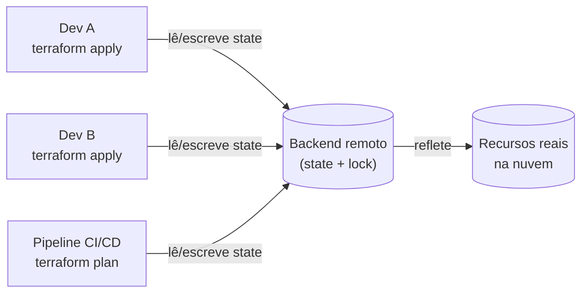
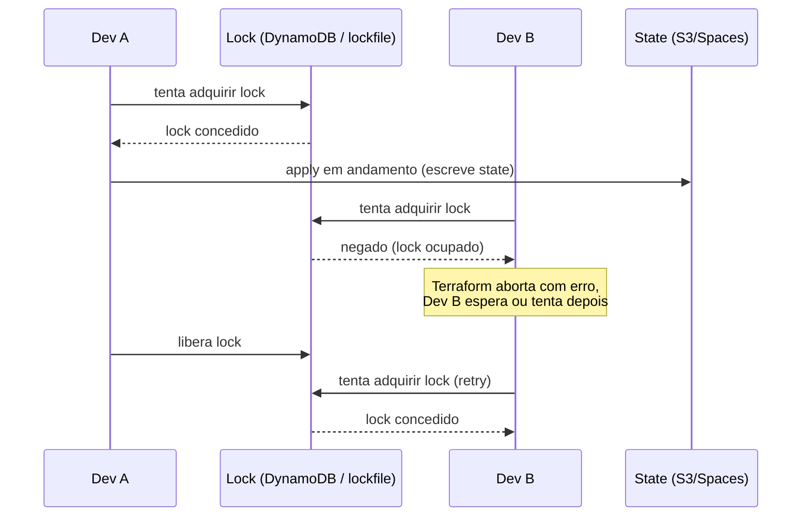

> [!abstract] TL;DR
> O state é o mapa que o Terraform mantém entre o seu código e o que existe de verdade na nuvem — sem ele, o Terraform não sabe distinguir "criar" de "atualizar" de "já existe". Guardá-lo local é uma bomba-relógio para qualquer time com mais de uma pessoa: dois `apply` simultâneos corrompem o mapa, e o arquivo carrega segredos em texto puro. A solução é um backend remoto com locking — S3+DynamoDB (ou S3 com lock nativo) na AWS, Spaces (S3-compatível) na DigitalOcean, ou Terraform Cloud gerenciado — que centraliza o state, trava contra concorrência e guarda histórico.

## O problema: como o Terraform sabe o que já existe?

Imagine que você escreveu um `.tf` descrevendo uma instância EC2. Você roda `terraform apply`, a instância nasce. Uma semana depois você muda um parâmetro — digamos, o tamanho do disco — e roda `apply` de novo. Como o Terraform sabe que não deve criar uma *segunda* instância, mas sim *atualizar* a que já existe?

Ele não adivinha, e não confia cegamente no que está na nuvem. Ele consulta um arquivo que mantém desde o primeiro `apply`: o **state**. É um JSON — por padrão `terraform.tfstate` — que mapeia cada recurso do seu código para o ID real do objeto na nuvem (o `i-0abc123...` daquela instância, o ARN daquele bucket, e assim por diante), junto com todos os atributos que o provider retornou na última sincronização.

Sem o state, o Terraform teria que "descobrir" toda a infraestrutura existente do zero a cada `plan` — varrendo a conta inteira, tentando adivinhar quais dos milhares de recursos pertencem a qual bloco do seu código. Isso não escalaria e seria ambíguo (dois buckets com o mesmo nome de tag, por exemplo). O state resolve isso sendo a fonte de verdade sobre *o que o Terraform gerencia* e *qual é o ID de cada coisa*.

Isso já é o suficiente para entender por que o state é crítico. Agora vem o motivo pelo qual ele é também perigoso.

## O state é um mapa — e um mapa pode mentir ou vazar

Duas propriedades do state causam a maior parte dos incidentes:

1. **O state contém segredos em texto puro.** Se você criou um banco RDS com senha mestra gerada pelo Terraform, essa senha está no state, sem criptografia própria do arquivo. O mesmo vale para chaves de API, tokens, certificados — qualquer atributo sensível que um `resource` produza ou receba vira um campo legível no JSON.
2. **O state pode dessincronizar da realidade.** Se alguém altera um recurso pelo console (ex.: aumenta manualmente um disco EBS), o state do Terraform não sabe disso até você rodar `plan` de novo — e nesse meio-tempo, um `apply` baseado no state desatualizado pode tentar "corrigir" a mudança manual, revertendo-a sem avisar.

Por isso a primeira regra prática do Terraform é: **nunca commite o `.tfstate` no Git**. Um arquivo de state em um repositório público é, na prática, um dump de credenciais. E mesmo em repositório privado, o Git não faz locking — duas pessoas rodando `apply` a partir de states divergentes é a receita para o próximo problema.

## Local state: funciona sozinho, quebra em equipe

Por padrão, sem nenhuma configuração de backend, o Terraform grava `terraform.tfstate` no diretório local. Isso é perfeitamente razoável para experimentar, para um projeto pessoal, ou para o primeiro `terraform apply` de um tutorial. O problema aparece assim que uma segunda pessoa entra em cena:

- Ela não tem o arquivo — como ela sabe o que já foi criado? Se ela rodar `apply` do zero, o Terraform vai tentar recriar tudo, gerando erros de "recurso já existe" ou, pior, duplicando infraestrutura.
- Mesmo compartilhando o arquivo manualmente (por e-mail, por um drive), não há nada impedindo duas pessoas de rodar `apply` ao mesmo tempo, cada uma com sua cópia local.
- Não há histórico de versões do state — se ele corrompe, não há como voltar.

State local é a mesma armadilha que trabalhar em uma planilha `.xlsx` salva no seu Desktop e mandar por e-mail para o time atualizar "a versão mais recente". Funciona até duas pessoas mexerem ao mesmo tempo — e então alguém perde trabalho.

## Remote state: o backend como fonte única de verdade

A solução é mover o state para um **backend remoto**: um armazenamento compartilhado, acessível por todo o time (e pela pipeline de CI/CD), que centraliza a leitura e escrita do arquivo. O bloco `backend` dentro de `terraform { }` diz ao Terraform onde esse state mora.



Isso resolve três problemas de uma vez: todo mundo enxerga o mesmo estado, o backend guarda o histórico (versionamento do bucket), e — se o backend suportar — as escritas ficam protegidas por um lock, o que nos leva ao próximo ponto.

## State locking: por que dois `apply` ao mesmo tempo corrompem tudo

Pense no state como um documento editado em conjunto sem controle de versão colaborativo (nada de "várias pessoas editando ao mesmo tempo" como em um editor moderno). Se Dev A e Dev B rodam `apply` no mesmo instante:

1. Ambos leem o state na versão N.
2. Dev A cria um recurso novo, escreve o state como versão N+1.
3. Dev B, sem saber que A já escreveu, também baseia suas mudanças na versão N e sobrescreve com sua própria versão N+1 — **apagando a mudança de A do arquivo**, mesmo que o recurso de A continue existindo na nuvem.

Resultado: o state não reflete mais nem o código de A nem a realidade. O próximo `plan` vai ver um recurso "órfão" — existe na nuvem, mas não no state — e pode tentar recriá-lo, causando erro de nome duplicado, ou pior, gerenciar dois objetos como se fossem um só.

**Locking** resolve isso: antes de qualquer operação que escreva o state (`apply`, e por padrão também `plan`), o Terraform tenta adquirir um lock exclusivo no backend. Se outra operação já segura o lock, a nova espera ou falha com uma mensagem clara — nunca escreve por cima.



> [!tip] Assista: Terraform backend using S3 and Dynamodb with state locking
> **Canal:** Tech with Ajit | **Duração:** ~10min | **Idioma:** EN
>
> Uma demo curta que percorre exatamente a sequência que a nota descreve: por que externalizar o state não basta, e por que o lock é o que impede dois `apply` simultâneos de se pisarem. Trecho de destaque [02:19]: *"locking is required if supported by your back end terraform will lock your state for all operations that could write state"*
>
> 🎬 [Assistir no YouTube](https://www.youtube.com/watch?v=q5-zsBY90j8)

## Lente dupla: backend S3 (AWS) e Spaces (DigitalOcean)

Aqui é onde a dupla lente rende bem, porque os dois lados usam literalmente o mesmo protocolo — a API S3.

### AWS: backend `s3`, com bucket + lock

O backend nativo `s3` do Terraform guarda o arquivo de state como um objeto num bucket S3. Historicamente, o locking era feito com uma tabela **DynamoDB** dedicada (chave de partição `LockID`) — é o padrão que você vai encontrar na maioria dos tutoriais e configurações em produção hoje. Mas a documentação oficial já avisa: o locking baseado em DynamoDB está **deprecated e será removido em uma versão futura** — a alternativa moderna é `use_lockfile = true`, que faz o locking usando o próprio bucket S3 (sem precisar de uma tabela separada).

> [!info] Verificado em 2026-07-24 na documentação oficial (`developer.hashicorp.com/terraform/language/backend/s3`): DynamoDB locking está marcado como deprecated; `use_lockfile` é o mecanismo recomendado atualmente. Como muitos ambientes em produção ainda usam DynamoDB (foi o único caminho por anos), espere ver as duas formas convivendo por um bom tempo — mas para configuração nova, prefira `use_lockfile`.

```hcl
# Backend S3 com locking nativo (recomendado, Terraform recente)
terraform {
  backend "s3" {
    bucket       = "minha-empresa-terraform-state"
    key          = "projetos/api/terraform.tfstate"
    region       = "us-east-1"
    encrypt      = true
    use_lockfile = true
  }
}
```

```hcl
# Backend S3 com locking via DynamoDB (padrão legado, ainda comum)
terraform {
  backend "s3" {
    bucket         = "minha-empresa-terraform-state"
    key            = "projetos/api/terraform.tfstate"
    region         = "us-east-1"
    encrypt        = true
    dynamodb_table = "terraform-locks"  # tabela com chave de partição "LockID"
  }
}
```

Boas práticas que a própria HashiCorp recomenda: `encrypt = true` (ou uma chave KMS via `kms_key_id`) para criptografar o objeto no bucket, e **versionamento do bucket ativado** — assim, se o state for sobrescrito ou apagado por acidente, dá para recuperar uma versão anterior (veja [[03-Dominios/Tecnologia/Cloud/08 - Armazenamento (object, block e file)/index|Armazenamento]] para o mecanismo de versioning do S3).

### DigitalOcean: Spaces como backend S3-compatível

A DO não tem um backend Terraform próprio para state — e não precisa ter. O **Spaces** implementa a API S3 (a própria documentação da DO afirma que "the Spaces API is compatible with the AWS S3 API"), então o mesmo backend `s3` do Terraform funciona apontando para o endpoint da DO, sem trocar de ferramenta:

```hcl
# Backend S3 apontando para DigitalOcean Spaces
terraform {
  backend "s3" {
    bucket                      = "meu-space-terraform-state"
    key                         = "projetos/api/terraform.tfstate"
    region                      = "us-east-1"  # obrigatório mesmo fora da AWS
    endpoint                    = "https://nyc3.digitaloceanspaces.com"
    skip_credentials_validation = true
    skip_metadata_api_check     = true
    skip_region_validation      = true
  }
}
```

A honestidade aqui: Spaces **não tem equivalente ao DynamoDB** para locking dedicado, e — até onde a documentação cobre — não há confirmação pública de que o `use_lockfile` nativo (que depende de operações condicionais específicas do S3) funcione de forma equivalente em Spaces. Times que usam Spaces como backend frequentemente aceitam o risco de rodar sem lock automático em setups pequenos, ou migram o locking para uma solução externa. Se colaboração com múltiplas pessoas é séria, vale considerar Terraform Cloud como controlador de lock independente do provedor de storage.

### Terraform Cloud: o backend gerenciado

Uma terceira via, que dispensa você de operar bucket e lock: o **Terraform Cloud** (produto SaaS da HashiCorp) guarda o state, faz locking automaticamente, versiona cada mudança, e ainda roda `plan`/`apply` remotamente — com um histórico visual de cada execução. É a opção que menos exige de infraestrutura própria, ao custo de depender de um serviço de terceiros (a HashiCorp) e de um plano pago acima de um certo volume de uso.

| Aspecto | Backend S3 (AWS) | Spaces (DO) | Terraform Cloud |
|---|---|---|---|
| Armazenamento do state | Bucket S3 | Bucket Spaces (S3-compatível) | Gerenciado pela HashiCorp |
| Locking nativo | DynamoDB (deprecated) ou `use_lockfile` | Sem garantia documentada | Automático |
| Versionamento do state | Via versioning do bucket | Via versioning do bucket | Automático, com UI |
| Execução remota de `apply` | Não (roda onde você rodar) | Não | Sim (opcional) |
| Custo extra | Bucket + tabela (baratos) | Bucket (barato) | Grátis até certo limite, depois pago |

## Colaboração além do lock: consumindo o state de outro projeto

Locking resolve a concorrência dentro de *um* projeto Terraform. Mas times raramente têm um único `.tf` gigante para a empresa inteira — o normal é dividir por camada (rede, banco de dados, aplicação) ou por time, cada um com seu próprio state. Isso levanta uma pergunta prática: como o projeto da "aplicação" descobre o ID da VPC que o projeto de "rede" já criou?

A resposta é a data source `terraform_remote_state`, que lê o state (já finalizado) de outro projeto como entrada somente-leitura:

```hcl
# No projeto "aplicacao", lendo outputs do projeto "rede"
data "terraform_remote_state" "rede" {
  backend = "s3"
  config = {
    bucket = "minha-empresa-terraform-state"
    key    = "projetos/rede/terraform.tfstate"
    region = "us-east-1"
  }
}

resource "aws_instance" "web" {
  subnet_id = data.terraform_remote_state.rede.outputs.subnet_publica_id
}
```

Para isso funcionar, o projeto "rede" precisa ter declarado um `output` correspondente (`subnet_publica_id`) — o mecanismo é, na prática, um contrato: um projeto publica outputs, o outro consome. É essa divisão em states separados e conectados por outputs que permite times diferentes trabalharem em paralelo sem pisar no bloco de código um do outro — cada um trava e versiona só o seu próprio pedaço.

## Drift: quando a realidade se desvia do state

**Drift** é quando alguém (ou algum processo) muda um recurso fora do Terraform — pelo console, por um script, por outra ferramenta — e o state fica desatualizado em relação à nuvem real. O jeito de detectar isso é rodar `terraform plan`: por padrão, antes de calcular o diff, o Terraform faz uma chamada de "refresh" contra o provider, comparando o que está no state com o que existe de fato, e mostra qualquer divergência como parte do plano.

```
$ terraform plan

  # aws_instance.web has been changed outside of Terraform since the
  # last "terraform apply":
  #   resource "aws_instance" "web" was updated
  ~ resource "aws_instance" "web" {
        id            = "i-0abc123def456"
      ~ instance_type = "t3.micro" -> "t3.small"
        # (12 unchanged attributes hidden)
    }

Note: Objects have changed outside of Terraform
```

Esse aviso é o Terraform dizendo "alguém mexeu aqui fora do meu radar". A partir daí você decide: aceitar a mudança manual e trazer o código para refletir o novo estado, ou rodar `apply` para forçar o recurso de volta ao que o código descreve (revertendo a mudança manual). Nenhuma das duas é automática — o Terraform só relata, quem decide é você.

## Trazendo o que já existe: `terraform import`

Nem toda infraestrutura nasce pelo Terraform. É comum herdar recursos criados manualmente no console — um bucket antigo, uma VPC configurada há anos — e querer trazê-los para dentro da gestão do Terraform sem recriá-los do zero (o que destruiria e recriaria o recurso, com toda a interrupção que isso implica).

`terraform import` faz exatamente isso: associa um recurso já existente na nuvem a um endereço no seu state, sem tocar no recurso real.

```bash
# Sintaxe: terraform import <endereço_no_código> <ID_do_recurso_real>
terraform import aws_s3_bucket.legado minha-empresa-bucket-legado
```

Um ponto que costuma surpreender iniciantes: **`import` só popula o state — ele não escreve o bloco `resource` no seu `.tf`.** Você precisa já ter (ou escrever manualmente logo depois) um bloco de recurso correspondente no código; senão, o próximo `plan` vai ver "recurso no state mas não no código" e propor destruí-lo. A versão mais recente do Terraform introduziu os **`import` blocks** (declarativos, dentro do próprio `.tf`, rodados via `plan`/`apply` normal) como evolução recomendada sobre o comando imperativo — mas o comando `terraform import` continua funcionando e é o que você mais vai ver em bases de código existentes.

> [!info] Verificado em 2026-07-24: `import` blocks são a via recomendada pela documentação oficial atual (`developer.hashicorp.com/terraform/cli/commands/import`), mas o comando `terraform import` segue suportado — não foi removido, apenas superado em recomendação.

> [!tip] Assista: How to Use Terraform Import: CLI and Import Block Explained
> **Canal:** Spacelift | **Duração:** ~8min | **Idioma:** EN
>
> Reforça exatamente o ponto que mais engana iniciante: `import` só atualiza o state, não escreve o `resource` no código. O vídeo também mostra o caso de usar `import` para reorganizar um state monolítico em vários menores. Trecho de destaque [00:38]: *"Terraform import lets you bring an existing real-world [resource] under Terraform's control"*
>
> 🎬 [Assistir no YouTube](https://www.youtube.com/watch?v=qkWUuB8uMN4)

## Reorganizando o state: `terraform state mv`

Às vezes o recurso não mudou na nuvem, mas você quer reorganizar o *código* — renomear um `resource`, mover algo para dentro de um módulo. Se você só mudar o nome no `.tf` e rodar `apply`, o Terraform vai interpretar isso como "o recurso antigo sumiu, crie um novo com o nome novo" — destruindo e recriando algo que na prática não mudou.

`terraform state mv` resolve isso ajustando o *endereço* dentro do state sem tocar no recurso real:

```bash
# Renomeando um recurso no state (sem destruir/recriar na nuvem)
terraform state mv aws_instance.web aws_instance.servidor_principal

# Movendo um recurso para dentro de um módulo
terraform state mv aws_instance.web module.compute.aws_instance.web
```

É uma operação cirúrgica no arquivo de state — vale sempre fazer backup do state (ou confiar no versionamento do backend) antes de mexer nele diretamente.

## Workspaces: múltiplos states, uma configuração

Um mesmo `.tf` pode gerenciar mais de um ambiente sem duplicar código, usando **workspaces**: cada workspace tem seu próprio arquivo de state isolado, dentro do mesmo backend, referenciável no código via `terraform.workspace`.

```bash
terraform workspace new staging
terraform workspace new producao
terraform workspace select staging
terraform apply   # aplica usando o state de "staging"
```

```hcl
resource "aws_instance" "web" {
  instance_type = terraform.workspace == "producao" ? "t3.large" : "t3.micro"
}
```

Isso parece a solução perfeita para "um código, vários ambientes" — mas a própria documentação da HashiCorp é direta sobre o limite: **workspaces não são apropriados para decomposição de sistemas nem para deployments que exigem credenciais e controles de acesso separados**. Se staging e produção precisam de contas AWS diferentes, políticas de IAM diferentes, ou times diferentes com acesso restrito, workspaces misturam tudo sob a mesma configuração e as mesmas credenciais — não é isolamento de segurança, é só isolamento de arquivo de state. Para esse tipo de separação mais forte, o padrão real é ter diretórios (ou repositórios) de configuração distintos por ambiente — assunto que a nota sobre módulos e ambientes do próprio galho retoma com mais profundidade.

> [!warning] Armadilhas comuns
> - **Commitar `.tfstate` no Git.** Mesmo em repositório privado: sem locking, sem histórico de acesso, e com segredos em texto puro expostos a qualquer um com acesso ao repo.
> - **Trocar de backend sem migrar o state.** Editar o bloco `backend` e rodar `apply` direto pode fazer o Terraform achar que não há state nenhum e tentar recriar tudo. Sempre rode `terraform init -migrate-state` ao mudar de backend.
> - **Confiar em workspaces para isolar produção de staging com credenciais diferentes.** Como visto acima, não é esse o papel deles — o risco é aplicar em produção sem perceber, porque as credenciais são as mesmas.
> - **Editar o `.tfstate` manualmente no editor de texto.** É JSON, mas é JSON com estrutura interna sensível (contadores de dependência, hashes). Use sempre os comandos `terraform state ...` (`mv`, `rm`, `list`, `show`) em vez de editar o arquivo à mão.
> - **Esquecer o lock ao rodar Terraform em CI/CD paralelo.** Se dois pipelines (ex.: um de PR e um de merge) rodam `apply` na mesma janela, o locking do backend é a única coisa impedindo a corrupção — confirme que ele está configurado antes de automatizar.

## O que vem a seguir

Com o state seguro num backend remoto e travado contra concorrência, a próxima fronteira é: e quando a equipe prefere não usar Terraform para tudo, ou quando o provedor cloud oferece uma ferramenta nativa mais integrada ao seu ecossistema? A próxima nota do galho olha para o IaC nativo da nuvem — CloudFormation e CDK na AWS — comparando com a abordagem multi-cloud do Terraform vista até aqui.

## Fontes

- HashiCorp — [Backend Type: s3](https://developer.hashicorp.com/terraform/language/backend/s3)
- HashiCorp — [State Workspaces](https://developer.hashicorp.com/terraform/language/state/workspaces)
- HashiCorp — [Command: import](https://developer.hashicorp.com/terraform/cli/commands/import)
- HashiCorp — [State: Sensitive Data](https://developer.hashicorp.com/terraform/language/state/sensitive-data)
- DigitalOcean — [Using AWS SDKs and Tools with Spaces](https://docs.digitalocean.com/products/spaces/reference/aws-sdks/)

