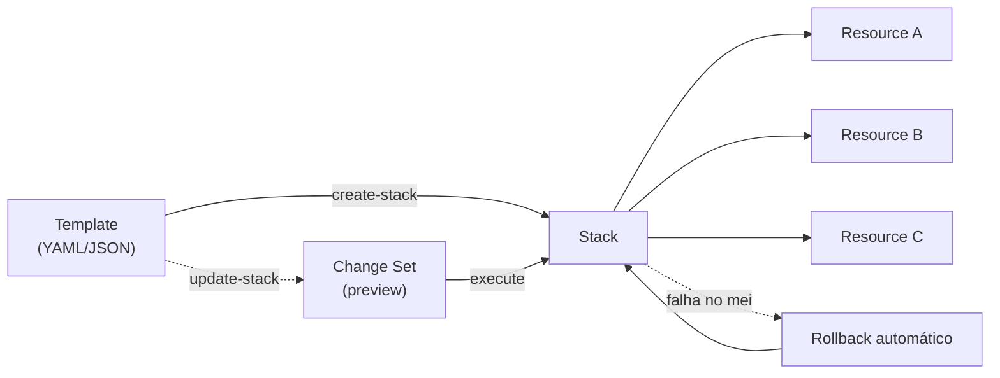
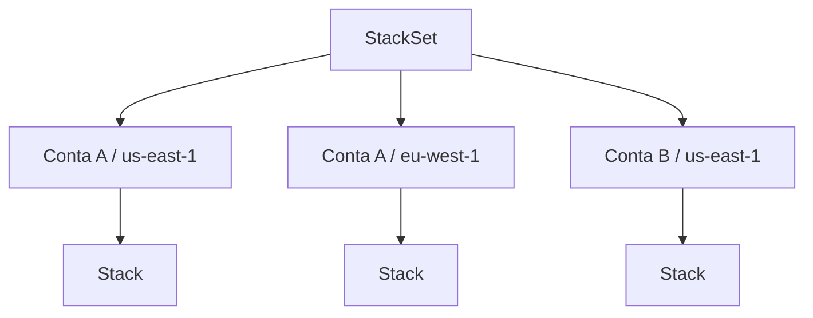

> [!abstract] TL;DR
> CloudFormation é o IaC nativo da AWS: você escreve um template (YAML/JSON) descrevendo recursos, a AWS cria uma *stack* e gerencia o ciclo de vida inteiro — incluindo rollback automático se algo falhar no meio do caminho. Não existe state file pra perder: o estado vive dentro da própria AWS. CDK e SAM são camadas em cima disso — CDK deixa você escrever a infra numa linguagem de programação de verdade (TypeScript, Python...) que *compila* pra CloudFormation; SAM é CloudFormation com açúcar sintático pra serverless. O trade-off contra o Terraform é sempre o mesmo: integração mais profunda e sem state pra gerenciar, contra portabilidade zero — CloudFormation só fala AWS. A DigitalOcean não tem equivalente nativo rico; o caminho lá é Terraform mesmo.

## O problema: você já tem o desenho, falta o jeito de construir

Imagine que você fechou o design de uma arquitetura no Bloco 3 desta trilha: uma VPC com sub-redes públicas e privadas, um Auto Scaling Group atrás de um load balancer, um banco RDS, um punhado de roles IAM amarrando tudo. No console, isso são dezenas de cliques, em uma ordem que importa (a sub-rede precisa existir antes da instância, a role precisa existir antes de anexar ao ASG). Fazer isso à mão uma vez já é tedioso. Fazer de novo em outra região pra disaster recovery, ou reproduzir em staging antes de ir pra produção — aí vira insustentável, e cada repetição manual é uma chance de esquecer um detalhe.

A nota anterior desta trilha, sobre [[03-Dominios/Tecnologia/Cloud/16 - Infrastructure as Code/02 - Terraform a fundo|Terraform a fundo]], resolveu isso com uma ferramenta multi-cloud que fala com a AWS através de um provider e mantém seu próprio arquivo de state. Mas a AWS tem uma resposta nativa pro mesmo problema, e ela é anterior ao Terraform: chama-se CloudFormation, e existe desde 2011. Entender como ela pensa — e onde ela diverge do modelo Terraform — é o que esta nota faz.

## CloudFormation: templates, stacks e o motor de orquestração

A ideia central é simples: você escreve um **template** (um arquivo YAML ou JSON) descrevendo os recursos que quer, e a AWS usa esse template pra criar uma **stack** — uma unidade lógica que agrupa todos os recursos provisionados a partir dele. A stack não é uma metáfora solta: é uma entidade real na conta AWS, visível no console, com um nome, um status e um histórico de eventos.

```yaml
AWSTemplateFormatVersion: "2010-09-09"
Description: Bucket S3 + role IAM básica

Parameters:
  BucketNamePrefix:
    Type: String
    Default: meu-projeto

Resources:
  MeuBucket:
    Type: AWS::S3::Bucket
    Properties:
      BucketName: !Sub "${BucketNamePrefix}-dados-${AWS::AccountId}"
      VersioningConfiguration:
        Status: Enabled

  MinhaRole:
    Type: AWS::IAM::Role
    Properties:
      AssumeRolePolicyDocument:
        Version: "2012-10-17"
        Statement:
          - Effect: Allow
            Principal:
              Service: lambda.amazonaws.com
            Action: sts:AssumeRole
      Policies:
        - PolicyName: AcessoAoBucket
          PolicyDocument:
            Version: "2012-10-17"
            Statement:
              - Effect: Allow
                Action: [s3:GetObject, s3:PutObject]
                Resource: !GetAtt MeuBucket.Arn

Outputs:
  NomeDoBucket:
    Value: !Ref MeuBucket
  ArnDaRole:
    Value: !GetAtt MinhaRole.Arn
```

Repare nas peças. `Resources` é obrigatório — é a lista do que existe. `Parameters` são valores de entrada (o equivalente às `variable` do Terraform), com tipo, default e às vezes validação. `Outputs` exporta valores pra fora da stack — outras stacks podem importá-los, ou uma pipeline de CI/CD pode ler o ARN gerado. `Mappings` (não usado no exemplo) é uma tabela de lookup estática, útil pra mapear região → AMI, por exemplo.

As **intrinsic functions** são o que dá dinamismo dentro do template: `!Ref` referencia outro recurso ou parâmetro (retorna o identificador físico — pra um bucket S3, o nome; pra uma VPC, o ID), `!GetAtt` busca um atributo específico do recurso (o ARN, o endpoint, o ID de uma sub-rede), `!Sub` interpola strings, `!Join` concatena listas. É a mesma necessidade que o Terraform resolve com interpolação `${}` e referências de recurso, só que expressa como funções YAML em vez de uma linguagem de expressões própria (HCL).



## Change sets: o "terraform plan" da AWS

Quando você atualiza um template de uma stack existente, você não quer que a AWS simplesmente aplique — quer ver o que vai mudar antes. É pra isso que existe o **change set**: você pede pra CloudFormation calcular o diff entre o template atual e o novo, e ela devolve uma lista de ações (`Add`, `Modify`, `Remove`) por recurso, incluindo se a modificação é in-place ou exige recriar o recurso do zero (`Replacement: True` — sinal de alerta, porque recriar um RDS, por exemplo, pode significar perda de dados se não houver snapshot).

```bash
# Cria o change set sem aplicar nada ainda
aws cloudformation create-change-set \
  --stack-name minha-stack \
  --template-body file://template.yaml \
  --change-set-name preview-2026-07-24

# Inspeciona o que vai mudar
aws cloudformation describe-change-set \
  --stack-name minha-stack \
  --change-set-name preview-2026-07-24

# Satisfeito? Aplica.
aws cloudformation execute-change-set \
  --stack-name minha-stack \
  --change-set-name preview-2026-07-24
```

Isso é conceitualmente idêntico ao `terraform plan` seguido de `terraform apply` — a diferença é que o change set fica registrado como um objeto na AWS (você pode ter vários change sets pendentes pra uma mesma stack, compará-los, descartar um sem aplicar), enquanto o plano do Terraform normalmente é efêmero, um artefato de arquivo local ou de pipeline.

> [!tip] Assista: AWS CloudFormation: Updating Stacks using Change Sets
> **Canal:** Code with Gauri | **Duração:** ~6min | **Idioma:** EN
>
> Uma demo curta no console: cria um change set adicionando uma instância EC2 a uma stack existente, revisa a ação `ADD` antes de executar, e mostra que os recursos já existentes ficam intocados. Bom complemento visual pro fluxo de linha de comando que a nota mostra. Trecho de destaque [04:42]: *"so basically we make use of chain sets to update your stack without touching the already created resources"*
>
> 🎬 [Assistir no YouTube](https://www.youtube.com/watch?v=lzRBioQ9DE4)

## Rollback automático e drift detection

Aqui está uma diferença de filosofia que vale destacar: por padrão, se um `update-stack` falha no meio — digamos, o quinto de dez recursos dá erro de permissão — a CloudFormation **reverte automaticamente** os recursos já modificados pro estado anterior. Você não fica com uma stack pela metade; ela volta pro último estado consistente conhecido. O Terraform não tem esse comportamento embutido: se um `apply` falha no meio, o state reflete exatamente o que foi aplicado até ali, e cabe a você rodar de novo ou reverter manualmente.

> [!info] Verificado em 2026-07-24 — rollback automático é o comportamento default do CloudFormation; pode ser desabilitado explicitamente com `--disable-rollback` no `update-stack` ou `create-stack`, geralmente pra fins de debug (deixar a stack no estado de falha pra inspecionar o que quebrou).

O outro lado da moeda é o **drift detection**. Se alguém editar um recurso manualmente pelo console — mudar uma tag, abrir uma porta de security group — a stack não sabe disso automaticamente. Drift detection é uma operação que você dispara (via console, CLI ou API) pra CloudFormation comparar o estado real dos recursos contra o que o template declara, e apontar exatamente quais propriedades divergiram. É o equivalente funcional de um `terraform plan` detectando mudança fora de banda, mas no CloudFormation é uma verificação sob demanda, não algo que roda a cada `update`.

## Nested stacks e StackSets: escalando horizontalmente e por conta

Templates crescem. Uma arquitetura de produção real facilmente passa de centenas de linhas, e o CloudFormation tem um limite de tamanho de template (atualmente 1MB direto no corpo da requisição, ou 51.200 bytes se enviado inline — acima disso, precisa referenciar um arquivo no S3). A resposta estrutural é a **nested stack**: um recurso do tipo `AWS::CloudFormation::Stack` que aponta pra *outro* template, tratado como uma sub-stack. Isso permite decompor uma arquitetura grande em módulos — rede, banco, aplicação — cada um com seu próprio template, orquestrados por um template "pai". É o análogo direto dos `module` do Terraform, só que cada nested stack vira uma stack própria e visível na AWS, não uma abstração que só existe no state do Terraform.

**StackSets** resolve um problema diferente: implantar a *mesma* stack em várias contas e regiões de uma vez, de forma centralizada — típico de organizações com dezenas de contas AWS (via AWS Organizations) que precisam de uma baseline consistente (um bucket de logs de auditoria, uma role de segurança, um guardrail) em todo lugar. Você define o template uma vez num StackSet e especifica os alvos (lista de contas × lista de regiões); a CloudFormation cuida de criar/atualizar/deletar a stack correspondente em cada combinação, com controle de quantas implantações rodam em paralelo e o que fazer se uma falhar.



O Terraform não tem um conceito nativo equivalente a StackSets — a forma usual de replicar infra multi-conta em Terraform é via workspaces, módulos parametrizados por conta/região, ou ferramentas de orquestração em cima (Terragrunt, Atlantis). É uma área onde a integração nativa da AWS com sua própria estrutura organizacional (Organizations, contas, regiões) dá ao CloudFormation uma vantagem que uma ferramenta multi-cloud não replica com a mesma facilidade.

## SAM: CloudFormation com açúcar pra serverless

Se você já passou pela nota sobre [[03-Dominios/Tecnologia/Cloud/11 - Serverless e FaaS — Lambda a fundo/index|Serverless e FaaS]], sabe que uma função Lambda raramente vive sozinha — vem com um role IAM, um trigger (API Gateway, EventBridge, SQS), variáveis de ambiente, talvez uma layer. Descrever tudo isso em CloudFormation puro é verboso: o tipo `AWS::Lambda::Function` sozinho já tem uma dúzia de propriedades, e ainda faltam o `AWS::IAM::Role`, o `AWS::ApiGateway::RestApi` com seus recursos e métodos aninhados.

O **AWS SAM** (Serverless Application Model) é uma extensão do CloudFormation — literalmente, um transform (`AWS::Serverless-2016-10-31`) que expande tipos simplificados como `AWS::Serverless::Function` em todo o CloudFormation equivalente por baixo dos panos.

```yaml
AWSTemplateFormatVersion: "2010-09-09"
Transform: AWS::Serverless-2016-10-31

Resources:
  MinhaFuncao:
    Type: AWS::Serverless::Function
    Properties:
      CodeUri: src/
      Handler: app.handler
      Runtime: python3.13
      Events:
        ApiEvent:
          Type: Api
          Properties:
            Path: /hello
            Method: get
```

Essas doze linhas, quando processadas pelo `sam deploy` (que por baixo chama CloudFormation), expandem pra um `AWS::Lambda::Function`, um role IAM com a policy mínima de execução, um `AWS::ApiGateway::RestApi` completo com o recurso `/hello`, o método `GET` e a integração Lambda proxy — dezenas de linhas de CloudFormation puro. O `sam build` e `sam local invoke` ainda dão um ciclo de desenvolvimento local (empacota dependências, simula o runtime Lambda) que o CloudFormation cru não oferece. SAM é, na prática, o ponto de entrada mais comum pra quem começa com serverless na AWS via IaC.

## CDK (e Pulumi): infraestrutura em linguagem de programação de verdade

Templates declarativos — sejam CloudFormation ou Terraform/HCL — têm um teto de expressividade. Quer criar 15 buckets com um nome ligeiramente diferente cada? Em HCL você usa `count` ou `for_each`; em CloudFormation puro, ou você escreve 15 blocos ou recorre a macros. Quer testar unitariamente que sua configuração de rede nunca abre a porta 22 pro mundo? Templates declarativos não têm um framework de testes nativo pra isso.

O **CDK** (Cloud Development Kit) ataca esse teto de um jeito radical: em vez de inventar mais uma linguagem de configuração, ele deixa você escrever a infraestrutura numa linguagem de programação completa — TypeScript, Python, Java, C#/.NET ou Go — com loops, condicionais, funções, classes e, principalmente, testes de verdade. O CDK não substitui o CloudFormation; ele **compila** pra CloudFormation. Você roda `cdk synth` e ele gera o template YAML/JSON que a CloudFormation de fato executa. `cdk diff` mostra o change set antes de aplicar; `cdk deploy` empacota isso tudo.

```typescript
import { Stack, StackProps } from "aws-cdk-lib";
import { Construct } from "constructs";
import * as s3 from "aws-cdk-lib/aws-s3";
import * as iam from "aws-cdk-lib/aws-iam";

export class ArmazenamentoStack extends Stack {
  constructor(scope: Construct, id: string, props?: StackProps) {
    super(scope, id, props);

    const ambientes = ["dev", "staging", "prod"];

    for (const ambiente of ambientes) {
      const bucket = new s3.Bucket(this, `Bucket-${ambiente}`, {
        bucketName: `meu-projeto-${ambiente}-dados`,
        versioned: ambiente === "prod",
        encryption: s3.BucketEncryption.S3_MANAGED,
      });

      new iam.Role(this, `Role-${ambiente}`, {
        assumedBy: new iam.ServicePrincipal("lambda.amazonaws.com"),
      }).addToPolicy(
        new iam.PolicyStatement({
          actions: ["s3:GetObject", "s3:PutObject"],
          resources: [bucket.arnForObjects("*")],
        })
      );
    }
  }
}
```

Esse `for` gerando três buckets com versionamento condicional é código comum, não uma feature especial da ferramenta — é a vantagem central do CDK. Outra é a biblioteca de **constructs**: em vez de declarar `AWS::Lambda::Function` + `AWS::IAM::Role` + `AWS::Logs::LogGroup` à mão, um construct de alto nível como `ApplicationLoadBalancedFargateService` (usado no exemplo oficial da documentação AWS) expande, sozinho, pra mais de 500 linhas de template e dezenas de recursos, com defaults seguros já embutidos — você declara a intenção, o construct decide os detalhes de plumbing.

O **Pulumi** ocupa o mesmo nicho conceitual — infra em linguagem de programação real, com suporte a TypeScript, Python, Go, C# e mais — mas é multi-cloud desde a origem (como o Terraform) e mantém seu próprio mecanismo de state (parecido com o Terraform, não com CloudFormation), em vez de compilar pra templates nativos de cada provedor. Se você já pensa em Terraform pra portabilidade, Pulumi é a versão "código de verdade" dessa mesma família; se você já está comprometido com AWS, CDK aproveita a integração nativa do CloudFormation (rollback automático, sem state pra gerenciar) com a ergonomia de uma linguagem real por cima.

> [!warning] CDK não elimina o CloudFormation, ele o esconde
> É tentador tratar o CDK como uma ferramenta totalmente separada, mas todo `cdk deploy` ainda cria/atualiza uma stack CloudFormation de verdade, sujeita aos mesmos limites (tamanho de template, rollback automático, change sets por baixo dos panos). Quando algo dá errado, o erro que você vê é do CloudFormation, muitas vezes com nomes de recursos gerados automaticamente e difíceis de rastrear até a linha do seu código-fonte. Debugar CDK exige saber ler CloudFormation.

> [!tip] Assista: AWS Cloud Development Kit (CDK) Explained in 5 mins
> **Canal:** Master AWS with Yan | **Duração:** ~6min | **Idioma:** EN
>
> Um resumo rápido do conceito central de constructs (L1/L2/L3) e de como eles se compilam pra baixo, até virar stack CloudFormation — a mesma hierarquia que a nota menciona ao explicar `ApplicationLoadBalancedFargateService`. Trecho de destaque [00:16]: *"at the heart of cdk are constructs which are the basic building blocks of an [AWS] cdk app"*
>
> 🎬 [Assistir no YouTube](https://www.youtube.com/watch?v=uo-sJN5xDB4)

## Quando vale cada um

| Ferramenta | Modelo | State | Linguagem | Escopo |
|---|---|---|---|---|
| CloudFormation | Declarativo | Nenhum (gerenciado pela AWS) | YAML/JSON | Só AWS |
| SAM | Declarativo + transform | Nenhum (gerenciado pela AWS) | YAML/JSON | Só AWS, foco serverless |
| CDK | Imperativo → compila p/ declarativo | Nenhum (via CloudFormation) | TS/Python/Java/C#/Go | Só AWS |
| Terraform | Declarativo | Arquivo de state (local/remoto) | HCL | Multi-cloud |
| Pulumi | Imperativo → mantém state próprio | Arquivo de state (via backend) | TS/Python/Go/C#/Java | Multi-cloud |

A pergunta que decide não é "qual ferramenta é melhor" — é "em que fronteira sua infra vive". Só AWS, equipe já confortável com CloudFormation ou querendo zero state pra gerenciar: CloudFormation ganha por integração (todo serviço novo da AWS tem suporte no dia do lançamento, o que nem sempre é verdade pro provider Terraform). Só AWS mas a equipe precisa de lógica real — loops, testes, geração condicional de recursos, compartilhamento de padrões como bibliotecas versionadas: CDK. Multi-cloud, ou só AWS mas a organização já padronizou em Terraform pra outras nuvens e quer uma ferramenta só: Terraform, como visto na nota anterior. Pulumi ocupa o cruzamento — multi-cloud com linguagem real — mas tem adoção bem menor que Terraform ou CDK, então o efeito rede (exemplos, providers de terceiros, gente que já sabe usar) pesa contra ele na prática.

## E a tabela de tradução (Azure, GCP)?

| Conceito | AWS | DigitalOcean | Azure | GCP |
|---|---|---|---|---|
| IaC declarativo nativo | CloudFormation | *(sem equivalente nativo)* | ARM Templates / Bicep | Cloud Deployment Manager |
| IaC em linguagem de programação | CDK | *(sem equivalente)* | Bicep (DSL, não linguagem geral) / Azure CDK (preview) | *(usa Terraform ou Pulumi)* |
| Framework serverless com IaC embutido | SAM | *(sem equivalente)* | Azure Functions Core Tools | Cloud Functions + `gcloud` deploy |
| Replicação multi-conta/projeto | StackSets | — | Azure Policy + Blueprints | Deployment Manager + Organization Policy |

## O que a DigitalOcean não tem — e por que isso não é um defeito

Vale ser honesto aqui, porque a tentação é procurar "o CloudFormation da DO" e não encontrar. A DigitalOcean **não tem** uma ferramenta de IaC nativa e declarativa própria com o alcance do CloudFormation. Ela tem uma API REST completa, um `doctl` (CLI) pra scriptar operações, e principalmente um **provider Terraform oficial** e bem mantido — que é, de longe, o caminho recomendado pra IaC na DO. Isso não é um sinal de imaturidade da plataforma: reflete o catálogo de serviços mais enxuto da DO (Droplets, Kubernetes gerenciado, Spaces, bancos gerenciados, load balancers — uma fração dos ~200+ serviços AWS) e um público que historicamente prioriza simplicidade sobre profundidade de automação corporativa multi-conta. Se a nota anterior sobre Terraform já cobriu como esse provider funciona na prática, aqui o ponto é só reforçar: pra DO, a "lente dupla" desta trilha colapsa em uma única resposta — Terraform.

## O que vem a seguir

CloudFormation e CDK resolvem *como descrever* a infraestrutura de um jeito que a AWS entende nativamente. Mas templates sozinhos — de qualquer ferramenta — viram bagunça rápido se não houver disciplina de organização: como estruturar módulos/constructs reutilizáveis, como separar dev de staging de produção sem duplicar tudo, que convenções evitam que o código de infra vire tão ilegível quanto um console clicado à mão. Essa é a fronteira que a próxima nota deste galho ataca — módulos, ambientes e boas práticas de IaC, olhando tanto pro mundo Terraform quanto pro CloudFormation/CDK visto aqui.

## Fontes

- [What is CloudFormation? — AWS Docs](https://docs.aws.amazon.com/AWSCloudFormation/latest/UserGuide/Welcome.html)
- [Change sets — AWS CloudFormation User Guide](https://docs.aws.amazon.com/AWSCloudFormation/latest/UserGuide/using-cfn-updating-stacks-changesets.html)
- [Detecting unmanaged configuration changes to stacks and resources — AWS CloudFormation User Guide](https://docs.aws.amazon.com/AWSCloudFormation/latest/UserGuide/detect-drift-stack.html)
- [Working with StackSets — AWS CloudFormation User Guide](https://docs.aws.amazon.com/AWSCloudFormation/latest/UserGuide/what-is-cfnstacksets.html)
- [Working with nested stacks — AWS CloudFormation User Guide](https://docs.aws.amazon.com/AWSCloudFormation/latest/UserGuide/cfn-nested-stacks.html)
- [AWS Serverless Application Model (SAM) — Developer Guide](https://docs.aws.amazon.com/serverless-application-model/latest/developerguide/what-is-sam.html)
- [What is the AWS CDK? — CDK v2 Developer Guide](https://docs.aws.amazon.com/cdk/v2/guide/home.html)
- [Pulumi vs Terraform — Pulumi Docs](https://www.pulumi.com/docs/iac/concepts/vs/terraform/)
- [DigitalOcean Terraform Provider — DigitalOcean Docs](https://docs.digitalocean.com/reference/terraform/)
- [Template anatomy — AWS CloudFormation User Guide](https://docs.aws.amazon.com/AWSCloudFormation/latest/UserGuide/template-anatomy.html)
