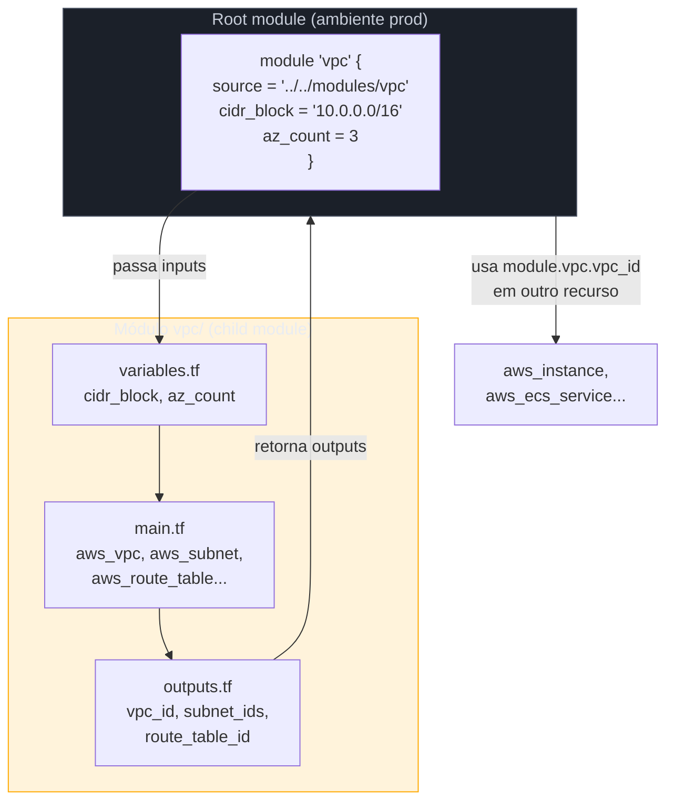
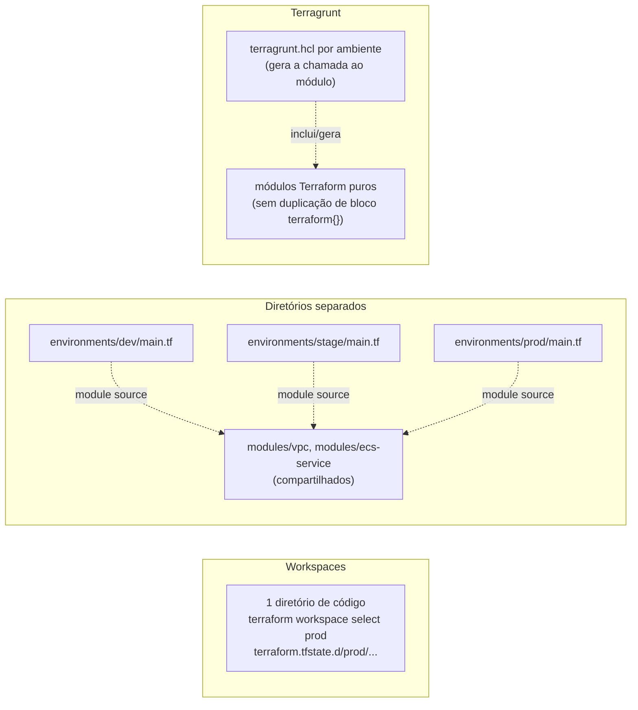
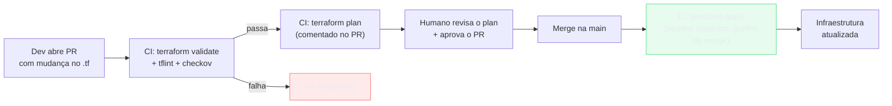

# Módulos, ambientes e boas práticas

> [!abstract] TL;DR
> A nota anterior deste galho resolveu "onde mora o state e como o time colabora sem pisar no pé um do outro" — o problema de coordenação em torno de um arquivo de estado compartilhado. Esta nota resolve o problema seguinte, que aparece assim que o `main.tf` passa de algumas dezenas de linhas: como organizar o *código* em si para que ele sobreviva ao crescimento. A resposta tem três peças que se encaixam. Primeiro, **módulos** — a unidade de reuso do Terraform, que encapsula um conjunto de recursos atrás de uma interface de inputs e outputs, do mesmo jeito que uma função encapsula lógica atrás de parâmetros e retorno. Segundo, uma **estratégia de múltiplos ambientes** — dev, stage, prod não podem compartilhar state (isso já foi resolvido na nota anterior), mas também não podem significar "copiar e colar o `.tf` inteiro três vezes"; a nota examina workspaces, diretórios separados e Terragrunt, e por que a segunda opção é o padrão de fato da indústria apesar de "workspace" parecer, pelo nome, feito sob medida para isso. Terceiro, uma bateria de práticas que separam um repositório de IaC amador de um profissional: segredos nunca hardcoded, `terraform plan` rodando em CI a cada PR, `terraform validate`/tflint/Checkov como portão de qualidade antes do apply. O fio condutor é sempre o mesmo: tratar o código de infraestrutura com o mesmo rigor de engenharia de software que já se aplica ao código de aplicação — porque, na prática, é exatamente isso que ele é.

## O problema: o capstone do bloco anterior tem trinta recursos, e agora?

Volte à arquitetura que fechou o bloco 3 desta trilha: uma VPC com subnets públicas e privadas, um load balancer, um cluster de containers, um banco gerenciado com réplica, um bucket com política de lifecycle, um punhado de security groups amarrando tudo. Escrita como um único `main.tf`, essa arquitetura passa fácil de trezentas, quatrocentas linhas de HCL. E isso é só o ambiente de produção. Multiplique por dev e stage — porque ninguém testa uma mudança de infraestrutura direto em produção — e a pergunta vira inevitável: esse arquivo gigante é para ser copiado três vezes, uma por ambiente, editando os valores manualmente em cada cópia?

Se a resposta for sim, o projeto herdou o pior vício do "clique no console, mas em HCL": toda mudança precisa ser replicada manualmente em três lugares, e a primeira vez que alguém esquecer de propagar uma correção de segurança do stage para o prod, os ambientes divergem silenciosamente — exatamente o problema que a nota 01 deste galho prometeu resolver ao trocar cliques por código. Copiar-colar não é Infrastructure as Code; é só *Infrastructure as Cópia*.

A saída tem duas frentes complementares. A primeira é **modularizar**: extrair o conjunto "VPC + subnets + rotas" para um pedaço de código reutilizável, chamado com parâmetros diferentes por ambiente, em vez de escrito três vezes. A segunda é **escolher uma estratégia de ambiente** que decida, de forma explícita e testável, como dev/stage/prod usam essas peças reutilizáveis sem compartilhar state (a regra de ouro da nota anterior) e sem duplicar texto.

> [!info] Fronteira com a nota 03 (State, backends e colaboração)
> Esta nota assume como resolvido que cada ambiente tem seu próprio backend/state — isso já foi coberto em [[03-Dominios/Tecnologia/Cloud/16 - Infrastructure as Code/03 - State, backends e colaboração|State, backends e colaboração]]. O que falta resolver aqui é como o *código-fonte* HCL evita duplicação entre esses ambientes, e como o *processo* em volta dele (CI, testes, segredos) sustenta um repositório que várias pessoas tocam ao longo de meses.

## O mecanismo: módulos como a unidade de reuso

Um módulo Terraform é, na essência, um diretório com arquivos `.tf` que você chama de outro lugar como se fosse um bloco de recurso — só que ele empacota vários recursos atrás de uma interface. Pense nele como uma função: recebe **input variables**, produz **outputs**, e esconde os detalhes de implementação de quem o chama.



O root module — o diretório de onde você roda `terraform apply` — chama o módulo `vpc` passando `cidr_block` e `az_count` como argumentos. O módulo, por dentro, cria a VPC, as subnets, as tabelas de rota; nada disso o root module precisa saber em detalhe. O que o root module recebe de volta são os **outputs** declarados em `outputs.tf` — `vpc_id`, a lista de `subnet_ids` — que ele reusa para criar o cluster ECS, o load balancer, o banco, todos dentro da VPC que o módulo acabou de montar. Um módulo bem desenhado tem uma interface pequena e estável: poucos inputs obrigatórios, defaults sensatos para o resto, outputs que cobrem o que qualquer consumidor razoável vai precisar.

### De onde vêm os módulos: local, Registry, Git

Um bloco `module` aponta para uma fonte via o argumento `source`, e a documentação oficial da HashiCorp lista três origens principais:

| Origem | Sintaxe de `source` | Quando usar |
|---|---|---|
| Caminho local | `"../modules/vpc"` ou `"./modules/vpc"` | Módulo interno ao mesmo repositório — o caso mais comum em times pequenos/médios |
| Terraform Registry (público) | `"terraform-aws-modules/vpc/aws"` | Módulos publicados pela comunidade ou por parceiros — HashiCorp mantém um catálogo hospedado em `registry.terraform.io` |
| Repositório Git | `"git::https://github.com/org/modulo.git//vpc"` | Módulo próprio versionado em repositório separado, compartilhado entre vários projetos |
| Registry privado (HCP Terraform / Terraform Enterprise) | `"app.terraform.io/org/vpc/aws"` | Times maiores que publicam módulos internos com governança |

Módulos do Registry público aceitam um argumento `version` com [constraint de versão](https://developer.hashicorp.com/terraform/language/expressions/version-constraints) — `version = "~> 5.0"`, por exemplo, trava numa major sem impedir patches. Isso importa porque um módulo de terceiros é, na prática, uma dependência externa: sem pin de versão, um `terraform init` roda um dia e traz uma versão nova do módulo com breaking changes, sem que ninguém tenha mudado uma linha do seu próprio código.

> [!info] Módulo próprio primeiro, Registry depois
> Para o par VPC/rede deste galho, o caminho mais comum é começar com um módulo local (`./modules/vpc`), específico da topologia do seu projeto, e só recorrer ao Registry público (como `terraform-aws-modules/vpc/aws`, um dos módulos mais usados do catálogo) quando o caso é genérico o bastante — uma VPC "padrão de mercado" — para justificar a dependência externa. Módulos de terceiros economizam código, mas também importam decisões de design que nem sempre casam com o que você precisa.

> [!tip] Assista: Terraform Modules – deploying reusable code
> **Canal:** DevOps Lab | **Duração:** ~12min | **Idioma:** EN
>
> Uma conversa em formato demo que responde direto a pergunta que costuma travar iniciante: "módulo é tipo uma função?" — e mostra ao vivo a estrutura de pastas `modules/<nome>/` com `main.tf`, `variables.tf` e `outputs.tf` sendo chamada de um root module. Trecho de destaque [00:55]: *"So a module, would you say is kind of like a function when you're programming?"*
>
> 🎬 [Assistir no YouTube](https://www.youtube.com/watch?v=lwsuhO8tBvQ)

## Múltiplos ambientes: workspaces, diretórios ou Terragrunt

Com módulos resolvendo "não repetir o *conteúdo*", falta resolver "não repetir a *chamada*" entre dev, stage e prod. Há três estratégias em uso na indústria, com trade-offs bem diferentes.



**Workspaces** são a opção que o nome sugere ser "feita para isso", e é justamente aí que mora a armadilha. A [documentação oficial da HashiCorp é explícita](https://developer.hashicorp.com/terraform/language/state/workspaces): workspaces múltiplos, dentro de um mesmo backend, "não são apropriados para decomposição de sistema nem para deployments que exigem credenciais separadas e controles de acesso distintos". Isso é exatamente o perfil de dev/stage/prod em qualquer organização séria — cada ambiente com sua própria conta AWS ou projeto, suas próprias credenciais, seu próprio raio de explosão em caso de erro. Workspaces continuam úteis para variações *dentro* de um mesmo ambiente/conta — por exemplo, um workspace por feature branch de teste — mas não são o mecanismo recomendado para a fronteira dev/stage/prod.

**Diretórios separados** — `environments/dev/`, `environments/stage/`, `environments/prod/`, cada um com seu próprio `main.tf`, seu próprio backend, suas próprias credenciais — são a resposta mais comum na prática. O DRY (Don't Repeat Yourself) não vem de "um diretório só"; vem dos **módulos compartilhados**: cada ambiente é um root module curto — pouco mais que uma lista de chamadas a `module "vpc" { source = "../../modules/vpc" ... }` com valores de input diferentes por ambiente. O `.tf` que efetivamente cria recursos mora nos módulos, escrito uma vez; o que muda entre ambientes é só a lista de parâmetros e, claro, o backend do state.

**Terragrunt** é uma ferramenta de terceiros (Gruntwork), fina, que fica em cima do Terraform para resolver a repetição residual que sobra mesmo com diretórios + módulos: o boilerplate de bloco `terraform { backend "s3" {...} }` e de `provider` que, do jeito "diretórios separados" puro, ainda se repete arquivo a arquivo. Terragrunt gera essa configuração a partir de um `terragrunt.hcl` central e injeta nos módulos Terraform, que continuam sendo Terraform puro por baixo. É uma camada de conveniência, não uma reescrita da ferramenta — vale a pena a partir do momento em que o número de ambientes/regiões cresce o bastante para o boilerplate doer de verdade; para um projeto com três ambientes num único provedor, diretórios separados costumam bastar.

| Estratégia | DRY vem de | Isolamento de credenciais | Curva de adoção |
|---|---|---|---|
| Workspaces | Um só código, `terraform.workspace` como variável | Fraco — mesmo backend/credenciais por padrão | Baixa, mas desaconselhado pela própria HashiCorp para isso |
| Diretórios + módulos | Módulos compartilhados, root module curto por ambiente | Forte — cada diretório aponta pro backend/conta que quiser | Baixa — é só organização de pastas |
| Terragrunt | Módulos Terraform + `terragrunt.hcl` gerando boilerplate | Forte, com menos repetição de bloco `backend`/`provider` | Média — ferramenta extra, pipeline extra |

> [!info] Diretórios + módulos é o "padrão de fato"
> Não existe um decreto oficial da HashiCorp dizendo "use diretórios separados". É uma convenção que emergiu porque resolve o problema real (isolamento de credenciais e blast radius) sem introduzir ferramenta extra. Terragrunt é uma escolha legítima e comum em times maiores/multi-região; workspaces para separar ambientes de produção é o padrão que a própria documentação pede para evitar.

## Segredos e variáveis sensíveis: nunca no código

Um `.tf` versionado no Git é, por definição, algo que qualquer pessoa com acesso ao repositório — e ao histórico de commits, para sempre — pode ler. Isso faz de "senha de banco hardcoded num `resource`" um dos erros mais caros que uma base de IaC pode cometer: mesmo que a linha seja removida depois, ela continua no histórico do Git, recuperável por qualquer `git log -p`.

A prática correta tem três camadas:

1. **Nunca literal no `.tf`.** Senhas, tokens de API, chaves privadas nunca aparecem como string literal em nenhum arquivo `.tf` versionado.
2. **`.tfvars` com segredo fica fora do Git.** Se um valor sensível precisa entrar via variável (`terraform.tfvars` ou `-var-file`), esse arquivo específico vai para o `.gitignore` — o padrão comum é nomear `secrets.auto.tfvars` ou similar e excluí-lo explicitamente, mantendo o `.tfvars.example` (sem valores reais) versionado como documentação de quais variáveis existem.
3. **Buscar em runtime de um cofre de segredos**, não passar por variável do Terraform de jeito nenhum. O padrão mais robusto é o provider Terraform ler o segredo de um serviço dedicado — AWS Secrets Manager ou SSM Parameter Store via `data "aws_secretsmanager_secret_version"`, ou HashiCorp Vault via o provider `vault` — no momento do `plan`/`apply`, e injetar o valor resolvido direto no recurso (por exemplo, a senha inicial de um RDS). O segredo nunca fica em texto plano em nenhum arquivo do repositório; ele mora no cofre, e o Terraform só sabe "onde buscar", não "qual é o valor".

```hcl
# ERRADO — nunca faça isto
resource "aws_db_instance" "prod" {
  # ...
  password = "S3nhaSuperSecreta123"  # fica no histórico do Git para sempre
}

# CERTO — busca em runtime do Secrets Manager
data "aws_secretsmanager_secret_version" "db_password" {
  secret_id = "prod/db/master-password"
}

resource "aws_db_instance" "prod" {
  # ...
  password = data.aws_secretsmanager_secret_version.db_password.secret_string
}
```

Vale notar que o próprio arquivo de **state** guarda esse valor resolvido em texto plano (a menos que o backend criptografe em repouso, como o S3 com SSE) — o que reforça por que a nota anterior insistiu tanto em backend remoto com criptografia e acesso restrito. Segredo fora do `.tf` resolve o problema do Git; não resolve sozinho o problema do state.

## CI para IaC: plan no PR, apply no merge

A mesma disciplina de GitOps que se aplica a código de aplicação se aplica a Terraform: nenhuma mudança de infraestrutura chega em produção sem passar por um pull request revisado, e o CI existe para dar visibilidade e um portão de qualidade antes do humano aprovar.



O ponto central é que **`plan` e `apply` rodam em pipelines diferentes, com gatilhos diferentes**. `terraform plan` roda automaticamente a cada push num PR aberto, e o resultado — a lista de recursos a criar/alterar/destruir — é publicado como comentário no próprio PR, para quem revisa ver exatamente o que vai acontecer antes de aprovar. `terraform apply` só roda depois do merge na branch principal, e normalmente exige uma aprovação adicional (um "gate" manual no pipeline) antes de tocar em produção — a mesma lógica de política de aprovação que qualquer deploy de aplicação segue.

> [!info] Fronteira com Operação — esta nota não é sobre CI/CD em geral
> O desenho de pipeline (estágios, gates de aprovação, rollback, deploy progressivo) é assunto do domínio [[03-Dominios/Engenharia/Operação/index|Operação]], que trata isso como disciplina própria de entrega. O que importa aqui é só a mecânica específica de Terraform: `plan` é seguro (só leitura de estado e diff, nunca muda nada), `apply` não é — e por isso o primeiro roda solto em qualquer PR, e o segundo fica atrás de um portão.

Um detalhe de segurança que passa despercebido: as credenciais que o CI usa para rodar `plan`/`apply` precisam de permissão para *tudo* que o Terraform gerencia — o que faz da runner de CI um alvo de alto valor. A prática recomendada é usar credenciais de curta duração (OIDC federado entre o provedor de CI e a AWS/DO, em vez de uma access key estática de longa duração guardada em segredo do repositório) e escopar essas credenciais ao mínimo necessário para aquele ambiente específico.

## Testing de IaC, de raspão

Antes de "plan" custar tempo de CI e atenção de revisor, três verificações rápidas pegam a maioria dos erros óbvios:

- **`terraform validate`** — checa sintaxe HCL e consistência interna (tipos de variável, referências que existem). Não fala com o provedor de nuvem; é rápido e roda em qualquer PR, sem credenciais.
- **tflint** — linter que pega erros específicos de provider que `validate` não vê: tipo de instância inválido, referência a um atributo que não existe mais numa versão de resource, convenções de nomenclatura.
- **Checkov** (ou uma ferramenta equivalente de policy-as-code, como tfsec/OPA) — escaneia o `.tf` procurando *misconfigurações de segurança e compliance* antes mesmo de aplicar: bucket S3 público, security group aberto para `0.0.0.0/0` numa porta sensível, storage sem criptografia. Segundo a documentação do projeto, o Checkov vem com centenas de políticas prontas e roda tanto localmente via CLI quanto integrado a pipelines de CI (GitHub Actions, GitLab CI, Jenkins) e a hooks de pre-commit.

Nenhuma dessas três ferramentas substitui o `terraform plan` — elas rodam *antes* dele, como um portão barato que filtra os erros óbvios sem gastar tempo de pipeline nem, no caso do Checkov, criar risco de aplicar algo inseguro por descuido.

## Boas práticas que separam um repo amador de um profissional

- **Least privilege no provider.** As credenciais que o Terraform usa (localmente ou em CI) devem ter só as permissões IAM necessárias para os recursos daquele ambiente específico — nunca uma credencial de administrador geral reaproveitada "porque é mais fácil".
- **Tagging consistente.** Todo recurso carrega tags como `Environment`, `Project`, `ManagedBy = "terraform"` — o que faz a diferença entre rastrear custo por projeto no console de billing e um mar de recursos sem dono aparente.
- **Naming convention previsível.** Um padrão como `<projeto>-<ambiente>-<recurso>` (`loja-prod-vpc`, `loja-stage-rds`) evita ambiguidade quando alguém olha o console fora do Terraform.
- **Remote state por ambiente**, nunca compartilhado — já resolvido na nota anterior, vale reforçar aqui como a base sobre a qual todo o resto se apoia.
- **Evitar recursos órfãos.** Recurso criado manualmente no console "só para testar rápido" e nunca importado para o state é dívida técnica silenciosa — ele não aparece em nenhum `plan`, ninguém sabe que existe, e continua sendo cobrado. `terraform import` existe exatamente para trazer esse tipo de recurso de volta para dentro do controle do código.

## Lente dupla: estrutura de projeto multi-ambiente

A mecânica de módulos e o provider Terraform da AWS já apareceram nas notas anteriores deste galho. Para múltiplos ambientes, a estrutura de diretórios muda pouco entre os dois provedores — a diferença real está em quais recursos cada módulo encapsula.

```
projeto/
├── modules/
│   ├── vpc/                 # AWS: aws_vpc, aws_subnet...
│   │                        # DO:  digitalocean_vpc
│   └── app-service/
│       ├── main.tf          # AWS: aws_ecs_service + aws_lb
│       │                    # DO:  digitalocean_app (App Platform)
│       ├── variables.tf
│       └── outputs.tf
└── environments/
    ├── dev/
    │   ├── main.tf           # chama module "vpc", module "app-service"
    │   └── backend.tf        # backend próprio de dev
    ├── stage/
    │   ├── main.tf
    │   └── backend.tf
    └── prod/
        ├── main.tf
        └── backend.tf
```

O provider Terraform oficial da DigitalOcean (`digitalocean/digitalocean`, publicado e mantido pela própria DigitalOcean no Registry) cobre o essencial do catálogo — Droplets, VPCs, Managed Databases, Spaces, e o App Platform — com o mesmo modelo de módulos, variáveis e outputs. A diferença de fundo é o *tamanho da superfície*: um módulo `vpc` na AWS normalmente encapsula VPC + subnets públicas/privadas + tabelas de rota + NAT gateway, porque a AWS expõe cada peça como recurso separado; o módulo equivalente na DO costuma ser bem mais curto, porque a `digitalocean_vpc` já entrega uma rede plana sem a mesma granularidade de sub-redes e rotas explícitas. A estratégia de ambientes (diretórios + módulos, segredos fora do `.tf`, CI com plan/apply separados) é idêntica nos dois — é prática de engenharia de software aplicada a HCL, não algo específico de provedor.

> [!info] Registry de módulos comunitários para DO
> O Terraform Registry público hospeda módulos de terceiros para DigitalOcean, mas o catálogo é ordens de magnitude menor que o da AWS — não há, por exemplo, um equivalente amplamente adotado ao `terraform-aws-modules`. Na prática, times em DO tendem a escrever seus próprios módulos locais em vez de depender do Registry comunitário. Verificado 2026-07-24; catálogos de módulo público mudam de tamanho com o tempo.

## Exemplo de código: módulo reutilizável e pipeline de CI

Um módulo mínimo de "serviço web" — um pouco simplificado, mas com a forma real de inputs/outputs:

```hcl
# modules/app-service/variables.tf
variable "environment" {
  description = "dev, stage ou prod"
  type        = string
}

variable "instance_count" {
  description = "Número de réplicas do serviço"
  type        = number
  default     = 2
}

variable "vpc_id" {
  description = "ID da VPC onde o serviço roda"
  type        = string
}

# modules/app-service/main.tf
resource "aws_ecs_service" "this" {
  name            = "loja-${var.environment}-service"
  desired_count   = var.instance_count
  # ... network_configuration usando var.vpc_id
}

# modules/app-service/outputs.tf
output "service_arn" {
  value = aws_ecs_service.this.id
}
```

Chamado de dois ambientes diferentes, sem duplicar a lógica interna:

```hcl
# environments/dev/main.tf
module "app_service" {
  source         = "../../modules/app-service"
  environment    = "dev"
  instance_count = 1
  vpc_id         = module.vpc.vpc_id
}

# environments/prod/main.tf
module "app_service" {
  source         = "../../modules/app-service"
  environment    = "prod"
  instance_count = 4
  vpc_id         = module.vpc.vpc_id
}
```

E o esqueleto de um workflow de CI (GitHub Actions) que separa `plan` de `apply`:

```yaml
# .github/workflows/terraform.yml
name: terraform
on:
  pull_request:
    paths: ["environments/**", "modules/**"]
  push:
    branches: [main]

jobs:
  plan:
    if: github.event_name == 'pull_request'
    runs-on: ubuntu-latest
    steps:
      - uses: actions/checkout@v4
      - run: terraform init
      - run: terraform validate
      - run: tflint
      - run: checkov -d . --quiet
      - run: terraform plan -out=tfplan   # comentado no PR por outra action

  apply:
    if: github.ref == 'refs/heads/main'
    environment: production   # gate de aprovação manual do GitHub
    runs-on: ubuntu-latest
    steps:
      - uses: actions/checkout@v4
      - run: terraform init
      - run: terraform apply -auto-approve tfplan
```

> [!warning] O plan comentado no PR fica desatualizado se alguém mais faz merge no meio
> Um `plan` gerado no início do PR reflete o state *naquele momento*. Se outra pessoa faz merge de uma mudança concorrente antes deste PR, o `plan` original já não corresponde mais ao state real — e um `apply` baseado nele pode fazer algo diferente do que foi revisado. Times maduros re-rodam `plan` automaticamente a cada push na branch principal e re-validam antes do `apply`; nunca confie num `plan` com mais de alguns commits de idade.

> [!warning] Módulo "genérico demais" também é uma armadilha
> A tentação, ao extrair o primeiro módulo, é generalizar demais — um módulo `vpc` com quarenta variáveis opcionais tentando cobrir todo uso possível. Isso troca duplicação de código por complexidade de interface, e a segunda costuma ser pior de manter. Um módulo bom tem escopo estreito e nome do que ele *faz*, não do que ele *poderia* fazer.

## O que vem a seguir

As quatro notas deste galho — por que IaC, Terraform a fundo, state/backends, e esta nota sobre módulos/ambientes/boas práticas — cobrem o essencial de uma base de código de infraestrutura mantível, junto com a alternativa nativa (CloudFormation/CDK) vista à parte. A próxima nota fecha o galho com um capstone: a decisão de qual ferramenta escolher em qual contexto, e como operar IaC no dia a dia de um time real — não mais "como escrever o código", mas "como o código de infraestrutura vive dentro de uma organização".

## Fontes

- HashiCorp — [Modules Overview](https://developer.hashicorp.com/terraform/language/modules)
- HashiCorp — [Module sources](https://developer.hashicorp.com/terraform/language/modules/sources)
- HashiCorp — [Version constraints](https://developer.hashicorp.com/terraform/language/expressions/version-constraints)
- HashiCorp — [Workspaces](https://developer.hashicorp.com/terraform/language/state/workspaces)
- HashiCorp — [Terraform Registry](https://registry.terraform.io/)
- Gruntwork — [Terragrunt documentation](https://terragrunt.gruntwork.io/docs/)
- Terraform Registry — [DigitalOcean Provider](https://registry.terraform.io/providers/digitalocean/digitalocean/latest/docs)
- Checkov — [What is Checkov](https://www.checkov.io/1.Welcome/What%20is%20Checkov.html)
- tflint — [GitHub repository](https://github.com/terraform-linters/tflint)
- AWS — [Secrets Manager: Terraform integration](https://docs.aws.amazon.com/secretsmanager/latest/userguide/integrating_terraform.html)
