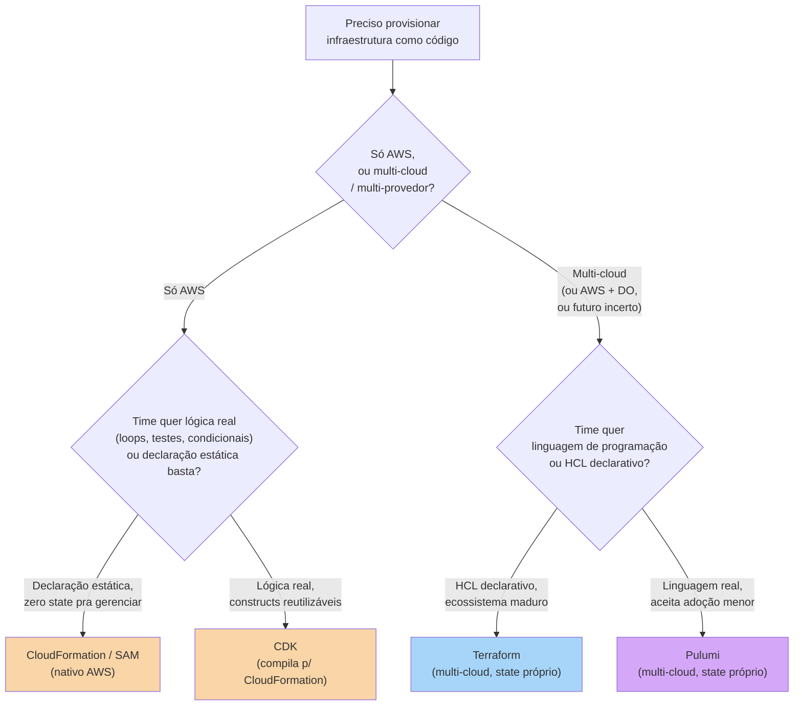
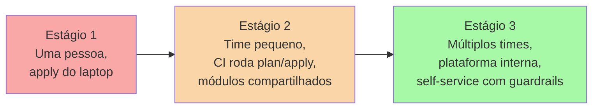
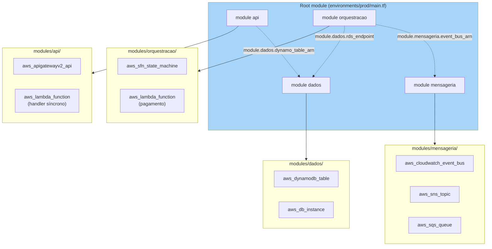
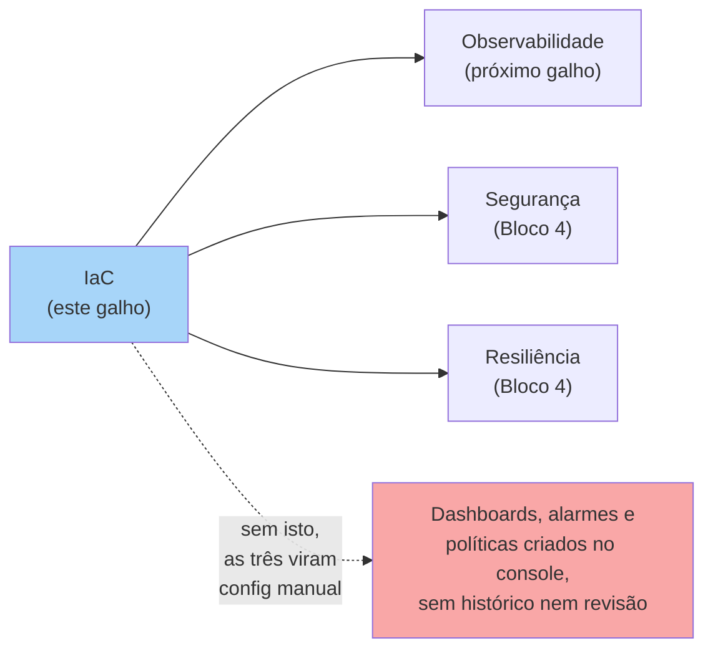

# Escolher e operar IaC

> [!abstract] TL;DR
> Este capstone fecha o galho de IaC e abre o Bloco 4 da trilha (operar, sustentar, governar). A pergunta que decide entre Terraform, CloudFormation/CDK e Pulumi não é "qual é melhor" — é uma árvore de três perguntas: sua infra é multi-cloud? seu time quer lógica de programação de verdade ou declaração estática? você aceita gerenciar um state file em troca de portabilidade? A nota aplica essas respostas de volta na arquitetura serverless que fechou o Bloco 3, esboçando os módulos Terraform que a materializariam, cataloga os anti-padrões mais caros de uma base de IaC (state local commitado, apply manual, mono-state gigante, secrets no código, drift ignorado), e argumenta por que IaC não é só conveniência — é a fundação sem a qual observabilidade, segurança e resiliência (o resto do Bloco 4) viram configuração manual e não-versionada, o mesmo problema que a nota 01 deste galho já descreveu para a infraestrutura em si.

## O problema: você já sabe escrever HCL, mas ainda não sabe qual ferramenta pegar — nem como operar isso em produção

As cinco notas anteriores deste galho resolveram, uma de cada vez, "como o Terraform funciona por dentro" ([[03-Dominios/Tecnologia/Cloud/16 - Infrastructure as Code/02 - Terraform a fundo|Terraform a fundo]]), "onde mora o state e como o time colabora" ([[03-Dominios/Tecnologia/Cloud/16 - Infrastructure as Code/03 - State, backends e colaboração|State, backends e colaboração]]), "o que a AWS oferece nativamente como alternativa" ([[03-Dominios/Tecnologia/Cloud/16 - Infrastructure as Code/04 - IaC nativo — CloudFormation e CDK|IaC nativo — CloudFormation e CDK]]) e "como organizar o código para que sobreviva ao crescimento" ([[03-Dominios/Tecnologia/Cloud/16 - Infrastructure as Code/05 - Módulos, ambientes e boas práticas|Módulos, ambientes e boas práticas]]). O que ainda falta é a pergunta que vem *antes* de todas essas — "qual ferramenta eu escolho pra este projeto, com este time, nesta organização?" — e a pergunta que vem *depois* — "como esse código de infraestrutura vive dentro de uma empresa real, com pessoas cometendo os mesmos erros que qualquer código de aplicação comete quando ninguém aplica disciplina?".

Volte à [[03-Dominios/Tecnologia/Cloud/15 - Arquiteturas serverless e event-driven/06 - Arquitetura serverless de referência (capstone do Bloco 3)|arquitetura serverless de referência]] que fechou o Bloco 3: API Gateway, uma função Lambda síncrona, Step Functions orquestrando um fluxo assíncrono, EventBridge roteando eventos de domínio, SNS fan-out para consumidores independentes, SQS como buffer, DynamoDB para o estado de alta escrita, RDS para o relacional. Isso não é mais um exercício de "um bucket e uma função" — é uma dúzia de tipos de recurso, amarrados por permissões IAM cirúrgicas e por dependências de criação que importam (a fila precisa existir antes da subscription, a role antes da função). Esse é o tamanho de sistema em que a escolha errada de ferramenta, ou a ausência de disciplina operacional em volta da ferramenta certa, custa caro — não em teoria, em incidente de produção.

Este capstone resolve as duas coisas: a escolha (árvore de decisão + comparação) e a operação (anti-padrões, e por que tudo isso é fundação do resto do Bloco 4).

## A árvore de decisão: três perguntas, não um ranking

Não existe "a melhor ferramenta de IaC" fora de contexto — existe a ferramenta certa para a combinação de portabilidade exigida, apetite do time por código imperativo, e quanto gerenciar um state file externo é aceitável.



A primeira pergunta é a que mais pesa, porque ela é estrutural, não estética: **sua infra vai viver só na AWS, ou você tem (ou vai ter) DigitalOcean, ou uma segunda nuvem, no horizonte?** Se a resposta é "só AWS, com convicção", CloudFormation e CDK entram no jogo — e trazem consigo uma vantagem que nenhuma ferramenta de terceiros replica: zero state para perder ou corromper, porque a AWS gerencia isso internamente na própria stack, e rollback automático se um `update-stack` falhar no meio (ambos cobertos na nota 04 deste galho). Se a resposta envolve mais de um provedor — e este é o caso de qualquer arquitetura desta trilha, dado o par AWS/DigitalOcean que a acompanha do início ao fim — a escolha converge para Terraform ou Pulumi.

A segunda pergunta, dentro de cada ramo, é **declarativo estático versus linguagem de programação de verdade**. HCL e CloudFormation YAML descrevem o resultado desejado sem lógica imperativa embutida — o que é uma vantagem (qualquer pessoa lê o arquivo e entende o que existe, sem precisar "rodar" o código mentalmente) até o momento em que você precisa de quinze buckets com nomes ligeiramente diferentes, uma condicional real, ou um teste unitário sobre a configuração. Nesse ponto, CDK (para quem já escolheu AWS) ou Pulumi (para quem já escolheu multi-cloud) trocam declaração por `for`, `if`, classes e frameworks de teste — ao custo de uma camada extra entre o que você escreve e o que de fato é aplicado.

> [!info] Onde a DO simplifica a árvore
> Para a DigitalOcean, o galho direito da árvore (CloudFormation/CDK) não existe — a nota 04 já documentou isso: a DO não tem ferramenta declarativa nativa com esse alcance. Isso significa que, sempre que a DigitalOcean está no jogo — sozinha ou ao lado da AWS — a árvore de decisão real colapsa para uma escolha única prática: **Terraform**, via o provider oficial `digitalocean/digitalocean`. Pulumi também tem um provider para DO, mas com adoção muito menor; na prática de mercado, "IaC na DO" e "Terraform na DO" são quase sinônimos.

## A tabela comparativa

| Critério | Terraform | CloudFormation / SAM | CDK | Pulumi |
|---|---|---|---|---|
| Modelo | Declarativo (HCL) | Declarativo (YAML/JSON) | Imperativo → compila p/ CFN | Imperativo → state próprio |
| State | Arquivo próprio (local/remoto) | Nenhum — gerenciado pela AWS | Nenhum — via CloudFormation | Arquivo próprio (via backend) |
| Linguagem | HCL (própria) | YAML/JSON + intrinsic functions | TS/Python/Java/C#/Go | TS/Python/Go/C#/Java |
| Lock-in de provedor | Nenhum — providers para dezenas de nuvens | Total — só AWS | Total — só AWS | Nenhum — providers multi-cloud |
| Curva de adoção | Média — linguagem própria, mas madura e documentada | Baixa para quem já conhece AWS | Média-alta — exige saber ler CFN por baixo | Média — reusa conhecimento de linguagem, mas ecossistema menor |
| Multi-cloud | Sim, provider por nuvem | Não | Não | Sim, provider por nuvem |
| Ecossistema / mercado | Maior do mercado — Registry público extenso, maioria das vagas pede Terraform | Grande dentro do universo AWS; suporte no dia 1 pra todo serviço novo | Cresce dentro do universo AWS | Bem menor — comunidade e exemplos escassos comparado a Terraform |

A linha que mais separa as duas famílias é "State": Terraform e Pulumi trazem consigo o problema inteiro que a nota 03 deste galho dedicou a resolver (onde mora, quem trava, como criptografar) — um custo operacional real, mas o preço de ter uma ferramenta que fala com qualquer provedor. CloudFormation e CDK trocam esse custo por lock-in total: você nunca gerencia um state file, mas também nunca aponta essa mesma ferramenta para outra nuvem.

## E a tabela de tradução (Azure, GCP)?

| Conceito | Terraform | CloudFormation/CDK | Azure | GCP |
|---|---|---|---|---|
| Ferramenta declarativa multi-cloud | Terraform (provider `azurerm`/`google`) | — | Terraform ou Bicep (nativo) | Terraform ou Cloud Deployment Manager (nativo) |
| Ferramenta nativa declarativa | — | CloudFormation | ARM Templates / Bicep | Cloud Deployment Manager |
| IaC em linguagem de programação | Pulumi | CDK | Bicep (DSL) / Azure CDK (preview) | Pulumi (não há CDK nativo do GCP) |
| Unidade de agrupamento de recursos | State (arquivo) | Stack | Resource Group + Deployment | Deployment |
| Preview de mudança antes de aplicar | `terraform plan` | Change set | `az deployment what-if` | `gcloud deployment-manager deployments update --preview` |

O padrão se repete em toda nuvem grande: uma ferramenta nativa declarativa e gratuita (sem state próprio, integrada à conta), e a opção de usar Terraform (ou Pulumi) por cima quando a organização já padronizou em uma ferramenta só para todos os provedores. A decisão de fundo — nativo vs. multi-cloud vs. linguagem real — é a mesma árvore vista acima, só que com nomes diferentes em cada canto.

## Operar IaC no dia a dia: da adoção individual à disciplina de time

Escolher a ferramenta certa resolve só metade do problema. A outra metade é o que acontece nos meses seguintes, quando o repositório de IaC deixa de ter um dono único e passa a ser tocado por um time inteiro. Três estágios de maturidade aparecem com regularidade em organizações que adotam IaC a sério.



No **estágio 1**, uma pessoa escreve o `.tf`, roda `apply` do próprio laptop, e o state mora onde ela colocou — geralmente sem locking, geralmente sem revisão. Funciona para um projeto pessoal ou um protótipo; é exatamente o estágio que os anti-padrões abaixo descrevem quando ele não evolui.

No **estágio 2** — onde a maioria dos times de engenharia profissionais deveria estar — o `plan` roda em CI a cada PR (a mecânica já vista na nota 05), o backend é remoto com locking, e módulos compartilhados evitam duplicação entre serviços. Esse é o piso razoável para qualquer sistema em produção com mais de uma pessoa tocando o código.

No **estágio 3**, comum em organizações grandes (dezenas de times, centenas de engenheiros), o time de plataforma constrói módulos "aprovados" e um catálogo interno — às vezes via um Registry privado (HCP Terraform, Terraform Enterprise), às vezes via um portal self-service em cima do Terraform — para que times de produto consumam infraestrutura pré-aprovada (rede, banco, cluster) sem precisar reinventar módulos nem reaprender os guardrails de segurança a cada projeto novo. Esse estágio é o que a documentação da HashiCorp chama, em linhas gerais, de "platform engineering" em cima de IaC — mas ele só faz sentido depois que o estágio 2 está sólido; pular direto para "self-service" sem CI, sem módulos versionados, sem convenção de ambientes, é construir uma plataforma sobre uma base instável.

> [!info] Onde esta trilha para
> O estágio 3 (plataforma interna, catálogo de módulos aprovados, portais self-service) é território do domínio Operação, que trata isso como parte de uma disciplina maior de platform engineering. Esta trilha de Cloud garante que você chega ao estágio 2 com solidez — CI, módulos, ambientes isolados, segredos fora do código — que é o pré-requisito real para qualquer coisa além disso.

## Trocar de ferramenta depois: o custo que a árvore de decisão não mostra

A árvore acima assume que a escolha é feita uma vez, no início do projeto — mas vale ser honesto sobre o que acontece quando ela precisa mudar depois, porque "vamos decidir rápido, dá pra trocar depois" é uma armadilha comum. Migrar de CloudFormation/CDK para Terraform (ou vice-versa) não é uma troca de sintaxe: é recriar o relacionamento entre o código e os recursos já existentes na nuvem.

Terraform resolve parte disso com `terraform import` — trazer um recurso que já existe (criado por CloudFormation, ou à mão) para dentro do state, associando-o a um bloco `resource` escrito manualmente para bater com a configuração real. Funciona, mas é trabalho manual, recurso por recurso, e arriscado: se a configuração escrita no `.tf` não bater exatamente com o estado real do recurso, o próximo `plan` propõe mudanças indesejadas assim que o import termina. Para uma arquitetura do tamanho da referência do Bloco 3 — uma dúzia de tipos de recurso, dezenas de instâncias — importar tudo manualmente é dias de trabalho cuidadoso, não uma tarde.

O caminho inverso (Terraform para CDK) não tem um `import` tão direto: CDK/CloudFormation também suportam trazer recursos existentes para uma stack (via `cdk import` ou templates de importação do CloudFormation), mas a mesma cautela se aplica — e a experiência tende a ser ainda mais nova e menos rodada em produção do que o `terraform import`, que já é ferramenta madura há anos.

> [!info] A implicação prática
> Isto não é motivo para paralisar a decisão inicial — é motivo para pesar a pergunta "multi-cloud, agora ou nos próximos 1-2 anos?" com mais peso do que "qual sintaxe o time prefere hoje". Trocar de linguagem preferida dentro da mesma família (HCL para Pulumi TypeScript, por exemplo) é inconveniente; trocar de família (CloudFormation para Terraform, ou o inverso) numa base de produção já grande é projeto, com risco real de recriar recursos com downtime se o import for malfeito.

## Aplicando a arquitetura de referência: o capstone do Bloco 3 como módulos Terraform

Volte à arquitetura serverless do Bloco 3. Ela tem, no mínimo, quatro famílias de recursos com fronteiras naturais de módulo: a camada de entrada (API Gateway + Lambda síncrona), a camada de orquestração (Step Functions + as Lambdas que ela invoca), a camada de mensageria (EventBridge + SNS + SQS) e a camada de dados (DynamoDB + RDS). Decompor isso em módulos não é um exercício acadêmico — é exatamente a disciplina que a nota 05 deste galho descreveu, aplicada a um sistema real em vez de um exemplo de VPC.



O root module de produção fica curto — pouco mais que quatro chamadas de `module` com os inputs certos — porque toda a substância mora dentro de cada módulo, testável e reutilizável isoladamente:

```hcl
# environments/prod/main.tf
module "dados" {
  source              = "../../modules/dados"
  environment         = "prod"
  dynamodb_table_name = "pedidos"
  rds_instance_class  = "db.r6g.large"
}

module "mensageria" {
  source      = "../../modules/mensageria"
  environment = "prod"
  event_bus_name = "eventos-dominio"
}

module "orquestracao" {
  source           = "../../modules/orquestracao"
  environment      = "prod"
  event_bus_arn    = module.mensageria.event_bus_arn
  rds_endpoint     = module.dados.rds_endpoint
  dynamo_table_arn = module.dados.dynamo_table_arn
}

module "api" {
  source            = "../../modules/api"
  environment       = "prod"
  dynamo_table_arn  = module.dados.dynamo_table_arn
  step_function_arn = module.orquestracao.state_machine_arn
}
```

Repare no que esse esqueleto entrega, e que nenhum clique no console consegue reproduzir de forma confiável: a dependência entre camadas fica **explícita no código** (`module.dados.dynamo_table_arn` só existe depois que o módulo `dados` roda), o `terraform plan` mostra o grafo inteiro de criação antes de qualquer coisa acontecer, e reproduzir essa mesma arquitetura em staging é literalmente um segundo diretório `environments/stage/` chamando os mesmos quatro módulos com nomes e classes de instância menores. É a arquitetura do Bloco 3 — a mesma que, escrita à mão no console, levaria uma tarde inteira e ficaria irreproduzível — declarada como texto revisável.

> [!info] Isto é esqueleto conceitual, não um passo a passo de implementação
> O objetivo aqui é mostrar a *forma* da decomposição, não entregar um `.tf` pronto para `terraform apply` — os detalhes de cada `resource` (política IAM exata, `trigger` da SQS, `retry` da Step Functions) já foram tratados nas notas de mecanismo do Bloco 3 e nas notas 02/05 deste galho. Reproduzir a arquitetura completa é trabalho de projeto, não de nota de estudo.

Vale abrir um dos quatro módulos por dentro, para tornar concreto o que "interface pequena e estável" (o critério que a nota 05 deu para um bom módulo) significa aplicado a um pedaço real do sistema. O módulo `mensageria` é um bom candidato porque encapsula três serviços (EventBridge, SNS, SQS) atrás de uma interface que só precisa expor o essencial para quem consome:

```hcl
# modules/mensageria/variables.tf
variable "environment" {
  type        = string
  description = "dev, stage ou prod"
}

variable "event_bus_name" {
  type        = string
  description = "Nome do event bus custom do EventBridge"
}

variable "fila_dlq_max_receive" {
  type        = number
  default     = 3
  description = "Tentativas antes de mover pra dead-letter queue"
}

# modules/mensageria/main.tf
resource "aws_cloudwatch_event_bus" "dominio" {
  name = "${var.event_bus_name}-${var.environment}"
}

resource "aws_sns_topic" "pagamento_aprovado" {
  name = "pagamento-aprovado-${var.environment}"
}

resource "aws_sqs_queue" "estoque_dlq" {
  name = "estoque-dlq-${var.environment}"
}

resource "aws_sqs_queue" "estoque" {
  name = "estoque-${var.environment}"
  redrive_policy = jsonencode({
    deadLetterTargetArn = aws_sqs_queue.estoque_dlq.arn
    maxReceiveCount      = var.fila_dlq_max_receive
  })
}

resource "aws_sns_topic_subscription" "estoque_via_fila" {
  topic_arn = aws_sns_topic.pagamento_aprovado.arn
  protocol  = "sqs"
  endpoint  = aws_sqs_queue.estoque.arn
}

# modules/mensageria/outputs.tf
output "event_bus_arn" {
  value = aws_cloudwatch_event_bus.dominio.arn
}

output "pagamento_aprovado_topic_arn" {
  value = aws_sns_topic.pagamento_aprovado.arn
}
```

Repare no que fica **de fora** da interface: quem chama este módulo não precisa saber que existe uma dead-letter queue, nem seu nome, nem sua política de redrive — esses são detalhes de implementação do padrão "fan-out confiável" que o módulo decidiu internamente. O consumidor (o módulo `orquestracao`, ou o root module) só enxerga `event_bus_arn` e `pagamento_aprovado_topic_arn`. Se amanhã a equipe decidir trocar a DLQ por uma política de retry diferente, ou adicionar um segundo tópico SNS, nada muda na interface — e nenhum dos outros três módulos precisa ser tocado. É a mesma promessa de uma boa função em qualquer linguagem: a implementação pode mudar livremente enquanto o contrato se mantém.

## Os anti-padrões que mais custam caro

A maioria dos incidentes causados por IaC não vem de sintaxe errada em HCL — vem de disciplina que faltou em volta do código. Cinco padrões aparecem com uma regularidade quase previsível em times que adotam IaC sem internalizar por que cada regra existe.

> [!warning] State local commitado no Git
> `terraform.tfstate` versionado no repositório parece inofensivo — até o state conter, em texto plano, a senha de um RDS resolvida de um Secrets Manager (a nota 05 deste galho já mencionou isso: o state guarda valores resolvidos). Além do vazamento de segredo, dois `apply` simultâneos de duas pessoas diferentes corrompem o arquivo sem nenhum lock protegendo a escrita — exatamente o problema que backend remoto com locking (nota 03) existe para resolver. Se o state está no Git, ele não é um detalhe de implementação esquecido: é uma escolha ativa contra tudo que a nota 03 recomenda.

> [!warning] `apply` manual sem `plan` revisado
> Rodar `terraform apply` direto do laptop, sem um `plan` gerado e revisado por outra pessoa, é o equivalente de IaC ao "vou fazer merge direto na main sem PR". O `plan` existe precisamente para mostrar, antes de qualquer mudança, o que vai ser criado, alterado ou — o caso que mais dói — destruído. Um `apply` sem esse portão é, na prática, ClickOps com passos extra: você ainda está confiando na memória de quem roda o comando pra saber o que vai acontecer.

> [!warning] Um mono-state gigante para a organização inteira
> Um único state cobrindo rede, banco, aplicação, todos os ambientes junto — o oposto do que a nota 03 chamou de "blast radius". Um erro de digitação num módulo de logging não deveria conseguir, em teoria, destruir o banco de produção; num mono-state, o Terraform calcula o grafo de dependência do projeto inteiro a cada `plan`, e um `apply` mal calculado tem alcance sobre tudo que está ali dentro. Isso também torna o `plan` lento (minutos, em vez de segundos) porque ele precisa refresh de centenas de recursos não relacionados à mudança real.

> [!warning] Secrets no código, mesmo "só por enquanto"
> A nota 05 já cobriu a técnica (buscar em runtime de um cofre, nunca literal no `.tf`); o anti-padrão é a exceção "só dessa vez, é só um teste" que nunca é revertida — e que fica, para sempre, recuperável no histórico do Git por qualquer `git log -p`, mesmo depois de "removida" num commit seguinte.

> [!warning] Drift ignorado
> Alguém edita um security group pelo console durante um incidente, resolve o problema, e nunca reflete essa mudança de volta no `.tf`. Da próxima vez que alguém rodar `terraform plan`, o Terraform vai propor *reverter* essa correção — porque, do ponto de vista do código, a mudança manual nunca aconteceu. Se ninguém entender por que o `plan` está propondo abrir de novo uma porta que "sempre esteve fechada", o resultado mais comum é aprovar o apply sem entender, reintroduzindo o incidente original. Drift não tratado transforma o `plan` de ferramenta de confiança em ruído que todo mundo aprende a ignorar — e é exatamente aí que o `plan` para de proteger alguma coisa.

O `.gitignore` de um repositório de IaC saudável é um bom termômetro rápido de quantos desses anti-padrões um projeto já evitou:

```gitignore
# CERTO — nunca versionar
*.tfstate
*.tfstate.*
.terraform/
*.auto.tfvars       # se contém segredo
secrets.auto.tfvars

# CERTO — versionar (documentação, sem valores reais)
terraform.tfvars.example
```

Um repositório onde `git log --all -- '*.tfstate'` retorna algum resultado, ou onde `git grep -i "password\s*="` encontra uma string literal dentro de um `.tf`, já tem pelo menos dois dos cinco anti-padrões ativos — e vale rodar essa checagem antes de declarar qualquer base de IaC "pronta para produção".

## Por que isto é fundação, não só conveniência

O Bloco 4 desta trilha trata do que vem depois de desenhar a arquitetura: observar o que está rodando, proteger o que está exposto, tornar o sistema resiliente a falha. Cada uma dessas disciplinas assume, implicitamente, que a infraestrutura sobre a qual ela opera é **conhecida e estável o bastante para ser instrumentada**.



Pense no que cada disciplina do Bloco 4 exige, concretamente, como pré-condição:

- **Observabilidade** precisa saber quais recursos existem para instrumentá-los — um alarme de CloudWatch sobre uma fila SQS só existe se alguém souber que a fila existe e configurar o alarme apontando pro ARN certo. Sem IaC, cada alarme é criado à mão, no console, e cai exatamente nos "quatro pecados do ClickOps" que a nota 01 deste galho descreveu: drift, snowflake, sem review, conhecimento tribal — só que agora aplicados a dashboards e alarmes em vez de VPCs.
- **Segurança** depende de políticas IAM, security groups e configurações de criptografia sendo *declaradas*, revisáveis num PR, escaneáveis por ferramentas como o Checkov (nota 05) antes de existir de verdade. Uma política de least privilege que vive só na cabeça de quem clicou não é auditável.
- **Resiliência** — retries, circuit breakers, estratégias de failover — precisa de infraestrutura reproduzível para ser testada de verdade: simular a perda de uma AZ inteira, recriar um ambiente de disaster recovery, validar que o runbook funciona. Nada disso é possível de forma confiável se recriar a infraestrutura depende de alguém lembrar a sequência certa de cliques.

Em outras palavras: IaC não é "mais uma ferramenta boa de ter" no Bloco 4 — é a condição sem a qual as outras três disciplinas relaxam, sob pressão de prazo, de volta para o mesmo ClickOps que a nota 01 abriu este galho descrevendo. Um dashboard criado manualmente sofre exatamente do mesmo drift silencioso que uma VPC criada manualmente.

Há também um ganho mais direto, que aparece assim que a primeira das três disciplinas do Bloco 4 é implementada em cima de uma base já declarada: instrumentar um recurso vira **outputs de módulo reaproveitados**. Se o módulo `mensageria` já expõe `estoque_dlq_arn` como output (o padrão visto acima, ampliado), o módulo de observabilidade que vier a seguir só precisa consumir esse ARN para criar o alarme de "mensagens acumulando na DLQ" — sem duplicar a referência ao recurso, sem precisar copiar um ARN do console e colar num arquivo separado que ninguém revisa. A composição de módulos que a nota 05 ensinou como técnica de organização de código vira, no Bloco 4, o mecanismo real pelo qual observabilidade e segurança se plugam na infraestrutura sem reinventar a fiação.

## O que vem a seguir

Este galho fecha com a infraestrutura declarada, versionada, revisável — Terraform ou o nativo AWS, módulos organizados, ambientes isolados, CI validando antes de aplicar. Mas "declarada" não é "visível": saber que um recurso existe, no código, não diz nada sobre como ele está se comportando agora, em produção, sob a carga real de usuários. A próxima etapa do Bloco 4 — o galho de Observabilidade — pega exatamente esse ponto onde este termina: a infra existe e está sob controle de versão; falta enxergá-la rodando — métricas, logs, traces, o que ela está fazendo neste segundo, não o que o `.tf` diz que ela deveria fazer.

## Fontes

- HashiCorp — [Terraform vs. other IaC](https://developer.hashicorp.com/terraform/intro)
- HashiCorp — [Terraform Registry — DigitalOcean Provider](https://registry.terraform.io/providers/digitalocean/digitalocean/latest/docs)
- AWS — [What is CloudFormation?](https://docs.aws.amazon.com/AWSCloudFormation/latest/UserGuide/Welcome.html)
- AWS — [What is the AWS CDK?](https://docs.aws.amazon.com/cdk/v2/guide/home.html)
- Pulumi — [Pulumi vs Terraform](https://www.pulumi.com/docs/iac/concepts/vs/terraform/)
- DigitalOcean — [Terraform Provider](https://docs.digitalocean.com/reference/terraform/)
- HashiCorp — [Modules Overview](https://developer.hashicorp.com/terraform/language/modules)
