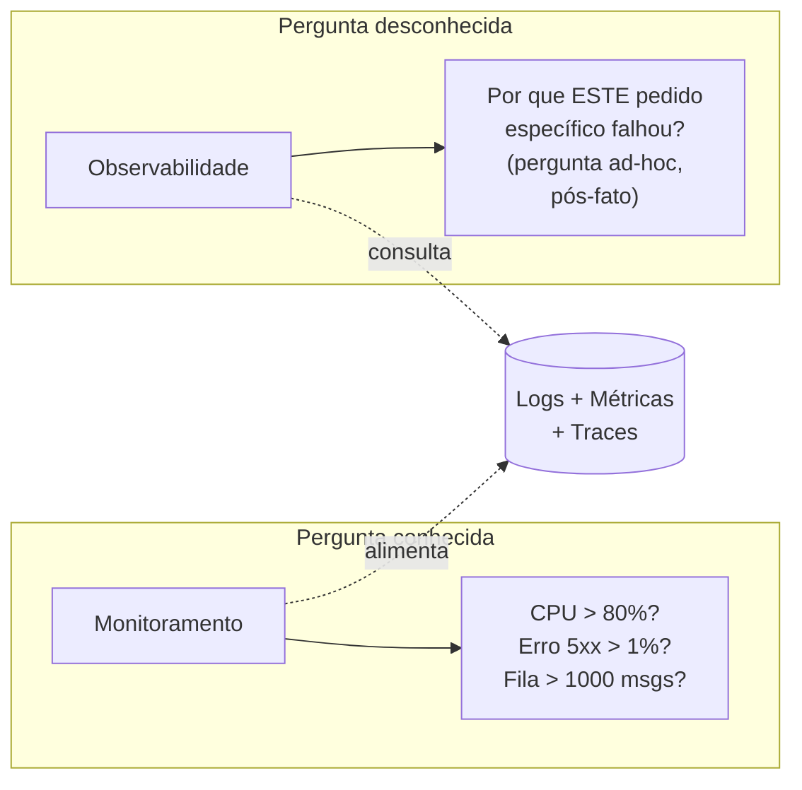
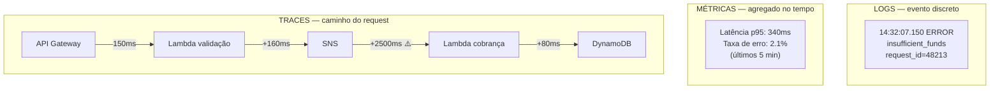

> [!abstract] TL;DR
> Numa arquitetura serverless, um pedido cruza dezenas de peças gerenciadas — e você não tem SSH em nenhuma delas. Monitoramento responde perguntas que você já sabia fazer ("a CPU está alta?"); observabilidade permite fazer perguntas que você não previu ("por que ESTE pedido específico sumiu?"). Os três pilares — logs (eventos discretos), métricas (agregados numéricos) e traces (o caminho de um request) — são as lentes que tornam um sistema distribuído legível. Na AWS o stack nativo é CloudWatch (logs+métricas+alarmes) e X-Ray (traces); na DigitalOcean, Monitoring cobre métricas de Droplet e alertas, mas não tem equivalente a tracing distribuído. OpenTelemetry é o padrão que tenta tornar tudo isso portável entre provedores.

## O pedido que sumiu

Lembra da arquitetura que você desenhou no [[03-Dominios/Tecnologia/Cloud/15 - Arquiteturas serverless e event-driven/index|galho 15]]? Um pedido de compra dispara uma Lambda de validação, que publica num tópico SNS, que alimenta uma fila SQS, que aciona outra Lambda de cobrança, que grava no DynamoDB, que dispara um Stream, que aciona uma terceira Lambda para mandar o e-mail de confirmação. Seis peças gerenciadas, cinco saltos assíncronos, zero servidor seu.

Agora imagine o chamado que chega: "paguei e não recebi o e-mail". Por onde você começa?

Numa aplicação monolítica clássica, a resposta seria quase mecânica: você entra no servidor via SSH, abre o log da aplicação, segue o `request_id` linha a linha até achar onde a execução parou ou lançou exceção. Doloroso, mas linear — um processo, um arquivo de log, uma stack trace.

Na arquitetura distribuída, essa mecânica simplesmente não existe. Não há "o servidor" para entrar — há seis serviços gerenciados, cada um com seu próprio ciclo de vida efêmero, e o "request" que sumiu não é mais uma execução única: é uma cadeia causal espalhada por processos diferentes, cada um invocado em momentos diferentes, alguns nem sequer executados na sua conta AWS (SNS e SQS são infraestrutura da própria AWS, não seu código rodando). Se a Lambda de cobrança falhou silenciosamente, ou se a mensagem nunca chegou na fila, ou se o Stream do DynamoDB atrasou — cada hipótese exige olhar um lugar diferente, e você não sabe de antemão qual.

Esse é o problema que a observabilidade resolve. E ele não é um luxo de "boa prática de engenharia" — é uma consequência direta e inevitável de ter trocado "um processo que você controla" por "uma composição de serviços gerenciados que você não controla". Quanto mais você abraça serverless e managed services (o assunto do galho anterior), mais essa pergunta vai te visitar.

## Monitoramento sabe o que perguntar. Observabilidade não.

A distinção entre monitoramento e observabilidade não é cosmética — ela muda o que você consegue fazer quando algo dá errado que ninguém previu.

**Monitoramento** é sobre perguntas conhecidas com antecedência. Você decide, ao configurar o sistema, quais sinais importam: "CPU acima de 80%? Me avise." "Erro 5xx passou de 1% das requisições? Dispara alarme." "Fila com mais de mil mensagens? Escala." Isso é poderoso, mas tem uma limitação estrutural: só funciona para falhas que você já imaginou. Um dashboard de CPU não te ajuda quando o problema é "o pedido #48213, do cliente João, sumiu entre a cobrança e o e-mail" — porque ninguém configurou um alarme para "o pedido específico de um cliente específico".

**Observabilidade** é a propriedade de um sistema que permite fazer perguntas que você *não* imaginou de antemão, sem precisar reinstrumentar nada. A pergunta "por que o pedido #48213 sumiu?" é uma pergunta ad-hoc, formulada depois do fato, sobre um caso específico. Um sistema observável tem dados granulares o bastante — logs estruturados com IDs de correlação, métricas com dimensões suficientes, traces que amarram os saltos entre serviços — para que você consiga *derivar* a resposta a partir dos dados existentes, em vez de precisar adivinhar e sair adicionando `print()` no código de produção.

A boa notícia: você não escolhe um ou outro. Um sistema maduro tem os dois, e eles se sustentam nos mesmos três pilares de dados.

## Os três pilares

Toda a disciplina de observabilidade se apoia em três tipos de dado, e cada um responde a um tipo diferente de pergunta. Eles não competem entre si — se complementam, e a mágica acontece quando você consegue pular de um para o outro no mesmo incidente.

### Logs: o que aconteceu, evento a evento

Um log é um registro discreto de um evento: "às 14:32:07, a Lambda `processar-cobranca` recebeu o evento X, tentou debitar o cartão, e recebeu erro `insufficient_funds`". É a granularidade mais fina que existe — cada linha é um fato pontual, com timestamp e (idealmente) contexto suficiente para reconstruir o que estava acontecendo naquele instante.

Logs respondem "o quê exatamente aconteceu aqui?". São ótimos para investigação detalhada, péssimos para visão agregada — ninguém lê um milhão de linhas de log para saber se o sistema está saudável. A chave para logs úteis num ambiente distribuído é a **estruturação**: logs em JSON com campos consistentes (nível, serviço, `request_id`, `trace_id`) são pesquisáveis e correlacionáveis; logs em texto livre viram ruído assim que o volume cresce.

### Métricas: o pulso do sistema ao longo do tempo

Uma métrica é um número agregado, amostrado ao longo do tempo: "latência p95 do endpoint de checkout, medida a cada minuto" ou "número de invocações da Lambda de cobrança por minuto". Ao contrário do log, a métrica já chega "resumida" — ela não te diz qual requisição específica foi lenta, mas te diz se a tendência geral está piorando.

Métricas respondem "como o sistema está se comportando, em agregado, e a tendência está subindo ou descendo?". São baratas de armazenar (comparadas a logs brutos) e são a base natural para dashboards e alarmes — é justamente sobre métricas que o monitoramento clássico ("CPU alta?") opera.

### Traces: o caminho de um request através dos serviços

Um trace reconstrói a jornada completa de uma requisição específica através de múltiplos serviços, com o tempo gasto em cada salto. Se um log é uma foto de um instante e uma métrica é um gráfico agregado, um trace é o mapa de viagem de UM pedido: entrou na API Gateway às 14:32:07.100, chegou na Lambda de validação às 14:32:07.150, publicou no SNS às 14:32:07.310, e a próxima Lambda só foi invocada às 14:32:09.800 — dois segundos e meio de atraso, exatamente onde você precisa olhar.

Traces respondem à pergunta que abriu esta nota: "por onde esse pedido específico passou, e onde ele travou ou demorou?". É o pilar mais caro de implementar corretamente, porque exige que cada serviço da cadeia propague um identificador comum (`trace_id`) para o próximo — e em arquiteturas serverless isso não acontece de graça, como você vai ver na nota seguinte deste galho.

## O desafio específico da nuvem

Se observabilidade já é difícil num monolito, na nuvem gerenciada ela enfrenta três obstáculos que não existiam (ou eram triviais) no data center tradicional:

**Efêmero.** Uma instância EC2 pode viver dias; uma execução de Lambda vive milissegundos e desaparece completamente depois — não há disco persistente para você acessar depois do fato, não há processo rodando para você anexar um debugger. Se você não capturou o log *durante* a execução, ele nunca existiu.

**Distribuído.** Um único request de negócio cruza N serviços gerenciados diferentes (API Gateway, Lambda, SNS, SQS, DynamoDB...), cada um com seu próprio sistema de logging e sua própria superfície de métricas. Não existe "o log do pedido" — existem seis logs parciais que você precisa amarrar manualmente (ou com uma ferramenta de tracing) para reconstruir a história completa.

**Gerenciado.** Você não controla o host. Não pode instalar um agente de monitoramento tradicional na máquina física por trás do SNS — porque não existe "a máquina" na sua conta, é multi-tenant e abstraída pelo provedor. Toda a visibilidade que você tem vem do que o provedor decide expor via API ou console. Isso é uma faca de dois gumes: você ganha instrumentação pronta (a Lambda já registra duração e erros automaticamente), mas perde o controle fino que tinha com SSH.

> [!info] Fronteira com Operação
> Tudo isso é sobre o **stack técnico** — as ferramentas do provedor que capturam logs, métricas e traces. A **disciplina** de observabilidade como prática de engenharia — SLO/SLI, error budget, plantão (on-call), resposta a incidentes — vive no domínio [[03-Dominios/Engenharia/Operação/index|Operação]], que trata esses temas de forma agnóstica de provedor. Aqui no galho 17, o recorte é: o que o CloudWatch e o X-Ray fazem de fato, e o que dá para portar entre provedores via OpenTelemetry.

## O panorama de ferramentas

Na AWS, o stack nativo se divide em duas frentes complementares:

- **CloudWatch** é o guarda-chuva de logs, métricas e alarmes. Toda função Lambda, toda instância EC2, todo bucket de storage já manda métricas básicas para lá automaticamente (o próprio recurso "publica" a métrica, você não instrumenta nada). Logs de aplicação vão para CloudWatch Logs quando você usa `console.log`/`print` dentro de uma Lambda — a plataforma captura e centraliza. Alarmes disparam ações (notificação SNS, auto scaling) quando uma métrica cruza um limiar por um número sustentado de períodos.
- **X-Ray** é o serviço de tracing distribuído da AWS — instrumenta seu código para propagar um `trace_id` através dos saltos entre serviços, montando o mapa de viagem de cada request. É a peça que falta no CloudWatch puro: métricas e logs te dizem "algo está lento", X-Ray te diz "está lento *neste salto específico*, entre a Lambda A e o SNS".

> [!info] Verificado 2026-07-24 — retenção de métricas do CloudWatch
> Segundo a documentação oficial, pontos de métrica com período de 1 minuto ficam disponíveis por 15 dias, os de 5 minutos por 63 dias, e os de 1 hora por até 455 dias (15 meses), com agregação progressiva. Resolução padrão dos serviços AWS é de 1 minuto (métricas customizadas podem pedir resolução de 1 segundo, com custo adicional). Confira `docs.aws.amazon.com/AmazonCloudWatch` antes de basear qualquer SLA nisso — quotas e retenção podem mudar.

Por trás (ou ao lado) de tudo isso está o **OpenTelemetry** — um padrão aberto, não proprietário, para instrumentar código e emitir logs, métricas e traces num formato comum. A ideia é simples e poderosa: se você instrumenta sua aplicação com OpenTelemetry em vez de amarrar diretamente nas APIs do CloudWatch, o mesmo código de instrumentação pode mandar dados para o CloudWatch, para um X-Ray, para um Datadog, ou para um coletor rodando na sua própria infraestrutura — sem reescrever nada. A AWS inclusive já aceita métricas via protocolo OTLP diretamente no CloudWatch, tratando-as com um modelo de dados um pouco diferente das métricas tradicionais (rótulos em vez de dimensões, consultadas via PromQL). Isso importa especialmente se portabilidade entre provedores é uma preocupação real para você — e vai ser o fio condutor de uma nota mais à frente neste galho.

## A lente DigitalOcean: honestidade sobre o que falta

Se você vem acompanhando este vault desde o galho 1, já sabe que a DigitalOcean é deliberadamente mais simples que a AWS — e observabilidade é onde essa simplicidade fica mais visível.

**DigitalOcean Monitoring** existe, é gratuito, e cobre o essencial de um Droplet: métricas de CPU, memória, disco e rede, coletadas por um agente instalável, mais alertas configuráveis por limiar (ex.: "avise se a CPU passar de 90% por 5 minutos"). Para droplets com GPU, a DO passou a expor observabilidade em nível de GPU também. É funcionalmente equivalente a um CloudWatch básico de EC2 — métricas de infraestrutura, alarmes simples.

O que **não existe** na DigitalOcean é qualquer equivalente ao X-Ray. Não há serviço de tracing distribuído nativo, e a documentação oficial de Monitoring não menciona a capacidade em nenhum lugar. Se você monta uma arquitetura de múltiplos serviços na DO (Droplets + App Platform + Managed Database, digamos) e precisa amarrar o caminho de um request através deles, a resposta honesta é: você mesmo instrumenta com OpenTelemetry e manda os traces para um backend de terceiros (Grafana Tempo, Honeycomb, Jaeger auto-hospedado) — a DO não oferece essa peça pronta. Essa é uma das lacunas mais claras de paridade entre os dois provedores nesta trilha, e vale ter isso mapeado antes de escolher DO para uma arquitetura que depende pesadamente de rastreabilidade entre serviços.

## Tabela de tradução entre provedores

| Conceito | AWS | DigitalOcean | Azure | GCP |
|---|---|---|---|---|
| Logs centralizados | CloudWatch Logs | Monitoring (logs básicos de plataforma; sem agregação rica) | Azure Monitor Logs | Cloud Logging |
| Métricas de infraestrutura | CloudWatch Metrics | DigitalOcean Monitoring | Azure Monitor Metrics | Cloud Monitoring |
| Alarmes/alertas | CloudWatch Alarms | Monitoring Alerts | Azure Monitor Alerts | Cloud Monitoring Alerting |
| Tracing distribuído | X-Ray | *(sem oferta nativa — usar OpenTelemetry + backend externo)* | Application Insights (tracing) | Cloud Trace |
| Padrão portável | Suporte a OTLP no CloudWatch | Sem suporte nativo documentado | Suporte a OpenTelemetry | Suporte nativo a OpenTelemetry |

## Armadilhas

> [!warning] Confundir "tenho métricas" com "sou observável"
> Ter um dashboard bonito de CPU e latência agregada dá uma falsa sensação de segurança. Métricas agregadas escondem exatamente os casos individuais que mais importam num incidente real — o pedido específico que sumiu não aparece numa média. Observabilidade de verdade exige os três pilares trabalhando juntos, com IDs de correlação amarrando log, métrica e trace do mesmo evento.

> [!warning] Logs não estruturados em ambiente distribuído
> `print("erro ao processar pedido")` sem `request_id`, sem `trace_id`, sem timestamp explícito é praticamente inútil quando você tem seis Lambdas gritando ao mesmo tempo em produção. A hora de estruturar logs (JSON, campos consistentes) é antes do incidente, não durante — durante o incidente já é tarde para reinstrumentar.

> [!warning] Escolher DigitalOcean sem mapear a lacuna de tracing
> Se sua arquitetura vai crescer para múltiplos serviços comunicantes, a ausência de um X-Ray nativo na DO não é um detalhe — é uma decisão arquitetural que você precisa tomar conscientemente (instrumentar você mesmo com OpenTelemetry, ou aceitar visibilidade mais pobre entre serviços). Descobrir isso no meio de um incidente de produção é o pior momento possível.

## O que vem a seguir

Esta nota estabeleceu o vocabulário: monitoramento vs observabilidade, os três pilares, e por que a nuvem gerenciada torna tudo isso ao mesmo tempo mais necessário e mais difícil. A próxima nota deste galho mergulha no CloudWatch a fundo — como logs, métricas customizadas e dashboards realmente funcionam na prática, incluindo os detalhes de retenção e resolução que só foram mencionados de passagem aqui. Depois vem tracing distribuído (a peça que a DO não tem), alarmes e a ponte para SLO, e finalmente como o específico de cada provedor se encaixa (ou não) num modelo portável via OpenTelemetry.

## Fontes

- [Amazon CloudWatch — Metrics concepts](https://docs.aws.amazon.com/AmazonCloudWatch/latest/monitoring/cloudwatch_concepts.html)
- [Amazon CloudWatch — What is Amazon CloudWatch?](https://docs.aws.amazon.com/AmazonCloudWatch/latest/monitoring/WhatIsCloudWatch.html)
- [AWS X-Ray — Documentation](https://docs.aws.amazon.com/xray/)
- [AWS — Send metrics using OpenTelemetry](https://docs.aws.amazon.com/AmazonCloudWatch/latest/monitoring/CloudWatch-OpenTelemetry-Sections.html)
- [DigitalOcean — Monitoring Overview](https://docs.digitalocean.com/products/monitoring/)
- [OpenTelemetry — Documentation](https://opentelemetry.io/docs/)
