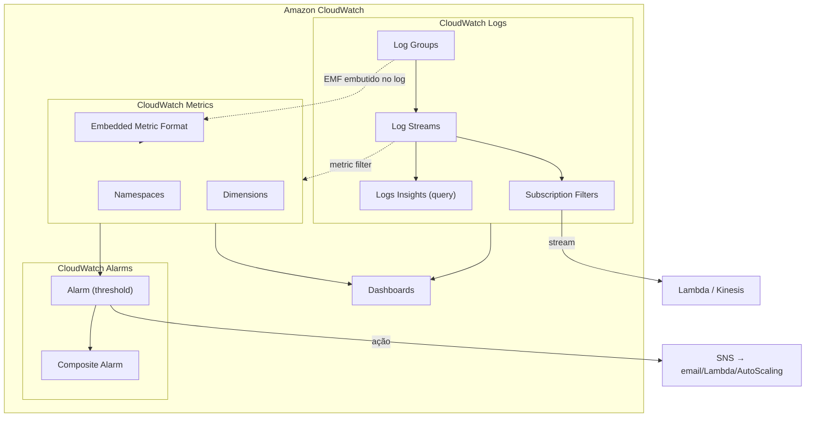
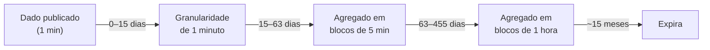
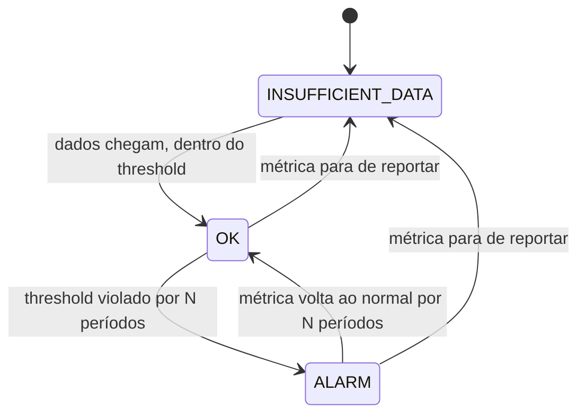

> [!abstract] TL;DR
> CloudWatch é o hub de observabilidade nativo da AWS: um serviço só que junta três coisas que em outros mundos vivem em ferramentas separadas — **logs** (CloudWatch Logs), **métricas** (CloudWatch Metrics) e **alarmes** (CloudWatch Alarms), com dashboards por cima. Logs vivem em log groups/streams com retenção configurável e são consultáveis via Logs Insights. Métricas têm namespace + dimensions como identidade, resolução padrão de 1 minuto (ou 1 segundo, para métricas de alta resolução), e retenção que degrada com o tempo — dado recente fica granular, dado velho vira agregado. O Embedded Metric Format deixa você emitir métrica escrevendo só um log estruturado, sem chamada de API extra. Alarmes vigiam um threshold sobre uma métrica e disparam ação (SNS, Auto Scaling, Lambda) quando o estado muda de forma sustentada. A armadilha squê o custo: cada peça — ingestão de log, métrica custom, alarme — é cobrada separadamente, e cresce sem avisar.

## O problema: você tem dados, mas não tem visão

Imagina que você acabou de subir uma aplicação na AWS. Ela roda, os requests chegam, os logs saem pelo `stdout` do container ou da função Lambda. Tudo funciona — até não funcionar. Um usuário reclama de lentidão às 3 da manhã. Você abre o terminal e pergunta: onde estão os logs dessa hora? Qual foi a CPU do servidor nesse instante? Teve erro 500 nesse período?

Sem um lugar central que junte essas três perguntas — "o que aconteceu" (logs), "como o sistema se comportou" (métricas) e "alguém devia ter sido avisado" (alarmes) — você fica catando pedaços: um `ssh` pra olhar log local, um script caseiro que faz `top` de tempos em tempos, um Slack bot artesanal que ninguém lembra como funciona.

O CloudWatch nasceu pra ser esse lugar central dentro da AWS. Ele não é um produto de terceiros que você instala — é o sistema nervoso que já está ligado em quase todo recurso AWS que você cria. Uma instância EC2, uma função Lambda, uma tabela DynamoDB: no instante em que existem, já estão publicando métricas básicas no CloudWatch, de graça, sem você pedir.

A pergunta que este capítulo responde não é "o que é observabilidade" (isso é da nota anterior) — é "como o CloudWatch, especificamente, organiza logs, métricas e alarmes, e como eu opero essas três peças no dia a dia".

## Anatomia do CloudWatch: três serviços debaixo de um nome



Repare: são três serviços com identidade própria — CloudWatch Logs, CloudWatch Metrics e CloudWatch Alarms — que só compartilham marca e console. Entender essa separação evita um erro comum de iniciante: achar que "mandar log" já vira "ter métrica". Não vira, a menos que você conecte as duas coisas — via metric filter ou via EMF, que veremos adiante.

## Logs: log groups, log streams e retenção

A unidade organizadora é o **log group**. Pense nele como uma pasta: agrupa logs que compartilham a mesma política de retenção, monitoramento e controle de acesso. Uma função Lambda chamada `processa-pedido` normalmente ganha um log group `/aws/lambda/processa-pedido`; um serviço ECS costuma ter um log group por serviço ou por task definition.

Dentro de cada log group vivem os **log streams** — uma sequência de eventos de log que compartilham a mesma origem. Numa Lambda, cada instância de execução (cada ambiente de execução, no sentido que a nota sobre [[03-Dominios/Tecnologia/Cloud/11 - Serverless e FaaS — Lambda a fundo/04 - Cold start, concurrency e performance|cold start e concorrência]] explora) tende a escrever no seu próprio stream. Não existe limite para quantos streams um log group pode ter.

Por padrão, os dados de log **ficam guardados indefinidamente** — para sempre, sem custo de exclusão automática. Isso parece bom até você lembrar que log ingerido é cobrado por GB, e log armazenado também tem custo de storage. Por isso, configurar **retenção** por log group é uma das primeiras coisas a fazer em qualquer conta AWS nova: 1 dia, 3 dias, 1 semana, ... até "Never Expire" (nunca expirar), com várias opções intermediárias (30, 90, 180, 365 dias, etc.).

> [!warning] Retenção não é instantânea
> Quando um evento de log ultrapassa o prazo de retenção, ele não some na hora — a AWS documenta que pode levar **até 72 horas** para a exclusão efetiva acontecer. Se você reduzir a retenção pra "limpar" um log group rapidamente, não conte com efeito imediato.

### Structured logging: JSON em vez de texto solto

Um log como `Usuário 42 fez checkout, valor R$120, latência 340ms` é legível por humano, mas péssimo pra máquina. Se você escreve o mesmo evento como JSON —

```json
{"event": "checkout", "userId": 42, "amount": 120.00, "latencyMs": 340, "requestId": "abc-123"}
```

— você ganha algo crucial: Logs Insights (a seguir) consegue filtrar e agregar por campo (`userId = 42`, `latencyMs > 300`) sem parsing frágil de regex. Structured logging é a base de quase toda automação de observabilidade moderna — inclusive do EMF, que é "JSON estruturado com uma seção especial que o CloudWatch sabe interpretar como métrica".

### Logs Insights: consultando logs como dado, não como texto

CloudWatch Logs Insights é a ferramenta de query sobre os logs armazenados. Em vez de dar `Ctrl+F` num arquivo gigante, você escreve algo parecido com SQL, mas com uma sintaxe própria (pipe-based):

```
fields @timestamp, @message, latencyMs, userId
| filter latencyMs > 300
| sort @timestamp desc
| limit 20
```

Ou, pra tirar uma estatística agregada — quantos erros por minuto, nos últimos 3 dias:

```
filter level = "ERROR"
| stats count(*) as erros by bin(1m)
```

Isso roda sobre os logs de um ou mais log groups escolhidos, num intervalo de tempo escolhido, e cobra por dado escaneado (não por resultado retornado) — outra armadilha de custo silenciosa se você escanear meses de log com frequência.

### Subscription filters: log virando stream em tempo real

Um **subscription filter** conecta um log group a um destino que processa os eventos *conforme chegam* — não em batch, via query. Os destinos típicos são uma função Lambda (pra transformar/rotear em tempo real) ou um stream Kinesis (pra pipelines de dado maiores, inclusive cross-conta). É assim que times constroem, por exemplo, um pipeline que detecta um padrão de erro específico no log e dispara uma notificação em segundos, sem esperar alguém rodar uma query manual.

## Métricas: namespace, dimensions, resolução

Se log é "o que aconteceu, em detalhe", métrica é "um número que descreve o sistema ao longo do tempo" — CPU em %, requests por segundo, latência em ms. A identidade de uma métrica no CloudWatch tem três partes: **namespace** (o "container" que isola métricas de aplicações diferentes — ex. `AWS/EC2`, `AWS/Lambda`, ou um namespace custom seu tipo `MinhaApp/Producao`), **nome da métrica** (`CPUUtilization`, `Errors`) e **dimensions** — pares chave/valor que identificam a instância específica daquela métrica (`InstanceId=i-0abc123`, `FunctionName=processa-pedido`).

Uma métrica pode ter até **30 dimensions**. Cada combinação única de dimensions é tratada como uma métrica separada — se você publica `Server=Prod,Domain=Frankfurt` e `Server=Prod,Domain=Rio`, isso são duas séries temporais distintas; você não consegue consultar "todo mundo com `Server=Prod`" sem especificar o `Domain` também (a exceção é a função `SEARCH` de metric math, que varre múltiplas métricas).

Cada serviço AWS já publica um conjunto de **métricas padrão** de graça, no namespace `AWS/{serviço}` (ex. `AWS/EC2/CPUUtilization`, `AWS/Lambda/Duration`, `AWS/DynamoDB/ConsumedReadCapacityUnits`). Quando isso não é suficiente — porque você quer medir algo específico do seu domínio, tipo "checkouts abandonados por minuto" — você publica **métricas custom**, seja via API (`PutMetricData`) seja via EMF.

### Resolução: standard (1 min) vs high-resolution (1 seg)

Toda métrica é, por padrão, **standard resolution**: um ponto por minuto. Métricas produzidas pelos serviços AWS quase sempre são assim. Quando você publica uma métrica custom, pode marcá-la como **high-resolution**, com granularidade de 1 segundo — útil pra reagir rápido a picos que duram poucos segundos, tipo detectar um spike de erro antes que o usuário perceba. O trade-off é custo: cada chamada `PutMetricData` é cobrada, e alimentar uma métrica de alta resolução naturalmente significa chamar a API com mais frequência.

### Retenção de métricas: o dado degrada, não desaparece de uma vez

Diferente de log (que você configura pra expirar), dado de métrica no CloudWatch **nunca é apagado explicitamente** — ele degrada em resolução com o tempo, de forma automática:

| Período do dado | Disponível por |
|---|---|
| < 60s (alta resolução) | 3 horas |
| 60s (1 min) | 15 dias |
| 300s (5 min) | 63 dias |
| 3600s (1 hora) | 455 dias (~15 meses) |

Ou seja: se você publicou com resolução de 1 minuto, nos primeiros 15 dias você consegue ver o gráfico minuto a minuto. Depois disso, o mesmo dado só é recuperável agregado em blocos de 5 minutos; depois de 63 dias, só em blocos de 1 hora; depois de ~15 meses, o dado expira de vez. É um comportamento parecido com "downsampling automático" que ferramentas de série temporal (Prometheus com remote write de longo prazo, por exemplo) fazem manualmente — no CloudWatch, é de fábrica.



Na prática, isso significa que investigar um incidente de "3 meses atrás" no console do CloudWatch já não mostra o pico exato minuto a minuto — só a média da hora. Se você precisa de granularidade fina por mais tempo, a solução comum é exportar métricas/logs pra um armazenamento próprio (S3, um data warehouse) via streaming, em vez de depender da retenção nativa do CloudWatch.

### Statistics e metric math

Uma **statistic** é a agregação de pontos de dado num período: `Average`, `Sum`, `Minimum`, `Maximum`, `SampleCount`, e também percentis (`p50`, `p95`, `p99...`, com até dez casas decimais). Percentis não estão disponíveis pra toda métrica — exigem os dados brutos (não um "statistic set" pré-agregado), e são suportados nativamente por serviços como API Gateway, ALB, EC2, Lambda e RDS.

**Metric math** vai além de olhar uma métrica isolada: permite combinar várias métricas numa expressão, tipo taxa de erro = `errors / (errors + successes) * 100`, ou somar métricas de múltiplas dimensions/regiões numa única série derivada. Um exemplo de expressão, do jeito que você escreveria num dashboard ou numa chamada de `get-metric-data`:

```
# e1: taxa de erro em %, combinando duas métricas existentes (m1 = erros, m2 = sucessos)
e1 = (m1 / (m1 + m2)) * 100
```

Isso é diferente de simplesmente somar dois gráficos visualmente: a expressão vira uma série de dados própria, que você pode inclusive usar como base pra um alarme — "dispare quando a taxa de erro calculada passar de 5%", sem precisar publicar uma métrica `ErrorRate` separada.

## Embedded Metric Format (EMF): métrica de graça dentro do log

Aqui está um dos truques mais usados em arquitetura serverless. Em vez de fazer duas coisas separadas — escrever um log *e* chamar `PutMetricData` pra registrar uma métrica — você escreve **um único log estruturado** com uma seção especial (`_aws`) que diz ao CloudWatch "extraia uma métrica destes campos". O agente/serviço CloudWatch Logs lê esse JSON e, além de guardá-lo como log normal, automaticamente cria os pontos de métrica correspondentes.

```json
{
  "_aws": {
    "Timestamp": 1721764800000,
    "CloudWatchMetrics": [
      {
        "Namespace": "MinhaApp/Checkout",
        "Dimensions": [["Servico"]],
        "Metrics": [
          { "Name": "LatenciaCheckoutMs", "Unit": "Milliseconds" },
          { "Name": "CheckoutsAbandonados", "Unit": "Count" }
        ]
      }
    ]
  },
  "Servico": "checkout-api",
  "LatenciaCheckoutMs": 340,
  "CheckoutsAbandonados": 1,
  "requestId": "abc-123"
}
```

Por que isso importa tanto em serverless? Porque numa Lambda, cada chamada extra à API do CloudWatch (`PutMetricData`) tem latência e custo — e, dentro de uma função que já é cobrada por milissegundo de execução, cada milissegundo gasto chamando outra API é dinheiro saindo do seu bolso duas vezes. O EMF resolve isso: você já estava escrevendo log (que sai grátis, é só `stdout`/`print`), e a métrica "carona" nesse mesmo log. É o padrão recomendado pela AWS para Lambda, ECS e qualquer workload que já emite log estruturado.

## Alarms: do threshold à ação

Um **alarme** observa uma métrica (ou uma expressão de metric math) e compara o valor contra um **threshold**, dentro de um **período** (ex. 5 minutos) e um número de **datapoints to alarm** — quantos períodos consecutivos (ou de quantos, tipo "3 de 5") precisam violar o threshold antes do alarme realmente disparar. Isso existe pra evitar alarme piscando a cada soluço momentâneo da métrica.



Um alarme tem três estados possíveis: **OK** (dentro do esperado), **ALARM** (threshold violado de forma sustentada) e **INSUFFICIENT_DATA** (não há dados suficientes pra avaliar — comum logo após criar o alarme, ou quando a métrica para de ser publicada). A transição de estado é o gatilho — não o estado em si. Um alarme não "fica avisando" enquanto está em ALARM; ele dispara a ação apenas na *mudança* de estado.

A ação típica é publicar num tópico **SNS**, que por sua vez distribui pra e-mail, SMS, uma fila SQS, ou invoca uma função Lambda. Alarmes também podem disparar políticas de **Auto Scaling** diretamente (esse é o mecanismo por trás de "escala quando CPU passa de 70%").

**Composite alarms** combinam o estado de vários alarmes simples numa expressão booleana — por exemplo, "dispare só se `CPU alta` E `fila crescendo`, mas não se só um dos dois for verdade". Isso reduz ruído: em vez de dez alarmes individuais acordando o time por sintomas isolados, um alarme composto dispara só quando o quadro geral confirma um problema real.

## Dashboards, metric filters e Contributor Insights

**Dashboards** são painéis visuais que juntam gráficos de métricas (inclusive de contas/regiões diferentes) e widgets de log num único lugar — o "cockpit" que alguém olha às 9h de segunda ou durante um incidente.

**Metric filters** são o mecanismo *anterior* ao EMF pra extrair métrica de log: você define um padrão de busca sobre o texto do log (ex. contar quantas linhas têm a palavra `ERROR`), e o CloudWatch incrementa uma métrica toda vez que o padrão bate. É mais simples de configurar que EMF pra casos triviais ("contar ocorrências"), mas menos flexível — EMF te dá o valor exato de um campo numérico, não só uma contagem de padrão.

**Contributor Insights** analisa dados de log (ou métricas) pra responder "quem são os top contribuidores desse comportamento" — por exemplo, "quais os 10 IPs que mais geraram erro 429 na última hora", sem você ter que escrever a query de agregação manualmente toda vez.

> [!tip] Assista: Amazon CloudWatch — Comprehensive Monitoring
> **Canal:** Notas de Arquitetura em Nuvem | **Duração:** ~7min | **Idioma:** PT-BR
>
> Mostra o fluxo completo métrica → dashboard → alarme na prática, complementando esta seção com a visão de "cockpit" que amarra os três mecanismos que a nota acabou de descrever separadamente. Trecho de destaque [01:56]: *"entram os dashboards. Eles são a resposta. Os dashboards pegam essas métricas e montam uma visão única, fácil [de entender]"*
>
> 🎬 [Assistir no YouTube](https://www.youtube.com/watch?v=Y3RRhisk3J0)

Um metric filter simples, criado via CLI, ilustra a diferença de esforço em relação ao EMF — aqui você não controla o *valor* da métrica, só conta ocorrências de um padrão de texto:

```bash
aws logs put-metric-filter \
  --log-group-name /minha-app/producao \
  --filter-name conta-erros \
  --filter-pattern '"ERROR"' \
  --metric-transformations \
      metricName=ContagemErros,metricNamespace=MinhaApp/Checkout,metricValue=1
```

Repare: essa métrica só sabe *contar* quantas linhas bateram no padrão `"ERROR"`. Se você quisesse o valor exato de `latencyMs` de cada evento, metric filter não dá conta sozinho — é aí que o EMF (ou uma chamada explícita a `PutMetricData`) se torna necessário.

## Custo: a armadilha que ninguém vê chegando

CloudWatch parece "grátis" porque as métricas básicas de cada serviço são gratuitas e o console é confortável. O problema aparece quando a operação cresce: cada peça é cobrada separadamente, e o total surpreende.

> [!info] Preços sujeitos a variação por região — verificado 2026-07-24, conferir a página oficial de pricing antes de orçar
> - **Ingestão de log**: cobrada por GB ingerido, com uma faixa gratuita mensal pequena; acima disso, algo na casa de US$ 0,50/GB (varia por região e por volume, com desconto em faixas maiores).
> - **Métricas custom**: cobradas por métrica publicada por mês, em faixas — algo como US$ 0,30/métrica nas primeiras dezenas de milhares, caindo pra faixas menores conforme o volume cresce.
> - **Alarms**: cobrados por métrica monitorada, na casa de US$ 0,10/alarme-métrica por mês; alarmes de alta resolução (avaliação abaixo de 60s) custam mais.
> - **API requests** (`PutMetricData`, `GetMetricData` etc.) também são cobradas acima de um volume gratuito.
>
> Como os números exatos mudam com frequência e variam por região, trate isso como ordem de grandeza — confira a calculadora de preços da AWS antes de tomar decisão de arquitetura baseada em custo.

Onde isso morde na prática: uma aplicação com dimensions "criativas demais" (ex. um dimension por `requestId` único) explode o número de séries de métrica — cada combinação de dimension vira uma métrica nova e cobrada. Log verboso em produção (debug ligado por acidente) infla ingestão de log rapidamente. E um time que cria um alarme por microserviço, por ambiente, por métrica, sem consolidar em composite alarms, acumula uma fatura de "alarme-métrica" que ninguém rastreou.

Um exemplo de ordem de grandeza ajuda a tornar isso concreto. Imagine um sistema com 20 microserviços, cada um publicando 15 métricas custom, em 3 ambientes (dev/staging/prod): são `20 × 15 × 3 = 900` séries de métrica. Nas faixas de preço citadas acima, isso fica na casa de baixas centenas de dólares por mês só de métrica — antes de contar log e alarme. Se um desenvolvedor, sem perceber, adiciona `UserId` como dimension numa métrica de latência (achando que vai ajudar a filtrar por usuário depois), e o sistema tem 50 mil usuários ativos, essa única métrica pode multiplicar por 50.000 o número de séries — o que costuma aparecer na fatura antes de aparecer em qualquer dashboard.

> [!tip] Assista: AWS CloudWatch — Cost Control
> **Canal:** Notas de Arquitetura em Nuvem | **Duração:** ~6min | **Idioma:** PT-BR
>
> Reforça exatamente o ângulo desta seção: como identificar qual log group ou qual métrica está inflando a fatura, cruzando dados de custo do CloudWatch com os recursos que os geraram — a pergunta prática de "quem é o culpado" antes que o valor apareça só na fatura. Trecho de destaque [02:49]: *"exatamente qual log group ou qual métrica tá custando mais"*
>
> 🎬 [Assistir no YouTube](https://www.youtube.com/watch?v=rCffTTDZ1FI)

## Lente dupla: CloudWatch vs. DigitalOcean Monitoring

Aqui a diferença de filosofia entre as duas nuvens fica bem nítida. A AWS constrói uma pilha de observabilidade completa e granular — logs, métricas custom, queries, EMF, alarmes compostos — porque ela também vende a complexidade distribuída que gera a necessidade disso (múltiplos serviços, múltiplas contas, múltiplas regiões).

O **DigitalOcean Monitoring** é um serviço gratuito e mais simples: um agente (open source, escrito em Go) instalado no Droplet coleta métricas de CPU, memória, disco e rede (incluindo, mais recentemente, métricas em nível de GPU para Droplets com GPU AMD/NVIDIA), e você configura **alert policies** — regras de threshold que notificam quando uma métrica ultrapassa ou cai abaixo de um limite.

| Aspecto | CloudWatch (AWS) | DigitalOcean Monitoring |
|---|---|---|
| Métricas de infraestrutura | Sim, por serviço, com dimensions | Sim, agente no Droplet (CPU/mem/disco/rede/GPU) |
| Métricas custom | Sim (API + EMF) | Não — sem equivalente direto |
| Logs centralizados com query (tipo Logs Insights) | Sim (CloudWatch Logs) | Não — sem log analytics nativo comparável |
| Alarmes/alertas | Sim, com composite alarms | Sim, alert policies simples (threshold) |
| Tracing distribuído | Via X-Ray (nota seguinte) | Não existe equivalente |

Vale ser honesto aqui: não existe um "CloudWatch da DigitalOcean" escondido em outro nome — a documentação da DO não descreve nenhuma funcionalidade de log analytics rico ou tracing distribuído dentro do produto Monitoring. Se você roda produção séria na DO e precisa desse nível de observabilidade, o caminho comum é somar uma ferramenta terceirizada (Datadog, Grafana Cloud, um stack próprio com Prometheus + Loki) por cima da infraestrutura — o que, aliás, é também um caminho válido dentro da própria AWS, quando você quer portabilidade e não quer ficar preso ao formato proprietário do CloudWatch.

## Tradução de nomes: Azure e GCP

| Conceito | AWS (CloudWatch) | Azure | GCP | DigitalOcean |
|---|---|---|---|---|
| Métricas de plataforma | CloudWatch Metrics | Azure Monitor Metrics | Cloud Monitoring | DO Monitoring |
| Logs centralizados | CloudWatch Logs | Azure Monitor Logs (Log Analytics) | Cloud Logging | — (sem equivalente) |
| Query de logs | Logs Insights (sintaxe própria) | Kusto Query Language (KQL) | Logging Query Language | — |
| Alarmes/alertas | CloudWatch Alarms | Azure Monitor Alerts | Cloud Monitoring Alerting Policies | Alert Policies |
| Dashboards | CloudWatch Dashboards | Azure Workbooks / Dashboards | Cloud Monitoring Dashboards | — (dashboard básico do painel) |

## Código: um circuito mínimo, ponta a ponta

```bash
# Criar um log group com retenção de 30 dias
aws logs create-log-group --log-group-name /minha-app/producao
aws logs put-retention-policy \
  --log-group-name /minha-app/producao \
  --retention-in-days 30

# Enviar um evento de log (normalmente feito pelo agente/SDK, não à mão)
aws logs put-log-events \
  --log-group-name /minha-app/producao \
  --log-stream-name instancia-01 \
  --log-events timestamp=$(date +%s000),message='{"event":"checkout","latencyMs":340}'

# Publicar uma métrica custom manualmente
aws cloudwatch put-metric-data \
  --namespace "MinhaApp/Checkout" \
  --metric-name LatenciaCheckoutMs \
  --value 340 \
  --unit Milliseconds \
  --dimensions Servico=checkout-api

# Criar um alarme sobre essa métrica
aws cloudwatch put-metric-alarm \
  --alarm-name checkout-latencia-alta \
  --namespace "MinhaApp/Checkout" \
  --metric-name LatenciaCheckoutMs \
  --statistic Average \
  --period 300 \
  --evaluation-periods 3 \
  --datapoints-to-alarm 2 \
  --threshold 500 \
  --comparison-operator GreaterThanThreshold \
  --alarm-actions arn:aws:sns:us-east-1:123456789012:time-oncall
```

```
-- Query de Logs Insights: p95 de latência de checkout, por minuto, última hora
filter event = "checkout"
| stats pct(latencyMs, 95) as p95_latencia by bin(1m)
| sort @timestamp desc
```

> [!warning] Armadilhas comuns
> - **Retenção "Never Expire" por padrão**: log group novo, sem configuração, guarda pra sempre — e cobra pra sempre. Configure retenção no momento da criação, não depois.
> - **Dimensions demais**: usar um valor único por request (tipo `requestId`) como dimension multiplica o número de séries de métrica e explode custo — dimension é pra categoria (`Ambiente`, `Servico`), não pra identificador único de evento.
> - **Confundir log com métrica**: escrever `console.log("latência: 340ms")` não cria métrica nenhuma. Ou você usa metric filter, ou EMF, ou chama `PutMetricData` — sem isso, esse número só existe como texto dentro do log.
> - **Alarme sem datapoints-to-alarm bem calibrado**: threshold com 1 período de avaliação dispara com qualquer soluço passageiro; calibrar "quantos de quantos" evita ruído sem perder sensibilidade real.
> - **Logs Insights cobra por dado escaneado**: uma query "solta" sobre 90 dias de log, rodada toda hora, custa mais do que parece — restrinja o intervalo de tempo ao necessário.

## O que vem a seguir

CloudWatch resolve "o que aconteceu num serviço" e "como uma métrica se comportou". Mas quando um request atravessa cinco serviços diferentes — API Gateway, Lambda, DynamoDB, uma fila, outro Lambda — nenhuma dessas peças, isoladamente, mostra o caminho completo nem onde o tempo foi gasto. Essa é a lacuna que o **tracing distribuído** fecha, com o AWS X-Ray como a peça nativa da AWS: a próxima nota deste galho.

## Fontes

- AWS. "Amazon CloudWatch concepts." https://docs.aws.amazon.com/AmazonCloudWatch/latest/monitoring/cloudwatch_concepts.html
- AWS. "Working with log groups and log streams." https://docs.aws.amazon.com/AmazonCloudWatch/latest/logs/Working-with-log-groups-and-streams.html
- AWS. "Specification: Embedded metric format." https://docs.aws.amazon.com/AmazonCloudWatch/latest/monitoring/CloudWatch_Embedded_Metric_Format_Specification.html
- AWS. "Using Amazon CloudWatch alarms." https://docs.aws.amazon.com/AmazonCloudWatch/latest/monitoring/AlarmThatSendsEmail.html
- AWS. "Analyzing log data with CloudWatch Logs Insights." https://docs.aws.amazon.com/AmazonCloudWatch/latest/logs/AnalyzingLogData.html
- AWS. "Amazon CloudWatch Pricing." https://aws.amazon.com/cloudwatch/pricing/
- DigitalOcean. "Monitoring." https://docs.digitalocean.com/products/monitoring/
