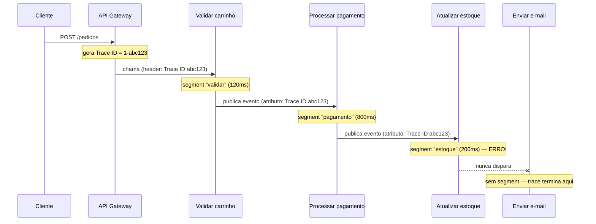
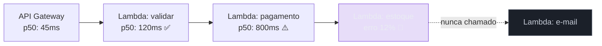
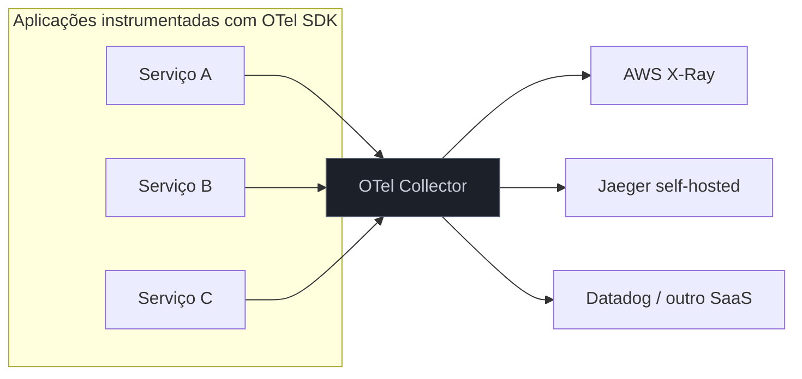

> [!abstract] TL;DR
> Logs dizem "algo aconteceu aqui"; métricas dizem "isto está degradado agora"; só o tracing distribuído responde "o que exatamente aconteceu com ESTE pedido, através de todos os serviços que ele tocou, e onde o tempo foi gasto". A técnica é simples de enunciar — um ID de trace nasce no primeiro serviço e viaja em todo header de toda chamada seguinte, cada hop reporta um segment com seu próprio tempo — e brutalmente fácil de esquecer de implementar, porque nada quebra visivelmente quando você pula um serviço. O AWS X-Ray materializa isso como serviço gerenciado (traces, segments, subsegments, service map, sampling automático); a DigitalOcean não tem equivalente — a saída lá é montar o próprio Jaeger/Tempo ou contratar um SaaS de terceiro. E por trás dos dois mundos está crescendo um padrão neutro, o OpenTelemetry, que promete instrumentar uma vez e mandar pra qualquer lugar.

## O problema: o pedido que sumiu entre três serviços

Volte ao capstone do Bloco 3, a arquitetura serverless de referência do [[03-Dominios/Tecnologia/Cloud/15 - Arquiteturas serverless e event-driven/06 - Arquitetura serverless de referência (capstone do Bloco 3)|galho 15]]: um pedido de e-commerce entra pela API Gateway, uma função valida o carrinho, publica um evento, uma segunda função processa o pagamento, uma terceira atualiza o estoque, uma quarta manda a confirmação por e-mail. Cinco componentes, cada um com seu próprio log group no CloudWatch.

Um cliente reclama: "paguei e não recebi confirmação". Você abre o CloudWatch Logs Insights (visto na nota anterior deste galho) e busca pelo ID do pedido. Encontra o log de "carrinho validado". Encontra o log de "pagamento processado". Não encontra nada sobre estoque, nem sobre e-mail. O pedido simplesmente... parou. Em qual dos dois serviços? Você não sabe, porque cada log group é uma ilha — não existe um fio que amarre "isso é o mesmo pedido, do começo ao fim, através de cinco processos diferentes que nunca conversaram diretamente entre si".

Essa é exatamente a dor que fecha o [[03-Dominios/Tecnologia/Cloud/15 - Arquiteturas serverless e event-driven/05 - Padrões e anti-padrões serverless|Padrões e anti-padrões serverless]]: arquitetura distribuída esconde os sintomas até que alguém precise debugar sob pressão. Tracing distribuído é a resposta técnica a essa dor — não é conveniência, é a diferença entre resolver o incidente em 5 minutos ou em 5 horas vasculhando log groups um por um, torcendo pra achar o correlation certo.

## O mecanismo: um ID que atravessa tudo

A ideia central é antiga e simples — mais velha que "observabilidade" como palavra da moda, mais velha até que microsserviços. Ela vem de sistemas distribuídos acadêmicos dos anos 2000 (o paper Dapper do Google, 2010, é a referência canônica que praticamente todo tracer moderno cita).

O mecanismo, em três peças:

1. **Trace ID**: quando um pedido entra no sistema pela primeira vez (a borda — API Gateway, load balancer, o primeiro serviço que recebe a requisição), alguém gera um identificador único para essa jornada inteira. Esse ID não muda até o pedido terminar de ser processado, não importa quantos serviços ele atravesse.
2. **Propagação via header**: esse trace ID viaja em todo pedido subsequente, embutido num header HTTP (ou em atributos de mensagem, se for fila/evento assíncrono). Cada serviço que recebe uma chamada lê o header, extrai o trace ID, e — crucial — **o repassa** em qualquer chamada que ele mesmo fizer a jusante. Se um único hop esquecer de propagar o header, o trace quebra ali: o resto da jornada vira uma trace órfã, desconectada da primeira metade.
3. **Segments e spans**: cada serviço, ao processar sua fatia do trabalho, registra quanto tempo levou, se deu erro, e metadados relevantes — e envia isso pra um backend de tracing central (X-Ray, Jaeger, Tempo, etc.), sempre carimbado com o mesmo trace ID. O backend depois reconstrói a árvore inteira: quem chamou quem, em que ordem, quanto tempo cada etapa levou.



Com esse trace reconstruído, a pergunta "onde o pedido travou?" tem resposta direta: no serviço de estoque, e ele nunca chamou o de e-mail. Sem o trace ID amarrando os cinco segments, você teria cinco eventos desconexos em cinco log groups — e nenhuma forma automática de saber que pertencem à mesma história.

O nome técnico para o header que carrega esse ID é **trace context** (ou, no jargão do X-Ray, **trace header** — `X-Amzn-Trace-Id`). A regra de ouro: **cada hop que não propaga o header quebra o trace**. Isso significa que tracing distribuído não é "ligar uma feature no console" — é instrumentar, com disciplina, todo ponto de entrada e saída de cada serviço. É trabalho de engenharia recorrente, não configuração de uma vez só.

## AWS X-Ray: o serviço gerenciado

O X-Ray é o produto da AWS pra esse problema. Ele se encaixa nas três peças do mecanismo:

- **Trace**: a jornada completa de um pedido, identificada pelo trace ID (formato `1-{timestamp em hex}-{ID aleatório de 96 bits}`, ex: `1-67890abc-1234567890abcdef12345678`).
- **Segment**: o que um serviço reporta sobre o trabalho que ele fez — nome, tempo de início/fim, se houve erro/fault/throttle, e opcionalmente **subsegments** (sub-etapas dentro do mesmo serviço, tipo "chamada ao DynamoDB" dentro do segment maior "processar pagamento").
- **Annotations vs metadata**: dois jeitos de anexar dados extras a um segment. **Annotations** são indexadas e pesquisáveis (você pode filtrar traces por `annotation.pedido_id = "123"` no console) — mas são limitadas a chave-valor simples (string, número, booleano). **Metadata** aceita estruturas mais ricas (objetos aninhados) mas **não é indexada** — serve pra inspeção manual de um trace específico, não pra busca em massa. Regra prática: se você vai *filtrar* por esse dado depois, é annotation; se é só contexto pra debugar quando você já achou o trace, é metadata.
- **Service map**: o grafo visual que o X-Ray desenha automaticamente a partir de todos os traces recebidos — cada nó é um serviço, cada aresta é uma chamada observada, com latência média e taxa de erro coloridas (verde/amarelo/vermelho) direto no grafo. É a materialização visual da arquitetura *real* do sistema, não do diagrama que alguém desenhou uma vez e nunca atualizou.



### Sampling: por que nem todo pedido vira trace

Rastrear 100% do tráfego em produção custa caro (em processamento e em armazenamento) e, na prática, é redundante — se 10 mil pedidos por minuto passam pelo mesmo caminho saudável, você não precisa dos 10 mil traces pra saber que o caminho está saudável. Por isso o X-Ray amostra.

> [!info] Verificado 2026-07-24 — pode mudar
> Para o Lambda com Active Tracing, a regra de sampling **não é configurável**: 1 requisição por segundo é sempre traçada, mais 5% do tráfego adicional acima disso. Para X-Ray fora do Lambda (EC2, ECS, apps instrumentadas com o SDK), o sampling *é* configurável via regras de sampling no console — mas o default também é 1 req/s + 5%. Fonte: docs.aws.amazon.com/lambda/latest/dg/services-xray.html.

Isso tem uma consequência prática importante: se um erro é raro (acontece em 1 a cada 2000 pedidos), sampling de 5% pode simplesmente *não capturar* o trace daquele erro específico. Para depurar um bug raro e intermitente, às vezes a tática é forçar 100% de sampling temporariamente num ambiente de staging, nunca em produção com tráfego alto.

Fora do Lambda — em EC2, ECS ou qualquer serviço instrumentado com o SDK/ADOT — o sampling *é* configurável via **regras de sampling** definidas no console do X-Ray: cada regra tem um `reservoir` (número fixo de requisições por segundo sempre traçadas), uma `rate` (percentual do excedente), um `priority` (regras são avaliadas em ordem crescente até achar a primeira que casa) e critérios de filtro (nome do serviço, método HTTP, caminho da URL). É assim que você pode dizer "trace 100% das requisições em `/checkout`, mas só 1% em `/health`".

> [!warning] Sampling no X-Ray é "parent-based" — a decisão é tomada uma vez só
> A decisão de amostrar (ou não) um pedido é tomada pelo **primeiro** serviço instrumentado que recebe a requisição (o serviço "raiz" da árvore) e propagada nos flags do trace header para todos os serviços a jusante. Se o serviço C, no meio da cadeia, tem uma regra de sampling customizada dizendo "trace 100% das minhas chamadas", essa regra **nunca vai ser avaliada** enquanto o serviço C só receber tráfego encadeado a partir de um serviço A upstream — ele obedece a decisão que já veio pronta no header. Pra mudar a taxa de amostragem de um fluxo inteiro, a regra tem que ser configurada no serviço de entrada (raiz), não no meio da cadeia. É um erro comum o suficiente pra a própria documentação da AWS chamar atenção pra ele.

### Instrumentação: como o trace nasce

Três caminhos, do mais automático ao mais manual:

1. **Lambda com Active Tracing**: um toggle de configuração (`TracingConfig: Mode: Active`, ou no console em Configuration → Monitoring). O Lambda automaticamente cria o segment do serviço e da função, sem você escrever código de instrumentação básica. Sem Active Tracing, o Lambda roda em modo `PassThrough` por padrão — ele *repassa* o header de trace adiante (se um upstream mandou um), mas não gera nem envia segments próprios.
2. **X-Ray SDK**: para adicionar subsegments customizados (uma chamada a um banco, uma etapa de lógica de negócio) e annotations/metadata dentro de uma função Lambda ou aplicação EC2/ECS, você instrumenta o código com o SDK do X-Ray (disponível para Node.js, Python, Java, Go, .NET, Ruby). É aqui que você decide o que vale a pena anotar — `annotations: { pedido_id, cliente_id }` pra poder filtrar depois.
3. **Permissões**: a função Lambda (ou instância EC2/task ECS) precisa de permissão IAM pra escrever no X-Ray — as actions `xray:PutTraceSegments` e `xray:PutTelemetryRecords`, cobertas pela managed policy `AWSXRayDaemonWriteAccess`. Ativar Active Tracing pelo console já adiciona isso automaticamente à execution role; ativando via CLI/CloudFormation, é preciso anexar a policy manualmente.

```python
# Instrumentando subsegment customizado com annotation, dentro de uma Lambda
# com Active Tracing já habilitado (segment "pai" é criado automaticamente)
from aws_xray_sdk.core import xray_recorder
from aws_xray_sdk.core import patch_all

patch_all()  # instrumenta automaticamente boto3, requests, etc.

def handler(event, context):
    pedido_id = event["pedido_id"]

    # subsegment manual para uma etapa de negócio específica
    with xray_recorder.in_subsegment("validar-estoque") as subsegment:
        subsegment.put_annotation("pedido_id", pedido_id)  # indexado, filtrável
        subsegment.put_metadata("payload", event)          # não indexado, contexto

        disponivel = checar_estoque(pedido_id)
        if not disponivel:
            subsegment.add_exception(Exception("Estoque insuficiente"))
            raise Exception("Estoque insuficiente")

    return {"status": "ok"}
```

```yaml
# CloudFormation: habilitando Active Tracing numa função Lambda
Resources:
  FuncaoEstoque:
    Type: AWS::Lambda::Function
    Properties:
      TracingConfig:
        Mode: Active
      # execution role precisa da policy AWSXRayDaemonWriteAccess
```

Para serviços fora do Lambda — ECS, App Runner, EC2 — o X-Ray precisa de um **daemon** rodando ao lado da aplicação (um processo que recebe os segments via UDP local e os envia em lote pra API do X-Ray). No Lambda esse daemon já vem embutido na plataforma; em ECS/EC2, ele roda como sidecar container ou processo separado.

### Debugando o pedido sumido com o service map

Volte ao caso de abertura desta nota — o pedido que "parou" entre pagamento e e-mail, e o CloudWatch Logs Insights não dava um caminho claro entre os dois. Com X-Ray ativo em todas as cinco funções, o fluxo de debug muda completamente: você não procura por logs soltos, você abre o console do X-Ray, filtra por `annotation.pedido_id = "12345"` e recebe **um** trace — a jornada inteira, com todos os segments que existiram, na ordem em que existiram.

O service map (visto acima) já denuncia o problema visualmente antes mesmo de você abrir o trace individual: o nó "estoque" aparece em vermelho, com taxa de erro elevada, e a aresta para "e-mail" simplesmente não existe no grafo agregado dos últimos períodos — nenhuma chamada foi observada nesse caminho. Isso é a resposta à pergunta original ("onde travou?") sem precisar correlacionar manualmente cinco log groups: o gráfico mostra que a falha está na fronteira entre estoque e e-mail, e o trace individual mostra a exceção exata (`Estoque insuficiente`, no exemplo de código acima) que impediu a próxima etapa de sequer começar.

Sem tracing, essa mesma investigação exigiria: abrir cada log group, adivinhar a janela de tempo certa, procurar manualmente por algo que pareça o mesmo pedido (um ID de pedido embutido na mensagem de log, se alguém teve o cuidado de logar isso de forma consistente), e montar a timeline à mão. Com cinco serviços isso é tedioso; com vinte, é impraticável sob pressão de incidente.

> [!tip] Assista: Conhecendo o AWS X-Ray — Service Map na AWS
> **Canal:** Bruno Russi | **Duração:** ~11min | **Idioma:** PT-BR
>
> Uma demonstração ao vivo do console do X-Ray, mostrando o service map colorido e um trace individual sendo aberto pra achar exatamente onde um salto ficou lento — o mesmo fluxo de debug que esta nota descreve em prosa. Trecho de destaque [02:24]: *"esse carinha aqui que teve um tempo aproximadamente de quatro segundos né e a gente consegue ver para esse Trace"*
>
> 🎬 [Assistir no YouTube](https://www.youtube.com/watch?v=RXxy7EMh7C8)

> [!tip] Assista: Como utilizar o AWS X-Ray com Docker para tracing e identificar problemas de performance
> **Canal:** Domine AWS com Henrylle Maia | **Duração:** ~30min | **Idioma:** PT-BR
>
> Complementa a seção de instrumentação com um passo a passo de configurar o daemon do X-Ray fora do Lambda (ECS/Docker) — o cenário que esta nota só descreve rapidamente como "sidecar container ou processo separado". Trecho de destaque [02:27]: *"conseguir ter rastreabilidade do que está acontecendo na sua aplicação"*
>
> 🎬 [Assistir no YouTube](https://www.youtube.com/watch?v=PFU278j4c2A)

## Trace context: o header por baixo do capô

Vale abrir o capô do "header que viaja" mencionado no mecanismo, porque existem dois formatos concorrentes que você vai encontrar na prática:

- **X-Ray trace header** (`X-Amzn-Trace-Id`): formato proprietário da AWS, no padrão `Root=1-{timestamp}-{ID};Parent={segment ID pai};Sampled={0 ou 1}`. É o que as integrações nativas da AWS (API Gateway, ALB, Lambda) já sabem ler e propagar sem configuração extra.
- **W3C Trace Context** (`traceparent`): o padrão aberto adotado pelo OpenTelemetry e pela maior parte do ecossistema fora da AWS, no formato `{versão}-{trace-id de 128 bits}-{parent-id de 64 bits}-{flags}`. Quando você instrumenta com OTel/ADOT, é esse o header que trafega por padrão entre seus serviços.

Na prática, quando você mistura os dois mundos (por exemplo, uma API Gateway nativa da AWS na frente de um serviço instrumentado só com OTel), o ADOT sabe traduzir entre os dois formatos — mas essa tradução é outro ponto onde a propagação pode falhar silenciosamente se a configuração do Collector estiver incompleta. Vale testar explicitamente, gerando uma requisição de ponta a ponta e confirmando no console que o trace saiu inteiro, e não partido em dois.

## OpenTelemetry: o padrão que não amarra em ninguém

Aqui entra a peça que muda o jogo de longo prazo. Instrumentar diretamente com o SDK do X-Ray funciona — mas amarra seu código a um vendor. Se um dia você migrar parte da carga pra outro provedor, ou quiser mandar os mesmos traces pra um backend open-source, o código de instrumentação teria que mudar.

O **OpenTelemetry** (OTel) é um projeto da CNCF (o mesmo guarda-chuva do Kubernetes) que padroniza APIs, SDKs e formato de dados para três sinais de observabilidade — traces, métricas e logs — de forma neutra a vendor. A promessa: você instrumenta seu código *uma vez*, usando as bibliotecas do OTel, e decide *depois* (e pode trocar depois) para onde os dados vão — X-Ray, Jaeger, Grafana Tempo, Datadog, Honeycomb, o que for.

A peça central da arquitetura OTel é o **Collector**: um processo (rodando como sidecar, daemon ou serviço central) que recebe dados de telemetria de várias aplicações, processa (filtra, agrupa, enriquece) e exporta pra um ou mais backends. Isso desacopla "como minha aplicação emite dados" de "para onde os dados vão parar".



A AWS reconheceu essa direção e criou o **ADOT** (AWS Distro for OpenTelemetry) — não é um produto separado do OTel, é uma *distribuição* da AWS do próprio projeto open-source: os mesmos SDKs e o mesmo Collector, testados, otimizados e suportados pela AWS, com configuração pronta pra mandar dados pro X-Ray, CloudWatch, OpenSearch ou Amazon Managed Service for Prometheus. Para Lambda especificamente, existe uma layer gerenciada do ADOT que instrumenta a função automaticamente sem mudar código — mesma filosofia do Active Tracing, mas usando o formato OTel por baixo.

```yaml
# Exemplo simplificado de configuração do OTel Collector (ADOT)
# recebendo traces via OTLP e exportando pro X-Ray
receivers:
  otlp:
    protocols:
      grpc:
      http:

exporters:
  awsxray:
    region: us-east-1
  logging:
    verbosity: normal

service:
  pipelines:
    traces:
      receivers: [otlp]
      exporters: [awsxray, logging]
```

A distinção importante: **X-Ray é o backend (onde os traces são armazenados e visualizados na AWS); OpenTelemetry é o padrão de instrumentação e transporte (como os dados chegam até lá, ou até qualquer outro lugar)**. Você pode instrumentar com OTel e mandar pro X-Ray via ADOT — ganhando o melhor dos dois mundos: portabilidade de instrumentação, backend gerenciado da AWS.

## A lente dupla: X-Ray vs DigitalOcean

Aqui a assimetria entre os dois provedores é a mais forte de todo o galho.

| Capacidade | AWS | DigitalOcean |
|---|---|---|
| Tracing distribuído gerenciado | X-Ray (traces, segments, service map, sampling) | **Não existe** |
| Correlation entre serviços | Trace header propagado automaticamente por integrações AWS (API Gateway, Lambda, SQS) | Nenhum mecanismo nativo — precisa implementar manualmente |
| Padrão aberto suportado nativamente | ADOT (distribuição da AWS do OpenTelemetry) | Nenhum produto gerenciado equivalente |
| Alternativa viável | — | Self-hosted (Jaeger, Grafana Tempo, Zipkin num Droplet ou DOKS) ou SaaS de terceiro (Honeycomb, Datadog, New Relic — todos com suporte a OTel) |
| Visualização de grafo de serviços | Service map automático no console | Não há; precisa da UI do backend self-hosted |

> [!warning] A DigitalOcean não tem X-Ray, e isso é uma decisão de arquitetura, não um detalhe
> Se seu sistema em DigitalOcean cresce para múltiplos serviços comunicando-se entre si (o cenário exato que motiva tracing), você **precisa** de uma peça extra fora do provedor: hospedar seu próprio backend de tracing (Jaeger é a opção open-source mais madura) ou assinar um SaaS de observabilidade. Isso é trabalho e custo genuínos, não um "detalhe de configuração" — e é um dos argumentos reais a favor da AWS quando a arquitetura de destino é deliberadamente distribuída e complexa. Não existe atalho honesto aqui: qualquer nota que dissesse "a DO tem algo parecido" estaria mentindo.

O caminho prático na DO, quando a instrumentação for necessária: como o OpenTelemetry é vendor-neutral, o mesmo código instrumentado com OTel SDK que manda dados pro X-Ray na AWS pode mandar para um Jaeger rodando num Droplet ou cluster DOKS — só troca o exporter na configuração do Collector. É exatamente esse desacoplamento que faz OTel valer a pena mesmo fora da AWS: ele é a ponte que evita reescrever instrumentação quando o backend muda.

## Tabela de tradução: Azure e GCP

Como já é convenção nesta trilha, Azure e GCP entram só como mapa de nomes — sem hands-on.

| Conceito | AWS | Azure | GCP |
|---|---|---|---|
| Tracing distribuído gerenciado | X-Ray | Application Insights (parte do Azure Monitor) | Cloud Trace |
| Formato/padrão de instrumentação | X-Ray SDK / ADOT (OTel) | OpenTelemetry / SDK do Application Insights | OpenTelemetry / Cloud Trace SDK |
| Grafo de dependências entre serviços | Service map | Application Map | Não há um nome dedicado; correlacionado via Cloud Trace + Cloud Monitoring |
| Coletor OTel gerenciado | ADOT | Azure Monitor OpenTelemetry Distro | Não há distribuição gerenciada oficial; usa Collector padrão |

## Armadilhas

> [!warning] Um hop sem propagação de header quebra o trace inteiro
> Se você tem cinco serviços e o terceiro não repassa o trace header na chamada ao quarto (seja porque foi escrito antes da instrumentação existir, seja porque é uma chamada feita "por fora" — um SDK cru, um `fetch` manual sem o wrapper instrumentado), o trace simplesmente para ali. Você vê os primeiros dois segments e nada mais — e a tentação é concluir "o serviço três travou", quando na verdade ele só esqueceu de propagar o contexto adiante. Auditar propagação de header é trabalho recorrente, não configuração de uma vez.

> [!warning] Sampling pode esconder exatamente o erro que você procura
> Com 5% de amostragem, um erro raro (1 em 500 requisições, digamos) tem chance real de nunca ter sido capturado como trace. Se você está caçando um bug intermitente e o X-Ray "não mostra nada de errado", isso não prova que não há erro — prova que o sampling talvez não tenha pegado aquele pedido específico. CloudWatch Logs (que captura 100% se você logar tudo) continua sendo o complemento necessário pra esses casos.

> [!warning] Annotation não é metadata, e confundir os dois quebra sua busca depois
> Se você guarda o `pedido_id` como metadata em vez de annotation, ele não aparece nos filtros de busca do console do X-Ray — você só o vê depois de já ter achado o trace por outro caminho. A escolha errada não dá erro na hora de instrumentar; ela só te morde semanas depois, quando você precisa filtrar 50 mil traces por um ID específico e descobre que não dá.

## O que vem a seguir

Trace e service map mostram *onde* o pedido travou e *quanto tempo* cada etapa levou — mas alguém ainda precisa decidir quando isso vira alarme automático, e quando um alarme vira um SLO que a organização se compromete a cumprir. Essa é a próxima camada deste galho: alarmes, orçamento de erro e o início de uma resposta a incidente estruturada. O aprofundamento em OpenTelemetry como prática vendor-neutral completa — coleta, processamento, correlação entre traces/métricas/logs como disciplina operacional — pertence ao domínio Operação, na trilha de observabilidade e resposta a incidentes (ver [[03-Dominios/Engenharia/Operação/index|Operação]] e a nota "Anatomia de um incidente de produção" ali).

## Fontes

- AWS X-Ray Developer Guide — What is AWS X-Ray: https://docs.aws.amazon.com/xray/latest/devguide/aws-xray.html
- AWS Lambda Developer Guide — Visualize Lambda function invocations using AWS X-Ray: https://docs.aws.amazon.com/lambda/latest/dg/services-xray.html
- AWS X-Ray Developer Guide — AWS Distro for OpenTelemetry and AWS X-Ray (ADOT): https://docs.aws.amazon.com/xray/latest/devguide/xray-services-adot.html
- DigitalOcean Product Documentation — Monitoring: https://docs.digitalocean.com/products/monitoring/
- OpenTelemetry — What is OpenTelemetry: https://opentelemetry.io/docs/what-is-opentelemetry/
