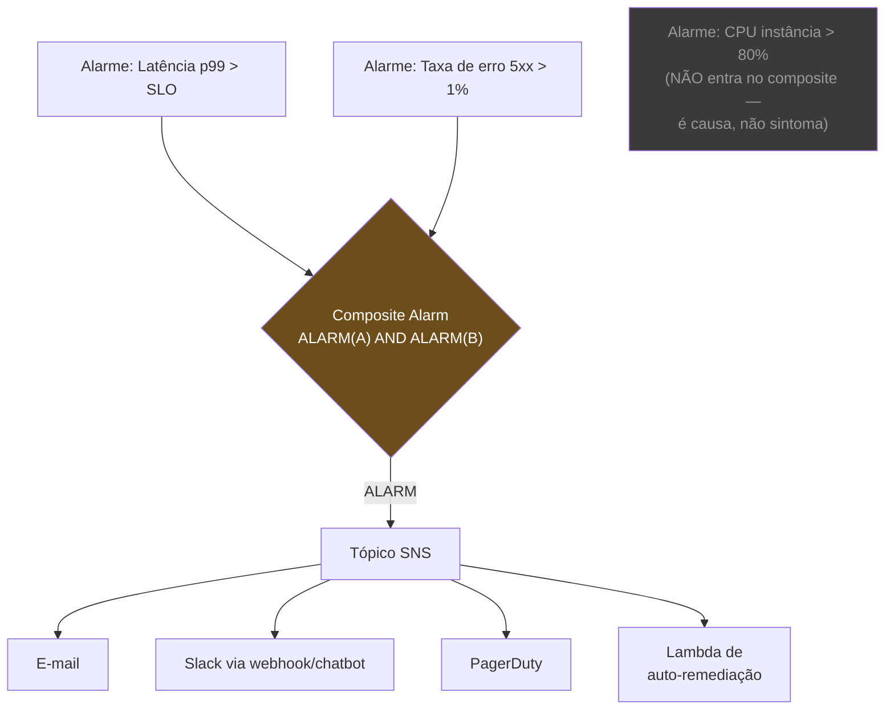
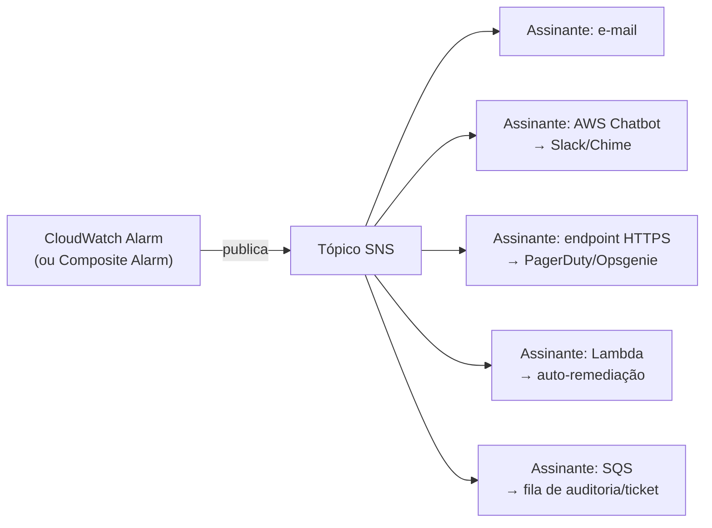

> [!abstract] TL;DR
> Coletar métrica e traço não vale nada se ninguém age quando algo quebra — e agir demais, em cada soluço interno, vale menos ainda: é assim que times param de ler alerta. Um alarme bom dispara no **sintoma que o usuário sente** (latência alta, taxa de erro, fila crescendo), não em cada causa interna possível. CloudWatch materializa isso com alarmes de métrica, *composite alarms* (combinam vários alarmes com AND/OR pra reduzir ruído) e ação de notificar via SNS — que por sua vez alimenta e-mail, Slack, PagerDuty ou aciona uma Lambda de auto-remediação. A disciplina de SLO/error budget e de resposta a incidente pertence à Engenharia de Operação; aqui é só o material bruto que a cloud oferece pra sustentá-la. A DigitalOcean, honestamente, oferece um monitoring bem mais simples: métricas de Droplet e alertas por threshold, sem composite alarms nem o mesmo leque de integrações.

## O problema: dado sem ação é decoração

As três notas anteriores deste galho resolveram "como ver": métricas e logs (nota 02), traços distribuídos (nota 03). Mas um dashboard bonito que ninguém olha às três da manhã não impede um incidente de virar prejuízo. Em algum ponto, o sistema de observabilidade precisa **acordar alguém** — ou acordar a si mesmo, via automação.

O instinto óbvio é: "vamos alarmar em tudo". CPU acima de 80%? Alarme. Memória acima de 70%? Alarme. Uma conexão de banco falhou uma vez? Alarme. O resultado previsível, depois de duas semanas de produção, é um canal do Slack — ou uma caixa de e-mail — que ninguém mais lê de verdade. Isso tem nome: **alert fatigue**. E o efeito colateral não é "um pouco de ruído a mais": é que quando o alarme *importante* dispara, ele se afoga entre os cem que não importavam, e a pessoa de plantão aprende, por reforço repetido, a ignorar a notificação antes de olhar o conteúdo.

A pergunta que separa alarme útil de alarme descartável é sempre a mesma: **isto é algo que o usuário está sentindo agora, ou é uma causa interna que talvez esteja contribuindo pra algo que o usuário vai sentir depois?**

- "P99 de latência do checkout passou de 2 segundos" — o usuário sente isso. Alarme.
- "CPU do pod 3 de 12 está em 85%" — ninguém sente isso, sozinho. Talvez seja normal sob carga, talvez o autoscaling já esteja cuidando. Não é alarme — é, no máximo, uma métrica no dashboard que alguém consulta quando *já* está investigando o alarme de sintoma.

Essa distinção — **sintoma vs. causa** — é o eixo desta nota inteira. Tudo que vem a seguir é como transformar essa distinção em configuração real: alarmes que combinam sinais pra reduzir ruído, um jeito estruturado (SLO/error budget) de decidir onde o limiar de "sentir" fica, e um caminho automático do alarme até a ação — humana ou de máquina.

## Sintoma, não causa: o filtro de todo alarme

Antes de configurar qualquer coisa, vale internalizar o teste. Para cada alarme candidato, pergunte: *se este alarme disparar às 3h da manhã e eu acordar pra olhar, o que vejo vai me dizer que algo está afetando quem usa o sistema — ou vou descobrir que era um número interno que oscilou dentro do normal?*

| Categoria | Exemplos de sintoma (alertar) | Exemplos de causa (não alertar sozinho) |
|---|---|---|
| Latência | P99 de resposta da API acima do SLO | Tempo de GC de uma instância |
| Erros | Taxa de erro 5xx do ALB acima de 1% | Uma exceção isolada num log |
| Saturação | Fila de trabalho crescendo sem parar | CPU de uma instância específica em 80% |
| Disponibilidade | Health check falhando em múltiplas AZs | Uma reinicialização isolada de container |
| Capacidade | Espaço em disco < 10% (vai faltar em breve) | Uso de memória oscilando dentro da faixa normal |

Isso não significa que métricas de causa são inúteis — elas são o primeiro lugar que você olha *depois* que o alarme de sintoma te acordou, pra entender o porquê. A diferença é between "isto me acorda" e "isto está disponível pra quando eu já estiver acordado". Confundir as duas categorias é o erro mais comum e mais caro em observabilidade de produção.

## Composite alarms: combinar sinais pra reduzir ruído

O CloudWatch permite criar um **alarme composto** (*composite alarm*) que combina o estado de vários alarmes simples usando os operadores lógicos `AND`, `OR` e `NOT`, com parênteses para agrupar. A sintaxe é uma expressão sobre funções `ALARM()`, `OK()` e `INSUFFICIENT_DATA()`, cada uma referenciando um alarme existente pelo nome:

```
(ALARM("CPUUtilizationTooHigh") OR
 ALARM("DiskReadOpsTooHigh")) AND
 OK("NetworkOutTooHigh")
```

Essa expressão só entra em `ALARM` quando CPU alta **ou** disco alto acontecem *ao mesmo tempo* que a rede está normal — útil pra distinguir "estamos sob carga real" de "estamos sofrendo um ataque de rede que está distorcendo tudo".

O ganho prático de um composite alarm não é sofisticação — é **ruído**. Considere um serviço que roda atrás de um Application Load Balancer, com um Auto Scaling Group de instâncias. Sem composite alarm, você teria alarmes individuais de latência, taxa de erro e contagem de instâncias saudáveis, cada um mandando sua própria notificação sempre que cruza o limiar — três pings pro Slack pra descrever *um* incidente. Com composite alarm, você agrupa: só notifica quando latência alta **e** taxa de erro alta disparam juntas, o que geralmente indica "o serviço está mesmo degradado" em vez de um blip isolado de uma métrica.



> [!info] Verificado em 2026-07-24 na doc oficial AWS
> A sintaxe de composite alarm (`AlarmRule` com `ALARM()`/`OK()`/`INSUFFICIENT_DATA()` e operadores `AND`/`OR`/`NOT`) e a possibilidade de disparar ação de SNS ou Lambda estão confirmadas em `docs.aws.amazon.com/AmazonCloudWatch/.../Create_Composite_Alarm.html`. Um detalhe curioso da doc: composite alarms podem formar ciclos de dependência entre si — nesse caso eles param de ser avaliados, e o jeito de destravar é forçar `AlarmRule` de um deles para `False`.

> [!tip] Assista: Create Composite Alarms in Amazon CloudWatch
> **Canal:** Amazon Web Services (oficial) | **Duração:** ~4min | **Idioma:** PT-BR (dublado/legendado)
>
> Vídeo curto e direto da própria AWS mostrando a criação de um alarme composto no console, reforçando visualmente por que agrupar alarmes filhos numa única condição reduz a sobrecarga de notificação que esta seção descreve. Trecho de destaque [00:11]: *"que é acionado somente quando as condições especificadas são atendidas, ajudando a reduzir a sobrecarga de alarmes"*
>
> 🎬 [Assistir no YouTube](https://www.youtube.com/watch?v=0LMQ-Mu-ZCY)

## SLO, SLI e error budget — de raspão

A disciplina completa de Service Level Objectives, Service Level Indicators e error budget é assunto do domínio [[03-Dominios/Engenharia/Operação/index|Operação]] — é lá que se discute como negociar um SLO com o negócio, como calcular burn rate corretamente, e como o error budget vira um mecanismo de decisão ("paramos features novas até recompor o budget?"). Aqui, o interesse é mais estreito: **como a cloud materializa esses conceitos em métrica e alarme configurável**.

Em linhas gerais: um **SLI** é uma métrica observável ("percentual de requisições respondidas em menos de 300ms"), um **SLO** é o alvo pra esse SLI ("99,9% das requisições em menos de 300ms, medido em janela de 30 dias"), e o **error budget** é o quanto de folga isso te dá (0,1% de requisições "podem" falhar o alvo antes de estourar o orçamento).

> [!tip] Assista: Aprenda de vez SLI, SLO e SLA
> **Canal:** Fabricio Veronez | **Duração:** ~10min | **Idioma:** PT-BR
>
> Fixa o vocabulário de SLI/SLO/SLA com exemplos fora do contexto AWS, útil como base conceitual antes de ver como o CloudWatch materializa isso em metric math — o que esta nota faz na sequência. Trecho de destaque [03:37]: *"então agora vamos falar do slo"* (após detalhar SLI com um exemplo de tempo de resposta)
>
> 🎬 [Assistir no YouTube](https://www.youtube.com/watch?v=JQTaWPEE80w)

No CloudWatch, isso não é um produto dedicado de SLO — é composição de métricas que já existem:

- Disponibilidade vira uma métrica calculada: `(requisições totais - requisições com erro) / requisições totais`, geralmente via **metric math** sobre as métricas de contagem do ALB ou API Gateway.
- Latência vira um alarme sobre um percentil da métrica de latência (p95, p99) já exposta pelo serviço gerenciado.
- O "burn" do error budget — quão rápido você está consumindo a folga de 0,1% — pode ser aproximado com um alarme de **taxa de mudança** (rate of change) sobre a métrica de erro, comparando janelas curtas (5 minutos, pra pegar queima rápida) e longas (1 hora, pra pegar queima lenta e sustentada). Esse é o padrão de "alerta multi-janela multi-burn-rate" que a disciplina de SRE formaliza — a mecânica de configurar duas janelas de alarme e combiná-las num composite alarm é exatamente o que a seção anterior descreveu.

```python
# Exemplo: metric math no CloudWatch pra derivar disponibilidade
# a partir de duas métricas brutas do Application Load Balancer

# m1 = RequestCount (total de requisições)
# m2 = HTTPCode_Target_5XX_Count (respostas com erro do servidor)

# Expressão de metric math:
disponibilidade = "100 * (m1 - m2) / m1"

# O alarme dispara quando a disponibilidade cai abaixo do SLO
# (ex: 99.9%) — não quando m2 sobe sozinho, porque um pico de
# tráfego total também move m2 sem necessariamente violar o SLO.
```

A DigitalOcean não tem um caminho equivalente pra compor metric math desse jeito — o monitoring de lá trabalha com métricas já prontas (CPU, memória, disco, rede do Droplet) e limiares diretos sobre elas, sem uma camada de expressão que deriva uma métrica nova a partir de outras.

Um exemplo numérico ajuda a tornar isso concreto. Suponha um SLO de 99,9% de disponibilidade medido numa janela de 30 dias, para um serviço que recebe 10 milhões de requisições por dia (300 milhões no mês). O budget de erro é 0,1% disso: 300 mil requisições "podem" falhar no mês inteiro sem violar o SLO. Isso soa como muita folga — até você perceber que, num incidente de 1 hora onde 50% das requisições falham, e o serviço processa ~416 mil requisições por hora, esse único incidente já consome cerca de 208 mil requisições de budget: **69% do orçamento mensal inteiro, numa única hora ruim**. É esse tipo de cálculo — quanto de folga um incidente específico consome — que transforma "o serviço caiu por uma hora" de um número abstrato numa decisão concreta (releasar ou não a próxima feature, escalar ou não o incidente).

### Multi-window, multi-burn-rate: por que uma janela só engana

Um detalhe que costuma pegar quem monta o primeiro alarme de error budget: uma janela única de avaliação sempre erra pra um lado ou pro outro. Se você olha só uma janela curta (5 minutos), um pico breve de erro — um deploy que reinicia pods por 90 segundos — dispara o alarme mesmo sem ameaçar o budget mensal de verdade. Se você olha só uma janela longa (1 hora ou mais), uma degradação real e rápida (queima de 10% do budget mensal em 20 minutos, por exemplo por causa de uma dependência externa fora do ar) demora demais pra acionar alguém.

A prática que a disciplina de SRE recomenda — e que dá pra montar com as peças do CloudWatch já descritas — é combinar **duas janelas com o mesmo evento**, uma curta e uma longa, num composite alarm:

```
(ALARM("ErroAlto_Janela5min") AND ALARM("ErroAlto_Janela1h"))
```

A ideia: só considerar "queima rápida e séria o suficiente pra acordar alguém" quando o sintoma aparece nas duas janelas ao mesmo tempo — a janela curta confirma que é atual, a janela longa confirma que não é um blip isolado. Isso ainda é uma aproximação manual do padrão formal de "burn rate alerting" (que normalmente usa múltiplas combinações de janela/limiar, não só duas) — o CloudWatch te dá as peças (metric math + composite alarm), mas não te dá o produto pronto de SLO que faz essa combinatória sozinho.

## Roteamento de alerta: do alarme até a pessoa (ou o script)

Um alarme que dispara e não notifica ninguém é tão inútil quanto nenhum alarme. No mundo AWS, o caminho canônico é: **alarme → tópico SNS → assinantes**. O alarme não sabe (nem precisa saber) quem vai receber a notificação — ele só publica no tópico, e cada assinante decide o que fazer com ela.



Cada tipo de assinante resolve um problema diferente:

- **E-mail** é o mais simples e o menos indicado pra incidente urgente — ninguém monitora e-mail em tempo real às 3h da manhã.
- **Slack**, via integração AWS Chatbot ou um webhook customizado, coloca o alerta onde o time já está olhando durante o expediente.
- **PagerDuty** (ou Opsgenie) é o padrão pra alerta que precisa de escalonamento garantido — se a pessoa de plantão não confirmar em X minutos, escala pra próxima. É a peça que faz a ponte entre "o CloudWatch detectou" e a disciplina de plantão que a Engenharia de Operação formaliza.
- **Lambda** é onde o alarme deixa de ser só notificação e vira **ação automática**: reiniciar uma tarefa travada, escalar manualmente um ASG além do que o auto scaling normal faria, ou girar credenciais suspeitas. Isso é chamado de auto-remediação, e é poderoso — mas também arriscado: uma Lambda de remediação mal escrita pode transformar um incidente pequeno em um grande, automaticamente e rápido demais pra alguém intervir.

O ponto de desenho importante aqui é que **o alarme não escolhe entre essas opções** — ele publica uma vez no tópico, e o tópico pode ter vários assinantes simultâneos. Um caso comum de produção: o mesmo alarme de "checkout degradado" assina, ao mesmo tempo, um endpoint PagerDuty (pra acordar o plantonista) e uma fila SQS que alimenta um sistema de ticket automático (pra já abrir o registro do incidente antes de qualquer humano tocar no teclado).

```python
# Exemplo: criar um tópico SNS com dois assinantes — PagerDuty (via
# endpoint HTTPS) e uma Lambda de remediação — usando boto3

import boto3

sns = boto3.client("sns")

topico = sns.create_topic(Name="alertas-checkout")
topic_arn = topico["TopicArn"]

# Assinante 1: endpoint HTTPS do PagerDuty (integração Events API v2)
sns.subscribe(
    TopicArn=topic_arn,
    Protocol="https",
    Endpoint="https://events.pagerduty.com/integration/<chave>/enqueue",
)

# Assinante 2: Lambda de auto-remediação
sns.subscribe(
    TopicArn=topic_arn,
    Protocol="lambda",
    Endpoint="arn:aws:lambda:us-east-1:123456789012:function:remediar-fila",
)
```

```python
# Exemplo: Lambda de auto-remediação assinada a um tópico SNS,
# acionada por um alarme de "fila crescendo sem consumo"

import boto3

sqs = boto3.client("sqs")
asg = boto3.client("autoscaling")

def lambda_handler(event, context):
    # O evento SNS chega com o payload do alarme no campo Message
    for record in event["Records"]:
        alarm_name = record["Sns"]["Subject"]

        if "QueueBacklog" in alarm_name:
            # Sintoma: fila de trabalho crescendo. Causa provável:
            # poucos workers. Remediação: escalar o ASG manualmente
            # além do que a policy normal faria, como alívio imediato.
            asg.set_desired_capacity(
                AutoScalingGroupName="workers-fila-pedidos",
                DesiredCapacity=10,
                HonorCooldown=False,
            )
```

## Alertar em serverless e event-driven: os sinais que importam

Arquiteturas orientadas a evento (o galho [[03-Dominios/Tecnologia/Cloud/13 - Mensageria e eventos gerenciados/06 - Escolher o serviço de mensageria (capstone)|Mensageria e eventos gerenciados]] cobriu os serviços) têm um conjunto próprio de sinais que merecem alarme dedicado, porque o modo de falha delas é diferente do modo de falha de um servidor tradicional: não é "a CPU explodiu", é "a mensagem ficou presa, ou foi descartada, silenciosamente".

- **Dead-letter queue (DLQ) com mensagem**: quando uma mensagem SQS falha repetidamente no processamento (ex.: um consumidor Lambda lança exceção mais vezes que o `maxReceiveCount` configurado), ela é movida pra uma fila de DLQ. Uma mensagem parada numa DLQ não gera erro visível em lugar nenhum por padrão — ela só... fica lá. O alarme certo é sobre a métrica `ApproximateNumberOfMessagesVisible` da fila de DLQ: qualquer valor acima de zero sustentado já é sintoma de que algo está falhando na ponta consumidora.
- **Idade da mensagem mais antiga**: a métrica `ApproximateAgeOfOldestMessage`, tanto na fila principal quanto na DLQ, sinaliza atraso de processamento antes mesmo de a fila "parecer" grande em contagem — uma fila com poucas mensagens, mas todas velhas, também é sintoma de consumidor travado.
- **Erros e throttles de Lambda**: as métricas `Errors` e `Throttles`, nativas de toda função Lambda, são o equivalente serverless de "taxa de erro 5xx". Um alarme sobre `Errors` acima de um limiar (em proporção às invocações, não em contagem absoluta — uma função que roda 10.000 vezes por minuto tolera mais erros absolutos que uma que roda 10) captura degradação real; um alarme sobre `Throttles` sustentado sinaliza que a concorrência reservada, ou o limite de conta, está sendo estourado.

> [!info] Verificado em 2026-07-24 na doc oficial AWS (Lambda + SQS error handling)
> `ApproximateAgeOfOldestMessage` e `NumberOfMessagesDeleted` são citadas explicitamente pela AWS como as métricas a monitorar pra detectar processamento incorreto de batch em integrações Lambda+SQS. Para a DLQ especificamente, a métrica-padrão de "tem mensagem presa" é `ApproximateNumberOfMessagesVisible` sobre a fila de DLQ — comportamento documentado do próprio SQS, não específico da integração com Lambda.

Vale reforçar por que essas métricas específicas, e não simplesmente "olhar os logs de erro do Lambda": um erro de aplicação aparece no log só se o código logar a exceção antes de relançá-la, e mesmo assim é um evento pontual — fácil de perder no volume. A métrica de fila, em contraste, é **estado acumulado**: ela não desaparece sozinha, continua ali refletindo o backlog até alguém agir, o que a torna um sinal muito mais confiável pra um alarme automático do que grep em log.

```yaml
# Exemplo: alarme sobre mensagem presa em DLQ (pseudo-CloudFormation)
DLQBacklogAlarm:
  Type: AWS::CloudWatch::Alarm
  Properties:
    AlarmName: pedidos-dlq-com-mensagem
    Namespace: AWS/SQS
    MetricName: ApproximateNumberOfMessagesVisible
    Dimensions:
      - Name: QueueName
        Value: pedidos-dlq
    Statistic: Maximum
    Period: 300
    EvaluationPeriods: 1
    Threshold: 0
    ComparisonOperator: GreaterThanThreshold
    AlarmActions:
      - !Ref TopicoAlertaSNS
```

### Detecção de anomalia como alternativa ao threshold fixo

Uma saída pro problema do "threshold estático que faz sentido só em parte do dia" (detalhado nas armadilhas mais abaixo) é a **detecção de anomalia** nativa do CloudWatch: em vez de um número fixo, você configura o alarme pra comparar o valor atual contra uma faixa esperada, calculada automaticamente a partir do histórico da própria métrica (o CloudWatch aprende o padrão — picos de manhã, vale de madrugada — e ajusta a "banda" esperada por hora do dia e dia da semana).

```yaml
# Exemplo: alarme de anomalia sobre latência, em vez de threshold fixo
AnomalyDetector:
  Type: AWS::CloudWatch::AnomalyDetector
  Properties:
    Namespace: AWS/ApplicationELB
    MetricName: TargetResponseTime
    Stat: p99
    Dimensions:
      - Name: LoadBalancer
        Value: app/checkout-alb/1234567890

LatencyAnomalyAlarm:
  Type: AWS::CloudWatch::Alarm
  Properties:
    AlarmName: checkout-latencia-anomala
    ComparisonOperator: GreaterThanUpperThreshold
    EvaluationPeriods: 3
    Metrics:
      - Id: m1
        MetricStat:
          Metric:
            Namespace: AWS/ApplicationELB
            MetricName: TargetResponseTime
          Period: 300
          Stat: p99
        ReturnData: true
      - Id: ad1
        Expression: "ANOMALY_DETECTION_BAND(m1, 2)"
        ReturnData: true
    ThresholdMetricId: ad1
```

O trade-off é honesto: detecção de anomalia precisa de histórico suficiente (a AWS recomenda ao menos algumas semanas de dado) pra o modelo aprender um padrão confiável, e ainda assim pode errar em eventos genuinamente novos (uma Black Friday, um lançamento de produto) que não se parecem com nada visto antes. Não substitui o threshold fixo em todo caso — é mais uma ferramenta na caixa, particularmente boa pra métricas com sazonalidade clara (tráfego por hora do dia) e ruim pra métricas que devem ser sempre constantes (erro deveria ser sempre perto de zero, não "dentro do padrão histórico de erro").

## Runbook e resposta: onde a cloud para

Um alarme que dispara e chega no plantonista via PagerDuty resolve metade do problema — a outra metade é "e agora, o que essa pessoa faz?". Essa é a pergunta do **runbook**: um documento (ou automação) que traduz "alarme X disparou" em passos concretos de diagnóstico e mitigação.

A cloud não oferece isso de fábrica de um jeito genérico — o mais próximo é anexar uma descrição em Markdown ao alarme do CloudWatch (útil pra deixar um link direto pro runbook visível na tela de detalhe do alarme) ou usar o AWS Systems Manager Incident Manager pra formalizar o processo de resposta com escalonamento e templates de runbook. Mas a disciplina inteira de **incident response** — como escrever um runbook bom, como conduzir um post-mortem sem culpar pessoas, como medir MTTR, como estruturar um rodízio de plantão saudável — é assunto do domínio [[03-Dominios/Engenharia/Operação/index|Operação]], não deste galho. O que fica aqui é só a ponte técnica: o alarme carrega a descrição, a descrição aponta pro runbook, o runbook mora em processo, não em infraestrutura.

```yaml
# Exemplo: alarme com descrição em Markdown apontando pro runbook —
# o link fica visível direto na tela de detalhe do alarme no console
ChekoutLatencyAlarm:
  Type: AWS::CloudWatch::Alarm
  Properties:
    AlarmName: checkout-latencia-alta
    AlarmDescription: |
      ## Latência do checkout acima do SLO

      **Impacto**: usuários levam mais de 2s pra finalizar a compra.

      **Runbook**: https://wiki.interna/runbooks/checkout-latencia

      **Primeiro passo**: checar dashboard de traços do X-Ray pro
      serviço checkout-api nos últimos 15 minutos, procurando qual
      segmento da chamada downstream está degradado.
```

## Lente AWS ↔ DigitalOcean

| Capacidade | AWS | DigitalOcean |
|---|---|---|
| Alarme de métrica com limiar | CloudWatch Alarms, granular por serviço/dimensão | Alert policies sobre métricas de Droplet/Load Balancer/Database gerenciado |
| Combinar múltiplos sinais (AND/OR) | Composite alarms nativos | Sem equivalente — cada alerta é independente |
| Métrica derivada (metric math) | Sim, expressões sobre métricas existentes | Sem equivalente — só métricas já prontas |
| Roteamento de notificação | SNS → e-mail, Slack (via Chatbot), HTTPS/PagerDuty, Lambda, SQS | Canais mais limitados: notificações diretas por e-mail/Slack por policy, sem barramento pub/sub próprio |
| Ação automática disparada por alarme | Lambda, SSM Automation, Auto Scaling | Sem mecanismo nativo de auto-remediação acionado por alerta |
| SLO/error budget como produto | Não é produto dedicado — composição de metric math + alarmes | Não existe |

> [!info] Verificado em 2026-07-24 — cobertura parcial
> A documentação pública da DigitalOcean confirma que o Monitoring é focado em métricas de Droplet (CPU, memória, disco, rede, GPU) e "resource alerts" por limiar, sem menção a composite alarms ou correlação entre alertas. Não foi possível confirmar via fetch direto a lista completa de canais de notificação suportados pelas alert policies (a página específica retornou 404 no momento da pesquisa) — o conhecimento de que email e Slack são suportados via integração vem de familiaridade geral com o produto, não de uma citação fresca da doc; vale reconferir em `docs.digitalocean.com/products/monitoring/` antes de tomar decisão de arquitetura baseada nisso.

## Azure e GCP — tradução de nomes

| Conceito | AWS | Azure | GCP |
|---|---|---|---|
| Serviço de alarme | CloudWatch Alarms | Azure Monitor Alerts | Cloud Monitoring Alerting |
| Combinar sinais | Composite Alarms | Alert Processing Rules | Alerting Policies com condições compostas |
| Barramento de notificação | SNS | Action Groups | Notification Channels |
| SLO como produto dedicado | Não (composição manual) | Não (composição manual) | **Sim** — Cloud Monitoring tem objeto nativo de SLO/SLI |
| Auto-remediação | Lambda / SSM Automation | Azure Automation Runbooks / Logic Apps | Cloud Functions / Workflows |

Vale registrar: o GCP é, dos três grandes provedores, o único com um objeto de **SLO nativo** no Cloud Monitoring — você declara o SLI, o alvo e a janela, e o próprio serviço calcula o burn rate. É uma diferença real de produto, não só de nome, mas cavar mais fundo nisso foge do escopo desta trilha centrada em AWS/DigitalOcean.

> [!warning] Armadilhas
> - **Alertar em causa, não em sintoma.** CPU alta, sozinha, raramente é o problema — é sintoma de outro sintoma. Alarme demais nessas métricas internas é a receita mais comum de alert fatigue.
> - **Threshold estático numa carga que varia.** Um limiar fixo de "latência > 500ms" que faz sentido às 3h da manhã pode ser normal ao meio-dia sob pico de tráfego, e vice-versa. Alarmes baseados em anomalia (CloudWatch tem detecção de anomalia nativa, comparando com um baseline histórico) resolvem parte disso — mas exigem volume de dado histórico suficiente pra o baseline ser confiável.
> - **DLQ sem alarme é uma DLQ inútil.** É comum configurar a dead-letter queue corretamente e esquecer de alarmar sobre ela — a arquitetura "funciona" (nada quebra visivelmente), mas mensagens ficam se acumulando silenciosamente até alguém notar, dias depois, que um cliente nunca recebeu a confirmação do pedido.
> - **Lambda de auto-remediação sem circuito de segurança.** Uma remediação automática que reage a um alarme com uma ação drástica (escalar, reiniciar, deletar) pode, sob um alarme "flapping" (oscilando entre OK e ALARM), disparar repetidamente e piorar o incidente. Vale sempre um limite de taxa ou uma checagem de "já remediei isso nos últimos N minutos?" antes de agir de novo.
> - **Composite alarm em ciclo.** A própria AWS documenta que composite alarms podem formar dependência circular entre si — nesse estado eles simplesmente param de ser avaliados, silenciosamente, até alguém notar e quebrar o ciclo à mão.

## O que vem a seguir

A próxima nota deste galho olha pro que muda quando o workload é serverless — Lambda, API Gateway, Step Functions — e o que continua sendo específico de cada provedor versus o que o OpenTelemetry padroniza entre eles. O capstone do galho, na sequência, junta CloudWatch, X-Ray e os alarmes desta nota numa arquitetura única de observabilidade operada de ponta a ponta.

## Fontes

- AWS. *Create a composite alarm*. https://docs.aws.amazon.com/AmazonCloudWatch/latest/monitoring/Create_Composite_Alarm.html
- AWS. *Handling errors for an SQS event source in Lambda*. https://docs.aws.amazon.com/lambda/latest/dg/services-sqs-errorhandling.html
- AWS. *Amazon SQS dead-letter queues*. https://docs.aws.amazon.com/AmazonSQS/latest/dg/sqs-dead-letter-queues.html
- DigitalOcean. *Monitoring*. https://docs.digitalocean.com/products/monitoring/
- AWS. *PutCompositeAlarm — API Reference*. https://docs.aws.amazon.com/AmazonCloudWatch/latest/APIReference/API_PutCompositeAlarm.html
