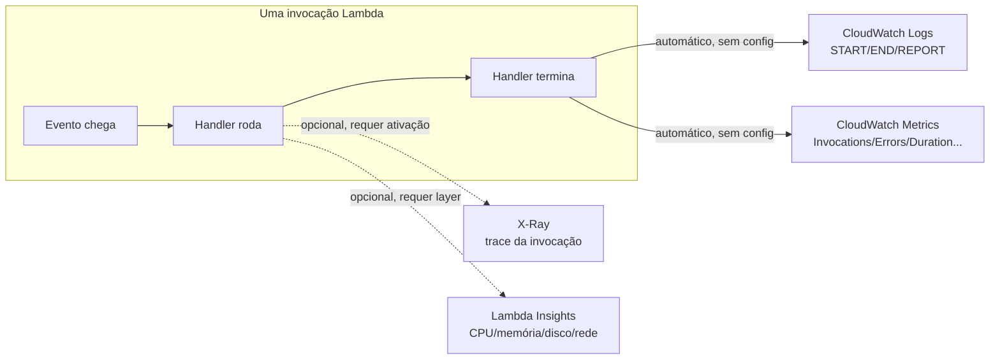
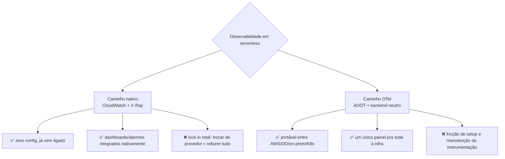

> [!abstract] TL;DR
> Em serverless não existe host pra logar em disco nem `ssh` pra rodar um `top` — a função nasce, roda alguns milissegundos e morre num sandbox que você nunca vê. Toda a observabilidade acontece por fora: a AWS empurra logs e métricas automaticamente pro CloudWatch (e traços opcionais pro X-Ray), sem você configurar nada. Isso é conveniente e é uma armadilha: quanto mais você depende do CloudWatch/X-Ray nativos, mais a sua stack de observabilidade fica amarrada à AWS. A saída portável é instrumentar com OpenTelemetry e logs estruturados com correlation id, mandando os dados pra um backend neutro. E a DigitalOcean, aqui, é dura de admitir: Functions não tem equivalente ao Lambda Insights nem ao X-Ray — o monitoring é básico.

## O problema: observar uma caixa que só existe por 100ms

Imagine que você está debugando um servidor tradicional. Ele trava? Você entra por SSH, roda `top`, olha os logs em `/var/log`, talvez anexe um profiler. O host é seu, e ele existe o tempo todo — você pode inspecioná-lo a qualquer momento.

Agora imagine debugar uma função Lambda. Ela não tem host seu. Ela roda dentro de uma microVM Firecracker que a AWS gerencia, que existe por alguns segundos (às vezes menos), processa um evento, e ou fica "quente" esperando a próxima invocação ou é congelada/destruída. Não existe disco persistente pra logar. Não existe `ssh` pra entrar. Não existe processo rodando entre invocações pra você inspecionar com calma.

Isso não é um detalhe menor — é a característica definidora de observar serverless: **você não pode ir até a caixa, a caixa tem que vir até você**. E é exatamente isso que a AWS resolve por padrão: toda invocação de Lambda manda logs e métricas automaticamente pro CloudWatch, sem nenhuma configuração extra da sua parte (WebFetch, docs.aws.amazon.com, verificado 2026-07-24). Você não escolhe *se* quer observabilidade básica — ela já vem ligada. A pergunta interessante é o que fazer *além* dela, e a que preço (em dólares e em lock-in).

Esta nota fecha o Bloco 4 do galho aplicando as ferramentas de [[03-Dominios/Tecnologia/Cloud/17 - Observabilidade na cloud/02 - CloudWatch a fundo|CloudWatch]] e [[03-Dominios/Tecnologia/Cloud/17 - Observabilidade na cloud/03 - Tracing distribuído|Tracing distribuído]] ao caso mais opaco de todos — a função sem servidor — e depois puxa o fio até a decisão de arquitetura que atravessa toda a disciplina: nativo vs. portável.

## Mecanismo: o que a AWS te dá de graça em Lambda

### Logs automáticos: START, END, REPORT

Toda função Lambda tem um log group no CloudWatch Logs criado automaticamente, nomeado `/aws/lambda/{nome-da-função}` (WebFetch, docs.aws.amazon.com, verificado 2026-07-24). Cada invocação gera, no mínimo, três linhas de sistema — independente de você escrever um `print` ou `console.log` sequer:

```text
START RequestId: 3f2504e0-4f89-11e8-a1c0-e3b3e0e5a3f9 Version: $LATEST
[qualquer log que sua função emitir vai aqui]
END RequestId: 3f2504e0-4f89-11e8-a1c0-e3b3e0e5a3f9
REPORT RequestId: 3f2504e0-4f89-11e8-a1c0-e3b3e0e5a3f9
    Duration: 182.45 ms
    Billed Duration: 183 ms
    Memory Size: 256 MB
    Max Memory Used: 98 MB
    Init Duration: 412.31 ms
```

A linha `REPORT` é a mais valiosa das três e vale a pena aprender a ler de olho fechado:

- **`Duration`** — quanto tempo o handler rodou de fato.
- **`Billed Duration`** — quanto você paga (arredondado, historicamente pra cima em incrementos de 1ms).
- **`Memory Size`** — o que você configurou.
- **`Max Memory Used`** — o que a função realmente usou. Se está perto do limite configurado, é sinal de que você está um passo de um `OutOfMemory`.
- **`Init Duration`** — só aparece quando houve *cold start*. É o tempo gasto inicializando o runtime e rodando código fora do handler antes da primeira invocação.

Esse `Init Duration` é o elo direto com [[03-Dominios/Tecnologia/Cloud/11 - Serverless e FaaS — Lambda a fundo/04 - Cold start, concurrency e performance|cold start, concurrency e performance]]: lá você aprendeu *por que* cold start acontece (nova microVM, novo runtime, código de inicialização rodando pela primeira vez); aqui você aprende *onde* ele fica visível — direto na linha REPORT, sem precisar instrumentar nada. Se você filtra os logs de uma função por `Init Duration` existente, está literalmente contando cold starts.

### Métricas automáticas: sem configurar nada

Junto dos logs, a Lambda manda métricas pro CloudWatch a cada invocação, em intervalos de 1 minuto, também sem custo adicional e sem permissão extra na execution role (WebFetch, docs.aws.amazon.com, verificado 2026-07-24). As principais:

| Métrica | O que mede |
|---|---|
| `Invocations` | Quantas vezes a função foi chamada |
| `Errors` | Invocações que terminaram com exceção não tratada |
| `Duration` | Tempo de execução (p50/p90/p99 via CloudWatch) |
| `Throttles` | Invocações rejeitadas por falta de concorrência disponível |
| `ConcurrentExecutions` | Quantas instâncias da função estão rodando ao mesmo tempo |
| `IteratorAge` | (event source mappings tipo Kinesis/DynamoDB Streams) atraso de processamento |
| `DeadLetterErrors` | Falhas ao mandar evento pra dead-letter queue |

Isso é o suficiente pra um alarme básico de "a taxa de erro passou de X%" ou "estamos sendo throttled", sem escrever uma linha de instrumentação. É também exatamente o tipo de métrica que alimenta os alarmes vistos em [[03-Dominios/Tecnologia/Cloud/17 - Observabilidade na cloud/04 - Alarmes, SLO e resposta|Alarmes, SLO e resposta]] — só que aqui a fonte é 100% gerenciada pelo provedor, sem um agente seu rodando em lugar nenhum.



### Lambda Insights: quando REPORT não basta

A linha REPORT te dá memória e duração — mas não CPU, não disco, não rede, e não separa "cold start" de "worker shutdown" de forma explícita. Pra isso existe o **CloudWatch Lambda Insights**: uma extensão Lambda distribuída como layer, que coleta métricas de sistema (CPU, memória, disco, rede) e emite um evento de log estruturado por invocação usando *embedded metric format* — o CloudWatch extrai as métricas direto do log, sem você publicar nada manualmente (WebFetch, docs.aws.amazon.com, verificado 2026-07-24).

> [!info] Verificado 2026-07-24
> Lambda Insights só é suportado em runtimes Amazon Linux 2 e Amazon Linux 2023, e você paga pelo tempo de execução consumido pela extensão (em incrementos de 1ms) além do custo normal de métricas/logs do CloudWatch. Confira o pricing atualizado antes de ligar em produção — preços de CloudWatch mudam.

Ativar é literalmente anexar uma layer publicada pela AWS à função — não exige mudar código. O ganho é visibilidade de sistema operacional (útil pra achar função morrendo por falta de memória de verdade, não só o `Max Memory Used` da REPORT) e diagnóstico automático de cold start / shutdown do worker.

### Tracing: X-Ray, e o preço do lock-in

O [[03-Dominios/Tecnologia/Cloud/17 - Observabilidade na cloud/03 - Tracing distribuído|Tracing distribuído]] já cobriu o conceito de trace/span; aqui o que importa é como ele chega em Lambda especificamente. Com **Active tracing** ligado (um toggle na configuração da função, ou `TracingConfig: Mode: Active` no CloudFormation), a Lambda cria automaticamente segmentos de trace pra cada invocação e manda pro X-Ray — cobrindo tanto o tempo gasto pela AWS preparando o ambiente de execução (`AWS::Lambda`) quanto o tempo do seu código (`AWS::Lambda::Function`) (WebFetch, docs.aws.amazon.com, verificado 2026-07-24). Sem Active tracing, a Lambda fica em modo `PassThrough` — só repassa o header de rastreamento adiante, sem gerar traço.

A amostragem do X-Ray não é configurável em Lambda: 1 requisição por segundo garantida, mais 5% do excedente. Isso é ótimo pra achar padrões, péssimo se você precisa garantir que *aquela* requisição específica de um cliente foi traçada.

Aqui mora a primeira decisão de lock-in real da nota: X-Ray é um serviço 100% AWS. O formato de trace, o SDK, o console — tudo amarrado. A alternativa é a **ADOT (AWS Distro for OpenTelemetry)**, uma distribuição da AWS do OpenTelemetry empacotada como layer: você seta uma variável de ambiente (`AWS_LAMBDA_EXEC_WRAPPER=/opt/otel-instrument`) e a instrumentação acontece automaticamente, sem tocar no código (WebFetch, aws-otel.github.io, verificado 2026-07-24). Por padrão a ADOT ainda manda os traços pro X-Ray via um agente embutido — mas você pode reconfigurar o exportador OTLP pra mandar pra qualquer backend compatível: Grafana Tempo, Honeycomb, Datadog, o que for. É a mesma instrumentação, o destino é que muda.

## A decisão de lock-in: nativo cômodo vs. OTel neutro

Chegamos ao cerne da nota. Existem duas filosofias pra observar serverless, e elas não são mutuamente exclusivas — mas a proporção entre elas é uma escolha de arquitetura, não um detalhe de implementação.

**Caminho 1 — nativo**: você usa CloudWatch Logs + CloudWatch Metrics + X-Ray como vieram, sem adicionar nada. É zero fricção: já está ligado, os dashboards do console funcionam sem configuração, os alarmes se integram direto com SNS/EventBridge. O custo é que sua observabilidade *é* a AWS — trocar de provedor, ou até só rodar um ambiente híbrido, significa reconstruir dashboards, alarmes e queries do zero em outro lugar.

**Caminho 2 — OTel + backend neutro**: você instrumenta com OpenTelemetry (via ADOT layer, ou SDK direto na função), emite logs estruturados em JSON com um `correlation_id`/`trace_id` em cada linha, e manda tudo — métricas, logs, traços — pra um backend que não é da AWS: Grafana Cloud, Honeycomb, Datadog, ou um stack self-hosted (Prometheus/Grafana/Loki/Tempo — esse é território do domínio de Operação, que trata observabilidade como *disciplina* de SRE em vez de *stack de provedor*; se você trabalhou o galho equivalente em Java, é o mesmo território de "operar a stack"). O custo é fricção inicial: você tem que configurar o exportador, manter a instrumentação, e às vezes reimplementar no backend externo coisas que o console da AWS te dava de graça.

Não existe resposta universal. Um time pequeno, 100% AWS, sem plano de migrar — o nativo é a escolha racional; reinventar OTel + Grafana só pra "não ficar preso" é over-engineering. Um time que já opera multi-cloud, ou que quer um único painel pra observar Lambda *e* uma frota de VMs na DigitalOcean *e* um cluster Kubernetes em outro lugar — aí o custo de manter três stacks de observabilidade nativas supera o custo de padronizar em OTel.



O structured logging com correlation id é o ponto de entrada mais barato pro caminho portável, mesmo que você ainda mande tudo pro CloudWatch: emitir logs em JSON, com um campo `request_id`/`correlation_id` consistente entre serviços, deixa a *estrutura* pronta pra migrar de backend depois sem reescrever a instrumentação da aplicação — só troca pra onde os dados vão.

```python
import json
import logging
import time

logger = logging.getLogger()
logger.setLevel(logging.INFO)

def handler(event, context):
    correlation_id = event.get("headers", {}).get("x-correlation-id", context.aws_request_id)
    start = time.time()

    log = {
        "level": "INFO",
        "correlation_id": correlation_id,
        "request_id": context.aws_request_id,
        "function": context.function_name,
        "message": "processando pedido",
        "event_type": event.get("type", "unknown"),
    }
    logger.info(json.dumps(log))

    # ... lógica da função ...

    log_end = {
        "level": "INFO",
        "correlation_id": correlation_id,
        "request_id": context.aws_request_id,
        "message": "pedido concluído",
        "duration_ms": round((time.time() - start) * 1000, 2),
    }
    logger.info(json.dumps(log_end))

    return {"statusCode": 200}
```

Cada linha vira um evento JSON pesquisável no CloudWatch Logs Insights — mas o formato é o mesmo formato que qualquer backend de logs estruturados (Loki, Elasticsearch, Datadog) sabe consumir. É a definição prática de "portável": não é *onde* está, é *o formato ser independente de onde está*.

## Casos práticos

### Filtrando cold starts direto do CloudWatch

Um jeito rápido de medir quantos cold starts sua função sofreu num período, sem instrumentar nada, é filtrar os logs pela presença de `Init Duration`:

```bash
aws logs filter-log-events \
  --log-group-name /aws/lambda/minha-funcao \
  --filter-pattern "Init Duration" \
  --start-time $(date -d '1 hour ago' +%s000)
```

Cada linha retornada é uma invocação que sofreu cold start. Contar quantas vezes isso aparece dividido pelo total de invocações no mesmo período te dá a taxa de cold start — sem X-Ray, sem Lambda Insights, só lendo o que já está lá.

### CloudWatch Logs Insights pra achar a REPORT mais lenta

```sql
fields @timestamp, @duration, @billedDuration, @maxMemoryUsed, @initDuration
| filter @type = "REPORT"
| sort @duration desc
| limit 20
```

Essa query varre as linhas REPORT (que o CloudWatch já parseia automaticamente em campos como `@duration` e `@maxMemoryUsed`) e devolve as 20 invocações mais lentas do período consultado — útil pra achar outliers de performance sem precisar de tracing distribuído completo.

## Custo: a armadilha de logar demais em escala

Aqui está o ponto que mais gente atropela em produção: **cada invocação Lambda que emite logs gera cobrança de CloudWatch Logs por ingestão e armazenamento** — não há cobrança adicional só por *usar* Lambda com logging automático, mas o volume de dados que entra no CloudWatch Logs é cobrado pelo padrão normal de CloudWatch Logs (WebFetch, docs.aws.amazon.com, verificado 2026-07-24).

Isso parece inofensivo até você multiplicar por escala real. Uma função invocada 10 milhões de vezes por dia, com 5 linhas de log por invocação e 200 bytes por linha, gera 10 GB de logs por dia só de uma função. Multiplique por dezenas de funções num sistema serverless real, e a fatura de CloudWatch Logs pode ultrapassar o custo de execução da própria Lambda — a parte "computação" fica barata, a parte "onde os logs foram parar" fica cara.

> [!warning] Armadilhas
> - **Logar em nível DEBUG em produção, pra sempre.** Cada linha extra em milhões de invocações vira dinheiro real. Log level configurável e amostragem de logs verbosos são disciplina básica em serverless, não luxo.
> - **Não configurar retenção do log group.** Por padrão, log groups do CloudWatch retêm logs indefinidamente — cada dia que passa acumula custo de armazenamento sem revisão. Definir uma política de retenção (7, 30, 90 dias, conforme necessidade de auditoria) é o primeiro ajuste de custo que qualquer conta AWS séria faz.
> - **Achar que Lambda Insights é "de graça" porque a função já é serverless.** É um custo adicional real, cobrado por tempo de execução da extensão — pequeno por invocação, mas soma em escala.
> - **Confundir amostragem do X-Ray com cobertura total.** 1 req/s + 5% do resto não garante que a invocação problemática do cliente específico foi traçada. Pra depuração pontual, forçar a amostragem (`aws-xray-sdk` com decisão manual) ou logar o `trace_id` explicitamente no log estruturado resolve esse buraco.
> - **Achar que instrumentar com OTel elimina o lock-in de X-Ray retroativamente.** Se metade do código já depende de anotações/SDK do X-Ray, migrar pra ADOT/OTel é refatoração, não só troca de exportador.

## A honestidade da DigitalOcean: monitoring básico, sem X-Ray

Se o Bloco 3 já deixou claro que DO Functions é mais simples que Lambda, a observabilidade escancara essa diferença ainda mais. A DigitalOcean oferece monitoring de infraestrutura tradicional — métricas de Droplet (CPU, memória, disco, rede) e alertas configuráveis por threshold — mas isso serve pra VMs, não pra Functions. Pra Functions especificamente, a superfície documentada de observabilidade se resume a logs de execução e forwarding de logs pra sistemas externos; não há um equivalente documentado a métricas granulares automáticas por invocação (tipo `Duration`/`Throttles`/`ConcurrentExecutions`), a um Lambda Insights, ou a um X-Ray nativo.

Isso não é um detalhe pequeno — é uma diferença de categoria. Se você está rodando cargas críticas em DO Functions e precisa da mesma profundidade de observabilidade que Lambda oferece de fábrica, a resposta honesta é: você vai ter que construir isso por fora, tipicamente exportando logs pra um backend externo (Grafana Cloud, Datadog, um Loki self-hosted) e aceitando que não vai ter tracing automático nativo do provedor. É exatamente aqui que o caminho OTel deixa de ser "opcional pra evitar lock-in" e vira "a única forma de ter paridade decente" — na DO, portabilidade não é escolha filosófica, é necessidade prática.

| Capacidade | AWS Lambda | DigitalOcean Functions |
|---|---|---|
| Logs automáticos por invocação | Sim (CloudWatch Logs, log group por função) | Sim (logs de execução) |
| Métricas automáticas por invocação (invocations/errors/duration/throttles) | Sim, sem config, sem custo extra | Não documentado com essa granularidade |
| Extensão de métricas de sistema (CPU/memória/disco) | Sim (Lambda Insights) | Sem equivalente documentado |
| Tracing distribuído nativo do provedor | Sim (X-Ray, Active tracing) | Sem equivalente documentado |
| Forwarding de logs pra sistema externo | Sim (via subscription filter no CloudWatch Logs, ou Firehose) | Sim (feature documentada de log forwarding) |
| Instrumentação OpenTelemetry oficial do provedor | Sim (ADOT layer, plug-and-play) | Não documentado como oferta oficial |

## Azure e GCP: os nomes, pra tradução mental

| Conceito | AWS | DigitalOcean | Azure | GCP |
|---|---|---|---|---|
| Logs automáticos de função serverless | CloudWatch Logs | Logs de execução (Functions) | Application Insights / Azure Monitor Logs | Cloud Logging |
| Métricas de função | CloudWatch Metrics | — (não documentado) | Azure Monitor Metrics | Cloud Monitoring |
| Tracing distribuído nativo | X-Ray | — (não documentado) | Application Insights (distributed tracing) | Cloud Trace |
| Instrumentação OTel oficial do provedor | ADOT (AWS Distro for OpenTelemetry) | — | Azure Monitor OpenTelemetry Distro | OpenTelemetry (Cloud Operations) |

## O que vem a seguir

Esta nota fechou o olhar sobre serverless — o ambiente mais opaco, onde tudo depende do que o provedor te empurra automaticamente. A próxima nota do galho é o capstone: junta CloudWatch, tracing, alarmes/SLO e o que foi visto aqui numa arquitetura de observabilidade completa, fim a fim, pra um sistema distribuído real — a pergunta de "o que instrumentar, o que nativo, o que portável" respondida em conjunto, não serviço por serviço.

Vale reforçar a fronteira que atravessou a nota inteira: aqui o assunto foi *stack de provedor* — o que a AWS/DO te dão e o que é específico de cada nuvem. A disciplina de observabilidade como prática de engenharia — SLO, error budget, on-call, postmortem, a filosofia de operar um stack self-hosted como Prometheus/Grafana/Loki/Tempo em produção — pertence ao domínio de Operação, tratado à parte deste galho.

## Fontes

- AWS. "Using CloudWatch metrics with Lambda." https://docs.aws.amazon.com/lambda/latest/dg/monitoring-metrics.html
- AWS. "Sending Lambda function logs to CloudWatch Logs." https://docs.aws.amazon.com/lambda/latest/dg/monitoring-cloudwatchlogs.html
- AWS. "Lambda Insights." https://docs.aws.amazon.com/AmazonCloudWatch/latest/monitoring/Lambda-Insights.html
- AWS. "Visualize Lambda function invocations using AWS X-Ray." https://docs.aws.amazon.com/lambda/latest/dg/lambda-x-ray.html
- AWS Distro for OpenTelemetry. "Lambda instrumentation." https://aws-otel.github.io/docs/getting-started/lambda
- AWS. "Amazon CloudWatch Pricing." https://aws.amazon.com/cloudwatch/pricing/
- DigitalOcean. "DigitalOcean Functions documentation." https://docs.digitalocean.com/products/functions/
