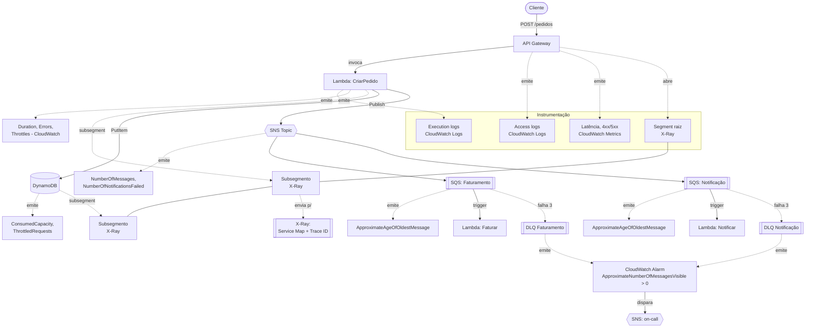
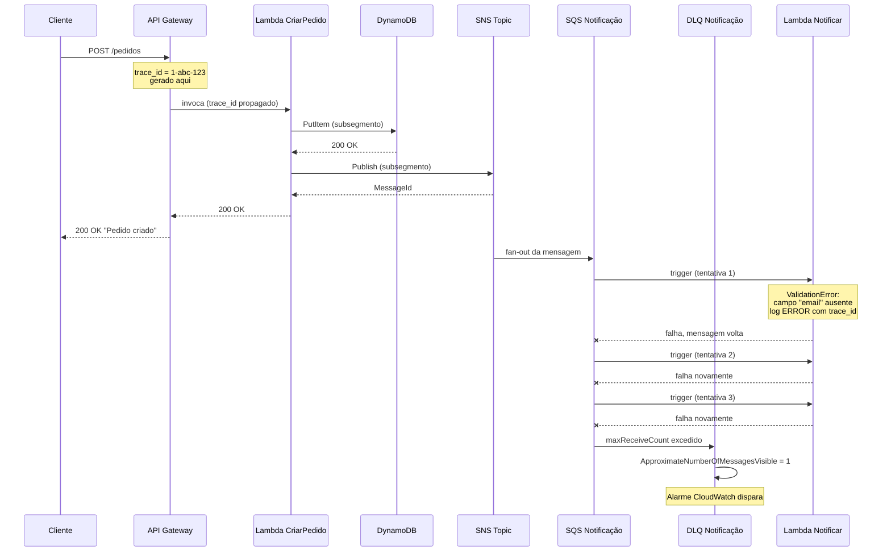

> [!abstract] TL;DR
> A arquitetura serverless de referência do galho 15 tem cinco peças distribuídas — API Gateway, Lambda, DynamoDB, SQS, SNS — e nenhuma delas, sozinha, sabe contar a história de um pedido que se perdeu. Instrumentar essa arquitetura significa decidir, peça por peça, o que logar, o que medir e o que tracear, e depois costurar as três coisas com um `trace_id` que atravessa tudo. Este capstone pega o "pedido perdido" do galho 15 e o rastreia ponta a ponta — não como exercício acadêmico, mas como o que você realmente faz às 3 da manhã quando o pager toca. Fecha com a escolha que toda equipe madura enfrenta: nativo (CloudWatch/X-Ray), OpenTelemetry portável, ou SaaS terceirizado — e com a fronteira honesta entre o que a AWS oferece de fábrica e o que a DigitalOcean deixa para você montar.

## O problema: um sistema que você não pode abrir

Volte à arquitetura do galho 15: um cliente faz `POST /pedidos`, o API Gateway invoca uma Lambda, que grava no DynamoDB e publica num tópico SNS, que fan-out para duas filas SQS — uma para faturamento, outra para notificação. Cada seta desse diagrama é uma fronteira de processo, de conta de billing, às vezes de região. Quando um pedido "some" — o cliente recebe 200 mas nunca chega e-mail de confirmação — onde ele morreu?

Num monólito, a resposta está num stack trace. Numa arquitetura distribuída, a resposta está espalhada em seis serviços diferentes, cada um com seu próprio log group, sua própria métrica, seu próprio conceito de "deu erro". Sem instrumentação deliberada, você não tem um sistema opaco — você tem seis sistemas opacos que fingem ser um.

É aqui que os três pilares — logs, métricas, traces — deixam de ser conceito de nota isolada e viram engenharia de sistema: cada peça da arquitetura precisa emitir os três, e os três precisam ser correlacionáveis pelo mesmo `trace_id`. Isso já foi explicado peça a peça nas notas anteriores do galho — [[03-Dominios/Tecnologia/Cloud/17 - Observabilidade na cloud/02 - CloudWatch a fundo|CloudWatch a fundo]] e [[03-Dominios/Tecnologia/Cloud/17 - Observabilidade na cloud/03 - Tracing distribuído|Tracing distribuído]] — o que falta é ver as peças remontadas num sistema real.

## A arquitetura instrumentada

Pegue a arquitetura de referência do [[03-Dominios/Tecnologia/Cloud/15 - Arquiteturas serverless e event-driven/06 - Arquitetura serverless de referência (capstone do Bloco 3)|capstone do Bloco 3]] e desenhe por cima dela o que cada peça emite:



O diagrama parece denso porque *é* denso — essa é a primeira lição do capstone. Instrumentar não é "ligar uma flag": é decidir, serviço a serviço, quais dos três pilares valem o custo ali. API Gateway e Lambda quase sempre emitem os três. Uma fila SQS, por natureza, não tem "log de execução" — o que ela expõe é métrica (idade da mensagem mais antiga, tamanho da fila) e, indiretamente, o subsegmento de trace de quem a consome. Nem toda peça é igual, e tratar todas como se fossem é o primeiro anti-padrão que este capstone vai nomear mais à frente.

Se você ainda não tem fresco na cabeça como CloudWatch Logs/Metrics e X-Ray funcionam isoladamente, vale revisitar [[03-Dominios/Tecnologia/Cloud/17 - Observabilidade na cloud/02 - CloudWatch a fundo|CloudWatch a fundo]] e [[03-Dominios/Tecnologia/Cloud/17 - Observabilidade na cloud/03 - Tracing distribuído|Tracing distribuído]] antes de seguir — este capstone assume que as peças individuais já são familiares e foca em como elas se encaixam.

Vale traduzir o diagrama numa tabela peça-por-peça, porque é aqui que a decisão "o que instrumentar em cada serviço" fica concreta:

| Peça | Log | Métrica | Trace |
|---|---|---|---|
| API Gateway | Access log (formato configurável) | Latência, contagem 4xx/5xx | Abre o segmento raiz se `Tracing: Active` |
| Lambda | Execution log via `print`/logger estruturado | `Duration`, `Errors`, `Throttles`, `ConcurrentExecutions` | Subsegmento automático + subsegmentos manuais para chamadas a downstream |
| DynamoDB | Não expõe log de acesso por padrão (precisa CloudTrail data events) | `ConsumedReadCapacityUnits`, `ThrottledRequests` | Subsegmento gerado pelo SDK X-Ray quando a Lambda chama via cliente instrumentado |
| SNS | Log de entrega de mensagem (opcional, por tópico) | `NumberOfMessagesPublished`, `NumberOfNotificationsFailed` | Não gera segmento próprio — aparece como aresta no service map |
| SQS | Não tem log próprio | `ApproximateNumberOfMessagesVisible`, `ApproximateAgeOfOldestMessage` | Não gera segmento próprio — o consumidor (Lambda) é quem trace |

A leitura dessa tabela é o ponto central da seção seguinte: nem toda peça tem os três pilares disponíveis, e forçar um pilar onde ele não existe naturalmente (como tentar "logar" uma fila SQS) é gastar esforço num lugar que não vai te ajudar.

## A estratégia dos três pilares numa arquitetura real

A pergunta errada é "devo logar, medir e tracear tudo?". A pergunta certa é "o que cada pilar me dá que os outros dois não dão, e quanto isso custa?".

**Logs** respondem "o que aconteceu, em detalhe, neste evento específico". São o pilar mais caro em volume — cada invocação de Lambda que loga um payload JSON de 2 KB, multiplicada por milhões de invocações por mês, vira armazenamento e ingestão reais no CloudWatch Logs. A estratégia madura é log estruturado (JSON, não texto livre) com nível controlado: `ERROR` sempre, `INFO` em pontos de decisão de negócio (pedido criado, pagamento aprovado), `DEBUG` desligado em produção por padrão e ligado sob demanda via variável de ambiente.

**Métricas** respondem "como o sistema está se comportando, agregado, ao longo do tempo". São baratas e são a base dos alarmes — você não abre um alarme em cima de um log, abre em cima de uma métrica. Toda peça da arquitetura já emite métricas de infraestrutura de graça (Lambda `Duration`/`Errors`/`Throttles`, DynamoDB `ThrottledRequests`, SQS `ApproximateAgeOfOldestMessage`). O trabalho deliberado é emitir métricas de *negócio* por cima — "pedidos criados por minuto", "taxa de pagamento recusado" — porque a infraestrutura nunca vai te contar isso sozinha.

**Traces** respondem "por onde esta requisição específica passou, e onde ela gastou tempo". São o pilar mais caro por unidade de instrumentação (cada chamada ao SDK X-Ray, cada segmento) mas o único que reconstrói a jornada ponta a ponta sem você juntar manualmente logs de seis serviços diferentes. A decisão que mais afeta o custo aqui é sampling — instrumentar 100% do tráfego em produção geralmente não vale o custo; amostrar 5-10% com regra especial para erros costuma bastar.

| Pilar | Responde | Custo típico | Base do alarme? |
|---|---|---|---|
| Logs | "O que aconteceu exatamente aqui?" | Alto (volume × retenção) | Raramente direto (via Logs Insights/filtro de métrica) |
| Métricas | "Como o sistema está, agregado?" | Baixo | Sim — é a moeda nativa do CloudWatch Alarms |
| Traces | "Por onde esta requisição passou?" | Médio-alto (por segmento, com sampling) | Não diretamente — mas alimenta o service map que guia a investigação |

> [!info] Verificado 2026-07-24
> A regra de sampling padrão do X-Ray SDK é: 1 requisição por segundo garantida (reservoir) + 5% de qualquer requisição adicional além disso (rate). Ambos os valores são configuráveis por regra no console do X-Ray/CloudWatch. Fonte: docs.aws.amazon.com/xray/latest/devguide/xray-console-sampling.html.

Na prática, isso significa escrever o log já pensando na correlação, não como um `console.log` avulso. O `trace_id` que o X-Ray gera (ou que o API Gateway propaga via header `X-Amzn-Trace-Id`) precisa estar em *todo* log estruturado que a requisição toca, do início ao fim:

```json
{
  "timestamp": "2026-07-24T03:14:07.221Z",
  "level": "ERROR",
  "service": "notificar-pedido",
  "trace_id": "1-64f8a1c2-3f7b8e9a1c2d4e5f6a7b8c9d",
  "pedido_id": "ped_9f3a2b1c",
  "message": "ValidationError: campo \"email\" ausente",
  "attempt": 3,
  "queue": "notificacao-dlq"
}
```

Note o que esse log *não* tem: o corpo completo do pedido, dados de cartão, endereço. Log estruturado não é "despeje tudo em JSON" — é escolher os campos que servem à correlação (`trace_id`, `pedido_id`) e ao diagnóstico (`message`, `attempt`), sem virar um dump de PII que depois vira problema de conformidade. Essa fronteira — o que é observabilidade legítima e o que é coleta de dados sensível demais — reaparece com mais peso no próximo galho, sobre segurança.

## O caso: rastreando o pedido perdido

Volte ao incidente do galho 15: um cliente reclama que fez um pedido, recebeu confirmação na tela, mas nunca recebeu o e-mail de notificação. Sem instrumentação correlacionada, isso é um mistério. Com ela, é uma investigação de cinco minutos.



A reconstrução real segue três passos, um por pilar:

1. **Métrica primeiro.** O alarme de `ApproximateNumberOfMessagesVisible > 0` na DLQ de notificação dispara e notifica o on-call via SNS. Isso já é a resposta pra "algo quebrou" — sem ele, ninguém saberia até o cliente reclamar de novo.
2. **Log para achar o `trace_id`.** Você abre a DLQ, pega o corpo da mensagem presa — que contém o `MessageId` do SNS original — e busca no CloudWatch Logs Insights pelo log estruturado da Lambda `CriarPedido` que publicou aquela mensagem. O log traz o `trace_id` gerado pelo API Gateway na requisição original. Uma query típica de Logs Insights nesse ponto:

```sql
fields @timestamp, @message, trace_id, pedido_id
| filter service = "notificar-pedido" and level = "ERROR"
| filter @timestamp > ago(1h)
| sort @timestamp desc
| limit 20
```

3. **Trace para ver a jornada completa.** Com o `trace_id` em mãos, você abre o service map do X-Ray e vê exatamente onde a árvore da requisição se ramifica: API Gateway → Lambda → DynamoDB (ok) → SNS (ok) → SQS Notificação → Lambda Notificar (falhou 3x, `ValidationError: campo "email" ausente`) → DLQ. Via CLI, a mesma investigação é um único comando:

```bash
aws xray batch-get-traces \
  --trace-ids "1-64f8a1c2-3f7b8e9a1c2d4e5f6a7b8c9d" \
  --query 'Traces[].Segments[].Document' \
  --output text
```

A causa raiz aparece: o cliente cadastrou o pedido sem e-mail (campo opcional na API, mas obrigatório para a Lambda de notificação), e a Lambda `Notificar` rejeitava a mensagem sem validar antes. O bug não estava em nenhum dos serviços "principais" — estava na borda entre dois deles, exatamente o tipo de falha que só aparece quando você olha o sistema como um todo.

Sem os três pilares correlacionados pelo mesmo `trace_id`, essa investigação vira arqueologia: grep manual em seis log groups, comparando timestamps na mão, torcendo pra bater o relógio dos serviços. Correlação não é luxo — é o que transforma "seis sistemas opacos" de volta em "um sistema".

## A decisão: nativo, OpenTelemetry, ou SaaS

Toda equipe que opera em produção enfrenta esta escolha, e ela não tem resposta universal — tem trade-off.

**Nativo (CloudWatch + X-Ray).** Zero fricção de integração — Lambda, API Gateway, DynamoDB e SQS já emitem métricas de infraestrutura sem nenhuma configuração, e ativar X-Ray é um parâmetro (`Tracing: Active`) no SAM/CloudFormation. O preço é lock-in: sua instrumentação, seus dashboards e seus alarmes vivem inteiramente dentro do ecossistema AWS. Migrar de provedor significa reconstruir a camada de observabilidade do zero.

**OpenTelemetry (ADOT — AWS Distro for OpenTelemetry).** Você instrumenta o código com a API padrão do OpenTelemetry (spans, métricas, contexto de propagação) e o AWS Distro for OpenTelemetry faz a ponte para exportar esses dados tanto para X-Ray/CloudWatch quanto, simultaneamente ou no futuro, para qualquer backend compatível com OTLP (Datadog, Grafana Tempo, Honeycomb, Jaeger). O ganho é portabilidade: o código de instrumentação não muda se você trocar de backend. O custo é uma camada extra de configuração e, dependendo do runtime, overhead de cold start em Lambda por causa da camada (layer) do coletor.

A diferença de código, entre instrumentar direto no SDK do X-Ray e instrumentar via OpenTelemetry, é pequena na superfície — mas decide onde seus dados podem ir depois:

```python
# X-Ray SDK — nativo, amarrado à AWS
from aws_xray_sdk.core import xray_recorder

@xray_recorder.capture("criar_pedido")
def handler(event, context):
    xray_recorder.put_annotation("pedido_id", pedido_id)
    ...

# OpenTelemetry — portável, exportável para qualquer backend OTLP
from opentelemetry import trace

tracer = trace.get_tracer("criar-pedido")

def handler(event, context):
    with tracer.start_as_current_span("criar_pedido") as span:
        span.set_attribute("pedido_id", pedido_id)
        ...
```

O segundo bloco, com o exporter OTLP configurado para apontar tanto para o coletor ADOT (que entrega ao X-Ray) quanto para um backend externo, é o que dá à equipe a opção de trocar de fornecedor de observabilidade sem reescrever a instrumentação — só o exporter muda.

**SaaS terceirizado (Datadog, Grafana Cloud, New Relic).** Compra conveniência pronta: dashboards já desenhados, correlação automática entre pilares, alertas com machine learning sobre anomalias, um único painel para múltiplas nuvens se sua arquitetura for multi-cloud. O custo é duplo — financeiro (esses produtos cobram por host/GB/trace de forma que escala rápido) e de confiança (seus dados de operação, incluindo potencialmente PII em logs, saem da sua conta AWS para um terceiro).

| Critério | Nativo (CloudWatch/X-Ray) | OpenTelemetry (ADOT) | SaaS (Datadog/Grafana) |
|---|---|---|---|
| Fricção de setup | Mínima (integração automática) | Média (instrumentar + configurar exporter) | Média-alta (agentes + integrações) |
| Portabilidade entre provedores | Nenhuma | Alta (padrão aberto) | Alta (mas troca de fornecedor SaaS) |
| Custo de dados saindo da conta | N/A (fica na AWS) | Depende do exporter escolhido | Sim, sempre |
| Correlação automática entre pilares | Boa (mesma conta, mesmo `trace_id`) | Depende do backend de destino | Geralmente excelente (é o produto) |
| Curva de aprendizado da equipe | Baixa se já usa AWS | Média (novo vocabulário: spans, resources) | Baixa (UX polida, mas proprietária) |

Não existe escolha "certa" — existe a que combina com o estágio da equipe. Um time pequeno, mono-cloud, começando: nativo, sem pensar duas vezes. Um time que já discute multi-cloud ou já foi mordido por lock-in antes: OpenTelemetry desde o início, mesmo que exporte só para X-Ray por enquanto. Um time que já tem orçamento de observabilidade e quer tirar essa preocupação da mesa: SaaS, com olhos abertos para o custo.

O alarme que fecha o ciclo — o que efetivamente acorda alguém quando a DLQ recebe uma mensagem — é o mesmo independentemente da escolha acima, porque ele consome uma métrica, e métrica é o denominador comum dos três caminhos. Definido como infraestrutura, o alarme do diagrama fica assim:

```yaml
DlqNotificacaoAlarm:
  Type: AWS::CloudWatch::Alarm
  Properties:
    AlarmName: dlq-notificacao-com-mensagens
    Namespace: AWS/SQS
    MetricName: ApproximateNumberOfMessagesVisible
    Dimensions:
      - Name: QueueName
        Value: !GetAtt NotificacaoDLQ.QueueName
    Statistic: Maximum
    Period: 60
    EvaluationPeriods: 1
    Threshold: 0
    ComparisonOperator: GreaterThanThreshold
    AlarmActions:
      - !Ref OnCallSnsTopic
```

Repare que o alarme não pergunta "por que a mensagem está lá" — só pergunta "tem mensagem lá?". Essa simplicidade é deliberada: alarmes devem ser baratos de avaliar e óbvios de entender às 3 da manhã. A investigação de causa (o passo 2 e 3 do caso acima) vem depois, feita por um humano com log e trace em mãos — não é trabalho do alarme.

## O custo de operar observabilidade

Vale nomear o que fica implícito até aqui: observabilidade não é grátis, nem na AWS nem em lugar nenhum. CloudWatch Logs cobra por GB ingerido e por GB armazenado por mês; CloudWatch Metrics cobra por métrica customizada além do que os serviços gerenciados já emitem de graça; X-Ray cobra por trace gravado e por trace recuperado além do free tier. Isso não é motivo para não instrumentar — é motivo para instrumentar com intenção.

| Decisão de instrumentação | Efeito no custo | Efeito na capacidade de debugar |
|---|---|---|
| Logar `INFO` em todo request, produção | Alto (linear com tráfego) | Marginal — a maior parte nunca é lida |
| Logar `ERROR` sempre + `INFO` em decisões de negócio | Baixo-médio | Alto — cobre os casos que importam |
| Sampling X-Ray padrão (reservoir 1/s + 5%) | Baixo | Bom para tendência; pode perder o request exato que falhou |
| Regra de sampling elevada para erros (100% em respostas 5xx) | Baixo (erros são minoria do tráfego saudável) | Alto — garante trace no caso que mais importa |
| Métrica customizada por atributo de negócio (ex.: por cliente) | Cresce com cardinalidade | Alto, mas cardinalidade alta é a armadilha de custo mais comum em CloudWatch |

A lição prática: a regra de sampling do X-Ray pode — e deve — ser assimétrica. Amostrar 5% do tráfego saudável e 100% do tráfego que retornou erro custa uma fração do que sampling uniforme em 100% custaria, e cobre exatamente o caso que o time vai precisar investigar.

> [!warning] Anti-padrões que este capstone existe para evitar
> - **Logar demais.** Payload completo de cada requisição em `INFO`, em produção, para todo endpoint — o CloudWatch Logs cobra por GB ingerido e por GB armazenado, e "para debugar mais fácil depois" vira uma fatura que ninguém queria pagar por um debug que talvez nunca aconteça.
> - **Não correlacionar.** Ter logs, métricas e traces das seis peças da arquitetura, mas sem `trace_id` compartilhado entre eles, é ter seis fontes de dados que não conversam — você ainda faz arqueologia manual, só que com mais gráficos bonitos.
> - **Alertar em tudo.** Um alarme para cada métrica que o CloudWatch expõe de graça gera fadiga de alerta: a equipe aprende a ignorar o pager, e quando o alarme importante dispara, ninguém reage rápido. Alarme deve mapear para ação — se a resposta a um alarme é sempre "ah, isso é normal", ele não deveria existir. Isso já foi trabalhado em [[03-Dominios/Tecnologia/Cloud/17 - Observabilidade na cloud/04 - Alarmes, SLO e resposta|Alarmes, SLO e resposta]].
> - **Medir só infraestrutura, nunca negócio.** `Duration`, `Errors` e `Throttles` da Lambda dizem se a máquina está saudável. Eles não dizem se o negócio está saudável — "pedidos criados por hora" caindo a zero pode acontecer com todas as métricas de infraestrutura verdes, se o bug estiver na lógica, não na plataforma.

## A lente dupla, honesta até o fim

Na AWS, a arquitetura inteira deste capstone é observável com serviços gerenciados nativos: CloudWatch Logs/Metrics/Alarms para logs e métricas, X-Ray para tracing distribuído com service map automático, tudo integrado por padrão com o resto dos serviços usados no galho 15. Isso foi o assunto de [[03-Dominios/Tecnologia/Cloud/17 - Observabilidade na cloud/01 - Por que observabilidade na cloud|Por que observabilidade na cloud]] até aqui — uma pilha completa, própria da nuvem, sem precisar contratar nada externo.

Na DigitalOcean, o quadro é mais modesto e vale ser dito sem meio-termo: o DigitalOcean Monitoring é um serviço gratuito e opt-in que cobre métricas de infraestrutura de Droplet (CPU, memória, disco, rede, e métricas de GPU em Droplets com GPU) com alertas configuráveis por threshold. Não há equivalente a Logs Insights, não há tracing distribuído nativo, não há service map. Uma arquitetura como a deste capstone, rodando sobre Droplets na DO, precisaria compor sua própria stack — Prometheus + Grafana + Loki autogerenciados, ou um SaaS terceirizado, para chegar perto do que a AWS entrega de fábrica. Essa não é uma limitação escondida em letra miúda: é a razão pela qual equipes que escalam além de "alguns Droplets simples" na DigitalOcean frequentemente adotam OpenTelemetry cedo — não por preferência filosófica, mas porque o provedor não dá alternativa gerenciada completa.

Na prática, isso significa que uma equipe rodando a mesma arquitetura de pedidos sobre Droplets (com um pequeno cluster de Kubernetes gerenciado, DOKS, e um banco gerenciado no lugar do DynamoDB) monta manualmente as três pernas que a AWS entrega prontas: um agente Prometheus (ou o `node_exporter`) coletando métricas de cada Droplet e do próprio processo da aplicação; um coletor OpenTelemetry rodando como sidecar ou daemonset, recebendo spans da aplicação e exportando para um backend de tracing autogerenciado (Jaeger, Tempo) ou para um SaaS; e um agregador de log (Loki, ou o velho ELK) recebendo os logs estruturados que a aplicação já deveria emitir de qualquer forma. O DigitalOcean Monitoring, nesse cenário, continua rodando por baixo — de graça — cobrindo a camada de infraestrutura (o Droplet está com CPU alta? A memória está estourando?), mas a camada de aplicação e a correlação entre pilares são, deliberadamente, responsabilidade de quem opera.

Essa diferença de ponto de partida é a razão prática pela qual a decisão "nativo vs OpenTelemetry vs SaaS" da seção anterior pesa de formas diferentes conforme o provedor: na AWS, "nativo" é a opção de menor esforço; na DigitalOcean, não existe opção nativa completa — a pergunta vira "OpenTelemetry autogerenciado ou SaaS", porque ficar sem nenhum dos dois significa operar uma arquitetura distribuída sem visão de aplicação, só com o dashboard básico de Droplet.

Se você algum dia precisar ler documentação ou uma vaga que mencione Azure ou GCP, o vocabulário muda mas o mapeamento conceitual é direto — os três pilares e o alarme existem nas três nuvens, só com nomes diferentes:

| Conceito | AWS | Azure | GCP |
|---|---|---|---|
| Logs centralizados | CloudWatch Logs | Azure Monitor Logs (Log Analytics) | Cloud Logging |
| Métricas | CloudWatch Metrics | Azure Monitor Metrics | Cloud Monitoring |
| Tracing distribuído | X-Ray | Application Insights (distributed tracing) | Cloud Trace |
| Alarmes/alertas | CloudWatch Alarms | Azure Monitor Alerts | Cloud Monitoring Alerting Policies |
| Query ad-hoc sobre logs | Logs Insights | Kusto Query Language (KQL) | Log Analytics (Logging Query Language) |

Este mapeamento é só orientação de vocabulário — a nota não vai fundo em Azure Monitor ou Cloud Operations Suite. A profundidade prática deste galho fica na dupla AWS/DigitalOcean.

## O que vem a seguir

Você agora consegue *ver* o sistema: onde ele gastou tempo, onde ele quebrou, quem chamou quem. Mas ver não é a mesma coisa que proteger. O próximo galho do domínio Cloud entra em Segurança — e a primeira ponte é justamente de volta pra cá: o audit trail de "quem fez o quê, quando, na sua conta" (CloudTrail na AWS) é, ele mesmo, uma forma de observabilidade — só que voltada para a pergunta "isso foi autorizado?" em vez de "isso está saudável?". As mesmas disciplinas de correlação e sampling que você aplicou aqui para debugar um pedido perdido reaparecem lá para investigar um acesso indevido.

## Fontes

- AWS. "Configuring sampling rules." X-Ray Developer Guide. https://docs.aws.amazon.com/xray/latest/devguide/xray-console-sampling.html
- AWS. "AWS X-Ray concepts." X-Ray Developer Guide. https://docs.aws.amazon.com/xray/latest/devguide/aws-xray-interface-concepts.html
- AWS. "Monitoring metrics with Amazon CloudWatch." Lambda Developer Guide. https://docs.aws.amazon.com/lambda/latest/dg/monitoring-metrics.html
- AWS. "Amazon SQS dead-letter queues." SQS Developer Guide. https://docs.aws.amazon.com/AWSSimpleQueueService/latest/SQSDeveloperGuide/sqs-dead-letter-queues.html
- AWS Observability. "AWS Distro for OpenTelemetry (ADOT)." https://aws-otel.github.io/
- DigitalOcean. "An Introduction to DigitalOcean Monitoring." https://docs.digitalocean.com/products/monitoring/

