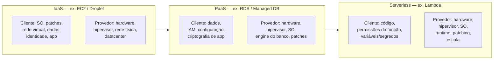
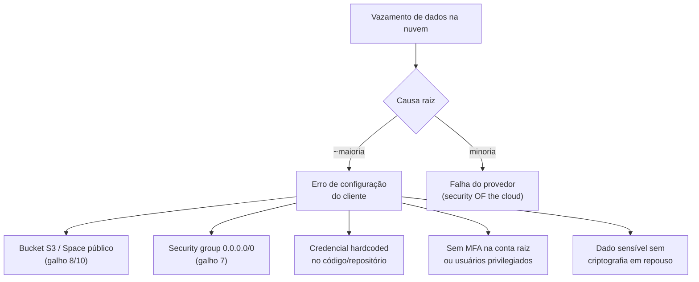
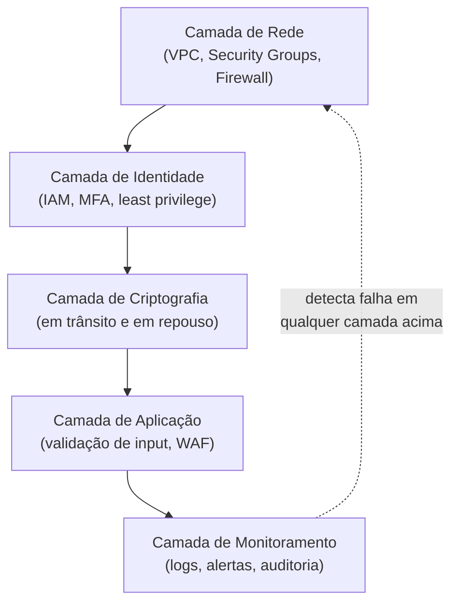
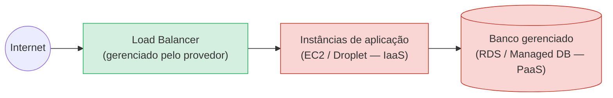

> [!abstract] TL;DR
> A nuvem não terceiriza segurança — ela a divide. O provedor cuida da segurança *da* nuvem (datacenters, hardware, hipervisor, rede física); você cuida da segurança *na* nuvem (dados, configuração, identidade, patch de aplicação). A linha dessa divisão se desloca conforme o tipo de serviço — IaaS exige mais de você, serverless menos — mas nunca chega a zero. Os incidentes mais comuns (bucket público, security group aberto, credencial vazada) são, quase sempre, 100% culpa do lado do cliente.

## O problema: "está na nuvem, logo é seguro"

Imagine que você aluga um apartamento num prédio com portaria 24 horas, câmeras em todo corredor e uma fechadura de última geração na entrada do edifício. Isso é ótimo — mas se você deixar a porta do *seu* apartamento destrancada, ou entregar a chave pra qualquer entregador que bater, a portaria do prédio não te salva. A responsabilidade sobre o que acontece dentro do seu próprio espaço continua sendo sua.

É exatamente essa a armadilha mental de quem migra pra nuvem achando que comprou segurança pronta. Você não comprou. Você comprou um prédio muito bem guardado — e ainda precisa trancar a sua porta.

Isso já apareceu no galho 2 da trilha, quando o modelo de responsabilidade compartilhada foi apresentado pela primeira vez como divisor de águas entre "datacenter próprio" e "nuvem pública". Esta nota volta a esse modelo, mas agora com as mãos na massa: **onde exatamente essa linha cai, o que os provedores realmente garantem, e por que a maioria dos vazamentos noticiados na imprensa não é "hack sofisticado" — é configuração errada do lado que era responsabilidade do cliente**.

A própria AWS resume o modelo em duas frases, que valem a pena decorar:

- **Security OF the cloud** (segurança *da* nuvem) — responsabilidade do provedor: instalações físicas, hardware, virtualização, rede global, e a operação básica dos serviços gerenciados.
- **Security IN the cloud** (segurança *na* nuvem) — responsabilidade do cliente: como você configura, quem tem acesso, o que você coloca lá dentro, e como você protege isso.

## O mecanismo: a linha se move conforme o tipo de serviço

A ideia mais contraintuitiva do modelo é que a divisão de responsabilidade **não é uma constante — é uma função do tipo de serviço que você consome**. Quanto mais "gerenciado" o serviço, mais fatias do bolo o provedor assume. Mas nenhuma fatia do lado do cliente jamais chega a zero.

Repare no padrão: a caixa "Cliente" encolhe da esquerda pra direita, mas **nunca desaparece**. Mesmo numa função Lambda totalmente serverless, você ainda é responsável por não deixar a função com permissões amplas demais, por não commitar uma chave de API no código, por validar o input que ela recebe. A AWS opera a infraestrutura por trás da função; ela não decide o que a sua função faz com os dados que processa.

> [!info] Verificado em 2026-07-24
> A divisão IaaS/PaaS/serverless acima segue a formulação oficial da AWS (aws.amazon.com/compliance/shared-responsibility-model). Para EC2 (IaaS), a AWS descreve responsabilidade do cliente sobre "gestão do sistema operacional convidado, software de aplicação e configuração de firewall"; para serviços abstratos como RDS/S3/DynamoDB, a AWS opera infraestrutura, SO e a própria plataforma, e o cliente foca em dados, criptografia e permissões de acesso via IAM.

A DigitalOcean segue o mesmo espírito, só que com um portfólio mais enxuto: nos **Droplets** (IaaS), você é responsável pelo SO, patches e firewall da mesma forma que na EC2; em serviços gerenciados como o **Managed Database** ou o **App Platform** (mais próximo de PaaS), a DO assume patch do motor, backups e disponibilidade, e você continua responsável por credenciais, permissões de acesso e o que roda dentro da aplicação.

## A ilusão perigosa, desmontada em números

Se você já passou pelos galhos 7 (rede) e 10 (borda) desta trilha, alguns desses nomes vão soar familiares — e é proposital. Os erros que mais aparecem em relatórios de incidentes de nuvem não são exóticos. São, quase sempre, configurações que ficam inteiramente do lado "IN the cloud", ou seja: 100% culpa de quem configurou, nunca do provedor.

Vale destrinchar cada um, porque cada um tem nome e sobrenome de responsabilidade:

- **Bucket/Space público** — já apareceu nos galhos de armazenamento e borda desta trilha: um bucket S3 ou Space da DO por padrão *não* é público, mas uma política de acesso mal configurada (ou um "tornar público" clicado sem pensar) o expõe à internet inteira. Isso é 100% configuração do cliente — a AWS e a DO não decidem o ACL do seu objeto.
- **Security group / firewall aberto para `0.0.0.0/0`** — coberto no galho 7 (rede): liberar uma porta sensível (SSH, banco de dados) para qualquer IP do planeta é uma decisão sua, tomada na hora de configurar o grupo de segurança ou o Cloud Firewall.
- **Credencial hardcoded** — chave de acesso, token de API ou senha de banco escritos direto no código-fonte (e frequentemente commitados num repositório público). Nenhum provedor pode impedir isso — é uma prática do time de desenvolvimento.
- **Ausência de MFA** — deixar contas com privilégio administrativo protegidas só por senha é uma escolha de configuração de identidade, tema aprofundado no galho 4 (IAM) desta trilha.
- **Dados sensíveis sem criptografia em repouso** — mesmo quando o provedor oferece criptografia gerenciada de graça (como veremos na próxima nota), alguém ainda precisa habilitá-la ou usar a chave certa para o dado certo.

> [!warning] O mito do "hack sofisticado"
> A cobertura de imprensa adora a narrativa do invasor genial que "quebrou" a nuvem. Na prática, a esmagadora maioria dos incidentes reportados publicamente é configuração incorreta — um bucket deixado público, uma credencial em um repositório, um firewall liberado por conveniência durante um debug e nunca fechado de novo. O provedor não falhou; a "porta do apartamento" ficou destrancada.

> [!tip] Assista: AWS Shared Responsibility Model Explained | Customer vs AWS Responsibilities | CLF-C02
> **Canal:** CloudExpert Solutions | **Duração:** ~10min | **Idioma:** EN
>
> O vídeo percorre exatamente os mesmos exemplos que esta nota usa pra desmontar a ilusão — patch de EC2, política de bucket S3 — mostrando na prática como a pergunta "de quem é a culpa?" muda cenário a cenário.
> Trecho de destaque [06:44]: *"public S3 bucket. Whose responsibility [...] again customer's responsibility"*
>
> 🎬 [Assistir no YouTube](https://www.youtube.com/watch?v=yCiFwQmin_0)

## Defesa em profundidade: por que uma camada nunca basta

Mesmo dentro da fatia que é sua, existe uma tentação perigosa: resolver segurança com uma única camada — "colocamos um firewall, está resolvido". Não está. A prática consagrada de **defense in depth** (defesa em profundidade) assume que qualquer camada isolada vai falhar em algum momento, e por isso empilha camadas independentes, de modo que a falha de uma não derrube o sistema inteiro.

Pense num cofre de banco de verdade: não é só a porta blindada que protege o dinheiro. Tem o prédio, o guarda, o alarme, a câmera, o registro de quem entrou. Se o ladrão passar pela porta (uma camada falhou), ainda tem o alarme (outra camada) e o registro de vídeo pra investigação depois (mais uma camada). Nenhuma camada sozinha "é" a segurança — a segurança é o empilhamento.

Aplicando isso ao mesmo bucket público do exemplo anterior: se a camada de identidade (política de bucket bem escrita) tivesse falhado sozinha, a camada de monitoramento ainda poderia ter soado o alarme — um alerta de "objeto tornou-se público" chegando em minutos, não em meses. É essa combinação que separa um erro de configuração descoberto em cinco minutos de um vazamento descoberto seis meses depois por um pesquisador de segurança externo, como acontece com tanta frequência nas manchetes.

Isso também explica por que times de compliance perguntam tanto sobre esse modelo em auditorias: um certificado como SOC 2 ou ISO 27001 não avalia só "a AWS é segura?" — ele avalia se *você* fez a sua parte em cada uma dessas camadas. O provedor traz o próprio certificado de compliance para a fatia "OF the cloud"; a fatia "IN the cloud" é auditada em cima da sua conta, das suas configurações, do seu código.

## O mapa deste galho

Esta nota deu a visão panorâmica; as próximas quatro aprofundam cada camada com as mãos na massa:

- **Criptografia gerenciada** — como funciona o AWS KMS (e o que muda quando a DO não tem um serviço equivalente rico).
- **Segredos** — Secrets Manager e Parameter Store, para parar de hardcodar credencial.
- **Segurança de rede e perímetro** — reencontro com o galho 7, agora sob a lente de defesa em profundidade.
- **Governança, auditoria e compliance** — CloudTrail, Config, e a pergunta "quem fez o quê, quando".

E o capstone do galho fecha com um threat model completo de uma arquitetura real, juntando tudo.

> [!info] Fronteira de domínio
> Duas coisas que soam "de segurança na nuvem" mas moram em outro lugar do vault: (1) OAuth, OIDC e identidade como *protocolo* — isso é ensinado do zero na trilha de Auth e Identidade; aqui você só vê a encarnação gerenciada (IAM, roles). (2) A teoria de criptografia — algoritmos, PKI, matemática por trás de simétrico/assimétrico — mora no domínio Segurança, dentro de Engenharia; esta nota e as seguintes tratam apenas de como *usar* criptografia gerenciada pelo provedor, não de como ela funciona por dentro.

## Lente dupla: o arsenal de cada provedor

A AWS construiu, ao longo de mais de uma década, um catálogo extenso de serviços de segurança gerenciada — cada camada do diagrama acima tem um ou mais serviços dedicados. A DigitalOcean, fiel à sua filosofia de simplicidade, oferece um conjunto bem mais enxuto: o essencial coberto, sem o catálogo profundo.

| Camada de segurança | AWS | DigitalOcean |
|---|---|---|
| Rede / perímetro | Security Groups, NACLs, AWS WAF, Shield | Cloud Firewall (stateful, grátis) |
| Identidade e acesso | IAM (users, roles, policies granulares) | Teams + API tokens (modelo mais simples) |
| Criptografia de chaves | KMS (HSM dedicado, FIPS 140-3 Nível 3) | Sem serviço de KMS equivalente — criptografia em repouso é padrão/automática em Droplets e Volumes, mas sem gestão de chave própria pelo cliente |
| Gestão de segredos | Secrets Manager, Parameter Store | Sem serviço nativo rico — geralmente resolvido via variáveis de ambiente do App Platform ou ferramenta de terceiros |
| Auditoria/governança | CloudTrail, Config, Security Hub, GuardDuty | Monitoring básico + logs de auditoria de conta; sem equivalente a Config/Security Hub |

> [!warning] Onde a paridade quebra de verdade
> Não existe um "KMS da DigitalOcean" nem um "Secrets Manager da DigitalOcean" com a mesma profundidade da AWS. Isso não é falha da DO — é reflexo direto da filosofia de produto: menos superfície, menos complexidade, menos serviços pra você aprender. Mas é uma escolha real com uma consequência real: se seu caso de uso exige rotação automática de chaves com política granular por serviço, auditoria fina de cada acesso a segredo, ou compliance que cobra HSM dedicado, isso pesa a favor da AWS. Se você quer o essencial funcionando sem uma pilha de serviços pra gerenciar, a simplicidade da DO é a característica, não o defeito.

## Caso prático: seguindo a responsabilidade numa arquitetura real

Vamos tornar isso concreto. Imagine uma API simples: um load balancer na frente, instâncias de aplicação atrás, e um banco de dados gerenciado guardando os dados dos usuários. Pergunte, camada por camada, "de quem é essa responsabilidade?" — e a resposta muda de acordo com o serviço escolhido em cada ponto.

- **O load balancer** é inteiramente gerenciado: o provedor cuida de alta disponibilidade, patches do software de balanceamento e da infraestrutura. Sua responsabilidade se limita à *configuração* — que portas expor, que certificado TLS anexar, quais regras de roteamento.
- **As instâncias de aplicação** (IaaS) colocam a maior parte do peso do lado do cliente: você escolhe a imagem do SO, aplica os patches, instala o runtime da linguagem, configura o firewall de instância e é responsável por qualquer vulnerabilidade introduzida pelo seu próprio código.
- **O banco de dados gerenciado** (PaaS) inverte boa parte disso: o provedor cuida do patch do motor do banco, de backups automáticos e da criptografia de disco subjacente. Mas você ainda decide quem tem a credencial de acesso, se a criptografia em repouso está de fato habilitada, e se a rede que separa o banco da internet pública está corretamente fechada.

Note que **nenhuma seta desse diagrama é "100% provedor"**. Mesmo a camada mais gerenciada (o load balancer) ainda depende de você escolher um certificado válido e não deixar uma porta de administração aberta por engano. É essa insistência do modelo — a responsabilidade do cliente encolhe, mas nunca zera — que faz dele mais um mapa de onde prestar atenção do que uma divisão que você possa simplesmente "delegar e esquecer".

## Nomenclatura entre provedores

Azure e GCP usam nomes diferentes para peças equivalentes desse mesmo raciocínio de responsabilidade e das camadas de segurança gerenciada. A tabela abaixo é só um dicionário de tradução — não é hands-on, é para você reconhecer o conceito quando aparecer em outro provedor.

| Conceito | AWS | Azure | GCP | DigitalOcean |
|---|---|---|---|---|
| Modelo de responsabilidade | Shared Responsibility Model | Shared Responsibility Model | Shared Responsibility Model | Security (documentação própria, sem nome de marca dedicado) |
| Firewall de rede gerenciado | Security Groups + WAF | Network Security Groups + Azure Firewall | VPC Firewall Rules + Cloud Armor | Cloud Firewall |
| Gestão de chaves criptográficas | KMS | Key Vault | Cloud KMS | — (sem serviço dedicado) |
| Gestão de segredos | Secrets Manager | Key Vault (secrets) | Secret Manager | — (sem serviço dedicado) |
| Auditoria de atividade da conta | CloudTrail | Activity Log / Monitor | Cloud Audit Logs | Audit log de conta (mais básico) |

## O que vem a seguir

A próxima nota mergulha na primeira camada gerenciada de verdade: o **AWS KMS** — como uma hierarquia de chaves protege seus dados em repouso, o que muda quando você usa uma chave gerenciada pela AWS versus uma chave sua, e como a DigitalOcean resolve (ou não resolve) o mesmo problema sem um serviço de KMS dedicado.

## Fontes

- AWS. "Shared Responsibility Model." https://aws.amazon.com/compliance/shared-responsibility-model/
- AWS. "AWS Key Management Service — Overview." https://docs.aws.amazon.com/kms/latest/developerguide/overview.html
- DigitalOcean. "How Cloud Firewalls Work." https://docs.digitalocean.com/products/networking/firewalls/
- DigitalOcean. "Security." https://docs.digitalocean.com/platform/
