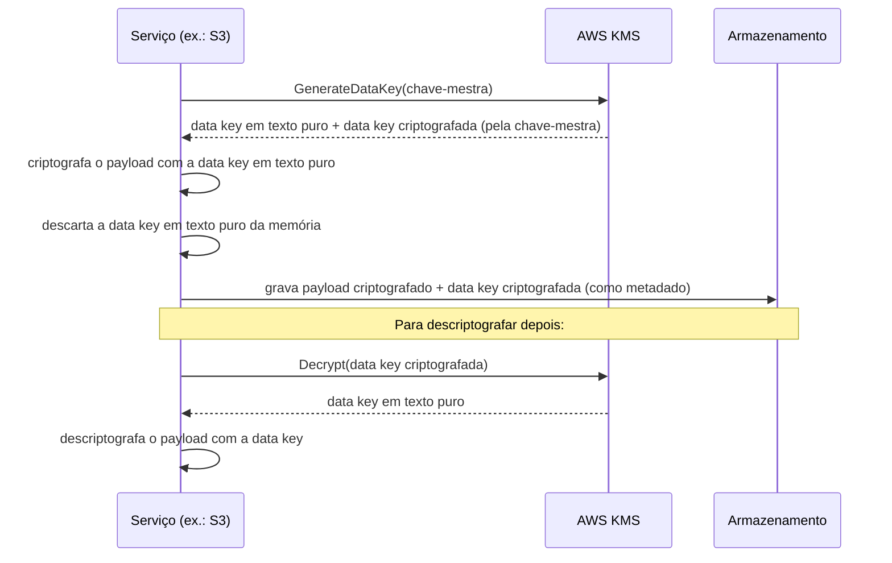
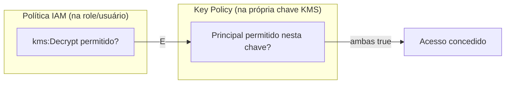
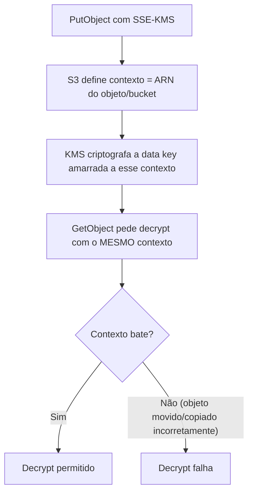

> [!abstract] TL;DR
> Criptografar dados é fácil; o problema de verdade é *onde guardar a chave* sem virar você mesmo o alvo do ataque. O KMS (Key Management Service) resolve isso guardando chaves-mestras num cofre gerenciado que nunca entrega a chave em texto puro — em vez disso, usa **envelope encryption**: gera uma chave de dados descartável, deixa o serviço (S3, EBS, RDS...) criptografar o payload com ela, e só guarda a chave de dados já criptografada pela chave-mestra. A AWS tem isso como serviço rico e integrado a quase tudo; a DigitalOcean criptografa em repouso por padrão em vários produtos, mas não oferece um KMS gerenciado com granularidade de política e BYOK — e essa é uma lacuna real, não um detalhe de nomenclatura.

## O problema: onde você guarda a chave que guarda tudo

Imagine que você decidiu, corretamente, que todo dado sensível da sua aplicação — registros de usuário, backups de banco, arquivos de contrato — precisa estar criptografado em repouso. Ótimo instinto. Mas aí vem a pergunta que ninguém faz até ser tarde demais: **onde fica a chave que criptografa (e descriptografa) tudo isso?**

Se a chave mora num arquivo `.pem` no mesmo servidor que guarda os dados criptografados, você não resolveu nada — quem comprometer o servidor pega o cadeado e a chave no mesmo golpe. Se a chave mora hardcoded no código-fonte, ela vaza no primeiro `git log` mal cuidado ou no primeiro dump de repositório. Se a chave mora numa variável de ambiente, ela aparece em qualquer `ps aux`, em qualquer log de erro que capture o ambiente do processo, em qualquer container mal isolado.

O problema de gerenciamento de chaves é, historicamente, o calcanhar de Aquiles de qualquer sistema criptográfico — não porque os algoritmos sejam fracos (AES-256 é, na prática, inquebrável por força bruta com a tecnologia atual), mas porque *guardar o segredo que abre o cadeado* é um problema de infraestrutura, não de matemática. É exatamente esse problema de infraestrutura que um serviço de gerenciamento de chaves gerenciado resolve: tira a chave-mestra do seu código, do seu disco, da sua memória de processo, e coloca num serviço dedicado, com hardware especializado, auditoria de cada uso, e políticas de acesso separadas de tudo o mais.

> [!info] Fronteira desta nota
> Esta nota não ensina criptografia — o que é AES, a diferença entre simétrica e assimétrica, como funciona uma cifra de bloco. Isso é teoria de criptografia e vive no domínio de Segurança da Engenharia. Aqui o assunto é o **serviço gerenciado**: como a AWS e a DigitalOcean resolvem "onde a chave mora e quem pode usá-la" na prática do dia a dia de operar uma aplicação em produção.

Vale também separar duas coisas que às vezes se confundem: **encryption at rest** é proteger o dado parado — o arquivo no disco do bucket S3, o volume EBS anexado a uma instância, o snapshot de um banco RDS. **Encryption in transit** é proteger o dado em movimento — a conexão TLS entre o navegador do usuário e seu load balancer, ou entre dois microsserviços trocando requisições. Esta nota é inteiramente sobre a primeira; a segunda já foi tratada com profundidade na nota sobre [[03-Dominios/Tecnologia/Cloud/10 - DNS, CDN e borda/04 - TLS e certificados na borda|TLS e certificados na borda]]. São camadas complementares, não substitutas — um atacante que rouba um disco físico de um datacenter não se importa nem um pouco que o tráfego HTTPS daquele servidor era impecável.

## Envelope encryption: por que o KMS não criptografa seus dados diretamente

Aqui está o ponto que costuma confundir quem chega no KMS pela primeira vez: **o KMS quase nunca criptografa o seu payload diretamente.** Se você tem um arquivo de 2 GB para proteger, o KMS não recebe esses 2 GB, não os processa, não devolve 2 GB criptografados. Por quê? Duas razões práticas, uma de performance e uma de segurança.

A razão de performance é simples: o KMS é um serviço de rede, gerenciando chaves-mestras dentro de módulos de hardware seguro (HSMs). Fazer toda operação de criptografia de dados passar pela rede até o KMS — para cada arquivo, cada byte — seria lento e caro em escala. A razão de segurança é mais sutil: reutilizar a mesma chave para criptografar volumes enormes de dados degrada a segurança criptográfica com o tempo (padrões estatísticos começam a vazar informação sobre a chave quando ela processa demais).

A solução é a **envelope encryption** (criptografia em envelope): a chave-mestra no KMS nunca toca o dado bruto. Em vez disso, ela criptografa uma chave menor e descartável — a **data key** — e é essa data key, gerada uma vez por objeto (ou por lote de objetos), que efetivamente criptografa o payload, localmente, no serviço que está processando o dado.



Repare no detalhe crucial: **a data key em texto puro nunca é persistida** — ela existe só o tempo suficiente, na memória do serviço que a usou, para criptografar (ou descriptografar) o payload, e é descartada logo em seguida. O que fica gravado ao lado do dado criptografado é a *versão criptografada* da data key. Isso significa que, se alguém rouba o disco físico com o arquivo criptografado e a data key criptografada juntos, ainda não tem nada útil — a data key só volta a ser texto puro passando de novo pelo KMS, que exige permissão (`kms:Decrypt`) pra isso.

É o mesmo princípio, em miniatura, de por que um cofre de banco tem duas chaves — a do cliente e a do gerente — mas em vez de duas pessoas, aqui é uma chave-mestra centralizada (auditável, rotacionável, com política própria) protegendo N chaves de dados descartáveis, uma por objeto.

> [!info] AWS KMS charges a monthly fee for key storage and per-request pricing; automatic key rotation for customer managed keys uses a default period of 365 days (customizável), e chaves AWS-managed rotacionam automaticamente todo ano sem opção de desligar. Verificado em docs.aws.amazon.com em 2026-07-24 — confira antes de basear decisão de compliance nesse número, porque a AWS já mudou esse intervalo no passado (era a cada 3 anos até maio de 2022).

## Os tipos de chave no KMS

Nem toda chave no KMS é igual, e a diferença entre os tipos importa na hora de decidir quanta responsabilidade você quer assumir.

**AWS managed keys** são chaves que a própria AWS cria e gerencia por você, automaticamente, na primeira vez que um serviço precisa de uma (o alias segue o padrão `aws/s3`, `aws/ebs`, `aws/rds`, etc.). Você não escolhe a política de acesso dessa chave em detalhe, não pode desabilitá-la nem excluí-la, e ela rotaciona automaticamente todo ano, sem opção de desligar essa rotação. É o caminho de menor esforço: liga a criptografia, a AWS cuida do resto.

**Customer managed keys** (CMKs) são chaves que *você* cria explicitamente no KMS. Você controla a política de acesso (quem pode usar essa chave, para quê), pode habilitar ou desabilitar rotação automática (com período customizável, padrão de 365 dias), pode desabilitar ou agendar a exclusão da chave, e pode auditar cada uso via CloudTrail com granularidade fina. É o caminho certo quando você precisa de compartilhamento entre contas (chaves AWS-managed não permitem acesso cross-account), de controle de compliance específico, ou de revogar acesso a um conjunto de dados sem depender do IAM sozinho.

A diferença de **key policy** para uma policy IAM comum é sutil mas importante: toda chave KMS tem sua própria *resource policy* (a key policy), que funciona como uma segunda porta — mesmo que uma role IAM tenha `kms:Decrypt` liberado nas suas próprias políticas, ela só consegue de fato usar a chave se a key policy da chave também permitir aquele principal. É uma dupla trava deliberada: o dono dos dados (quem criptografou) e o dono da identidade (quem tenta acessar) precisam concordar, cada um do seu lado.



**Aliases** são apelidos amigáveis (`alias/minha-chave-producao`) apontando para o ID real da chave (um UUID como `1234abcd-12ab-34cd-56ef-1234567890ab`) — úteis porque você pode trocar qual chave física um alias aponta sem reescrever configuração em dezenas de serviços consumidores.

## Rotação de chaves: o que rotaciona de fato

Um ponto que confunde bastante gente: rotacionar a chave-mestra **não** re-criptografa os dados antigos, nem regenera as data keys já emitidas. O que acontece é que o KMS troca o material criptográfico *interno* da chave-mestra, mantendo o mesmo ID lógico — dados antigos continuam decifráveis porque o KMS lembra qual versão do material foi usada para cada data key emitida, e escolhe automaticamente a versão correta na hora de descriptografar. Novas operações de criptografia passam a usar o material novo. Do ponto de vista de quem consome a chave, isso é transparente — nenhuma aplicação precisa saber que a rotação aconteceu.

Isso também significa uma coisa importante sobre mitigação de risco: rotacionar a chave-mestra **não** neutraliza uma data key comprometida — se um atacante já obteve uma data key em texto puro (por exemplo, extraindo-a da memória de um processo comprometido), rotacionar a chave-mestra não desfaz esse vazamento específico. A rotação protege contra desgaste do material criptográfico ao longo do tempo, não contra um vazamento pontual já ocorrido.

## Onde o KMS aparece: a integração é o ponto forte

O valor prático do KMS não está em usá-lo isoladamente — está em como ele se pluga, de forma quase invisível, em praticamente todo serviço de dados da AWS.

**S3 com SSE-KMS.** A nota sobre [[03-Dominios/Tecnologia/Cloud/08 - Armazenamento (object, block e file)/index|Armazenamento]] cobriu como buckets S3 protegem objetos; desde janeiro de 2023 a AWS aplica SSE-S3 (chave gerenciada pelo próprio S3) como piso padrão em todo upload novo, sem custo adicional. Mas você pode subir um degrau e configurar **SSE-KMS**, que usa o KMS de verdade — com uma chave AWS-managed (`aws/s3`) ou uma customer-managed. A vantagem de subir esse degrau: auditoria via CloudTrail de cada acesso ao objeto (porque cada leitura chama `kms:Decrypt`), controle de política fino, e a possibilidade de compartilhar objetos cross-account com uma CMK. A desvantagem: custo por requisição ao KMS — mitigado pelo recurso de **S3 Bucket Keys**, que reduz o volume de chamadas ao KMS em até 99% ao reutilizar uma chave de nível de bucket, gerada uma vez, por um período limitado, em vez de chamar o KMS a cada objeto individual.

**EBS e RDS.** Volumes EBS podem ser criptografados na criação, com uma chave KMS (managed ou customer) — e, uma vez criptografado, todo snapshot derivado daquele volume e todo volume restaurado a partir do snapshot herdam a criptografia automaticamente, sem opção de "desligar" no meio do caminho. RDS funciona de forma parecida: você escolhe a chave KMS na criação da instância, e ela protege o armazenamento subjacente, os snapshots automáticos e manuais, e as réplicas — mas atenção, criptografia em RDS é uma decisão de criação: não dá pra criptografar uma instância RDS já existente sem passar por um processo de snapshot → cópia criptografada → restauração.

**Secrets Manager.** Todo segredo armazenado no AWS Secrets Manager é criptografado em repouso usando uma chave KMS por baixo dos panos — a próxima nota deste galho aprofunda o Secrets Manager como serviço, mas vale registrar aqui: mesmo um serviço de "segredos" não reinventa criptografia, ele delega para o KMS, exatamente como S3 e RDS fazem.

| Serviço | O que é criptografado | Chave default | Ponto de atenção |
|---|---|---|---|
| S3 (SSE-KMS) | Objetos individuais | `aws/s3` (AWS managed) | Bucket Keys reduzem custo de chamadas KMS em até 99% |
| EBS | Blocos do volume + snapshots derivados | `aws/ebs` (AWS managed) | Herança automática em snapshots/restores; sem opção de desligar no meio do caminho |
| RDS | Storage subjacente + snapshots + réplicas | `aws/rds` (AWS managed) | Decisão de criação — não retroativa numa instância já existente |
| Secrets Manager | Valor do segredo em repouso | `aws/secretsmanager` (AWS managed) | Cada leitura de segredo dispara `kms:Decrypt` internamente |
| DynamoDB | Tabelas e backups | `aws/dynamodb` (AWS managed) | Também aceita CMK para controle fino de acesso |

Um recurso que vale mencionar de raspão para quem opera arquitetura multi-região com disaster recovery: **multi-Region keys**, um tipo especial de chave KMS que existe como "réplicas" sincronizadas em regiões diferentes, compartilhando o mesmo material criptográfico. Isso permite criptografar um dado numa região e descriptografá-lo em outra, sem precisar copiar o dado descriptografado através da fronteira regional — útil para backups replicados entre regiões, onde recriptografar tudo do zero na região de destino seria caro e lento.

## Um exemplo de ponta a ponta

Veja como as peças se encaixam num fluxo real: criar uma chave, usá-la para gerar uma data key, e configurar um bucket S3 pra usá-la por padrão.

```bash
# 1. Criar uma customer managed key
aws kms create-key \
  --description "Chave para dados sensiveis de producao" \
  --key-usage ENCRYPT_DECRYPT \
  --key-spec SYMMETRIC_DEFAULT

# 2. Dar um alias amigável
aws kms create-alias \
  --alias-name alias/producao-dados-sensiveis \
  --target-key-id 1234abcd-12ab-34cd-56ef-1234567890ab

# 3. Habilitar rotação automática (padrão: 365 dias)
aws kms enable-key-rotation \
  --key-id alias/producao-dados-sensiveis

# 4. Pedir uma data key diretamente (o que S3/EBS/RDS fazem por trás)
aws kms generate-data-key \
  --key-id alias/producao-dados-sensiveis \
  --key-spec AES_256
# Retorna: Plaintext (data key em texto puro, use e descarte)
#          CiphertextBlob (data key criptografada, guarde junto ao payload)

# 5. Configurar o bucket S3 pra usar essa chave como default (SSE-KMS + Bucket Key)
aws s3api put-bucket-encryption \
  --bucket minha-empresa-dados-sensiveis \
  --server-side-encryption-configuration '{
    "Rules": [{
      "ApplyServerSideEncryptionByDefault": {
        "SSEAlgorithm": "aws:kms",
        "KMSMasterKeyID": "alias/producao-dados-sensiveis"
      },
      "BucketKeyEnabled": true
    }]
  }'
```

E uma key policy mínima, mostrando a dupla trava mencionada acima — um administrador que gerencia a chave, e uma role de aplicação que só pode usá-la (nunca administrar):

```json
{
  "Version": "2012-10-17",
  "Statement": [
    {
      "Sid": "PermitirAdminDaChave",
      "Effect": "Allow",
      "Principal": { "AWS": "arn:aws:iam::111122223333:role/AdminSeguranca" },
      "Action": "kms:*",
      "Resource": "*"
    },
    {
      "Sid": "PermitirUsoPelaAplicacao",
      "Effect": "Allow",
      "Principal": { "AWS": "arn:aws:iam::111122223333:role/AplicacaoProducao" },
      "Action": [
        "kms:Encrypt",
        "kms:Decrypt",
        "kms:GenerateDataKey"
      ],
      "Resource": "*"
    }
  ]
}
```

Repare que a role de aplicação não tem `kms:*` — só as três ações que precisa pra criptografar e descriptografar dados no dia a dia. Um erro comum é copiar a policy do administrador pra role de aplicação "pra economizar tempo", e com isso dar à aplicação o poder de desabilitar a própria chave ou reescrever a política de quem mais pode usá-la.

## Quando vale a pena subir de AWS managed pra customer managed

Na prática, a decisão entre usar a chave AWS-managed padrão de um serviço (`aws/s3`, `aws/rds`, `aws/ebs`) e criar sua própria CMK não é binária de "mais seguro versus menos seguro" — os dois caminhos usam o mesmo AES-256 por baixo. A diferença é **controle e visibilidade**, e há um conjunto de perguntas que costuma decidir isso na prática:

| Pergunta | Se "sim" → | Se "não" → |
|---|---|---|
| Preciso compartilhar dados criptografados entre contas AWS diferentes? | Customer managed key (obrigatório) | AWS managed key serve |
| Preciso de um audit trail granular de *quem* descriptografou *o quê* e *quando*? | Customer managed key (key policy própria + CloudTrail dedicado) | AWS managed key serve |
| Um requisito de compliance exige que eu controle o ciclo de vida da chave (desabilitar, agendar exclusão)? | Customer managed key | AWS managed key serve |
| O custo mensal por chave (cobrada por chave, não por uso isolado) é uma preocupação real na minha escala? | AWS managed key (sem custo de storage por chave) | Customer managed key é aceitável |
| Preciso que times diferentes tenham políticas de acesso diferentes para dados diferentes? | Uma CMK por domínio de dados | Uma chave compartilhada serve |

Uma armadilha comum de quem começa a operar CMKs em escala: criar uma chave por *recurso* (uma por bucket, uma por tabela) em vez de uma chave por *domínio de confiança* (uma para "dados de pagamento", uma para "dados de log de aplicação", uma para "backups"). Isso não só gera custo desnecessário — cada CMK é cobrada mensalmente pela AWS, independente de uso — como dificulta auditoria: em vez de perguntar "quem acessou dados de pagamento este mês?" via um único CloudTrail filtrado por uma chave, você teria que agregar dezenas de chaves separadas.

## Encryption context: autenticar sem esconder

Um detalhe que aparece o tempo todo em operações KMS e raramente é explicado: o **encryption context**. É um conjunto de pares chave-valor — por exemplo, `{"aws:s3:arn": "arn:aws:s3:::meu-bucket/arquivo.pdf"}` — que acompanha uma operação de criptografia ou decriptação, mas que **não é, em si, secreto nem criptografado**. Ele fica visível em CloudTrail, em texto puro.

O que ele faz é servir como **dado autenticado adicional** (AAD, na sigla criptográfica): o KMS amarra esse contexto à operação de tal forma que, se alguém tentar descriptografar o mesmo blob de dados criptografados mas fornecendo um contexto *diferente* do usado na criptografia original, a operação falha — mesmo que a pessoa tenha permissão de `kms:Decrypt` na chave certa. Na prática, isso frustra um ataque específico: alguém que rouba um objeto criptografado do bucket A e tenta "reaproveitá-lo" fingindo que é do bucket B não consegue, porque o contexto (o ARN do objeto/bucket original) não bate.



Isso explica, de quebra, por que copiar manualmente um objeto criptografado com SSE-KMS entre buckets — sem passar pela API de cópia do S3, que recalcula o contexto corretamente — costuma quebrar silenciosamente: o payload parece intacto, mas o contexto amarrado não confere mais.

## CloudHSM e Grants: dois recursos avançados, de raspão

Duas peças que aparecem quando o KMS "normal" não é suficiente, sem entrar a fundo em nenhuma:

**AWS CloudHSM** é um serviço diferente do KMS — em vez de um cofre multi-tenant gerenciado pela AWS, é um módulo de hardware de segurança **dedicado só a você**, single-tenant, dentro de uma VPC sua. Existe para os casos em que a exigência de compliance é literal — "a chave precisa estar num HSM certificado FIPS 140-2 nível 3, sob controle exclusivo do cliente, sem nenhum compartilhamento de infraestrutura" — algo que setores regulados (financeiro, saúde, governo) às vezes exigem contratualmente. O KMS pode inclusive usar um CloudHSM como *custom key store*, combinando a conveniência de API do KMS com o isolamento físico do CloudHSM. É bem mais caro e operacionalmente mais pesado que o KMS padrão — não é a escolha default, é a escolha quando um requisito específico obriga.

**Grants** são uma forma de conceder permissão temporária e programática de uso de uma chave, sem editar a key policy — útil quando um serviço precisa de acesso pontual (por exemplo, um processo assíncrono de longa duração), e você quer revogar esse acesso especificamente depois, sem tocar na política principal da chave. É um mecanismo pensado para automação, não para uso manual do dia a dia. Um exemplo típico: um serviço de processamento de vídeo que só existe enquanto um job está rodando pede um grant temporário pra decriptar o arquivo de origem, processa, e o grant é revogado ao final — sem nunca precisar editar a key policy manualmente a cada job.

```bash
# Conceder um grant temporário a uma role de processamento
aws kms create-grant \
  --key-id alias/producao-dados-sensiveis \
  --grantee-principal arn:aws:iam::111122223333:role/ProcessadorVideoJob \
  --operations Decrypt GenerateDataKey

# Revogar o grant quando o job termina
aws kms revoke-grant \
  --key-id alias/producao-dados-sensiveis \
  --grant-id <grant-id-retornado-na-criacao>
```

## Um caso prático: separando domínios de confiança numa conta real

Vale amarrar tudo isso num cenário concreto, porque a teoria isolada esconde como as peças se encaixam. Imagine uma aplicação de e-commerce com três categorias de dado sensível: dados de pagamento (número de cartão tokenizado, histórico de cobrança), dados de conta de usuário (e-mail, endereço, senha com hash) e logs de auditoria (quem fez o quê, quando).

A abordagem madura não é uma CMK única "porque é mais simples" — é uma CMK por domínio de confiança, cada uma com sua própria key policy:

- **`alias/pagamentos`** — key policy restrita a uma role específica do serviço de cobrança, com `kms:Decrypt` só liberado para essa role, e um requisito adicional de encryption context (`{"dominio": "pagamentos"}`) amarrado a cada operação, forçando que nenhum outro serviço consiga descriptografar esses dados mesmo que ganhe a permissão IAM por engano.
- **`alias/dados-usuario`** — key policy mais permissiva, liberada para o backend principal da aplicação e para o serviço de suporte ao cliente (que precisa ler, não editar, dados de conta).
- **`alias/logs-auditoria`** — key policy que libera `kms:Encrypt` para todos os serviços que geram logs, mas `kms:Decrypt` só para a role de segurança que investiga incidentes — um padrão de "qualquer um escreve, só auditoria lê", frequente em arquiteturas de compliance.

Com essa separação, um incidente de segurança que compromete o backend principal (a role de "dados de usuário") não dá automaticamente ao atacante acesso aos dados de pagamento — porque a key policy de `alias/pagamentos` nunca listou essa role como principal permitido. É o mesmo princípio de menor privilégio que rege IAM, aplicado uma camada abaixo, na própria chave.

## AWS KMS versus DigitalOcean: a lacuna honesta

Aqui é onde a lente dupla precisa parar de fingir simetria. A AWS constrói o KMS como um serviço de primeira classe — gerenciamento granular de chaves, políticas separadas do IAM, rotação configurável, auditoria completa, HSM dedicado como opção. A **DigitalOcean não tem um produto equivalente.**

O que a DigitalOcean oferece é criptografia em repouso **padrão e automática** em vários produtos — Volumes, por exemplo, são descritos pela documentação oficial como tendo "durabilidade com backend Ceph criptografado". Bancos de dados gerenciados (Managed Databases) e Spaces também aplicam proteção de dados em repouso como parte da oferta. Mas em nenhum desses casos você tem acesso a: criar suas próprias chaves, definir política de quem pode usá-las, trazer sua própria chave (BYOK — Bring Your Own Key), rotacionar sob seu controle, ou auditar cada operação de decrypt via um serviço de logging dedicado à chave.

> [!info] Não encontrei, na documentação pública da DigitalOcean consultada em 2026-07-24, uma página que detalhe o algoritmo exato de criptografia em repouso, opções de BYOK ou um serviço equivalente ao KMS. Isso não é prova de ausência absoluta — mas é consistente com o que se observa no restante do catálogo DO: a plataforma prioriza segurança "ligada por padrão, sem configuração", em vez de controle granular de chave. Se isso for um requisito de compliance para o seu caso, vale abrir um ticket de suporte com a DO para confirmar antes de assumir qualquer coisa.

Essa não é uma crítica — é a mesma filosofia de simplicidade que torna a DigitalOcean atrativa para quem não quer administrar uma superfície de configuração gigante. Mas é uma diferença estrutural real: se o seu requisito é "preciso rotacionar minha própria chave e provar isso num audit trail com granularidade de request individual", a AWS tem o caminho pronto e a DigitalOcean, hoje, não.

## Tradução de nomes: Azure e GCP

| Conceito | AWS | Azure | GCP | DigitalOcean |
|---|---|---|---|---|
| Serviço de gerenciamento de chaves | KMS | Key Vault | Cloud KMS | (sem equivalente direto) |
| Chave dedicada em hardware | CloudHSM | Azure Dedicated HSM | Cloud HSM | — |
| Segredos (senhas, tokens) | Secrets Manager | Key Vault (Secrets) | Secret Manager | (sem equivalente direto) |
| Criptografia padrão de storage | SSE-S3 / SSE-KMS | Storage Service Encryption (SSE) | Default encryption at rest | Criptografia padrão (sem BYOK) |
| Rotação automática de chave | Sim (CMK, opcional/configurável) | Sim (configurável) | Sim (configurável) | Não aplicável |

> [!warning] Armadilhas comuns
> - **Achar que KMS criptografa o payload inteiro.** Ele quase nunca faz isso — o trabalho pesado de criptografar/descriptografar dados grandes é da data key, local, gerada sob demanda. Confundir os dois leva a arquiteturas que fazem chamada de rede ao KMS por megabyte de dado, o que é lento e caro.
> - **Dar `kms:*` pra role de aplicação "pra simplificar".** Isso colapsa a dupla trava (IAM + key policy) numa trava só, e dá à aplicação poder de desabilitar ou apagar a própria chave — normalmente sem necessidade real.
> - **Achar que rotacionar a chave-mestra resolve um vazamento de data key já ocorrido.** Não resolve — a rotação protege contra desgaste do material ao longo do tempo, não desfaz um comprometimento pontual já consumado.
> - **Presumir paridade DO-AWS em criptografia gerenciada.** "A DigitalOcean também criptografa em repouso" é verdade, mas não é a mesma coisa que "a DigitalOcean tem KMS" — a primeira é uma proteção ligada por padrão; a segunda é um serviço de controle de chave que a DO simplesmente não oferece hoje.
> - **Esquecer que criptografia em RDS não é retroativa.** Uma instância RDS criada sem criptografia não vira criptografada com um toggle — exige snapshot, cópia criptografada, e restauração numa instância nova.

## O que vem a seguir

Esta nota tratou de proteger o *dado em si* — arquivos, volumes, registros de banco. Mas toda aplicação também precisa proteger um tipo diferente de segredo: senhas de banco de dados, chaves de API de terceiros, tokens de integração — coisas que uma aplicação precisa *ler* em tempo de execução, não só armazenar cifradas num disco. A próxima nota deste galho entra nesse território: como a AWS resolve isso com Secrets Manager e Parameter Store, dois serviços com propósitos parecidos mas trade-offs bem diferentes de custo e funcionalidade — e ambos, por baixo dos panos, seguem usando exatamente o KMS que esta nota acabou de abrir.

## Fontes

- AWS. "Rotate AWS KMS keys." https://docs.aws.amazon.com/kms/latest/developerguide/rotate-keys.html
- AWS. "Using server-side encryption with AWS KMS keys (SSE-KMS)." https://docs.aws.amazon.com/AmazonS3/latest/userguide/UsingKMSEncryption.html
- AWS. "AWS Key Management Service concepts." https://docs.aws.amazon.com/kms/latest/developerguide/concepts.html
- AWS. "AWS KMS pricing." https://aws.amazon.com/kms/pricing/
- AWS. "Reducing the cost of SSE-KMS with Amazon S3 Bucket Keys." https://docs.aws.amazon.com/AmazonS3/latest/userguide/bucket-key.html
- AWS. "What is AWS CloudHSM?" https://docs.aws.amazon.com/cloudhsm/latest/userguide/introduction.html
- AWS. "Grants in AWS KMS." https://docs.aws.amazon.com/kms/latest/developerguide/grants.html
- DigitalOcean. "Volumes Block Storage." https://docs.digitalocean.com/products/volumes/details/
- DigitalOcean. "Spaces Object Storage." https://docs.digitalocean.com/products/spaces/details/
