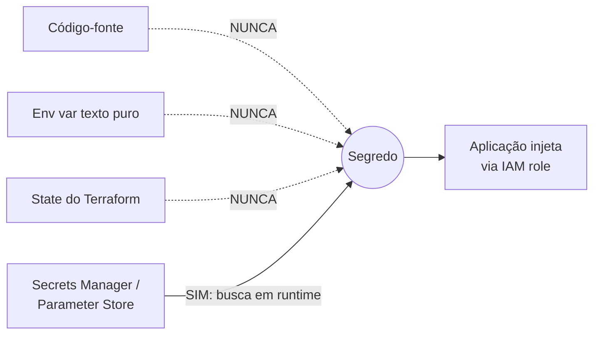
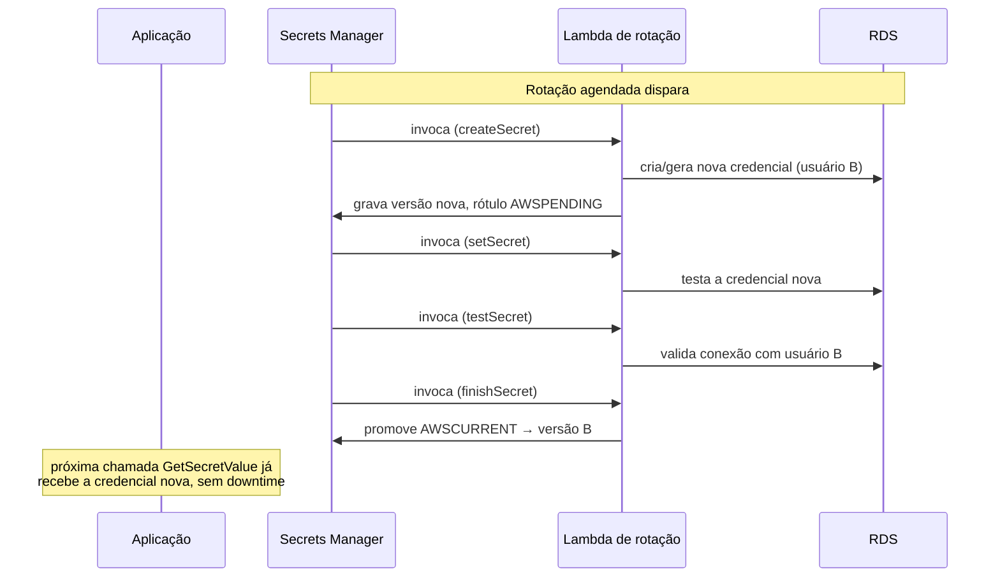
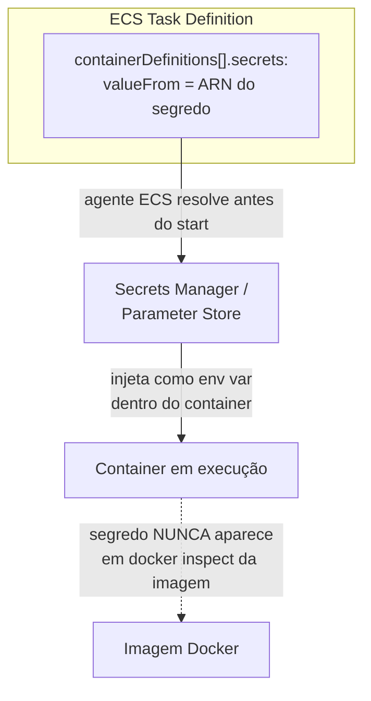

> [!abstract] TL;DR
> Senha de banco, API key, token de terceiro: nada disso pode morar no código, numa env var em texto puro ou no state do Terraform. AWS Secrets Manager guarda segredos criptografados por [[03-Dominios/Tecnologia/Cloud/18 - Segurança na cloud a fundo/02 - Criptografia gerenciada (KMS)|KMS]], versiona, e — a feature que ninguém mais oferece de graça — **rotaciona sozinho**, trocando a senha no RDS e no cofre no mesmo golpe, sem downtime. SSM Parameter Store é o irmão mais barato: guarda `SecureString` cifrado, mas não rotaciona nada sozinho. DigitalOcean cifra env vars no App Platform, só que sem rotação gerenciada — aqui a paridade quebra de verdade.

## O problema: onde um segredo NÃO pode morar

Todo sistema em produção tem segredos: a senha do banco, a chave de API do provedor de pagamento, o token OAuth de uma integração. A pergunta nunca é "vou ter segredos" — é "onde eles vivem entre o momento em que existem e o momento em que a aplicação os usa".

As respostas erradas são tentadoramente convenientes:

- **No código-fonte.** Um `git blame` de dois anos atrás ainda tem a senha antiga, porque `git log` não esquece. Mesmo que você troque a senha, ela continua no histórico, acessível pra qualquer um com clone do repositório.
- **Em env var de texto puro no seu orquestrador.** `docker inspect`, um log de erro mal filtrado, um `env` digitado sem querer numa sessão de suporte — qualquer um desses vaza a variável inteira.
- **No state do Terraform.** O `terraform.tfstate` guarda o valor final de todo atributo que você criou — inclusive senhas geradas por `random_password`. Se esse state fica num S3 sem criptografia, ou é commitado no repo "só dessa vez", o segredo está exposto.

A resposta certa é: o segredo vive num serviço gerenciado, criptografado, com controle de acesso via IAM, e a aplicação busca o valor **em runtime** — nunca antes, nunca no build, nunca no deploy. Só que "buscar em runtime" cria dois problemas novos: como você troca esse segredo periodicamente sem derrubar tudo (rotação), e como evita bater no serviço de segredos a cada requisição (cache). É disso que esta nota trata.



## AWS Secrets Manager: o cofre com rotação embutida

O Secrets Manager resolve três problemas ao mesmo tempo: armazenamento criptografado, versionamento, e — o diferencial real — **rotação automática**.

**Armazenamento.** Todo segredo é criptografado em repouso com uma chave [[03-Dominios/Tecnologia/Cloud/18 - Segurança na cloud a fundo/02 - Criptografia gerenciada (KMS)|KMS]] — a chave gerenciada `aws/secretsmanager` (sem custo adicional pra usá-la) ou uma CMK sua (cobrada à parte pelas tarifas normais de KMS). O valor nunca é decifrado em disco: a decifração acontece no momento da chamada `GetSecretValue`, sobre TLS, e o texto plano só existe na memória do processo que pediu.

**Versionamento.** Cada atualização de um segredo cria uma nova versão com um `VersionId` (UUID) e rótulos de estágio (`AWSCURRENT`, `AWSPENDING`, `AWSPREVIOUS`). Isso é o que torna a rotação segura: durante a troca, as duas versões coexistem, e você pode reverter apontando o rótulo `AWSCURRENT` de volta pra versão anterior — sem "desfazer" no sentido de undo, apenas trocando qual versão é a corrente.

**Rotação automática.** Você associa ao segredo uma função Lambda de rotação (a AWS fornece templates prontos pra RDS, DocumentDB, Redshift) e um cronograma (por exemplo, a cada 30 dias). A cada rotação, a Lambda:

1. Cria uma nova credencial (nova senha, ou um novo usuário alternado com o antigo).
2. Testa a nova credencial contra o banco de verdade.
3. Promove o rótulo `AWSCURRENT` pra essa nova versão.

Como o Secrets Manager também oferece **managed rotation** para vários bancos (sem você escrever a Lambda), o caminho mais comum hoje é: banco integrado → rotação gerenciada com um clique; banco não suportado ou lógica custom → sua própria Lambda a partir de um template.

**Replicação cross-region e resource policies.** Um segredo pode ser replicado pra outra região (útil em DR — a réplica é somente-leitura e sincroniza automaticamente com a primária). E como qualquer recurso da AWS, o segredo aceita uma **resource policy** JSON além do IAM da role que o consome — dá pra restringir, por exemplo, "só esta conta e só via esta VPC endpoint pode ler este segredo".



> [!info] Verificado em 2026-07-24
> Preço do Secrets Manager: **US$ 0,40 por segredo por mês** + **US$ 0,05 a cada 10.000 chamadas de API** (fonte: `aws.amazon.com/secrets-manager/pricing`). A rotação usa Lambda por baixo — se não for managed rotation, você também paga a tarifa normal de Lambda pela execução. Confira o valor atual antes de orçar, preços da AWS mudam sem aviso na documentação textual.

O padrão **dual credentials** (alternância de usuários) é o que torna a rotação sem downtime possível: em vez de trocar a senha do mesmo usuário `app_user`, o Secrets Manager mantém dois usuários no banco (`app_user_1` e `app_user_2`) e alterna qual deles está ativo em `AWSCURRENT` a cada rotação. Enquanto a rotação acontece, o usuário antigo continua válido — nenhuma conexão em voo é derrubada. Só depois que a nova credencial é testada e promovida é que a antiga fica disponível pra ser desativada na próxima rotação.

## SSM Parameter Store: o irmão mais barato, sem rotação

O SSM Parameter Store nasceu como armazém de configuração (endpoints, flags, IDs de AMI) e ganhou, de carona, um tipo de parâmetro cifrado: o `SecureString`, que usa KMS exatamente como o Secrets Manager. Pra config simples ou segredos de baixo risco, ele é a opção econômica.

**Tiers.** Existem dois níveis: **standard** (até 10.000 parâmetros por conta/região, valor máximo de 4 KB, sem custo adicional) e **advanced** (até 100.000 parâmetros, valor máximo de 8 KB, suporta políticas de parâmetro e compartilhamento entre contas — cobrado à parte). Dá pra misturar os dois tiers na mesma conta.

**Versionamento.** O Parameter Store guarda as **100 versões mais recentes** de cada parâmetro — útil pra investigar "qual era o valor antes de ontem", mas sem os rótulos de estágio (`AWSCURRENT`/`AWSPENDING`) que fazem a mágica da rotação no Secrets Manager.

**A diferença que importa.** A própria documentação da AWS é direta nisso: o Parameter Store **não tem rotação automática nativa**. Se você quer trocar a credencial periodicamente sem intervenção manual, ele não oferece esse mecanismo — a AWS recomenda explicitamente o Secrets Manager pra esse caso. O Parameter Store é a ferramenta certa quando o valor muda raramente (uma flag de feature, um endpoint), não quando ele precisa girar sozinho.

| Critério | Secrets Manager | SSM Parameter Store (SecureString) |
|---|---|---|
| Criptografia | KMS (obrigatória) | KMS (opcional, só em `SecureString`) |
| Rotação automática | Sim, nativa (Lambda + managed rotation p/ RDS etc.) | Não — tem que ser feita fora |
| Versionamento | Com rótulos de estágio (`AWSCURRENT`/`AWSPENDING`) | 100 versões, sem rótulos de estágio |
| Cross-region replication | Sim | Não |
| Compartilhamento entre contas | Via resource policy | Só no tier advanced |
| Custo | US$ 0,40/segredo/mês + API calls | Tier standard: grátis; advanced: cobrado |
| Uso ideal | Credenciais de banco, API keys, qualquer coisa que precise girar | Config + segredos de baixo risco, valores estáveis |

Na prática, muitos times usam os dois lado a lado: Secrets Manager pra credenciais de banco (porque a rotação vale o custo), Parameter Store pra tudo mais (porque é de graça e já resolve).

> [!tip] Assista: Secrets Management: Secrets Manager vs. Parameter Store
> **Canal:** AWS Explainers | **Duração:** ~8min | **Idioma:** EN
>
> O vídeo amarra os mesmos três critérios de decisão desta nota — rotação, custo e cache — com um exemplo numérico de uma Lambda que reduz de milhares pra poucas dezenas de chamadas usando cache, exatamente o raciocínio do "cenário de custo pra fixar a diferença" acima.
> Trecho de destaque [02:16]: *"automatic rotation. See that? Secrets Manager has it built right in for services like RDS. Parameter Store, you're kind of on your own there."*
>
> 🎬 [Assistir no YouTube](https://www.youtube.com/watch?v=KzF-HWoz5Cw)

## Injetando segredos no compute: Lambda e ECS

Buscar o segredo é fácil — `GetSecretValue` ou `GetParameter` com uma chamada de SDK. O problema é **quando** buscar.

**Lambda.** A ingenuidade comum é chamar `GetSecretValue` dentro do handler, a cada invocação. Isso funciona, mas cada chamada é uma ida de rede ao Secrets Manager — soma latência e, em alto volume, soma custo (lembre da tarifa por 10 mil chamadas). O padrão certo é buscar o segredo **fora do handler**, no escopo do módulo — assim ele só é buscado no *cold start* e fica em memória entre invocações do mesmo container Lambda (invocações "quentes" reaproveitam a variável). Pra rotação sem forçar redeploy, a AWS oferece a **Parameters and Secrets Lambda Extension**: um sidecar que roda dentro do ambiente de execução da função, expõe um endpoint HTTP local (`localhost`), e cacheia o segredo com um TTL configurável — a função chama `localhost` em vez da API do Secrets Manager diretamente, e a extensão cuida do cache e do refresh.

**ECS/Fargate.** Aqui a integração é declarativa, na própria task definition — não é a aplicação que busca o segredo, é o agente do ECS que injeta antes do container subir. No bloco `secrets` da definição do container, você referencia o ARN do segredo (ou o nome do parâmetro), e o ECS resolve o valor e injeta como variável de ambiente **dentro do container**, sem passar pela camada de logging da task nem aparecer em `docker inspect` da imagem original. Isso conecta direto com o que a nota [[03-Dominios/Tecnologia/Cloud/12 - Containers gerenciados/02 - ECS e o modelo de tarefas|ECS e o modelo de tarefas]] descreve sobre a estrutura da task definition. A pegadinha: se o valor do segredo mudar no Secrets Manager, as tasks já rodando **não** recebem o valor novo sozinhas — é preciso forçar um novo deployment (ou reiniciar as tasks) pra que elas leiam o valor atualizado na próxima subida.



### Um cenário de custo pra fixar a diferença

Imagine uma API com 15 credenciais distintas (bancos, filas, integrações externas), consultadas em média 50.000 vezes por dia por uma frota de Lambdas — sem cache, no pior caso.

- **Tudo no Secrets Manager, sem cache:** 15 segredos × US$ 0,40 = US$ 6,00/mês de armazenamento, mais 50.000 × 30 dias = 1.500.000 chamadas/mês × US$ 0,05/10.000 = US$ 7,50/mês. Total: ~US$ 13,50/mês. Não é caro — mas repare que quase 60% da fatura vem só de chamadas evitáveis.
- **Mesmo cenário, com cache de 5 minutos via extensão:** o número de chamadas cai de 1,5 milhão pra uma fração — se cada Lambda faz, digamos, uma chamada a cada 5 minutos de vida em vez de uma por invocação, o custo de API despenca pra centavos, e a fatura vira essencialmente os US$ 6,00 de armazenamento.
- **Trocando os 8 segredos que nunca giram por Parameter Store standard:** economiza US$ 3,20/mês de armazenamento (8 × US$ 0,40) — pequeno em valor absoluto, mas ilustra o critério certo: reservar o Secrets Manager pro que realmente precisa de rotação, e não pagar a taxa mensal por um valor que nunca muda.

O ponto não é o valor em si — é que **cache é a alavanca de custo real** aqui, muito mais do que a escolha entre os dois serviços.

### A extensão do Lambda, com código

```python
import os
import urllib.request
import json

SECRETS_EXTENSION_HTTP_PORT = 2773

def get_secret(secret_id: str) -> dict:
    url = (
        f"http://localhost:{SECRETS_EXTENSION_HTTP_PORT}"
        f"/secretsmanager/get?secretId={secret_id}"
    )
    req = urllib.request.Request(url, headers={
        "X-Aws-Parameters-Secrets-Token": os.environ["AWS_SESSION_TOKEN"]
    })
    with urllib.request.urlopen(req) as resp:
        body = json.loads(resp.read())
        return json.loads(body["SecretString"])

# Chamado fora do handler: o cache da extensão evita
# uma chamada de rede nova a cada invocação quente.
DB_CREDS = get_secret("prod/api/db-credentials")

def handler(event, context):
    # usa DB_CREDS já resolvido, sem bater no Secrets Manager de novo
    ...
```

A extensão roda como um processo sidecar dentro do mesmo ambiente de execução da função (adicionada via camada/Lambda Layer), respeita um TTL de cache configurável por variável de ambiente (`SECRETS_MANAGER_TTL`), e é o jeito recomendado de pegar o melhor dos dois mundos: segredo sempre atualizável no cofre, sem pagar o preço de uma chamada de API por invocação.

## Casos práticos: os comandos que você vai usar

**Criar um segredo:**

```bash
aws secretsmanager create-secret \
  --name prod/api/db-credentials \
  --description "Credenciais do RDS de produção" \
  --secret-string '{"username":"app_user","password":"S3nh4Gerada!"}'
```

**Buscar o valor (em runtime, não no build):**

```bash
aws secretsmanager get-secret-value \
  --secret-id prod/api/db-credentials \
  --query SecretString --output text
```

**Habilitar rotação automática com managed rotation (RDS):**

```bash
aws secretsmanager rotate-secret \
  --secret-id prod/api/db-credentials \
  --rotation-lambda-arn arn:aws:lambda:us-east-1:123456789012:function:SecretsManagerRDSRotation \
  --rotation-rules AutomaticallyAfterDays=30
```

**Referenciar o segredo numa task definition do ECS** (trecho do JSON):

```json
{
  "containerDefinitions": [{
    "name": "api",
    "secrets": [
      {
        "name": "DB_PASSWORD",
        "valueFrom": "arn:aws:secretsmanager:us-east-1:123456789012:secret:prod/api/db-credentials:password::"
      },
      {
        "name": "FEATURE_FLAG",
        "valueFrom": "arn:aws:ssm:us-east-1:123456789012:parameter/prod/api/feature-flag"
      }
    ]
  }]
}
```

**Parameter Store: gravar e ler um `SecureString`:**

```bash
aws ssm put-parameter \
  --name /prod/api/third-party-key \
  --value "sk_live_xxx" \
  --type SecureString \
  --key-id alias/aws/ssm

aws ssm get-parameter \
  --name /prod/api/third-party-key \
  --with-decryption \
  --query Parameter.Value --output text
```

### Resource policy: restringindo quem lê o segredo além do IAM

A role da aplicação já precisa de uma permissão IAM (`secretsmanager:GetSecretValue` no ARN do segredo) pra conseguir ler — isso é básico. A resource policy entra quando você quer uma segunda trava, anexada ao próprio segredo, independente de quem assume a role. Um caso comum: permitir leitura só de dentro da VPC, mesmo que a role tecnicamente tivesse a permissão IAM.

```json
{
  "Version": "2012-10-17",
  "Statement": [{
    "Effect": "Deny",
    "Principal": "*",
    "Action": "secretsmanager:GetSecretValue",
    "Resource": "*",
    "Condition": {
      "StringNotEquals": {
        "aws:sourceVpce": "vpce-0123456789abcdef0"
      }
    }
  }]
}
```

Esse `Deny` condicional é o padrão pra segredos que nunca deveriam ser lidos de fora da rede privada — mesmo que alguém, por erro de configuração, dê a permissão IAM certa pra uma role errada, a resource policy barra a leitura de qualquer lugar que não seja o VPC endpoint esperado. É a mesma lógica de defesa em profundidade que aparece em outras partes deste galho: nunca confiar numa única camada de controle.

## Por que rotacionar, afinal

Rotação não é teatro de compliance. O argumento é probabilístico: toda credencial de longa duração é um vazamento em potencial esperando acontecer — um laptop roubado, um log mal configurado, um repositório privado que virou público por engano. Quanto menor a **janela de validade** de uma credencial, menor o dano que um vazamento causa, porque a credencial vazada expira sozinha antes de ser útil pro atacante. Uma senha de banco que roda por dois anos sem trocar é, na prática, uma senha permanente — se vazar em qualquer ponto desses dois anos, o atacante tem acesso até alguém perceber. Uma senha que rotaciona a cada 30 dias limita esse acesso a, no pior caso, um mês.

> [!warning] Anti-padrões comuns
> - **Segredo em env var visível no painel do orquestrador.** Se qualquer pessoa com acesso de leitura ao ECS/Lambda/App Platform consegue ver o valor em texto puro no console, você perdeu o controle de quem sabe o segredo — o controle de acesso do IAM sobre o Secrets Manager deixou de valer.
> - **Segredo commitado "só dessa vez, já removo depois".** Não existe "removo depois" em Git — o histórico guarda pra sempre, a menos que você reescreva a árvore inteira (e revogue a credencial de qualquer forma, porque ela já vazou).
> - **Buscar o segredo a cada invocação sem cache.** Em Lambda de alto volume, isso vira uma fatura de API calls do Secrets Manager e uma latência extra em toda requisição — cacheie fora do handler ou use a extensão.
> - **Rotacionar sem testar a credencial nova antes de promovê-la.** É pra isso que existe o passo `testSecret` do ciclo de rotação — pular essa etapa (numa Lambda de rotação custom mal escrita) pode promover uma credencial quebrada e derrubar produção.
> - **Esquecer de forçar redeploy no ECS depois de trocar o segredo manualmente.** A task já em execução não relê o valor sozinha.

## Lente dupla: AWS Secrets Manager vs DigitalOcean

Aqui a paridade quebra de verdade, e vale ser honesto sobre isso. O App Platform da DigitalOcean tem **variáveis de ambiente cifradas**: ao criar ou editar uma env var, você marca a opção "Encrypt", e a plataforma cifra o valor e o guarda assim no app spec. É proteção de armazenamento — resolve o problema de "não deixar o valor em texto puro no YAML do app".

O que a DO **não tem** é um serviço de segredos gerenciado equivalente ao Secrets Manager: não existe rotação automática integrada, não existe versionamento com rótulos de estágio, não existe replicação cross-region de segredos, não existe Lambda de rotação nem managed rotation pra bancos gerenciados. A própria documentação da DO é explícita sobre o modelo de ameaça residual: variáveis cifradas são decifradas em runtime e ficam **visíveis pra qualquer membro do time com acesso ao console da aplicação** — a mitigação recomendada é restringir quem tem papel de Owner/Member e exigir revisão de pull request pras mudanças de configuração, não um controle de acesso granular por segredo como o IAM oferece sobre um ARN específico do Secrets Manager.

Na prática, quem roda produção séria na DigitalOcean e precisa de rotação real geralmente resolve isso com uma ferramenta terceira (Vault, Doppler) por cima do App Platform — a DO cifra o armazenamento, mas a disciplina de rotação fica por sua conta.

| | AWS Secrets Manager | DigitalOcean App Platform |
|---|---|---|
| Armazenamento cifrado | Sim (KMS) | Sim (cifra no app spec) |
| Rotação automática | Sim, nativa | Não existe |
| Versionamento com rótulos de estágio | Sim | Não |
| Cross-region replication | Sim | Não |
| Escopo de visibilidade | IAM por ARN/resource policy | Qualquer membro com acesso ao console vê o valor decifrado |

## Azure e GCP: tradução de nomes

| Conceito | AWS | DigitalOcean | Azure | GCP |
|---|---|---|---|---|
| Cofre de segredos gerenciado | Secrets Manager | (env vars cifradas, sem cofre dedicado) | Azure Key Vault (secrets) | Secret Manager |
| Config simples/cifrada | SSM Parameter Store | App spec env vars | App Configuration | Secret Manager (mesmo serviço, sem tier separado) |
| Rotação automática nativa | Sim (Lambda + managed rotation) | Não | Sim (via Event Grid + Function) | Sim (Cloud Functions + Scheduler) |
| Chave de criptografia por trás | AWS KMS | (interno da plataforma) | Azure Key Vault (chaves) | Cloud KMS |

## O que vem a seguir

Segredos resolvem "como guardar a credencial"; a próxima camada do galho olha pro tráfego que chega até a aplicação — segurança de rede e perímetro, retomando Security Groups e NACLs (vistos no galho de rede) sob a lente específica de defesa em profundidade. Depois vem governança: como saber, com CloudTrail e Config, quem acessou qual segredo e quando — o rastro de auditoria que torna a rotação e o controle de acesso verificáveis, não apenas configurados.

## Fontes

- AWS. "What is AWS Secrets Manager?" https://docs.aws.amazon.com/secretsmanager/latest/userguide/intro.html
- AWS. "AWS Secrets Manager Pricing." https://aws.amazon.com/secrets-manager/pricing/
- AWS. "AWS Systems Manager Parameter Store." https://docs.aws.amazon.com/systems-manager/latest/userguide/systems-manager-parameter-store.html
- AWS. "Pass sensitive data to an Amazon ECS container." https://docs.aws.amazon.com/AmazonECS/latest/developerguide/specifying-sensitive-data-secrets.html
- AWS. "Retrieve secrets from AWS Secrets Manager or Parameter Store using Lambda extensions." https://docs.aws.amazon.com/systems-manager/latest/userguide/ps-integration-lambda-extensions.html
- DigitalOcean. "How to Use Encrypted and Bindable Environment Variables in App Platform." https://docs.digitalocean.com/products/app-platform/how-to/use-environment-variables/

