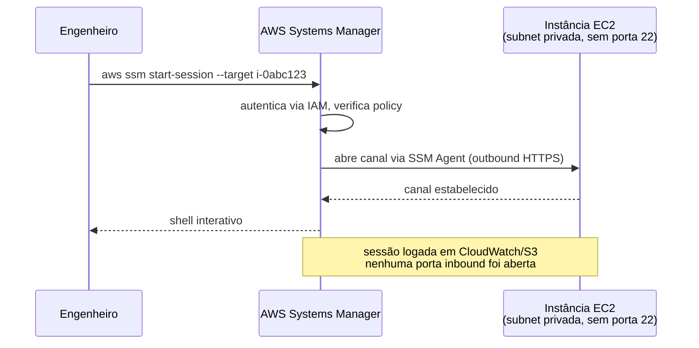

# Segurança de rede e perímetro

> [!abstract] TL;DR
> Este galho já tratou identidade (quem pode agir), criptografia (o que fica ilegível em repouso) e segredos (o que nunca aparece em texto puro). Falta a camada que decide **quem consegue chegar até o recurso, para começo de conversa** — e essa camada não é nova: é a rede da VPC (galho 7) e a borda (galho 10), agora vistas com a lente de "superfície de ataque" em vez de "topologia". A regra que amarra tudo é **defesa em profundidade**: borda (WAF/Shield) → VPC (roteamento e endpoints) → subnet (NACL) → instância (security group) → aplicação (IAM), cada camada cobrindo a falha da anterior. Duas técnicas concretas reduzem a superfície de ataque de rede a quase zero: **conectividade privada** (VPC endpoints/PrivateLink, para nunca sair à internet ao falar com serviços gerenciados) e **acesso administrativo sem porta aberta** (SSM Session Manager, que elimina SSH/RDP exposto e bastion hosts). A DigitalOcean cobre o essencial — Cloud Firewall (equivalente ao SG, sem custo adicional) e VPC — mas não tem PrivateLink, Network Firewall gerenciado nem um substituto direto do Session Manager.

## O problema: cada camada, sozinha, mente sobre estar segura

Imagine uma auditoria de segurança perguntando, sobre um banco de dados de produção: "isso está seguro?" Uma resposta como "sim, está numa subnet privada" é verdadeira e, ao mesmo tempo, incompleta o bastante para ser perigosa. Subnet privada responde "este recurso não é alcançável diretamente da internet" — mas não diz nada sobre quem, *dentro* da VPC, consegue abrir uma conexão nele. Um security group bem configurado responde essa segunda pergunta — mas não protege contra um ataque volumétrico batendo na borda antes mesmo do tráfego chegar à VPC. Um WAF na borda filtra payloads maliciosos na camada 7 — mas não impede que um engenheiro, sob pressão de deploy, abra a porta 22 do bastion para `0.0.0.0/0` "só por hoje".

Cada controle, isolado, cobre uma fatia estreita da superfície de ataque. A pergunta que esta nota responde não é "qual controle uso" — é **como empilhar os controles certos, na ordem certa, para que a falha de um seja pega pelo próximo**. Isso já apareceu, peça por peça, nas trilhas de rede (galho 7, VPC/SG/NACL/conectividade privada) e de borda (galho 10, DNS/CDN/WAF/Shield). O que faltava era montar o quadro inteiro e adicionar duas peças que essas notas mencionaram de passagem, sem aprofundar: **VPC endpoints como controle de segurança** (não só de custo/latência) e **acesso administrativo sem SSH exposto**.

## O mapa completo: defesa em profundidade, camada por camada

```mermaid
flowchart TB
    Internet(["Internet<br/>tráfego hostil e legítimo misturados"])

    subgraph Borda["1. BORDA — galho 10"]
        Shield["AWS Shield<br/>DDoS L3/L4, sempre ligado"]
        WAF["AWS WAF<br/>filtro L7 — SQLi, XSS, rate limit"]
    end

    subgraph VPCL["2. VPC — galho 7"]
        RT["Route tables<br/>quem tem rota pra IGW/NAT"]
        EP["VPC Endpoints / PrivateLink<br/>tráfego pra serviços AWS sem sair à internet"]
    end

    subgraph SubL["3. SUBNET"]
        NACL["NACL<br/>stateless, allow+deny, por subnet"]
    end

    subgraph InstL["4. INSTÂNCIA"]
        SG["Security Group<br/>stateful, allow-only, por ENI"]
    end

    subgraph AppL["5. APLICAÇÃO — galho 4"]
        IAM["IAM role da instância<br/>o que ela pode fazer, não só alcançar"]
    end

    Internet --> Shield --> WAF --> RT
    RT --> NACL --> SG --> IAM
    RT -.tráfego p/ S3/DynamoDB/etc.-> EP

    style Borda fill:#3a1f1f
    style VPCL fill:#1f2f3a
    style SubL fill:#2a1f3a
    style InstL fill:#1f3a2a
    style AppL fill:#3a3a1f
```



Repare que cada camada tem um **modelo de decisão diferente** — não é a mesma regra repetida cinco vezes por burocracia. Shield opera em volume de pacotes, sem olhar conteúdo. WAF olha conteúdo (camada 7), mas não sabe nada sobre a topologia interna da VPC. A NACL sabe sobre subnets inteiras, mas é grosseira demais para diferenciar duas instâncias na mesma subnet. O SG resolve exatamente esse ponto cego, granular por instância — mas confia cegamente em qualquer coisa que já esteja dentro da VPC, a menos que uma regra diga o contrário. E o IAM, por fim, não impede conexão nenhuma: ele decide o que a instância pode *fazer* depois de já estar autenticada, o que é uma pergunta ortogonal a "quem alcança o quê".

Essa é a razão pela qual "defesa em profundidade" não é jargão vazio de slide de vendas: é uma propriedade matemática do sistema. Um atacante que rompe uma camada (por exemplo, credencial vazada que passa pelo IAM) ainda esbarra nas camadas de rede, se elas estiverem configuradas com least privilege de verdade. E um erro de configuração de rede (SG liberado demais) ainda esbarra no IAM, se a role da instância comprometida não tiver permissão para o que o atacante quer fazer. Nenhuma camada sozinha é suficiente; a composição é que segura.

> [!info] Recap rápido — o que já foi coberto e onde
> - **SG vs NACL** (stateful/allow-only por instância vs stateless/allow+deny por subnet): aprofundado em [[03-Dominios/Tecnologia/Cloud/07 - Rede na nuvem (VPC)/index|Rede na nuvem (VPC)]], nota 04.
> - **WAF, Shield, origin protection** (borda como primeira linha de filtro de conteúdo e volume): aprofundado em [[03-Dominios/Tecnologia/Cloud/10 - DNS, CDN e borda/05 - A borda como camada|A borda como camada]].
> - Esta nota não reensina nenhum dos dois — ela costura os dois com a lente de "superfície de ataque" e aprofunda o que ficou raso nas notas de origem: conectividade privada como controle de segurança, e acesso administrativo sem porta aberta.

## Least privilege de rede: a regra que organiza tudo

Antes de entrar nas duas técnicas centrais, vale nomear o princípio que orienta cada decisão de configuração de rede: **least privilege de rede** — a versão em topologia do mesmo princípio de IAM que o galho 4 já tratou para identidade. Em IAM, least privilege significa "esta role só pode fazer exatamente as ações que precisa, nada a mais". Em rede, significa "esta instância só pode ser alcançada, na porta exata que precisa, pela origem exata que precisa — nada a mais".

Na prática, isso vira uma disciplina simples de aplicar e fácil de negligenciar:

```hcl
# Security group do banco de dados: só aceita 5432 do SG da aplicação,
# nunca de um CIDR, nunca de "toda a VPC"
resource "aws_security_group" "db" {
  name   = "db-least-privilege"
  vpc_id = aws_vpc.main.id

  ingress {
    description     = "PostgreSQL apenas da app"
    from_port       = 5432
    to_port         = 5432
    protocol        = "tcp"
    security_groups = [aws_security_group.app.id]  # referência a SG, não CIDR
  }

  # sem regra de saída ampla — só o necessário
  egress {
    description = "Apenas replicação/backup, se aplicável"
    from_port   = 0
    to_port     = 0
    protocol    = "-1"
    cidr_blocks = ["10.0.0.0/16"]  # nunca 0.0.0.0/0 num banco
  }
}
```

A armadilha mais comum não é técnica — é de processo. Referenciar `security_groups = [...]` em vez de `cidr_blocks = [...]` é estruturalmente mais seguro porque a regra segue a instância mesmo que o IP mude (instâncias são recriadas o tempo todo em auto scaling); um CIDR fixo, cedo ou tarde, vira uma regra desatualizada que ninguém audita.

## Conectividade privada como controle de segurança, não só de custo

O galho 7 já introduziu VPC endpoints como uma forma de evitar o pedágio do NAT Gateway ao falar com S3 ou DynamoDB. Isso é verdade, mas é a metade menos interessante da história para quem pensa em segurança. A metade que importa aqui: **todo tráfego que sai pela internet pública, mesmo criptografado, é superfície de ataque** — DNS pode ser sequestrado, rotas podem ser manipuladas em cenários de BGP hijacking, e cada salto público é um ponto a mais que um pentest ou uma auditoria de compliance vai perguntar "isso precisava sair da rede privada?".

Um **VPC endpoint** resolve isso na raiz: o tráfego entre a instância e o serviço AWS nunca atravessa a internet pública, nunca precisa de IP público em nenhuma ponta, e nunca passa por Internet Gateway ou NAT Gateway. Existem duas variantes, e a distinção importa para o desenho de segurança, não só de custo:

- **Gateway endpoint**: uma entrada na tabela de rotas da subnet, sem custo, cobrindo só S3 e DynamoDB.
- **Interface endpoint**: uma ENI privada dentro da própria subnet, construída sobre **AWS PrivateLink**, cobrando por hora e por GB processado, cobrindo a maioria dos demais serviços gerenciados (Secrets Manager, KMS, SSM, ECR, e dezenas de outros).

```mermaid
flowchart LR
    subgraph VPC["VPC — subnet privada"]
        App["Instância de app<br/>sem IP público"]
        EP["Interface Endpoint<br/>(ENI privada, via PrivateLink)"]
    end
    App -->|"tráfego nunca sai da rede AWS"| EP
    EP -.->|"backbone privado da AWS"| S3["Amazon S3"]

    IGW["Internet Gateway"]
    NAT["NAT Gateway"]
    style IGW fill:#3a1f1f
    style NAT fill:#3a1f1f
```



O ponto de segurança que o galho 7 não aprofundou: um Interface endpoint aceita uma **endpoint policy** — uma política em formato IAM que restringe *o que* pode ser acessado através daquele endpoint especificamente, independente das permissões IAM da instância. Isso permite, por exemplo, um endpoint que só deixa passar tráfego para um bucket S3 nomeado, mesmo que a role da instância tecnicamente tivesse permissão para outros buckets — uma segunda trava, na camada de rede, sobre uma decisão que o IAM já toma na camada de identidade. É defesa em profundidade dentro da própria defesa em profundidade.

```json
{
  "Version": "2012-10-17",
  "Statement": [
    {
      "Effect": "Allow",
      "Principal": "*",
      "Action": ["s3:GetObject", "s3:PutObject"],
      "Resource": [
        "arn:aws:s3:::app-logs-producao/*"
      ]
    }
  ]
}
```

Essa política, anexada ao endpoint (não ao bucket, não à role), garante que, mesmo que alguém amplie por engano a permissão IAM de uma instância para "todos os buckets", o tráfego que sai por aquele endpoint específico continua fisicamente restrito ao bucket nomeado. É uma trava que sobrevive a erro de configuração em outra camada — exatamente a propriedade que defesa em profundidade promete.

> [!warning] Endpoint sem policy é um cheque em branco
> Um Interface endpoint criado sem endpoint policy explícita usa a política padrão `Allow: *` — ou seja, deixa passar qualquer ação que a identidade do lado da instância já tenha permissão, sem trava adicional nenhuma. Criar o endpoint resolve o problema de "sair pela internet"; só a policy resolve o problema de "acesso amplo demais". As duas coisas são frequentemente confundidas em auditorias — alguém marca "usamos VPC endpoint, estamos seguros" sem checar se a policy restringe algo de fato.

> [!tip] Assista: VPC Endpoints and AWS PrivateLink - AWS SCS-C03
> **Canal:** Cybr | **Duração:** ~7min | **Idioma:** EN
>
> O vídeo mostra, passo a passo, a checagem de uma endpoint policy travando (ou liberando) uma chamada a um serviço gerenciado — a mesma dupla trava (endpoint policy + política do serviço) que esta nota descreve para o Interface endpoint. Trecho de destaque [03:18]: *"make sure that the endpoint policy is allowing the request as well as [...] our KMS key policy"*
>
> 🎬 [Assistir no YouTube](https://www.youtube.com/watch?v=bNUdCifl1sQ)

Na DigitalOcean, esse recurso simplesmente não existe. Não há PrivateLink, não há VPC endpoint, não há equivalente. Falar com um bucket Spaces (o S3 da DO) a partir de um Droplet significa, sempre, sair para a internet pública — a DO não oferece um caminho de rede privado equivalente para serviços gerenciados próprios. Isso não é um detalhe menor para quem desenha arquitetura de conformidade (PCI-DSS, HIPAA) na DO: a mitigação, nesse caso, recai inteiramente sobre TLS em trânsito e IAM/token scoping, porque a camada de rede não ajuda aqui.

## Isolamento administrativo: matar o SSH exposto

A segunda técnica central desta nota resolve um problema diferente: como um humano — um engenheiro fazendo troubleshooting às 2h da manhã — acessa uma instância numa subnet privada sem abrir uma porta administrativa para a internet.

O padrão antigo é o **bastion host** (também chamado jump box): uma instância minúscula, na subnet pública, com a porta 22 aberta só para IPs confiáveis, que serve de salto para as instâncias privadas. Funciona, mas carrega problemas estruturais: o bastion vira, ele mesmo, um alvo permanente (é a única porta 22 exposta em toda a arquitetura); chaves SSH precisam ser distribuídas, rotacionadas e revogadas manualmente; e não existe, por padrão, um log centralizado e auditável de *quem* rodou *o quê* dentro da sessão — só o log de conexão SSH, que não captura comandos.

O **AWS Systems Manager Session Manager** resolve isso eliminando a porta aberta inteiramente. Uma instância com o SSM Agent instalado e uma IAM role com a permissão certa se conecta ao serviço Systems Manager via **outbound HTTPS** — nenhuma porta inbound precisa existir, nem 22, nem 3389 para Windows. O engenheiro inicia a sessão pelo console, CLI ou SDK; a AWS autentica via IAM, abre um canal bidirecional criptografado (TLS 1.2, com opção de camada extra via KMS), e cada sessão pode ser logada integralmente — comandos e saída — no CloudWatch Logs ou S3, com notificação via EventBridge de início/fim de sessão.



A permissão em si é controlada por IAM policy, não por gestão de chave:

```json
{
  "Version": "2012-10-17",
  "Statement": [
    {
      "Effect": "Allow",
      "Action": [
        "ssm:StartSession"
      ],
      "Resource": "arn:aws:ec2:*:*:instance/*",
      "Condition": {
        "StringEquals": { "ssm:resourceTag/Ambiente": "producao-restrito" }
      }
    }
  ]
}
```

Isso permite, por exemplo, dar acesso de sessão só ao engenheiro de plantão, só durante o turno, só para instâncias com uma tag específica — controle temporal e granular que uma chave SSH distribuída fisicamente nunca oferece, porque uma chave, uma vez copiada, não tem prazo de validade nem escopo automático.

Vale reforçar, para não confundir camadas: usar o Session Manager por si só ainda usa a rede — ele pode inclusive rodar dentro de uma VPC Endpoint (Interface endpoint para `ssm`, `ssmmessages`, `ec2messages`), o que remove até a necessidade de a instância ter rota para a internet pública. Nesse desenho final, uma instância de produção não tem porta inbound de administração, não tem IP público, e não tem rota de saída para a internet geral — só um caminho privado e auditado até o Systems Manager.

Na DigitalOcean, não existe um serviço equivalente gerenciado. A prática recomendada continua sendo bastion host com chave SSH, ou uma VPN própria (WireGuard/OpenVPN num Droplet dedicado) para acesso administrativo à VPC privada da DO — a plataforma não oferece um substituto sem-porta-aberta nativo.

> [!tip] Assista: How to Securely Access Private EC2 Instances: SSM vs. Bastion Hosts
> **Canal:** AWS Explainers | **Duração:** ~7min | **Idioma:** EN
>
> O vídeo compara os dois caminhos lado a lado — inclusive o custo de manter um bastion rodando e a exposição permanente da porta 22 — reforçando com números concretos exatamente o argumento estrutural que esta nota faz a favor do Session Manager. Trecho de destaque [02:07]: *"This means keeping port 22 open, which is basically a giant welcome sign for automated bots just scanning for weaknesses."*
>
> 🎬 [Assistir no YouTube](https://www.youtube.com/watch?v=0oGNSzf_n0I)

## Egress control: a direção que costuma ser esquecida

Toda a discussão até aqui tratou de tráfego de entrada (ingress) — quem alcança o quê. Mas defesa em profundidade de rede madura também controla a **saída** (egress): se uma instância for comprometida, o que ela consegue *falar para fora*? Um SG sem regra de egress restritiva permite, por padrão em muitos templates, saída irrestrita para qualquer porta e destino — o que significa que malware instalado numa instância comprometida consegue exfiltrar dados livremente ou se comunicar com um servidor de comando e controle.

O **AWS Network Firewall** é a ferramenta para egress control sofisticado em escala de VPC: um firewall gerenciado, stateful, com inspeção de domínio (permitir só saída para uma lista de domínios aprovados, por exemplo `*.amazonaws.com` e o registry de pacotes da empresa) e assinaturas de detecção de intrusão. É uma peça mais pesada — e mais cara — que um SG, reservada tipicamente para VPCs com requisito de compliance explícito sobre tráfego de saída.

DigitalOcean não tem um Network Firewall gerenciado equivalente; o Cloud Firewall da DO cobre regras de porta/protocolo/origem em ambas as direções (é stateful, "bloca todo tráfego não expressamente permitido", sem custo adicional), mas não oferece inspeção de domínio ou assinaturas de IDS/IPS — para esse nível, a mitigação na DO passa por uma solução de terceiros rodando dentro do próprio Droplet, ou VPN com egress fixo.

> [!info] Verificado 2026-07-24
> AWS Systems Manager Session Manager: elimina porta inbound (SSH/RDP), suporta PrivateLink, sessão logada via CloudTrail/S3/CloudWatch Logs — confirmado em docs.aws.amazon.com/systems-manager. DigitalOcean Cloud Firewall: stateful, por Droplet ou tag, sem custo adicional — confirmado em docs.digitalocean.com/products/networking/firewalls. A documentação da DO não menciona equivalente a NACL de subnet nem a VPC endpoints/PrivateLink; tratar essa lacuna como atual mas reverificar se a DO expandir a oferta de networking.

## Caso prático: fechando uma arquitetura de três camadas

Reúna as peças num cenário concreto — o mesmo tipo de arquitetura de três camadas (borda, aplicação, dados) que aparece em praticamente toda entrevista técnica de cloud. Uma API pública, um serviço interno que ela chama, e um banco de dados que só o serviço interno acessa.

| Camada | Controle aplicado | O que ele impede |
|---|---|---|
| Borda | WAF + Shield na frente do load balancer | payload malicioso (L7) e flood volumétrico (L3/L4) antes de tocar a VPC |
| VPC — saída | NAT Gateway só na subnet da API pública; nenhuma rota de internet nas subnets internas | serviço interno e banco nunca conseguem iniciar conexão de saída para a internet geral |
| VPC — serviços gerenciados | Interface endpoint com policy restrita para Secrets Manager e S3 | serviço interno lê segredo e grava log sem sair da rede AWS, e só no recurso nomeado |
| Subnet | NACL negando explicitamente tráfego direto da subnet pública para a subnet de dados | mesmo um erro de SG na subnet de dados não expõe o banco à subnet errada |
| Instância | SG do banco só aceita 5432, só do SG do serviço interno; SG do serviço interno só aceita sua porta, só do SG do load balancer | qualquer instância "vizinha" mal configurada, sem ser o serviço interno legítimo, não alcança o banco |
| Administração | Session Manager, sem porta 22 em nenhuma das três camadas | credencial SSH vazada ou reaproveitada não abre nada, porque não existe porta para abrir |

Nenhuma dessas seis linhas, isolada, seria suficiente contra um atacante determinado. Juntas, um comprometimento em qualquer ponto único da cadeia — um WAF mal regrado, um SG esquecido aberto demais, uma credencial vazada — ainda esbarra em pelo menos uma camada seguinte antes de alcançar o dado sensível. É esse empilhamento, não uma peça mágica isolada, que uma auditoria de segurança de rede madura está de fato verificando.

## Tradução de nomes: Azure e GCP

Sem hands-on nas outras nuvens — só o vocabulário, para reconhecer o conceito equivalente numa entrevista ou numa migração cross-cloud.

| Conceito | AWS | DigitalOcean | Azure | GCP |
|---|---|---|---|---|
| Firewall por instância (stateful) | Security Group | Cloud Firewall | Network Security Group (NSG) | Firewall Rules (VPC-level, aplicado por tag) |
| Firewall por subnet (stateless, allow+deny) | Network ACL | — (não existe) | NSG também cobre subnet | — (não existe controle separado por subnet) |
| Acesso privado a serviços gerenciados | VPC Endpoint / AWS PrivateLink | — (não existe) | Private Link / Private Endpoint | Private Service Connect |
| Acesso administrativo sem porta aberta | Systems Manager Session Manager | — (bastion/VPN manual) | Azure Bastion | Identity-Aware Proxy (IAP) TCP forwarding |
| Firewall de aplicação (L7) na borda | AWS WAF | — (indica Cloudflare/Marketplace) | Azure WAF (no Application Gateway/Front Door) | Google Cloud Armor |
| Proteção DDoS gerenciada | AWS Shield | Proteção de rede L3/L4 sempre ligada, sem produto nomeado | Azure DDoS Protection | Google Cloud Armor (camada de DDoS incluída) |

## Zero-trust, de raspão

Vale nomear, sem aprofundar (é um domínio inteiro por si só), para onde essa disciplina de "least privilege de rede + autenticação em toda camada" está migrando na indústria: **zero-trust networking**. A ideia central é inverter a suposição implícita de "dentro da VPC é confiável" — em zero-trust, nenhuma requisição é confiável só por estar na mesma rede; toda conexão, mesmo entre dois serviços dentro da mesma VPC, se autentica e autoriza individualmente (tipicamente via mTLS entre serviços, orquestrado por um service mesh). Isso é uma extensão natural de tudo o que esta nota descreveu — SG e NACL já reduzem a confiança implícita da rede, zero-trust a reduz a praticamente zero — mas a implementação completa (service mesh, mTLS ponta a ponta, políticas de autorização por serviço) foge do escopo de segurança de rede cloud e pertence à trilha de Comunicação entre Sistemas.

## Armadilhas

> [!warning] "Subnet privada" não é sinônimo de "seguro"
> Uma subnet privada sem rota para o IGW impede acesso *direto* da internet, mas não impede acesso de qualquer outra instância dentro da mesma VPC. Sem SG e NACL configurados com least privilege, "estar numa subnet privada" é uma frase que soa segura em uma reunião e não é, tecnicamente, controle de acesso nenhum.

> [!warning] VPC endpoint sem endpoint policy é decoração
> Como mostrado acima, criar o endpoint resolve "não sair pela internet"; só a policy resolve "acesso restrito ao necessário". Os dois são frequentemente tratados como a mesma caixa de seleção numa auditoria, e não são.

> [!warning] Bastion host esquecido é pior que nenhum bastion
> Um bastion host criado numa migração e nunca desativado depois que o Session Manager entrou em produção continua sendo uma porta 22 exposta — a superfície de ataque antiga não desaparece só porque uma alternativa melhor existe ao lado dela. Migrar para Session Manager exige, explicitamente, destruir o bastion antigo, não só parar de usá-lo.

> [!warning] Egress irrestrito é o ponto cego mais comum
> Times de segurança auditam ingress com rigor e esquecem egress quase sempre. Um SG "default allow all outbound" (o padrão de muitos templates) significa que qualquer instância comprometida tem via livre para exfiltrar dados ou falar com infraestrutura maliciosa — vale tratar egress restritivo como parte do mesmo least privilege aplicado a ingress, não como um extra opcional.

## O que vem a seguir

As quatro primeiras notas deste galho cobriram identidade, criptografia, segredos e agora rede — os controles técnicos individuais de segurança na nuvem. A próxima nota fecha o ciclo de outra forma: em vez de "como configurar um controle", ela trata de **como saber que os controles configurados continuam corretos ao longo do tempo** — governança, auditoria e compliance, via CloudTrail, Config e as ferramentas de threat detection gerenciadas da AWS. É a diferença entre "configurei o SG certo hoje" e "sei, com evidência, que o SG continua certo daqui a seis meses, depois de vinte deploys e três trocas de time".

## Fontes

- [AWS Systems Manager — Session Manager](https://docs.aws.amazon.com/systems-manager/latest/userguide/session-manager.html)
- [AWS VPC — VPC Endpoints](https://docs.aws.amazon.com/vpc/latest/privatelink/vpc-endpoints.html)
- [AWS PrivateLink — Documentação](https://docs.aws.amazon.com/vpc/latest/privatelink/what-is-privatelink.html)
- [AWS Network Firewall — Documentação](https://docs.aws.amazon.com/network-firewall/latest/developerguide/what-is-aws-network-firewall.html)
- [AWS Security Groups — VPC User Guide](https://docs.aws.amazon.com/vpc/latest/userguide/vpc-security-groups.html)
- [DigitalOcean — Cloud Firewalls](https://docs.digitalocean.com/products/networking/firewalls/)
- [DigitalOcean — VPC](https://docs.digitalocean.com/products/networking/vpc/)
