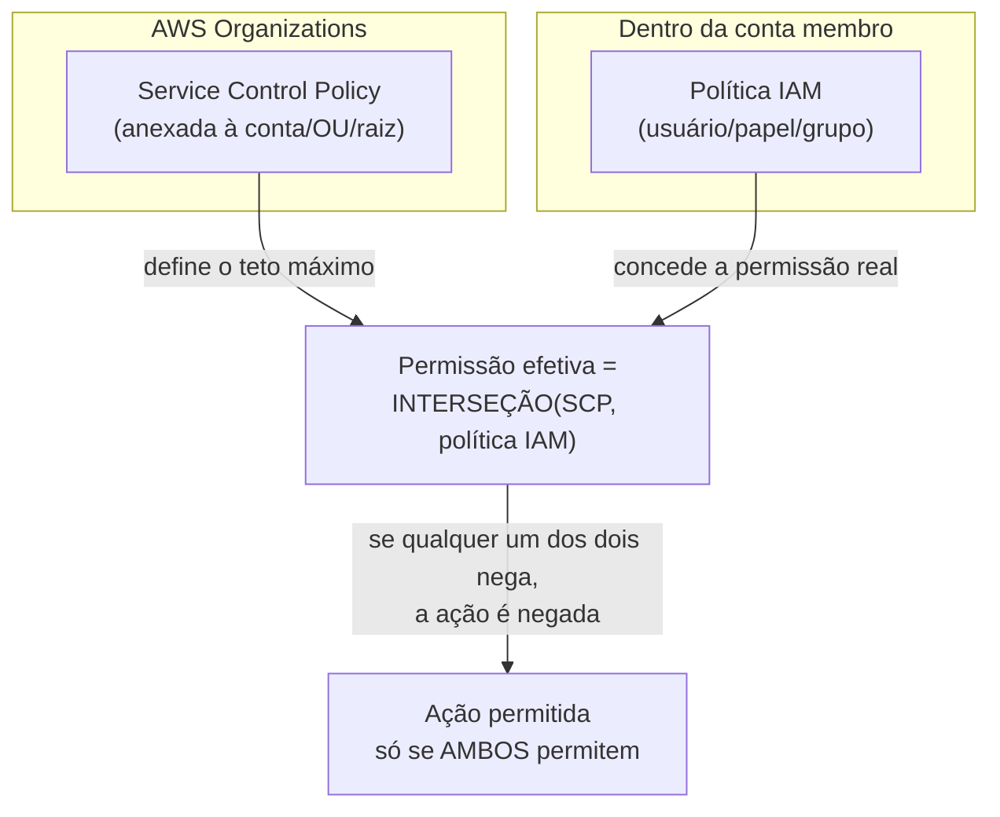
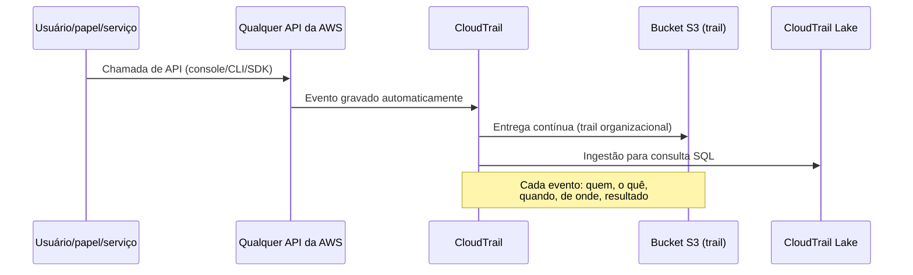
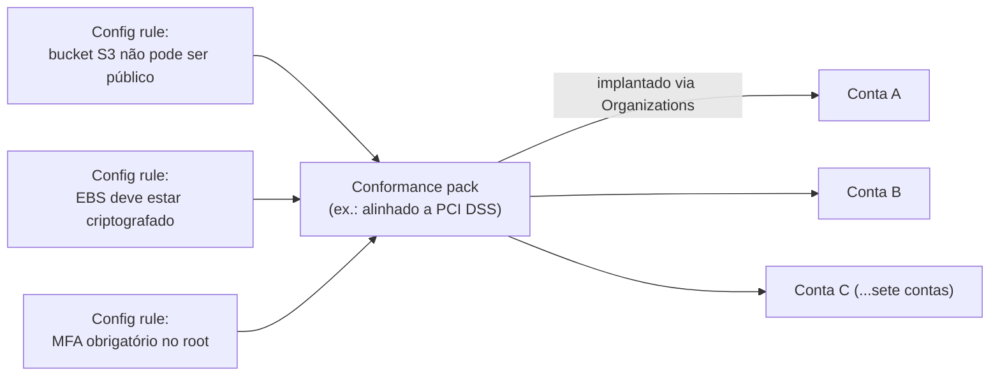
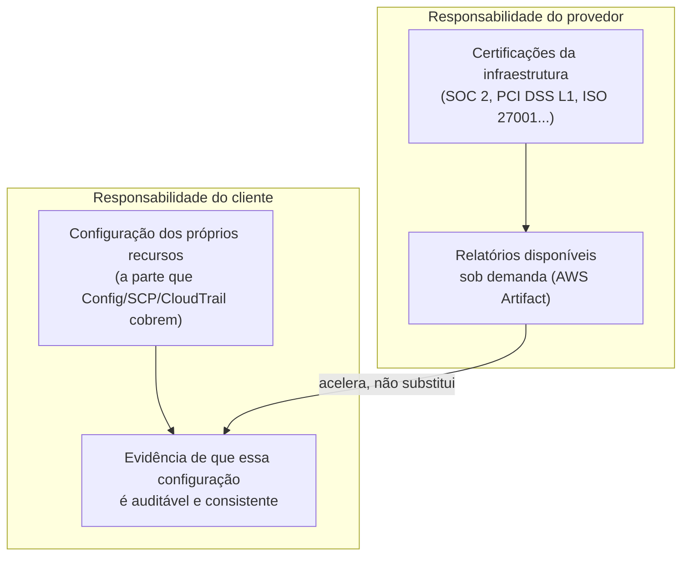
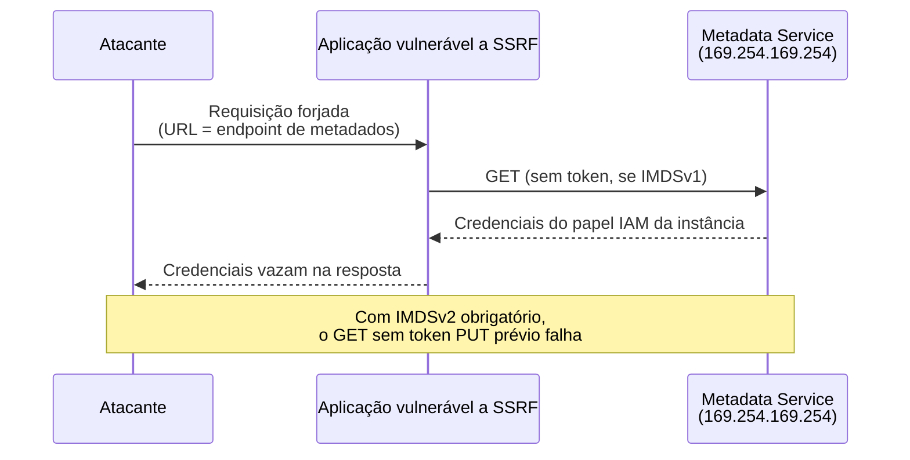

# Governança, auditoria e compliance

> [!abstract] TL;DR
> As três primeiras notas deste galho resolveram problemas de uma conta: quem é responsável pelo quê, como criptografar, como guardar um segredo. Esta nota resolve o problema de **muitas contas, muita gente, muito tempo**: como impor um teto de permissão que nenhuma política individual pode furar (Service Control Policies, sobre a organização inteira), como responder "quem fez o quê, quando" sem depender da memória de ninguém (CloudTrail, o log imutável de toda chamada de API), como transformar "configuração correta" numa regra que roda sozinha em vez de um checklist manual (AWS Config, compliance como código) e como detectar automaticamente o comportamento anômalo que nenhuma regra estática previu (GuardDuty, aprendizado de máquina sobre os mesmos logs). A nota fecha com um modelo de ameaças cloud-nativo — credencial vazada, bucket público, escalação de privilégio, SSRF contra o metadata do servidor — e a defesa específica que a nuvem oferece para cada uma. A DigitalOcean tem um catálogo bem mais enxuto aqui: log de atividade básico, sem SCP, sem motor de detecção de ameaças por ML, sem agregador de postura de segurança — uma lacuna real do modelo mais simples, não uma falha de leitura da documentação.

## O auditor que não consegue responder a pergunta mais simples

Uma fintech em crescimento acabou de contratar uma auditoria SOC 2 Tipo II, pré-requisito para fechar contrato com um cliente enterprise. O auditor faz uma pergunta que parece trivial: "no dia 14 de junho, às 3h da manhã, alguém alterou a política de um bucket S3 de produção para permitir leitura pública. Quem fez isso, e por quê?"

O time técnico não sabe responder. Não porque ninguém tenha visto — porque **ninguém jamais configurou um lugar único onde essa pergunta pudesse ser respondida**. Existem sete contas AWS (uma por ambiente, mais três de clientes isolados por contrato). Em cada uma, alguém habilitou alguns logs, em algum momento, sem um padrão comum. Em três das sete contas, o log de eventos de API nem estava ativo além da retenção padrão. Numa quarta, ativo, mas gravando num bucket sem ninguém consultando. A resposta que o time consegue dar ao auditor, depois de dois dias de investigação manual, é "provavelmente foi um script de automação, mas não temos certeza de qual".

Esse episódio não é sobre uma falha de segurança pontual — o bucket público, ainda que grave, foi corrigido em minutos assim que alguém percebeu. É sobre a ausência de **governança**: a disciplina de garantir que toda mudança, em toda conta, deixe um rastro auditável por padrão, que os limites de permissão sejam impostos estruturalmente (não só configurados e esperados), e que o desvio de uma linha de base conhecida seja detectado automaticamente, não descoberto por acidente meses depois.

As notas anteriores deste galho ensinaram a proteger um recurso, uma chave, um segredo. Esta nota ensina a garantir que essa proteção **não dependa de disciplina manual em escala** — porque disciplina manual, espalhada por sete contas e uma dúzia de engenheiros, é exatamente o tipo de coisa que falha silenciosamente às 3h da manhã de uma sexta-feira.

## Service Control Policies: um teto que nenhuma política individual fura

A **nota 05 do galho 4** já ensinou o vocabulário de política IAM — `Allow`, `Deny`, avaliação por interseção entre o que é permitido e o que é negado. O problema que aquela nota não resolveu é organizacional: numa empresa com dezenas de contas, como garantir que **nenhuma** política dentro de **nenhuma** conta jamais conceda, por exemplo, permissão de desabilitar o CloudTrail — mesmo que um administrador dessa conta, por engano ou má-fé, tente anexar uma política `AdministratorAccess` a um usuário?

A resposta é uma camada de política que vive **acima** de qualquer conta individual: a **Service Control Policy** (SCP), anexada não a um usuário ou papel, mas a uma conta inteira, a uma unidade organizacional, ou à raiz de toda a organização, via AWS Organizations. A documentação oficial da AWS é categórica sobre o que uma SCP faz e — mais importante — o que ela não faz: **uma SCP nunca concede permissão**. Ela só define o teto máximo de permissões possíveis para qualquer usuário ou papel daquela conta. Mesmo que o administrador da conta anexe `AdministratorAccess` a si mesmo, se a SCP da organização nega uma ação específica, essa ação continua bloqueada — porque a permissão efetiva é a **interseção** entre o que a SCP permite e o que a política IAM da conta permite, nunca a união.



Duas propriedades tornam esse mecanismo especialmente útil como guarda-corpo de governança. Primeira: SCPs afetam **todo mundo** na conta membro, inclusive o usuário root dela — não existe um administrador que escape do teto imposto de cima. Segunda: SCPs **não afetam a conta de gerenciamento** da organização (a conta raiz que administra todas as outras) — o que significa que o time de plataforma, operando a partir dessa conta, mantém capacidade de correção mesmo que uma SCP mal escrita trave alguma coisa numa conta membro.

Na prática, a SCP mais comum de uma organização madura é uma lista de negação explícita — permitir tudo por padrão (a política gerenciada `FullAWSAccess`, anexada automaticamente a toda conta nova) e negar explicitamente um punhado de ações consideradas perigosas demais para qualquer conta individual decidir sozinha:

```json
{
  "Version": "2012-10-17",
  "Statement": [
    {
      "Sid": "NegarDesabilitarCloudTrail",
      "Effect": "Deny",
      "Action": [
        "cloudtrail:StopLogging",
        "cloudtrail:DeleteTrail",
        "cloudtrail:UpdateTrail"
      ],
      "Resource": "*"
    },
    {
      "Sid": "NegarSairDaOrganizacao",
      "Effect": "Deny",
      "Action": "organizations:LeaveOrganization",
      "Resource": "*"
    },
    {
      "Sid": "ExigirRegiaoAprovada",
      "Effect": "Deny",
      "NotAction": ["iam:*", "organizations:*", "sts:*", "support:*"],
      "Resource": "*",
      "Condition": {
        "StringNotEquals": {
          "aws:RequestedRegion": ["us-east-1", "sa-east-1"]
        }
      }
    }
  ]
}
```

A terceira declaração — restringir a região — é um exemplo canônico de guarda-corpo de governança que nenhuma política IAM individual, espalhada por dezenas de contas, conseguiria impor de forma confiável: numa organização só, uma linha garante que ninguém, em conta nenhuma, provisione recursos numa região não aprovada (relevante para residência de dados sob contratos de compliance).

Vale a pena não confundir SCP com **permission boundary**, mecanismo que a nota 05 do galho 4 já introduziu de raspão e que opera num nível diferente: a boundary limita o teto de permissão de um usuário ou papel **específico**, definida dentro da própria conta; a SCP limita o teto de permissão de **todos** os usuários e papéis de uma conta inteira, definida de fora dela, via Organizations. Uma empresa madura usa as duas: SCP para o guarda-corpo organizacional amplo, boundary para restringir o que uma automação específica (como um pipeline com permissão de criar papéis IAM) pode conceder a si mesma.

> [!info] Lente dupla: teto organizacional de permissões
> Na **AWS**, SCPs exigem que a organização tenha "todos os recursos" habilitados (não só faturamento consolidado) e são o mecanismo padrão, documentado e amplamente adotado por qualquer empresa com múltiplas contas — a própria AWS recomenda testar cuidadosamente antes de anexar uma SCP à raiz da organização, porque um erro de sintaxe ou de escopo pode travar contas inteiras de uma vez.
> Na **DigitalOcean**, não existe um equivalente a Organizations com múltiplas contas nem a Service Control Policies. A unidade organizacional é o Team, com papéis fixos por membro (Owner, Member) — não há uma camada de política que imponha um teto de permissões através de múltiplos Teams de forma centralizada e programável. Uma empresa DO que precisa desse tipo de guarda-corpo organizacional hoje resolve isso por convenção e revisão manual, não por um mecanismo da plataforma — uma lacuna real do catálogo mais enxuto, coerente com o que a **nota 06 do galho 4** já registrou sobre a ausência de assunção de papel entre contas.

## CloudTrail: o log que responde "quem fez o quê, quando"

Volte à pergunta que o auditor fez e que ninguém conseguiu responder com confiança. A resposta correta não devia depender de investigação manual — devia ser uma consulta. É exatamente isso que o **CloudTrail** entrega: toda ação tomada por um usuário, papel ou serviço da AWS — via console, CLI, SDK ou API — vira um evento gravado, contendo quem fez, o quê, quando, de onde (endereço IP, user agent) e com qual resultado.

A documentação oficial descreve três formas de trabalhar com esses eventos, cada uma resolvendo um problema diferente:

| Mecanismo | O que oferece | Retenção |
|---|---|---|
| **Event history** | Consulta pronta no console/CLI, sem configuração prévia — habilitado automaticamente em toda conta | 90 dias, eventos de gerenciamento, região por região |
| **Trail** | Entrega contínua dos eventos para um bucket S3 (opcionalmente também CloudWatch Logs e EventBridge), permitindo retenção arbitrária e análise com ferramentas como Athena | Definida por você (política do bucket) |
| **CloudTrail Lake** | Data lake gerenciado, formato colunar otimizado para consulta SQL, dashboards prontos, pode agregar múltiplas contas via Organizations | Até 2.557 dias (~7 anos) ou 3.653 dias (~10 anos), conforme a opção de preço escolhida |

> [!info] Verificado 2026-07-24
> Os números de retenção do CloudTrail Lake (2.557 e 3.653 dias) vêm direto da documentação oficial da AWS e dependem da opção de preço do *event data store* escolhida no momento da criação — confira a página de preços do CloudTrail antes de dimensionar retenção para um requisito de compliance específico, porque o modelo de cobrança (ingestão + armazenamento + consulta) muda com frequência.

O ponto prático para uma fintech pós-auditoria: os 90 dias do Event History **não bastam** para a maioria dos regimes de compliance (SOC 2 Tipo II, por exemplo, tipicamente exige evidência de um período de observação de 6 a 12 meses) — o primeiro passo de qualquer programa de governança séria é criar um **trail** organizacional, cobrindo todas as contas via Organizations, entregando para um bucket S3 com política de retenção de longo prazo e, idealmente, também alimentando o CloudTrail Lake para consulta ad hoc.



Criar o trail organizacional, cobrindo as sete contas da fintech de uma vez, é uma única operação feita a partir da conta de gerenciamento:

```bash
aws cloudtrail create-trail \
  --name trail-organizacional \
  --s3-bucket-name auditoria-cloudtrail-fintech \
  --is-organization-trail \
  --is-multi-region-trail \
  --enable-log-file-validation
```

O `--enable-log-file-validation` merece destaque: ativa a assinatura criptográfica de cada arquivo de log entregue, permitindo provar depois — para um auditor cético — que os logs não foram alterados após a entrega. Sem essa flag, o trail ainda funciona, mas perde a propriedade de imutabilidade verificável que costuma ser exigida em auditorias mais rigorosas.

Consultar quem alterou a política do bucket público, depois que o trail existe, vira uma única chamada:

```bash
aws cloudtrail lookup-events \
  --lookup-attributes AttributeKey=EventName,AttributeValue=PutBucketPolicy \
  --start-time 2026-06-14T00:00:00Z \
  --end-time 2026-06-14T06:00:00Z
```

> [!info] Ponte — CloudTrail e observabilidade
> O CloudTrail é, na prática, uma fonte de log especializada em auditoria — e se encaixa no mesmo ecossistema de ingestão e consulta que a trilha de observabilidade já cobriu em detalhe. Quem quer aprofundar como enviar eventos do CloudTrail para métricas e alarmes operacionais (não só auditoria pós-fato) encontra a mecânica completa em [[03-Dominios/Tecnologia/Cloud/17 - Observabilidade na cloud/02 - CloudWatch a fundo|CloudWatch a fundo]]; esta nota trata o CloudTrail como peça de governança, não de operação do dia a dia.

> [!info] Lente dupla: log de auditoria
> Na **AWS**, o CloudTrail é universal, granular (toda chamada de API, de qualquer serviço, sem exceção) e integra nativamente com Organizations para cobrir múltiplas contas com uma configuração só — é o alicerce sobre o qual GuardDuty, Config e praticamente todo o resto da governança se apoia.
> Na **DigitalOcean**, existe um **log de atividade** por Team, cobrindo ações administrativas relevantes (criação/exclusão de recursos, mudanças de billing, gestão de membros) — mas num escopo bem mais restrito que o CloudTrail: não é um log de toda chamada de API de todo serviço, a granularidade e a cobertura de eventos variam por produto, e não existe um mecanismo nativo de agregação centralizada entre múltiplos Teams equivalente ao trail organizacional da AWS. Para uma auditoria formal (SOC 2, PCI), times na DO tipicamente precisam complementar esse log com instrumentação própria na aplicação — uma diferença real de maturidade entre as duas plataformas nesse eixo específico.

## Config: compliance como código, não como checklist

CloudTrail responde "o que aconteceu". **AWS Config** responde uma pergunta diferente e complementar: "o estado atual de um recurso está correto?" — e, crucialmente, mantém o histórico de como esse estado mudou ao longo do tempo, mesmo para recursos que ninguém tocou via uma chamada de API auditável (uma mudança feita por outro serviço da AWS em nome do usuário, por exemplo).

O mecanismo central são as **Config rules**: uma regra associa um resource type (bucket S3, security group, instância EC2) a uma condição de conformidade, e o Config avalia continuamente, disparando reavaliação a cada mudança de configuração detectada — não é uma varredura periódica que pode ficar dias defasada, é reação a evento.

```bash
aws configservice put-config-rule --config-rule '{
  "ConfigRuleName": "s3-bucket-public-read-prohibited",
  "Source": {
    "Owner": "AWS",
    "SourceIdentifier": "S3_BUCKET_PUBLIC_READ_PROHIBITED"
  },
  "Scope": {
    "ComplianceResourceTypes": ["AWS::S3::Bucket"]
  }
}'
```

Uma regra isolada resolve um problema pontual. O problema real de uma fintech com sete contas é garantir que **o mesmo conjunto** de regras — as que codificam os requisitos de um framework de compliance específico — esteja ativo em todas elas, de forma consistente. É para isso que existem os **conformance packs**: uma coleção de Config rules e ações de remediação, empacotada e implantável como uma unidade só, inclusive em todas as contas de uma organização de uma vez via Organizations. A AWS publica conformance packs de amostra alinhados a frameworks conhecidos (PCI DSS, operational best practices, entre outros) que servem de ponto de partida — não como certificação automática, mas como o conjunto de checagens técnicas que esse framework tipicamente exige.



A diferença de fundo em relação a um checklist manual de auditoria: uma regra do Config não é lida uma vez por trimestre por um auditor — ela é avaliada a cada mudança, o tempo todo, e o painel de conformidade mostra, a qualquer momento, exatamente quais recursos, em quais contas, estão fora do padrão esperado agora mesmo. É a diferença entre compliance como evento (a auditoria anual) e compliance como estado contínuo (o painel que nunca para de checar).

## Detecção: GuardDuty, Security Hub e Inspector, de raspão

As duas seções anteriores cobrem o que já aconteceu (CloudTrail) e o que está configurado incorretamente agora (Config) — ambos reativos ou baseados em regra explícita. **GuardDuty** cobre uma terceira categoria: comportamento que nenhuma regra estática antecipou, mas que se parece com um ataque em andamento. A documentação oficial descreve o serviço como monitoramento contínuo, usando *threat intelligence* (listas de IPs e domínios maliciosos conhecidos) e modelos de aprendizado de máquina sobre os mesmos dados que o CloudTrail já coleta — mais VPC Flow Logs e logs de DNS — para sinalizar padrões como credencial comprometida usada de uma geolocalização anômala, mineração de criptomoeda não autorizada numa instância EC2, ou exfiltração de dados que pode indicar um evento de ransomware em curso.

Dois serviços complementam o GuardDuty sem substituí-lo. **Security Hub** funciona como agregador: consolida findings do GuardDuty, do Config, do Inspector e de produtos parceiros num painel único, organizado por padrão de segurança (CIS Benchmarks, por exemplo), em vez de cada engenheiro precisar checar quatro consoles separados. **Inspector** varre vulnerabilidades conhecidas (CVEs) em imagens de container, funções Lambda e instâncias EC2 — uma preocupação diferente de detectar comportamento anômalo em tempo real: é checar, proativamente, se o software rodando tem uma falha já catalogada.

> [!info] Lente dupla: detecção automatizada de ameaças
> Na **AWS**, GuardDuty, Security Hub e Inspector formam um arsenal de detecção coeso, habilitável em minutos, cobrindo desde o comportamento anômalo até a vulnerabilidade conhecida de software.
> Na **DigitalOcean**, não existe um equivalente nativo a nenhum dos três: sem motor de detecção de ameaças por ML, sem agregador central de postura de segurança, sem scanner de vulnerabilidade integrado à plataforma. Times na DO que precisam dessa capacidade tipicamente recorrem a ferramentas de terceiros operando sobre os próprios recursos (um agente de EDR na instância, um scanner de imagem de container no pipeline de CI) — funciona, mas exige montar e manter o arsenal por conta própria, em vez de ligar um serviço gerenciado.

## Compliance: a nuvem como facilitadora, não como certificado automático

Um erro comum de quem está chegando na governança cloud é achar que "rodar na AWS" ou "rodar na DigitalOcean" já concede, por si só, uma certificação de compliance. Não concede. O modelo de **responsabilidade compartilhada**, que a **nota 01** deste galho já detalhou, se aplica também aqui: o provedor é responsável e certificado para a infraestrutura que ele opera (os data centers, a rede física, o hipervisor) — SOC 2, PCI DSS Nível 1, ISO 27001, HIPAA (via *Business Associate Agreement*, quando aplicável) são certificações que o provedor obtém para a **própria** operação, auditadas por terceiros independentes. O cliente continua responsável por configurar seus próprios recursos de forma compatível com o framework que precisa atender — um bucket S3 mal configurado não deixa de violar PCI DSS só porque a AWS, como provedor, é certificada PCI DSS Nível 1.

O que a nuvem oferece, de fato, é um atalho considerável: em vez de auditar fisicamente um data center (impossível para a maioria das empresas), o cliente aponta o auditor para os relatórios de auditoria já produzidos pelo provedor. Na AWS, esse catálogo fica no **AWS Artifact** — um repositório de relatórios de conformidade (SOC 1/2/3, PCI DSS, ISO, entre dezenas de outros), acessível sob demanda pelo console, sem precisar abrir chamado nem esperar resposta de um time comercial.



Para a fintech do início desta nota, o caminho prático até passar na auditoria SOC 2 Tipo II combina as três peças já vistas: SCPs garantindo que nenhuma conta consiga desabilitar controles básicos, um trail organizacional do CloudTrail cobrindo o período de observação inteiro, e um conformance pack do Config demonstrando, com histórico, que a configuração dos recursos ficou dentro do esperado — não como promessa, como registro.

## Threat model de uma arquitetura cloud

Fechando a governança com o que ela protege: uma nuvem tem um conjunto relativamente pequeno de vetores de ataque que se repetem, arquitetura após arquitetura, com nomes e superfícies específicos.

| Ameaça | Como acontece | Defesa cloud-nativa |
|---|---|---|
| Credencial de longa duração vazada | Chave de acesso commitada em repositório, secret em log | Credencial temporária (STS), Secrets Manager com rotação — **notas 02-03** do galho 4 e desta trilha |
| Bucket/storage público por engano | Política de recurso ou ACL liberal demais | Config rule bloqueando/detectando, Block Public Access como padrão de conta |
| Escalação de privilégio via política mal escrita | Usuário com permissão de anexar/criar política a si mesmo | Permission boundary, SCP como teto superior, revisão via IAM Access Analyzer |
| SSRF contra o metadata da instância | Aplicação vulnerável a *Server-Side Request Forgery* usada para ler credenciais do papel IAM da instância via `169.254.169.254` | **IMDSv2 obrigatório** (ver abaixo) |
| Log desabilitado para esconder rastro | Ator malicioso com permissão de parar o CloudTrail antes de agir | SCP negando `cloudtrail:StopLogging`, trail organizacional fora do alcance da conta membro |

O caso do SSRF merece detalhamento porque é sutil e específico de ambiente cloud. Toda instância EC2 expõe, no endereço não roteável `169.254.169.254`, um serviço de metadados que devolve — entre outras coisas — as credenciais temporárias do papel IAM anexado à instância. Na versão original desse serviço (IMDSv1), uma simples requisição `GET` sem autenticação bastava para obter essas credenciais. Se a aplicação rodando na instância tiver uma vulnerabilidade de SSRF — um endpoint que aceita uma URL fornecida pelo usuário e faz uma requisição HTTP para ela sem validação suficiente —, um atacante pode induzir a aplicação a fazer essa requisição por ele, roubando as credenciais do papel da instância inteira.



A defesa é a **Instance Metadata Service Version 2 (IMDSv2)**: em vez de um `GET` simples e sem estado, o cliente precisa primeiro fazer um `PUT` para obter um token de sessão (válido por até seis horas), e incluir esse token em todo `GET` subsequente. A documentação da AWS é explícita sobre por que isso mitiga SSRF: a maioria das vulnerabilidades de SSRF explora bibliotecas HTTP que seguem redirecionamentos e permitem métodos arbitrários controlados pelo atacante, mas raramente permitem forjar um `PUT` com um cabeçalho customizado (`X-aws-ec2-metadata-token-ttl-seconds`) como parte do payload de exploração — a exigência do `PUT` prévio quebra a maior parte das técnicas de exploração automatizada de SSRF contra o metadata.

Configurar uma instância para aceitar **só** IMDSv2, rejeitando qualquer requisição IMDSv1:

```bash
aws ec2 modify-instance-metadata-options \
  --instance-id i-0abcd1234efgh5678 \
  --http-tokens required \
  --http-endpoint enabled
```

`--http-tokens required` é o parâmetro que faz o trabalho: sem ele (o padrão em contas mais antigas é `optional`), a instância continua aceitando os dois protocolos, deixando a porta do SSRF aberta. Uma Config rule (`ec2-imds-v2-check`) existe justamente para sinalizar, em escala, qualquer instância da organização ainda rodando com IMDSv1 habilitado — fechando o ciclo entre threat model e compliance como código.

## Tabela de tradução — Azure e GCP

Só como referência de vocabulário, sem detalhamento de configuração:

| Conceito | AWS | Azure | GCP | DigitalOcean |
|---|---|---|---|---|
| Teto de permissão organizacional | Service Control Policy (Organizations) | Azure Policy + management groups | Organization Policy Service | sem equivalente |
| Log de auditoria de API | CloudTrail | Azure Activity Log / Microsoft Entra audit logs | Cloud Audit Logs | Log de atividade do Team (escopo mais restrito) |
| Compliance como código | AWS Config + conformance packs | Azure Policy (efeito `deny`/`audit`) + Blueprints | Security Command Center + Policy Controller | sem equivalente nativo |
| Detecção de ameaças por ML | GuardDuty | Microsoft Defender for Cloud | Security Command Center (Event Threat Detection) | sem equivalente |
| Agregador de postura de segurança | Security Hub | Microsoft Defender for Cloud (secure score) | Security Command Center | sem equivalente |
| Catálogo de relatórios de compliance | AWS Artifact | Microsoft Service Trust Portal | Google Cloud Compliance Reports Manager | página de compliance institucional (sem portal self-service) |

> [!info] Caducidade
> Nomes de serviço e limites verificados em 2026-07-24 via docs.aws.amazon.com (Organizations/SCP, CloudTrail, Config, GuardDuty, EC2 IMDS). A tentativa de verificar o log de atividade e o catálogo de compliance da DigitalOcean via WebFetch em duas URLs de documentação retornou 404 — a caracterização do modelo enxuto da DO nesta nota se apoia em conhecimento de catálogo já registrado nas notas anteriores deste galho e do galho 4/6, não numa página específica revisitada hoje; vale confirmar diretamente em docs.digitalocean.com antes de uma decisão de arquitetura que dependa desse detalhe.

## Casos práticos

**A empresa que descobriu a SCP tarde demais.** Um time de plataforma configura, corretamente, políticas IAM restritivas em cada conta de produção — mas nunca implanta uma SCP organizacional. Um engenheiro novo, testando uma automação, cria acidentalmente um usuário IAM com `AdministratorAccess` numa conta de homologação, sem perceber que essa conta compartilha rede com um ambiente sensível. Nada impede a criação porque nenhuma política de teto existia acima da conta. Depois do incidente (contido antes de causar dano), a empresa implanta uma SCP negando `iam:CreateUser` com política `AdministratorAccess` anexada diretamente, forçando o uso de papéis com permissão temporária em vez de usuários permanentes com acesso total.

**O painel do Config que virou reunião semanal.** Um time de segurança, depois de implantar um conformance pack alinhado a PCI DSS nas oito contas da organização, começa a revisar o painel de conformidade toda segunda-feira em vez de esperar a auditoria anual. Descobrem, na terceira semana, que uma instância RDS de um ambiente de testes ficou sem criptografia por três dias — um recurso temporário criado por um script que esqueceu um parâmetro. Sem o Config, essa janela de exposição só seria descoberta na auditoria seguinte, meses depois.

**A migração de IMDSv1 que quase travou um sistema legado.** Um time tenta forçar `--http-tokens required` em toda a frota de instâncias EC2 de uma vez, via automação, e descobre que um serviço legado de três anos atrás usa uma biblioteca AWS SDK desatualizada demais para suportar IMDSv2. Em vez de reverter a mudança em toda a frota, o time isola essa instância específica com uma exceção documentada e um prazo de correção — a política de tornar IMDSv2 obrigatório continua valendo para 98% da frota, com a exceção rastreada como dívida técnica explícita, não como brecha silenciosa.

## Armadilhas comuns

> [!warning] Confundir CloudTrail habilitado com CloudTrail retido
> Toda conta AWS tem o Event History disponível desde o primeiro dia, sem configuração — mas ele guarda só 90 dias. Um time que nunca cria um trail próprio, achando que "o CloudTrail já está ativo por padrão", descobre tarde demais que o incidente de quatro meses atrás não tem mais registro consultável. Criar o trail organizacional, com destino a um bucket S3 de retenção longa, é o primeiro passo de qualquer programa de governança — não uma opção avançada.

> [!warning] SCP escrita como lista de permissão em vez de lista de negação
> É tentador escrever uma SCP listando explicitamente tudo que é permitido (*allow list*), mas isso exige manutenção constante toda vez que a organização adota um serviço novo da AWS — e um esquecimento trava um time inteiro sem aviso. A prática recomendada, e a que a AWS documenta com mais ênfase, é manter a política gerenciada `FullAWSAccess` como base e negar explicitamente só o punhado de ações genuinamente perigosas — muito mais fácil de auditar e de não quebrar por acidente.

> [!warning] Tratar "hospedado na AWS/DO" como certificação automática
> É um erro recorrente em conversas comerciais assumir que rodar na AWS já torna a aplicação PCI DSS ou SOC 2 compliant. O provedor certifica a própria infraestrutura; a configuração de cada recurso do cliente continua sendo avaliada separadamente. AWS Artifact acelera a obtenção da evidência do lado do provedor — não substitui a evidência do lado do cliente, que é exatamente o que SCP, CloudTrail e Config, juntos, produzem.

> [!warning] Ativar GuardDuty e nunca revisar os findings
> Um GuardDuty habilitado, mas cujos findings ninguém olha nem encaminha para um canal monitorado, tem o mesmo efeito prático de um GuardDuty desligado — com o agravante de dar falsa sensação de cobertura numa auditoria. Encaminhar findings de severidade alta para um canal com resposta ativa (via EventBridge, por exemplo) é parte do desenho, não um passo opcional depois de "ligar o serviço".

## O que vem a seguir

Esta nota fechou o círculo da governança em escala — teto organizacional de permissão, trilha de auditoria, compliance como código, detecção automatizada e o modelo de ameaças que amarra tudo isso a riscos concretos. A última nota deste galho — o capstone — pega uma arquitetura cloud completa e aplica, de ponta a ponta, tudo que as cinco notas deste galho construíram: responsabilidade compartilhada, criptografia gerenciada, segredos, segurança de rede e perímetro, e a governança desta nota, num único exercício de modelagem de ameaças sobre um sistema real.

## Fontes

- [AWS Organizations — Service control policies (SCPs)](https://docs.aws.amazon.com/organizations/latest/userguide/orgs_manage_policies_scps.html) — definição oficial, efeito de interseção com políticas IAM, e exceções (conta de gerenciamento, papéis vinculados a serviço); acessado em 2026-07-24.
- [AWS CloudTrail — What Is AWS CloudTrail?](https://docs.aws.amazon.com/awscloudtrail/latest/userguide/cloudtrail-user-guide.html) — Event History (90 dias), trails, e CloudTrail Lake com limites de retenção (2.557/3.653 dias); acessado em 2026-07-24.
- [AWS Config — What Is AWS Config?](https://docs.aws.amazon.com/config/latest/developerguide/WhatIsConfig.html) — Config rules, conformance packs, agregadores multi-conta; acessado em 2026-07-24.
- [Amazon GuardDuty — What is Amazon GuardDuty?](https://docs.aws.amazon.com/guardduty/latest/ug/what-is-guardduty.html) — fontes de dados fundamentais (CloudTrail, VPC Flow Logs, DNS), integração com Security Hub; acessado em 2026-07-24.
- [AWS EC2 — Use the Instance Metadata Service to access instance metadata](https://docs.aws.amazon.com/AWSEC2/latest/UserGuide/configuring-instance-metadata-service.html) — mecânica de sessão do IMDSv2 (PUT/token/TTL) e o parâmetro `http-tokens required`; acessado em 2026-07-24.
- [AWS Security Blog — Add defense in depth against open firewalls, reverse proxies, and SSRF vulnerabilities with enhancements to the EC2 Instance Metadata Service](https://aws.amazon.com/blogs/security/defense-in-depth-open-firewalls-reverse-proxies-ssrf-vulnerabilities-ec2-instance-metadata-service/) — explicação oficial de por que IMDSv2 mitiga SSRF; referenciado pela doc principal de IMDS, acessado em 2026-07-24.
- [AWS Artifact](https://aws.amazon.com/artifact/) — repositório self-service de relatórios de conformidade (SOC, PCI DSS, ISO); acessado em 2026-07-24.
