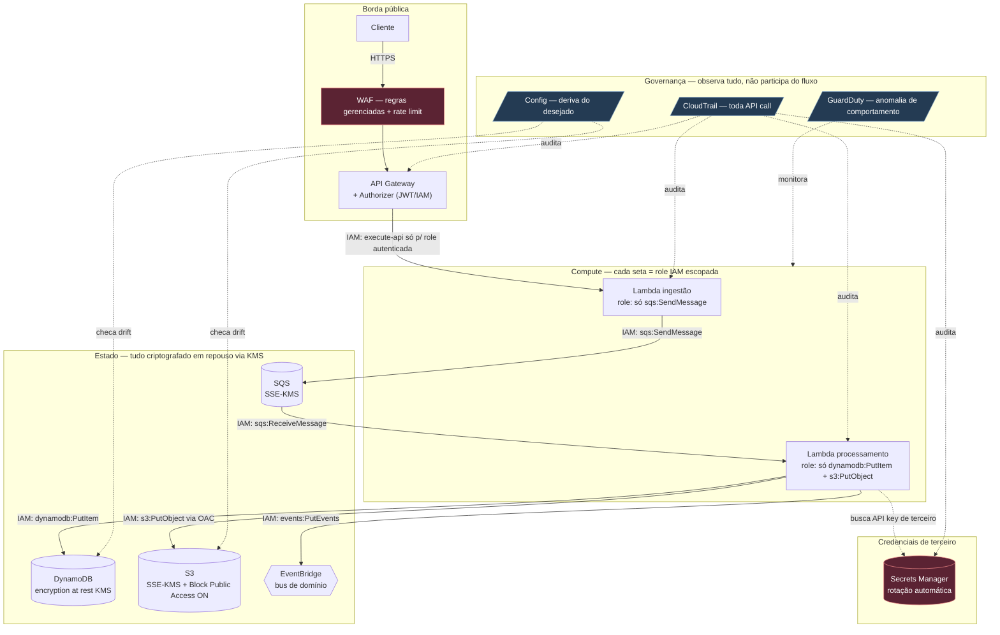

> [!abstract] TL;DR
> Segurança na cloud não é um serviço que você "liga" — é uma pergunta que você faz sobre cada seta do seu diagrama de arquitetura: *o que pode dar errado aqui, e o que impede isso de acontecer?* Este capstone pega a arquitetura serverless de referência do galho 15 e sobrepõe cada camada de segurança deste galho — IAM em cada seta, KMS no estado, Secrets Manager nas credenciais, WAF na borda, CloudTrail auditando tudo — construindo um threat model peça por peça. O fio condutor é o mesmo em toda parte: least privilege. Cada permissão concedida é uma superfície de ataque; a disciplina é conceder o mínimo, provar que auditou, e nunca confiar cegamente no perímetro.

## O problema: segurança como adjetivo, não como substantivo

Pergunte a um time "sua arquitetura é segura?" e a resposta quase sempre é um adjetivo vago — "sim, temos HTTPS", "sim, tem VPC", "sim, usamos IAM". Isso é segurança como *adjetivo*: uma qualidade que se afirma, não se demonstra. O problema é que ataques reais não perguntam se você "tem HTTPS". Eles perguntam: essa role do Lambda pode ler mais do que devia? Esse bucket aceita uma requisição anônima? Essa credencial de banco está em texto plano em algum lugar que um `git log` alcança?

A resposta madura é tratar segurança como *substantivo* — uma lista concreta e finita de ameaças, cada uma com uma mitigação nomeada, revisitada a cada mudança de arquitetura. Isso é threat modeling: em vez de perguntar "estamos seguros?", você pergunta "o que pode dar errado, componente por componente, e o que fizemos sobre isso?".

Este capstone existe porque as cinco notas anteriores do galho 18 te deram as peças soltas — [[03-Dominios/Tecnologia/Cloud/18 - Segurança na cloud a fundo/01 - Responsabilidade compartilhada na prática|responsabilidade compartilhada]], [[03-Dominios/Tecnologia/Cloud/18 - Segurança na cloud a fundo/02 - Criptografia gerenciada (KMS)|KMS]], [[03-Dominios/Tecnologia/Cloud/18 - Segurança na cloud a fundo/03 - Segredos — Secrets Manager e Parameter Store|Secrets Manager]], [[03-Dominios/Tecnologia/Cloud/18 - Segurança na cloud a fundo/04 - Segurança de rede e perímetro|rede e perímetro]] e [[03-Dominios/Tecnologia/Cloud/18 - Segurança na cloud a fundo/05 - Governança, auditoria e compliance|governança e auditoria]] — mas peças soltas não formam uma defesa. Uma defesa é o momento em que você pega uma arquitetura real e pergunta, componente por componente: qual ameaça mora aqui, e o que a neutraliza?

## A arquitetura sob a lupa

Vamos usar a mesma arquitetura serverless de referência construída no capstone do Bloco 3 (galho 15): API Gateway → Lambda de ingestão → fila (SQS) → Lambda de processamento → tabela (DynamoDB) e bucket (S3) como stores finais, com um event bus (EventBridge) distribuindo eventos de domínio para consumidores. Ali o foco era desenho de fluxo de dados. Aqui, o mesmo diagrama ganha uma segunda camada: cada seta é uma permissão IAM que precisa justificar sua existência, cada estado em repouso é um alvo de KMS, cada credencial de terceiro é um segredo administrado, e a borda inteira responde a CloudTrail.

Repare no que mudou em relação ao diagrama do galho 15: nenhuma seta nova de *dados* apareceu — a topologia do sistema é a mesma. O que apareceu foram anotações de *permissão* em cada seta existente, um serviço de segredos ao lado (nunca no caminho principal de dados), e uma camada de governança inteira que não participa do fluxo — ela só observa, em paralelo, tudo o que acontece. Essa é a assinatura visual de segurança bem-feita: ela não desvia o fluxo de dados, ela o instrumenta.

## Threat model peça por peça

A tabela abaixo é o núcleo do capstone: para cada componente da arquitetura, a ameaça concreta e a mitigação nomeada. Não é uma lista de "boas práticas" — é um mapa de causa e efeito.

| Componente | Ameaça concreta | Mitigação | Nota do galho |
|---|---|---|---|
| S3 (armazenamento final) | Bucket exposto publicamente por engano (ACL ou policy mal configurada) | Block Public Access nas 4 flags + Origin Access Control (OAC) se servido via CloudFront — nunca ACL pública | [[03-Dominios/Tecnologia/Cloud/18 - Segurança na cloud a fundo/04 - Segurança de rede e perímetro\|04]] |
| S3 / DynamoDB / SQS (estado) | Dados em repouso legíveis por quem tiver acesso ao storage subjacente (snapshot, disco físico, backup vazado) | Criptografia em repouso via KMS (SSE-KMS), chave gerenciada com política de acesso própria, separada da política do bucket | [[03-Dominios/Tecnologia/Cloud/18 - Segurança na cloud a fundo/02 - Criptografia gerenciada (KMS)\|02]] |
| API key de terceiro (usada pela Lambda de processamento) | Credencial em variável de ambiente, código-fonte ou `.env` commitado | Secrets Manager com rotação automática; a Lambda busca o segredo em runtime, nunca o embute | [[03-Dominios/Tecnologia/Cloud/18 - Segurança na cloud a fundo/03 - Segredos — Secrets Manager e Parameter Store\|03]] |
| API Gateway (entrada pública) | Bot/scraper varrendo a API, SQL injection via payload, DDoS de aplicação | WAF com regras gerenciadas (SQLi, XSS) + rate limiting; authorizer valida token antes de qualquer lógica de negócio rodar | [[03-Dominios/Tecnologia/Cloud/18 - Segurança na cloud a fundo/04 - Segurança de rede e perímetro\|04]] |
| Role da Lambda de ingestão | Role criada com `Action: "*"` "pra não dar erro em dev" e nunca revisada | Least privilege: só `sqs:SendMessage` no ARN exato da fila; políticas geradas a partir do uso real, não de wildcard preventivo | [[03-Dominios/Tecnologia/Cloud/04 - Identidade e acesso (IAM)/index\|IAM]] |
| Conta inteira (multi-conta) | Uma função com over-permission em uma conta de dev consegue alcançar recursos de produção | Service Control Policies (SCP) na Organization negando ações fora do escopo da conta, independente do que o IAM da conta permita | [[03-Dominios/Tecnologia/Cloud/18 - Segurança na cloud a fundo/05 - Governança, auditoria e compliance\|05]] |
| DynamoDB / S3 (saída de dados) | Exfiltração: uma Lambda comprometida (dependência maliciosa, por exemplo) envia dados para um endpoint externo | VPC endpoint (Gateway ou Interface) para o serviço, sem rota de saída para a internet pública — tráfego nunca sai da rede AWS | [[03-Dominios/Tecnologia/Cloud/18 - Segurança na cloud a fundo/04 - Segurança de rede e perímetro\|04]] |
| Todo o sistema | Incidente acontece e ninguém sabe o que mudou, quem mudou, ou quando | CloudTrail logando toda chamada de API (quem, o quê, quando, de onde) + Config detectando drift de configuração contra a baseline desejada | [[03-Dominios/Tecnologia/Cloud/18 - Segurança na cloud a fundo/05 - Governança, auditoria e compliance\|05]] |

Duas colunas dessa tabela merecem atenção redobrada porque são as que mais frequentemente ficam esquecidas em arquiteturas reais: a linha de SCP (porque exige *organização*, não só *conta*, e times menores raramente têm isso configurado) e a linha de VPC endpoint (porque "funciona sem" — a Lambda alcança a internet por padrão, então a ausência do endpoint nunca gera um erro, só uma superfície aberta).

## STRIDE, de raspão

STRIDE é um framework clássico de threat modeling (Microsoft, anos 1990) que categoriza ameaças em seis famílias. Não é o centro deste capstone, mas vale ter o vocabulário — cada linha da tabela acima se encaixa em uma dessas categorias, e nomeá-las ajuda a garantir que você não esqueceu nenhuma classe de ataque:

| Categoria STRIDE | Pergunta que ela força | Exemplo na nossa arquitetura |
|---|---|---|
| **S**poofing | Alguém pode se passar por outra identidade? | Authorizer do API Gateway valida o token antes de tudo |
| **T**ampering | Alguém pode alterar dados em trânsito ou repouso sem detecção? | KMS + TLS; hash/assinatura em payloads críticos |
| **R**epudiation | Alguém pode negar ter feito uma ação? | CloudTrail — log imutável de quem fez o quê |
| **I**nformation disclosure | Dados vazam para quem não deveria ver? | Block Public Access, least privilege, VPC endpoint |
| **D**enial of service | O sistema pode ser derrubado por volume de tráfego? | WAF rate limiting, throttling do API Gateway |
| **E**levation of privilege | Alguém com acesso limitado consegue virar admin? | SCP, least privilege, sem `iam:*` em nenhuma role |

STRIDE não substitui a tabela componente-por-componente acima — ele é uma segunda passada, uma checklist que você roda depois de mapear os componentes, pra pegar categorias de ameaça que não saltaram aos olhos olhando só pro diagrama.

## Least privilege como fio condutor

Se você reparar bem na tabela de threat model, um padrão se repete: metade das mitigações são, no fundo, a mesma ideia aplicada em camadas diferentes — *conceda o mínimo necessário, no escopo mais restrito possível*. A role da Lambda de ingestão que só pode `sqs:SendMessage`. A SCP que barra ações fora do escopo da conta mesmo que o IAM local permita. O VPC endpoint que fecha a rota de saída que ninguém precisava ter aberto. O Block Public Access que nega por padrão e exige decisão explícita pra abrir.

Isso não é coincidência — é o princípio organizador do galho inteiro de IAM ([[03-Dominios/Tecnologia/Cloud/04 - Identidade e acesso (IAM)/index|Identidade e acesso]], nota 05, Least privilege na prática) reaparecendo em cada camada de segurança que você adiciona depois. Pensa assim: toda permissão que existe é uma porta. Não importa quão improvável seja alguém empurrar essa porta — se ela existe, ela é parte da superfície de ataque. Um `Action: "*"` numa role de Lambda não é "conveniência de dev" — é uma porta destrancada em toda a casa, só porque você não queria procurar a chave certa pra um cômodo.

A disciplina prática é: comece com zero permissões, rode o sistema, veja o que falha por `AccessDenied`, adicione exatamente aquela ação naquele recurso. É mais lento no dia 1. É a diferença entre um incidente contido em um bucket e um incidente que varre a conta inteira no dia em que uma dependência maliciosa entra via `npm install`.

## Anti-padrões — o que este capstone existe para evitar

> [!warning] Segurança como afterthought
> Desenhar a arquitetura, colocar em produção, e "depois a gente adiciona segurança" é a garantia de que você vai descobrir o bucket público via um scanner de terceiro, não via revisão própria. Segurança precisa estar no diagrama desde o rascunho — é por isso que este capstone sobrepõe as camadas no *mesmo* diagrama da arquitetura, não num documento à parte.

> [!warning] Over-permission com `"Action": "*"`
> A causa mais comum de blast radius grande num incidente não é uma vulnerabilidade exótica — é uma role com `*` que alguém criou "pra não dar erro" e nunca revisitou. Toda permissão wildcard é uma dívida técnica de segurança com juros compostos.

> [!warning] Sem audit trail
> Se o CloudTrail estiver desligado (ou, pior, nunca foi configurado com um trail multi-region persistido fora da conta), um incidente vira um mistério: você sabe que algo aconteceu, mas não consegue reconstruir quem, quando, de onde. Investigação forense sem logs é adivinhação.

> [!warning] Segredos em código
> Uma API key hardcoded "só temporariamente" que vira permanente porque ninguém lembra de tirar. `git log` é permanente — mesmo removendo do commit atual, o segredo continua no histórico até ser invalidado na origem.

> [!warning] Confiar só no perímetro
> WAF e Security Group na borda são necessários, mas não suficientes. Se a única linha de defesa é "nada entra", o dia em que algo entra (uma dependência comprometida, uma credencial vazada) o atacante já está *dentro* do perímetro e encontra tudo destravado. Defesa em profundidade significa que cada camada interna também assume que a anterior pode falhar.

## AWS ↔ DigitalOcean: arsenal completo vs segurança manual e honesta

A lente dupla do galho inteiro chega ao ápice aqui, porque um threat model completo é onde a diferença de maturidade entre as duas nuvens fica mais visível — e é importante ser honesto sobre isso, não forçar uma equivalência que não existe.

| Camada de segurança | AWS (arsenal completo) | DigitalOcean (mais simples/manual) |
|---|---|---|
| Perímetro / borda | WAF gerenciado (regras OWASP, rate limiting) + Shield contra DDoS | Cloud Firewalls (stateful, camada de rede/transporte) — sem WAF nativo; times que precisam de WAF tipicamente colocam Cloudflare na frente |
| Estado em repouso | KMS com chaves gerenciadas, políticas de chave granulares, rotação automática | Criptografia em repouso é padrão em Managed Databases e Spaces, mas sem um serviço de gestão de chaves granular equivalente ao KMS |
| Segredos | Secrets Manager com rotação automática nativa integrada a RDS/serviços | Sem gestor de segredos nativo — o caminho comum é variável de ambiente em App Platform (encriptada em repouso) ou uma ferramenta de terceiro (Doppler, Vault) |
| Auditoria | CloudTrail (toda API call, log imutável, multi-region) | Sem equivalente direto a nível de API; auditoria fica em nível de aplicação/logs de acesso do Droplet, ou ferramentas de terceiro |
| Governança multi-conta | Organizations + SCP (barreira que nenhuma permissão IAM local pode furar) | Teams e permissões de projeto — sem um mecanismo de policy hierárquico equivalente a SCP |
| Detecção de anomalia | GuardDuty (ML sobre CloudTrail/VPC Flow Logs/DNS) | Sem serviço nativo equivalente; monitoramento de segurança tipicamente via ferramenta de terceiro |

> [!info] Verificado 2026-07-24 — DigitalOcean não expõe um produto de WAF nativo na documentação de Cloud Firewalls (`docs.digitalocean.com/products/networking/firewalls/`); a orientação usual do ecossistema DO para proteção de camada de aplicação é integrar um provedor externo (ex.: Cloudflare) na frente do droplet ou App Platform. Confira a doc atual antes de tomar decisão de arquitetura, pois o catálogo de produtos DO evolui.

Essa tabela não é uma crítica à DigitalOcean — é o retrato honesto de dois modelos de negócio diferentes. A AWS vende profundidade e cobertura de compliance (útil quando você precisa provar SOC 2, PCI-DSS, HIPAA para um auditor). A DigitalOcean vende simplicidade operacional: menos serviços de segurança dedicados, mas também menos superfície de configuração errada. Para um time pequeno sem obrigação regulatória pesada, a superfície mais simples da DO pode ser *mais* segura na prática, porque há menos chance de configurar mal algo que você nem sabia que existia. Segurança não é sobre ter o maior arsenal — é sobre o arsenal que você de fato consegue operar corretamente.

## O que vem a seguir

Este capstone fecha o galho 18 com a pergunta "o que pode dar errado, e o que evita isso?" respondida peça por peça. Mas toda mitigação tem um custo: KMS cobra por chamada, CloudTrail cobra por armazenamento e por trail adicional, WAF cobra por regra e por requisição avaliada, GuardDuty cobra por volume de dados analisado. Nenhuma dessas escolhas é gratuita — e um incidente de segurança evitado também tem um valor, só que ele é mais difícil de calcular do que a fatura do mês.

A próxima parada da trilha muda de lente: em vez de perguntar "isso é seguro?", o galho 19 (FinOps) pergunta "isso custa quanto — e o custo faz sentido pro valor que entrega?". Segurança e custo não são inimigos: um incidente de dados vazados custa, em multas e reputação, ordens de magnitude mais do que qualquer fatura de KMS ou WAF. Mas a disciplina de otimizar custo, como a disciplina de threat modeling, exige a mesma coisa — olhar componente por componente e perguntar honestamente se aquilo se justifica.

## Fontes

- [AWS — S3 Block Public Access](https://docs.aws.amazon.com/AmazonS3/latest/userguide/access-control-block-public-access.html)
- [DigitalOcean — Cloud Firewalls](https://docs.digitalocean.com/products/networking/firewalls/)
- [AWS — CloudTrail concepts](https://docs.aws.amazon.com/awscloudtrail/latest/userguide/cloudtrail-concepts.html)
- [AWS — Key Management Service concepts](https://docs.aws.amazon.com/kms/latest/developerguide/overview.html)
- [AWS — Organizations Service Control Policies](https://docs.aws.amazon.com/organizations/latest/userguide/orgs_manage_policies_scps.html)
- [AWS — VPC endpoints](https://docs.aws.amazon.com/vpc/latest/privatelink/vpc-endpoints.html)
- [Microsoft — The STRIDE Threat Model](https://learn.microsoft.com/en-us/previous-versions/commerce-server/ee823878(v=cs.20))
