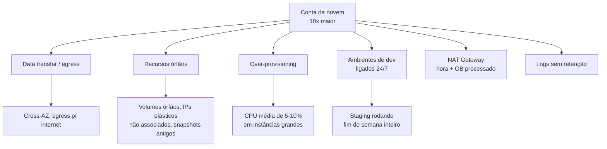
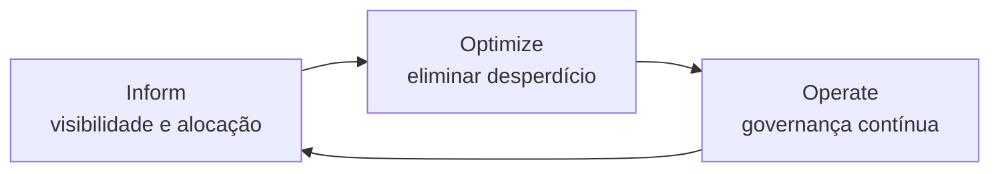

> [!abstract] TL;DR
> A fatura da AWS chegou dez vezes maior que o previsto — e ninguém mexeu em nada "de propósito". Pay-as-you-go é liberdade sem fricção de compra, mas também ausência de freio: sem governança, o custo cresce sozinho, alimentado por egress esquecido, recursos órfãos, superdimensionamento e ambientes de dev que ninguém desliga. FinOps é a disciplina que junta engenharia, financas e negócio pra devolver o controle, através de um ciclo contínuo: Inform → Optimize → Operate. E aqui a lente dupla se inverte: o pricing granular e poderoso da AWS é também o seu maior risco de custo; o pricing simples e previsível da DigitalOcean é, de verdade, um diferencial.

## A fatura que não devia existir

Imagine a cena. É dia 3 do mês, a fatura da AWS cai na caixa de entrada do time de engenharia — cópia automática pro financeiro, como sempre. Só que dessa vez o valor não bate. Não bate por uma margem de erro razoável, tipo 15% acima da média. Bate dez vezes mais alto. Alguém no Slack pergunta "isso é sério?" e o silêncio que segue é pior que qualquer resposta.

Ninguém provisionou dez vezes mais servidores. Ninguém aprovou um orçamento dez vezes maior. E, no entanto, ali está: R$ 2.000 virando R$ 20.000 sem nenhuma decisão consciente de ninguém. É o tipo de história que se repete, com variações, em times de todos os tamanhos — de startups que descobrem no cartão de crédito recusado, até empresas grandes que só percebem quando o CFO liga perguntando por que a "linha de cloud" triplicou no trimestre.

Como isso acontece? A resposta curta é: **a nuvem foi desenhada para ser fácil de gastar e difícil de perceber que se está gastando**. Cada clique que cria um recurso — um volume, um load balancer, um banco gerenciado — é grátis de fazer e caro de esquecer. Não existe fricção de compra como existia no data center físico, onde comprar um servidor exigia PO, aprovação, prazo de entrega. Na nuvem, um `terraform apply` de madrugada já é gasto realizado.

Esse é o paradoxo central da nuvem pública: o mesmo modelo que dá **elasticidade** — a capacidade de crescer e encolher sob demanda, tema que atravessou o Bloco 2 inteiro desta trilha — também tira o **freio de mão** que existia no modelo antigo de comprar hardware. Sem gente cuidando ativamente disso, o custo vira uma função crescente e monotônica do tempo. Ele só sobe.

> [!tip] Assista: O que é FinOps com Marcelo Scharan, CEO da Pier Cloud
> **Canal:** Papo Cloud | **Duração:** ~40min | **Idioma:** PT-BR
>
> Um bate-papo que ajuda a entender por que o desperdício em nuvem é tão mais visível — e tão mais constrangedor — do que era no data center: lá, capacidade ociosa nunca aparecia como linha de fatura; na nuvem, o "cartão de crédito" mostra cada centavo, mês a mês, sem esconderijo.
> Trecho de destaque [16:57]: *"igual uma conta de cartão de crédito, você comprou, vai vir a conta no final do mês, o número vai aparecer, não tem como (...) ocultado"*
>
> 🎬 [Assistir no YouTube](https://www.youtube.com/watch?v=KgnIB_zAF3U)

## Os culpados de sempre (e os escondidos)

Quando o time finalmente vai investigar a fatura, encontra uma lista de suspeitos. Alguns são óbvios; outros são traiçoeiros justamente porque não aparecem na tela principal do console.

**Data transfer / egress — o mais esquecido de todos.** Você paga pra colocar dados na AWS (ingress é grátis). Você paga pra tirar dados de lá (egress não é). E paga também para dados que trafegam *entre* zonas de disponibilidade dentro da própria AWS — um detalhe que surpreende até gente experiente. Uma arquitetura com múltiplos serviços trocando payloads grandes entre AZs, ou servindo download de arquivos direto do S3 pra internet, acumula uma linha de "Data Transfer" que ninguém olhou desde o design.

**Recursos órfãos.** Você derruba uma instância EC2, mas o volume EBS que estava anexado a ela continua vivo, cobrando por gigabyte alocado, apontando pra nada. Um Elastic IP que você reservou "só pra testar" e esqueceu de liberar é cobrado quando *não* está associado a uma instância em execução — um dos poucos casos em que a AWS cobra por recurso *ocioso* como penalidade por desperdiçar um endereço IPv4 escasso. Snapshots antigos de backup que ninguém mais restaura. Load balancers apontando pra grupos de destino vazios. Cada um sozinho é centavos; a soma de centenas deles, meses seguidos, é uma linha de orçamento inteira.

**Over-provisioning.** Um time sobe uma instância `m5.4xlarge` "pra garantir performance" e a CPU média fica em 8% de uso. Multiplique isso por dezenas de serviços e você tem um parque inteiro dimensionado pro pico teórico, nunca pro uso real.

**Ambientes de desenvolvimento esquecidos ligados.** É sexta-feira, o time termina o sprint, ninguém desliga o cluster de staging. Esse cluster fica rodando o fim de semana inteiro, e o mês inteiro, cobrando 24/7 por um ambiente usado 8 horas por dia útil — no melhor caso, um desperdício de mais de 75% do tempo de vida daquele recurso.

**NAT Gateway.** Já apareceu no [[03-Dominios/Tecnologia/Cloud/07 - Rede na nuvem (VPC)/index|galho 7]] como a peça que dá saída à internet pra subnets privadas — e é também um dos itens mais caros e mais invisíveis de uma conta AWS: cobra por hora de existência *e* por gigabyte processado, e multiplica quando você segue a boa prática de ter um por zona de disponibilidade.

**Logs e observabilidade.** A pilha de observabilidade que amarra tudo (tema que a trilha revisita ao longo do galho 17 de operação) tem seu próprio custo de ingestão e retenção. Logar em nível `DEBUG` em produção, pra sempre, sem política de expiração, é um jeito garantido de pagar por dados que ninguém nunca vai ler de novo.

> [!info] Verificado 2026-07-24
> O NAT Gateway da AWS cobra por hora de disponibilidade mais uma tarifa por GB de dados processados — a página de pricing oficial (`aws.amazon.com/vpc/pricing/`) usa JavaScript pra montar a tabela e não foi acessível via fetch direto nesta sessão. Os valores de referência historicamente citados (na faixa de US$ 0,045/hora e US$ 0,045/GB em `us-east-1`) devem ser conferidos no console ou na calculadora de preços da AWS antes de qualquer decisão de orçamento — eles variam por região e mudam ao longo do tempo.

## FinOps: trazer responsabilidade financeira pra nuvem

Se o problema é estrutural — o modelo de consumo tira o freio de mão —, a solução também precisa ser estrutural. É aqui que entra o **FinOps**: a disciplina, formalizada pela FinOps Foundation (parte da Linux Foundation), que junta **engenharia, financas e negócio** numa prática cultural contínua de gestão de custo de nuvem.

A ideia central do FinOps não é "cortar custo". É trazer para a nuvem o mesmo tipo de responsabilidade financeira que já existia pra qualquer outra área da empresa — só que adaptada à velocidade e à variabilidade do consumo elástico. Em vez de um orçamento fixo aprovado uma vez por ano (o modelo CapEx clássico), FinOps assume que o gasto varia semana a semana, e cria o ferramental pra acompanhar essa variação em tempo quase real, e agir sobre ela.

A FinOps Foundation descreve isso como um ciclo de três fases que se repete continuamente — nunca um projeto com início, meio e fim:

- **Inform** — dar visibilidade a quem gasta. Tagging de recursos, dashboards de custo por time/produto, alocação (chargeback/showback) pra que cada squad veja o que consome. Sem isso, ninguém sabe de onde vem o gasto — só que ele existe.
- **Optimize** — uma vez visível, agir: rightsizing de instâncias, desligar o que está ocioso, comprar capacidade reservada onde o uso é previsível, revisar arquitetura pra reduzir egress.
- **Operate** — fechar o ciclo com processo: orçamentos, alertas automáticos de anomalia, revisões periódicas, políticas de governança (tags obrigatórias, limites de tipo de instância) que impedem o problema de voltar.

> [!info] Verificado 2026-07-24
> As três fases Inform/Optimize/Operate são a formulação canônica publicada pela FinOps Foundation (`finops.org`). O fetch direto da página oficial retornou HTTP 403 nesta sessão (bloqueio de acesso automatizado); a descrição acima reflete o framework amplamente documentado e replicado por provedores de nuvem e consultorias. Vale conferir a versão mais recente do FinOps Framework diretamente em `finops.org/framework` antes de citar em contexto formal.

Note que esse ciclo aprofunda, na prática, algo que já apareceu no [[03-Dominios/Tecnologia/Cloud/03 - Well-Architected Framework/index|Well-Architected Framework]]: o pilar de **Otimização de Custo** ali estabelece os *princípios* (matching de oferta/demanda, medir eficiência de ponta a ponta, parar de gastar dinheiro em undifferentiated heavy lifting). FinOps é a *prática* organizacional, com processo, papéis e cadência, que transforma esses princípios em hábito recorrente do time.

> [!tip] Assista: AWS FinOps Explained in 5 Minutes
> **Canal:** AWS With A Beer | **Duração:** ~5min | **Idioma:** EN
>
> Um resumo rápido pra quem quer a definição de FinOps sem rodeio: não é só "economizar", é o guardrail financeiro que faz engenharia, financeiro e liderança falarem a mesma língua sobre custo antes que a fatura vire surpresa.
> Trecho de destaque [01:18]: *"finops is your financial guard rail ensuring every dollar spent on AWS delivers maximum value"*
>
> 🎬 [Assistir no YouTube](https://www.youtube.com/watch?v=6qqv9Ss3MaE)

## CapEx vira OpEx: a mudança de modelo mental

Antes da nuvem, infraestrutura era **CapEx** (capital expenditure): você comprava um servidor, ele virava um ativo no balanço patrimonial, depreciava ao longo de anos, e o gasto acontecia de uma vez, antecipado, geralmente aprovado com meses de antecedência por quem controla o orçamento de capital.

Na nuvem, infraestrutura é **OpEx** (operational expenditure): você paga pelo uso, mês a mês, sem compromisso de longo prazo (a menos que opte por instâncias reservadas ou savings plans — tema do próximo galho). Isso é ótimo para agilidade — nenhum projeto novo precisa esperar um ciclo de aprovação de compra de hardware — e péssimo para previsibilidade, porque o gasto de OpEx tende a ser tratado, culturalmente, com menos escrutínio linha a linha do que um CapEx de milhões.

Essa mudança de modelo mental é sutil, mas explica boa parte de como a conta "explode" sem ninguém decidir explicitamente gastar mais: numa cultura CapEx, gastar mais exige uma aprovação nova. Numa cultura OpEx mal governada, gastar mais só exige que ninguém *impeça* o crescimento — e ausência de fricção, como vimos, é exatamente a condição que a nuvem oferece por padrão.

## A lente dupla, invertida: onde a DigitalOcean ganha

Em quase toda nota anterior desta trilha, a lente dupla mostrou a AWS com mais recursos, mais granularidade, mais opções — e a DigitalOcean como a alternativa mais simples, às vezes sem paridade de feature. Em FinOps, essa relação se **inverte**, e vale ser honesto nos dois sentidos.

A AWS tem, hoje, centenas de tipos de instância, dezenas de modelos de precificação (on-demand, reserved, savings plans, spot, dedicated hosts — o próximo galho detalha cada um), e uma estrutura de cobrança que separa computação, armazenamento, IOPS, transferência de dados, requisições de API, e mais, em linhas de fatura distintas para cada serviço. Essa granularidade é *poder*: dá controle fino pra quem sabe operá-la bem. Mas é também *risco*: cada dimensão nova de cobrança é uma dimensão nova de surpresa possível, e o comparador de preços da AWS, sozinho, já é uma ferramenta complexa o bastante pra existir como produto à parte.

A DigitalOcean escolheu o caminho oposto desde o início: poucos tipos de Droplet, preço por hora **e** por mês publicado direto na página do produto, sem calculadora obscura. Bandwidth (transferência de saída) vem com uma cota incluída por Droplet, e o excedente é cobrado a uma taxa simples e única — não há tabela de zonas, tiers e exceções regionais como na AWS. Tráfego entre Droplets dentro de uma VPC privada não é cobrado. É um modelo que um desenvolvedor sozinho consegue calcular de cabeça antes de clicar em "criar".

Essa simplicidade tem um preço — literalmente menos controle fino, menos modelos de desconto, menos opções pra quem está otimizando um parque de milhares de instâncias. Mas para o time pequeno, para a startup, para quem valoriza dormir tranquilo sabendo exatamente quanto vai pagar, é um diferencial real, não retórica de marketing: **previsibilidade é, em si, uma forma de governança de custo** — a AWS tem que ser conquistada com FinOps ativo; a DigitalOcean já nasce com boa parte dessa disciplina embutida no próprio catálogo de preços.

| Dimensão | AWS | DigitalOcean |
|---|---|---|
| Modelos de preço por serviço | 5+ (on-demand, reserved, savings plans, spot, dedicated) | Essencialmente 1-2 (hora/mês fixo, poucos add-ons) |
| Tabela de preços | Centenas de SKUs, calculadora dedicada | Página única, preço listado por plano |
| Data transfer / egress | Cobrança granular por região, AZ, destino | Cota incluída por Droplet + taxa única de excedente |
| Previsibilidade da fatura | Baixa sem governança ativa | Alta por padrão |
| Ferramental de FinOps necessário | Extenso (Cost Explorer, Budgets, CUR) | Mínimo (billing page cobre a maior parte dos casos) |

## O mapa deste galho

Esta nota abriu o problema; as próximas cinco constroem a disciplina completa. A segunda nota mergulha nos **modelos de precificação** propriamente ditos — on-demand, reserved instances, savings plans, spot — e como cada um troca flexibilidade por desconto. A terceira ataca **visibilidade e alocação de custo**: tagging, Cost Explorer, Cost and Usage Report, e os equivalentes na DigitalOcean. A quarta é a nota de **otimização** de fato: rightsizing, auto scaling ajustado a custo, e as ferramentas que automatizam parte da caçada aos recursos órfãos descritos aqui. A quinta fecha com **cultura**: como times de verdade rodam FinOps no dia a dia, quem é dono de qual métrica. E a sexta é o capstone: pegar a arquitetura de referência construída ao longo do Bloco 3 e efetivamente otimizar seu custo, linha por linha.

## Armadilhas

> [!warning] Confundir "barato" com "otimizado"
> Migrar tudo pra spot instances ou pro plano mais barato de Droplet sem entender o padrão de carga de trabalho troca um problema de custo por um problema de confiabilidade. FinOps não é minimizar gasto a qualquer custo — é maximizar valor por real gasto, o que às vezes significa pagar mais por uma garantia que o negócio precisa.

> [!warning] Tratar FinOps como projeto único, não como ciclo
> Uma "semana de otimização de custo" que corta 30% da fatura e depois nunca mais se repete garante que, em seis meses, a fatura volta a crescer sem controle — porque a causa raiz (ausência de governança contínua) nunca foi endereçada, só o sintoma daquele mês.

> [!warning] Olhar só o total da fatura, ignorar a composição
> Uma fatura estável no total pode esconder um serviço crescendo 40% enquanto outro encolhe. Sem granularidade por tag/time/serviço, a "conta que não explodiu" pode já estar prestes a explodir numa única linha.

## O que vem a seguir

A próxima nota deste galho detalha os modelos de precificação em si — o cardápio completo de opções que a AWS oferece (e a versão enxuta da DigitalOcean), e como escolher entre eles sem virar um exercício de adivinhação.

## Fontes

- FinOps Foundation — What is FinOps: https://www.finops.org/introduction/what-is-finops/
- AWS — NAT Gateways (VPC User Guide): https://docs.aws.amazon.com/AmazonVPC/latest/UserGuide/vpc-nat-gateway.html
- AWS — Elastic IP addresses (cobrança de IP não associado): https://docs.aws.amazon.com/AWSEC2/latest/UserGuide/elastic-ip-addresses-eip.html
- DigitalOcean — Droplet pricing e bandwidth: https://docs.digitalocean.com/products/droplets/details/pricing/
- AWS — Data Transfer pricing overview: https://aws.amazon.com/ec2/pricing/on-demand/#Data_Transfer
