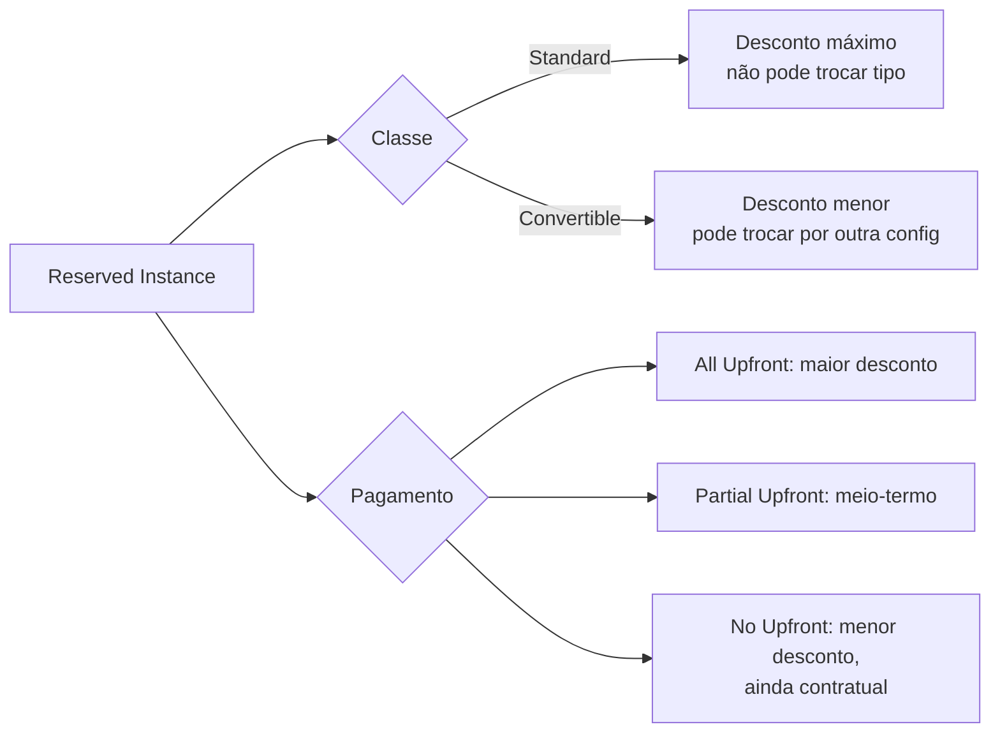
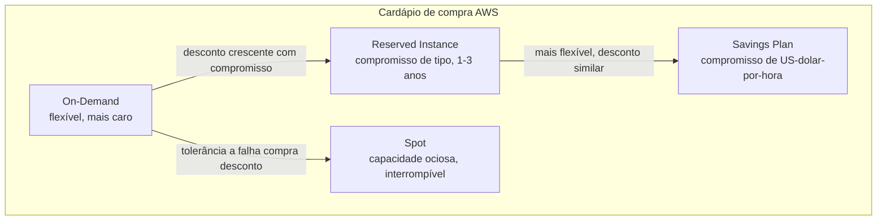
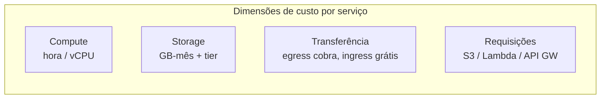

> [!abstract] TL;DR
> A mesma vCPU-hora na AWS pode custar 4 preços diferentes dependendo de COMO você a compra: on-demand (flexível, caro), Reserved Instance ou Savings Plan (compromisso de tempo ou de gasto, desconto de até ~72%), ou Spot (capacidade ociosa, até 90% off, mas interrompível a qualquer momento). Fora do compute, os custos entram por outras portas — storage por GB-mês, transferência de dados (egress cobra, ingress não) e requisições. Escolher o modelo certo pra cada carga é a primeira alavanca de FinOps. Na DigitalOcean não existe esse cardápio: o preço do Droplet é fixo e previsível, sem RI, sem Savings Plan, sem Spot — trade-off deliberado entre economia máxima e simplicidade.

## O problema: a mesma vCPU, quatro preços

Imagine duas equipes rodando o mesmo tipo de instância EC2, mesma região, mesmo sistema operacional. Uma paga US$ 0,10/hora. A outra paga US$ 0,03/hora pela *instância idêntica*. Ninguém foi enganado — as duas estão pagando o preço "certo" para o modelo de compra que escolheram. A AWS não vende "uma vCPU". Ela vende **um contrato sobre uma vCPU**, e o contrato é que determina o preço.

Essa ideia — que o preço não descreve o recurso, descreve o *compromisso* que você assumiu com ele — é a base de tudo que vem depois nesta nota. Quem entende isso para de perguntar "quanto custa uma instância m5.large" e passa a perguntar "quanto custa *esta* carga de trabalho, dado o padrão de uso dela".

A nota anterior desta galho mostrou por que a conta explode: elasticidade sem freio, egress escondido, recursos esquecidos. Aqui está a primeira ferramenta pra conter isso — entender os modelos de compra antes de otimizar qualquer coisa.

## Os quatro modelos de compra de compute (AWS)

### On-Demand: pagar pela flexibilidade

On-Demand é o padrão: você liga a instância, paga por segundo (ou por hora, dependendo do serviço) enquanto ela roda, desliga e para de pagar. Não há compromisso, não há desconto — e é exatamente por isso que ele é o mais caro por hora. Você está comprando a opção de mudar de ideia a qualquer momento, e essa opcionalidade tem preço.

Faz sentido para: cargas imprevisíveis, picos, ambientes de desenvolvimento que ligam e desligam, qualquer coisa em fase de descoberta onde você ainda não sabe o padrão de uso.

### Reserved Instances (RI): comprar o futuro previsível

Reserved Instances são um compromisso — você promete usar um tipo de instância, numa região, por um período fixo (1 ou 3 anos), e em troca a AWS dá desconto de até 72% frente ao on-demand equivalente, com desconto maior no compromisso de 3 anos.

> [!info] Verificado 2026-07-24 — docs.aws.amazon.com/AWSEC2 confirma "até 72% off On-Demand" e termos de 1 ou 3 anos. Percentuais exatos variam por família de instância e região; sempre confira a calculadora de preços da AWS antes de comprometer orçamento.

RI não é uma instância física reservada — é um **desconto de billing** aplicado automaticamente a qualquer instância em execução que combine os atributos certos (tipo, região, tenancy, plataforma). Três variáveis moldam o preço:

- **Pagamento**: All Upfront (paga tudo na hora, maior desconto), Partial Upfront, ou No Upfront (paga por hora, mas com compromisso contratual pelo período todo — cancelar não é opção).
- **Escopo**: regional (mais flexível entre AZs) ou zonal (reserva capacidade numa AZ específica).
- **Classe de oferta**: Standard vs Convertible.

**Standard RI** dá o desconto máximo, mas trava o tipo de instância — só pode ser modificada (tamanho, dentro da mesma família), nunca trocada por outro tipo. **Convertible RI** dá desconto menor, mas pode ser trocada por outra configuração de instância durante o termo — útil quando você suspeita que vai migrar de família (ex.: de m5 para m6g/Graviton) mas ainda não tem certeza.



A própria AWS hoje recomenda Savings Plans *acima* de RI para a maioria dos casos — RI sobrevive principalmente para quem precisa de reserva de capacidade garantida numa AZ específica (RI zonal), algo que Savings Plans não oferece.

### Savings Plans: comprar o compromisso, não o tipo

Savings Plans resolvem o maior desconforto do RI: em vez de se comprometer com um *tipo de instância*, você se compromete com um **valor em US$/hora** de uso, por 1 ou 3 anos. Se seu gasto de compute for consistentemente ≥ US$ 5/hora, você "compra" esse piso e recebe desconto equivalente ao de uma RI — mas o compromisso se aplica a *qualquer* instância, família, tamanho, sistema operacional ou até região (dependendo do tipo de Savings Plan), automaticamente.

Existem duas variantes: **Compute Savings Plans** (mais flexível — cobre EC2 de qualquer família, Fargate e Lambda) e **EC2 Instance Savings Plans** (desconto maior, mas restrito a uma família de instância numa região). O desconto que sobra do compromisso é cobrado à taxa on-demand normal — ou seja, Savings Plans nunca deixam você pagar *mais* que on-demand, só oferecem desconto sobre o piso comprometido.

Isso é o que torna Savings Plans o modelo preferido hoje: você reserva o **gasto de baseline**, e tudo que varia acima disso — picos, experimentos, novos serviços — continua pagando on-demand sem penalidade, sem precisar prever com precisão cirúrgica qual tipo de instância vai rodar daqui a 18 meses.

> [!tip] Assista: O que é e como utilizar o Savings Plans na AWS?
> **Canal:** Iago Ferreira TI - Aprenda Cloud e DevOps do ZERO | **Duração:** ~6min | **Idioma:** PT-BR
>
> Mostra na prática o efeito do compromisso de 1 vs 3 anos no desconto — o mesmo trade-off tempo-por-desconto que aparece em toda decisão de Savings Plan, só que com números reais na tela em vez de abstração. Trecho de destaque [00:28]: *"compromisso de 3 anos você tem um desconto maior, se você fazer um de um ano você tem um desconto um pouco menor"*
>
> 🎬 [Assistir no YouTube](https://www.youtube.com/watch?v=K3q71A1exXE)

### Spot: comprar a capacidade que sobrou

Spot Instances vendem capacidade ociosa da AWS com desconto de até 90% frente ao on-demand.

> [!info] Verificado 2026-07-24 — aws.amazon.com/ec2/spot confirma "até 90% de desconto" frente a on-demand.

O trade-off: a AWS pode **recuperar essa capacidade a qualquer momento**, com um aviso de interrupção de apenas 2 minutos. Spot não é adequado para qualquer carga — é adequado para cargas **tolerantes a falha**: processamento em lote, renderização, treinamento de ML com checkpoint, filas de trabalho que podem ser retomadas, e — ponto que já apareceu no galho de containers — o **Fargate Spot**, que aplica esse mesmo desconto a tarefas ECS/Fargate (ver [[03-Dominios/Tecnologia/Cloud/12 - Containers gerenciados/03 - Fargate a fundo|Fargate a fundo]]).

O erro clássico é tentar rodar um banco de dados ou uma API stateful em Spot: a interrupção não é uma exceção rara, é uma certeza estatística — a única pergunta é quando.

Na prática, a instância Spot pode ser configurada para reagir à interrupção de três formas: **terminate** (encerra e libera o recurso), **stop** (para, preserva o disco EBS, pode ser retomada depois como uma instância parada normal) ou **hibernate** (salva o estado da memória em disco, retoma exatamente de onde parou). Escolher a reação certa é o que separa "Spot economiza dinheiro" de "Spot quebrou a produção às 3h da manhã" — uma fila de processamento em lote que só precisa de *terminate* e um novo worker do zero é trivial; uma carga que depende de estado em memória sem hibernate configurado vai perder trabalho a cada interrupção.

Reserva de capacidade e desconto não são exclusividade do EC2: RDS tem Reserved Instances próprias e ElastiCache tem Reserved Nodes, com a mesma lógica de compromisso por termo em troca de desconto (isso já apareceu no galho de bancos gerenciados). O princípio se repete em cada serviço que cobra por capacidade provisionada — a pergunta "é baseline previsível ou é variável" vale tanto para um banco quanto para uma instância de compute.



> [!tip] Assista: Amazon/AWS EC2 Pricing Simply Explained — On-Demand, Spot, Reserved, Savings Plans
> **Canal:** Tiny Technical Tutorials | **Duração:** ~9min | **Idioma:** EN
>
> Passa pelos quatro modelos em sequência com telas do console, fechando com a comparação direta Reserved vs. Savings Plans — útil pra visualizar de onde vem a flexibilidade extra do Savings Plan que o texto descreve. Trecho de destaque [02:55]: *"the reserved instances versus savings plans"*
>
> 🎬 [Assistir no YouTube](https://www.youtube.com/watch?v=-t148tYgnJU)

## O mix ótimo: quando usar cada um

A pergunta certa não é "qual modelo é o melhor", é "qual a forma do meu tráfego". Praticamente toda organização madura em cloud roda uma combinação dos quatro:

| Camada de carga | Modelo recomendado | Por quê |
|---|---|---|
| Baseline estável e previsível (24/7, sabe que vai rodar por >1 ano) | Savings Plan / RI | Desconto de até 72%, compromisso paga por si mesmo |
| Picos sazonais ou de tráfego acima do baseline | On-Demand | Flexibilidade — você não sabe se o pico repete |
| Processamento em lote, CI/CD, ML training, filas tolerantes a interrupção | Spot | Até 90% off, workload aguenta a interrupção |
| Ambientes de dev/teste que ligam e desligam | On-Demand (ou auto-shutdown agendado) | Vida útil curta e imprevisível não justifica compromisso |

A "curva de baseline" é o conceito-chave: olhando o histórico de uso de compute ao longo de semanas, existe um piso que raramente é violado — isso é o que você reserva. Tudo acima do piso, você deixa on-demand ou spot. Comprometer 100% da capacidade de pico com RI é o erro mais caro e mais comum de quem começa em FinOps: sobra RI ociosa pago mesmo nos vales.

### A matemática do break-even

Uma pergunta prática: comprar uma RI de 1 ano vale a pena para uma instância que talvez fique só 8 meses no ar? Um cálculo simplificado de break-even:

```
custo_on_demand_mensal = preco_on_demand_hora * 730h
custo_ri_mensal        = (preco_upfront / meses_termo) + preco_ri_hora * 730h

RI compensa quando:
custo_ri_mensal * meses_de_uso < custo_on_demand_mensal * meses_de_uso
```

Na prática, isso vira uma pergunta de "quantos meses eu preciso rodar essa instância para o desconto acumulado superar o risco de compromisso". Como regra de bolso amplamente citada por praticantes de FinOps: se a certeza de uso ultrapassa ~9-10 meses num horizonte de 12, o compromisso de 1 ano quase sempre compensa — mas o número exato depende da família de instância e da política de desconto vigente, então vale rodar a calculadora oficial da AWS antes de comprometer orçamento real.

## Caso prático: montando o mix de uma equipe fictícia

Vale ver os números rodando juntos, mesmo que ilustrativos (não são preços reais publicados — sirva-se da calculadora oficial pra qualquer decisão de orçamento). Imagine uma equipe com três cargas de trabalho distintas na AWS:

1. **API principal**: 10 instâncias rodando 24/7, tráfego estável há 8 meses, sem previsão de mudar de família de instância tão cedo.
2. **Processamento de relatórios noturnos**: um job em lote que roda 2 horas por noite, pode ser interrompido e retomado do checkpoint sem problema.
3. **Ambiente de staging**: liga de manhã, desliga à noite, usado só em horário comercial.

O raciocínio de alocação, carga por carga:

- A **API principal** é o baseline clássico — 10 instâncias que nunca saem do ar são candidatas naturais a Savings Plan. Como a equipe não tem certeza se vai trocar de família de instância no próximo ano (pode migrar pra Graviton), um Compute Savings Plan (mais flexível que RI Standard) captura desconto significativo sem travar a escolha de hardware.
- O **job noturno** tolera interrupção por definição — é o caso de livro-texto pra Spot. Rodar em Spot devolve até 90% de desconto numa carga que só existe 2h/dia; comprar RI aqui seria pagar por 22 horas de capacidade que nunca são usadas.
- O **staging** liga e desliga de forma imprevisível (feriados, sprints mais curtos) e vive menos de 12h/dia — nem RI nem Savings Plan compensam um uso tão intermitente. Fica em on-demand, e a alavanca de economia real aqui é um agendador que desliga automaticamente fora do horário comercial (isso é ferramental de otimização, tema da próxima nota do galho).

O resultado não é "qual modelo é o melhor" — é um portfólio: baseline em Savings Plan, lote tolerante a falha em Spot, e o resto em on-demand com automação de desligamento. Nenhuma conta de produção madura roda 100% num único modelo.

## As outras dimensões de custo (além de compute)

Compute é só uma fatia da conta. Cada serviço cobra por uma combinação diferente de dimensões:

- **Storage**: GB armazenado por mês, e o *tier* de acesso muda o preço em ordens de grandeza (galho 8 já cobriu isso — storage "quente" custa muito mais que storage "gelado" para o mesmo dado).
- **Transferência de dados (data transfer)**: a dimensão mais traiçoeira. **Ingress é grátis** (dados entrando na cloud não custam nada) — **egress é cobrado** (dados saindo pra internet custam por GB, e o preço sobe conforme o volume). Tráfego **cross-AZ** dentro da mesma região também é cobrado (embora mais barato que egress pra internet), e cross-region custa ainda mais. É por isso que arquiteturas que atravessam zonas de disponibilidade sem necessidade — ou que servem conteúdo direto do S3 sem CDN — sangram silenciosamente.
- **Requisições**: serviços como S3, Lambda e API Gateway cobram por número de chamadas/invocações, não só por volume de dados ou tempo de execução. Um Lambda que dispara 50 milhões de vezes por mês paga por *invocação*, além de por GB-segundo de execução (ver [[03-Dominios/Tecnologia/Cloud/11 - Serverless e FaaS — Lambda a fundo/05 - Pricing, limites e operação|Pricing, limites e operação]]).



## Serverless: o ponto de virada

Serverless (Lambda, Fargate sem gestão de instância) inverte a lógica dos quatro modelos acima: não existe "reservar" nem "comprar spot" — você paga **por uso**, GB-segundo de execução e número de invocações, ponto. Isso elimina o problema de capacidade ociosa (você nunca paga por uma instância parada), mas também elimina a alavanca de desconto por compromisso — não existe RI de Lambda.

O ponto de virada é matemático: para cargas de baixo/médio volume e picos irregulares, pay-per-use do serverless é mais barato que manter compute always-on. Para cargas de altíssimo volume e constantes, o custo por invocação do serverless pode ultrapassar o custo de uma instância reservada rodando 24/7 — o ponto exato onde essa curva cruza depende do perfil de uso e já foi detalhado na nota de pricing do galho de Serverless.

## A lente DigitalOcean: onde a simplicidade vence a otimização

Aqui a lente dupla se inverte. Em quase todo o restante da trilha Cloud, a AWS ganha em profundidade de recursos e a DigitalOcean aparece como "a versão mais simples, com menos capacidade". Em pricing, a balança pende diferente: a DigitalOcean **não tem RI, não tem Savings Plan, não tem Spot**. O preço do Droplet é fixo, público, e igual pra todo mundo — cobrado por segundo, com mínimo de 60 segundos ou US$ 0,01 (o que for maior).

> [!info] Verificado 2026-07-24 — docs.digitalocean.com/products/droplets confirma billing por segundo com mínimo de 60s/US$0,01; nenhuma menção a reserved instances, savings plans, ou spot pricing em toda a documentação de Droplets/Spaces.

Isso significa que uma equipe pequena sabe *exatamente* quanto vai gastar mês a mês, sem precisar de um analista de FinOps pra decifrar qual mix de RI/Savings/Spot é ótimo. O preço listado é o preço pago. A troca é honesta nos dois sentidos:

- **O que se perde**: não existe caminho pra espremer 70-90% de desconto adicional como na AWS. O teto de economia é mais baixo — a única alavanca é escolher o tamanho certo de Droplet (rightsizing) e desligar o que não usa.
- **O que se ganha**: previsibilidade total, zero risco de "comprei RI errada e agora estou pagando por um compromisso que não uso", e uma superfície cognitiva muito menor — não existe decisão de compra a otimizar, só existe decisão de dimensionamento.

Para uma startup em estágio inicial ou uma equipe sem função de FinOps dedicada, essa previsibilidade *é* a otimização — o custo de oportunidade de gerenciar RIs manualmente pode superar a economia que elas trariam numa conta pequena.

## Tabela de tradução — Azure e GCP

| Conceito | AWS | Azure | GCP | DigitalOcean |
|---|---|---|---|---|
| Compromisso de tipo de instância | Reserved Instances (Standard/Convertible) | Reserved VM Instances | Committed Use Discounts (por recurso) | — (sem equivalente) |
| Compromisso de gasto flexível | Savings Plans | Azure Savings Plan for Compute | Committed Use Discounts (flexível/spend-based) | — (sem equivalente) |
| Capacidade ociosa/interrompível | Spot Instances | Azure Spot Virtual Machines | Spot VMs (ex-Preemptible VMs) | — (sem equivalente) |
| Pay-per-use serverless | Lambda / Fargate | Azure Functions / Container Instances | Cloud Functions / Cloud Run | App Platform (preço fixo, não pay-per-invocação) |

## Armadilhas

> [!warning] Comprometer o pico, não o baseline
> Comprar RI/Savings Plan cobrindo o pico de tráfego (em vez do piso estável) deixa capacidade reservada ociosa nos vales — você paga o compromisso inteiro mesmo nas horas de baixo uso. Reserve o baseline, deixe o excedente on-demand ou spot.

> [!warning] Spot em carga stateful
> Rodar banco de dados, sessão de usuário ou qualquer coisa sem checkpoint em Spot é assinar pra uma interrupção certa — a única incógnita é a data. Spot exige arquitetura tolerante a falha desde o design, não como reação depois do primeiro incidente.

> [!warning] RI Standard travada na família errada
> Comprar Standard RI (desconto máximo) numa família de instância que a equipe pretende migrar em 6 meses trava dinheiro num compromisso que não acompanha a mudança. Se há incerteza sobre a família, Convertible RI ou Savings Plan (que nem exige escolher família) evitam o desperdício — mesmo com desconto nominal menor.

> [!warning] Egress esquecido no cálculo de "qual modelo é mais barato"
> Comparar só o preço de compute entre on-demand/RI/spot ignora que, para cargas que servem muito tráfego de saída, o egress pode superar o custo de compute inteiro. O modelo de compra certo pra compute não resolve um design que gera egress desnecessário.

## O que vem a seguir

Escolher o modelo de compra certo é só metade da disciplina de FinOps — a outra metade é **enxergar** onde o dinheiro está indo antes de decidir o que otimizar. A próxima nota deste galho trata de visibilidade e alocação de custo: tags, cost allocation, e como atribuir uma fatura multi-conta a times e produtos específicos.

## Fontes

- https://docs.aws.amazon.com/AWSEC2/latest/UserGuide/ec2-reserved-instances.html
- https://docs.aws.amazon.com/AWSEC2/latest/UserGuide/ri-market-general.html
- https://aws.amazon.com/ec2/spot/
- https://docs.aws.amazon.com/savingsplans/latest/userguide/
- https://docs.digitalocean.com/products/droplets/details/pricing/
- https://docs.digitalocean.com/products/spaces/
- https://aws.amazon.com/ec2/pricing/reserved-instances/pricing/
