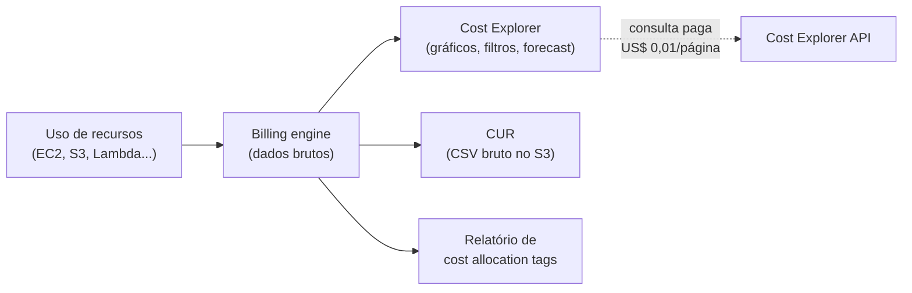
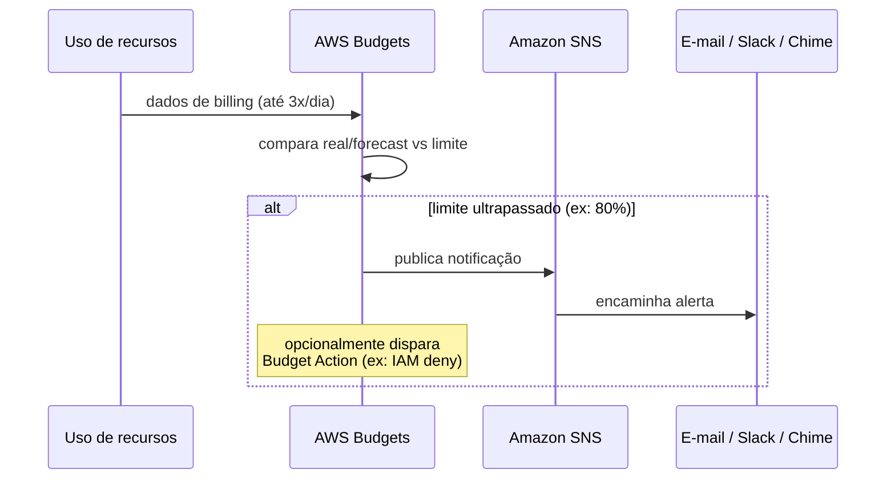
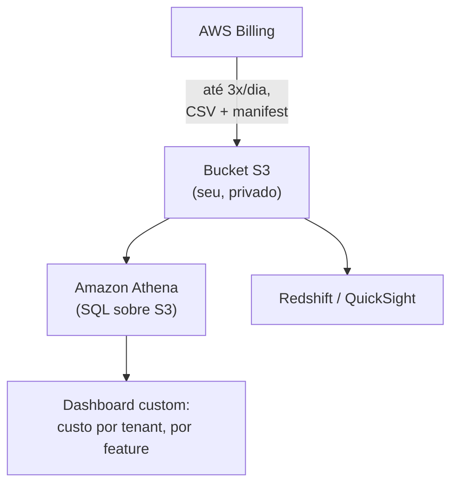

> [!abstract] TL;DR
> Você não otimiza o que não enxerga. **AWS Cost Explorer** mostra visualmente onde o dinheiro está indo (serviço, tempo, tag) e projeta o futuro; **AWS Budgets** dispara alerta antes — ou logo depois — de estourar um limite; **cost allocation tags** quebram a fatura por time/projeto/ambiente; o **Cost and Usage Report (CUR)** é o dado bruto, linha a linha, pra quem quer construir em cima; **Cost Anomaly Detection** usa ML pra flagrar gasto fora do padrão. Tudo isso alimenta duas perguntas de negócio: *showback* (mostrar o custo pro time) e *chargeback* (cobrar o time por ele) — e a métrica que fecha o ciclo, o **custo unitário** (por cliente, por request). Na DigitalOcean o painel de billing é deliberadamente mais simples: um alerta de limiar único por equipe, fatura consolidada, e — desde julho de 2026 — exportação de CSV com coluna de tag pra alocação básica. Não existe um Cost Explorer equivalente, e essa ausência é, em si, um traço de design: menos ferramenta porque o preço é mais previsível.

## O problema: a fatura chegou, e ninguém sabe explicar

Lá no [[03-Dominios/Tecnologia/Cloud/19 - FinOps — a economia da cloud/02 - Modelos de precificação|galho anterior]] você viu *como* a AWS e a DigitalOcean cobram — sob demanda, reservado, spot, egress, o catálogo inteiro de alavancas de preço. Mas conhecer o cardápio não é a mesma coisa que saber o que você pediu. Depois dos blocos 1 a 3 desta trilha você desenhou VPCs, subnets, NAT Gateways, instâncias EC2 ou Droplets, funções Lambda, filas, bancos gerenciados, CDN, WAF... uma arquitetura real, com dezenas de recursos vivos. Alguns desses custos já apareceram espalhados pelo caminho: o NAT Gateway que cobra por hora *e* por GB processado, o Fargate que cobra vCPU-hora e memória-hora, o Lambda que cobra por invocação e duração, o Shield Advanced com sua taxa mensal fixa de proteção.

Agora chega o fim do mês. A fatura tem um número — digamos, US$ 14.328,17 — e ninguém no time sabe dizer *por quê*. Foi o ambiente de staging que ninguém desligou na sexta? Foi um bug em loop que multiplicou invocações Lambda por 50x? Foi simplesmente o crescimento orgânico do produto? Sem uma resposta, a reação típica é pânico: cortar tudo, congelar deploys, ou pior, ignorar e esperar que o próximo mês seja melhor.

Esse é o vácuo que a disciplina de **visibilidade e alocação de custo** preenche. Ela não otimiza nada — isso é para a próxima nota. Ela responde, com dados, três perguntas: *quanto*, *onde* e *quem*. E cada provedor resolve isso com uma filosofia de ferramenta bem diferente, e isso não é acidente: reflete o quanto cada plataforma *precisa* dessas ferramentas para ser inteligível.

## AWS Cost Explorer: o painel visual

O **Cost Explorer** é a lente principal da AWS para enxergar gasto histórico e futuro. Ele usa o mesmo dataset que gera o CUR e os relatórios detalhados de faturamento — ou seja, não é uma fonte paralela de verdade, é uma *visualização* da mesma verdade.



> [!info] Verificado em 2026-07-24 (docs.aws.amazon.com/cost-management)
> Ao ativar o Cost Explorer, a AWS processa até **13 meses** de histórico e calcula **forecast para os próximos 18 meses**. Os dados do mês corrente ficam disponíveis em cerca de 24 horas; o restante do histórico leva alguns dias a mais. O refresh acontece pelo menos uma vez a cada 24h. O uso pela interface web é gratuito; cada chamada paginada à API do Cost Explorer custa US$ 0,01.

Na prática, você abre o Cost Explorer e agrupa custo por **serviço**, por **tag**, por **conta linked** (se estiver em Organizations), por **região** ou por **tipo de uso**, e visualiza a série temporal — diário ou mensal — junto com a linha de forecast. É a ferramenta certa pra responder "o gasto com RDS subiu 40% este mês, quando começou?" em segundos, sem escrever uma linha de SQL.

O forecast do Cost Explorer usa modelos de séries temporais sobre seu histórico — não é uma promessa contratual, é uma projeção estatística. Ele fica pior quanto mais errático for seu padrão de consumo (picos de Black Friday, por exemplo, distorcem a curva).

Um exercício concreto ajuda a fixar o fluxo. Imagine que a fatura veio US$ 4.200 acima do mês anterior. No Cost Explorer, você abre o gráfico, agrupa por **serviço** e olha as barras: RDS subiu pouco, EC2 estável, mas **Data Transfer** triplicou. Você refina o filtro para "Usage Type" e descobre que é `DataTransfer-Out-Bytes` numa região específica. Cruza isso com a tag `project`, e aparece: o time que subiu um novo pipeline de exportação de relatórios para clientes começou a mandar arquivos grandes direto do S3 para fora da AWS, sem CDN na frente. Achou o vilão em três cliques — sem isso, o mesmo diagnóstico exigiria vasculhar dashboards de cada serviço individualmente, ou esperar alguém "lembrar" do que mudou.

## AWS Budgets: a primeira linha de defesa contra o susto na fatura

Se o Cost Explorer é o retrovisor (e o para-brisa do forecast), o **AWS Budgets** é o alarme. Você define um limite — de custo, de uso, ou de cobertura/utilização de Reserved Instances e Savings Plans — e configura para ser notificado quando o gasto real ou *projetado* ultrapassar um percentual desse limite.



Existem seis tipos de orçamento na AWS: **cost budgets** (limite de gasto), **usage budgets** (limite de uso de um serviço), e os pares **utilization/coverage** para RIs e para Savings Plans (alertam quando a utilização cai *abaixo* de um limiar, não acima — o sinal contrário, porque RI ociosa é dinheiro perdido). Você pode configurar alerta tanto para custo **real** (depois de acontecer) quanto para custo **projetado** (antes de acontecer, com base no forecast) — a segunda é a que evita o susto de verdade, porque avisa *antes* do estrago.

> [!info] Verificado em 2026-07-24 (docs.aws.amazon.com/cost-management)
> Os dados do AWS Budgets são atualizados até **3 vezes por dia**, geralmente com 8 a 12 horas de defasagem entre atualizações. As notificações podem ir para Amazon SNS, e-mail, ou ambos. Há uma nota oficial importante: pode haver atraso entre o uso real e a notificação, porque o billing em si tem latência — então Budgets é rede de segurança, não firewall em tempo real.

Um Budget também pode disparar uma **Budget Action** — por exemplo, aplicar automaticamente uma policy IAM que nega a criação de novos recursos quando o gasto bate 100%. Isso transforma o alerta passivo em um freio de emergência, útil em contas de sandbox/dev onde "parar de gastar" é aceitável, mas perigoso em produção (você não quer que o checkout do e-commerce pare de escalar porque o budget estourou).

## Cost allocation tags: quem gastou o quê

Ver o total gasto em EC2 é útil. Ver que o time de Dados gastou US$ 3.200 em EC2 enquanto o time de Plataforma gastou US$ 900 é *acionável*. Essa quebra depende de uma disciplina simples de dizer mas difícil de manter: **tagueamento consistente**.

A AWS distingue dois tipos de cost allocation tag:

- **User-defined tags** — as tags que você mesmo cria e aplica (`team: dados`, `env: production`, `project: checkout-v2`).
- **AWS-generated tags** — tags que a própria AWS (ou um ISV do AWS Marketplace) cria e aplica, como `createdBy`, rastreando quem criou o recurso.

Ambas precisam ser **ativadas separadamente** no console de Billing antes de aparecerem no Cost Explorer ou no relatório de alocação de custo — tag existente na Resource não vira automaticamente dimensão de custo.

> [!info] Verificado em 2026-07-24 (docs.aws.amazon.com/awsaccountbilling)
> Após ativação, as tags podem levar até **24 horas** para aparecer no console de Billing and Cost Management. O relatório de alocação de custo (CSV mensal) inclui recursos tagueados *e* não tagueados, para que o total sempre reconcilie com a fatura real.

Em contas com AWS Organizations, existe ainda a camada de **tag policies** — regras centralizadas que definem quais chaves de tag são válidas e quais valores são aceitos para cada chave (por exemplo, forçar que `env` só aceite `dev`, `staging` ou `production`, nunca `Prod` ou `PRODUCTION` com variação de capitalização). Sem tag policy, é fácil o time A taguear `Environment=prod` e o time B taguear `env=production`, e aí a alocação de custo por ambiente vira uma faxina manual de normalização de string todo mês.

## Cost and Usage Report (CUR): o dado bruto

Cost Explorer e Budgets são leituras *agregadas e visuais* — ótimas para responder perguntas do dia a dia, ruins quando você precisa cruzar custo com métricas de negócio (custo por tenant, por feature flag, por cliente pagante). Para isso existe o **Cost and Usage Report (CUR)**: o dado granular, linha a linha, entregue como CSV num bucket S3 que você controla.



Cada linha do CUR representa uma combinação única de produto, tipo de uso e operação. É possível agregar por hora, dia ou mês, e o relatório cresce — quando passa de ~1 milhão de linhas, a AWS o divide em múltiplos arquivos na mesma pasta do S3.

> [!info] Verificado em 2026-07-24 (docs.aws.amazon.com/cur)
> O primeiro relatório pode levar até 24h para ser entregue depois de criado; depois disso, é atualizado pelo menos uma vez ao dia (a AWS diz "até 3x/dia"), sendo cumulativo dentro do mês corrente. Integra nativamente com Amazon Athena, Redshift e Amazon Quick (ex-QuickSight).

É o CUR que alimenta os pipelines de dados que constroem **unit economics** de verdade — custo de infra dividido pelo número de requests, de usuários ativos, ou de pedidos processados. Sem essa granularidade, você sabe que gastou X, mas não sabe se X está *melhorando* ou *piorando* relativo ao crescimento do produto — e essa relação é o verdadeiro objetivo de qualquer prática de FinOps madura.

## Showback vs. chargeback vs. custo unitário

Três conceitos que aparecem juntos e se confundem:

- **Showback** — mostrar ao time quanto ele gasta, sem cobrar nada de verdade. É um relatório, um dashboard, um Slack bot mensal. O objetivo é gerar consciência: "olha, seu ambiente de staging custou US$ 800 este mês" — sem mover orçamento entre centros de custo.
- **Chargeback** — cobrar de fato. O custo de infraestrutura vira uma linha no orçamento interno do time, deduzida como se fosse uma despesa real daquele centro de custo. Isso exige alocação muito mais rigorosa (tags corretas, sem "custos compartilhados" jogados numa conta genérica) porque agora tem dinheiro de verdade mudando de mão dentro da empresa.
- **Custo unitário** (unit cost) — a métrica que dá sentido de negócio ao número absoluto: custo por cliente, por request, por pedido processado, por GB armazenado por usuário. US$ 50 mil de fatura AWS é assustador isolado; US$ 0,003 por request quando você processa 15 bilhões de requests por mês pode ser, na verdade, ótimo — e em queda, se o produto está escalando com eficiência.

A maioria das organizações começa com showback (é político mais fácil de vender) e evolui para chargeback só quando a cultura de FinOps amadurece — cobrar sem visibilidade prévia gera atrito e resistência dos times de engenharia, que sentem estar sendo multados por algo que nunca aprenderam a controlar.

## Cost Anomaly Detection: o vigia estatístico

Budgets exige que você defina um limite manualmente — e limites fixos não capturam padrões sazonais nem crescimento orgânico normal. O **AWS Cost Anomaly Detection** usa modelos de machine learning para aprender o padrão *esperado* de gasto (incluindo sazonalidade semanal ou mensal) e alertar quando o gasto real destoa desse padrão — sem que você precise adivinhar um número de limite.

> [!info] Verificado em 2026-07-24 (docs.aws.amazon.com/cost-management)
> Roda cerca de 3 vezes por dia sobre o custo líquido não bloqueado (net unblended), com até 24h de atraso desde o uso real. Um monitor recém-criado pode levar 24h para começar a detectar; para um serviço totalmente novo na conta, são necessários 10 dias de histórico antes que anomalias possam ser detectadas nele. A causa raiz é decomposta em até quatro dimensões: serviço, conta, região ou tipo de uso.

Um detalhe que pega gente desprevenida: o Cost Anomaly Detection **não monitora produtos de terceiros do AWS Marketplace** — incluindo modelos de LLM de terceiros no Amazon Bedrock (que aparecem na fatura sob a entidade legal do fornecedor, não da AWS). Se sua conta usa Bedrock com modelos de terceiros, a defesa contra bill shock ali é o AWS Budgets com filtro por *billing entity*, não o Anomaly Detection.

Um cenário típico onde o Anomaly Detection brilha e o Budget tradicional falha: um budget mensal de US$ 10.000 configurado para alertar em 80% (US$ 8.000) não dispara nada se, no dia 3 do mês, alguém deixar um cluster de teste rodando 24/7 gerando US$ 300/dia extra — porque o total acumulado ainda está longe do limiar mensal. O Anomaly Detection, em contraste, compara o *ritmo diário* contra o padrão esperado e alerta já no segundo ou terceiro dia, quando o desvio de US$ 300/dia já destoa da sazonalidade aprendida — semanas antes de o budget mensal sequer perceber o problema.

## Um exemplo de consulta direta ao CUR via Athena

Depois que o CUR está fluindo para o S3, uma pergunta comum é "qual o custo unitário por tenant no mês passado?" — algo que nenhuma das ferramentas visuais resolve sozinha, porque `tenant_id` é uma tag de aplicação, não uma dimensão nativa da AWS. Com o CUR já particionado no Athena, a consulta fica direta:

```sql
SELECT
    resource_tags_user_tenant_id AS tenant,
    SUM(line_item_unblended_cost) AS custo_total_usd,
    COUNT(DISTINCT line_item_resource_id) AS recursos_distintos
FROM cur_database.cost_and_usage_report
WHERE line_item_usage_start_date >= DATE '2026-06-01'
  AND line_item_usage_start_date <  DATE '2026-07-01'
  AND resource_tags_user_tenant_id IS NOT NULL
GROUP BY resource_tags_user_tenant_id
ORDER BY custo_total_usd DESC
LIMIT 20;
```

Note o prefixo `resource_tags_user_` — é assim que o CUR expõe cada tag ativada como coluna própria. Sem a tag `tenant_id` aplicada consistentemente em todo recurso multi-tenant (banco, fila, bucket), essa consulta simplesmente não existe: a granularidade do CUR só vale o que a disciplina de tagueamento colocou nela.

## A lente DigitalOcean: simples porque precisa ser menos

Aqui a inversão da lente dupla, que aparece pela primeira vez nesta trilha, fica nítida. Na AWS, a superfície de custo é tão grande e o pricing tão granular (por hora, por GB, por request, por milissegundo de execução) que sem Cost Explorer, Budgets, tags e CUR você simplesmente **não consegue** entender sua fatura. A ferramenta de visibilidade é uma consequência direta da complexidade do modelo de preço.

Na DigitalOcean, a filosofia de preço é outra: instâncias com custo mensal previsível, poucos serviços com cobrança por uso granular (principalmente egress de banda e Spaces), e por isso o ferramental de billing é deliberadamente mais magro:

- **Billing alerts** — um único limiar de gasto mensal por equipe (US$ 20 por padrão), que dispara um e-mail quando o gasto acumulado ultrapassa o valor. Não é um cost cap — não impede consumo, apenas avisa.
- **Faturas (invoices)** — geradas automaticamente no primeiro dia do ciclo, ou quando o saldo da conta atinge certos limiares.
- **Organizations** — agrupam múltiplos times para faturamento e pagamento consolidados, com visibilidade de gasto por time dentro da organização.
- **Exportação de CSV com tag** — a partir de julho de 2026, os exports de invoice e de billing insights passaram a incluir uma coluna `tag_name`, permitindo alocação de custo básica por tag aplicada ao recurso.

> [!info] Verificado em 2026-07-24 (via busca — não há página oficial de billing alerts acessível via fetch direto no momento da escrita; confirmar contra docs.digitalocean.com/platform/billing/ na próxima revisão)
> A DigitalOcean não oferece equivalente a Cost Explorer (nenhuma análise visual por serviço/tempo com forecast), nem a Budgets granular por projeto/serviço, nem a um CUR line-item. O billing alert é único por equipe, não por projeto. Isso é uma lacuna real, não um detalhe de documentação — mas é consistente com a filosofia da DO: menos superfície de preço, menos necessidade de instrumentação pra entendê-la.

Vale registrar isso com honestidade nos dois sentidos: para uma equipe pequena rodando alguns Droplets e um banco gerenciado, a ausência de um Cost Explorer não é uma perda sensível — a fatura já é legível a olho nu. Para uma operação com dezenas de projetos e centenas de recursos, a mesma ausência vira ponto de dor real, e times nesse estágio frequentemente recorrem a ferramentas de terceiros (como o Bill.DO da comunidade) para preencher a lacuna que a própria AWS resolve nativamente.

## Tabela de tradução: Azure e GCP

| Conceito | AWS | DigitalOcean | Azure | GCP |
|---|---|---|---|---|
| Análise visual de custo | Cost Explorer | *(sem equivalente)* | Cost Management + Cost analysis | Cloud Billing Reports |
| Orçamento com alerta | AWS Budgets | Billing alert (único, por equipe) | Azure Budgets | Budgets & alerts (Cloud Billing) |
| Dado bruto detalhado | Cost and Usage Report (CUR) | Export CSV (com `tag_name`) | Cost Management exports | BigQuery Billing Export |
| Tag de alocação de custo | Cost allocation tags | Tags (via CSV export) | Resource tags (cost analysis) | Labels |
| Detecção de anomalia | Cost Anomaly Detection | *(sem equivalente)* | Anomaly detection (Cost Management) | Anomaly detection (limitado, via recommender) |

## Código: instrumentando a visibilidade na AWS

Criar um budget de custo com alerta em 80% (real) e 100% (forecast), via AWS CLI:

```bash
aws budgets create-budget \
  --account-id 123456789012 \
  --budget '{
    "BudgetName": "monthly-checkout-team",
    "BudgetLimit": {"Amount": "5000", "Unit": "USD"},
    "TimeUnit": "MONTHLY",
    "BudgetType": "COST",
    "CostFilters": {"TagKeyValue": ["user:team$checkout"]}
  }' \
  --notifications-with-subscribers '[
    {
      "Notification": {
        "NotificationType": "ACTUAL",
        "ComparisonOperator": "GREATER_THAN",
        "Threshold": 80
      },
      "Subscribers": [{"SubscriptionType": "SNS", "Address": "arn:aws:sns:us-east-1:123456789012:budget-alerts"}]
    },
    {
      "Notification": {
        "NotificationType": "FORECASTED",
        "ComparisonOperator": "GREATER_THAN",
        "Threshold": 100
      },
      "Subscribers": [{"SubscriptionType": "EMAIL", "Address": "sre-team@empresa.com"}]
    }
  ]'
```

Ativando cost allocation tags de usuário via CLI (uma vez por conta):

```bash
aws ce update-cost-allocation-tags-status \
  --cost-allocation-tags-status '[
    {"TagKey": "team", "Status": "Active"},
    {"TagKey": "env", "Status": "Active"},
    {"TagKey": "project", "Status": "Active"}
  ]'
```

Uma tag policy mínima via AWS Organizations, forçando valores válidos para `env`:

```json
{
  "tags": {
    "env": {
      "tag_key": {"@@assign": "env"},
      "tag_value": {"@@assign": ["dev", "staging", "production"]},
      "enforced_for": {"@@assign": ["ec2:instance", "rds:db"]}
    }
  }
}
```

Consultando custo agregado por serviço via Cost Explorer API (boto3), últimos 30 dias:

```python
import boto3
from datetime import date, timedelta

ce = boto3.client("ce")

end = date.today()
start = end - timedelta(days=30)

response = ce.get_cost_and_usage(
    TimePeriod={"Start": start.isoformat(), "End": end.isoformat()},
    Granularity="DAILY",
    Metrics=["UnblendedCost"],
    GroupBy=[{"Type": "DIMENSION", "Key": "SERVICE"}],
)

for day in response["ResultsByTime"]:
    for group in day["Groups"]:
        service = group["Keys"][0]
        cost = group["Metrics"]["UnblendedCost"]["Amount"]
        print(f"{day['TimePeriod']['Start']}  {service:35s}  US$ {float(cost):.2f}")
```

> [!warning] Armadilhas
> - **Tag drift**: sem tag policy, `env=Production`, `env=prod` e `Environment=production` viram três dimensões de custo diferentes no relatório — a alocação por ambiente vira lixo até alguém normalizar manualmente.
> - **Recursos não tagueáveis ou esquecidos**: NAT Gateways, IPs elásticos ociosos e volumes EBS órfãos raramente carregam tag de time, e acabam empilhados num "custo não alocado" que ninguém assume.
> - **Budgets não param nada por padrão**: um budget sem Budget Action é só um e-mail. Times ignoram alertas recorrentes até o "alert fatigue" apagar o sinal — trate limiares de budget como você trataria alarmes ruidosos (ver [[03-Dominios/Tecnologia/Cloud/17 - Observabilidade na cloud/04 - Alarmes, SLO e resposta|Alarmes, SLO e resposta]]: alerta sem ação clara na ponta é ruído, não sinal).
> - **Latência de dado**: Cost Explorer, Budgets e Anomaly Detection têm até 24h de atraso. Não são ferramentas de resposta em tempo real a um vazamento de custo agudo (ex: um script em loop infinito criando instâncias) — para isso, você precisa de guardrails preventivos (Service Quotas, SCPs), não de visibilidade reativa.
> - **CUR sem plano de consumo é só um bucket S3 caro de ignorar**: montar o pipeline Athena/Redshift dá trabalho; muitas contas ativam o CUR "porque é best practice" e nunca consultam uma linha dele.

## O que vem a seguir

Visibilidade responde "quanto, onde, quem". A próxima nota desta trilha assume que você já enxerga o problema e vira para a pergunta seguinte: o que fazer a respeito. Rightsizing de instâncias ociosas ou superdimensionadas, Reserved Instances e Savings Plans revisitados sob a ótica de otimização (não só de modelo de precificação), Spot para cargas tolerantes a interrupção, e a decisão constante de quando desligar em vez de otimizar.

## Fontes

- [AWS Cost Explorer — Analyzing your costs and usage](https://docs.aws.amazon.com/cost-management/latest/userguide/ce-what-is.html)
- [AWS Budgets — Managing your costs with AWS Budgets](https://docs.aws.amazon.com/cost-management/latest/userguide/budgets-managing-costs.html)
- [AWS Cost allocation tags](https://docs.aws.amazon.com/awsaccountbilling/latest/aboutv2/cost-alloc-tags.html)
- [AWS Cost and Usage Reports — What is CUR](https://docs.aws.amazon.com/cur/latest/userguide/what-is-cur.html)
- [AWS Cost Anomaly Detection](https://docs.aws.amazon.com/cost-management/latest/userguide/manage-ad.html)
- [DigitalOcean Billing Alerts](https://docs.digitalocean.com/platform/billing/billing-alerts/)
- [DigitalOcean Billing overview](https://docs.digitalocean.com/platform/billing/)
